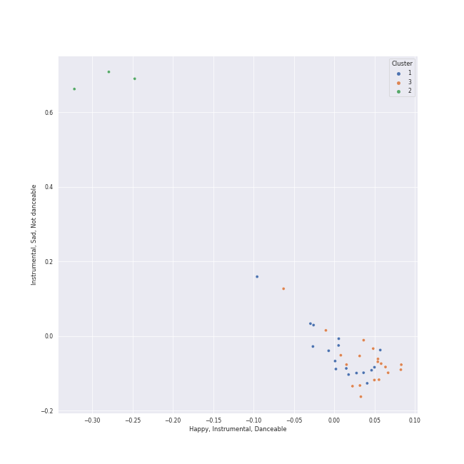

# Clusters in Sony Classical

## Cluster #1

17 tracks

| Art | Track | Album | Artists | Label | 💚 | 🔗 |
|:---|:---|:---|:---|:---|:---|:---|
|  | Cello Suite No. 1 in G Major, BWV 1007: I. Prélude | Bach: Unaccompanied Cello Suites (Remastered) | Yo-Yo Ma, Johann Sebastian Bach | [Sony Classical](../..) | | [🔗](https://open.spotify.com/track/61dYvvfIRtIDFuqZypPAta) |
|  | Cello Suite No. 1 in G Major, BWV 1007: IV. Sarabande | Bach: Unaccompanied Cello Suites (Remastered) | Yo-Yo Ma, Johann Sebastian Bach | [Sony Classical](../..) | | [🔗](https://open.spotify.com/track/7jOJwH4kze92qMREpVI4cr) |
|  | Cello Suite No. 2 in D Minor, BWV 1008: I. Prélude | Bach: Unaccompanied Cello Suites (Remastered) | Yo-Yo Ma, Johann Sebastian Bach | [Sony Classical](../..) | | [🔗](https://open.spotify.com/track/5BSTDnS8drJLOwpL4Co4K2) |
|  | Cello Suite No. 2 in D Minor, BWV 1008: V. Menuets I & II | Bach: Unaccompanied Cello Suites (Remastered) | Yo-Yo Ma, Johann Sebastian Bach | [Sony Classical](../..) | | [🔗](https://open.spotify.com/track/5jpgQbRi4tmOckoeF3v1ye) |
|  | Cello Suite No. 3 in C Major, BWV 1009: IV. Sarabande | Bach: Unaccompanied Cello Suites (Remastered) | Yo-Yo Ma, Johann Sebastian Bach | [Sony Classical](../..) | | [🔗](https://open.spotify.com/track/5MvmCcMhBScIqli00VTblQ) |
|  | Cello Suite No. 4 in E-Flat Major, BWV 1010: IV. Sarabande | Bach: Unaccompanied Cello Suites (Remastered) | Yo-Yo Ma, Johann Sebastian Bach | [Sony Classical](../..) | | [🔗](https://open.spotify.com/track/2Ayg18tDjY3l4ZDNN5vq6O) |
|  | Cello Suite No. 5 in C Minor, BWV 1011: I. Prélude | Bach: Unaccompanied Cello Suites (Remastered) | Yo-Yo Ma, Johann Sebastian Bach | [Sony Classical](../..) | | [🔗](https://open.spotify.com/track/7ekIYM7PEFS47LwMes5Y5g) |
|  | Cello Suite No. 5 in C Minor, BWV 1011: II. Allemande | Bach: Unaccompanied Cello Suites (Remastered) | Yo-Yo Ma, Johann Sebastian Bach | [Sony Classical](../..) | | [🔗](https://open.spotify.com/track/4hB1M0RTIlrbC1DwA6XJ9Q) |
|  | Cello Suite No. 5 in C Minor, BWV 1011: VI. Gigue | Bach: Unaccompanied Cello Suites (Remastered) | Yo-Yo Ma, Johann Sebastian Bach | [Sony Classical](../..) | | [🔗](https://open.spotify.com/track/1QnlHWGQfBbX9q7smtCtSq) |
|  | Cello Suite No. 6 in D Major, BWV 1012: IV. Sarabande | Bach: Unaccompanied Cello Suites (Remastered) | Yo-Yo Ma, Johann Sebastian Bach | [Sony Classical](../..) | | [🔗](https://open.spotify.com/track/1X0ZNb4aZVPZhBrgWwJBJE) |
## Cluster #2

3 tracks

| Art | Track | Album | Artists | Label | 💚 | 🔗 |
|:---|:---|:---|:---|:---|:---|:---|
|  | All I Ask of You | Cappella | Andrew Lloyd Webber, The King's Singers | [Sony Classical](../..), [Sony Music Labels Inc.](../../../sony_music_labels_inc_) | | [🔗](https://open.spotify.com/track/5JTRLqApDZKaIwcopt1d9p) |
|  | Good Vibrations | Cappella | Brian Wilson, Mike Love, The King's Singers | [Sony Classical](../..), [Sony Music Labels Inc.](../../../sony_music_labels_inc_) | | [🔗](https://open.spotify.com/track/14LgsPIZ7xKsfkM50VjxuA) |
|  | Ave Maria | Cappella | Josquin des Prez, The King's Singers | [Sony Classical](../..), [Sony Music Labels Inc.](../../../sony_music_labels_inc_) | | [🔗](https://open.spotify.com/track/6xBGuah2AMT6y5S0HlztUU) |
## Cluster #3

19 tracks

| Art | Track | Album | Artists | Label | 💚 | 🔗 |
|:---|:---|:---|:---|:---|:---|:---|
|  | Cello Suite No. 1 in G Major, BWV 1007: III. Courante | Bach: Unaccompanied Cello Suites (Remastered) | Yo-Yo Ma, Johann Sebastian Bach | [Sony Classical](../..) | | [🔗](https://open.spotify.com/track/70rlzUf9y1skkI3agyvbjg) |
|  | Cello Suite No. 1 in G Major, BWV 1007: VI. Gigue | Bach: Unaccompanied Cello Suites (Remastered) | Yo-Yo Ma, Johann Sebastian Bach | [Sony Classical](../..) | | [🔗](https://open.spotify.com/track/7BWwT75IPTKbHbxn4P6Bwm) |
|  | Cello Suite No. 2 in D Minor, BWV 1008: VI. Gigue | Bach: Unaccompanied Cello Suites (Remastered) | Yo-Yo Ma, Johann Sebastian Bach | [Sony Classical](../..) | | [🔗](https://open.spotify.com/track/5A00HKycJpzTqjo8f9RzkR) |
|  | Cello Suite No. 4 in E-Flat Major, BWV 1010: II. Allemande | Bach: Unaccompanied Cello Suites (Remastered) | Yo-Yo Ma, Johann Sebastian Bach | [Sony Classical](../..) | | [🔗](https://open.spotify.com/track/3oPPgAxqczl1Hx0rBhtTDH) |
|  | Cello Suite No. 4 in E-Flat Major, BWV 1010: III. Courante | Bach: Unaccompanied Cello Suites (Remastered) | Yo-Yo Ma, Johann Sebastian Bach | [Sony Classical](../..) | | [🔗](https://open.spotify.com/track/2oSSC6Si36uySfMMhqN3Ck) |
|  | Cello Suite No. 4 in E-Flat Major, BWV 1010: V. Bourrées I & II | Bach: Unaccompanied Cello Suites (Remastered) | Yo-Yo Ma, Johann Sebastian Bach | [Sony Classical](../..) | | [🔗](https://open.spotify.com/track/7pEmROhQAmH6xGjhlaMTEm) |
|  | Cello Suite No. 5 in C Minor, BWV 1011: III. Courante | Bach: Unaccompanied Cello Suites (Remastered) | Yo-Yo Ma, Johann Sebastian Bach | [Sony Classical](../..) | | [🔗](https://open.spotify.com/track/7HMiAI8QmUWgm5gCWFNH9O) |
|  | Cello Suite No. 5 in C Minor, BWV 1011: V. Gavottes I & II | Bach: Unaccompanied Cello Suites (Remastered) | Yo-Yo Ma, Johann Sebastian Bach | [Sony Classical](../..) | | [🔗](https://open.spotify.com/track/45wXZS6elH1pyW5jMkYPrp) |
|  | Cello Suite No. 6 in D Major, BWV 1012: III. Courante | Bach: Unaccompanied Cello Suites (Remastered) | Yo-Yo Ma, Johann Sebastian Bach | [Sony Classical](../..) | | [🔗](https://open.spotify.com/track/1QSNIfsTBWNmQ2pplTD3xF) |
|  | Cello Suite No. 6 in D Major, BWV 1012: VI. Gigue | Bach: Unaccompanied Cello Suites (Remastered) | Yo-Yo Ma, Johann Sebastian Bach | [Sony Classical](../..) | | [🔗](https://open.spotify.com/track/0w9xYEvm1nd4S9v04zftup) |