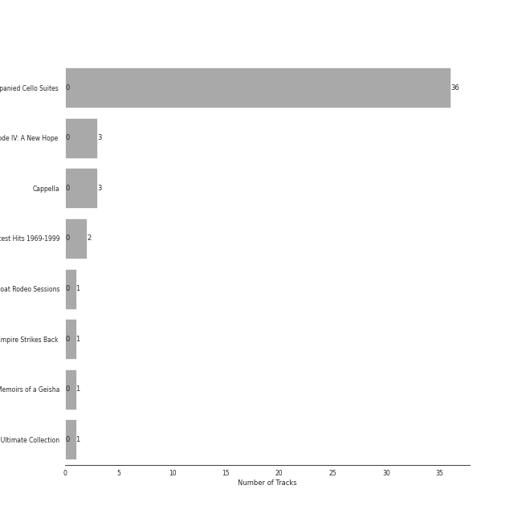

# Sony Classical

48 songs

[See Track Features](audio_features.md)

[See Clusters](clusters/overview.md)

Appears as:
- Sony Classical (45 tracks)
- Sony Classical/Sony Music (3 tracks)

## Top Artists

| Art | Rank | Tracks | 💚 | Artist | 🔗 |
|:---|---:|---:|---:|:---|:---|
|  | 430 | 38 | 0 | Yo-Yo Ma | [🔗](https://open.spotify.com/artist/5Dl3HXZjG6ZOWT5cV375lk) |
|  | 430 | 36 | 0 | [Johann Sebastian Bach](../../artists/johann_sebastian_bach/overview.md) | [🔗](https://open.spotify.com/artist/5aIqB5nVVvmFsvSdExz408) |
|  | 360 | 8 | 0 | John Williams | [🔗](https://open.spotify.com/artist/3dRfiJ2650SZu6GbydcHNb) |
|  | 430 | 5 | 0 | [London Symphony Orchestra](../../artists/london_symphony_orchestra/overview.md) | [🔗](https://open.spotify.com/artist/5yxyJsFanEAuwSM5kOuZKc) |
|  | 430 | 3 | 0 | The King's Singers | [🔗](https://open.spotify.com/artist/5lR7yDVN4z9kahOiUSlMhe) |
|  | 430 | 1 | 0 | Edgar Meyer | [🔗](https://open.spotify.com/artist/7jkhwa4XMe9XSt1r0AWNqD) |
|  | 430 | 1 | 0 | Boston Pops Orchestra | [🔗](https://open.spotify.com/artist/7CIcEIOiWaZcEH35cpsdZq) |
|  | 430 | 1 | 0 | John Neal | [🔗](https://open.spotify.com/artist/5zMZofgPVYk9IVibwopcbY) |
|  | 430 | 1 | 0 | Mike Love | [🔗](https://open.spotify.com/artist/5gr5OoQ4aQdJ3CqOr9v7Bt) |
|  | 430 | 1 | 0 | Stuart Duncan | [🔗](https://open.spotify.com/artist/53pmIwVqcTM68qW6PVhjW2) |

See all 15 artists

| Art | Rank | Tracks | 💚 | Artist | 🔗 |
|:---|---:|---:|---:|:---|:---|
|  | 430 | 1 | 0 | Andrew Lloyd Webber | [🔗](https://open.spotify.com/artist/4aP1lp10BRYZO658B2NwkG) |
|  | 430 | 1 | 0 | Brian Wilson | [🔗](https://open.spotify.com/artist/4Q82S0VzF8qlCb4PnSDurj) |
|  | 430 | 1 | 0 | Josquin des Prez | [🔗](https://open.spotify.com/artist/31f23hmZawdqgp0sECAzE8) |
|  | 430 | 1 | 0 | Chris Thile | [🔗](https://open.spotify.com/artist/1dyGPAYZZHHW6WIqwKN5QF) |
|  | 430 | 1 | 0 | Itzhak Perlman | [🔗](https://open.spotify.com/artist/0hIG9FXgjQxT8fKaYceFbA) |

## Top Albums

| Art | Rank | Tracks | 💚 | Album | Release Date | 🔗 |
|:---|---:|---:|---:|:---|:---|:---|
|  | 652 | 36 | 0 | Bach: Unaccompanied Cello Suites (Remastered) | 1983 | [🔗](https://open.spotify.com/album/2OpnKgmVYPEN2GldgBponI) |
|  | 652 | 3 | 0 | Star Wars Episode IV: A New Hope (Original Motion Picture Soundtrack) | 1997 | [🔗](https://open.spotify.com/album/39vpWS7vrC4Pz33bNafjva) |
|  | 652 | 3 | 0 | Cappella | 2013 | [🔗](https://open.spotify.com/album/3n6JxpdWnHkazMCQxKK5qI) |
|  | 652 | 2 | 0 | John Williams - Greatest Hits 1969-1999 | 2014-08-18 | [🔗](https://open.spotify.com/album/3xeo92ykCYWfe32si3I6zF) |
|  | 652 | 1 | 0 | The Goat Rodeo Sessions | 2011-10-24 | [🔗](https://open.spotify.com/album/3P7xbl4YB4T73vWRHgcHMa) |
|  | 652 | 1 | 0 | Star Wars Episode V: The Empire Strikes Back (Original Motion Picture Soundtrack) | 1997 | [🔗](https://open.spotify.com/album/0a5t6HeElUsxiFrdocSlBM) |
|  | 652 | 1 | 0 | Memoirs of a Geisha | 2005-11-22 | [🔗](https://open.spotify.com/album/4EstIlJ9P9TVBCOlvVLADj) |
|  | 652 | 1 | 0 | John Williams & Steven Spielberg: The Ultimate Collection | 2017-03-17 | [🔗](https://open.spotify.com/album/2K9laKccwpVMQf2lJoVJVg) |

## Genres

| Tracks | 💚 | Genre |
|---:|---:|:---|
| 38 | 0 | [classical](../../genres/classical/overview.md) |
| 37 | 0 | [early music](../../genres/early_music/overview.md) |
| 36 | 0 | german baroque |
| 36 | 0 | [baroque](../../genres/baroque/overview.md) |
| 7 | 0 | [soundtrack](../../genres/soundtrack/overview.md) |
| 7 | 0 | orchestral soundtrack |
| 1 | 0 | west end |
| 1 | 0 | sunshine pop |
| 1 | 0 | renaissance |
| 1 | 0 | progressive bluegrass |

See all 16 genres

| Tracks | 💚 | Genre |
|---:|---:|:---|
| 1 | 0 | orchestra |
| 1 | 0 | franco-flemish school |
| 1 | 0 | [broadway](../../genres/broadway/overview.md) |
| 1 | 0 | british orchestra |
| 1 | 0 | bluegrass fiddle |
| 1 | 0 | baroque pop |

## Tracks released under Sony Classical

| Art | Track | Album | Artists | Label | Rank | 💚 | 🔗 |
|:---|:---|:---|:---|:---|---:|:---|:---|
|  | Cello Suite No. 1 in G Major, BWV 1007: I. Prélude | Bach: Unaccompanied Cello Suites (Remastered) | [Johann Sebastian Bach](../../artists/johann_sebastian_bach/overview.md), Yo-Yo Ma | [Sony Classical](.) | 996 | | [🔗](https://open.spotify.com/track/61dYvvfIRtIDFuqZypPAta) |
|  | Cello Suite No. 1 in G Major, BWV 1007: II. Allemande | Bach: Unaccompanied Cello Suites (Remastered) | [Johann Sebastian Bach](../../artists/johann_sebastian_bach/overview.md), Yo-Yo Ma | [Sony Classical](.) | 996 | | [🔗](https://open.spotify.com/track/1gs4pls8VN4StOUYSVG0nU) |
|  | Cello Suite No. 1 in G Major, BWV 1007: III. Courante | Bach: Unaccompanied Cello Suites (Remastered) | [Johann Sebastian Bach](../../artists/johann_sebastian_bach/overview.md), Yo-Yo Ma | [Sony Classical](.) | 996 | | [🔗](https://open.spotify.com/track/70rlzUf9y1skkI3agyvbjg) |
|  | Cello Suite No. 1 in G Major, BWV 1007: IV. Sarabande | Bach: Unaccompanied Cello Suites (Remastered) | [Johann Sebastian Bach](../../artists/johann_sebastian_bach/overview.md), Yo-Yo Ma | [Sony Classical](.) | 996 | | [🔗](https://open.spotify.com/track/7jOJwH4kze92qMREpVI4cr) |
|  | Cello Suite No. 1 in G Major, BWV 1007: V. Menuets I & II | Bach: Unaccompanied Cello Suites (Remastered) | [Johann Sebastian Bach](../../artists/johann_sebastian_bach/overview.md), Yo-Yo Ma | [Sony Classical](.) | 996 | | [🔗](https://open.spotify.com/track/4JXQV1LS3lw09MwCFFASso) |
|  | Cello Suite No. 1 in G Major, BWV 1007: VI. Gigue | Bach: Unaccompanied Cello Suites (Remastered) | [Johann Sebastian Bach](../../artists/johann_sebastian_bach/overview.md), Yo-Yo Ma | [Sony Classical](.) | 996 | | [🔗](https://open.spotify.com/track/7BWwT75IPTKbHbxn4P6Bwm) |
|  | Cello Suite No. 2 in D Minor, BWV 1008: I. Prélude | Bach: Unaccompanied Cello Suites (Remastered) | [Johann Sebastian Bach](../../artists/johann_sebastian_bach/overview.md), Yo-Yo Ma | [Sony Classical](.) | 996 | | [🔗](https://open.spotify.com/track/5BSTDnS8drJLOwpL4Co4K2) |
|  | Cello Suite No. 2 in D Minor, BWV 1008: II. Allemande | Bach: Unaccompanied Cello Suites (Remastered) | [Johann Sebastian Bach](../../artists/johann_sebastian_bach/overview.md), Yo-Yo Ma | [Sony Classical](.) | 996 | | [🔗](https://open.spotify.com/track/5zlzCvtuUTEDWOTdqWlizb) |
|  | Cello Suite No. 2 in D Minor, BWV 1008: III. Courante | Bach: Unaccompanied Cello Suites (Remastered) | [Johann Sebastian Bach](../../artists/johann_sebastian_bach/overview.md), Yo-Yo Ma | [Sony Classical](.) | 996 | | [🔗](https://open.spotify.com/track/3foD7uASyvlyCwIq2y9zxB) |
|  | Cello Suite No. 2 in D Minor, BWV 1008: IV. Sarabande | Bach: Unaccompanied Cello Suites (Remastered) | [Johann Sebastian Bach](../../artists/johann_sebastian_bach/overview.md), Yo-Yo Ma | [Sony Classical](.) | 996 | | [🔗](https://open.spotify.com/track/1hzmdkWXise3bM612puWKi) |

See all tracks

| Art | Track | Album | Artists | Label | Rank | 💚 | 🔗 |
|:---|:---|:---|:---|:---|---:|:---|:---|
|  | Cello Suite No. 2 in D Minor, BWV 1008: V. Menuets I & II | Bach: Unaccompanied Cello Suites (Remastered) | [Johann Sebastian Bach](../../artists/johann_sebastian_bach/overview.md), Yo-Yo Ma | [Sony Classical](.) | 996 | | [🔗](https://open.spotify.com/track/5jpgQbRi4tmOckoeF3v1ye) |
|  | Cello Suite No. 2 in D Minor, BWV 1008: VI. Gigue | Bach: Unaccompanied Cello Suites (Remastered) | [Johann Sebastian Bach](../../artists/johann_sebastian_bach/overview.md), Yo-Yo Ma | [Sony Classical](.) | 996 | | [🔗](https://open.spotify.com/track/5A00HKycJpzTqjo8f9RzkR) |
|  | Cello Suite No. 3 in C Major, BWV 1009: I. Prélude | Bach: Unaccompanied Cello Suites (Remastered) | [Johann Sebastian Bach](../../artists/johann_sebastian_bach/overview.md), Yo-Yo Ma | [Sony Classical](.) | 996 | | [🔗](https://open.spotify.com/track/5LhmKtk4jyC1J7eOmJTNBO) |
|  | Cello Suite No. 3 in C Major, BWV 1009: II. Allemande | Bach: Unaccompanied Cello Suites (Remastered) | [Johann Sebastian Bach](../../artists/johann_sebastian_bach/overview.md), Yo-Yo Ma | [Sony Classical](.) | 996 | | [🔗](https://open.spotify.com/track/3iTDxBDvLKwQCKd7OIbNPK) |
|  | Cello Suite No. 3 in C Major, BWV 1009: III. Courante | Bach: Unaccompanied Cello Suites (Remastered) | [Johann Sebastian Bach](../../artists/johann_sebastian_bach/overview.md), Yo-Yo Ma | [Sony Classical](.) | 996 | | [🔗](https://open.spotify.com/track/2gKIaMUAXrVgjJBpxbPrSM) |
|  | Cello Suite No. 3 in C Major, BWV 1009: IV. Sarabande | Bach: Unaccompanied Cello Suites (Remastered) | [Johann Sebastian Bach](../../artists/johann_sebastian_bach/overview.md), Yo-Yo Ma | [Sony Classical](.) | 996 | | [🔗](https://open.spotify.com/track/5MvmCcMhBScIqli00VTblQ) |
|  | Cello Suite No. 3 in C Major, BWV 1009: V. Bourrées I & II | Bach: Unaccompanied Cello Suites (Remastered) | [Johann Sebastian Bach](../../artists/johann_sebastian_bach/overview.md), Yo-Yo Ma | [Sony Classical](.) | 996 | | [🔗](https://open.spotify.com/track/2smEq3BRk5JHBkBWFLupUr) |
|  | Cello Suite No. 3 in C Major, BWV 1009: VI. Gigue | Bach: Unaccompanied Cello Suites (Remastered) | [Johann Sebastian Bach](../../artists/johann_sebastian_bach/overview.md), Yo-Yo Ma | [Sony Classical](.) | 996 | | [🔗](https://open.spotify.com/track/1M5hs1k7GLZU237dOqLdkH) |
|  | Cello Suite No. 4 in E-Flat Major, BWV 1010: I. Prélude | Bach: Unaccompanied Cello Suites (Remastered) | [Johann Sebastian Bach](../../artists/johann_sebastian_bach/overview.md), Yo-Yo Ma | [Sony Classical](.) | 996 | | [🔗](https://open.spotify.com/track/0dDcSr2vBxvILNB8oTpI01) |
|  | Cello Suite No. 4 in E-Flat Major, BWV 1010: II. Allemande | Bach: Unaccompanied Cello Suites (Remastered) | [Johann Sebastian Bach](../../artists/johann_sebastian_bach/overview.md), Yo-Yo Ma | [Sony Classical](.) | 996 | | [🔗](https://open.spotify.com/track/3oPPgAxqczl1Hx0rBhtTDH) |
|  | Cello Suite No. 4 in E-Flat Major, BWV 1010: III. Courante | Bach: Unaccompanied Cello Suites (Remastered) | [Johann Sebastian Bach](../../artists/johann_sebastian_bach/overview.md), Yo-Yo Ma | [Sony Classical](.) | 996 | | [🔗](https://open.spotify.com/track/2oSSC6Si36uySfMMhqN3Ck) |
|  | Cello Suite No. 4 in E-Flat Major, BWV 1010: IV. Sarabande | Bach: Unaccompanied Cello Suites (Remastered) | [Johann Sebastian Bach](../../artists/johann_sebastian_bach/overview.md), Yo-Yo Ma | [Sony Classical](.) | 996 | | [🔗](https://open.spotify.com/track/2Ayg18tDjY3l4ZDNN5vq6O) |
|  | Cello Suite No. 4 in E-Flat Major, BWV 1010: V. Bourrées I & II | Bach: Unaccompanied Cello Suites (Remastered) | [Johann Sebastian Bach](../../artists/johann_sebastian_bach/overview.md), Yo-Yo Ma | [Sony Classical](.) | 996 | | [🔗](https://open.spotify.com/track/7pEmROhQAmH6xGjhlaMTEm) |
|  | Cello Suite No. 4 in E-Flat Major, BWV 1010: VI. Gigue | Bach: Unaccompanied Cello Suites (Remastered) | [Johann Sebastian Bach](../../artists/johann_sebastian_bach/overview.md), Yo-Yo Ma | [Sony Classical](.) | 996 | | [🔗](https://open.spotify.com/track/2Y9HshitG2sK0LZjNHsVJC) |
|  | Cello Suite No. 5 in C Minor, BWV 1011: I. Prélude | Bach: Unaccompanied Cello Suites (Remastered) | [Johann Sebastian Bach](../../artists/johann_sebastian_bach/overview.md), Yo-Yo Ma | [Sony Classical](.) | 996 | | [🔗](https://open.spotify.com/track/7ekIYM7PEFS47LwMes5Y5g) |
|  | Cello Suite No. 5 in C Minor, BWV 1011: II. Allemande | Bach: Unaccompanied Cello Suites (Remastered) | [Johann Sebastian Bach](../../artists/johann_sebastian_bach/overview.md), Yo-Yo Ma | [Sony Classical](.) | 996 | | [🔗](https://open.spotify.com/track/4hB1M0RTIlrbC1DwA6XJ9Q) |
|  | Cello Suite No. 5 in C Minor, BWV 1011: III. Courante | Bach: Unaccompanied Cello Suites (Remastered) | [Johann Sebastian Bach](../../artists/johann_sebastian_bach/overview.md), Yo-Yo Ma | [Sony Classical](.) | 996 | | [🔗](https://open.spotify.com/track/7HMiAI8QmUWgm5gCWFNH9O) |
|  | Cello Suite No. 5 in C Minor, BWV 1011: IV. Sarabande | Bach: Unaccompanied Cello Suites (Remastered) | [Johann Sebastian Bach](../../artists/johann_sebastian_bach/overview.md), Yo-Yo Ma | [Sony Classical](.) | 996 | | [🔗](https://open.spotify.com/track/3TILjRV9ZYEEfJcF6Re3H4) |
|  | Cello Suite No. 5 in C Minor, BWV 1011: V. Gavottes I & II | Bach: Unaccompanied Cello Suites (Remastered) | [Johann Sebastian Bach](../../artists/johann_sebastian_bach/overview.md), Yo-Yo Ma | [Sony Classical](.) | 996 | | [🔗](https://open.spotify.com/track/45wXZS6elH1pyW5jMkYPrp) |
|  | Cello Suite No. 5 in C Minor, BWV 1011: VI. Gigue | Bach: Unaccompanied Cello Suites (Remastered) | [Johann Sebastian Bach](../../artists/johann_sebastian_bach/overview.md), Yo-Yo Ma | [Sony Classical](.) | 996 | | [🔗](https://open.spotify.com/track/1QnlHWGQfBbX9q7smtCtSq) |
|  | Cello Suite No. 6 in D Major, BWV 1012: I. Prélude | Bach: Unaccompanied Cello Suites (Remastered) | [Johann Sebastian Bach](../../artists/johann_sebastian_bach/overview.md), Yo-Yo Ma | [Sony Classical](.) | 996 | | [🔗](https://open.spotify.com/track/7j8Zvc4SWkmjohXxuraria) |
|  | Cello Suite No. 6 in D Major, BWV 1012: II. Allemande | Bach: Unaccompanied Cello Suites (Remastered) | [Johann Sebastian Bach](../../artists/johann_sebastian_bach/overview.md), Yo-Yo Ma | [Sony Classical](.) | 996 | | [🔗](https://open.spotify.com/track/3kCQjHGEzgy9JOqr6fgxDv) |
|  | Cello Suite No. 6 in D Major, BWV 1012: III. Courante | Bach: Unaccompanied Cello Suites (Remastered) | [Johann Sebastian Bach](../../artists/johann_sebastian_bach/overview.md), Yo-Yo Ma | [Sony Classical](.) | 996 | | [🔗](https://open.spotify.com/track/1QSNIfsTBWNmQ2pplTD3xF) |
|  | Cello Suite No. 6 in D Major, BWV 1012: IV. Sarabande | Bach: Unaccompanied Cello Suites (Remastered) | [Johann Sebastian Bach](../../artists/johann_sebastian_bach/overview.md), Yo-Yo Ma | [Sony Classical](.) | 996 | | [🔗](https://open.spotify.com/track/1X0ZNb4aZVPZhBrgWwJBJE) |
|  | Cello Suite No. 6 in D Major, BWV 1012: V. Gavottes I & II | Bach: Unaccompanied Cello Suites (Remastered) | [Johann Sebastian Bach](../../artists/johann_sebastian_bach/overview.md), Yo-Yo Ma | [Sony Classical](.) | 996 | | [🔗](https://open.spotify.com/track/4R4FvSsQcwvAha9z0rhkSC) |
|  | Cello Suite No. 6 in D Major, BWV 1012: VI. Gigue | Bach: Unaccompanied Cello Suites (Remastered) | [Johann Sebastian Bach](../../artists/johann_sebastian_bach/overview.md), Yo-Yo Ma | [Sony Classical](.) | 996 | | [🔗](https://open.spotify.com/track/0w9xYEvm1nd4S9v04zftup) |
|  | Cantina Band | Star Wars Episode IV: A New Hope (Original Motion Picture Soundtrack) | John Williams, [London Symphony Orchestra](../../artists/london_symphony_orchestra/overview.md) | [Sony Classical](.) | 996 | | [🔗](https://open.spotify.com/track/1jUPOeAOtsjjV1jUWc2H1g) |
|  | Main Title/Rebel Blockade Runner - Medley | Star Wars Episode IV: A New Hope (Original Motion Picture Soundtrack) | John Williams, [London Symphony Orchestra](../../artists/london_symphony_orchestra/overview.md) | [Sony Classical](.) | 996 | | [🔗](https://open.spotify.com/track/5jMfUVMOGlEkEYc3aSYnWm) |
|  | Princess Leia's Theme | Star Wars Episode IV: A New Hope (Original Motion Picture Soundtrack) | John Williams, [London Symphony Orchestra](../../artists/london_symphony_orchestra/overview.md) | [Sony Classical](.) | 996 | | [🔗](https://open.spotify.com/track/1hQ90DXmLxPMYpIh3o0bLM) |
|  | The Imperial March (Darth Vader's Theme) | Star Wars Episode V: The Empire Strikes Back (Original Motion Picture Soundtrack) | John Williams, John Neal | [Sony Classical](.) | 996 | | [🔗](https://open.spotify.com/track/62HY7V5hRKtfIZ7uCYqYqu) |
|  | Sayuri's Theme | Memoirs of a Geisha | John Williams, Yo-Yo Ma, Itzhak Perlman | [Sony Classical](.) | 996 | | [🔗](https://open.spotify.com/track/66EIPOdC3UZZCJdiUSRo92) |
|  | Attaboy | The Goat Rodeo Sessions | Stuart Duncan, Edgar Meyer, Chris Thile, Yo-Yo Ma | [Sony Classical](.) | 996 | | [🔗](https://open.spotify.com/track/2Y0tFR4iYR57EnBK4mf34l) |
|  | All I Ask of You | Cappella | Andrew Lloyd Webber, The King's Singers | [Sony Classical](.), [Sony Music Labels Inc.](../sony_music_labels_inc_) | 996 | | [🔗](https://open.spotify.com/track/5JTRLqApDZKaIwcopt1d9p) |
|  | Ave Maria | Cappella | Josquin des Prez, The King's Singers | [Sony Classical](.), [Sony Music Labels Inc.](../sony_music_labels_inc_) | 996 | | [🔗](https://open.spotify.com/track/6xBGuah2AMT6y5S0HlztUU) |
|  | Good Vibrations | Cappella | Brian Wilson, Mike Love, The King's Singers | [Sony Classical](.), [Sony Music Labels Inc.](../sony_music_labels_inc_) | 996 | | [🔗](https://open.spotify.com/track/14LgsPIZ7xKsfkM50VjxuA) |
|  | Flying Theme (From "E.T. the Extra-Terrestrial") | John Williams - Greatest Hits 1969-1999 | John Williams, [London Symphony Orchestra](../../artists/london_symphony_orchestra/overview.md) | [Sony Classical](.) | 996 | | [🔗](https://open.spotify.com/track/4J9mulgiRlkkgdAONNVGQv) |
|  | Main Theme (From "Jaws") | John Williams - Greatest Hits 1969-1999 | [London Symphony Orchestra](../../artists/london_symphony_orchestra/overview.md), John Williams | [Sony Classical](.) | 996 | | [🔗](https://open.spotify.com/track/5whNZNve2pi9zxmAIXYVom) |
|  | Jaws: Title Theme | John Williams & Steven Spielberg: The Ultimate Collection | John Williams, Boston Pops Orchestra | [Sony Classical](.) | 996 | | [🔗](https://open.spotify.com/track/4hTHsIZPJBDOS1P6LMbiVw) |

