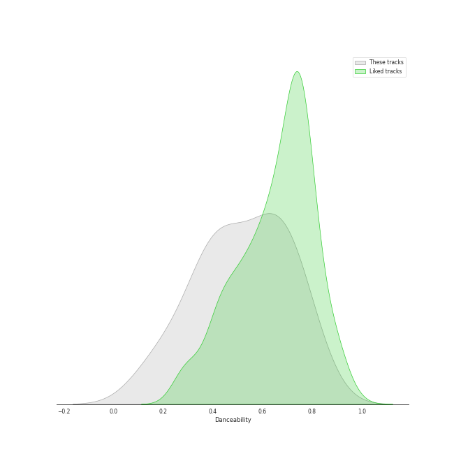
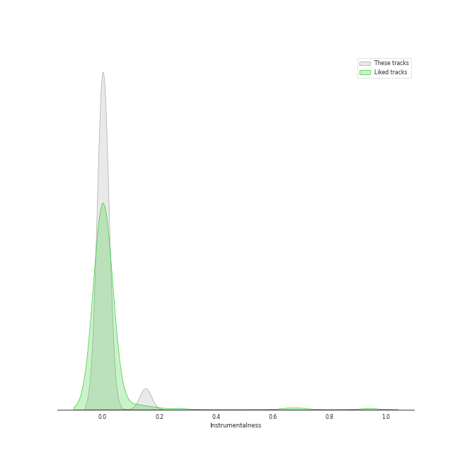
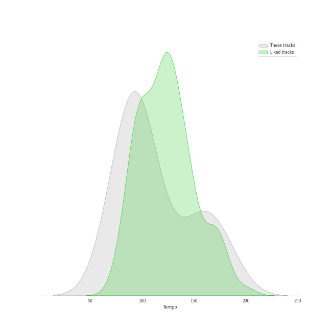

# Audio Features for Sony Music Labels Inc.

## Danceability

| ​ | 10 most Danceable tracks | ​​ | 10 least Danceable tracks |
|:---|:---|:---|:---|
|  | Make you happy (0.78) |  | Ave Maria (0.15) |
|  | CIRCUS (0.767) |  | All I Ask of You (0.236) |
|  | There (0.712) |  | ベテルギウス (0.367) |
|  | PINK BLOOD (0.666) |  | abnormalize (0.373) |
|  | 恋人じゃなくなった日 (0.636) |  | Good Vibrations (0.415) |
|  | 白日 (0.599) |  | ドライフラワー (0.463) |
|  | 砂の惑星 ( + 初音ミク ) (0.507) |  | 炎 (0.477) |
|  | 炎 (0.477) |  | 砂の惑星 ( + 初音ミク ) (0.507) |
|  | ドライフラワー (0.463) |  | 白日 (0.599) |
|  | Good Vibrations (0.415) |  | 恋人じゃなくなった日 (0.636) |

## Energy

| ​ | 10 most Energetic tracks | ​​ | 10 least Energetic tracks |
|:---|:---|:---|:---|
|  | 砂の惑星 ( + 初音ミク ) (0.94) |  | All I Ask of You (0.0636) |
|  | abnormalize (0.897) |  | Ave Maria (0.104) |
|  | 白日 (0.891) |  | Good Vibrations (0.248) |
|  | Make you happy (0.885) |  | 恋人じゃなくなった日 (0.516) |
|  | CIRCUS (0.809) |  | PINK BLOOD (0.534) |
|  | 炎 (0.685) |  | ドライフラワー (0.603) |
|  | ベテルギウス (0.671) |  | There (0.631) |
|  | There (0.631) |  | ベテルギウス (0.671) |
|  | ドライフラワー (0.603) |  | 炎 (0.685) |
|  | PINK BLOOD (0.534) |  | CIRCUS (0.809) |

## Speechiness

| ​ | 10 most Speechy tracks | ​​ | 10 least Speechy tracks |
|:---|:---|:---|:---|
|  | There (0.122) |  | ドライフラワー (0.0276) |
|  | Make you happy (0.122) |  | 炎 (0.0325) |
|  | 白日 (0.116) |  | Good Vibrations (0.0339) |
|  | CIRCUS (0.0958) |  | 恋人じゃなくなった日 (0.0355) |
|  | 砂の惑星 ( + 初音ミク ) (0.0927) |  | All I Ask of You (0.0377) |
|  | PINK BLOOD (0.0893) |  | Ave Maria (0.0411) |
|  | abnormalize (0.0702) |  | ベテルギウス (0.0478) |
|  | ベテルギウス (0.0478) |  | abnormalize (0.0702) |
|  | Ave Maria (0.0411) |  | PINK BLOOD (0.0893) |
|  | All I Ask of You (0.0377) |  | 砂の惑星 ( + 初音ミク ) (0.0927) |

## Acousticness

| ​ | 10 most Acoustic tracks | ​​ | 10 least Acoustic tracks |
|:---|:---|:---|:---|
|  | Ave Maria (0.991) |  | abnormalize (7.51e-06) |
|  | All I Ask of You (0.98) |  | 砂の惑星 ( + 初音ミク ) (0.0252) |
|  | Good Vibrations (0.893) |  | CIRCUS (0.0337) |
|  | 白日 (0.562) |  | Make you happy (0.0436) |
|  | 恋人じゃなくなった日 (0.549) |  | 炎 (0.105) |
|  | ドライフラワー (0.495) |  | There (0.19) |
|  | PINK BLOOD (0.277) |  | ベテルギウス (0.222) |
|  | ベテルギウス (0.222) |  | PINK BLOOD (0.277) |
|  | There (0.19) |  | ドライフラワー (0.495) |
|  | 炎 (0.105) |  | 恋人じゃなくなった日 (0.549) |

## Instrumentalness

| ​ | 10 most Instrumental tracks | ​​ | 10 least Instrumental tracks |
|:---|:---|:---|:---|
|  | abnormalize (0.151) |  | 炎 (0.0) |
|  | Ave Maria (0.00671) |  | 白日 (0.0) |
|  | Good Vibrations (0.00336) |  | CIRCUS (0.0) |
|  | All I Ask of You (0.00164) |  | 砂の惑星 ( + 初音ミク ) (0.0) |
|  | PINK BLOOD (3.57e-05) |  | ベテルギウス (0.0) |
|  | Make you happy (2.8e-05) |  | ドライフラワー (0.0) |
|  | 恋人じゃなくなった日 (0.0) |  | There (0.0) |
|  | There (0.0) |  | 恋人じゃなくなった日 (0.0) |
|  | ドライフラワー (0.0) |  | Make you happy (2.8e-05) |
|  | ベテルギウス (0.0) |  | PINK BLOOD (3.57e-05) |

## Liveness

| ​ | 10 most Live tracks | ​​ | 10 least Live tracks |
|:---|:---|:---|:---|
|  | ベテルギウス (0.494) |  | CIRCUS (0.0353) |
|  | 白日 (0.322) |  | abnormalize (0.0676) |
|  | 炎 (0.277) |  | 恋人じゃなくなった日 (0.0825) |
|  | Good Vibrations (0.23) |  | All I Ask of You (0.085) |
|  | Ave Maria (0.208) |  | Make you happy (0.105) |
|  | PINK BLOOD (0.179) |  | There (0.106) |
|  | ドライフラワー (0.167) |  | 砂の惑星 ( + 初音ミク ) (0.152) |
|  | 砂の惑星 ( + 初音ミク ) (0.152) |  | ドライフラワー (0.167) |
|  | There (0.106) |  | PINK BLOOD (0.179) |
|  | Make you happy (0.105) |  | Ave Maria (0.208) |

## Valence

| ​ | 10 most Happy tracks | ​​ | 10 least Happy tracks |
|:---|:---|:---|:---|
|  | 砂の惑星 ( + 初音ミク ) (0.917) |  | Ave Maria (0.0558) |
|  | Make you happy (0.808) |  | All I Ask of You (0.106) |
|  | 白日 (0.694) |  | There (0.298) |
|  | ベテルギウス (0.691) |  | 炎 (0.308) |
|  | CIRCUS (0.69) |  | Good Vibrations (0.362) |
|  | PINK BLOOD (0.617) |  | abnormalize (0.369) |
|  | 恋人じゃなくなった日 (0.487) |  | ドライフラワー (0.477) |
|  | ドライフラワー (0.477) |  | 恋人じゃなくなった日 (0.487) |
|  | abnormalize (0.369) |  | PINK BLOOD (0.617) |
|  | Good Vibrations (0.362) |  | CIRCUS (0.69) |

## Tempo

| ​ | 10 most Fast tracks | ​​ | 10 least Fast tracks |
|:---|:---|:---|:---|
|  | ベテルギウス (179.833) |  | Good Vibrations (74.177) |
|  | Make you happy (160.087) |  | 恋人じゃなくなった日 (74.996) |
|  | 炎 (152.04) |  | There (79.984) |
|  | ドライフラワー (148.089) |  | abnormalize (87.477) |
|  | Ave Maria (102.448) |  | 白日 (93.029) |
|  | PINK BLOOD (100.0) |  | 砂の惑星 ( + 初音ミク ) (94.874) |
|  | CIRCUS (97.958) |  | All I Ask of You (95.485) |
|  | All I Ask of You (95.485) |  | CIRCUS (97.958) |
|  | 砂の惑星 ( + 初音ミク ) (94.874) |  | PINK BLOOD (100.0) |
|  | 白日 (93.029) |  | Ave Maria (102.448) |
