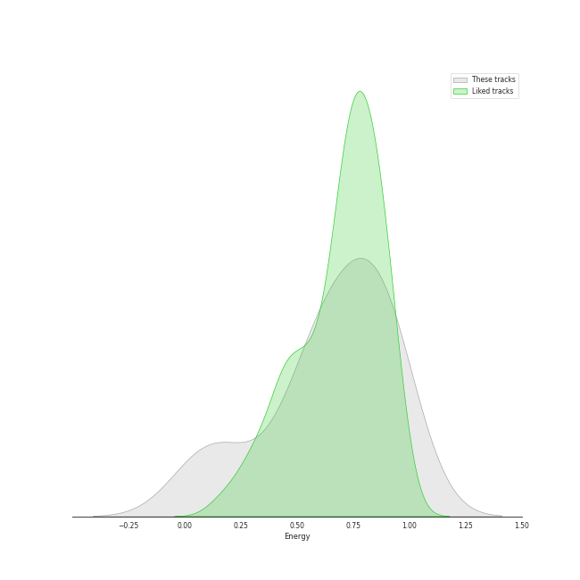
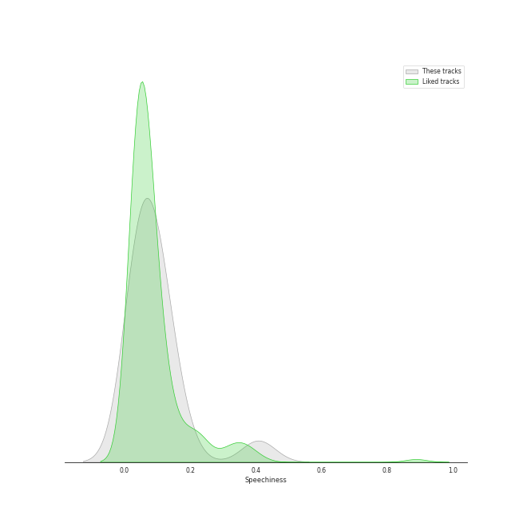
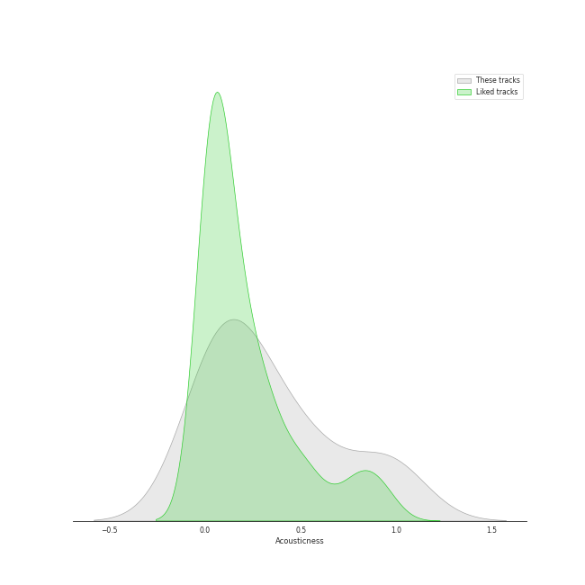
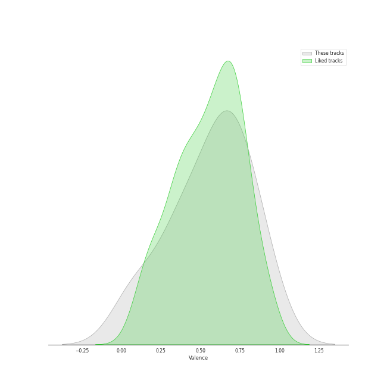

# Audio Features for Sony Music Labels Inc.

## Danceability

| 10 most Danceable tracks | 10 least Danceable tracks |
|:---|:---|
| Make you happy (0.78) | Ave Maria (0.15) |
| CIRCUS (0.767) | All I Ask of You (0.236) |
| There (0.712) | ベテルギウス (0.367) |
| PINK BLOOD (0.666) | abnormalize (0.373) |
| 恋人じゃなくなった日 (0.636) | Good Vibrations (0.415) |
| 白日 (0.599) | ドライフラワー (0.463) |
| 砂の惑星 ( + 初音ミク ) (0.507) | 炎 (0.477) |
| 炎 (0.477) | 砂の惑星 ( + 初音ミク ) (0.507) |
| ドライフラワー (0.463) | 白日 (0.599) |
| Good Vibrations (0.415) | 恋人じゃなくなった日 (0.636) |

## Energy

| 10 most Energetic tracks | 10 least Energetic tracks |
|:---|:---|
| 砂の惑星 ( + 初音ミク ) (0.94) | All I Ask of You (0.0636) |
| abnormalize (0.897) | Ave Maria (0.104) |
| 白日 (0.891) | Good Vibrations (0.248) |
| Make you happy (0.885) | 恋人じゃなくなった日 (0.516) |
| CIRCUS (0.809) | PINK BLOOD (0.534) |
| 炎 (0.685) | ドライフラワー (0.603) |
| ベテルギウス (0.671) | There (0.631) |
| There (0.631) | ベテルギウス (0.671) |
| ドライフラワー (0.603) | 炎 (0.685) |
| PINK BLOOD (0.534) | CIRCUS (0.809) |

## Speechiness

| 10 most Speechy tracks | 10 least Speechy tracks |
|:---|:---|
| There (0.122) | ドライフラワー (0.0276) |
| Make you happy (0.122) | 炎 (0.0325) |
| 白日 (0.116) | Good Vibrations (0.0339) |
| CIRCUS (0.0958) | 恋人じゃなくなった日 (0.0355) |
| 砂の惑星 ( + 初音ミク ) (0.0927) | All I Ask of You (0.0377) |
| PINK BLOOD (0.0893) | Ave Maria (0.0411) |
| abnormalize (0.0702) | ベテルギウス (0.0478) |
| ベテルギウス (0.0478) | abnormalize (0.0702) |
| Ave Maria (0.0411) | PINK BLOOD (0.0893) |
| All I Ask of You (0.0377) | 砂の惑星 ( + 初音ミク ) (0.0927) |

## Acousticness

| 10 most Acoustic tracks | 10 least Acoustic tracks |
|:---|:---|
| Ave Maria (0.991) | abnormalize (7.51e-06) |
| All I Ask of You (0.98) | 砂の惑星 ( + 初音ミク ) (0.0252) |
| Good Vibrations (0.893) | CIRCUS (0.0337) |
| 白日 (0.562) | Make you happy (0.0436) |
| 恋人じゃなくなった日 (0.549) | 炎 (0.105) |
| ドライフラワー (0.495) | There (0.19) |
| PINK BLOOD (0.277) | ベテルギウス (0.222) |
| ベテルギウス (0.222) | PINK BLOOD (0.277) |
| There (0.19) | ドライフラワー (0.495) |
| 炎 (0.105) | 恋人じゃなくなった日 (0.549) |

## Instrumentalness

| 10 most Instrumental tracks | 10 least Instrumental tracks |
|:---|:---|
| abnormalize (0.151) | 炎 (0.0) |
| Ave Maria (0.00671) | 白日 (0.0) |
| Good Vibrations (0.00336) | CIRCUS (0.0) |
| All I Ask of You (0.00164) | 砂の惑星 ( + 初音ミク ) (0.0) |
| PINK BLOOD (3.57e-05) | ベテルギウス (0.0) |
| Make you happy (2.8e-05) | ドライフラワー (0.0) |
| 恋人じゃなくなった日 (0.0) | There (0.0) |
| There (0.0) | 恋人じゃなくなった日 (0.0) |
| ドライフラワー (0.0) | Make you happy (2.8e-05) |
| ベテルギウス (0.0) | PINK BLOOD (3.57e-05) |

## Liveness

| 10 most Live tracks | 10 least Live tracks |
|:---|:---|
| ベテルギウス (0.494) | CIRCUS (0.0353) |
| 白日 (0.322) | abnormalize (0.0676) |
| 炎 (0.277) | 恋人じゃなくなった日 (0.0825) |
| Good Vibrations (0.23) | All I Ask of You (0.085) |
| Ave Maria (0.208) | Make you happy (0.105) |
| PINK BLOOD (0.179) | There (0.106) |
| ドライフラワー (0.167) | 砂の惑星 ( + 初音ミク ) (0.152) |
| 砂の惑星 ( + 初音ミク ) (0.152) | ドライフラワー (0.167) |
| There (0.106) | PINK BLOOD (0.179) |
| Make you happy (0.105) | Ave Maria (0.208) |

## Valence

| 10 most Happy tracks | 10 least Happy tracks |
|:---|:---|
| 砂の惑星 ( + 初音ミク ) (0.917) | Ave Maria (0.0558) |
| Make you happy (0.808) | All I Ask of You (0.106) |
| 白日 (0.694) | There (0.298) |
| ベテルギウス (0.691) | 炎 (0.308) |
| CIRCUS (0.69) | Good Vibrations (0.362) |
| PINK BLOOD (0.617) | abnormalize (0.369) |
| 恋人じゃなくなった日 (0.487) | ドライフラワー (0.477) |
| ドライフラワー (0.477) | 恋人じゃなくなった日 (0.487) |
| abnormalize (0.369) | PINK BLOOD (0.617) |
| Good Vibrations (0.362) | CIRCUS (0.69) |

## Tempo

| 10 most Fast tracks | 10 least Fast tracks |
|:---|:---|
| ベテルギウス (179.833) | Good Vibrations (74.177) |
| Make you happy (160.087) | 恋人じゃなくなった日 (74.996) |
| 炎 (152.04) | There (79.984) |
| ドライフラワー (148.089) | abnormalize (87.477) |
| Ave Maria (102.448) | 白日 (93.029) |
| PINK BLOOD (100.0) | 砂の惑星 ( + 初音ミク ) (94.874) |
| CIRCUS (97.958) | All I Ask of You (95.485) |
| All I Ask of You (95.485) | CIRCUS (97.958) |
| 砂の惑星 ( + 初音ミク ) (94.874) | PINK BLOOD (100.0) |
| 白日 (93.029) | Ave Maria (102.448) |
