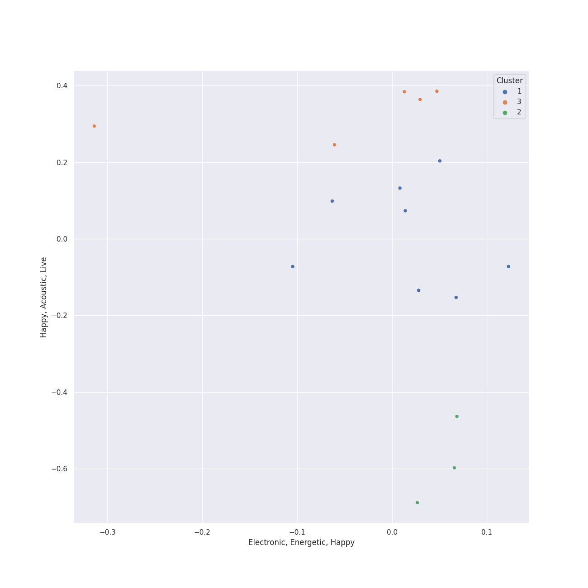

# Clusters in Sony Music Labels Inc.

## Cluster #1

8 tracks

| Art | Track | Album | Artists | Label | Rank | 💚 | 🔗 |
|:---|:---|:---|:---|:---|---:|:---|:---|
|  | abnormalize | i'mperfect | Ling tosite sigure | [Sony Music Labels Inc.](../..) | nan | | [🔗](https://open.spotify.com/track/00nmZvZRyzQiYe2tAcDDUb) |
|  | There | There | [Stray Kids](../../../../artists/stray_kids/overview.md) | [Sony Music Labels Inc.](../..) | nan | 💚 | [🔗](https://open.spotify.com/track/6gHeWGamtOYHBd1LBZ7Fv6) |
|  | 白日 | CEREMONY | King Gnu | [Sony Music Labels Inc.](../..) | nan | | [🔗](https://open.spotify.com/track/172fMG26G2OoEzzg0wn26r) |
|  | PINK BLOOD | PINK BLOOD | Hikaru Utada | [Sony Music Labels Inc.](../..) | nan | | [🔗](https://open.spotify.com/track/39lq5gU4lPc0rYVaRo0stH) |
|  | ベテルギウス | 壱 | Yuuri | [Sony Music Labels Inc.](../..) | nan | | [🔗](https://open.spotify.com/track/4JK1kDUdH9RTBQrrSO1QfR) |
|  | ドライフラワー | 壱 | Yuuri | [Sony Music Labels Inc.](../..) | 542 | 💚 | [🔗](https://open.spotify.com/track/4kPlQKwtPrnqLgrmmKFSlA) |
|  | ビリミリオン | 弐 | Yuuri | [Sony Music Labels Inc.](../..) | nan | 💚 | [🔗](https://open.spotify.com/track/7M0dIdZWN1FDcveRdoOzbZ) |
|  | 恋人じゃなくなった日 | 恋人じゃなくなった日 | Yuuri | [Sony Music Labels Inc.](../..) | nan | | [🔗](https://open.spotify.com/track/7fQYRdNX6y8BpfmHvWVPm8) |
## Cluster #2

5 tracks

| Art | Track | Album | Artists | Label | Rank | 💚 | 🔗 |
|:---|:---|:---|:---|:---|---:|:---|:---|
|  | CIRCUS | CIRCUS | [Stray Kids](../../../../artists/stray_kids/overview.md) | [Sony Music Labels Inc.](../..) | 534 | 💚 | [🔗](https://open.spotify.com/track/2uw2ftfyS4yJLWiTtbxasE) |
|  | 青のすみか | 青のすみか | Tatsuya Kitani | [Sony Music Labels Inc.](../..) | nan | | [🔗](https://open.spotify.com/track/12usPU2WnqgCHAW1EK2dfd) |
|  | Make you happy | Make you happy | NiziU | [Sony Music Labels Inc.](../..) | nan | | [🔗](https://open.spotify.com/track/1LnJVIG1BaHTRznuOgR0yc) |
|  | 砂の惑星 ( + 初音ミク ) | BOOTLEG | Kenshi Yonezu, Hatsune Miku | [Sony Music Labels Inc.](../..) | nan | | [🔗](https://open.spotify.com/track/3aYz5EBaRTWLpsfyUIsQyX) |
|  | Mambo No. 5 (a Little Bit of...) | A Little Bit of Mambo | Lou Bega | [Sony Music/Vorsicht Musik](../..) | nan | 💚 | [🔗](https://open.spotify.com/track/6x4tKaOzfNJpEJHySoiJcs) |
## Cluster #3

3 tracks

| Art | Track | Album | Artists | Label | Rank | 💚 | 🔗 |
|:---|:---|:---|:---|:---|---:|:---|:---|
|  | All I Ask of You | Cappella | Andrew Lloyd Webber, The King's Singers | [Sony Classical](../../../sony_classical), [Sony Music Labels Inc.](../..) | nan | | [🔗](https://open.spotify.com/track/5JTRLqApDZKaIwcopt1d9p) |
|  | Good Vibrations | Cappella | Brian Wilson, Mike Love, The King's Singers | [Sony Classical](../../../sony_classical), [Sony Music Labels Inc.](../..) | nan | | [🔗](https://open.spotify.com/track/14LgsPIZ7xKsfkM50VjxuA) |
|  | Ave Maria | Cappella | Josquin des Prez, The King's Singers | [Sony Classical](../../../sony_classical), [Sony Music Labels Inc.](../..) | nan | | [🔗](https://open.spotify.com/track/6xBGuah2AMT6y5S0HlztUU) |