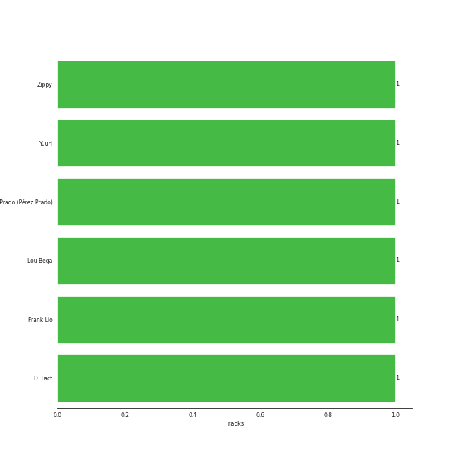

# Sony Music Labels Inc.

17 songs

[See Track Features](audio_features.md)

[See Clusters](clusters/overview.md)

Appears as:
- Sony Music Labels Inc. (13 tracks)
- Sony Classical/Sony Music (3 tracks)
- Sony Music/Vorsicht Musik (1 tracks)

## Top Artists

| Art | Rank | Tracks | 💚 | Artist | 🔗 |
|:---|---:|---:|---:|:---|:---|
|  | 321 | 4 | 2 | Yuuri | [🔗](https://open.spotify.com/artist/0ixzjrK1wkN2zWBXt3VW3W) |
|  | 10 | 2 | 2 | [Stray Kids](../../artists/stray_kids/overview.md) | [🔗](https://open.spotify.com/artist/2dIgFjalVxs4ThymZ67YCE) |
|  | 431 | 1 | 1 | Lou Bega | [🔗](https://open.spotify.com/artist/46lnlnlU0dXTDpoAUmH6Qx) |
|  | 431 | 3 | 0 | The King's Singers | [🔗](https://open.spotify.com/artist/5lR7yDVN4z9kahOiUSlMhe) |
|  | 431 | 1 | 0 | Tatsuya Kitani | [🔗](https://open.spotify.com/artist/7mvhRvEAHiCTQHUnH7fgnv) |
|  | 431 | 1 | 0 | Hikaru Utada | [🔗](https://open.spotify.com/artist/7lbSsjYACZHn1MSDXPxNF2) |
|  | 431 | 1 | 0 | King Gnu | [🔗](https://open.spotify.com/artist/6wxfx1yhyqjCPYwwxJktR2) |
|  | 298 | 1 | 0 | Hatsune Miku | [🔗](https://open.spotify.com/artist/6pNgnvzBa6Bthsv8SrZJYl) |
|  | 17 | 1 | 0 | [IVE](../../artists/ive/overview.md) | [🔗](https://open.spotify.com/artist/6RHTUrRF63xao58xh9FXYJ) |
|  | 431 | 1 | 0 | Mike Love | [🔗](https://open.spotify.com/artist/5gr5OoQ4aQdJ3CqOr9v7Bt) |

See all 16 artists

| Art | Rank | Tracks | 💚 | Artist | 🔗 |
|:---|---:|---:|---:|:---|:---|
|  | 431 | 1 | 0 | Andrew Lloyd Webber | [🔗](https://open.spotify.com/artist/4aP1lp10BRYZO658B2NwkG) |
|  | 431 | 1 | 0 | Brian Wilson | [🔗](https://open.spotify.com/artist/4Q82S0VzF8qlCb4PnSDurj) |
|  | 431 | 1 | 0 | NiziU | [🔗](https://open.spotify.com/artist/3z8diLlUCkN1j9N9ZdnfBJ) |
|  | 431 | 1 | 0 | Josquin des Prez | [🔗](https://open.spotify.com/artist/31f23hmZawdqgp0sECAzE8) |
|  | 431 | 1 | 0 | Kenshi Yonezu | [🔗](https://open.spotify.com/artist/1snhtMLeb2DYoMOcVbb8iB) |
|  | 431 | 1 | 0 | Ling tosite sigure | [🔗](https://open.spotify.com/artist/00DuPiLri3mNomvvM3nZvU) |

## Top Albums

| Art | Rank | Tracks | 💚 | Album | Release Date | 🔗 |
|:---|---:|---:|---:|:---|:---|:---|
|  | 644 | 3 | 0 | Cappella | 2013 | [🔗](https://open.spotify.com/album/3n6JxpdWnHkazMCQxKK5qI) |
|  | 486 | 2 | 1 | 壱 | 2022-01-12 | [🔗](https://open.spotify.com/album/1YWoHzj5wHnG7m6gLlwBQd) |
|  | 644 | 1 | 1 | 弐 | 2023-03-29 | [🔗](https://open.spotify.com/album/6ClMd4vNeZ6cmrRNmOqAoY) |
|  | 644 | 1 | 1 | There | 2023-02-15 | [🔗](https://open.spotify.com/album/2j8BoKqZrMUYTARDIs9XDk) |
|  | 434 | 1 | 1 | CIRCUS | 2022-06-10 | [🔗](https://open.spotify.com/album/4IQHY28D4aHus9lGDlSdPp) |
|  | 644 | 1 | 1 | A Little Bit of Mambo | 1999-07-19 | [🔗](https://open.spotify.com/album/13BmLGhVCLBn3XzKB8HIai) |
|  | 644 | 1 | 0 | 青のすみか | 2023-07-07 | [🔗](https://open.spotify.com/album/4QjNVlIw8Rx6jItSZtn2VS) |
|  | 644 | 1 | 0 | 恋人じゃなくなった日 | 2023-02-14 | [🔗](https://open.spotify.com/album/0E6KtMRFXw2LDyV38I3nNQ) |
|  | 644 | 1 | 0 | i'mperfect | 2013-04-10 | [🔗](https://open.spotify.com/album/04ygc7Z2gcGtt7m8pnVUwf) |
|  | 644 | 1 | 0 | PINK BLOOD | 2021-06-02 | [🔗](https://open.spotify.com/album/4eQs3mcSejRAVTWmaYXNYl) |

See all 14 albums

| Art | Rank | Tracks | 💚 | Album | Release Date | 🔗 |
|:---|---:|---:|---:|:---|:---|:---|
|  | 644 | 1 | 0 | Make you happy | 2020-06-30 | [🔗](https://open.spotify.com/album/1wIIu2i7A56TlMD99CVNQD) |
|  | 276 | 1 | 0 | CRUSH | 2024-08-07 | [🔗](https://open.spotify.com/album/607R3veMPfNTZ4VzMEVy3d) |
|  | 644 | 1 | 0 | CEREMONY | 2020-01-15 | [🔗](https://open.spotify.com/album/1IYJeRjWNruxAKls5cBtqm) |
|  | 644 | 1 | 0 | BOOTLEG | 2017-11-01 | [🔗](https://open.spotify.com/album/1mvoieMR8Dwiy7S052ihoC) |

## Genres

| Tracks | 💚 | Genre |
|---:|---:|:---|
| 8 | 2 | [j-pop](../../genres/j-pop/overview.md) |
| 5 | 2 | japanese singer-songwriter |
| 4 | 2 | japanese teen pop |
| 2 | 2 | [pop](../../genres/pop/overview.md) |
| 2 | 2 | [k-pop boy group](../../genres/k-pop_boy_group/overview.md) |
| 2 | 2 | [k-pop](../../genres/k-pop/overview.md) |
| 1 | 1 | latin pop |
| 2 | 0 | [anime](../../genres/anime/overview.md) |
| 1 | 0 | west end |
| 1 | 0 | sunshine pop |

See all 23 genres

| Tracks | 💚 | Genre |
|---:|---:|:---|
| 1 | 0 | renaissance |
| 1 | 0 | [k-pop girl group](../../genres/k-pop_girl_group/overview.md) |
| 1 | 0 | japanese post-hardcore |
| 1 | 0 | japanese math rock |
| 1 | 0 | japanese emo |
| 1 | 0 | japanese electropop |
| 1 | 0 | j-rock |
| 1 | 0 | franco-flemish school |
| 1 | 0 | [early music](../../genres/early_music/overview.md) |
| 1 | 0 | [classical](../../genres/classical/overview.md) |
| 1 | 0 | classic j-pop |
| 1 | 0 | [broadway](../../genres/broadway/overview.md) |
| 1 | 0 | baroque pop |

## Top Producers

| Art | Producer | Tracks | Credit Types |
|:---|:---|---:|:---|
|  | Yuuri | 1 | Lyricist, Songwriter |
| | Frank Lio | 1 | Producer |
|  | Lou Bega | 1 | Lyricist, Producer |
| | Pérez Prado (Pérez Prado) | 1 | Songwriter |
| | Zippy | 1 | Lyricist, Producer |
| | D. Fact | 1 | Producer |

## Tracks released under Sony Music Labels Inc.

| Art | Track | Album | Artists | Label | Rank | 💚 | 🔗 |
|:---|:---|:---|:---|:---|---:|:---|:---|
|  | CRUSH | CRUSH | [IVE](../../artists/ive/overview.md) | [Sony Music Labels Inc.](.) | 395 | | [🔗](https://open.spotify.com/track/3iDdrh15xYLHKafxYNLF4F) |
|  | CIRCUS | CIRCUS | [Stray Kids](../../artists/stray_kids/overview.md) | [Sony Music Labels Inc.](.) | 647 | 💚 | [🔗](https://open.spotify.com/track/2uw2ftfyS4yJLWiTtbxasE) |
|  | ドライフラワー | 壱 | Yuuri | [Sony Music Labels Inc.](.) | 723 | 💚 | [🔗](https://open.spotify.com/track/4kPlQKwtPrnqLgrmmKFSlA) |
|  | Mambo No. 5 (a Little Bit of...) | A Little Bit of Mambo | Lou Bega | [Sony Music/Vorsicht Musik](.) | 976 | 💚 | [🔗](https://open.spotify.com/track/6x4tKaOzfNJpEJHySoiJcs) |
|  | All I Ask of You | Cappella | Andrew Lloyd Webber, The King's Singers | [Sony Classical](../sony_classical), [Sony Music Labels Inc.](.) | 976 | | [🔗](https://open.spotify.com/track/5JTRLqApDZKaIwcopt1d9p) |
|  | Ave Maria | Cappella | Josquin des Prez, The King's Singers | [Sony Classical](../sony_classical), [Sony Music Labels Inc.](.) | 976 | | [🔗](https://open.spotify.com/track/6xBGuah2AMT6y5S0HlztUU) |
|  | Good Vibrations | Cappella | Brian Wilson, Mike Love, The King's Singers | [Sony Classical](../sony_classical), [Sony Music Labels Inc.](.) | 976 | | [🔗](https://open.spotify.com/track/14LgsPIZ7xKsfkM50VjxuA) |
|  | abnormalize | i'mperfect | Ling tosite sigure | [Sony Music Labels Inc.](.) | 976 | | [🔗](https://open.spotify.com/track/00nmZvZRyzQiYe2tAcDDUb) |
|  | 砂の惑星 ( + 初音ミク ) | BOOTLEG | Kenshi Yonezu, Hatsune Miku | [Sony Music Labels Inc.](.) | 976 | | [🔗](https://open.spotify.com/track/3aYz5EBaRTWLpsfyUIsQyX) |
|  | 白日 | CEREMONY | King Gnu | [Sony Music Labels Inc.](.) | 976 | | [🔗](https://open.spotify.com/track/172fMG26G2OoEzzg0wn26r) |

See all tracks

| Art | Track | Album | Artists | Label | Rank | 💚 | 🔗 |
|:---|:---|:---|:---|:---|---:|:---|:---|
|  | Make you happy | Make you happy | NiziU | [Sony Music Labels Inc.](.) | 976 | | [🔗](https://open.spotify.com/track/1LnJVIG1BaHTRznuOgR0yc) |
|  | PINK BLOOD | PINK BLOOD | Hikaru Utada | [Sony Music Labels Inc.](.) | 976 | | [🔗](https://open.spotify.com/track/39lq5gU4lPc0rYVaRo0stH) |
|  | ベテルギウス | 壱 | Yuuri | [Sony Music Labels Inc.](.) | 976 | | [🔗](https://open.spotify.com/track/4JK1kDUdH9RTBQrrSO1QfR) |
|  | 恋人じゃなくなった日 | 恋人じゃなくなった日 | Yuuri | [Sony Music Labels Inc.](.) | 976 | | [🔗](https://open.spotify.com/track/7fQYRdNX6y8BpfmHvWVPm8) |
|  | There | There | [Stray Kids](../../artists/stray_kids/overview.md) | [Sony Music Labels Inc.](.) | 976 | 💚 | [🔗](https://open.spotify.com/track/6gHeWGamtOYHBd1LBZ7Fv6) |
|  | ビリミリオン | 弐 | Yuuri | [Sony Music Labels Inc.](.) | 976 | 💚 | [🔗](https://open.spotify.com/track/7M0dIdZWN1FDcveRdoOzbZ) |
|  | 青のすみか | 青のすみか | Tatsuya Kitani | [Sony Music Labels Inc.](.) | 976 | | [🔗](https://open.spotify.com/track/12usPU2WnqgCHAW1EK2dfd) |

