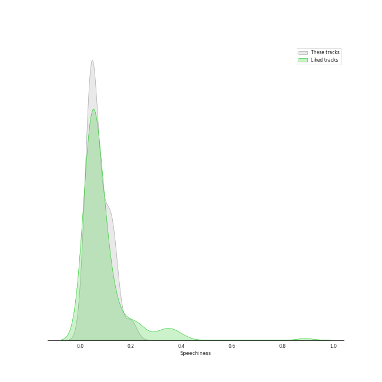
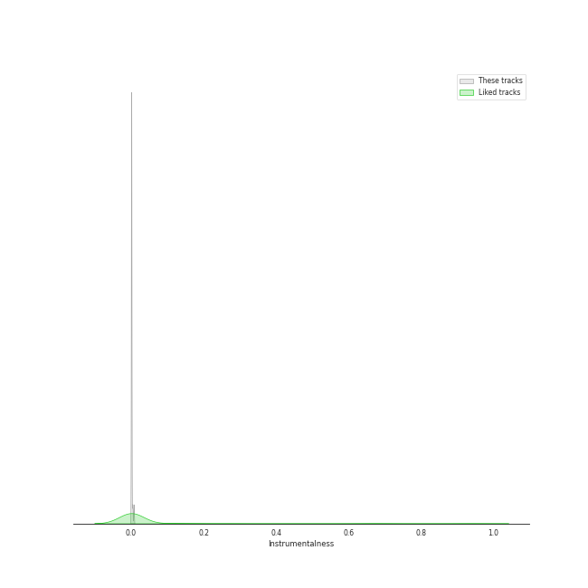
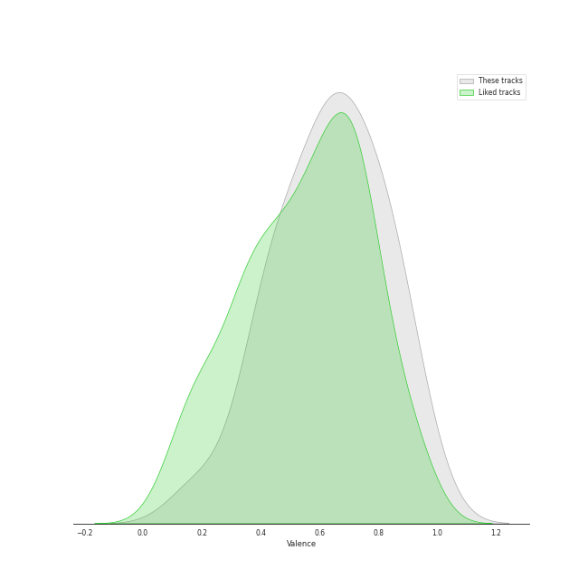

# Audio Features for SOURCE MUSIC

## Danceability

| 10 most Danceable tracks | 10 least Danceable tracks |
|:---|:---|
| ANTIFRAGILE (0.882) | Love Rain (Feat. SURAN) (0.469) |
| FEARLESS (0.863) | Raise y_our glass (0.567) |
| Blue Flame (0.781) | Rough (0.613) |
| Sour Grapes (0.779) | I ≠ DOLL (0.618) |
| Impurities (0.715) | No Celestial (0.618) |
| NAVILLERA (0.642) | MAGO (0.621) |
| MAGO (0.621) | NAVILLERA (0.642) |
| No Celestial (0.618) | Impurities (0.715) |
| I ≠ DOLL (0.618) | Sour Grapes (0.779) |
| Rough (0.613) | Blue Flame (0.781) |

## Energy

| 10 most Energetic tracks | 10 least Energetic tracks |
|:---|:---|
| NAVILLERA (0.957) | Raise y_our glass (0.503) |
| Rough (0.912) | FEARLESS (0.62) |
| MAGO (0.821) | Love Rain (Feat. SURAN) (0.631) |
| Sour Grapes (0.801) | Blue Flame (0.725) |
| No Celestial (0.801) | Impurities (0.757) |
| ANTIFRAGILE (0.797) | I ≠ DOLL (0.787) |
| I ≠ DOLL (0.787) | ANTIFRAGILE (0.797) |
| Impurities (0.757) | No Celestial (0.801) |
| Blue Flame (0.725) | Sour Grapes (0.801) |
| Love Rain (Feat. SURAN) (0.631) | MAGO (0.821) |

## Speechiness

| 10 most Speechy tracks | 10 least Speechy tracks |
|:---|:---|
| FEARLESS (0.135) | MAGO (0.0364) |
| Raise y_our glass (0.124) | Rough (0.0366) |
| Love Rain (Feat. SURAN) (0.0926) | Impurities (0.0373) |
| No Celestial (0.0825) | Blue Flame (0.0452) |
| ANTIFRAGILE (0.0819) | Sour Grapes (0.0457) |
| I ≠ DOLL (0.0621) | NAVILLERA (0.05) |
| NAVILLERA (0.05) | I ≠ DOLL (0.0621) |
| Sour Grapes (0.0457) | ANTIFRAGILE (0.0819) |
| Blue Flame (0.0452) | No Celestial (0.0825) |
| Impurities (0.0373) | Love Rain (Feat. SURAN) (0.0926) |

## Acousticness

| 10 most Acoustic tracks | 10 least Acoustic tracks |
|:---|:---|
| Raise y_our glass (0.581) | I ≠ DOLL (0.00289) |
| Sour Grapes (0.395) | MAGO (0.00548) |
| Impurities (0.231) | No Celestial (0.0168) |
| Rough (0.152) | Blue Flame (0.0281) |
| Love Rain (Feat. SURAN) (0.127) | NAVILLERA (0.0438) |
| ANTIFRAGILE (0.0821) | FEARLESS (0.0508) |
| FEARLESS (0.0508) | ANTIFRAGILE (0.0821) |
| NAVILLERA (0.0438) | Love Rain (Feat. SURAN) (0.127) |
| Blue Flame (0.0281) | Rough (0.152) |
| No Celestial (0.0168) | Impurities (0.231) |

## Instrumentalness

| 10 most Instrumental tracks | 10 least Instrumental tracks |
|:---|:---|
| FEARLESS (0.00324) | I ≠ DOLL (0.0) |
| MAGO (0.000578) | No Celestial (0.0) |
| Raise y_our glass (0.0) | NAVILLERA (0.0) |
| Impurities (0.0) | Blue Flame (0.0) |
| Sour Grapes (0.0) | Rough (0.0) |
| ANTIFRAGILE (0.0) | Love Rain (Feat. SURAN) (0.0) |
| Love Rain (Feat. SURAN) (0.0) | ANTIFRAGILE (0.0) |
| Rough (0.0) | Sour Grapes (0.0) |
| Blue Flame (0.0) | Impurities (0.0) |
| NAVILLERA (0.0) | Raise y_our glass (0.0) |

## Liveness

| 10 most Live tracks | 10 least Live tracks |
|:---|:---|
| Love Rain (Feat. SURAN) (0.399) | Impurities (0.0656) |
| Raise y_our glass (0.369) | Blue Flame (0.0761) |
| NAVILLERA (0.273) | Sour Grapes (0.108) |
| I ≠ DOLL (0.146) | Rough (0.111) |
| MAGO (0.142) | ANTIFRAGILE (0.113) |
| No Celestial (0.131) | FEARLESS (0.129) |
| FEARLESS (0.129) | No Celestial (0.131) |
| ANTIFRAGILE (0.113) | MAGO (0.142) |
| Rough (0.111) | I ≠ DOLL (0.146) |
| Sour Grapes (0.108) | NAVILLERA (0.273) |

## Valence

| 10 most Happy tracks | 10 least Happy tracks |
|:---|:---|
| ANTIFRAGILE (0.824) | Raise y_our glass (0.184) |
| NAVILLERA (0.801) | I ≠ DOLL (0.389) |
| Blue Flame (0.765) | FEARLESS (0.432) |
| Rough (0.734) | Impurities (0.464) |
| Sour Grapes (0.72) | Love Rain (Feat. SURAN) (0.643) |
| No Celestial (0.699) | MAGO (0.646) |
| MAGO (0.646) | No Celestial (0.699) |
| Love Rain (Feat. SURAN) (0.643) | Sour Grapes (0.72) |
| Impurities (0.464) | Rough (0.734) |
| FEARLESS (0.432) | Blue Flame (0.765) |

## Tempo

| 10 most Fast tracks | 10 least Fast tracks |
|:---|:---|
| Love Rain (Feat. SURAN) (173.689) | Raise y_our glass (72.798) |
| I ≠ DOLL (159.996) | Impurities (90.065) |
| Sour Grapes (139.998) | FEARLESS (103.971) |
| No Celestial (138.028) | ANTIFRAGILE (105.025) |
| NAVILLERA (125.008) | Rough (112.005) |
| MAGO (120.062) | Blue Flame (112.045) |
| Blue Flame (112.045) | MAGO (120.062) |
| Rough (112.005) | NAVILLERA (125.008) |
| ANTIFRAGILE (105.025) | No Celestial (138.028) |
| FEARLESS (103.971) | Sour Grapes (139.998) |
