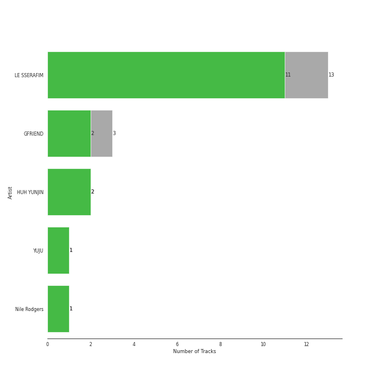
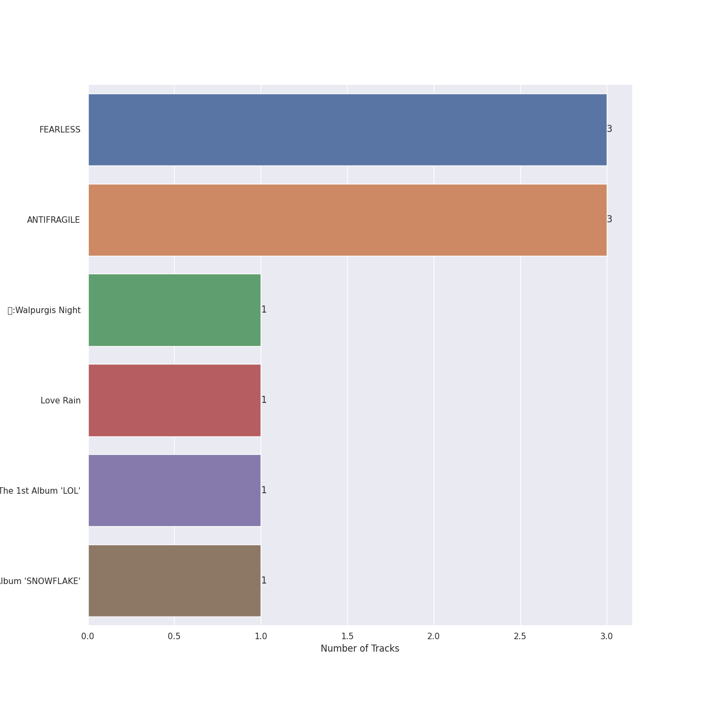
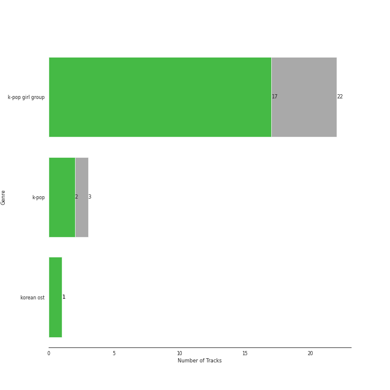
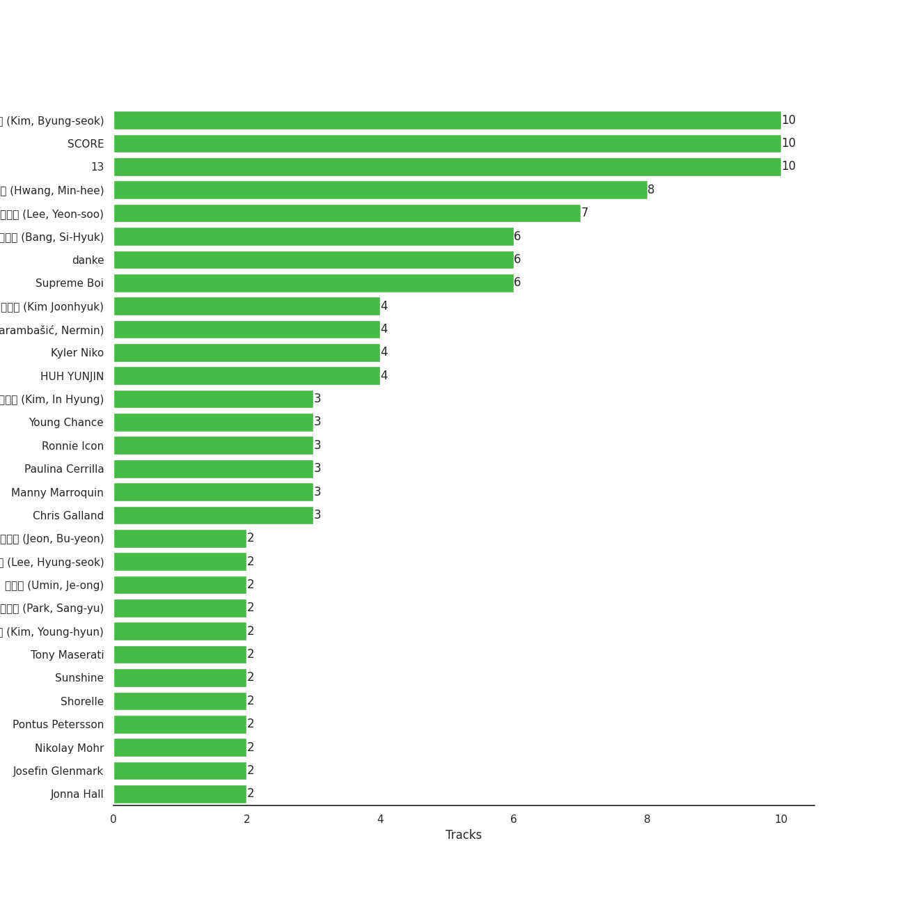

# SOURCE MUSIC

22 songs

[See Track Features](audio_features.md)

[See Clusters](clusters/overview.md)

Appears as:
- SOURCE MUSIC (22 tracks)

## Top Artists

| Art | Tracks | 💚 | Artist | 🔗 |
|:---|---:|---:|:---|:---|
|  | 16 | 14 | [LE SSERAFIM](../../artists/le_sserafim/overview.md) | [🔗](https://open.spotify.com/artist/4SpbR6yFEvexJuaBpgAU5p) |
|  | 3 | 2 | GFRIEND | [🔗](https://open.spotify.com/artist/0qlWcS66ohOIi0M8JZwPft) |
|  | 2 | 2 | HUH YUNJIN | [🔗](https://open.spotify.com/artist/13yWtUnz63q5VIs5SwoMhy) |
|  | 1 | 1 | YUJU | [🔗](https://open.spotify.com/artist/7Bu0r4MCDX3sbhcFD5IXyx) |
|  | 1 | 1 | Nile Rodgers | [🔗](https://open.spotify.com/artist/3yDIp0kaq9EFKe07X1X2rz) |

## Top Albums

| Art | Tracks | 💚 | Album | Release Date | 🔗 |
|:---|---:|---:|:---|:---|:---|
|  | 4 | 4 | UNFORGIVEN | 2023-05-01 | [🔗](https://open.spotify.com/album/4Oz7K9DRwwGMN49i4NbVDT) |
|  | 3 | 3 | FEARLESS | 2022-05-02 | [🔗](https://open.spotify.com/album/4Mc7WwYH41hgUWeKX25Sot) |
|  | 3 | 3 | EASY | 2024-02-19 | [🔗](https://open.spotify.com/album/1YCj4PZi08G20y2ekGKY0C) |
|  | 3 | 3 | ANTIFRAGILE | 2022-10-17 | [🔗](https://open.spotify.com/album/3u0ggfmK0vjuHMNdUbtaa9) |
|  | 1 | 1 | 回:Walpurgis Night | 2020-11-09 | [🔗](https://open.spotify.com/album/6keRNtq7CnhNrD2EIKOA6h) |
|  | 1 | 1 | Raise y_our glass | 2022-08-09 | [🔗](https://open.spotify.com/album/5Ty5fWBzQypVhiboHneO3y) |
|  | 1 | 1 | Perfect Night | 2023-10-27 | [🔗](https://open.spotify.com/album/6Msc3BwzKZ5f5FXmKuUSu6) |
|  | 1 | 1 | Love Rain | 2018-06-29 | [🔗](https://open.spotify.com/album/40fAbWLsPvL0nUuiDCwxHu) |
|  | 1 | 1 | I ≠ DOLL | 2023-01-09 | [🔗](https://open.spotify.com/album/4i7Qx3fYBVlXJ7OOvqPXlT) |
|  | 1 | 1 | GFRIEND 3rd Mini Album 'SNOWFLAKE' | 2016-01-25 | [🔗](https://open.spotify.com/album/0COnSwFb5qOhABUyWNw6Kp) |

See all 13 albums

| Art | Tracks | 💚 | Album | Release Date | 🔗 |
|:---|---:|---:|:---|:---|:---|
|  | 1 | 0 | Perfect Night (Holiday Remix) | 2023-11-23 | [🔗](https://open.spotify.com/album/0YaaIvxu7OH0OxUSnM9WFH) |
|  | 1 | 0 | GFRIEND The 1st Album 'LOL' | 2016-07-11 | [🔗](https://open.spotify.com/album/0PlSM2Hml1cFANnzYu6RCg) |
|  | 1 | 0 | Eve, Psyche & the Bluebeard’s wife (English Ver.) | 2023-07-06 | [🔗](https://open.spotify.com/album/1FoKSB8Kc39zc9exXYtNu8) |

## Genres

| Tracks | 💚 | Genre |
|---:|---:|:---|
| 19 | 16 | [k-pop girl group](../../genres/k-pop_girl_group/overview.md) |
| 3 | 2 | [k-pop](../../genres/k-pop/overview.md) |
| 1 | 1 | korean ost |

## Top Producers

| Art | Producer | Tracks | Credit Types |
|:---|:---|---:|:---|
| | [SCORE](../../producers/score/overview.md) | 11 | Songwriter, Arranger, Lyricist, Producer |
| | [김병석 (Kim, Byung-seok)](../../producers/김병석_(kim,_byung-seok)/overview.md) | 11 | Songwriter, Arranger, Lyricist, Producer |
| | 13 | 10 | Producer |
| | 황민희 (Hwang, Min-hee) | 8 | Producer |
| | [방시혁 (Bang, Si-Hyuk)](../../producers/방시혁_(bang,_si-hyuk)/overview.md) | 7 | Songwriter, Lyricist |
| | 이연수 (Lee, Yeon-soo) | 7 | Producer |
| | [Supreme Boi](../../producers/supreme_boi/overview.md) | 6 | Lyricist, Songwriter |
| | [danke](../../producers/danke/overview.md) | 6 | Lyricist, Songwriter |
|  | HUH YUNJIN | 5 | Songwriter, Lyricist |
| | Nermin Harambašić (Harambašić, Nermin) | 4 | Lyricist, Songwriter |

View all

| Art | Producer | Tracks | Credit Types |
|:---|:---|---:|:---|
| | Kyler Niko | 4 | Lyricist, Songwriter |
| | 김준혁 (Kim Joonhyuk) | 4 | Producer |
| | Chris Galland | 3 | Producer |
| | Young Chance | 3 | Lyricist, Songwriter |
| | 김인형 (Kim, In Hyung) | 3 | Lyricist, Songwriter |
| | Paulina Cerrilla | 3 | Lyricist, Songwriter |
| | [Manny Marroquin](../../producers/manny_marroquin/overview.md) | 3 | Producer |
| | Ronnie Icon | 3 | Lyricist, Songwriter |
| | Jonna Hall | 2 | Lyricist, Songwriter |
| | Daniel "Obi" Klein | 2 | Lyricist, Songwriter |
| | 박상유 (Park, Sang-yu) | 2 | Lyricist, Songwriter |
| | Josefin Glenmark | 2 | Lyricist, Songwriter |
| | Nikolay Mohr | 2 | Lyricist, Songwriter |
| | Arineh Karimi | 2 | Lyricist, Songwriter |
| | 전부연 (Jeon, Bu-yeon) | 2 | Producer |
| | 김영현 (Kim, Young-hyun) | 2 | Producer |
| | Pontus Petersson | 2 | Lyricist, Songwriter |
| | BLVSH | 2 | Lyricist, Songwriter |
| | JARO | 2 | Lyricist, Songwriter |
| | Anne Judith Wik | 2 | Lyricist, Songwriter |
| | Sunshine | 2 | Lyricist, Songwriter |
| | [Tony Maserati](../../producers/tony_maserati/overview.md) | 2 | Producer |
| | 우민정 (Umin, Je-ong) | 2 | Producer |
| | 이형석 (Lee, Hyung-seok) | 2 | Lyricist, Songwriter |
| | Charli Taft | 2 | Lyricist, Songwriter |
| | Shorelle | 2 | Lyricist, Songwriter |
| | BENJMN | 2 | Lyricist, Songwriter |
| | [Josh Gudwin](../../producers/josh_gudwin/overview.md) | 1 | Producer |
| | Cazzi Opeia | 1 | Lyricist, Songwriter |
| | James Reynolds | 1 | Producer |
| | Ninos Hanna | 1 | Songwriter |
| | Kayofkaj | 1 | Lyricist, Songwriter |
| | Adam Hawkins | 1 | Producer |
| | Marcus Andersson | 1 | Songwriter |
| | Anders Gukko | 1 | Lyricist, Songwriter |
| | 김채원 (Kim, Chae-won) | 1 | Lyricist, Songwriter |
| | Max Thulin | 1 | Lyricist, Songwriter |
| | emmy kasai. | 1 | Lyricist, Songwriter |
| | Lady V | 1 | Lyricist, Songwriter |
| | 양가영 (Yang, Gayoung) | 1 | Lyricist, Songwriter |
| | Maggie Szabo | 1 | Lyricist, Songwriter |
| | Caroline Gerd Gustavsson | 1 | Lyricist, Songwriter |
| | Yang Ga | 1 | Producer |
| | Maia Wright | 1 | Lyricist, Songwriter |
| | Jorge Luis Perez, Jr. | 1 | Songwriter |
| | Lauren Elizabeth Baker | 1 | Songwriter |
| | 김현수 (Kim, Hyun-soo) | 1 | Producer |
| | Nathalie Blue | 1 | Lyricist, Songwriter |
| | Shintaro Yasuda | 1 | Lyricist, Songwriter |
| | Believve | 1 | Lyricist, Songwriter |
| | Hayes Kramer | 1 | Lyricist, Songwriter |
| | [조윤경 (Jo, Yoon Kyung)](../../producers/조윤경_(jo,_yoon_kyung)/overview.md) | 1 | Lyricist, Songwriter |
| | Isabella Lovestory | 1 | Lyricist, Songwriter |
| | Niklas Jarelius Persson | 1 | Songwriter |
| | Makaila J Garcia | 1 | Lyricist, Songwriter |
| | Lauren Aquilina | 1 | Songwriter |
| | Amanda Ibanez | 1 | Songwriter |
| | Belle | 1 | Lyricist, Songwriter |
| | [John Hanes](../../producers/john_hanes/overview.md) | 1 | Producer |
| | Gusten Dahlqvist | 1 | Lyricist, Songwriter |
| | Bob Horn | 1 | Producer |
| | Zikai | 1 | Songwriter |
| | 김채아 (Kim, Chae-ah) | 1 | Lyricist, Songwriter |
| | poutyface | 1 | Lyricist, Songwriter |
| | Duane Benjamin | 1 | Arranger |
| | Glenda Proby | 1 | Lyricist, Songwriter |
|  | ABIR | 1 | Lyricist, Songwriter |
|  | Destiny Rogers | 1 | Lyricist, Songwriter |
| | Kris Jana | 1 | Lyricist, Songwriter |
| | Feli Ferraro | 1 | Lyricist, Songwriter |
| | Julia Bognar Finnseter | 1 | Lyricist, Songwriter |

## Tracks released under SOURCE MUSIC

| Art | Track | Album | Artists | Label | Rank | 💚 | 🔗 |
|:---|:---|:---|:---|:---|---:|:---|:---|
|  | Impurities | ANTIFRAGILE | [LE SSERAFIM](../../artists/le_sserafim/overview.md) | [SOURCE MUSIC](.) | 73 | 💚 | [🔗](https://open.spotify.com/track/7F0MuIk5glqtowCUjbn9es) |
|  | ANTIFRAGILE | ANTIFRAGILE | [LE SSERAFIM](../../artists/le_sserafim/overview.md) | [SOURCE MUSIC](.) | 119 | 💚 | [🔗](https://open.spotify.com/track/4fsQ0K37TOXa3hEQfjEic1) |
|  | Swan Song | EASY | [LE SSERAFIM](../../artists/le_sserafim/overview.md) | [SOURCE MUSIC](.) | 157 | 💚 | [🔗](https://open.spotify.com/track/2GquhrcHbl2zOnF5javAFp) |
|  | UNFORGIVEN (feat. Nile Rodgers) | UNFORGIVEN | [LE SSERAFIM](../../artists/le_sserafim/overview.md), Nile Rodgers | [SOURCE MUSIC](.) | 176 | 💚 | [🔗](https://open.spotify.com/track/51vRumtqbkNW9wrKfESwfu) |
|  | FEARLESS | FEARLESS | [LE SSERAFIM](../../artists/le_sserafim/overview.md) | [SOURCE MUSIC](.) | 179 | 💚 | [🔗](https://open.spotify.com/track/296nXCOv97WJNRWzIBQnoj) |
|  | Perfect Night (Holiday Remix) | Perfect Night (Holiday Remix) | [LE SSERAFIM](../../artists/le_sserafim/overview.md) | [SOURCE MUSIC](.) | 295 | | [🔗](https://open.spotify.com/track/40CJrEAyXS8qe0BBFbYbJO) |
|  | No-Return (Into the unknown) | UNFORGIVEN | [LE SSERAFIM](../../artists/le_sserafim/overview.md) | [SOURCE MUSIC](.) | 325 | 💚 | [🔗](https://open.spotify.com/track/6DSGb5CmwHX4pvclq8HUU1) |
|  | Sour Grapes | FEARLESS | [LE SSERAFIM](../../artists/le_sserafim/overview.md) | [SOURCE MUSIC](.) | 457 | 💚 | [🔗](https://open.spotify.com/track/6wBpO4Xc4YgShnENGSFA1M) |
|  | Fire in the belly | UNFORGIVEN | [LE SSERAFIM](../../artists/le_sserafim/overview.md) | [SOURCE MUSIC](.) | 465 | 💚 | [🔗](https://open.spotify.com/track/05RlBHEZg1RmL9DnPgv9Qq) |
|  | EASY | EASY | [LE SSERAFIM](../../artists/le_sserafim/overview.md) | [SOURCE MUSIC](.) | 476 | 💚 | [🔗](https://open.spotify.com/track/2O4Bb2WCkjlTPO827OnBMI) |

See all tracks

| Art | Track | Album | Artists | Label | Rank | 💚 | 🔗 |
|:---|:---|:---|:---|:---|---:|:---|:---|
|  | Perfect Night | Perfect Night | [LE SSERAFIM](../../artists/le_sserafim/overview.md) | [SOURCE MUSIC](.) | 477 | 💚 | [🔗](https://open.spotify.com/track/74X2u8JMVooG2QbjRxXwR8) |
|  | No Celestial | ANTIFRAGILE | [LE SSERAFIM](../../artists/le_sserafim/overview.md) | [SOURCE MUSIC](.) | 505 | 💚 | [🔗](https://open.spotify.com/track/21ApmVGIzIAIDSBdHu6SVt) |
|  | Smart | EASY | [LE SSERAFIM](../../artists/le_sserafim/overview.md) | [SOURCE MUSIC](.) | 628 | 💚 | [🔗](https://open.spotify.com/track/4lR8sYGMGZPvthF2yUfo7T) |
|  | I ≠ DOLL | I ≠ DOLL | HUH YUNJIN | [SOURCE MUSIC](.) | 652 | 💚 | [🔗](https://open.spotify.com/track/1d6xaY4JvvqTWfgCeJAtWa) |
|  | Rough | GFRIEND 3rd Mini Album 'SNOWFLAKE' | GFRIEND | [SOURCE MUSIC](.) | nan | 💚 | [🔗](https://open.spotify.com/track/3CVeGXpoPKJQ9JuhPp3mpL) |
|  | NAVILLERA | GFRIEND The 1st Album 'LOL' | GFRIEND | [SOURCE MUSIC](.) | nan | | [🔗](https://open.spotify.com/track/2Oi0IO8K4BEbhPUdWcjNmv) |
|  | Love Rain (Feat. SURAN) | Love Rain | YUJU | [SOURCE MUSIC](.) | nan | 💚 | [🔗](https://open.spotify.com/track/4T5fM8eGg5Pj6PLtIGLeU5) |
|  | MAGO | 回:Walpurgis Night | GFRIEND | [SOURCE MUSIC](.) | nan | 💚 | [🔗](https://open.spotify.com/track/46WaBBaEHzgbN88Ew0nh50) |
|  | Blue Flame | FEARLESS | [LE SSERAFIM](../../artists/le_sserafim/overview.md) | [SOURCE MUSIC](.) | nan | 💚 | [🔗](https://open.spotify.com/track/37YoRLUu1qId0ewavgvnkG) |
|  | Raise y_our glass | Raise y_our glass | HUH YUNJIN | [SOURCE MUSIC](.) | nan | 💚 | [🔗](https://open.spotify.com/track/7j1vFohEm1lbsctYY9gyGd) |
|  | Eve, Psyche & The Bluebeard’s wife | UNFORGIVEN | [LE SSERAFIM](../../artists/le_sserafim/overview.md) | [SOURCE MUSIC](.) | nan | 💚 | [🔗](https://open.spotify.com/track/4QhnNyKDsAkXPwHkSnuc89) |
|  | Eve, Psyche & the Bluebeard’s wife (English Ver.) | Eve, Psyche & the Bluebeard’s wife (English Ver.) | [LE SSERAFIM](../../artists/le_sserafim/overview.md) | [SOURCE MUSIC](.) | nan | | [🔗](https://open.spotify.com/track/1xaLyNaaZC3i5tmaDAWP76) |

