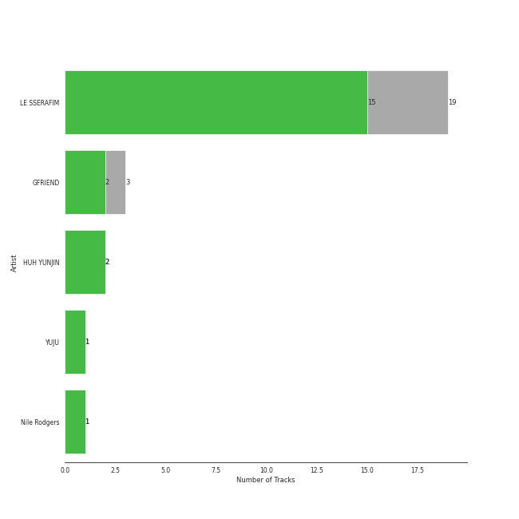

# SOURCE MUSIC

15 songs

[See Audio Features](audio_features.md)

Appears as:
- SOURCE MUSIC (15 tracks)

## Top Artists

| Art | Tracks | 💚 | Artist | 🔗 |
|:---|---:|---:|:---|:---|
|  | 9 | 9 | LE SSERAFIM | [🔗](https://open.spotify.com/artist/4SpbR6yFEvexJuaBpgAU5p) |
|  | 3 | 2 | GFRIEND | [🔗](https://open.spotify.com/artist/0qlWcS66ohOIi0M8JZwPft) |
|  | 2 | 2 | HUH YUNJIN | [🔗](https://open.spotify.com/artist/13yWtUnz63q5VIs5SwoMhy) |
|  | 1 | 1 | YUJU | [🔗](https://open.spotify.com/artist/7Bu0r4MCDX3sbhcFD5IXyx) |
|  | 1 | 1 | Nile Rodgers | [🔗](https://open.spotify.com/artist/3yDIp0kaq9EFKe07X1X2rz) |

## Top Albums

| Art | Tracks | 💚 | Album | Release Date | 🔗 |
|:---|---:|---:|:---|:---|:---|
|  | 3 | 3 | UNFORGIVEN | 2023-05-01 | [🔗](https://open.spotify.com/album/4Oz7K9DRwwGMN49i4NbVDT) |
|  | 3 | 3 | FEARLESS | 2022-05-02 | [🔗](https://open.spotify.com/album/4Mc7WwYH41hgUWeKX25Sot) |
|  | 3 | 3 | ANTIFRAGILE | 2022-10-17 | [🔗](https://open.spotify.com/album/3u0ggfmK0vjuHMNdUbtaa9) |
|  | 1 | 1 | 回:Walpurgis Night | 2020-11-09 | [🔗](https://open.spotify.com/album/6keRNtq7CnhNrD2EIKOA6h) |
|  | 1 | 1 | Raise y_our glass | 2022-08-09 | [🔗](https://open.spotify.com/album/5Ty5fWBzQypVhiboHneO3y) |
|  | 1 | 1 | Love Rain | 2018-06-29 | [🔗](https://open.spotify.com/album/40fAbWLsPvL0nUuiDCwxHu) |
|  | 1 | 1 | I ≠ DOLL | 2023-01-09 | [🔗](https://open.spotify.com/album/4i7Qx3fYBVlXJ7OOvqPXlT) |
|  | 1 | 1 | GFRIEND 3rd Mini Album 'SNOWFLAKE' | 2016-01-25 | [🔗](https://open.spotify.com/album/0COnSwFb5qOhABUyWNw6Kp) |
|  | 1 | 0 | GFRIEND The 1st Album 'LOL' | 2016-07-11 | [🔗](https://open.spotify.com/album/0PlSM2Hml1cFANnzYu6RCg) |

## Genres

| Tracks | 💚 | Genre |
|---:|---:|:---|
| 12 | 11 | [k-pop girl group](../../genres/k_pop_girl_group/overview.md) |
| 3 | 2 | [k-pop](../../genres/k_pop/overview.md) |
| 1 | 1 | korean ost |

## Tracks released under SOURCE MUSIC

| Art | Track | Album | Artists | Label | 💚 | 🔗 |
|:---|:---|:---|:---|:---|:---|:---|
|  | Rough | GFRIEND 3rd Mini Album 'SNOWFLAKE' | GFRIEND | [SOURCE MUSIC](.) | 💚 | [🔗](https://open.spotify.com/track/3CVeGXpoPKJQ9JuhPp3mpL) |
|  | NAVILLERA | GFRIEND The 1st Album 'LOL' | GFRIEND | [SOURCE MUSIC](.) | | [🔗](https://open.spotify.com/track/2Oi0IO8K4BEbhPUdWcjNmv) |
|  | MAGO | 回:Walpurgis Night | GFRIEND | [SOURCE MUSIC](.) | 💚 | [🔗](https://open.spotify.com/track/46WaBBaEHzgbN88Ew0nh50) |
|  | Raise y_our glass | Raise y_our glass | HUH YUNJIN | [SOURCE MUSIC](.) | 💚 | [🔗](https://open.spotify.com/track/7j1vFohEm1lbsctYY9gyGd) |
|  | I ≠ DOLL | I ≠ DOLL | HUH YUNJIN | [SOURCE MUSIC](.) | 💚 | [🔗](https://open.spotify.com/track/1d6xaY4JvvqTWfgCeJAtWa) |
|  | Blue Flame | FEARLESS | LE SSERAFIM | [SOURCE MUSIC](.) | 💚 | [🔗](https://open.spotify.com/track/37YoRLUu1qId0ewavgvnkG) |
|  | FEARLESS | FEARLESS | LE SSERAFIM | [SOURCE MUSIC](.) | 💚 | [🔗](https://open.spotify.com/track/296nXCOv97WJNRWzIBQnoj) |
|  | Sour Grapes | FEARLESS | LE SSERAFIM | [SOURCE MUSIC](.) | 💚 | [🔗](https://open.spotify.com/track/6wBpO4Xc4YgShnENGSFA1M) |
|  | ANTIFRAGILE | ANTIFRAGILE | LE SSERAFIM | [SOURCE MUSIC](.) | 💚 | [🔗](https://open.spotify.com/track/4fsQ0K37TOXa3hEQfjEic1) |
|  | Impurities | ANTIFRAGILE | LE SSERAFIM | [SOURCE MUSIC](.) | 💚 | [🔗](https://open.spotify.com/track/7F0MuIk5glqtowCUjbn9es) |

See all tracks

| Art | Track | Album | Artists | Label | 💚 | 🔗 |
|:---|:---|:---|:---|:---|:---|:---|
|  | No Celestial | ANTIFRAGILE | LE SSERAFIM | [SOURCE MUSIC](.) | 💚 | [🔗](https://open.spotify.com/track/21ApmVGIzIAIDSBdHu6SVt) |
|  | Fire in the belly | UNFORGIVEN | LE SSERAFIM | [SOURCE MUSIC](.) | 💚 | [🔗](https://open.spotify.com/track/05RlBHEZg1RmL9DnPgv9Qq) |
|  | No-Return (Into the unknown) | UNFORGIVEN | LE SSERAFIM | [SOURCE MUSIC](.) | 💚 | [🔗](https://open.spotify.com/track/6DSGb5CmwHX4pvclq8HUU1) |
|  | UNFORGIVEN (feat. Nile Rodgers) | UNFORGIVEN | LE SSERAFIM, Nile Rodgers | [SOURCE MUSIC](.) | 💚 | [🔗](https://open.spotify.com/track/51vRumtqbkNW9wrKfESwfu) |
|  | Love Rain (Feat. SURAN) | Love Rain | YUJU | [SOURCE MUSIC](.) | 💚 | [🔗](https://open.spotify.com/track/4T5fM8eGg5Pj6PLtIGLeU5) |

