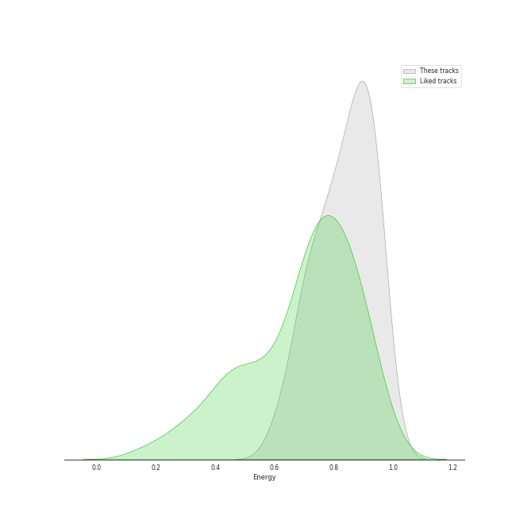
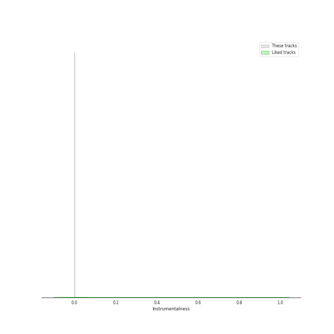
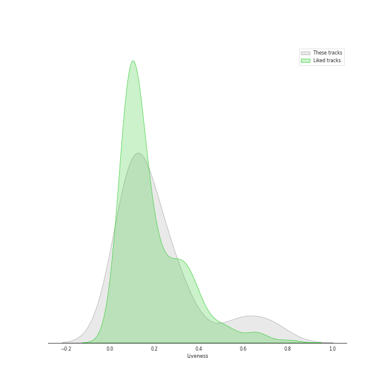
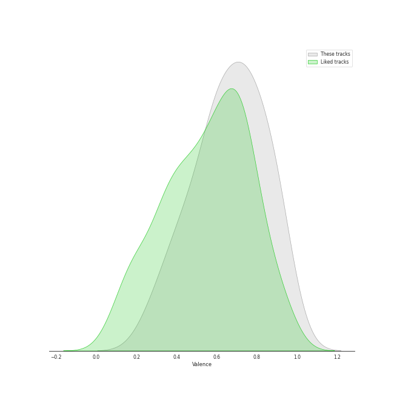

# Track Features for Starship Entertainment

## Danceability

| ​ | 10 most Danceable tracks | ​​ | 10 least Danceable tracks |
|:---|:---|:---|:---|
|  | ELEVEN (0.828) |  | SMOKY (0.471) |
|  | Ice Queen (0.82) |  | I Like That (0.564) |
|  | Kitsch (0.8) |  | DRAMARAMA (0.571) |
|  | Hmph! (0.796) |  | FREEDOM (0.614) |
|  | ROYAL (0.796) |  | Touch my body (0.633) |
|  | After LIKE - Holiday Remix (0.785) |  | Super Yuppers! (0.636) |
|  | Lips (0.785) |  | 섬찟 (Hypnosis) (0.649) |
|  | SHAKE IT (0.778) |  | Last Sequence (0.664) |
|  | Alone (0.769) |  | Blue Heart (0.668) |
|  | Off The Record (0.767) |  | Say! Yes (0.674) |

## Energy

| ​ | 10 most Energetic tracks | ​​ | 10 least Energetic tracks |
|:---|:---|:---|:---|
|  | Secret (0.969) |  | Love Me A Little (0.609) |
|  | Alone (0.961) |  | Ice Queen (0.65) |
|  | Hmph! (0.958) |  | Baddie (0.678) |
|  | SHAKE IT (0.957) |  | SMOKY (0.693) |
|  | Give it to me (0.945) |  | LOVE DIVE (0.709) |
|  | Super Yuppers! (0.931) |  | Blue Blood (0.709) |
|  | Adrenaline (0.929) |  | 섬찟 (Hypnosis) (0.718) |
|  | Pantomime (0.929) |  | ELEVEN (0.731) |
|  | After LIKE (0.922) |  | Off The Record (0.745) |
|  | Touch my body (0.915) |  | Ma Boy (0.767) |

## Speechiness

| ​ | 10 most Speechy tracks | ​​ | 10 least Speechy tracks |
|:---|:---|:---|:---|
|  | Easy (0.186) |  | One way love (0.0306) |
|  | Beautiful Liar (0.186) |  | Lips (0.0324) |
|  | Adrenaline (0.177) |  | Hmph! (0.0358) |
|  | UNNATURAL (0.157) |  | Alone (0.0371) |
|  | GAMBLER (0.152) |  | Blue Blood (0.0374) |
|  | Pantomime (0.132) |  | After LIKE - Holiday Remix (0.0388) |
|  | 섬찟 (Hypnosis) (0.127) |  | Blue Heart (0.0402) |
|  | After LIKE (0.121) |  | Give it to me (0.0424) |
|  | ELEVEN (0.111) |  | LOVE DIVE (0.0433) |
|  | DRAMARAMA (0.111) |  | Off The Record (0.0449) |

## Acousticness

| ​ | 10 most Acoustic tracks | ​​ | 10 least Acoustic tracks |
|:---|:---|:---|:---|
|  | Ice Queen (0.371) |  | LOVE DIVE (0.00379) |
|  | UNNATURAL (0.365) |  | Blue Blood (0.0041) |
|  | Ma Boy (0.353) |  | GAMBLER (0.00458) |
|  | Alone (0.263) |  | Easy (0.00848) |
|  | FREEDOM (0.252) |  | Super Yuppers! (0.00982) |
|  | 섬찟 (Hypnosis) (0.237) |  | I AM (0.0115) |
|  | SMOKY (0.181) |  | Kitsch (0.0119) |
|  | Give it to me (0.176) |  | SHAKE IT (0.0234) |
|  | Say! Yes (0.174) |  | Adrenaline (0.0238) |
|  | Last Sequence (0.174) |  | 해야 (HEYA) (0.0297) |

## Instrumentalness

| ​ | 10 most Instrumental tracks | ​​ | 10 least Instrumental tracks |
|:---|:---|:---|:---|
|  | Hmph! (0.000423) |  | Lips (0.0) |
|  | Blue Blood (9.91e-05) |  | Last Sequence (0.0) |
|  | LOVE DIVE (5.43e-05) |  | Accendio (0.0) |
|  | GAMBLER (5.84e-06) |  | DRAMARAMA (0.0) |
|  | Baddie (5.46e-06) |  | Beautiful Liar (0.0) |
|  | After LIKE - Holiday Remix (4.92e-06) |  | Secret (0.0) |
|  | Blue Heart (3.98e-06) |  | UNNATURAL (0.0) |
|  | ROYAL (3.39e-06) |  | Give it to me (0.0) |
|  | Ma Boy (2.71e-06) |  | 섬찟 (Hypnosis) (0.0) |
|  | Easy (2.41e-06) |  | SMOKY (0.0) |

## Liveness

| ​ | 10 most Live tracks | ​​ | 10 least Live tracks |
|:---|:---|:---|:---|
|  | I Like That (0.737) |  | ELEVEN (0.048) |
|  | SHAKE IT (0.715) |  | Kitsch (0.0495) |
|  | Say! Yes (0.634) |  | 섬찟 (Hypnosis) (0.0592) |
|  | Give it to me (0.576) |  | One way love (0.0622) |
|  | Pantomime (0.541) |  | I AM (0.084) |
|  | Beautiful Liar (0.339) |  | Blue Blood (0.0843) |
|  | LOVE DIVE (0.333) |  | After LIKE (0.0877) |
|  | Secret (0.301) |  | Hmph! (0.088) |
|  | Super Yuppers! (0.296) |  | Last Sequence (0.0894) |
|  | Ma Boy (0.289) |  | Ice Queen (0.0939) |

## Valence

| ​ | 10 most Happy tracks | ​​ | 10 least Happy tracks |
|:---|:---|:---|:---|
|  | Give it to me (0.961) |  | DRAMARAMA (0.261) |
|  | Hmph! (0.926) |  | SMOKY (0.324) |
|  | One way love (0.891) |  | FREEDOM (0.37) |
|  | Alone (0.89) |  | I AM (0.384) |
|  | I Like That (0.882) |  | Ice Queen (0.446) |
|  | Lips (0.881) |  | Kitsch (0.455) |
|  | Super Yuppers! (0.879) |  | 섬찟 (Hypnosis) (0.46) |
|  | Off The Record (0.842) |  | ROYAL (0.47) |
|  | Say! Yes (0.8) |  | LOVE DIVE (0.538) |
|  | After LIKE (0.799) |  | Love Me A Little (0.56) |

## Tempo

| ​ | 10 most Fast tracks | ​​ | 10 least Fast tracks |
|:---|:---|:---|:---|
|  | DRAMARAMA (186.154) |  | Ma Boy (89.93) |
|  | 섬찟 (Hypnosis) (164.918) |  | Love Me A Little (90.04) |
|  | Baddie (160.045) |  | 해야 (HEYA) (91.986) |
|  | Super Yuppers! (156.052) |  | Say! Yes (95.043) |
|  | Blue Heart (154.954) |  | GAMBLER (97.968) |
|  | I Like That (154.882) |  | Ice Queen (98.027) |
|  | SMOKY (149.861) |  | Blue Blood (98.949) |
|  | Accendio (140.011) |  | Kitsch (102.0) |
|  | FREEDOM (138.002) |  | Off The Record (107.984) |
|  | Give it to me (136.045) |  | ROYAL (109.922) |
