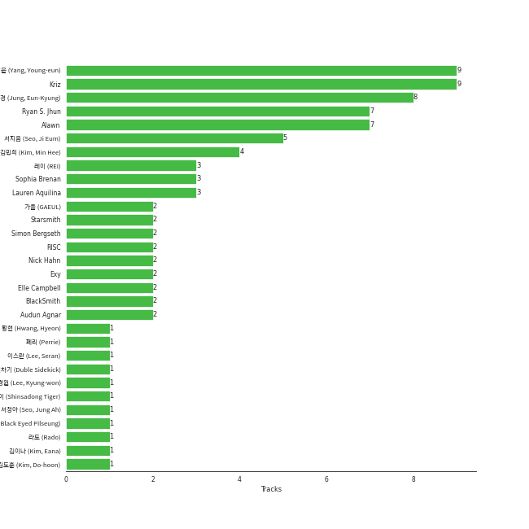

# Starship Entertainment

35 songs

[See Track Features](audio_features.md)

[See Clusters](clusters/overview.md)

Appears as:
- Starship Entertainment (25 tracks)
- STARSHIP ENTERTAINMENT (6 tracks)
- STARSHIP Entertainment (4 tracks)

## Top Artists

| Art | Tracks | 💚 | Artist | 🔗 |
|:---|---:|---:|:---|:---|
|  | 12 | 10 | [IVE](../../artists/ive/overview.md) | [🔗](https://open.spotify.com/artist/6RHTUrRF63xao58xh9FXYJ) |
|  | 5 | 5 | [WJSN](../../artists/wjsn/overview.md) | [🔗](https://open.spotify.com/artist/6hhqsQZhtp9hfaZhSd0VSD) |
|  | 6 | 3 | SISTAR | [🔗](https://open.spotify.com/artist/2wTLheTmMcFCA4hdY8hZJP) |
|  | 3 | 3 | MONSTA X | [🔗](https://open.spotify.com/artist/4TnGh5PKbSjpYqpIdlW5nz) |
|  | 2 | 1 | JOOHONEY | [🔗](https://open.spotify.com/artist/4rpOWirhzqN7NPgRX76l1k) |
|  | 1 | 1 | HYOLYN | [🔗](https://open.spotify.com/artist/78sJswwVn4P8aEhkF4K6fQ) |
|  | 1 | 1 | SHOWNU X HYUNGWON (MONSTA X) | [🔗](https://open.spotify.com/artist/3AFqxSVdKDJD9qPx3K8tKg) |
|  | 1 | 1 | WJSN THE BLACK | [🔗](https://open.spotify.com/artist/0M3eRYg8ULjCtLFvhc5Orb) |
|  | 2 | 0 | WJSN Chocome | [🔗](https://open.spotify.com/artist/5VyqN5hNo0TbYF0ICU77nn) |
|  | 1 | 0 | CRAVITY | [🔗](https://open.spotify.com/artist/6FkhUhUwSPl3mGB6mmE8wn) |

See all 11 artists

| Art | Tracks | 💚 | Artist | 🔗 |
|:---|---:|---:|:---|:---|
|  | 1 | 0 | SISTAR19 | [🔗](https://open.spotify.com/artist/5Q0U6ogBrMX2oxmxy5OTzU) |

## Top Albums

| Art | Tracks | 💚 | Album | Release Date | 🔗 |
|:---|---:|---:|:---|:---|:---|
|  | 5 | 5 | I've IVE | 2023-04-10 | [🔗](https://open.spotify.com/album/38VzP4yWfHdHafITKKRHEB) |
|  | 2 | 2 | I'VE MINE | 2023-10-13 | [🔗](https://open.spotify.com/album/5J7VAdKdGZGme6wymgopbp) |
|  | 2 | 1 | LOVE DIVE | 2022-04-05 | [🔗](https://open.spotify.com/album/1AFVTHHm7kKoQ6Rgb25x3p) |
|  | 2 | 0 | INSANE LOVE | 2016-06-21 | [🔗](https://open.spotify.com/album/4Yz1WY6PlJepdbnl4m72b8) |
|  | 1 | 1 | UNNATURAL | 2021-03-31 | [🔗](https://open.spotify.com/album/0uD1Chx5ZsnZM4kS8yK0S8) |
|  | 1 | 1 | TOUCH N MOVE | 2014-07-21 | [🔗](https://open.spotify.com/album/0SeSM1CAqu7QUkive4jCKl) |
|  | 1 | 1 | THE UNSEEN | 2023-07-25 | [🔗](https://open.spotify.com/album/4gV0rLK0np1Nyde3N38RBh) |
|  | 1 | 1 | THE SECRET | 2016-08-17 | [🔗](https://open.spotify.com/album/0usNbLkckzIo34wUPehZdh) |
|  | 1 | 1 | THE CODE | 2017-11-07 | [🔗](https://open.spotify.com/album/4NJpBKY4XJbRLAsbbeIzyJ) |
|  | 1 | 1 | Sequence | 2022-07-05 | [🔗](https://open.spotify.com/album/2Cv3xionHF2O7QL8p6MbCT) |

See all 28 albums

| Art | Tracks | 💚 | Album | Release Date | 🔗 |
|:---|---:|---:|:---|:---|:---|
|  | 1 | 1 | REASON | 2023-01-09 | [🔗](https://open.spotify.com/album/5evr2BAxQmxyF8dZyaezzS) |
|  | 1 | 1 | One of a Kind | 2021-06-01 | [🔗](https://open.spotify.com/album/2Zuovdo5g1RhfbHniwZ8yI) |
|  | 1 | 1 | Neverland | 2020-06-09 | [🔗](https://open.spotify.com/album/5DHseF14USVgIZ6AzsX9bi) |
|  | 1 | 1 | My attitude | 2021-05-12 | [🔗](https://open.spotify.com/album/1RR97BqW9TH7t0vV4T9JcG) |
|  | 1 | 1 | LOVE & HATE | 2013-11-26 | [🔗](https://open.spotify.com/album/26FsnZOVOJDjKeWUbXuDVG) |
|  | 1 | 1 | LIGHTS | 2023-05-22 | [🔗](https://open.spotify.com/album/6cnmwaHjTjBy3PbLdh6nla) |
|  | 1 | 1 | HAPPY MOMENT (1) | 2017-06-07 | [🔗](https://open.spotify.com/album/4nnyYQGOKRU090FK7sfunL) |
|  | 1 | 1 | Give It To Me (2) | 2013-06-11 | [🔗](https://open.spotify.com/album/1nErNFyYvHnuCYvfwrMyoz) |
|  | 1 | 1 | ELEVEN | 2021-12-01 | [🔗](https://open.spotify.com/album/1XMYvsHRt52sMi6wittWqI) |
|  | 1 | 1 | After LIKE | 2022-08-22 | [🔗](https://open.spotify.com/album/0nzRF7khA2UDSZa9T0B6Da) |
|  | 1 | 1 | ALONE | 2012-04-12 | [🔗](https://open.spotify.com/album/5PXVRXQIPAXH0j78MfeDrV) |
|  | 1 | 0 | Super Yuppers! | 2022-01-05 | [🔗](https://open.spotify.com/album/5Sh3VW04we2IqNP7BlBwuM) |
|  | 1 | 0 | Spotify Singles - Holiday | 2022-11-16 | [🔗](https://open.spotify.com/album/6LNdcxlSXwXv2UFKQ3pvMk) |
|  | 1 | 0 | SHAKE IT | 2015-06-22 | [🔗](https://open.spotify.com/album/7wxGBt2oAGDjZ9CgPhQU8C) |
|  | 1 | 0 | Ma Boy | 2011-05-03 | [🔗](https://open.spotify.com/album/76EJZHFfzKIOrf97HE4at7) |
|  | 1 | 0 | MIXTAPE [ PSYCHE ] | 2020-10-09 | [🔗](https://open.spotify.com/album/3UxCU4YihXm1ghv3hKqfnz) |
|  | 1 | 0 | Hmph! | 2020-10-07 | [🔗](https://open.spotify.com/album/3oiVOb6e43wsvdV4ClJYm0) |
|  | 1 | 0 | CRAVITY 1ST ALBUM PART 2 [LIBERTY : IN OUR COSMOS] | 2022-03-22 | [🔗](https://open.spotify.com/album/0fQl58pOwJpkTfVUZudzpY) |

## Genres

| Tracks | 💚 | Genre |
|---:|---:|:---|
| 27 | 19 | [k-pop girl group](../../genres/k-pop_girl_group/overview.md) |
| 19 | 13 | [k-pop](../../genres/k-pop/overview.md) |
| 3 | 3 | [k-pop boy group](../../genres/k-pop_boy_group/overview.md) |
| 1 | 1 | [korean r&b](../../genres/korean_r_b/overview.md) |

## Top Producers

| Art | Producer | Tracks | Credit Types |
|:---|:---|---:|:---|
| | [Kriz](../../producers/kriz/overview.md) | 9 | Arranger |
| | [양영은 (Yang, Young-eun)](../../producers/양영은_(yang,_young-eun)/overview.md) | 9 | Producer |
| | [정은경 (Jung, Eun-Kyung)](../../producers/정은경_(jung,_eun-kyung)/overview.md) | 8 | Producer |
| | [Ryan S. Jhun](../../producers/ryan_s__jhun/overview.md) | 7 | Arranger, Songwriter, Lyricist, Producer |
| | Alawn | 7 | Producer, Arranger |
| | [서지음 (Seo, Ji Eum)](../../producers/서지음_(seo,_ji_eum)/overview.md) | 5 | Lyricist |
| | 김민희 (Kim, Min Hee) | 4 | Producer |
| | Sophia Brenan | 3 | Songwriter |
| | 레이 (REI) | 3 | Lyricist |
| | Lauren Aquilina | 3 | Songwriter |

View all

| Art | Producer | Tracks | Credit Types |
|:---|:---|---:|:---|
| | RISC | 2 | Arranger |
| | Nick Hahn | 2 | Arranger, Songwriter |
| | Audun Agnar | 2 | Arranger, Songwriter |
| | BlackSmith | 2 | Songwriter |
| | Simon Bergseth | 2 | Producer |
| | Starsmith | 2 | Arranger, Songwriter |
| | 가을 (GAEUL) | 2 | Lyricist |
| | Exy | 2 | Lyricist |
| | Elle Campbell | 2 | Songwriter |
| | SOHLHEE | 1 | Lyricist |
| | 이경원 (Lee, Kyung-won) | 1 | Producer |
| | Benjamin Pinkus | 1 | Arranger, Songwriter |
| | [블랙아이드필승 (Black Eyed Pilseung)](../../producers/블랙아이드필승_(black_eyed_pilseung)/overview.md) | 1 | Lyricist, Songwriter |
| | Emily Harbakk | 1 | Songwriter |
| | 이단옆차기 (Duble Sidekick) | 1 | Lyricist, Songwriter |
| | 페리 (Perrie) | 1 | Lyricist |
| | BIG Naughty | 1 | Lyricist |
| | Elof Loelv | 1 | Arranger, Songwriter |
| | Stally | 1 | Arranger, Songwriter |
| | Iselin Solheim | 1 | Songwriter |
| | Markus Gustafson | 1 | Producer |
| | e.one | 1 | Arranger, Lyricist, Songwriter |
| | Eline Noelia | 1 | Songwriter |
| | Hilda Stenmalm | 1 | Songwriter |
| | Brave Brothers | 1 | Arranger, Lyricist, Songwriter |
| | Kyle Joseph Faulkner | 1 | Songwriter |
| | Lars Kristian Rosness | 1 | Arranger, Songwriter |
| | 신사동호랭이 (Shinsadong Tiger) | 1 | Arranger |
| | 황현 (Hwang, Hyeon) | 1 | Lyricist |
| | 서정아 (Seo, Jung Ah) | 1 | Lyricist |
| | Anders Nilsen | 1 | Arranger, Songwriter |
| | Adriana Caldas de Barros | 1 | Songwriter |
| | [김이나 (Kim, Eana)](../../producers/김이나_(kim,_eana)/overview.md) | 1 | Lyricist |
| | [라도 (Rado)](../../producers/라도_(rado)/overview.md) | 1 | Arranger |
| | LOSTBOY | 1 | Arranger, Songwriter |
| | 이스란 (Lee, Seran) | 1 | Lyricist |
| | Avin | 1 | Arranger |
| | Tea Carpenter | 1 | Songwriter |
| | Andre Davidson | 1 | Songwriter |
| | Sean Davidson | 1 | Songwriter |
| | Alexander Pavelich | 1 | Songwriter |
| | Bård Bonsaksen (Bonsaken, Bård) | 1 | Songwriter |
| | Sivert Hjeltnes Hagtvet | 1 | Arranger, Songwriter |
| | Kristin Marie | 1 | Arranger, Songwriter |
| | [김도훈 (Kim, Do-hoon)](../../producers/김도훈_(kim,_do-hoon)/overview.md) | 1 | Arranger |
| | Mommy Son | 1 | Lyricist |
| | Sofiloud | 1 | Songwriter |
| | Lauren Keen | 1 | Songwriter |
| | Tor-Andrè Jensen Skaar (Skaar, Tor-Andrè Jensen) | 1 | Songwriter |
| | Corey Sanders | 1 | Songwriter |
| | PATEKO | 1 | Arranger, Songwriter |
| | Slay | 1 | Arranger |

## Tracks released under Starship Entertainment

| Art | Track | Album | Artists | Label | Rank | 💚 | 🔗 |
|:---|:---|:---|:---|:---|---:|:---|:---|
|  | I AM | I've IVE | [IVE](../../artists/ive/overview.md) | [Starship Entertainment](.) | 116 | 💚 | [🔗](https://open.spotify.com/track/70t7Q6AYG6ZgTYmJWcnkUM) |
|  | After LIKE | After LIKE | [IVE](../../artists/ive/overview.md) | [Starship Entertainment](.) | 176 | 💚 | [🔗](https://open.spotify.com/track/2gYj9lubBorOPIVWsTXugG) |
|  | Baddie | I'VE MINE | [IVE](../../artists/ive/overview.md) | [Starship Entertainment](.) | 207 | 💚 | [🔗](https://open.spotify.com/track/7uyeEbG6hyApgXuEypGcsZ) |
|  | LOVE DIVE | LOVE DIVE | [IVE](../../artists/ive/overview.md) | [STARSHIP Entertainment](.) | 256 | 💚 | [🔗](https://open.spotify.com/track/0Q5VnK2DYzRyfqQRJuUtvi) |
|  | Lips | I've IVE | [IVE](../../artists/ive/overview.md) | [Starship Entertainment](.) | 309 | 💚 | [🔗](https://open.spotify.com/track/0dRSOmb7pqkkmjXCu5BYbe) |
|  | Alone | ALONE | SISTAR | [Starship Entertainment](.) | 392 | 💚 | [🔗](https://open.spotify.com/track/40gUfKHwCNLpXowFN9Hvsu) |
|  | One way love | LOVE & HATE | HYOLYN | [Starship Entertainment](.) | 438 | 💚 | [🔗](https://open.spotify.com/track/2UIXAxLWIPM6ALPGCeeXfH) |
|  | 섬찟 (Hypnosis) | I've IVE | [IVE](../../artists/ive/overview.md) | [Starship Entertainment](.) | 492 | 💚 | [🔗](https://open.spotify.com/track/1tzeAVyGwvoHcVzDit0UeT) |
|  | Beautiful Liar | REASON | MONSTA X | [Starship Entertainment](.) | 532 | 💚 | [🔗](https://open.spotify.com/track/1F6qqwgyBjcIMzen8RrOXQ) |
|  | Blue Blood | I've IVE | [IVE](../../artists/ive/overview.md) | [Starship Entertainment](.) | 649 | 💚 | [🔗](https://open.spotify.com/track/2avdbiswb0d5AFmyyz68xP) |

See all tracks

| Art | Track | Album | Artists | Label | Rank | 💚 | 🔗 |
|:---|:---|:---|:---|:---|---:|:---|:---|
|  | Ma Boy | Ma Boy | SISTAR19 | [Starship Entertainment](.) | nan | | [🔗](https://open.spotify.com/track/1CkTEh21SLHbiAj2qy8wc1) |
|  | Give it to me | Give It To Me (2) | SISTAR | [Starship Entertainment](.) | nan | 💚 | [🔗](https://open.spotify.com/track/1t88m8JUlqn9kf0FLmVta5) |
|  | Touch my body | TOUCH N MOVE | SISTAR | [Starship Entertainment](.) | nan | 💚 | [🔗](https://open.spotify.com/track/5crARIrvoMiMf2AdlD78WN) |
|  | SHAKE IT | SHAKE IT | SISTAR | [Starship Entertainment](.) | nan | | [🔗](https://open.spotify.com/track/59FBFyeST1vqN8G41YgFS6) |
|  | I Like That | INSANE LOVE | SISTAR | [Starship Entertainment](.) | nan | | [🔗](https://open.spotify.com/track/4wAjmojVxc6Wbeca9XvnDo) |
|  | Say! Yes | INSANE LOVE | SISTAR | [Starship Entertainment](.) | nan | | [🔗](https://open.spotify.com/track/5gDxhjgpRoClBFrOcNGiEQ) |
|  | Secret | THE SECRET | [WJSN](../../artists/wjsn/overview.md) | [Starship Entertainment](.) | nan | 💚 | [🔗](https://open.spotify.com/track/1OIb1AalkGikhzCRbWgchd) |
|  | Babyface | HAPPY MOMENT (1) | [WJSN](../../artists/wjsn/overview.md) | [Starship Entertainment](.) | nan | 💚 | [🔗](https://open.spotify.com/track/6l6sytFAfe0esA5DYLwqhE) |
|  | DRAMARAMA | THE CODE | MONSTA X | [Starship Entertainment](.) | nan | 💚 | [🔗](https://open.spotify.com/track/1BSncOsSJPQkpl29QM0ipj) |
|  | Pantomime | Neverland | [WJSN](../../artists/wjsn/overview.md) | [STARSHIP ENTERTAINMENT](.) | nan | 💚 | [🔗](https://open.spotify.com/track/4lPsBlof2cjAIArw0nOGvQ) |
|  | Hmph! | Hmph! | WJSN Chocome | [STARSHIP ENTERTAINMENT](.) | nan | | [🔗](https://open.spotify.com/track/0UF2ka9POcLMSi1rf9pwgA) |
|  | SMOKY | MIXTAPE [ PSYCHE ] | JOOHONEY | [Starship Entertainment](.) | nan | | [🔗](https://open.spotify.com/track/2RdsTI9mfgdrNBIoShmI99) |
|  | UNNATURAL | UNNATURAL | [WJSN](../../artists/wjsn/overview.md) | [STARSHIP ENTERTAINMENT](.) | nan | 💚 | [🔗](https://open.spotify.com/track/1eykKBqxHgasGHwjOQIvbt) |
|  | Easy | My attitude | WJSN THE BLACK | [STARSHIP ENTERTAINMENT](.) | nan | 💚 | [🔗](https://open.spotify.com/track/3KLkc1h39HhbuXIYB5xgAq) |
|  | GAMBLER | One of a Kind | MONSTA X | [Starship Entertainment](.) | nan | 💚 | [🔗](https://open.spotify.com/track/1Zsy7gMUcHDhxC0bbyZmC2) |
|  | ELEVEN | ELEVEN | [IVE](../../artists/ive/overview.md) | [STARSHIP Entertainment](.) | nan | 💚 | [🔗](https://open.spotify.com/track/7n2FZQsaLb7ZRfRPfEeIvr) |
|  | Super Yuppers! | Super Yuppers! | WJSN Chocome | [STARSHIP ENTERTAINMENT](.) | nan | | [🔗](https://open.spotify.com/track/31bblGq3GvqLutoW9wTcZy) |
|  | Adrenaline | CRAVITY 1ST ALBUM PART 2 [LIBERTY : IN OUR COSMOS] | CRAVITY | [STARSHIP Entertainment](.) | nan | | [🔗](https://open.spotify.com/track/5SbVAjEbm6YS9qF8m8EYGD) |
|  | ROYAL | LOVE DIVE | [IVE](../../artists/ive/overview.md) | [STARSHIP Entertainment](.) | nan | | [🔗](https://open.spotify.com/track/0LMdtBOxbVgrYoA4n0Vwvv) |
|  | Last Sequence | Sequence | [WJSN](../../artists/wjsn/overview.md) | [STARSHIP ENTERTAINMENT](.) | nan | 💚 | [🔗](https://open.spotify.com/track/0lNPjT58llQGlycRA2mea4) |
|  | After LIKE - Holiday Remix | Spotify Singles - Holiday | [IVE](../../artists/ive/overview.md) | [Starship Entertainment](.) | nan | | [🔗](https://open.spotify.com/track/7DMsSbvw9BOp4BpxraTtNX) |
|  | Kitsch | I've IVE | [IVE](../../artists/ive/overview.md) | [Starship Entertainment](.) | nan | 💚 | [🔗](https://open.spotify.com/track/7foeH2Emgq8A3LWk3q6dat) |
|  | FREEDOM | LIGHTS | JOOHONEY | [Starship Entertainment](.) | nan | 💚 | [🔗](https://open.spotify.com/track/5UA91Wf0dAxnCPbFdJJv0a) |
|  | Love Me A Little | THE UNSEEN | SHOWNU X HYUNGWON (MONSTA X) | [Starship Entertainment](.) | nan | 💚 | [🔗](https://open.spotify.com/track/66RK4bz7fZGrfyBb3y9Yal) |
|  | Off The Record | I'VE MINE | [IVE](../../artists/ive/overview.md) | [Starship Entertainment](.) | nan | 💚 | [🔗](https://open.spotify.com/track/6TNx6kHZeVDByUNMVxkAfa) |

