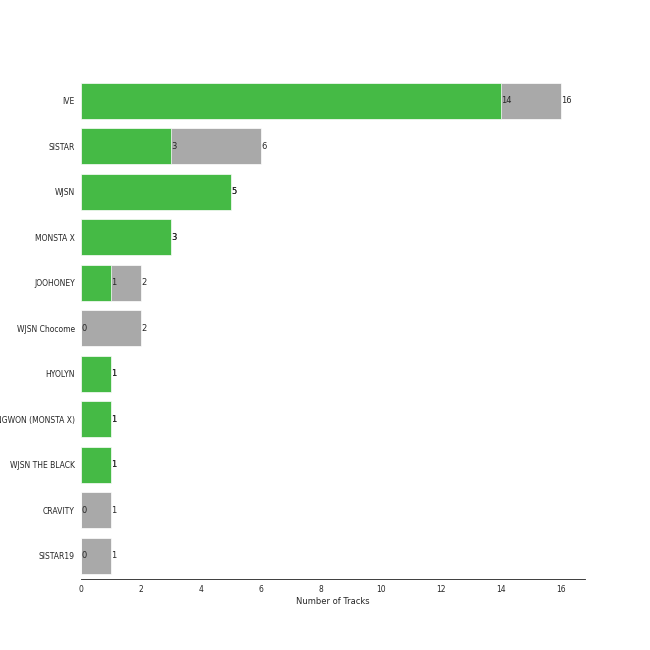

# Starship Entertainment

30 songs

[See Track Features](audio_features.md)

[See Clusters](clusters/overview.md)

Appears as:
- Starship Entertainment (21 tracks)
- STARSHIP ENTERTAINMENT (5 tracks)
- STARSHIP Entertainment (4 tracks)

## Top Artists

| Art | Tracks | 💚 | Artist | 🔗 |
|:---|---:|---:|:---|:---|
|  | 10 | 6 | [IVE](../../artists/ive/overview.md) | [🔗](https://open.spotify.com/artist/6RHTUrRF63xao58xh9FXYJ) |
|  | 5 | 5 | [WJSN](../../artists/wjsn/overview.md) | [🔗](https://open.spotify.com/artist/6hhqsQZhtp9hfaZhSd0VSD) |
|  | 6 | 3 | SISTAR | [🔗](https://open.spotify.com/artist/2wTLheTmMcFCA4hdY8hZJP) |
|  | 3 | 3 | MONSTA X | [🔗](https://open.spotify.com/artist/4TnGh5PKbSjpYqpIdlW5nz) |
|  | 2 | 1 | JOOHONEY | [🔗](https://open.spotify.com/artist/4rpOWirhzqN7NPgRX76l1k) |
|  | 1 | 1 | HYOLYN | [🔗](https://open.spotify.com/artist/78sJswwVn4P8aEhkF4K6fQ) |
|  | 2 | 0 | WJSN Chocome | [🔗](https://open.spotify.com/artist/5VyqN5hNo0TbYF0ICU77nn) |
|  | 1 | 0 | CRAVITY | [🔗](https://open.spotify.com/artist/6FkhUhUwSPl3mGB6mmE8wn) |

## Top Albums

| Art | Tracks | 💚 | Album | Release Date | 🔗 |
|:---|---:|---:|:---|:---|:---|
|  | 5 | 3 | I've IVE | 2023-04-10 | [🔗](https://open.spotify.com/album/38VzP4yWfHdHafITKKRHEB) |
|  | 2 | 1 | LOVE DIVE | 2022-04-05 | [🔗](https://open.spotify.com/album/1AFVTHHm7kKoQ6Rgb25x3p) |
|  | 2 | 1 | INSANE LOVE | 2016-06-21 | [🔗](https://open.spotify.com/album/4Yz1WY6PlJepdbnl4m72b8) |
|  | 1 | 1 | UNNATURAL | 2021-03-31 | [🔗](https://open.spotify.com/album/0uD1Chx5ZsnZM4kS8yK0S8) |
|  | 1 | 1 | THE SECRET | 2016-08-17 | [🔗](https://open.spotify.com/album/0usNbLkckzIo34wUPehZdh) |
|  | 1 | 1 | THE CODE | 2017-11-07 | [🔗](https://open.spotify.com/album/4NJpBKY4XJbRLAsbbeIzyJ) |
|  | 1 | 1 | Sequence | 2022-07-05 | [🔗](https://open.spotify.com/album/2Cv3xionHF2O7QL8p6MbCT) |
|  | 1 | 1 | REASON | 2023-01-09 | [🔗](https://open.spotify.com/album/5evr2BAxQmxyF8dZyaezzS) |
|  | 1 | 1 | One of a Kind | 2021-06-01 | [🔗](https://open.spotify.com/album/2Zuovdo5g1RhfbHniwZ8yI) |
|  | 1 | 1 | Neverland | 2020-06-09 | [🔗](https://open.spotify.com/album/5DHseF14USVgIZ6AzsX9bi) |

See all 24 albums

| Art | Tracks | 💚 | Album | Release Date | 🔗 |
|:---|---:|---:|:---|:---|:---|
|  | 1 | 1 | LOVE & HATE | 2013-11-26 | [🔗](https://open.spotify.com/album/26FsnZOVOJDjKeWUbXuDVG) |
|  | 1 | 1 | LIGHTS | 2023-05-22 | [🔗](https://open.spotify.com/album/6cnmwaHjTjBy3PbLdh6nla) |
|  | 1 | 1 | HAPPY MOMENT (1) | 2017-06-07 | [🔗](https://open.spotify.com/album/4nnyYQGOKRU090FK7sfunL) |
|  | 1 | 1 | Give It To Me (2) | 2013-06-11 | [🔗](https://open.spotify.com/album/1nErNFyYvHnuCYvfwrMyoz) |
|  | 1 | 1 | ELEVEN | 2021-12-01 | [🔗](https://open.spotify.com/album/1XMYvsHRt52sMi6wittWqI) |
|  | 1 | 1 | After LIKE | 2022-08-22 | [🔗](https://open.spotify.com/album/0nzRF7khA2UDSZa9T0B6Da) |
|  | 1 | 1 | ALONE | 2012-04-12 | [🔗](https://open.spotify.com/album/5PXVRXQIPAXH0j78MfeDrV) |
|  | 1 | 0 | TOUCH N MOVE | 2014-07-21 | [🔗](https://open.spotify.com/album/0SeSM1CAqu7QUkive4jCKl) |
|  | 1 | 0 | Super Yuppers! | 2022-01-05 | [🔗](https://open.spotify.com/album/5Sh3VW04we2IqNP7BlBwuM) |
|  | 1 | 0 | Spotify Singles - Holiday | 2022-11-16 | [🔗](https://open.spotify.com/album/6LNdcxlSXwXv2UFKQ3pvMk) |
|  | 1 | 0 | SHAKE IT | 2015-06-22 | [🔗](https://open.spotify.com/album/7wxGBt2oAGDjZ9CgPhQU8C) |
|  | 1 | 0 | MIXTAPE [ PSYCHE ] | 2020-10-09 | [🔗](https://open.spotify.com/album/3UxCU4YihXm1ghv3hKqfnz) |
|  | 1 | 0 | Hmph! | 2020-10-07 | [🔗](https://open.spotify.com/album/3oiVOb6e43wsvdV4ClJYm0) |
|  | 1 | 0 | CRAVITY 1ST ALBUM PART 2 [LIBERTY : IN OUR COSMOS] | 2022-03-22 | [🔗](https://open.spotify.com/album/0fQl58pOwJpkTfVUZudzpY) |

## Genres

| Tracks | 💚 | Genre |
|---:|---:|:---|
| 23 | 14 | [k-pop girl group](../../genres/k_pop_girl_group/overview.md) |
| 18 | 13 | [k-pop](../../genres/k_pop/overview.md) |
| 3 | 3 | [k-pop boy group](../../genres/k_pop_boy_group/overview.md) |
| 1 | 1 | [korean r&b](../../genres/korean_r_b/overview.md) |

## Tracks released under Starship Entertainment

| Art | Track | Album | Artists | Label | 💚 | 🔗 |
|:---|:---|:---|:---|:---|:---|:---|
|  | Adrenaline | CRAVITY 1ST ALBUM PART 2 [LIBERTY : IN OUR COSMOS] | CRAVITY | [STARSHIP Entertainment](.) | | [🔗](https://open.spotify.com/track/5SbVAjEbm6YS9qF8m8EYGD) |
|  | One way love | LOVE & HATE | HYOLYN | [Starship Entertainment](.) | 💚 | [🔗](https://open.spotify.com/track/2UIXAxLWIPM6ALPGCeeXfH) |
|  | ELEVEN | ELEVEN | [IVE](../../artists/ive/overview.md) | [STARSHIP Entertainment](.) | 💚 | [🔗](https://open.spotify.com/track/7n2FZQsaLb7ZRfRPfEeIvr) |
|  | LOVE DIVE | LOVE DIVE | [IVE](../../artists/ive/overview.md) | [STARSHIP Entertainment](.) | 💚 | [🔗](https://open.spotify.com/track/0Q5VnK2DYzRyfqQRJuUtvi) |
|  | ROYAL | LOVE DIVE | [IVE](../../artists/ive/overview.md) | [STARSHIP Entertainment](.) | | [🔗](https://open.spotify.com/track/0LMdtBOxbVgrYoA4n0Vwvv) |
|  | After LIKE | After LIKE | [IVE](../../artists/ive/overview.md) | [Starship Entertainment](.) | 💚 | [🔗](https://open.spotify.com/track/2gYj9lubBorOPIVWsTXugG) |
|  | After LIKE - Holiday Remix | Spotify Singles - Holiday | [IVE](../../artists/ive/overview.md) | [Starship Entertainment](.) | | [🔗](https://open.spotify.com/track/7DMsSbvw9BOp4BpxraTtNX) |
|  | Blue Blood | I've IVE | [IVE](../../artists/ive/overview.md) | [Starship Entertainment](.) | 💚 | [🔗](https://open.spotify.com/track/2avdbiswb0d5AFmyyz68xP) |
|  | I AM | I've IVE | [IVE](../../artists/ive/overview.md) | [Starship Entertainment](.) | 💚 | [🔗](https://open.spotify.com/track/70t7Q6AYG6ZgTYmJWcnkUM) |
|  | Kitsch | I've IVE | [IVE](../../artists/ive/overview.md) | [Starship Entertainment](.) | | [🔗](https://open.spotify.com/track/7foeH2Emgq8A3LWk3q6dat) |

See all tracks

| Art | Track | Album | Artists | Label | 💚 | 🔗 |
|:---|:---|:---|:---|:---|:---|:---|
|  | Lips | I've IVE | [IVE](../../artists/ive/overview.md) | [Starship Entertainment](.) | 💚 | [🔗](https://open.spotify.com/track/0dRSOmb7pqkkmjXCu5BYbe) |
|  | 섬찟 (Hypnosis) | I've IVE | [IVE](../../artists/ive/overview.md) | [Starship Entertainment](.) | | [🔗](https://open.spotify.com/track/1tzeAVyGwvoHcVzDit0UeT) |
|  | SMOKY | MIXTAPE [ PSYCHE ] | JOOHONEY | [Starship Entertainment](.) | | [🔗](https://open.spotify.com/track/2RdsTI9mfgdrNBIoShmI99) |
|  | FREEDOM | LIGHTS | JOOHONEY | [Starship Entertainment](.) | 💚 | [🔗](https://open.spotify.com/track/5UA91Wf0dAxnCPbFdJJv0a) |
|  | DRAMARAMA | THE CODE | MONSTA X | [Starship Entertainment](.) | 💚 | [🔗](https://open.spotify.com/track/1BSncOsSJPQkpl29QM0ipj) |
|  | GAMBLER | One of a Kind | MONSTA X | [Starship Entertainment](.) | 💚 | [🔗](https://open.spotify.com/track/1Zsy7gMUcHDhxC0bbyZmC2) |
|  | Beautiful Liar | REASON | MONSTA X | [Starship Entertainment](.) | 💚 | [🔗](https://open.spotify.com/track/1F6qqwgyBjcIMzen8RrOXQ) |
|  | Alone | ALONE | SISTAR | [Starship Entertainment](.) | 💚 | [🔗](https://open.spotify.com/track/40gUfKHwCNLpXowFN9Hvsu) |
|  | Give it to me | Give It To Me (2) | SISTAR | [Starship Entertainment](.) | 💚 | [🔗](https://open.spotify.com/track/1t88m8JUlqn9kf0FLmVta5) |
|  | Touch my body | TOUCH N MOVE | SISTAR | [Starship Entertainment](.) | | [🔗](https://open.spotify.com/track/5crARIrvoMiMf2AdlD78WN) |
|  | SHAKE IT | SHAKE IT | SISTAR | [Starship Entertainment](.) | | [🔗](https://open.spotify.com/track/59FBFyeST1vqN8G41YgFS6) |
|  | I Like That | INSANE LOVE | SISTAR | [Starship Entertainment](.) | | [🔗](https://open.spotify.com/track/4wAjmojVxc6Wbeca9XvnDo) |
|  | Say! Yes | INSANE LOVE | SISTAR | [Starship Entertainment](.) | 💚 | [🔗](https://open.spotify.com/track/5gDxhjgpRoClBFrOcNGiEQ) |
|  | Secret | THE SECRET | [WJSN](../../artists/wjsn/overview.md) | [Starship Entertainment](.) | 💚 | [🔗](https://open.spotify.com/track/1OIb1AalkGikhzCRbWgchd) |
|  | Babyface | HAPPY MOMENT (1) | [WJSN](../../artists/wjsn/overview.md) | [Starship Entertainment](.) | 💚 | [🔗](https://open.spotify.com/track/6l6sytFAfe0esA5DYLwqhE) |
|  | Pantomime | Neverland | [WJSN](../../artists/wjsn/overview.md) | [STARSHIP ENTERTAINMENT](.) | 💚 | [🔗](https://open.spotify.com/track/4lPsBlof2cjAIArw0nOGvQ) |
|  | UNNATURAL | UNNATURAL | [WJSN](../../artists/wjsn/overview.md) | [STARSHIP ENTERTAINMENT](.) | 💚 | [🔗](https://open.spotify.com/track/1eykKBqxHgasGHwjOQIvbt) |
|  | Last Sequence | Sequence | [WJSN](../../artists/wjsn/overview.md) | [STARSHIP ENTERTAINMENT](.) | 💚 | [🔗](https://open.spotify.com/track/0lNPjT58llQGlycRA2mea4) |
|  | Hmph! | Hmph! | WJSN Chocome | [STARSHIP ENTERTAINMENT](.) | | [🔗](https://open.spotify.com/track/0UF2ka9POcLMSi1rf9pwgA) |
|  | Super Yuppers! | Super Yuppers! | WJSN Chocome | [STARSHIP ENTERTAINMENT](.) | | [🔗](https://open.spotify.com/track/31bblGq3GvqLutoW9wTcZy) |

