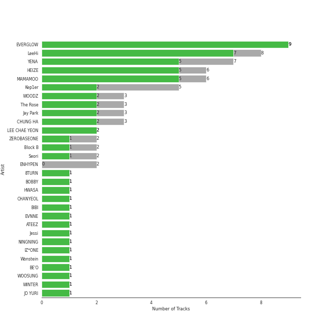
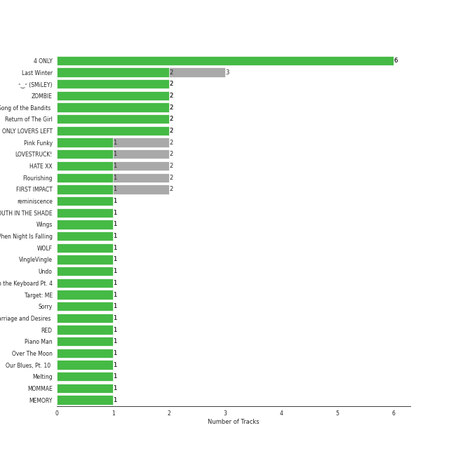
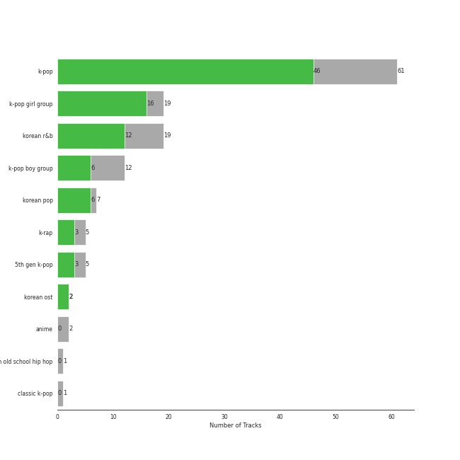

# Stone Music Entertainment

89 songs

[See Track Features](audio_features.md)

[See Clusters](clusters/overview.md)

Appears as:
- Genie Music Corporation, Stone Music Entertainment (87 tracks)
- Genie Music Corporation;Stone Music Entertainment (1 tracks)
- Stone Music Entertainment (1 tracks)

## Top Artists

| Art | Rank | Tracks | 💚 | Artist | 🔗 |
|:---|---:|---:|---:|:---|:---|
|  | 42 | 9 | 9 | [EVERGLOW](../../artists/everglow/overview.md) | [🔗](https://open.spotify.com/artist/3ZZzT0naD25RhY2uZvIKkJ) |
|  | 11 | 8 | 7 | [LeeHi](../../artists/leehi/overview.md) | [🔗](https://open.spotify.com/artist/7cVZApDoQZpS447nHTsNqu) |
|  | 160 | 7 | 5 | [YENA](../../artists/yena/overview.md) | [🔗](https://open.spotify.com/artist/49muoiIu4uea4PO8vueUNN) |
|  | 38 | 6 | 5 | [HEIZE](../../artists/heize/overview.md) | [🔗](https://open.spotify.com/artist/5dCvSnVduaFleCnyy98JMo) |
|  | 16 | 6 | 5 | [MAMAMOO](../../artists/mamamoo/overview.md) | [🔗](https://open.spotify.com/artist/0XATRDCYuuGhk0oE7C0o5G) |
|  | 422 | 5 | 2 | Kep1er | [🔗](https://open.spotify.com/artist/5R7AMwDeroq6Ls0COQYpS4) |
|  | 434 | 3 | 2 | WOODZ | [🔗](https://open.spotify.com/artist/6y9nlaoynxSvoTGY09Vdcy) |
|  | 434 | 3 | 2 | [The Rose](../../artists/the_rose/overview.md) | [🔗](https://open.spotify.com/artist/5na1LmEmK2VzNLje9snJYW) |
|  | 210 | 3 | 2 | Jay Park | [🔗](https://open.spotify.com/artist/4XDi67ZENZcbfKnvMnTYsI) |
|  | 14 | 3 | 2 | [CHUNG HA](../../artists/chung_ha/overview.md) | [🔗](https://open.spotify.com/artist/2PSJ6YriU7JsFucxACpU7Y) |

See all 52 artists

| Art | Rank | Tracks | 💚 | Artist | 🔗 |
|:---|---:|---:|---:|:---|:---|
|  | 330 | 2 | 2 | LEE CHAE YEON | [🔗](https://open.spotify.com/artist/2nkZR6LwPxaAVtaVitNIPT) |
|  | 235 | 2 | 1 | ZEROBASEONE | [🔗](https://open.spotify.com/artist/7cjg7EkeZy3OI5o9Qthc6n) |
|  | 434 | 2 | 1 | Block B | [🔗](https://open.spotify.com/artist/4RnezwRV7VBJUCI1S0AE5u) |
|  | 419 | 2 | 1 | Seori | [🔗](https://open.spotify.com/artist/2bWTIIQP9zaVc55RaMGu7e) |
|  | 434 | 1 | 1 | 8TURN | [🔗](https://open.spotify.com/artist/7tCg9aiVKZ5Cmhbfb7UoqM) |
|  | 411 | 1 | 1 | BOBBY | [🔗](https://open.spotify.com/artist/7ieMQQDR0bdBPz572mtxwS) |
|  | 51 | 1 | 1 | [HWASA](../../artists/hwasa/overview.md) | [🔗](https://open.spotify.com/artist/7bmYpVgQub656uNTu6qGNQ) |
|  | 434 | 1 | 1 | CHANYEOL | [🔗](https://open.spotify.com/artist/6jV25rzTKQ2zMgrqHha1V5) |
|  | 72 | 1 | 1 | [BIBI](../../artists/bibi/overview.md) | [🔗](https://open.spotify.com/artist/6UbmqUEgjLA6jAcXwbM1Z9) |
|  | 434 | 1 | 1 | EVNNE | [🔗](https://open.spotify.com/artist/6SYJFHPxXkr4SZJR8aLEml) |
|  | 45 | 1 | 1 | [ATEEZ](../../artists/ateez/overview.md) | [🔗](https://open.spotify.com/artist/68KmkJeZGfwe1OUaivBa2L) |
|  | 434 | 1 | 1 | Jessi | [🔗](https://open.spotify.com/artist/64k5e9kV9MdukXjFrR5R37) |
|  | 73 | 1 | 1 | NINGNING | [🔗](https://open.spotify.com/artist/5t1uryofgueHrjrryqX8vM) |
|  | 377 | 1 | 1 | IZ*ONE | [🔗](https://open.spotify.com/artist/5r1tUTxVSgvBHnoDuDODPH) |
|  | 434 | 1 | 1 | Wonstein | [🔗](https://open.spotify.com/artist/5o615XColiSVMPDWlslKSk) |
|  | 434 | 1 | 1 | BE'O | [🔗](https://open.spotify.com/artist/5NUVwRESNqYBUTRbiATjy7) |
|  | 222 | 1 | 1 | WOOSUNG | [🔗](https://open.spotify.com/artist/5LHu1iF8m0XtRBEJbbwSoo) |
|  | 70 | 1 | 1 | [WINTER](../../artists/winter/overview.md) | [🔗](https://open.spotify.com/artist/3mPquBmMu97Iq9TpzQ6ayI) |
|  | 434 | 1 | 1 | JO YURI | [🔗](https://open.spotify.com/artist/3LFFf4EpKn2krneZ9vozyz) |
|  | 229 | 1 | 1 | KARINA | [🔗](https://open.spotify.com/artist/2qwDjeSYANOOBFU8jwtBXx) |
|  | 230 | 1 | 1 | Loco | [🔗](https://open.spotify.com/artist/2e4G04F77jxVuDYo44TCSm) |
|  | 231 | 1 | 1 | Punch | [🔗](https://open.spotify.com/artist/2FgZrgTMX6Sk0VNcOsEPmm) |
|  | 295 | 1 | 1 | TAEIL | [🔗](https://open.spotify.com/artist/1z0Hi3myYw4x32xCq0H3aq) |
|  | 434 | 1 | 1 | VERIVERY | [🔗](https://open.spotify.com/artist/1fWUcRSok57yRm8gPKj1Fc) |
|  | 138 | 1 | 1 | YOON MIRAE | [🔗](https://open.spotify.com/artist/1Do4bSzfUl0KWL9r1fITu0) |
|  | 417 | 1 | 1 | B.I | [🔗](https://open.spotify.com/artist/0UntV1Bw2hk3fbRrm9eMP6) |
|  | 136 | 1 | 1 | PIXY | [🔗](https://open.spotify.com/artist/0CJkEzffVZLgav03xXeC9s) |
|  | 7 | 2 | 0 | [ENHYPEN](../../artists/enhypen/overview.md) | [🔗](https://open.spotify.com/artist/5t5FqBwTcgKTaWmfEbwQY9) |
|  | 434 | 1 | 0 | BVNDIT | [🔗](https://open.spotify.com/artist/5dEBuZjTtE68uDgCs23Kuv) |
|  | 434 | 1 | 0 | Zion.T | [🔗](https://open.spotify.com/artist/5HenzRvMtSrgtvU16XAoby) |
|  | 221 | 1 | 0 | Seo Taiji and Boys | [🔗](https://open.spotify.com/artist/52Gsa9Zypqztm2DeNkQfCm) |
|  | 434 | 1 | 0 | Dynamicduo | [🔗](https://open.spotify.com/artist/4nvFFLtv7ZqoTr83387uK4) |
|  | 140 | 1 | 0 | EPEX | [🔗](https://open.spotify.com/artist/4e2umhzNHTSeQnSCWPN0uT) |
|  | 123 | 1 | 0 | ZICO | [🔗](https://open.spotify.com/artist/4XpUIb8uuNlIWVKmgKZXC0) |
|  | 254 | 1 | 0 | Lee Mujin | [🔗](https://open.spotify.com/artist/4Xj0peBt3EZHbdF20JmdWC) |
|  | 65 | 1 | 0 | [YUQI](../../artists/yuqi/overview.md) | [🔗](https://open.spotify.com/artist/22aCD8IrQZjcPgZw728QT6) |
|  | 434 | 1 | 0 | LIMELIGHT | [🔗](https://open.spotify.com/artist/1mDDvUPSs2dSr4QKAQmOql) |
|  | 434 | 1 | 0 | CIX | [🔗](https://open.spotify.com/artist/1lHfzEkKmmvdVDDDLKkcsd) |
|  | 434 | 1 | 0 | SOOJIN | [🔗](https://open.spotify.com/artist/0kB3Vlf3xDNZQz6NjAPJV8) |
|  | 434 | 1 | 0 | Ugly Duck | [🔗](https://open.spotify.com/artist/0Qr4St9aCOLu41Nt5QZIz1) |
|  | 26 | 1 | 0 | [WENDY](../../artists/wendy/overview.md) | [🔗](https://open.spotify.com/artist/0FRUZvZNPzM3YJMABJxf2K) |
|  | 434 | 1 | 0 | THE NEW SIX | [🔗](https://open.spotify.com/artist/0DRiXmEOc6dJ6Rug3xi4HZ) |

## Top Albums

| Art | Rank | Tracks | 💚 | Album | Release Date | 🔗 |
|:---|---:|---:|---:|:---|:---|:---|
|  | 45 | 6 | 6 | 4 ONLY | 2021-09-09 | [🔗](https://open.spotify.com/album/1DKgZeAYrjslAPZVMe6EFt) |
|  | 148 | 3 | 2 | Last Winter | 2023-12-07 | [🔗](https://open.spotify.com/album/41vj1sO4NJFriquGszDSh5) |
|  | 454 | 2 | 2 | ˣ‿ˣ (SMiLEY) | 2022-01-17 | [🔗](https://open.spotify.com/album/7qldKtsOWklzmwgll5NjCw) |
|  | 321 | 2 | 2 | ZOMBIE | 2024-06-10 | [🔗](https://open.spotify.com/album/6vGrWJmYXU9VqiqpOwPJ2r) |
|  | 233 | 2 | 2 | Song of the Bandits (Original Soundtrack from the Netflix Series) | 2023-09-22 | [🔗](https://open.spotify.com/album/1TXOVlZGrd3KbphTcXN8vw) |
|  | 665 | 2 | 2 | Return of The Girl | 2021-12-01 | [🔗](https://open.spotify.com/album/28p4jKCNlbLUXaZ24iYLuD) |
|  | 665 | 2 | 2 | ONLY LOVERS LEFT | 2021-10-05 | [🔗](https://open.spotify.com/album/1u9nYBB0Qw5jyjkexe9Xk6) |
|  | 665 | 2 | 1 | Pink Funky | 2015-06-19 | [🔗](https://open.spotify.com/album/5Fy5PyBWqMNK7xvXO9Q32f) |
|  | 665 | 2 | 1 | LOVESTRUCK! | 2023-04-10 | [🔗](https://open.spotify.com/album/06qoehc4xjI7IW9J8jQFEX) |
|  | 326 | 2 | 1 | HATE XX | 2023-06-27 | [🔗](https://open.spotify.com/album/3aYLtPSWEqmcLTCfM0ZYl7) |

See all 72 albums

| Art | Rank | Tracks | 💚 | Album | Release Date | 🔗 |
|:---|---:|---:|---:|:---|:---|:---|
|  | 665 | 2 | 1 | Flourishing | 2019-06-24 | [🔗](https://open.spotify.com/album/5rHnbSUBaflJgCLlZfDnzt) |
|  | 665 | 2 | 1 | FIRST IMPACT | 2022-01-03 | [🔗](https://open.spotify.com/album/7pHyAucSgWoDNlFHfhQfVN) |
|  | 608 | 1 | 1 | reminiscence | 2020-02-03 | [🔗](https://open.spotify.com/album/0zH0C0fkzAjhSnGKLOuxwX) |
|  | 358 | 1 | 1 | YOUTH IN THE SHADE | 2023-07-10 | [🔗](https://open.spotify.com/album/7fV7RChHagCcKRnAaDRXuX) |
|  | 665 | 1 | 1 | Wings | 2021-02-24 | [🔗](https://open.spotify.com/album/4knaQg3CtzHlA2m99NS7xW) |
|  | 665 | 1 | 1 | When Night Is Falling | 2021-07-07 | [🔗](https://open.spotify.com/album/3nOIsILeko2meMblKEGYZw) |
|  | 665 | 1 | 1 | WOLF | 2019-07-26 | [🔗](https://open.spotify.com/album/1V60S7FEby9fQwh5eVluj8) |
|  | 232 | 1 | 1 | VingleVingle | 2023-04-05 | [🔗](https://open.spotify.com/album/10Ldh1KXu0ySjpfiX6qLXQ) |
|  | 210 | 1 | 1 | Undo | 2022-06-30 | [🔗](https://open.spotify.com/album/2xR7YEyRweqClzs50bbW3J) |
|  | 665 | 1 | 1 | The Hyena on the Keyboard Pt. 4 | 2018-04-21 | [🔗](https://open.spotify.com/album/2fMMk4DD96UcAmSczUQ0kq) |
|  | 665 | 1 | 1 | Target: ME | 2023-09-19 | [🔗](https://open.spotify.com/album/3zgfK7IBAPDcroAqxzzMOy) |
|  | 665 | 1 | 1 | Sorry | 2017-08-03 | [🔗](https://open.spotify.com/album/6D48tHXsa6LzoViDIACdkt) |
|  | 639 | 1 | 1 | Remarriage and Desires (Original Soundtrack from The Netflix Series) | 2022-07-15 | [🔗](https://open.spotify.com/album/2YM9Oahck5kVuWGiFQK1dg) |
|  | 665 | 1 | 1 | RED | 2019-08-13 | [🔗](https://open.spotify.com/album/5CrMZwZuJcDpzFmMO35vxN) |
|  | 423 | 1 | 1 | Piano Man | 2014-11-21 | [🔗](https://open.spotify.com/album/1kdURRaOTpDCQqsVIU5CiT) |
|  | 445 | 1 | 1 | Over The Moon | 2023-04-12 | [🔗](https://open.spotify.com/album/0WGMSrfOSPh1vctL94IWD3) |
|  | 587 | 1 | 1 | Our Blues, Pt. 10 (Original Television Soundtrack) | 2022-05-22 | [🔗](https://open.spotify.com/album/0mP330aRyX4P4ZjarRKnXO) |
|  | 665 | 1 | 1 | Melting | 2016-02-26 | [🔗](https://open.spotify.com/album/11hjJntrvmauDoga4Krr0U) |
|  | 665 | 1 | 1 | MOMMAE | 2015-05-22 | [🔗](https://open.spotify.com/album/1kgzGqeJbY7gwiheabVk1L) |
|  | 665 | 1 | 1 | MEMORY | 2016-11-07 | [🔗](https://open.spotify.com/album/3Q34hV5fBbMpRpADmlptr7) |
|  | 665 | 1 | 1 | Love War | 2023-01-16 | [🔗](https://open.spotify.com/album/3gWIe0cTPYqrI8xIYHjten) |
|  | 554 | 1 | 1 | Last Melody | 2021-05-25 | [🔗](https://open.spotify.com/album/4ZDUTnUO9CDFmwdCUCQ6dG) |
|  | 511 | 1 | 1 | KINGDOM <FINAL : WHO IS THE KING?> | 2021-05-28 | [🔗](https://open.spotify.com/album/3n1NaviPQXfiVQ0TarnAf4) |
|  | 665 | 1 | 1 | HUSH RUSH | 2022-10-12 | [🔗](https://open.spotify.com/album/6ksAgHMbcJbfxwwO799483) |
|  | 665 | 1 | 1 | HUSH | 2019-08-19 | [🔗](https://open.spotify.com/album/7cGql7l8oRpjGmeDspBMZ2) |
|  | 15 | 1 | 1 | HOLO | 2020-07-23 | [🔗](https://open.spotify.com/album/5xq9sm0jGMMDu5LifpBBo1) |
|  | 665 | 1 | 1 | HER | 2014-07-24 | [🔗](https://open.spotify.com/album/5wHs7NGuapCYtY4wWsYMi3) |
|  | 512 | 1 | 1 | HELLO | 2014-06-18 | [🔗](https://open.spotify.com/album/3Z9cZon6ukg4rvGYu7i4NA) |
|  | 665 | 1 | 1 | HAPPEN | 2021-05-20 | [🔗](https://open.spotify.com/album/4xOOB79WcZuOoVwK06No1s) |
|  | 665 | 1 | 1 | Guardian (Original Television Soundtrack), Pt. 1 | 2016-12-03 | [🔗](https://open.spotify.com/album/6Pr1DaOWfT6hEewhZMRyqg) |
|  | 22 | 1 | 1 | Gotta Go | 2019-01-02 | [🔗](https://open.spotify.com/album/3WgHekDElv10Kam9aCMwnx) |
|  | 538 | 1 | 1 | GOOD MORNING | 2024-01-15 | [🔗](https://open.spotify.com/album/1kfvY0GjQJhhDNjTpy7xOs) |
|  | 665 | 1 | 1 | GLASSY | 2021-10-07 | [🔗](https://open.spotify.com/album/2WCMmZ8vXBnkVp97PzLeoA) |
|  | 665 | 1 | 1 | FACE ME | 2020-01-07 | [🔗](https://open.spotify.com/album/4i3Q8eTqefwISi3WltwzAW) |
|  | 665 | 1 | 1 | EVERYTHING YOU WANTED | 2016-10-20 | [🔗](https://open.spotify.com/album/0c4LKBzh0ufU36AyuzZRc2) |
|  | 665 | 1 | 1 | Cold Blooded | 2021-10-12 | [🔗](https://open.spotify.com/album/4CTDrZw6m0dTJX17OCEbfZ) |
|  | 665 | 1 | 1 | BLOOM*IZ | 2020-02-17 | [🔗](https://open.spotify.com/album/5dm3PMCHxTSOdDFZ1hlfMm) |
|  | 665 | 1 | 1 | ARRIVAL OF EVERGLOW | 2019-03-18 | [🔗](https://open.spotify.com/album/4qFVcLDapqLmjinahsk7U0) |
|  | 539 | 1 | 1 | ALL MY GIRLS | 2023-08-18 | [🔗](https://open.spotify.com/album/2yjigHf9lgspW2K5y99Qr0) |
|  | 665 | 1 | 1 | 8TURNRISE | 2023-01-30 | [🔗](https://open.spotify.com/album/6fvrG4RkX06QBmmc9gA1OQ) |
|  | 623 | 1 | 1 | 1st Single 'S.i.R' | 2023-03-21 | [🔗](https://open.spotify.com/album/7eZ1MuD9GYRP35jumpZStH) |
|  | 665 | 1 | 0 | What Makes You Beautiful [THE SEASONS: Red Carpet with Lee Hyo Ri] | 2024-02-23 | [🔗](https://open.spotify.com/album/3RvguzRz56wqZ9fNldExgn) |
|  | 665 | 1 | 0 | WORLDWIDE | 2015-11-05 | [🔗](https://open.spotify.com/album/5vESroqrGYDxDPAwUceQxf) |
|  | 665 | 1 | 0 | Very Good | 2013-10-02 | [🔗](https://open.spotify.com/album/5AujjoJ3gAth9YnrIXa7Ww) |
|  | 665 | 1 | 0 | The King : Eternal Monarch, Pt. 10 (Original Television Soundtrack) | 2020-05-16 | [🔗](https://open.spotify.com/album/02zl7wdcgbI0URRfMbzmF5) |
|  | 322 | 1 | 0 | Spotify Singles - Holiday | 2021-11-17 | [🔗](https://open.spotify.com/album/5AVL4k3pesuk0jRkTeCOSm) |
|  | 271 | 1 | 0 | Seotaiji and Boys | 1992-03-23 | [🔗](https://open.spotify.com/album/53OG0dLStOizLfNxsD3LPr) |
|  | 665 | 1 | 0 | SMARTPHONE | 2022-08-03 | [🔗](https://open.spotify.com/album/0lbUf1aVf8xmveSuspuNW0) |
|  | 665 | 1 | 0 | Re-Original | 2022-05-25 | [🔗](https://open.spotify.com/album/4vb8wQPnaNgnmUrrmnISOU) |
|  | 665 | 1 | 0 | MELTING POINT | 2023-11-06 | [🔗](https://open.spotify.com/album/5XHHcWUt6zy1nkbzt707ys) |
|  | 665 | 1 | 0 | LULLABY | 2021-08-27 | [🔗](https://open.spotify.com/album/7knAHnDVbgtX05qgU0ZcgT) |
|  | 665 | 1 | 0 | LUCKYNUMBERS | 2013-07-01 | [🔗](https://open.spotify.com/album/4I0RE0MF6b3Hw4Z0iWosxF) |
|  | 665 | 1 | 0 | LIMELIGHT DEBUT EP 'LOVE & HAPPINESS' | 2023-02-17 | [🔗](https://open.spotify.com/album/6bGjdmkGl8QqTa1ElccP3C) |
|  | 665 | 1 | 0 | I Need The Light | 2022-08-12 | [🔗](https://open.spotify.com/album/4RAx28on33NHM5FQiFhyvZ) |
|  | 665 | 1 | 0 | HOSPITAL PLAYLIST Season2, Pt. 1 (Original Television Soundtrack) | 2021-06-18 | [🔗](https://open.spotify.com/album/2pJhtrlZZvxFi818EMvKAY) |
|  | 665 | 1 | 0 | Doona! (Music from The Netflix Series) | 2023-10-20 | [🔗](https://open.spotify.com/album/351LvQJsNt4fvYdnvhzF9D) |
|  | 665 | 1 | 0 | Dawn | 2018-10-05 | [🔗](https://open.spotify.com/album/0YZ0m6Z8xUurgzV9lXvflS) |
|  | 665 | 1 | 0 | DOUBLAST | 2022-06-20 | [🔗](https://open.spotify.com/album/0yMosWzriw3613d26x7MQK) |
|  | 665 | 1 | 0 | CIX 5th EP Album ‘OK’ Episode 1 : OK Not | 2022-08-22 | [🔗](https://open.spotify.com/album/0awixD0tmDTgB6JWfQxwO0) |
|  | 665 | 1 | 0 | BOYHOOD | 2023-06-07 | [🔗](https://open.spotify.com/album/3k4xr3Bn9NfyX7O1nlK7Mg) |
|  | 665 | 1 | 0 | AGASSY | 2023-11-08 | [🔗](https://open.spotify.com/album/5FzkGrCoC8PIz1yz6oy8RK) |
|  | 665 | 1 | 0 | 2nd EP Album ‘Bipolar Pt.2 Prelude of Love’ | 2021-10-26 | [🔗](https://open.spotify.com/album/2OndukzviEZGXIZuZ2c6CL) |

## Genres

| Tracks | 💚 | Genre |
|---:|---:|:---|
| 61 | 46 | [k-pop](../../genres/k-pop/overview.md) |
| 19 | 16 | [k-pop girl group](../../genres/k-pop_girl_group/overview.md) |
| 19 | 12 | [korean r&b](../../genres/korean_r_b/overview.md) |
| 12 | 6 | [k-pop boy group](../../genres/k-pop_boy_group/overview.md) |
| 7 | 6 | [korean pop](../../genres/korean_pop/overview.md) |
| 5 | 3 | [k-rap](../../genres/k-rap/overview.md) |
| 5 | 3 | [5th gen k-pop](../../genres/5th_gen_k-pop/overview.md) |
| 2 | 2 | korean ost |
| 2 | 0 | [anime](../../genres/anime/overview.md) |
| 1 | 0 | korean old school hip hop |

See all 11 genres

| Tracks | 💚 | Genre |
|---:|---:|:---|
| 1 | 0 | classic k-pop |

## Top Producers

| Art | Producer | Tracks | Credit Types |
|:---|:---|---:|:---|
| | [김도훈 (Kim, Do-hoon)](../../producers/김도훈_(kim,_do-hoon)/overview.md) | 4 | Arranger, Lyricist, Songwriter |
| | [서지음 (Seo, Ji Eum)](../../producers/서지음_(seo,_ji_eum)/overview.md) | 2 | Lyricist |
|  | Moon Byul | 2 | Lyricist |
| | 에스나 (Esna) | 2 | Songwriter, Lyricist |
|  | [Solar](../../artists/solar/overview.md) | 2 | Lyricist |
| | 김승수 (Kim, Seungsu) | 2 | Lyricist, Songwriter, Arranger |
| | 유주이 (Yu, Joo-yi) | 1 | Lyricist, Songwriter |
| | 최현준 (Choi, Hyun-Joon) | 1 | Arranger, Lyricist, Songwriter |
|  | [HWASA](../../artists/hwasa/overview.md) | 1 | Lyricist |
| | 이단옆차기 (Duble Sidekick) | 1 | Songwriter |

View all

| Art | Producer | Tracks | Credit Types |
|:---|:---|---:|:---|
| | Yuth | 1 | Arranger, Songwriter |
| | PUFF | 1 | Arranger, Songwriter |
| | THE HUB 88 | 1 | Songwriter |
| | 김승수 (Kim, Seung-soo) | 1 | Arranger, Lyricist, Songwriter |
| | 고현정 (Ko, Hyeonjeong) | 1 | Lyricist |
| | 김민구 (Kim, Min-goo) | 1 | Arranger, Lyricist, Songwriter |
| | 최용찬 (Choi, Young Chan) | 1 | Arranger |
| | 희창 (Hee-chang) | 1 | Arranger, Songwriter |
| | 72 | 1 | Lyricist, Songwriter |
| | Hayley Aitken | 1 | Songwriter |
| | 차유빈 (Cha, Yu-bin) | 1 | Lyricist |
| | [R.Tee](../../producers/r_tee/overview.md) | 1 | Producer |
| | hongsamman | 1 | Arranger, Songwriter |
| | 강선영 (강선영) | 1 | Producer |
| | Gavin Jones | 1 | Songwriter |
| | [김이나 (Kim, Eana)](../../producers/김이나_(kim,_eana)/overview.md) | 1 | Lyricist |
| | Ollipop | 1 | Songwriter |
| | 강은정 (Gang, Eun-jeong) | 1 | Lyricist |
| | [용배 (Seo, Yong-bae)](../../producers/용배_(seo,_yong-bae)/overview.md) | 1 | Arranger, Lyricist, Songwriter |
| | Eltz | 1 | Arranger, Lyricist, Songwriter |
| | 목지민 (Mok, Ji-min) | 1 | Lyricist |
| | Noerio | 1 | Songwriter |
| | 민연재 (Min, Yun-jae) | 1 | Lyricist |
| | Dr.JO | 1 | Lyricist |
| | 박남준 (Park, Nam-jun) | 1 | Producer |
| | 신봉원 (Shin, Bong Won) | 1 | Producer |
| | Jacob Aaron | 1 | Songwriter |
| | 박우상 (Park, Woo-sang) | 1 | Arranger |
| | Rick Bridges | 1 | Lyricist |

## Tracks released under Stone Music Entertainment

| Art | Track | Album | Artists | Label | Rank | 💚 | 🔗 |
|:---|:---|:---|:---|:---|---:|:---|:---|
|  | HOLO | HOLO | [LeeHi](../../artists/leehi/overview.md) | [Genie Music Corporation](../genie_music_corporation), [Stone Music Entertainment](.) | 10 | 💚 | [🔗](https://open.spotify.com/track/4BSluGpjdLQihMmKgHXMxp) |
|  | Gotta Go | Gotta Go | [CHUNG HA](../../artists/chung_ha/overview.md) | [Genie Music Corporation](../genie_music_corporation), [Stone Music Entertainment](.) | 17 | 💚 | [🔗](https://open.spotify.com/track/1exnDFdC34GyBcaLt9ZJfX) |
|  | ONLY | 4 ONLY | [LeeHi](../../artists/leehi/overview.md) | [Genie Music Corporation](../genie_music_corporation), [Stone Music Entertainment](.) | 46 | 💚 | [🔗](https://open.spotify.com/track/6TBJkXHPhu3EsMk1bshwuI) |
|  | FM 89.1 | Last Winter | [HEIZE](../../artists/heize/overview.md) | [Genie Music Corporation](../genie_music_corporation), [Stone Music Entertainment](.) | 215 | 💚 | [🔗](https://open.spotify.com/track/262jf0kGFJVl2AHsGJ6xiG) |
|  | Red Lipstick (feat. Yoonmirae) | 4 ONLY | [LeeHi](../../artists/leehi/overview.md), YOON MIRAE | [Genie Music Corporation](../genie_music_corporation), [Stone Music Entertainment](.) | 242 | 💚 | [🔗](https://open.spotify.com/track/7nJc2Oxfn7xRX3eF4hltyl) |
|  | Perhaps, Happy Ending | Last Winter | [HEIZE](../../artists/heize/overview.md) | [Genie Music Corporation](../genie_music_corporation), [Stone Music Entertainment](.) | 293 | 💚 | [🔗](https://open.spotify.com/track/5VRjJvpk6xL9cxkkWhfWkY) |
|  | Undo | Undo | [HEIZE](../../artists/heize/overview.md) | [Genie Music Corporation](../genie_music_corporation), [Stone Music Entertainment](.) | 295 | 💚 | [🔗](https://open.spotify.com/track/6z1pJ3KUmQagUpMVqL62sa) |
|  | VingleVingle (Prod. R.Tee) | VingleVingle | [HEIZE](../../artists/heize/overview.md) | [Genie Music Corporation](../genie_music_corporation), [Stone Music Entertainment](.) | 323 | 💚 | [🔗](https://open.spotify.com/track/4mSb6RA9eJnXuMWChHLpgn) |
|  | I Know - '92 TV Edit | Seotaiji and Boys | Seo Taiji and Boys | [Genie Music Corporation](../genie_music_corporation), [Stone Music Entertainment](.) | 388 | | [🔗](https://open.spotify.com/track/28v5XsF5Weg0SeXK3xSKcV) |
|  | Sad Waltz | Song of the Bandits (Original Soundtrack from the Netflix Series) | KARINA | [Genie Music Corporation](../genie_music_corporation), [Stone Music Entertainment](.) | 405 | 💚 | [🔗](https://open.spotify.com/track/6duXg0ED4OmOKWmZHWV8eG) |

See all tracks

| Art | Track | Album | Artists | Label | Rank | 💚 | 🔗 |
|:---|:---|:---|:---|:---|---:|:---|:---|
|  | For You (Holiday Remix) - Spotify Singles Holiday | Spotify Singles - Holiday | [LeeHi](../../artists/leehi/overview.md) | [Genie Music Corporation](../genie_music_corporation), [Stone Music Entertainment](.) | 457 | | [🔗](https://open.spotify.com/track/7I4DnQPWhzZvK79px5UhT5) |
|  | WICKED LOVE | HATE XX | [YENA](../../artists/yena/overview.md) | [Genie Music Corporation](../genie_music_corporation), [Stone Music Entertainment](.) | 461 | 💚 | [🔗](https://open.spotify.com/track/7JduLib0OD7LheLRseXQWE) |
|  | In Bloom | YOUTH IN THE SHADE | ZEROBASEONE | [Genie Music Corporation](../genie_music_corporation), [Stone Music Entertainment](.) | 508 | 💚 | [🔗](https://open.spotify.com/track/3F4lHPNHlvr3RpO4tpVOIs) |
|  | ZOMBIE | ZOMBIE | [EVERGLOW](../../artists/everglow/overview.md) | [Genie Music Corporation](../genie_music_corporation), [Stone Music Entertainment](.) | 526 | 💚 | [🔗](https://open.spotify.com/track/57RkVmnj3b1FUJoUdkSuZD) |
|  | Bandit | Song of the Bandits (Original Soundtrack from the Netflix Series) | TAEIL | [Genie Music Corporation](../genie_music_corporation), [Stone Music Entertainment](.) | 567 | 💚 | [🔗](https://open.spotify.com/track/3mQH4pXsnixxr8EDK7ZZVa) |
|  | Piano Man | Piano Man | [MAMAMOO](../../artists/mamamoo/overview.md) | [Genie Music Corporation](../genie_music_corporation), [Stone Music Entertainment](.) | 625 | 💚 | [🔗](https://open.spotify.com/track/2CC7fLFEcJBrO82NUwi9Op) |
|  | KNOCK | Over The Moon | LEE CHAE YEON | [Genie Music Corporation](../genie_music_corporation), [Stone Music Entertainment](.) | 665 | 💚 | [🔗](https://open.spotify.com/track/6KiEF5zqzHiFjzdm8gChz7) |
|  | SMILEY(Feat. BIBI) | ˣ‿ˣ (SMiLEY) | [YENA](../../artists/yena/overview.md), [BIBI](../../artists/bibi/overview.md) | [Genie Music Corporation](../genie_music_corporation), [Stone Music Entertainment](.) | 679 | 💚 | [🔗](https://open.spotify.com/track/4zCIxSnVWpGNghERX4uWZF) |
|  | Colourz | ZOMBIE | [EVERGLOW](../../artists/everglow/overview.md) | [Genie Music Corporation](../genie_music_corporation), [Stone Music Entertainment](.) | 755 | 💚 | [🔗](https://open.spotify.com/track/5y6iVRaRIbiLbTj2eUM2WL) |
|  | The Real | KINGDOM <FINAL : WHO IS THE KING?> | [ATEEZ](../../artists/ateez/overview.md) | [Genie Music Corporation](../genie_music_corporation), [Stone Music Entertainment](.) | 773 | 💚 | [🔗](https://open.spotify.com/track/1uk5fYLx1f88DLte84Hl5j) |
|  | Mr-Ambiguous | HELLO | [MAMAMOO](../../artists/mamamoo/overview.md) | [Genie Music Corporation](../genie_music_corporation), [Stone Music Entertainment](.) | 774 | 💚 | [🔗](https://open.spotify.com/track/4VOZzJeoNhvvTaGTztogVt) |
|  | SLAY | ALL MY GIRLS | [EVERGLOW](../../artists/everglow/overview.md) | [Genie Music Corporation](../genie_music_corporation), [Stone Music Entertainment](.) | 812 | 💚 | [🔗](https://open.spotify.com/track/32Ao6xLLir3dPOhQGvqgSB) |
|  | Good Girls in the Dark | GOOD MORNING | [YENA](../../artists/yena/overview.md) | [Genie Music Corporation](../genie_music_corporation), [Stone Music Entertainment](.) | 814 | 💚 | [🔗](https://open.spotify.com/track/0mMS5zDs8U6sGCqHBfCoGp) |
|  | FIRST | Last Melody | [EVERGLOW](../../artists/everglow/overview.md) | [Genie Music Corporation](../genie_music_corporation), [Stone Music Entertainment](.) | 837 | 💚 | [🔗](https://open.spotify.com/track/021L6LlBBtr34BmFRHd9Ic) |
|  | ONCE AGAIN | Our Blues, Pt. 10 (Original Television Soundtrack) | [WINTER](../../artists/winter/overview.md), NINGNING | [Genie Music Corporation](../genie_music_corporation), [Stone Music Entertainment](.) | 888 | 💚 | [🔗](https://open.spotify.com/track/5vsjD4VbQzkUUlvwFOhppn) |
|  | DUN DUN | reminiscence | [EVERGLOW](../../artists/everglow/overview.md) | [Genie Music Corporation](../genie_music_corporation), [Stone Music Entertainment](.) | 935 | 💚 | [🔗](https://open.spotify.com/track/3ejAkJLWQSEJDqDXxK3efB) |
|  | Cherry Blossom | 1st Single 'S.i.R' | BOBBY | [Genie Music Corporation](../genie_music_corporation), [Stone Music Entertainment](.) | 953 | 💚 | [🔗](https://open.spotify.com/track/3yWQ5IlzWRPOdtYnQuywcO) |
|  | Savior (feat. B.I) | 4 ONLY | [LeeHi](../../artists/leehi/overview.md), B.I | [Genie Music Corporation](../genie_music_corporation), [Stone Music Entertainment](.) | 968 | 💚 | [🔗](https://open.spotify.com/track/0DYvTdqBqW6erA1a7pFzVo) |
|  | Wicked | Remarriage and Desires (Original Soundtrack from The Netflix Series) | Seori | [Genie Music Corporation](../genie_music_corporation), [Stone Music Entertainment](.) | 974 | 💚 | [🔗](https://open.spotify.com/track/3B4u3uZGm7PCfhc18oTi1J) |
|  | Last Winter | Last Winter | [HEIZE](../../artists/heize/overview.md) | [Genie Music Corporation](../genie_music_corporation), [Stone Music Entertainment](.) | 982 | | [🔗](https://open.spotify.com/track/0neVuSeb4wkhi1tLNc0t47) |
|  | Three Dopeboyz (Feat. Zion.T) | LUCKYNUMBERS | Dynamicduo, Zion.T | [Stone Music Entertainment](.) | 1015 | | [🔗](https://open.spotify.com/track/74Q5gW006ZD5iIaVYB1EhO) |
|  | Very Good | Very Good | Block B | [Genie Music Corporation](../genie_music_corporation), [Stone Music Entertainment](.) | 1015 | | [🔗](https://open.spotify.com/track/6svBgFCnXYst3N8OJJ1XAB) |
|  | JACKPOT | HER | Block B | [Genie Music Corporation](../genie_music_corporation), [Stone Music Entertainment](.) | 1015 | 💚 | [🔗](https://open.spotify.com/track/1T03TbRPcIMuqRLGKD5oRS) |
|  | Sex Trip | MOMMAE | Jay Park | [Genie Music Corporation](../genie_music_corporation), [Stone Music Entertainment](.) | 1015 | 💚 | [🔗](https://open.spotify.com/track/6dJ4jLQMM8SXGYrM0eRCNm) |
|  | AHH OOP! | Pink Funky | [MAMAMOO](../../artists/mamamoo/overview.md) | [Genie Music Corporation](../genie_music_corporation), [Stone Music Entertainment](.) | 1015 | 💚 | [🔗](https://open.spotify.com/track/5bhPsVZrng5VjNKh822yJH) |
|  | Um Oh Ah Yeh | Pink Funky | [MAMAMOO](../../artists/mamamoo/overview.md) | [Genie Music Corporation](../genie_music_corporation), [Stone Music Entertainment](.) | 1015 | | [🔗](https://open.spotify.com/track/0icGgAiUx5b0amQLycmGUr) |
|  | MOMMAE (Feat. Ugly Duck) | WORLDWIDE | Jay Park, Ugly Duck | [Genie Music Corporation](../genie_music_corporation), [Stone Music Entertainment](.) | 1015 | | [🔗](https://open.spotify.com/track/1LNlfvPQmB0cqYJQQskZ8x) |
|  | You’re the Best | Melting | [MAMAMOO](../../artists/mamamoo/overview.md) | [Genie Music Corporation](../genie_music_corporation), [Stone Music Entertainment](.) | 1015 | 💚 | [🔗](https://open.spotify.com/track/3BUZUCu1uHaTvroizwqLHt) |
|  | All I Wanna Do | EVERYTHING YOU WANTED | Jay Park | [Genie Music Corporation](../genie_music_corporation), [Stone Music Entertainment](.) | 1015 | 💚 | [🔗](https://open.spotify.com/track/2PcJoVkfjcbvoqBxV1Nj7y) |
|  | Décalcomanie | MEMORY | [MAMAMOO](../../artists/mamamoo/overview.md) | [Genie Music Corporation](../genie_music_corporation), [Stone Music Entertainment](.) | 1015 | 💚 | [🔗](https://open.spotify.com/track/5WitNasXEIRptoLIQUcXMx) |
|  | Stay With Me | Guardian (Original Television Soundtrack), Pt. 1 | CHANYEOL, Punch | [Genie Music Corporation](../genie_music_corporation), [Stone Music Entertainment](.) | 1015 | 💚 | [🔗](https://open.spotify.com/track/1HYzRuWjmS9LXCkdVHi25K) |
|  | Sorry | Sorry | [The Rose](../../artists/the_rose/overview.md) | [Genie Music Corporation](../genie_music_corporation), [Stone Music Entertainment](.) | 1015 | 💚 | [🔗](https://open.spotify.com/track/7zmrZMinkTMJ2kZgM9Kqgp) |
|  | Don’t | The Hyena on the Keyboard Pt. 4 | Loco, [HWASA](../../artists/hwasa/overview.md) | [Genie Music Corporation](../genie_music_corporation), [Stone Music Entertainment](.) | 1015 | 💚 | [🔗](https://open.spotify.com/track/6KyafpXji3NKMmlmSokT9Y) |
|  | She′s In The Rain | Dawn | [The Rose](../../artists/the_rose/overview.md) | [Genie Music Corporation](../genie_music_corporation), [Stone Music Entertainment](.) | 1015 | | [🔗](https://open.spotify.com/track/2I0LNCqlQpAPJlwOEWaefE) |
|  | Bon Bon Chocolat | ARRIVAL OF EVERGLOW | [EVERGLOW](../../artists/everglow/overview.md) | [Genie Music Corporation](../genie_music_corporation), [Stone Music Entertainment](.) | 1015 | 💚 | [🔗](https://open.spotify.com/track/5XS0GCCIotaI6XtsYcIKeX) |
|  | Chica | Flourishing | [CHUNG HA](../../artists/chung_ha/overview.md) | [Genie Music Corporation](../genie_music_corporation), [Stone Music Entertainment](.) | 1015 | | [🔗](https://open.spotify.com/track/7Bt5HMVKtBOC5OaE7s3tym) |
|  | Snapping | Flourishing | [CHUNG HA](../../artists/chung_ha/overview.md) | [Genie Music Corporation](../genie_music_corporation), [Stone Music Entertainment](.) | 1015 | 💚 | [🔗](https://open.spotify.com/track/4IOxk5ep5ONrdlL0ZIy64v) |
|  | FACE | WOLF | WOOSUNG | [Genie Music Corporation](../genie_music_corporation), [Stone Music Entertainment](.) | 1015 | 💚 | [🔗](https://open.spotify.com/track/1cBdZdp3VuzMc0gsWSGQvy) |
|  | RED | RED | [The Rose](../../artists/the_rose/overview.md) | [Genie Music Corporation](../genie_music_corporation), [Stone Music Entertainment](.) | 1015 | 💚 | [🔗](https://open.spotify.com/track/1JsBcVdlKZJmDPJWu4wJPC) |
|  | Adios | HUSH | [EVERGLOW](../../artists/everglow/overview.md) | [Genie Music Corporation](../genie_music_corporation), [Stone Music Entertainment](.) | 1015 | 💚 | [🔗](https://open.spotify.com/track/0sq2QUCf3ykmfYxjCDWcir) |
|  | PHOTO | FACE ME | VERIVERY | [Genie Music Corporation](../genie_music_corporation), [Stone Music Entertainment](.) | 1015 | 💚 | [🔗](https://open.spotify.com/track/0GG5yUUUwoyV7I4qx54mmC) |
|  | FIESTA | BLOOM*IZ | IZ*ONE | [Genie Music Corporation](../genie_music_corporation), [Stone Music Entertainment](.) | 1015 | 💚 | [🔗](https://open.spotify.com/track/6Ihdn6wW2UBhfTKWbP29KA) |
|  | My Day Is Full Of You | The King : Eternal Monarch, Pt. 10 (Original Television Soundtrack) | ZICO, [WENDY](../../artists/wendy/overview.md) | [Genie Music Corporation](../genie_music_corporation), [Stone Music Entertainment](.) | 1015 | | [🔗](https://open.spotify.com/track/2QWa5RjnIGFwraHDPqlhFh) |
|  | Wings | Wings | PIXY | [Genie Music Corporation](../genie_music_corporation), [Stone Music Entertainment](.) | 1015 | 💚 | [🔗](https://open.spotify.com/track/12jfNawkTUb40C0iQ46u3W) |
|  | HAPPEN | HAPPEN | [HEIZE](../../artists/heize/overview.md) | [Genie Music Corporation](../genie_music_corporation), [Stone Music Entertainment](.) | 1015 | 💚 | [🔗](https://open.spotify.com/track/1MtCOuTy3B6fU72LQPvg16) |
|  | Rain and You | HOSPITAL PLAYLIST Season2, Pt. 1 (Original Television Soundtrack) | Lee Mujin | [Genie Music Corporation](../genie_music_corporation), [Stone Music Entertainment](.) | 1015 | | [🔗](https://open.spotify.com/track/4ribiWWnI451QMRdOgByIP) |
|  | When Night Is Falling | When Night Is Falling | Wonstein | [Genie Music Corporation](../genie_music_corporation), [Stone Music Entertainment](.) | 1015 | 💚 | [🔗](https://open.spotify.com/track/3skyeuj2qNbbIuAP3Gv2dz) |
|  | LULLABY | LULLABY | WOODZ | [Genie Music Corporation](../genie_music_corporation), [Stone Music Entertainment](.) | 1015 | | [🔗](https://open.spotify.com/track/4XqyWlYiTFZ627CuUzMOJP) |
|  | Bye | 4 ONLY | [LeeHi](../../artists/leehi/overview.md) | [Genie Music Corporation](../genie_music_corporation), [Stone Music Entertainment](.) | 1015 | 💚 | [🔗](https://open.spotify.com/track/6ye2BBTpOipvPNjSPxgmRC) |
|  | Intentions | 4 ONLY | [LeeHi](../../artists/leehi/overview.md) | [Genie Music Corporation](../genie_music_corporation), [Stone Music Entertainment](.) | 1015 | 💚 | [🔗](https://open.spotify.com/track/7IN84szmayzO68enmVmKYv) |
|  | Waterride | 4 ONLY | [LeeHi](../../artists/leehi/overview.md) | [Genie Music Corporation](../genie_music_corporation), [Stone Music Entertainment](.) | 1015 | 💚 | [🔗](https://open.spotify.com/track/7JXNH2xnA23vsGasejVfWr) |
|  | Sour candy | ONLY LOVERS LEFT | WOODZ | [Genie Music Corporation](../genie_music_corporation), [Stone Music Entertainment](.) | 1015 | 💚 | [🔗](https://open.spotify.com/track/2NM9WpMqPcIHPsV4EEyJJW) |
|  | WAITING | ONLY LOVERS LEFT | WOODZ | [Genie Music Corporation](../genie_music_corporation), [Stone Music Entertainment](.) | 1015 | 💚 | [🔗](https://open.spotify.com/track/4TMVuENexY9u0083CqMphE) |
|  | GLASSY | GLASSY | JO YURI | [Genie Music Corporation](../genie_music_corporation), [Stone Music Entertainment](.) | 1015 | 💚 | [🔗](https://open.spotify.com/track/6PFfx4sEBWPuFqFB0mgX1D) |
|  | Cold Blooded | Cold Blooded | Jessi | [Genie Music Corporation](../genie_music_corporation), [Stone Music Entertainment](.) | 1015 | 💚 | [🔗](https://open.spotify.com/track/34JfHOd0fcefm4FSPSrIhF) |
|  | Do 4 Me | 2nd EP Album ‘Bipolar Pt.2 Prelude of Love’ | EPEX | [Genie Music Corporation](../genie_music_corporation), [Stone Music Entertainment](.) | 1015 | | [🔗](https://open.spotify.com/track/3T8rgnYVr3k4KxtEeP0H2o) |
|  | Don’t Speak | Return of The Girl | [EVERGLOW](../../artists/everglow/overview.md) | [Genie Music Corporation](../genie_music_corporation), [Stone Music Entertainment](.) | 1015 | 💚 | [🔗](https://open.spotify.com/track/4rTXasoYr4RICJeGRk5cnD) |
|  | Pirate | Return of The Girl | [EVERGLOW](../../artists/everglow/overview.md) | [Genie Music Corporation](../genie_music_corporation), [Stone Music Entertainment](.) | 1015 | 💚 | [🔗](https://open.spotify.com/track/0Vu5tjvXZX3qtzRiezxLi1) |
|  | MVSK | FIRST IMPACT | Kep1er | [Genie Music Corporation](../genie_music_corporation), [Stone Music Entertainment](.) | 1015 | | [🔗](https://open.spotify.com/track/0dTEMO9G2uu9Vbu3f8Swto) |
|  | WA DA DA | FIRST IMPACT | Kep1er | [Genie Music Corporation](../genie_music_corporation), [Stone Music Entertainment](.) | 1015 | 💚 | [🔗](https://open.spotify.com/track/4gdiCHNbwugojBqr5Jt3pq) |
|  | Lxxk 2 U | ˣ‿ˣ (SMiLEY) | [YENA](../../artists/yena/overview.md) | [Genie Music Corporation](../genie_music_corporation), [Stone Music Entertainment](.) | 1015 | 💚 | [🔗](https://open.spotify.com/track/5U7emXCoCl8EOEJUVNbguC) |
|  | VENOM | Re-Original | BVNDIT | [Genie Music Corporation](../genie_music_corporation), [Stone Music Entertainment](.) | 1015 | | [🔗](https://open.spotify.com/track/0TJDSJ7PTKaLEqgShUzaU0) |
|  | Up! | DOUBLAST | Kep1er | [Genie Music Corporation](../genie_music_corporation), [Stone Music Entertainment](.) | 1015 | | [🔗](https://open.spotify.com/track/3XZAvh2NCDQYHgJei35VQ1) |
|  | SMARTPHONE | SMARTPHONE | [YENA](../../artists/yena/overview.md) | [Genie Music Corporation](../genie_music_corporation), [Stone Music Entertainment](.) | 1015 | | [🔗](https://open.spotify.com/track/3660VWl7PCUsXhZlakn0KY) |
|  | I Need The Light | I Need The Light | [ENHYPEN](../../artists/enhypen/overview.md) | [Genie Music Corporation](../genie_music_corporation), [Stone Music Entertainment](.) | 1015 | | [🔗](https://open.spotify.com/track/69mhZKG0nDbSK7NoINWEsE) |
|  | 458 | CIX 5th EP Album ‘OK’ Episode 1 : OK Not | CIX | [Genie Music Corporation](../genie_music_corporation), [Stone Music Entertainment](.) | 1015 | | [🔗](https://open.spotify.com/track/4FHnQdUyWz3clxy3d7loOY) |
|  | HUSH RUSH | HUSH RUSH | LEE CHAE YEON | [Genie Music Corporation](../genie_music_corporation), [Stone Music Entertainment](.) | 1015 | 💚 | [🔗](https://open.spotify.com/track/0P2LW3jbuJLpH2mwg0lLzn) |
|  | Love War (Feat. BE'O) | Love War | [YENA](../../artists/yena/overview.md), BE'O | [Genie Music Corporation](../genie_music_corporation), [Stone Music Entertainment](.) | 1015 | 💚 | [🔗](https://open.spotify.com/track/1UjN1QVbHnzJiqjkqzWmZK) |
|  | TIC TAC | 8TURNRISE | 8TURN | [Genie Music Corporation](../genie_music_corporation), [Stone Music Entertainment](.) | 1015 | 💚 | [🔗](https://open.spotify.com/track/60Oo6tKR0ckwZsRr95NrjL) |
|  | Honestly | LIMELIGHT DEBUT EP 'LOVE & HAPPINESS' | LIMELIGHT | [Genie Music Corporation](../genie_music_corporation), [Stone Music Entertainment](.) | 1015 | | [🔗](https://open.spotify.com/track/5HB8Olk0vxhv8ynsh1x04y) |
|  | Back to the City | LOVESTRUCK! | Kep1er | [Genie Music Corporation](../genie_music_corporation), [Stone Music Entertainment](.) | 1015 | | [🔗](https://open.spotify.com/track/2Zx7YnpyTsQvjAf9elDsgX) |
|  | Giddy | LOVESTRUCK! | Kep1er | [Genie Music Corporation](../genie_music_corporation), [Stone Music Entertainment](.) | 1015 | 💚 | [🔗](https://open.spotify.com/track/6blIAzkMKENKqAfMwj5cZQ) |
|  | Kick It 4 Now | BOYHOOD | THE NEW SIX | [Genie Music Corporation](../genie_music_corporation), [Stone Music Entertainment](.) | 1015 | | [🔗](https://open.spotify.com/track/5oyt64vcLF0MwDq5XNgx86) |
|  | Hate Rodrigo (Feat. YUQI) | HATE XX | [YENA](../../artists/yena/overview.md), [YUQI](../../artists/yuqi/overview.md) | [Genie Music Corporation](../genie_music_corporation), [Stone Music Entertainment](.) | 1015 | | [🔗](https://open.spotify.com/track/5ms7rcVKjBFUtoVh8hE0Y9) |
|  | TROUBLE | Target: ME | EVNNE | [Genie Music Corporation](../genie_music_corporation), [Stone Music Entertainment](.) | 1015 | 💚 | [🔗](https://open.spotify.com/track/6MSRu5wksC0Esn63XOgmI3) |
|  | Full Moon | Doona! (Music from The Netflix Series) | Seori | [Genie Music Corporation](../genie_music_corporation), [Stone Music Entertainment](.) | 1015 | | [🔗](https://open.spotify.com/track/0Pw3J3WlOh3dZXjoTlEizN) |
|  | CRUSH | MELTING POINT | ZEROBASEONE | [Genie Music Corporation](../genie_music_corporation), [Stone Music Entertainment](.) | 1015 | | [🔗](https://open.spotify.com/track/2qiWQf7ka0C4XoA7JAZ1q5) |
|  | AGASSY | AGASSY | SOOJIN | [Genie Music Corporation](../genie_music_corporation), [Stone Music Entertainment](.) | 1015 | | [🔗](https://open.spotify.com/track/2DkO9y7DB9S9nBg5u0VDoW) |
|  | What Makes You Beautiful | What Makes You Beautiful [THE SEASONS: Red Carpet with Lee Hyo Ri] | [ENHYPEN](../../artists/enhypen/overview.md) | [Genie Music Corporation](../genie_music_corporation), [Stone Music Entertainment](.) | 1015 | | [🔗](https://open.spotify.com/track/4NxbUHGeXsQgxvR8YKbHjC) |

