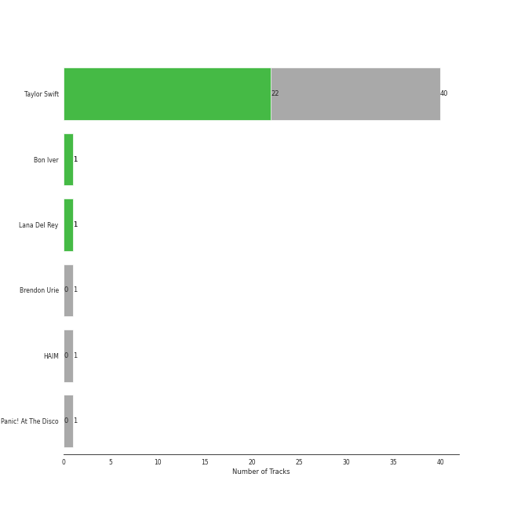

# Taylor Swift

21 songs

## Top Artists

See all 3 artists

|   Number of Tracks | Art                                                                                              | Artist                                     | 🔗                                                           |
|-------------------:|:-------------------------------------------------------------------------------------------------|:-------------------------------------------|:------------------------------------------------------------|
|                 21 |  | [Taylor Swift](../artists/taylor_swift.md) | [🔗](https://open.spotify.com/artist/06HL4z0CvFAxyc27GXpf02) |
|                  1 |  | HAIM                                       | [🔗](https://open.spotify.com/artist/4Ui2kfOqGujY81UcPrb5KE) |
|                  1 |  | Bon Iver                                   | [🔗](https://open.spotify.com/artist/4LEiUm1SRbFMgfqnQTwUbQ) |

## Top Albums

See all 4 albums

|   Number of Tracks | Art                                                                                              | Album                       | 🔗                                                          |
|-------------------:|:-------------------------------------------------------------------------------------------------|:----------------------------|:-----------------------------------------------------------|
|                 10 |  | folklore                    | [🔗](https://open.spotify.com/album/2fenSS68JI1h4Fo296JfGr) |
|                  8 |  | Lover                       | [🔗](https://open.spotify.com/album/1NAmidJlEaVgA3MpcPFYGq) |
|                  2 |  | evermore                    | [🔗](https://open.spotify.com/album/2Xoteh7uEpea4TohMxjtaq) |
|                  1 |  | Fearless (Taylor's Version) | [🔗](https://open.spotify.com/album/4hDok0OAJd57SGIT8xuWJH) |

## Tracks released under Taylor Swift

| Art                                                                                              | Track                               | Album                       | Artists                                              | Label        | 💚   | 🔗                                                          |
|:-------------------------------------------------------------------------------------------------|:------------------------------------|:----------------------------|:-----------------------------------------------------|:-------------|:----|:-----------------------------------------------------------|
|  | Cornelia Street                     | Lover                       | [Taylor Swift](../artists/taylor_swift.md)           | Taylor Swift | 💚   | [🔗](https://open.spotify.com/track/12M5uqx0ZuwkpLp5rJim1a) |
|  | Cruel Summer                        | Lover                       | [Taylor Swift](../artists/taylor_swift.md)           | Taylor Swift |     | [🔗](https://open.spotify.com/track/1BxfuPKGuaTgP7aM0Bbdwr) |
|  | Death By A Thousand Cuts            | Lover                       | [Taylor Swift](../artists/taylor_swift.md)           | Taylor Swift | 💚   | [🔗](https://open.spotify.com/track/2dgFqt3w9xIQRjhPtwNk3D) |
|  | False God                           | Lover                       | [Taylor Swift](../artists/taylor_swift.md)           | Taylor Swift |     | [🔗](https://open.spotify.com/track/5hQSXkFgbxjZo9uCwd11so) |
|  | I Think He Knows                    | Lover                       | [Taylor Swift](../artists/taylor_swift.md)           | Taylor Swift |     | [🔗](https://open.spotify.com/track/2YWtcWi3a83pdEg3Gif4Pd) |
|  | London Boy                          | Lover                       | [Taylor Swift](../artists/taylor_swift.md)           | Taylor Swift | 💚   | [🔗](https://open.spotify.com/track/1LLXZFeAHK9R4xUramtUKw) |
|  | Lover                               | Lover                       | [Taylor Swift](../artists/taylor_swift.md)           | Taylor Swift | 💚   | [🔗](https://open.spotify.com/track/1dGr1c8CrMLDpV6mPbImSI) |
|  | Paper Rings                         | Lover                       | [Taylor Swift](../artists/taylor_swift.md)           | Taylor Swift | 💚   | [🔗](https://open.spotify.com/track/4y5bvROuBDPr5fuwXbIBZR) |
|  | august                              | folklore                    | [Taylor Swift](../artists/taylor_swift.md)           | Taylor Swift | 💚   | [🔗](https://open.spotify.com/track/3hUxzQpSfdDqwM3ZTFQY0K) |
|  | cardigan                            | folklore                    | [Taylor Swift](../artists/taylor_swift.md)           | Taylor Swift | 💚   | [🔗](https://open.spotify.com/track/4R2kfaDFhslZEMJqAFNpdd) |
|  | epiphany                            | folklore                    | [Taylor Swift](../artists/taylor_swift.md)           | Taylor Swift |     | [🔗](https://open.spotify.com/track/08fa9LFcFBTcilB3iq2e2A) |
|  | exile (feat. Bon Iver)              | folklore                    | [Taylor Swift](../artists/taylor_swift.md), Bon Iver | Taylor Swift | 💚   | [🔗](https://open.spotify.com/track/4pvb0WLRcMtbPGmtejJJ6y) |
|  | illicit affairs                     | folklore                    | [Taylor Swift](../artists/taylor_swift.md)           | Taylor Swift |     | [🔗](https://open.spotify.com/track/2NmsngXHeC1GQ9wWrzhOMf) |
|  | invisible string                    | folklore                    | [Taylor Swift](../artists/taylor_swift.md)           | Taylor Swift | 💚   | [🔗](https://open.spotify.com/track/6VsvKPJ4xjVNKpI8VVZ3SV) |
|  | mad woman                           | folklore                    | [Taylor Swift](../artists/taylor_swift.md)           | Taylor Swift |     | [🔗](https://open.spotify.com/track/2QDyYdZyhlP2fp79KZX8Bi) |
|  | peace                               | folklore                    | [Taylor Swift](../artists/taylor_swift.md)           | Taylor Swift |     | [🔗](https://open.spotify.com/track/7MbT4I8qGntX4fMdqMQgke) |
|  | the 1                               | folklore                    | [Taylor Swift](../artists/taylor_swift.md)           | Taylor Swift | 💚   | [🔗](https://open.spotify.com/track/0Jlcvv8IykzHaSmj49uNW8) |
|  | the last great american dynasty     | folklore                    | [Taylor Swift](../artists/taylor_swift.md)           | Taylor Swift | 💚   | [🔗](https://open.spotify.com/track/2Eeur20xVqfUoM3Q7EFPFt) |
|  | no body, no crime (feat. HAIM)      | evermore                    | [Taylor Swift](../artists/taylor_swift.md), HAIM     | Taylor Swift |     | [🔗](https://open.spotify.com/track/3RaT22zZsxVYxxKR7TAaYF) |
|  | willow                              | evermore                    | [Taylor Swift](../artists/taylor_swift.md)           | Taylor Swift | 💚   | [🔗](https://open.spotify.com/track/0lx2cLdOt3piJbcaXIV74f) |
|  | Forever & Always (Taylor’s Version) | Fearless (Taylor's Version) | [Taylor Swift](../artists/taylor_swift.md)           | Taylor Swift | 💚   | [🔗](https://open.spotify.com/track/1msEuwSBneBKpVCZQcFTsU) |
