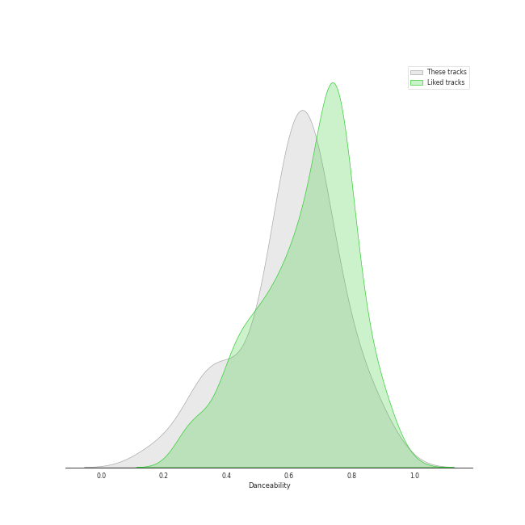
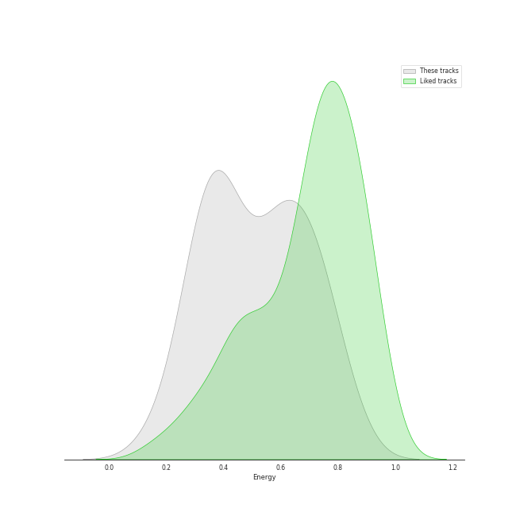
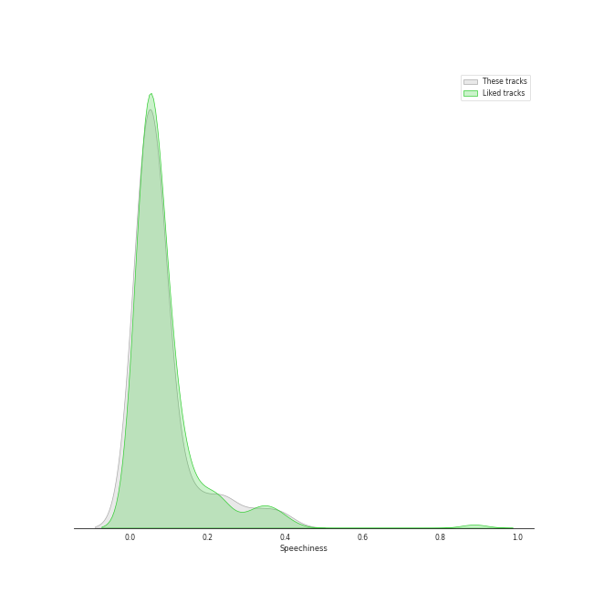
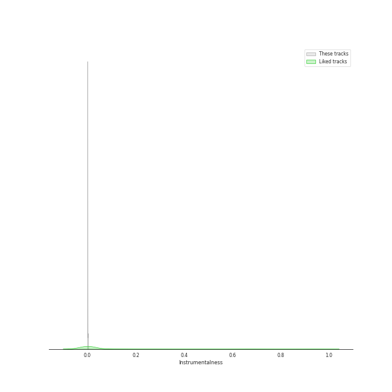
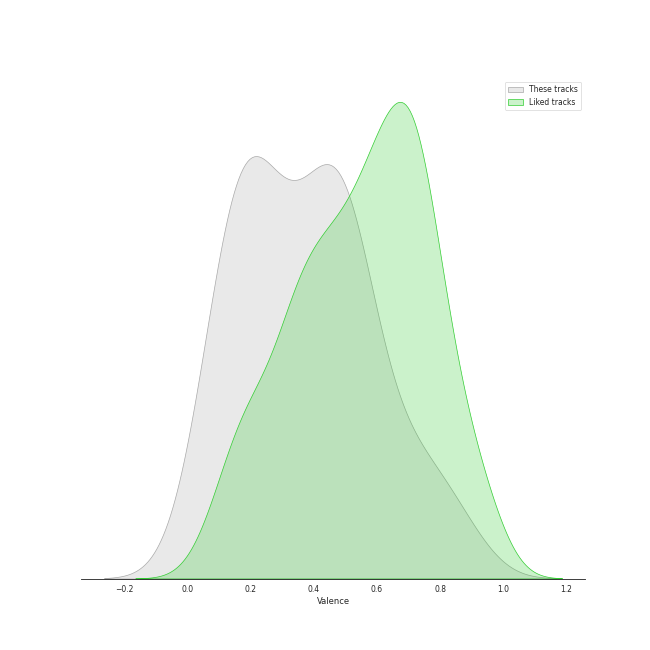

# Audio Features for Taylor Swift

## Danceability

| 10 most Danceable tracks | 10 least Danceable tracks |
|:---|:---|
| I Think He Knows (0.897) | exile (feat. Bon Iver) (0.298) |
| Cornelia Street (0.824) | tolerate it (0.316) |
| Paper Rings (0.811) | Sweet Nothing (0.337) |
| Vigilante Shit (0.798) | epiphany (0.354) |
| the 1 (0.777) | Lover (0.359) |
| Question...? (0.751) | willow (0.392) |
| False God (0.739) | august (0.532) |
| Lavender Haze (0.733) | no body, no crime (feat. HAIM) (0.546) |
| Death By A Thousand Cuts (0.712) | Cruel Summer (0.552) |
| Bejeweled (0.696) | illicit affairs (0.559) |

## Energy

| 10 most Energetic tracks | 10 least Energetic tracks |
|:---|:---|
| ME! (feat. Brendon Urie of Panic! At The Disco) (0.83) | Sweet Nothing (0.156) |
| Forever & Always (Taylor’s Version) (0.821) | epiphany (0.267) |
| Death By A Thousand Cuts (0.732) | peace (0.272) |
| Paper Rings (0.719) | Vigilante Shit (0.277) |
| London Boy (0.71) | illicit affairs (0.31) |
| Cruel Summer (0.702) | Snow On The Beach (feat. Lana Del Rey) (0.319) |
| mad woman (0.699) | False God (0.32) |
| the last great american dynasty (0.662) | the 1 (0.357) |
| Anti-Hero (0.643) | tolerate it (0.361) |
| Cornelia Street (0.624) | Midnight Rain (0.363) |

## Speechiness

| 10 most Speechy tracks | 10 least Speechy tracks |
|:---|:---|
| Vigilante Shit (0.39) | no body, no crime (feat. HAIM) (0.0264) |
| False God (0.239) | epiphany (0.0281) |
| willow (0.17) | exile (feat. Bon Iver) (0.0287) |
| Question...? (0.167) | august (0.0331) |
| Cruel Summer (0.157) | illicit affairs (0.0338) |
| Lover (0.0919) | Snow On The Beach (feat. Lana Del Rey) (0.0375) |
| peace (0.0916) | the last great american dynasty (0.0413) |
| Cornelia Street (0.0827) | cardigan (0.0424) |
| Lavender Haze (0.08) | Forever & Always (Taylor’s Version) (0.0447) |
| Midnight Rain (0.0767) | mad woman (0.0471) |

## Acousticness

| 10 most Acoustic tracks | 10 least Acoustic tracks |
|:---|:---|
| Sweet Nothing (0.964) | I Think He Knows (0.00889) |
| peace (0.918) | Paper Rings (0.0129) |
| illicit affairs (0.881) | Forever & Always (Taylor’s Version) (0.0231) |
| tolerate it (0.878) | London Boy (0.0246) |
| invisible string (0.838) | ME! (feat. Brendon Urie of Panic! At The Disco) (0.033) |
| willow (0.833) | Maroon (0.0573) |
| Cornelia Street (0.781) | Bejeweled (0.0618) |
| exile (feat. Bon Iver) (0.778) | Karma (0.0734) |
| the 1 (0.757) | Cruel Summer (0.117) |
| False God (0.736) | Anti-Hero (0.13) |

## Instrumentalness

| 10 most Instrumental tracks | 10 least Instrumental tracks |
|:---|:---|
| the last great american dynasty (0.0023) | Question...? (0.0) |
| willow (0.00179) | Forever & Always (Taylor’s Version) (0.0) |
| Snow On The Beach (feat. Lana Del Rey) (0.000993) | illicit affairs (0.0) |
| Lavender Haze (0.000573) | ME! (feat. Brendon Urie of Panic! At The Disco) (0.0) |
| epiphany (0.000402) | Death By A Thousand Cuts (0.0) |
| I Think He Knows (0.000353) | no body, no crime (feat. HAIM) (0.0) |
| cardigan (0.000345) | Karma (0.0) |
| Cornelia Street (0.000189) | Maroon (1.03e-06) |
| False God (0.000147) | Anti-Hero (1.8e-06) |
| London Boy (0.000104) | the 1 (7.28e-06) |

## Liveness

| 10 most Live tracks | 10 least Live tracks |
|:---|:---|
| Karma (0.483) | I Think He Knows (0.0715) |
| Death By A Thousand Cuts (0.319) | Paper Rings (0.0742) |
| Question...? (0.296) | tolerate it (0.0797) |
| cardigan (0.25) | epiphany (0.0858) |
| Lavender Haze (0.157) | Bejeweled (0.0887) |
| willow (0.145) | peace (0.0918) |
| Forever & Always (Taylor’s Version) (0.143) | august (0.0925) |
| Anti-Hero (0.142) | Cornelia Street (0.1) |
| London Boy (0.133) | Maroon (0.101) |
| Vigilante Shit (0.121) | no body, no crime (feat. HAIM) (0.103) |

## Valence

| 10 most Happy tracks | 10 least Happy tracks |
|:---|:---|
| Paper Rings (0.865) | Maroon (0.0374) |
| ME! (feat. Brendon Urie of Panic! At The Disco) (0.728) | Karma (0.0969) |
| the last great american dynasty (0.706) | Lavender Haze (0.0976) |
| Forever & Always (Taylor’s Version) (0.673) | Question...? (0.106) |
| Cruel Summer (0.564) | epiphany (0.113) |
| London Boy (0.557) | exile (feat. Bon Iver) (0.152) |
| cardigan (0.551) | Vigilante Shit (0.163) |
| no body, no crime (feat. HAIM) (0.535) | the 1 (0.172) |
| Anti-Hero (0.533) | Snow On The Beach (feat. Lana Del Rey) (0.193) |
| willow (0.529) | tolerate it (0.221) |

## Tempo

| 10 most Fast tracks | 10 least Fast tracks |
|:---|:---|
| ME! (feat. Brendon Urie of Panic! At The Disco) (182.162) | Lover (68.534) |
| Sweet Nothing (176.655) | tolerate it (74.952) |
| Cruel Summer (169.994) | exile (feat. Bon Iver) (75.602) |
| Bejeweled (163.999) | no body, no crime (feat. HAIM) (79.015) |
| London Boy (157.925) | Vigilante Shit (79.846) |
| peace (150.044) | False God (79.97) |
| the last great american dynasty (147.922) | willow (81.112) |
| mad woman (141.916) | invisible string (83.433) |
| the 1 (139.883) | august (89.937) |
| Midnight Rain (139.865) | Karma (90.02) |
