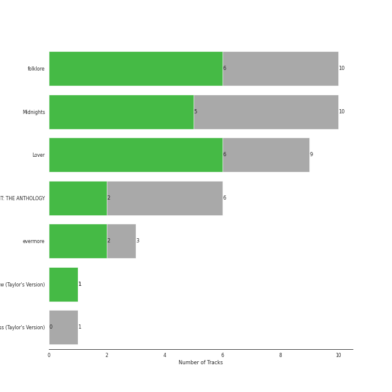
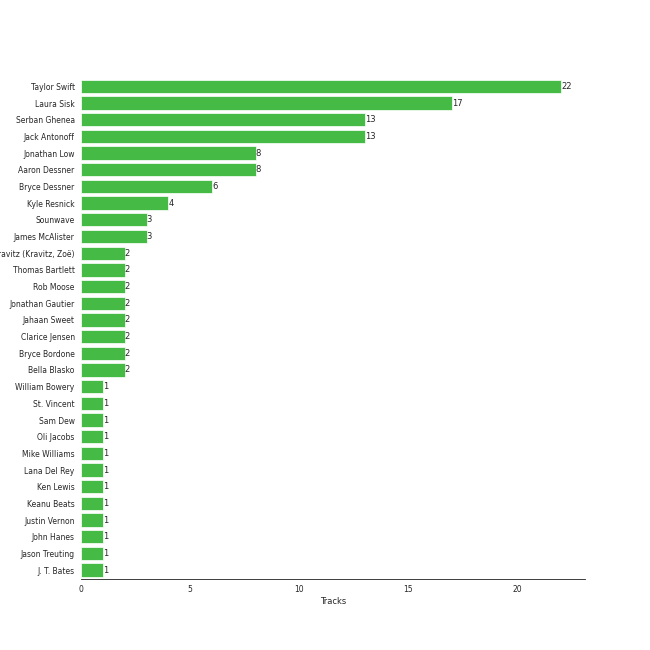

# Taylor Swift

39 songs

[See Track Features](audio_features.md)

[See Clusters](clusters/overview.md)

Appears as:
- Taylor Swift (39 tracks)

## Top Artists

| Art | Rank | Tracks | 💚 | Artist | 🔗 |
|:---|---:|---:|---:|:---|:---|
|  | 19 | 39 | 22 | [Taylor Swift](../../artists/taylor_swift/overview.md) | [🔗](https://open.spotify.com/artist/06HL4z0CvFAxyc27GXpf02) |
|  | 380 | 1 | 1 | Bon Iver | [🔗](https://open.spotify.com/artist/4LEiUm1SRbFMgfqnQTwUbQ) |
|  | 116 | 1 | 1 | [Lana Del Rey](../../artists/lana_del_rey/overview.md) | [🔗](https://open.spotify.com/artist/00FQb4jTyendYWaN8pK0wa) |
|  | 411 | 1 | 0 | Brendon Urie | [🔗](https://open.spotify.com/artist/6eYFryfcEu3QSq59D62wZQ) |
|  | 370 | 1 | 0 | HAIM | [🔗](https://open.spotify.com/artist/4Ui2kfOqGujY81UcPrb5KE) |
|  | 411 | 1 | 0 | Panic! At The Disco | [🔗](https://open.spotify.com/artist/20JZFwl6HVl6yg8a4H3ZqK) |

## Top Albums

| Art | Rank | Tracks | 💚 | Album | Release Date | 🔗 |
|:---|---:|---:|---:|:---|:---|:---|
|  | 550 | 10 | 6 | folklore | 2020-07-24 | [🔗](https://open.spotify.com/album/2fenSS68JI1h4Fo296JfGr) |
|  | 606 | 10 | 5 | Midnights | 2022-10-21 | [🔗](https://open.spotify.com/album/151w1FgRZfnKZA9FEcg9Z3) |
|  | 544 | 9 | 6 | Lover | 2019-08-23 | [🔗](https://open.spotify.com/album/1NAmidJlEaVgA3MpcPFYGq) |
|  | 606 | 5 | 2 | THE TORTURED POETS DEPARTMENT: THE ANTHOLOGY | 2024-04-19 | [🔗](https://open.spotify.com/album/5H7ixXZfsNMGbIE5OBSpcb) |
|  | 606 | 3 | 2 | evermore | 2020-12-11 | [🔗](https://open.spotify.com/album/2Xoteh7uEpea4TohMxjtaq) |
|  | 606 | 1 | 1 | Speak Now (Taylor's Version) | 2023-07-07 | [🔗](https://open.spotify.com/album/5AEDGbliTTfjOB8TSm1sxt) |
|  | 606 | 1 | 0 | Fearless (Taylor's Version) | 2021-04-09 | [🔗](https://open.spotify.com/album/4hDok0OAJd57SGIT8xuWJH) |

## Genres

| Tracks | 💚 | Genre |
|---:|---:|:---|
| 39 | 22 | [pop](../../genres/pop/overview.md) |

## Top Producers

| Art | Producer | Tracks | Credit Types |
|:---|:---|---:|:---|
|  | [Taylor Swift](../../artists/taylor_swift/overview.md) | 22 | Producer, Songwriter, Lyricist |
| | [Laura Sisk](../../producers/laura_sisk/overview.md) | 17 | Producer |
| | [Jack Antonoff](../../producers/jack_antonoff/overview.md) | 13 | Producer, Songwriter |
| | [Serban Ghenea](../../producers/serban_ghenea/overview.md) | 13 | Producer |
| | [Aaron Dessner](../../producers/aaron_dessner/overview.md) | 8 | Producer, Songwriter |
| | Jonathan Low | 8 | Producer |
| | Bryce Dessner | 6 | Arranger |
| | Kyle Resnick | 4 | Producer |
| | James McAlister | 3 | Producer |
| | [Sounwave](../../producers/sounwave/overview.md) | 3 | Producer, Songwriter |

View all

| Art | Producer | Tracks | Credit Types |
|:---|:---|---:|:---|
| | Bryce Bordone | 2 | Producer |
| | Thomas Bartlett | 2 | Producer |
| | Rob Moose | 2 | Arranger, Producer |
| | Zoë Kravitz (Kravitz, Zoë) | 2 | Songwriter |
| | Jonathan Gautier | 2 | Producer |
| | Bella Blasko | 2 | Producer |
| | Clarice Jensen | 2 | Producer |
| | Jahaan Sweet | 2 | Producer, Songwriter |
| | Mike Williams | 1 | Producer |
| | J. T. Bates | 1 | Producer |
| | Oli Jacobs | 1 | Producer |
| | Ben Lanz | 1 | Producer |
| | Jason Treuting | 1 | Producer |
|  | [Lana Del Rey](../../artists/lana_del_rey/overview.md) | 1 | Songwriter |
| | Dave Gross | 1 | Producer |
| | Dave Nelson | 1 | Producer |
| | Braxton Cook | 1 | Producer |
| | CJ Camerieri | 1 | Producer |
| | Alex Sopp | 1 | Producer |
| | [John Hanes](../../producers/john_hanes/overview.md) | 1 | Producer |
| | Cautious Clay | 1 | Songwriter |
| | Keanu Beats | 1 | Producer, Songwriter |
| | Evan Smith | 1 | Producer |
| | Sam Dew | 1 | Songwriter |
| | St. Vincent | 1 | Songwriter |
| | Ken Lewis | 1 | Producer |
| | William Bowery | 1 | Songwriter |
| | Justin Vernon | 1 | Producer, Songwriter |
| | Bryan Devendorf | 1 | Producer |

## Tracks released under Taylor Swift

| Art | Track | Album | Artists | Label | Rank | 💚 | 🔗 |
|:---|:---|:---|:---|:---|---:|:---|:---|
|  | Death By A Thousand Cuts | Lover | [Taylor Swift](../../artists/taylor_swift/overview.md) | [Taylor Swift](.) | 810 | 💚 | [🔗](https://open.spotify.com/track/2dgFqt3w9xIQRjhPtwNk3D) |
|  | exile (feat. Bon Iver) | folklore | [Taylor Swift](../../artists/taylor_swift/overview.md), Bon Iver | [Taylor Swift](.) | 825 | 💚 | [🔗](https://open.spotify.com/track/4pvb0WLRcMtbPGmtejJJ6y) |
|  | Cornelia Street | Lover | [Taylor Swift](../../artists/taylor_swift/overview.md) | [Taylor Swift](.) | 911 | 💚 | [🔗](https://open.spotify.com/track/12M5uqx0ZuwkpLp5rJim1a) |
|  | Cruel Summer | Lover | [Taylor Swift](../../artists/taylor_swift/overview.md) | [Taylor Swift](.) | 911 | 💚 | [🔗](https://open.spotify.com/track/1BxfuPKGuaTgP7aM0Bbdwr) |
|  | False God | Lover | [Taylor Swift](../../artists/taylor_swift/overview.md) | [Taylor Swift](.) | 911 | | [🔗](https://open.spotify.com/track/5hQSXkFgbxjZo9uCwd11so) |
|  | I Think He Knows | Lover | [Taylor Swift](../../artists/taylor_swift/overview.md) | [Taylor Swift](.) | 911 | | [🔗](https://open.spotify.com/track/2YWtcWi3a83pdEg3Gif4Pd) |
|  | London Boy | Lover | [Taylor Swift](../../artists/taylor_swift/overview.md) | [Taylor Swift](.) | 911 | 💚 | [🔗](https://open.spotify.com/track/1LLXZFeAHK9R4xUramtUKw) |
|  | Lover | Lover | [Taylor Swift](../../artists/taylor_swift/overview.md) | [Taylor Swift](.) | 911 | 💚 | [🔗](https://open.spotify.com/track/1dGr1c8CrMLDpV6mPbImSI) |
|  | ME! (feat. Brendon Urie of Panic! At The Disco) | Lover | [Taylor Swift](../../artists/taylor_swift/overview.md), Brendon Urie, Panic! At The Disco | [Taylor Swift](.) | 911 | | [🔗](https://open.spotify.com/track/2Rk4JlNc2TPmZe2af99d45) |
|  | Paper Rings | Lover | [Taylor Swift](../../artists/taylor_swift/overview.md) | [Taylor Swift](.) | 911 | 💚 | [🔗](https://open.spotify.com/track/4y5bvROuBDPr5fuwXbIBZR) |

See all tracks

| Art | Track | Album | Artists | Label | Rank | 💚 | 🔗 |
|:---|:---|:---|:---|:---|---:|:---|:---|
|  | august | folklore | [Taylor Swift](../../artists/taylor_swift/overview.md) | [Taylor Swift](.) | 911 | 💚 | [🔗](https://open.spotify.com/track/3hUxzQpSfdDqwM3ZTFQY0K) |
|  | cardigan | folklore | [Taylor Swift](../../artists/taylor_swift/overview.md) | [Taylor Swift](.) | 911 | 💚 | [🔗](https://open.spotify.com/track/4R2kfaDFhslZEMJqAFNpdd) |
|  | epiphany | folklore | [Taylor Swift](../../artists/taylor_swift/overview.md) | [Taylor Swift](.) | 911 | | [🔗](https://open.spotify.com/track/08fa9LFcFBTcilB3iq2e2A) |
|  | illicit affairs | folklore | [Taylor Swift](../../artists/taylor_swift/overview.md) | [Taylor Swift](.) | 911 | | [🔗](https://open.spotify.com/track/2NmsngXHeC1GQ9wWrzhOMf) |
|  | invisible string | folklore | [Taylor Swift](../../artists/taylor_swift/overview.md) | [Taylor Swift](.) | 911 | 💚 | [🔗](https://open.spotify.com/track/6VsvKPJ4xjVNKpI8VVZ3SV) |
|  | mad woman | folklore | [Taylor Swift](../../artists/taylor_swift/overview.md) | [Taylor Swift](.) | 911 | | [🔗](https://open.spotify.com/track/2QDyYdZyhlP2fp79KZX8Bi) |
|  | peace | folklore | [Taylor Swift](../../artists/taylor_swift/overview.md) | [Taylor Swift](.) | 911 | | [🔗](https://open.spotify.com/track/7MbT4I8qGntX4fMdqMQgke) |
|  | the 1 | folklore | [Taylor Swift](../../artists/taylor_swift/overview.md) | [Taylor Swift](.) | 911 | 💚 | [🔗](https://open.spotify.com/track/0Jlcvv8IykzHaSmj49uNW8) |
|  | the last great american dynasty | folklore | [Taylor Swift](../../artists/taylor_swift/overview.md) | [Taylor Swift](.) | 911 | 💚 | [🔗](https://open.spotify.com/track/2Eeur20xVqfUoM3Q7EFPFt) |
|  | no body, no crime (feat. HAIM) | evermore | [Taylor Swift](../../artists/taylor_swift/overview.md), HAIM | [Taylor Swift](.) | 911 | | [🔗](https://open.spotify.com/track/3RaT22zZsxVYxxKR7TAaYF) |
|  | tolerate it | evermore | [Taylor Swift](../../artists/taylor_swift/overview.md) | [Taylor Swift](.) | 911 | 💚 | [🔗](https://open.spotify.com/track/0PurA4JVJ8YQgSVopY8fn6) |
|  | willow | evermore | [Taylor Swift](../../artists/taylor_swift/overview.md) | [Taylor Swift](.) | 911 | 💚 | [🔗](https://open.spotify.com/track/0lx2cLdOt3piJbcaXIV74f) |
|  | Forever & Always (Taylor’s Version) | Fearless (Taylor's Version) | [Taylor Swift](../../artists/taylor_swift/overview.md) | [Taylor Swift](.) | 911 | | [🔗](https://open.spotify.com/track/1msEuwSBneBKpVCZQcFTsU) |
|  | Anti-Hero | Midnights | [Taylor Swift](../../artists/taylor_swift/overview.md) | [Taylor Swift](.) | 911 | 💚 | [🔗](https://open.spotify.com/track/0V3wPSX9ygBnCm8psDIegu) |
|  | Bejeweled | Midnights | [Taylor Swift](../../artists/taylor_swift/overview.md) | [Taylor Swift](.) | 911 | | [🔗](https://open.spotify.com/track/3qoftcUZaUOncvIYjFSPdE) |
|  | Karma | Midnights | [Taylor Swift](../../artists/taylor_swift/overview.md) | [Taylor Swift](.) | 911 | 💚 | [🔗](https://open.spotify.com/track/7KokYm8cMIXCsGVmUvKtqf) |
|  | Lavender Haze | Midnights | [Taylor Swift](../../artists/taylor_swift/overview.md) | [Taylor Swift](.) | 911 | 💚 | [🔗](https://open.spotify.com/track/5jQI2r1RdgtuT8S3iG8zFC) |
|  | Maroon | Midnights | [Taylor Swift](../../artists/taylor_swift/overview.md) | [Taylor Swift](.) | 911 | | [🔗](https://open.spotify.com/track/3eX0NZfLtGzoLUxPNvRfqm) |
|  | Midnight Rain | Midnights | [Taylor Swift](../../artists/taylor_swift/overview.md) | [Taylor Swift](.) | 911 | 💚 | [🔗](https://open.spotify.com/track/3rWDp9tBPQR9z6U5YyRSK4) |
|  | Question...? | Midnights | [Taylor Swift](../../artists/taylor_swift/overview.md) | [Taylor Swift](.) | 911 | | [🔗](https://open.spotify.com/track/0heeNYlwOGuUSe7TgUD27B) |
|  | Snow On The Beach (feat. Lana Del Rey) | Midnights | [Taylor Swift](../../artists/taylor_swift/overview.md), [Lana Del Rey](../../artists/lana_del_rey/overview.md) | [Taylor Swift](.) | 911 | 💚 | [🔗](https://open.spotify.com/track/1wtOxkiel43cVs0Yux5Q4h) |
|  | Sweet Nothing | Midnights | [Taylor Swift](../../artists/taylor_swift/overview.md) | [Taylor Swift](.) | 911 | | [🔗](https://open.spotify.com/track/0wavGRldH0AWyu2zvTz8zb) |
|  | Vigilante Shit | Midnights | [Taylor Swift](../../artists/taylor_swift/overview.md) | [Taylor Swift](.) | 911 | | [🔗](https://open.spotify.com/track/1xwAWUI6Dj0WGC3KiUPN0O) |
|  | I Can See You (Taylor’s Version) (From The Vault) | Speak Now (Taylor's Version) | [Taylor Swift](../../artists/taylor_swift/overview.md) | [Taylor Swift](.) | 911 | 💚 | [🔗](https://open.spotify.com/track/5kHMfzgLZP95O9NBy0ku4v) |
|  | Down Bad | THE TORTURED POETS DEPARTMENT: THE ANTHOLOGY | [Taylor Swift](../../artists/taylor_swift/overview.md) | [Taylor Swift](.) | 911 | | [🔗](https://open.spotify.com/track/1kbEbBdEgQdQeLXCJh28pJ) |
|  | Guilty as Sin? | THE TORTURED POETS DEPARTMENT: THE ANTHOLOGY | [Taylor Swift](../../artists/taylor_swift/overview.md) | [Taylor Swift](.) | 911 | | [🔗](https://open.spotify.com/track/799KrpEbhZp0MHeiA8YK9P) |
|  | I Can Do It With a Broken Heart | THE TORTURED POETS DEPARTMENT: THE ANTHOLOGY | [Taylor Swift](../../artists/taylor_swift/overview.md) | [Taylor Swift](.) | 911 | 💚 | [🔗](https://open.spotify.com/track/2fPvQfGQEZOKtJ9qXeL4x8) |
|  | So Long, London | THE TORTURED POETS DEPARTMENT: THE ANTHOLOGY | [Taylor Swift](../../artists/taylor_swift/overview.md) | [Taylor Swift](.) | 911 | 💚 | [🔗](https://open.spotify.com/track/7wAkQFShJ27V8362MqevQr) |
|  | The Tortured Poets Department | THE TORTURED POETS DEPARTMENT: THE ANTHOLOGY | [Taylor Swift](../../artists/taylor_swift/overview.md) | [Taylor Swift](.) | 911 | | [🔗](https://open.spotify.com/track/4PdLaGZubp4lghChqp8erB) |

