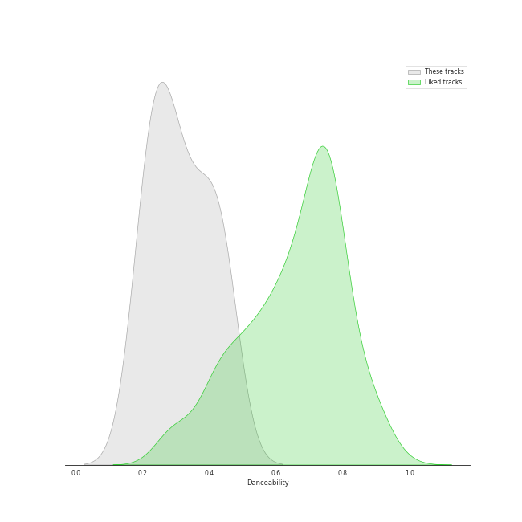
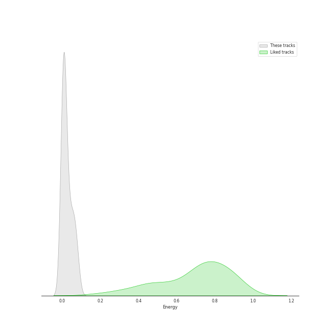
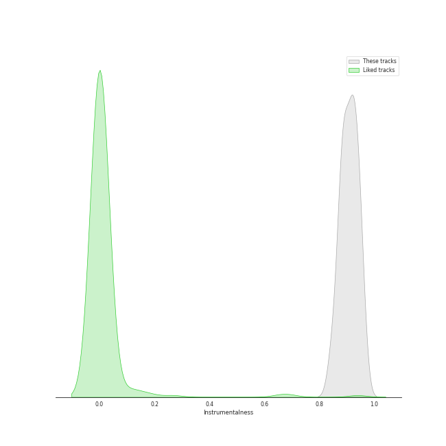
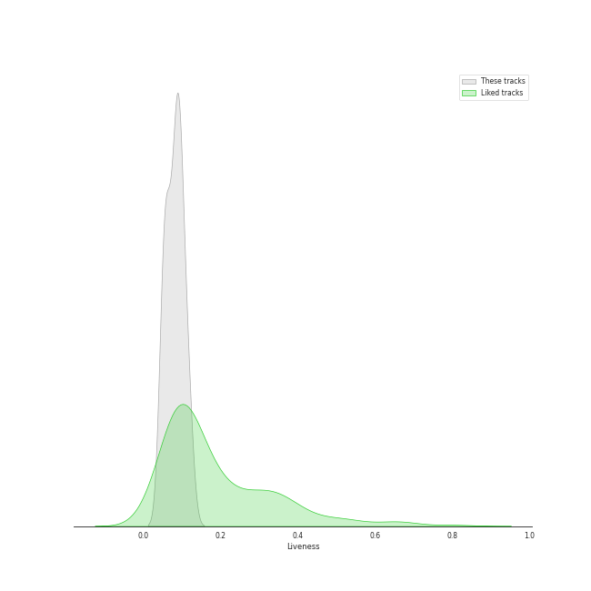
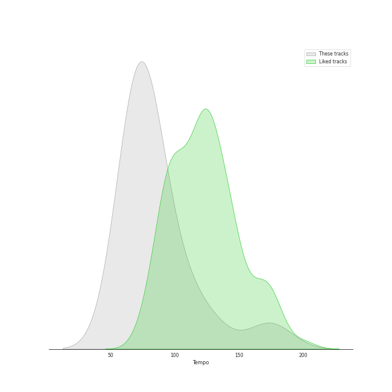

# Audio Features for The Music Factory

## Danceability

| ​ | 10 most Danceable tracks | ​​ | 10 least Danceable tracks |
|:---|:---|:---|:---|
|  | Waltz No.11 Op.70-1 G Flat Major (0.46) |  | Nocturne No.4 Op.15-1 F Major (0.182) |
|  | Nocturne No.6 Op.15-3 G Minor (0.437) |  | Nocturne No.5 Op.15-2 F Sharp Major (0.213) |
|  | Waltz No.1 Op.18 E Flat Major 'Grande Valse Brilliante' (0.434) |  | Waltz No.10 Op.69-2 B Minor (0.22) |
|  | Nocturne No.9 Op.32-1 B Major (0.395) |  | Waltz No.5 Io,42 A Flat Major (0.239) |
|  | Waltz No.9 Op.69-1 A Flat Major (0.386) |  | Nocturne No.2 Op.9-2 E Flat Major (0.249) |
|  | Waltz No.12 Op.70-2 F Minor (0.348) |  | Waltz No.8 Op.64-3 A Flat Major (0.259) |
|  | Waltz No.7 Op.64-2 C Sharp Minor (0.317) |  | Nocturne No.10 Op.32-2 A Flat Major (0.278) |
|  | Nocturne No.8 Op.27-2 D Flat Major (0.309) |  | Nocturne No.8 Op.27-2 D Flat Major (0.309) |
|  | Nocturne No.10 Op.32-2 A Flat Major (0.278) |  | Waltz No.7 Op.64-2 C Sharp Minor (0.317) |
|  | Waltz No.8 Op.64-3 A Flat Major (0.259) |  | Waltz No.12 Op.70-2 F Minor (0.348) |

## Energy

| ​ | 10 most Energetic tracks | ​​ | 10 least Energetic tracks |
|:---|:---|:---|:---|
|  | Waltz No.1 Op.18 E Flat Major 'Grande Valse Brilliante' (0.0792) |  | Nocturne No.6 Op.15-3 G Minor (0.00191) |
|  | Waltz No.8 Op.64-3 A Flat Major (0.0637) |  | Nocturne No.2 Op.9-2 E Flat Major (0.00265) |
|  | Waltz No.5 Io,42 A Flat Major (0.0586) |  | Nocturne No.9 Op.32-1 B Major (0.00323) |
|  | Waltz No.10 Op.69-2 B Minor (0.042) |  | Nocturne No.4 Op.15-1 F Major (0.00408) |
|  | Waltz No.12 Op.70-2 F Minor (0.037) |  | Nocturne No.8 Op.27-2 D Flat Major (0.00426) |
|  | Nocturne No.10 Op.32-2 A Flat Major (0.0166) |  | Nocturne No.5 Op.15-2 F Sharp Major (0.00786) |
|  | Waltz No.11 Op.70-1 G Flat Major (0.0162) |  | Waltz No.9 Op.69-1 A Flat Major (0.0137) |
|  | Waltz No.7 Op.64-2 C Sharp Minor (0.0151) |  | Waltz No.7 Op.64-2 C Sharp Minor (0.0151) |
|  | Waltz No.9 Op.69-1 A Flat Major (0.0137) |  | Waltz No.11 Op.70-1 G Flat Major (0.0162) |
|  | Nocturne No.5 Op.15-2 F Sharp Major (0.00786) |  | Nocturne No.10 Op.32-2 A Flat Major (0.0166) |

## Speechiness

| ​ | 10 most Speechy tracks | ​​ | 10 least Speechy tracks |
|:---|:---|:---|:---|
|  | Nocturne No.6 Op.15-3 G Minor (0.0557) |  | Nocturne No.8 Op.27-2 D Flat Major (0.0386) |
|  | Waltz No.1 Op.18 E Flat Major 'Grande Valse Brilliante' (0.0509) |  | Waltz No.7 Op.64-2 C Sharp Minor (0.0392) |
|  | Waltz No.10 Op.69-2 B Minor (0.0496) |  | Waltz No.8 Op.64-3 A Flat Major (0.04) |
|  | Nocturne No.9 Op.32-1 B Major (0.0489) |  | Waltz No.5 Io,42 A Flat Major (0.0404) |
|  | Waltz No.12 Op.70-2 F Minor (0.0483) |  | Nocturne No.5 Op.15-2 F Sharp Major (0.0407) |
|  | Nocturne No.10 Op.32-2 A Flat Major (0.0482) |  | Nocturne No.2 Op.9-2 E Flat Major (0.0408) |
|  | Waltz No.9 Op.69-1 A Flat Major (0.045) |  | Nocturne No.4 Op.15-1 F Major (0.0409) |
|  | Waltz No.11 Op.70-1 G Flat Major (0.0442) |  | Waltz No.11 Op.70-1 G Flat Major (0.0442) |
|  | Nocturne No.4 Op.15-1 F Major (0.0409) |  | Waltz No.9 Op.69-1 A Flat Major (0.045) |
|  | Nocturne No.2 Op.9-2 E Flat Major (0.0408) |  | Nocturne No.10 Op.32-2 A Flat Major (0.0482) |

## Acousticness

| ​ | 10 most Acoustic tracks | ​​ | 10 least Acoustic tracks |
|:---|:---|:---|:---|
|  | Waltz No.9 Op.69-1 A Flat Major (0.995) |  | Nocturne No.2 Op.9-2 E Flat Major (0.98) |
|  | Nocturne No.10 Op.32-2 A Flat Major (0.995) |  | Waltz No.8 Op.64-3 A Flat Major (0.99) |
|  | Nocturne No.9 Op.32-1 B Major (0.994) |  | Waltz No.10 Op.69-2 B Minor (0.991) |
|  | Waltz No.12 Op.70-2 F Minor (0.994) |  | Waltz No.1 Op.18 E Flat Major 'Grande Valse Brilliante' (0.991) |
|  | Waltz No.11 Op.70-1 G Flat Major (0.994) |  | Waltz No.7 Op.64-2 C Sharp Minor (0.992) |
|  | Waltz No.5 Io,42 A Flat Major (0.993) |  | Nocturne No.5 Op.15-2 F Sharp Major (0.992) |
|  | Nocturne No.4 Op.15-1 F Major (0.993) |  | Nocturne No.6 Op.15-3 G Minor (0.993) |
|  | Nocturne No.8 Op.27-2 D Flat Major (0.993) |  | Nocturne No.8 Op.27-2 D Flat Major (0.993) |
|  | Nocturne No.6 Op.15-3 G Minor (0.993) |  | Nocturne No.4 Op.15-1 F Major (0.993) |
|  | Nocturne No.5 Op.15-2 F Sharp Major (0.992) |  | Waltz No.5 Io,42 A Flat Major (0.993) |

## Instrumentalness

| ​ | 10 most Instrumental tracks | ​​ | 10 least Instrumental tracks |
|:---|:---|:---|:---|
|  | Nocturne No.2 Op.9-2 E Flat Major (0.953) |  | Waltz No.10 Op.69-2 B Minor (0.847) |
|  | Nocturne No.6 Op.15-3 G Minor (0.952) |  | Waltz No.5 Io,42 A Flat Major (0.874) |
|  | Nocturne No.5 Op.15-2 F Sharp Major (0.936) |  | Waltz No.1 Op.18 E Flat Major 'Grande Valse Brilliante' (0.877) |
|  | Nocturne No.9 Op.32-1 B Major (0.935) |  | Waltz No.9 Op.69-1 A Flat Major (0.884) |
|  | Nocturne No.4 Op.15-1 F Major (0.926) |  | Waltz No.7 Op.64-2 C Sharp Minor (0.887) |
|  | Nocturne No.8 Op.27-2 D Flat Major (0.921) |  | Waltz No.12 Op.70-2 F Minor (0.891) |
|  | Waltz No.11 Op.70-1 G Flat Major (0.919) |  | Nocturne No.10 Op.32-2 A Flat Major (0.902) |
|  | Waltz No.8 Op.64-3 A Flat Major (0.912) |  | Waltz No.8 Op.64-3 A Flat Major (0.912) |
|  | Nocturne No.10 Op.32-2 A Flat Major (0.902) |  | Waltz No.11 Op.70-1 G Flat Major (0.919) |
|  | Waltz No.12 Op.70-2 F Minor (0.891) |  | Nocturne No.8 Op.27-2 D Flat Major (0.921) |

## Liveness

| ​ | 10 most Live tracks | ​​ | 10 least Live tracks |
|:---|:---|:---|:---|
|  | Waltz No.8 Op.64-3 A Flat Major (0.119) |  | Nocturne No.6 Op.15-3 G Minor (0.05) |
|  | Waltz No.5 Io,42 A Flat Major (0.111) |  | Nocturne No.5 Op.15-2 F Sharp Major (0.0511) |
|  | Waltz No.12 Op.70-2 F Minor (0.102) |  | Nocturne No.2 Op.9-2 E Flat Major (0.0558) |
|  | Waltz No.7 Op.64-2 C Sharp Minor (0.0926) |  | Nocturne No.8 Op.27-2 D Flat Major (0.0567) |
|  | Nocturne No.10 Op.32-2 A Flat Major (0.0914) |  | Nocturne No.4 Op.15-1 F Major (0.0637) |
|  | Waltz No.9 Op.69-1 A Flat Major (0.0904) |  | Nocturne No.9 Op.32-1 B Major (0.0736) |
|  | Waltz No.1 Op.18 E Flat Major 'Grande Valse Brilliante' (0.0886) |  | Waltz No.10 Op.69-2 B Minor (0.0795) |
|  | Waltz No.11 Op.70-1 G Flat Major (0.0873) |  | Waltz No.11 Op.70-1 G Flat Major (0.0873) |
|  | Waltz No.10 Op.69-2 B Minor (0.0795) |  | Waltz No.1 Op.18 E Flat Major 'Grande Valse Brilliante' (0.0886) |
|  | Nocturne No.9 Op.32-1 B Major (0.0736) |  | Waltz No.9 Op.69-1 A Flat Major (0.0904) |

## Valence

| ​ | 10 most Happy tracks | ​​ | 10 least Happy tracks |
|:---|:---|:---|:---|
|  | Waltz No.1 Op.18 E Flat Major 'Grande Valse Brilliante' (0.383) |  | Nocturne No.4 Op.15-1 F Major (0.0536) |
|  | Waltz No.8 Op.64-3 A Flat Major (0.371) |  | Nocturne No.8 Op.27-2 D Flat Major (0.0586) |
|  | Waltz No.12 Op.70-2 F Minor (0.37) |  | Nocturne No.5 Op.15-2 F Sharp Major (0.0725) |
|  | Waltz No.10 Op.69-2 B Minor (0.291) |  | Waltz No.7 Op.64-2 C Sharp Minor (0.0891) |
|  | Waltz No.11 Op.70-1 G Flat Major (0.181) |  | Nocturne No.2 Op.9-2 E Flat Major (0.0899) |
|  | Waltz No.5 Io,42 A Flat Major (0.168) |  | Nocturne No.6 Op.15-3 G Minor (0.106) |
|  | Waltz No.9 Op.69-1 A Flat Major (0.162) |  | Nocturne No.9 Op.32-1 B Major (0.116) |
|  | Nocturne No.10 Op.32-2 A Flat Major (0.139) |  | Nocturne No.10 Op.32-2 A Flat Major (0.139) |
|  | Nocturne No.9 Op.32-1 B Major (0.116) |  | Waltz No.9 Op.69-1 A Flat Major (0.162) |
|  | Nocturne No.6 Op.15-3 G Minor (0.106) |  | Waltz No.5 Io,42 A Flat Major (0.168) |

## Tempo

| ​ | 10 most Fast tracks | ​​ | 10 least Fast tracks |
|:---|:---|:---|:---|
|  | Waltz No.10 Op.69-2 B Minor (174.212) |  | Nocturne No.10 Op.32-2 A Flat Major (63.993) |
|  | Waltz No.1 Op.18 E Flat Major 'Grande Valse Brilliante' (125.417) |  | Nocturne No.4 Op.15-1 F Major (66.65) |
|  | Nocturne No.8 Op.27-2 D Flat Major (100.983) |  | Nocturne No.2 Op.9-2 E Flat Major (68.87) |
|  | Nocturne No.6 Op.15-3 G Minor (98.962) |  | Waltz No.9 Op.69-1 A Flat Major (70.686) |
|  | Nocturne No.5 Op.15-2 F Sharp Major (80.957) |  | Nocturne No.9 Op.32-1 B Major (70.763) |
|  | Waltz No.7 Op.64-2 C Sharp Minor (79.426) |  | Waltz No.8 Op.64-3 A Flat Major (72.349) |
|  | Waltz No.11 Op.70-1 G Flat Major (75.69) |  | Waltz No.5 Io,42 A Flat Major (73.458) |
|  | Waltz No.12 Op.70-2 F Minor (74.232) |  | Waltz No.12 Op.70-2 F Minor (74.232) |
|  | Waltz No.5 Io,42 A Flat Major (73.458) |  | Waltz No.11 Op.70-1 G Flat Major (75.69) |
|  | Waltz No.8 Op.64-3 A Flat Major (72.349) |  | Waltz No.7 Op.64-2 C Sharp Minor (79.426) |
