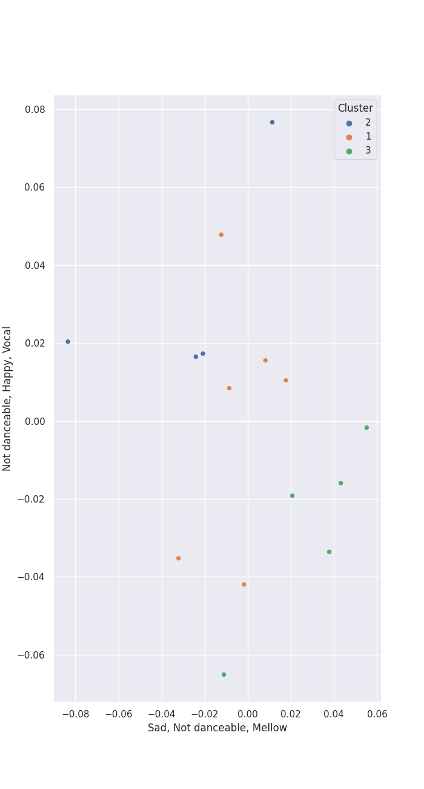

# Clusters in The Music Factory

## Cluster #1

6 tracks

| Art | Track | Album | Artists | Label | 💚 | 🔗 |
|:---|:---|:---|:---|:---|:---|:---|
|  | Nocturne No.10 Op.32-2 A Flat Major | Frederic Chopin - Waltzes & Nocturnes | Peter Schmalfuss | [The Music Factory](../..) | | [🔗](https://open.spotify.com/track/6Hf9sYUs42lHz0Ng1CTD4L) |
|  | Nocturne No.9 Op.32-1 B Major | Frederic Chopin - Waltzes & Nocturnes | Peter Schmalfuss | [The Music Factory](../..) | | [🔗](https://open.spotify.com/track/4tLE5OmKKfscpa4mwcgi3M) |
|  | Waltz No.11 Op.70-1 G Flat Major | Frederic Chopin - Waltzes & Nocturnes | Peter Schmalfuss | [The Music Factory](../..) | | [🔗](https://open.spotify.com/track/0fUiDXdfFAtIM6MreWOGNZ) |
|  | Waltz No.5 Io,42 A Flat Major | Frederic Chopin - Waltzes & Nocturnes | Peter Schmalfuss | [The Music Factory](../..) | | [🔗](https://open.spotify.com/track/4wT04gr0O8GjGNPjxSsX3p) |
|  | Waltz No.7 Op.64-2 C Sharp Minor | Frederic Chopin - Waltzes & Nocturnes | Peter Schmalfuss | [The Music Factory](../..) | | [🔗](https://open.spotify.com/track/308xGu3m1QL1x2EwL4cT34) |
|  | Waltz No.9 Op.69-1 A Flat Major | Frederic Chopin - Waltzes & Nocturnes | Peter Schmalfuss | [The Music Factory](../..) | | [🔗](https://open.spotify.com/track/6pbMI2NXJaw75AjEqUO4UQ) |
## Cluster #2

4 tracks

| Art | Track | Album | Artists | Label | 💚 | 🔗 |
|:---|:---|:---|:---|:---|:---|:---|
|  | Waltz No.1 Op.18 E Flat Major 'Grande Valse Brilliante' | Frederic Chopin - Waltzes & Nocturnes | Peter Schmalfuss | [The Music Factory](../..) | | [🔗](https://open.spotify.com/track/6mFgifVHBLCyoW9GwVbxwh) |
|  | Waltz No.10 Op.69-2 B Minor | Frederic Chopin - Waltzes & Nocturnes | Peter Schmalfuss | [The Music Factory](../..) | | [🔗](https://open.spotify.com/track/0004INO1s16Z8VSdewvTak) |
|  | Waltz No.12 Op.70-2 F Minor | Frederic Chopin - Waltzes & Nocturnes | Peter Schmalfuss | [The Music Factory](../..) | | [🔗](https://open.spotify.com/track/4Kei1F2OqjoKBp0288oZMI) |
|  | Waltz No.8 Op.64-3 A Flat Major | Frederic Chopin - Waltzes & Nocturnes | Peter Schmalfuss | [The Music Factory](../..) | | [🔗](https://open.spotify.com/track/0SoFXVOwHlD5TmKl2cpwBG) |
## Cluster #3

5 tracks

| Art | Track | Album | Artists | Label | 💚 | 🔗 |
|:---|:---|:---|:---|:---|:---|:---|
|  | Nocturne No.2 Op.9-2 E Flat Major | Frederic Chopin - Waltzes & Nocturnes | Peter Schmalfuss | [The Music Factory](../..) | | [🔗](https://open.spotify.com/track/5ITEXDnVR3xGR1dc9VuNgS) |
|  | Nocturne No.4 Op.15-1 F Major | Frederic Chopin - Waltzes & Nocturnes | Peter Schmalfuss | [The Music Factory](../..) | | [🔗](https://open.spotify.com/track/4ggql3W9O7jImYJsnrK3hU) |
|  | Nocturne No.5 Op.15-2 F Sharp Major | Frederic Chopin - Waltzes & Nocturnes | Peter Schmalfuss | [The Music Factory](../..) | | [🔗](https://open.spotify.com/track/6DixyBlby49gNxQhq11WyB) |
|  | Nocturne No.6 Op.15-3 G Minor | Frederic Chopin - Waltzes & Nocturnes | Peter Schmalfuss | [The Music Factory](../..) | | [🔗](https://open.spotify.com/track/0v7cGRePuQcwJB2eRD4v6M) |
|  | Nocturne No.8 Op.27-2 D Flat Major | Frederic Chopin - Waltzes & Nocturnes | Peter Schmalfuss | [The Music Factory](../..) | | [🔗](https://open.spotify.com/track/3wcXvernilwBUMXjNXvCCX) |