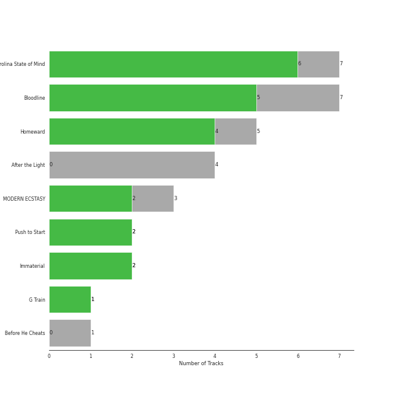

# The Tarpeggios

16 songs

[See Track Features](audio_features.md)

[See Clusters](clusters/overview.md)

Appears as:
- The Tarpeggios (16 tracks)

## Top Artists

| Art | Tracks | 💚 | Artist | 🔗 |
|:---|---:|---:|:---|:---|
|  | 16 | 13 | [The Tarpeggios](../../artists/the_tarpeggios/overview.md) | [🔗](https://open.spotify.com/artist/2HXd5pFHJyaQJr5aXfErrE) |

## Top Albums

| Art | Tracks | 💚 | Album | Release Date | 🔗 |
|:---|---:|---:|:---|:---|:---|
|  | 7 | 6 | Carolina State of Mind | 2013-11-15 | [🔗](https://open.spotify.com/album/3zKusinRVxdC5s2wOPYBgX) |
|  | 5 | 4 | Homeward | 2022-04-08 | [🔗](https://open.spotify.com/album/2FiDSelqVoi7VQfpmaMRJK) |
|  | 2 | 2 | Immaterial | 2021-07-16 | [🔗](https://open.spotify.com/album/5YgtPHMCi4dGtL6JarEGkI) |
|  | 1 | 1 | G Train | 2019-11-22 | [🔗](https://open.spotify.com/album/0vmio1Hc8vrU7scyVa6BYK) |
|  | 1 | 0 | Before He Cheats | 2019-10-22 | [🔗](https://open.spotify.com/album/7bndGIMX7IOBjG3J7O0BEQ) |

## Genres

| Tracks | 💚 | Genre |
|---|---|---|

## Tracks released under The Tarpeggios

| Art | Track | Album | Artists | Label | Rank | 💚 | 🔗 |
|:---|:---|:---|:---|:---|---:|:---|:---|
|  | Settle Down | Carolina State of Mind | [The Tarpeggios](../../artists/the_tarpeggios/overview.md) | [The Tarpeggios](.) | 702 | 💚 | [🔗](https://open.spotify.com/track/2RGGnyqlJ65QcpA4FggZ2x) |
|  | Carolina State of Mind | Carolina State of Mind | [The Tarpeggios](../../artists/the_tarpeggios/overview.md) | [The Tarpeggios](.) | nan | 💚 | [🔗](https://open.spotify.com/track/60xweUiIfi93UhZEDN3DKY) |
|  | Chariot | Carolina State of Mind | [The Tarpeggios](../../artists/the_tarpeggios/overview.md) | [The Tarpeggios](.) | nan | | [🔗](https://open.spotify.com/track/0of5rsasONYN34mx4rSgsn) |
|  | Home | Carolina State of Mind | [The Tarpeggios](../../artists/the_tarpeggios/overview.md) | [The Tarpeggios](.) | nan | 💚 | [🔗](https://open.spotify.com/track/5EiVVKFfodbFiHTCFEB1i3) |
|  | I Knew You Were Trouble | Carolina State of Mind | [The Tarpeggios](../../artists/the_tarpeggios/overview.md) | [The Tarpeggios](.) | nan | 💚 | [🔗](https://open.spotify.com/track/2uB0wu6NOxNAEYmKvf1VDi) |
|  | Lullabye (Goodnight, My Angel) | Carolina State of Mind | [The Tarpeggios](../../artists/the_tarpeggios/overview.md) | [The Tarpeggios](.) | nan | 💚 | [🔗](https://open.spotify.com/track/4OXK8cslw5QGKzk6U1yRfU) |
|  | The Scientist | Carolina State of Mind | [The Tarpeggios](../../artists/the_tarpeggios/overview.md) | [The Tarpeggios](.) | nan | 💚 | [🔗](https://open.spotify.com/track/6NOjptrSCGSEr6vvSQuDmC) |
|  | Before He Cheats | Before He Cheats | [The Tarpeggios](../../artists/the_tarpeggios/overview.md) | [The Tarpeggios](.) | nan | | [🔗](https://open.spotify.com/track/1kRKhFJLbqoXeBUecl8eZa) |
|  | G Train | G Train | [The Tarpeggios](../../artists/the_tarpeggios/overview.md) | [The Tarpeggios](.) | nan | 💚 | [🔗](https://open.spotify.com/track/7IFr6PZwvtqBJEMl55Omvx) |
|  | Wife You Up | Immaterial | [The Tarpeggios](../../artists/the_tarpeggios/overview.md) | [The Tarpeggios](.) | nan | 💚 | [🔗](https://open.spotify.com/track/73dGGJmQ9ERvnumjuG5LES) |

See all tracks

| Art | Track | Album | Artists | Label | Rank | 💚 | 🔗 |
|:---|:---|:---|:---|:---|---:|:---|:---|
|  | XS | Immaterial | [The Tarpeggios](../../artists/the_tarpeggios/overview.md) | [The Tarpeggios](.) | nan | 💚 | [🔗](https://open.spotify.com/track/3s8C5wAXYgvpmzBhTduJBg) |
|  | Golden Slumbers / Carry That Weight | Homeward | [The Tarpeggios](../../artists/the_tarpeggios/overview.md) | [The Tarpeggios](.) | nan | 💚 | [🔗](https://open.spotify.com/track/3CJwaHt5VqpKaoJ4h523AB) |
|  | Kiss the Sky | Homeward | [The Tarpeggios](../../artists/the_tarpeggios/overview.md) | [The Tarpeggios](.) | nan | 💚 | [🔗](https://open.spotify.com/track/1alIiVzLvztXf92CxCXY1B) |
|  | Sanctify | Homeward | [The Tarpeggios](../../artists/the_tarpeggios/overview.md) | [The Tarpeggios](.) | nan | | [🔗](https://open.spotify.com/track/3uKuUjR2RMJFFbIAz8l459) |
|  | The End (Interlude) | Homeward | [The Tarpeggios](../../artists/the_tarpeggios/overview.md) | [The Tarpeggios](.) | nan | 💚 | [🔗](https://open.spotify.com/track/36TvCuzr3KGsG8UdZ9tk8e) |
|  | You Take My Breath Away | Homeward | [The Tarpeggios](../../artists/the_tarpeggios/overview.md) | [The Tarpeggios](.) | nan | 💚 | [🔗](https://open.spotify.com/track/430GqLsbnIps8OZoZUCIYp) |

