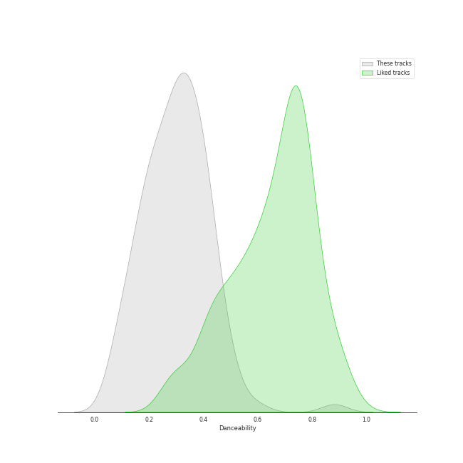
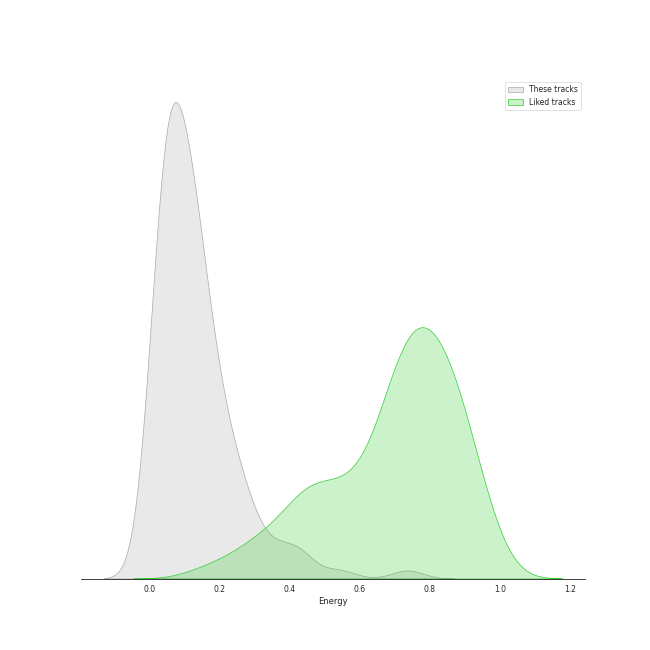
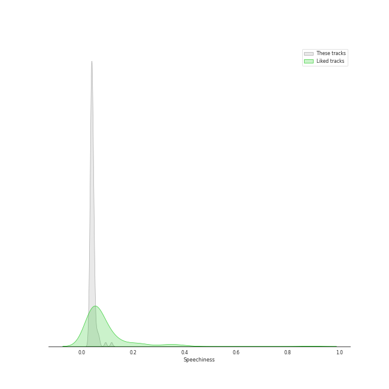
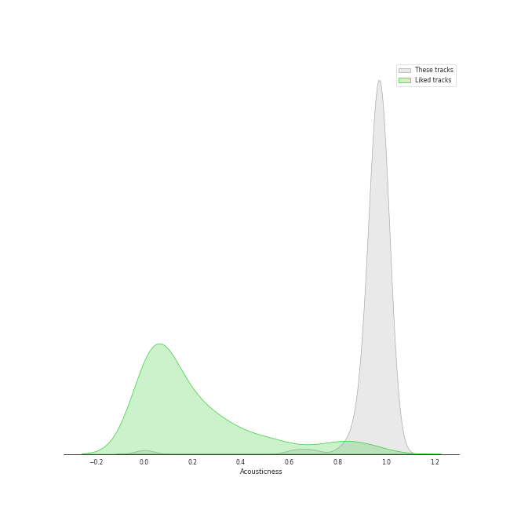
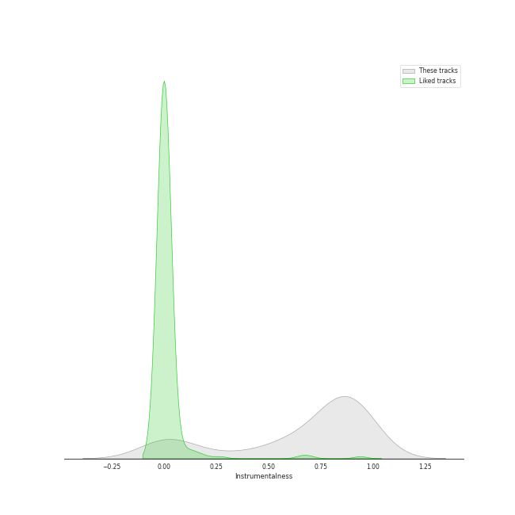
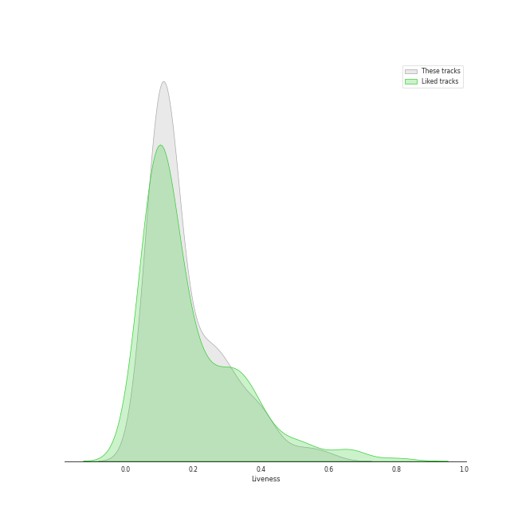
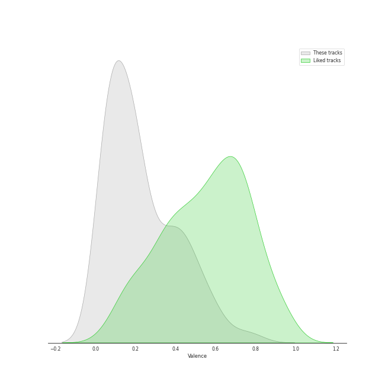
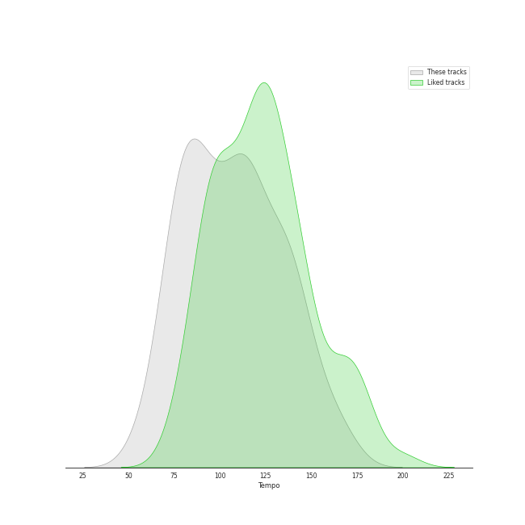

# Track Features for UME - Global Clearing House

## Danceability

| ​ | 10 most Danceable tracks | ​​ | 10 least Danceable tracks |
|:---|:---|:---|:---|
|  | Gentleman (0.882) |  | Die Zauberflöte, K. 620, Act II: No. 18, Chorus. O Isis und Osiris, welche Wonne (0.0663) |
|  | Divertimento in D Major, K. 251 "Nannerl-Septett" (Orch. Perf.): IV. Menuetto. Tema con variazioni (0.593) |  | Horn Concerto No. 4 in E-Flat Major, K. 495: II. Romance. Andante cantabile (0.0683) |
|  | Violin Concerto No. 3 in G Major, K. 216: III. Rondeau. Allegro (0.507) |  | Requiem, K. 626: VII. Agnus Dei (0.0749) |
|  | Die Zauberflöte, K. 620, Act II: No. 21, Finale: g. Pa-Pa-Pa-Pa-Pa-Pa-Papagena! (0.504) |  | Divertimento in B-Flat Major, K. 287 (Orch. Perf.): IV. Adagio - Recorded 1965 (0.0898) |
|  | Die Zauberflöte, K. 620, Act II: No. 13, Alles fühlt der Liebe Freuden (0.499) |  | Horn Concerto No. 2 in E-Flat Major, K. 417: II. Andante (0.099) |
|  | Eine kleine Nachtmusik, K. 525: IV. Rondo. Allegro (0.478) |  | Divertimento in D Major, K. 334 (Orch. Perf.): IV. Adagio - Recorded 1965 (0.101) |
|  | Divertimento in B-Flat Major, K. 287 (Orch. Perf.): VI. Andante – Allegro molto - Recorded 1987 (0.476) |  | Symphony No. 33 in B-Flat Major, K. 319: II. Andante moderato (0.116) |
|  | L-O-V-E - 2000 Remaster (0.451) |  | Mass in C Major, K. 317 "Coronation Mass": I. Kyrie (0.117) |
|  | Eine kleine Nachtmusik, K. 525: I. Allegro (0.449) |  | Requiem, K. 626: IIIe. Confutatis (0.118) |
|  | Divertimento in D Major, K. 251 "Nannerl-Septett" (Orch. Perf.): I. Allegro molto (0.444) |  | Symphony No. 35 in D Major, K. 385 "Haffner": II. Andante (0.124) |

## Energy

| ​ | 10 most Energetic tracks | ​​ | 10 least Energetic tracks |
|:---|:---|:---|:---|
|  | Gentleman (0.736) |  | Die Zauberflöte, K. 620, Act II: No. 16, Seid uns zum zweiten Mal willkommen (0.00404) |
|  | Requiem, K. 626: IIIa. Dies irae (0.542) |  | Divertimento in B-Flat Major, K. 287 (Orch. Perf.): VI. Andante – Allegro molto - Recorded 1987 (0.0183) |
|  | Symphony No. 39 in E-Flat Major, K. 543: IV. Finale. Allegro (0.441) |  | Requiem, K. 626: IIIe. Confutatis (0.0185) |
|  | Mass in C Major, K. 317 "Coronation Mass": III. Credo (0.433) |  | Divertimento in B-Flat Major, K. 287 (Orch. Perf.): III. Menuetto I - Recorded 1987 (0.0207) |
|  | Symphony No. 41 in C Major, K. 551 "Jupiter": IV. Finale. Molto allegro (0.408) |  | Divertimento in B-Flat Major, K. 287 (Orch. Perf.): V. Menuetto II - Recorded 1965 (0.0223) |
|  | Mass in C Major, K. 317 "Coronation Mass": IV. Sanctus (0.373) |  | Horn Concerto No. 4 in E-Flat Major, K. 495: II. Romance. Andante cantabile (0.0254) |
|  | Requiem, K. 626: V. Sanctus (0.363) |  | Die Zauberflöte, K. 620, Act II: No. 20, Ein Mädchen oder Weibchen (0.0254) |
|  | Requiem, K. 626: II. Kyrie (0.33) |  | Symphony No. 40 in G Minor, K. 550: II. Andante (0.0259) |
|  | Symphony No. 40 in G Minor, K. 550: IV. Finale. Allegro assai (0.295) |  | Divertimento in D Major, K. 334 (Orch. Perf.): III. Menuetto – Trio - Recorded 1965 (0.0268) |
|  | Symphony No. 40 in G Minor, K. 550: I. Molto allegro (0.295) |  | Die Zauberflöte, K. 620, Act I: No. 7, Duet. Bei Männern, welche Liebe fühlen (0.0301) |

## Speechiness

| ​ | 10 most Speechy tracks | ​​ | 10 least Speechy tracks |
|:---|:---|:---|:---|
|  | Gentleman (0.116) |  | Requiem, K. 626: IVa. Domine Jesu (0.0293) |
|  | L-O-V-E - 2000 Remaster (0.0928) |  | Symphony No. 39 in E-Flat Major, K. 543: III. Menuetto. Allegretto (0.0297) |
|  | Divertimento in D Major, K. 251 "Nannerl-Septett" (Orch. Perf.): IV. Menuetto. Tema con variazioni (0.068) |  | Requiem, K. 626: V. Sanctus (0.0301) |
|  | Die Zauberflöte, K. 620, Act II: No. 13, Alles fühlt der Liebe Freuden (0.0662) |  | Requiem, K. 626: II. Kyrie (0.0304) |
|  | Die Zauberflöte, K. 620, Act I: No. 7, Duet. Bei Männern, welche Liebe fühlen (0.0611) |  | Requiem, K. 626: IIIc. Rex tremendae (0.0315) |
|  | Die Zauberflöte, K. 620, Act I: No. 1, Zu Hilfe! Zu Hilfe! (0.0591) |  | Requiem, K. 626: IVb. Hostias (0.0316) |
|  | Eine kleine Nachtmusik, K. 525: I. Allegro (0.0585) |  | Requiem, K. 626: VIII. Communio. Lux aeterna (0.0317) |
|  | Die Zauberflöte, K. 620, Act I: No. 2, Der Vogelfänger bin ich ja (0.0522) |  | Mass in C Major, K. 317 "Coronation Mass": IV. Sanctus (0.0321) |
|  | Die Zauberflöte, K. 620, Act II: No. 14, Der Hölle Rache "Queen of the Night Aria" (0.0521) |  | Requiem, K. 626: IIIa. Dies irae (0.0325) |
|  | Die Zauberflöte, K. 620, Act II: No. 21, Finale: g. Pa-Pa-Pa-Pa-Pa-Pa-Papagena! (0.052) |  | Divertimento in D Major, K. 251 "Nannerl-Septett" (Orch. Perf.): VI. Marcia alla francese (0.0334) |

## Acousticness

| ​ | 10 most Acoustic tracks | ​​ | 10 least Acoustic tracks |
|:---|:---|:---|:---|
|  | Requiem, K. 626: IIIe. Confutatis (0.993) |  | Gentleman (0.00222) |
|  | Requiem, K. 626: IVa. Domine Jesu (0.992) |  | Die Zauberflöte, K. 620, Act II: No. 20, Ein Mädchen oder Weibchen (0.623) |
|  | Horn Concerto No. 4 in E-Flat Major, K. 495: III. Rondo. Allegro vivace (0.992) |  | L-O-V-E - 2000 Remaster (0.694) |
|  | Horn Concerto No. 2 in E-Flat Major, K. 417: III. Rondo. Allegro (0.991) |  | Eine kleine Nachtmusik, K. 525: III. Menuetto. Allegretto (0.828) |
|  | Horn Concerto No. 2 in E-Flat Major, K. 417: II. Andante (0.991) |  | Symphony No. 41 in C Major, K. 551 "Jupiter": IV. Finale. Molto allegro (0.852) |
|  | Requiem, K. 626: IIIb. Tuba mirum (0.99) |  | Die Zauberflöte, K. 620, Act II: No. 13, Alles fühlt der Liebe Freuden (0.865) |
|  | Requiem, K. 626: VI. Benedictus (0.99) |  | Symphony No. 35 in D Major, K. 385 "Haffner": IV. Finale. Presto (0.896) |
|  | Horn Concerto No. 3 in E-Flat Major, K. 447: I. Allegro (Cadenza: Klier) (0.989) |  | Eine kleine Nachtmusik, K. 525: II. Romance. Andante (0.912) |
|  | Horn Concerto No. 2 in E-Flat Major, K. 417: I. Allegro maestoso (0.989) |  | Symphony No. 40 in G Minor, K. 550: I. Molto allegro (0.917) |
|  | Requiem, K. 626: IVb. Hostias (0.989) |  | Divertimento in B-Flat Major, K. 287 (Orch. Perf.): IV. Adagio - Recorded 1987 (0.919) |

## Instrumentalness

| ​ | 10 most Instrumental tracks | ​​ | 10 least Instrumental tracks |
|:---|:---|:---|:---|
|  | Divertimento in D Major, K. 251 "Nannerl-Septett" (Orch. Perf.): IV. Menuetto. Tema con variazioni (0.958) |  | Gentleman (0.0) |
|  | Horn Concerto No. 2 in E-Flat Major, K. 417: II. Andante (0.954) |  | Die Zauberflöte, K. 620, Act II: No. 20, Ein Mädchen oder Weibchen (0.0) |
|  | Horn Concerto No. 1 in D Major, K. 412/K. 514: I. Allegro, K. 412 (0.95) |  | L-O-V-E - 2000 Remaster (0.0) |
|  | Horn Concerto No. 4 in E-Flat Major, K. 495: II. Romance. Andante cantabile (0.949) |  | Die Zauberflöte, K. 620, Act I: No. 7, Duet. Bei Männern, welche Liebe fühlen (0.0) |
|  | Requiem, K. 626: IIIe. Confutatis (0.944) |  | Die Zauberflöte, K. 620, Act I: No. 2, Der Vogelfänger bin ich ja (1.03e-05) |
|  | Symphony No. 40 in G Minor, K. 550: IV. Finale. Allegro assai (0.941) |  | Die Zauberflöte, K. 620, Act II: No. 16, Seid uns zum zweiten Mal willkommen (1.46e-05) |
|  | Symphony No. 40 in G Minor, K. 550: III. Menuetto. Allegretto (0.939) |  | Die Zauberflöte, K. 620, Act I: No. 1, Zu Hilfe! Zu Hilfe! (5.54e-05) |
|  | Divertimento in D Major, K. 334 (Orch. Perf.): VI. Rondo. Allegro - Recorded 1965 (0.934) |  | Die Zauberflöte, K. 620, Act II: No. 13, Alles fühlt der Liebe Freuden (5.9e-05) |
|  | Symphony No. 32 in G Major, K. 318: I. Allegro – II. Andante – III. Tempo I (0.933) |  | Requiem, K. 626: IIId. Recordare (0.000349) |
|  | Divertimento in D Major, K. 251 "Nannerl-Septett" (Orch. Perf.): V. Rondeau. Allegro assai (0.931) |  | Requiem, K. 626: IIIb. Tuba mirum (0.0004) |

## Liveness

| ​ | 10 most Live tracks | ​​ | 10 least Live tracks |
|:---|:---|:---|:---|
|  | Symphony No. 36 in C Major, K. 425 "Linz": III. Menuetto (0.594) |  | Gentleman (0.0515) |
|  | Requiem, K. 626: IIId. Recordare (0.541) |  | Divertimento in D Major, K. 334 (Orch. Perf.): II. Theme & Variations. Andante - Recorded 1965 (0.0641) |
|  | Die Zauberflöte, K. 620, Act II: No. 13, Alles fühlt der Liebe Freuden (0.508) |  | Violin Concerto No. 5 in A Major, K. 219 "Turkish": III. Rondeau. Tempo di menuetto (0.0665) |
|  | Requiem, K. 626: IIIa. Dies irae (0.444) |  | Violin Concerto No. 5 in A Major, K. 219 "Turkish": I. Allegro aperto (0.0674) |
|  | Die Zauberflöte, K. 620, Act I: No. 2, Der Vogelfänger bin ich ja (0.421) |  | Requiem, K. 626: VIII. Communio. Lux aeterna (0.0716) |
|  | Divertimento in F Major, K. 247 (Orch. Perf.): III. Menuetto (0.412) |  | Die Zauberflöte, K. 620, Act II: No. 14, Der Hölle Rache "Queen of the Night Aria" (0.0743) |
|  | Symphony No. 33 in B-Flat Major, K. 319: III. Menuetto (0.409) |  | Symphony No. 39 in E-Flat Major, K. 543: II. Andante con moto (0.0759) |
|  | Divertimento in D Major, K. 251 "Nannerl-Septett" (Orch. Perf.): VI. Marcia alla francese (0.392) |  | Mass in C Major, K. 317 "Coronation Mass": III. Credo (0.0762) |
|  | Die Zauberflöte, K. 620, Act II: No. 16, Seid uns zum zweiten Mal willkommen (0.386) |  | Mass in C Major, K. 317 "Coronation Mass": VIIb. Dona nobis pacem (0.0764) |
|  | Symphony No. 41 in C Major, K. 551 "Jupiter": III. Menuetto. Allegretto (0.384) |  | Die Zauberflöte, K. 620, Act II: No. 17, Ach, ich fühl's (0.0785) |

## Valence

| ​ | 10 most Happy tracks | ​​ | 10 least Happy tracks |
|:---|:---|:---|:---|
|  | Die Zauberflöte, K. 620, Act II: No. 13, Alles fühlt der Liebe Freuden (0.792) |  | Requiem, K. 626: VII. Agnus Dei (0.0338) |
|  | L-O-V-E - 2000 Remaster (0.728) |  | Requiem, K. 626: IIIe. Confutatis (0.0351) |
|  | Eine kleine Nachtmusik, K. 525: IV. Rondo. Allegro (0.64) |  | Die Zauberflöte, K. 620, Act II: No. 10, O Isis und Osiris (0.0353) |
|  | Requiem, K. 626: IIIa. Dies irae (0.596) |  | Die Zauberflöte, K. 620, Act II: No. 17, Ach, ich fühl's (0.0373) |
|  | Gentleman (0.582) |  | Divertimento in F Major, K. 247 (Orch. Perf.): IV. Adagio (0.0381) |
|  | Divertimento in D Major, K. 251 "Nannerl-Septett" (Orch. Perf.): IV. Menuetto. Tema con variazioni (0.57) |  | Mass in C Major, K. 317 "Coronation Mass": VIa. Agnus Dei (0.0384) |
|  | Divertimento in D Major, K. 251 "Nannerl-Septett" (Orch. Perf.): VI. Marcia alla francese (0.56) |  | Symphony No. 41 in C Major, K. 551 "Jupiter": II. Andante cantabile (0.0385) |
|  | Requiem, K. 626: II. Kyrie (0.544) |  | Symphony No. 40 in G Minor, K. 550: II. Andante (0.0392) |
|  | Eine kleine Nachtmusik, K. 525: I. Allegro (0.524) |  | Requiem, K. 626: IIIf. Lacrimosa (0.0394) |
|  | Die Zauberflöte, K. 620, Act I: No. 2, Der Vogelfänger bin ich ja (0.504) |  | Divertimento in D Major, K. 334 (Orch. Perf.): IV. Adagio - Recorded 1965 (0.04) |

## Tempo

| ​ | 10 most Fast tracks | ​​ | 10 least Fast tracks |
|:---|:---|:---|:---|
|  | Divertimento in D Major, K. 334 (Orch. Perf.): IV. Adagio - Recorded 1965 (168.802) |  | Divertimento in B-Flat Major, K. 287 (Orch. Perf.): IV. Adagio - Recorded 1965 (56.647) |
|  | Symphony No. 33 in B-Flat Major, K. 319: II. Andante moderato (165.957) |  | Mass in C Major, K. 317 "Coronation Mass": V. Benedictus (57.355) |
|  | Symphony No. 33 in B-Flat Major, K. 319: I. Allegro assai (165.933) |  | Horn Concerto No. 4 in E-Flat Major, K. 495: III. Rondo. Allegro vivace (63.172) |
|  | L-O-V-E - 2000 Remaster (157.47) |  | Requiem, K. 626: IIIe. Confutatis (65.236) |
|  | Divertimento in B-Flat Major, K. 287 (Orch. Perf.): I. Allegro - Recorded 1965 (153.666) |  | Requiem, K. 626: V. Sanctus (68.345) |
|  | Eine kleine Nachtmusik, K. 525: II. Romance. Andante (153.555) |  | Die Zauberflöte, K. 620, Act I: No. 1, Zu Hilfe! Zu Hilfe! (70.475) |
|  | Symphony No. 39 in E-Flat Major, K. 543: I. Adagio – Allegro (153.184) |  | Die Zauberflöte, K. 620, Act II: No. 18, Chorus. O Isis und Osiris, welche Wonne (73.462) |
|  | Mass in C Major, K. 317 "Coronation Mass": II. Gloria (152.459) |  | Horn Concerto No. 4 in E-Flat Major, K. 495: II. Romance. Andante cantabile (73.634) |
|  | Horn Concerto No. 2 in E-Flat Major, K. 417: III. Rondo. Allegro (144.224) |  | Horn Concerto No. 2 in E-Flat Major, K. 417: II. Andante (73.943) |
|  | Symphony No. 41 in C Major, K. 551 "Jupiter": IV. Finale. Molto allegro (144.103) |  | Mass in C Major, K. 317 "Coronation Mass": I. Kyrie (74.589) |
