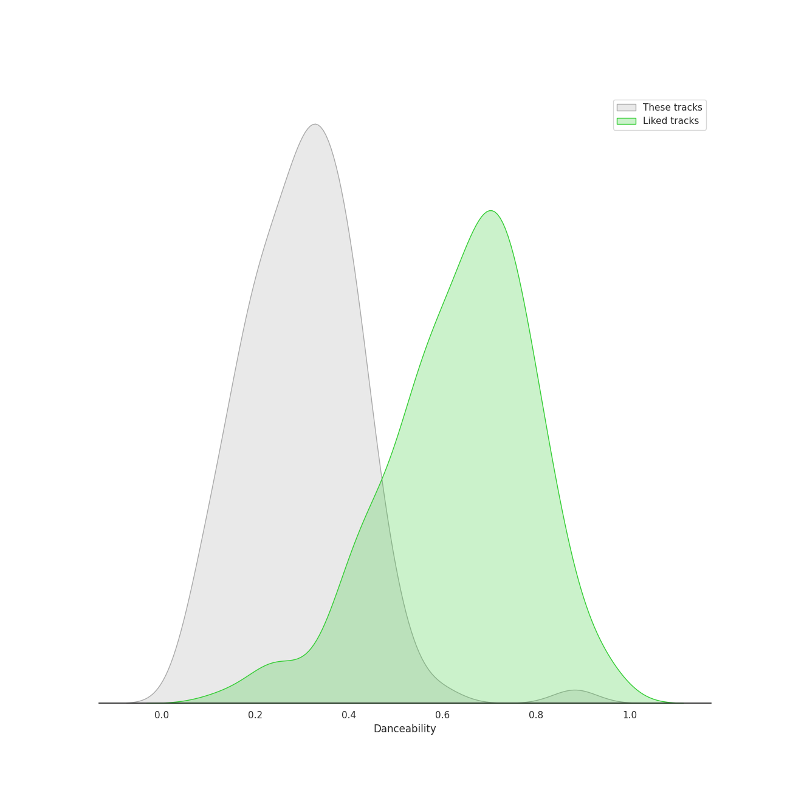
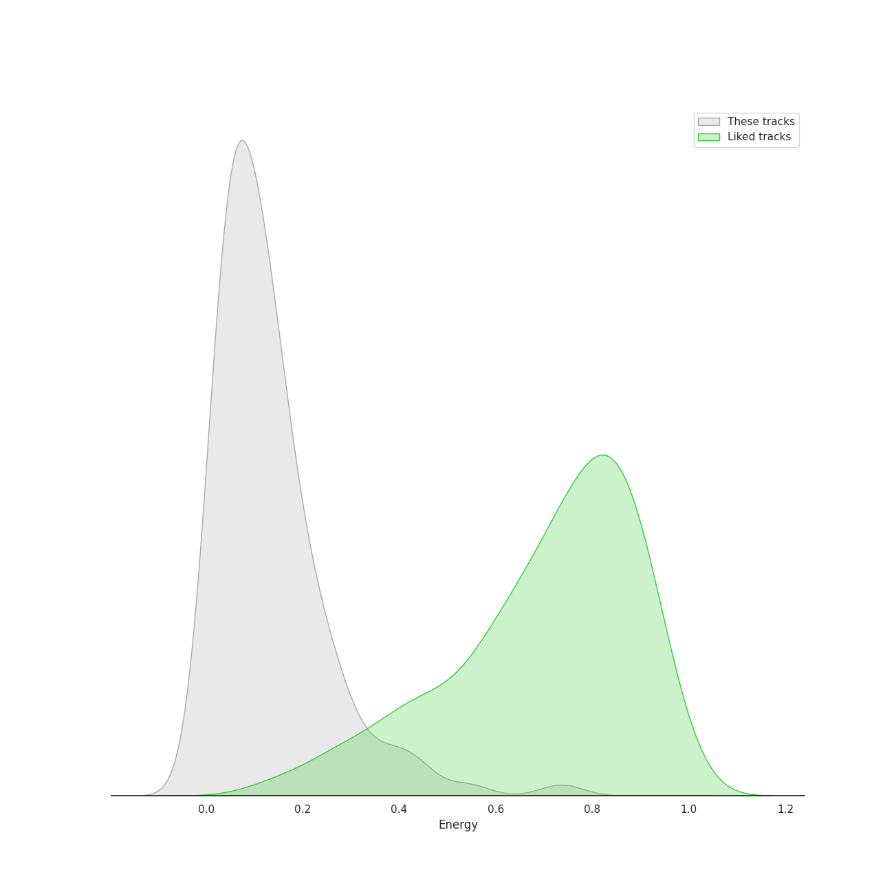
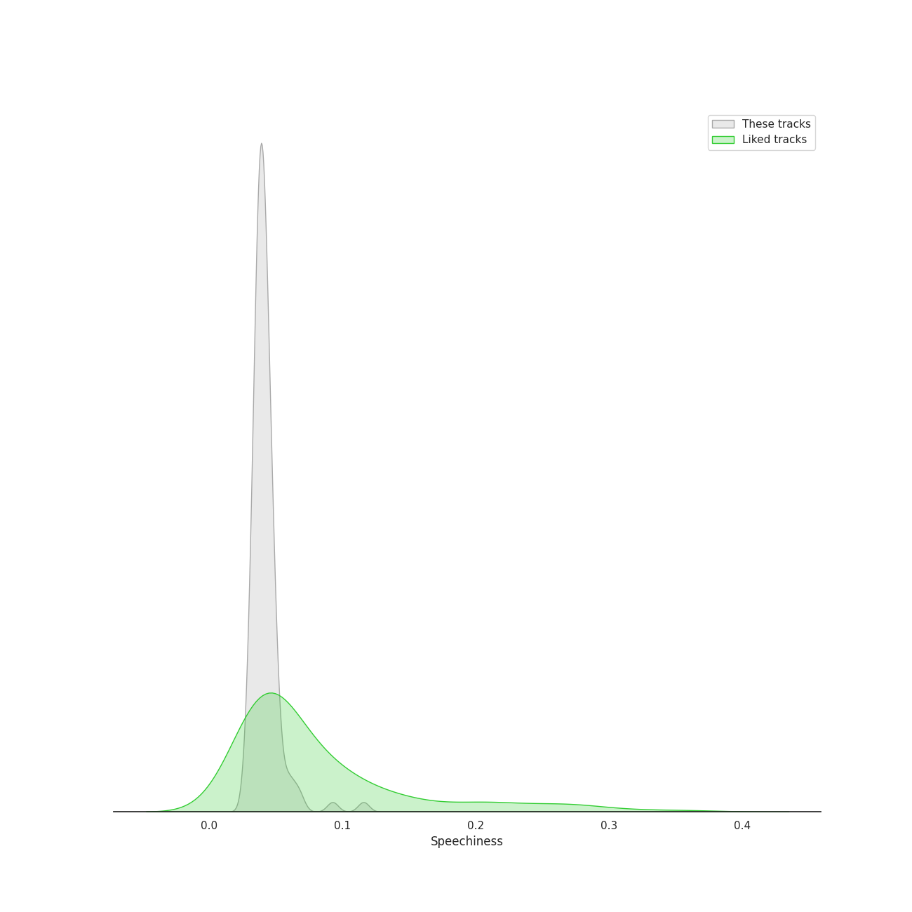
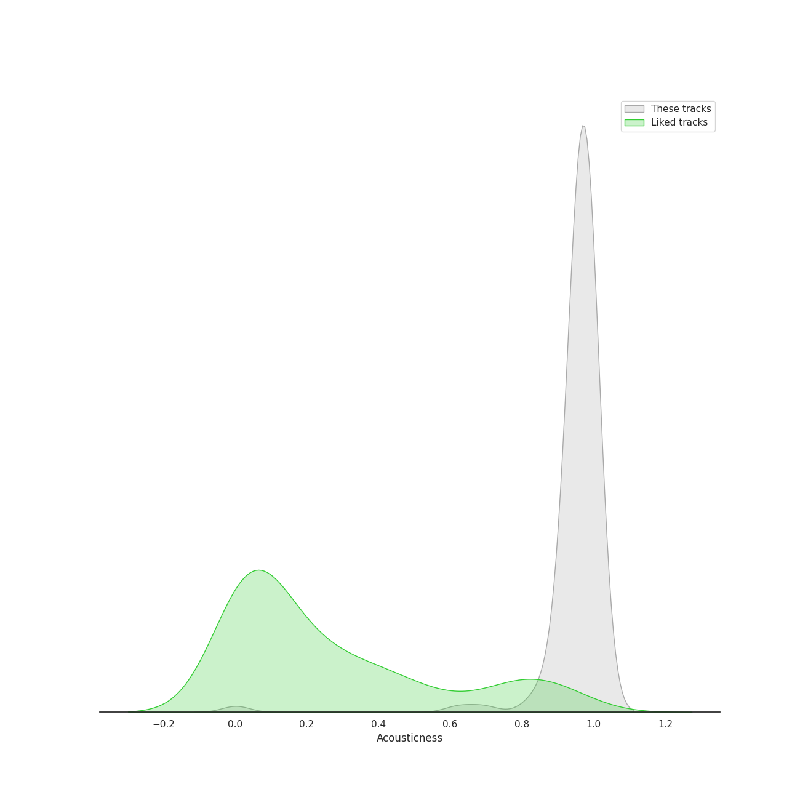
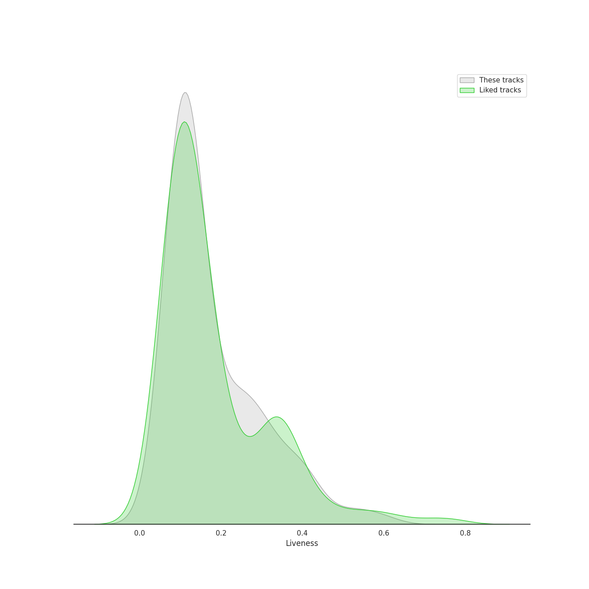
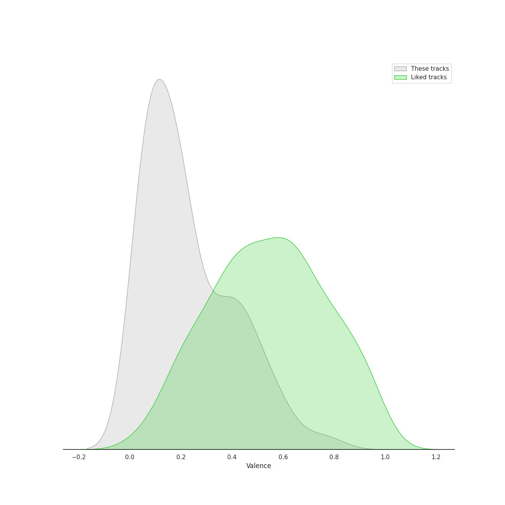
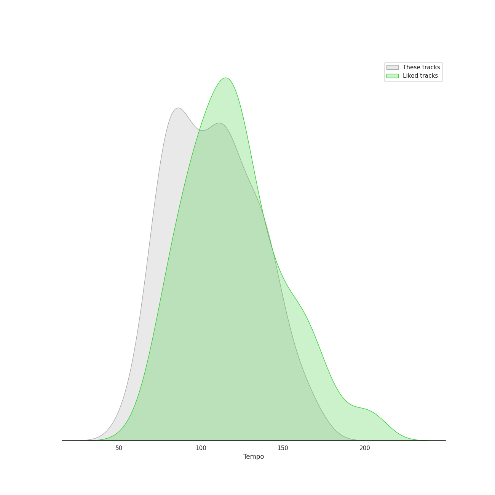

# Audio Features for UME - Global Clearing House

## Danceability

| ​ | 10 most Danceable tracks | ​​ | 10 least Danceable tracks |
|:---|:---|:---|:---|
|  | Gentleman (0.882) |  | Die Zauberflöte, K.620 / Act 2: "O Isis und Osiris, welche Wonne!" (0.0663) |
|  | Divertimento No. 11 in D, K.251 "Nannerl-Septett": Menuetto (Tema con variazioni) (0.593) |  | Horn Concerto No. 4 in E-Flat Major, K. 495: II. Romanza. Andante (0.0683) |
|  | Violin Concerto No. 3 in G Major, K. 216: III. Rondo (Allegro) (0.507) |  | Requiem In D Minor, K.626: 7. Agnus Dei (0.0749) |
|  | Die Zauberflöte, K.620 / Act 2: "Pa-Pa-Pa-Pa-Pa-Pa-Papagena!" (0.504) |  | Divertimento No. 15 in B Flat Major, K. 287: IV. Adagio (0.0898) |
|  | Die Zauberflöte, K.620 / Act 2: Alles fühlt der Liebe Freuden (Monostatos) (0.499) |  | Horn Concerto No. 2 in E-Flat Major, K. 417: II. Andante (0.099) |
|  | Serenade In G, K.525 "Eine kleine Nachtmusik": 4. Rondo (Allegro) (0.478) |  | Divertimento in D, K.334 - Orchestral Version: 4. Adagio (0.101) |
|  | Divertimento No. 15 in B-Flat Major, K. 287: 5. Menuetto (0.476) |  | Symphony No. 33 in B flat, K.319: 2. Andante moderato (0.116) |
|  | L-O-V-E - 2000 Remaster (0.451) |  | Mass In C, K.317 "Coronation": 1. Kyrie (0.117) |
|  | Serenade in G, K.525 "Eine kleine Nachtmusik": 1. Allegro (0.449) |  | Requiem In D Minor, K.626: 3. Sequentia: Confutatis (0.118) |
|  | Divertimento No. 11 in D, K.251 "Nannerl-Septett": Allegro molto (0.444) |  | Symphony No. 35 in D Major, K. 385 "Haffner": 2. Andante (0.124) |

## Energy

| ​ | 10 most Energetic tracks | ​​ | 10 least Energetic tracks |
|:---|:---|:---|:---|
|  | Gentleman (0.736) |  | Die Zauberflöte, K.620 / Act 2: "Seid uns zum zweiten Mal willkommen" (0.00404) |
|  | Requiem in D Minor, K.626: 3a. Sequientia: Dies irae (0.542) |  | Divertimento No. 15 in B-Flat Major, K. 287: 5. Menuetto (0.0183) |
|  | Symphony No. 39 in E flat, K.543: 4. Finale (Allegro) (0.441) |  | Requiem In D Minor, K.626: 3. Sequentia: Confutatis (0.0185) |
|  | Mass In C, K.317 "Coronation": 3. Credo (0.433) |  | Divertimento No. 15 in B-Flat Major, K. 287: 3. Menuetto (0.0207) |
|  | Symphony No. 41 In C, K.551 - "Jupiter": 4. Molto allegro (0.408) |  | Divertimento No. 15 in B Flat Major, K. 287: V. Menuetto (II) (0.0223) |
|  | Mass In C, K.317 "Coronation": 4. Sanctus (0.373) |  | Horn Concerto No. 4 in E-Flat Major, K. 495: II. Romanza. Andante (0.0254) |
|  | Requiem In D Minor, K.626: 5. Sanctus (0.363) |  | Die Zauberflöte, K.620 / Act 2: Ein Mädchen oder Weibchen (Papageno) (0.0254) |
|  | Requiem In D Minor, K.626: 2. Kyrie (0.33) |  | Symphony No. 40 In G Minor, K.550: 2. Andante (0.0259) |
|  | Symphony No. 40 In G Minor, K.550: 4. Finale (Allegro assai) (0.295) |  | Divertimento in D, K.334 - Orchestral Version: 3. Menuetto - Trio - Menuetto (0.0268) |
|  | Symphony No. 40 In G Minor, K.550: 1. Molto allegro (0.295) |  | Die Zauberflöte, K.620 / Act 1: "Bei Männern, welche Liebe fühlen" (0.0301) |

## Speechiness

| ​ | 10 most Speechy tracks | ​​ | 10 least Speechy tracks |
|:---|:---|:---|:---|
|  | Gentleman (0.116) |  | Requiem In D Minor, K.626: 4. Offertorium: Domine Jesu (0.0293) |
|  | L-O-V-E - 2000 Remaster (0.0928) |  | Symphony No. 39 in E flat, K.543: 3. Menuetto (Allegretto) (0.0297) |
|  | Divertimento No. 11 in D, K.251 "Nannerl-Septett": Menuetto (Tema con variazioni) (0.068) |  | Requiem In D Minor, K.626: 5. Sanctus (0.0301) |
|  | Die Zauberflöte, K.620 / Act 2: Alles fühlt der Liebe Freuden (Monostatos) (0.0662) |  | Requiem In D Minor, K.626: 2. Kyrie (0.0304) |
|  | Die Zauberflöte, K.620 / Act 1: "Bei Männern, welche Liebe fühlen" (0.0611) |  | Requiem In D Minor, K.626: 3. Sequentia: Rex tremendae (0.0315) |
|  | Die Zauberflöte, K.620 / Act 1: Zu Hilfe! Zu Hilfe! (Tamino, Die drei Damen) (0.0591) |  | Requiem In D Minor, K.626: 4. Offertorium: Hostias (0.0316) |
|  | Serenade in G, K.525 "Eine kleine Nachtmusik": 1. Allegro (0.0585) |  | Requiem In D Minor, K.626: 8.Communio: Lux aeterna (0.0317) |
|  | Die Zauberflöte, K.620 / Act 1: Der Vogelfänger bin ich ja (Papageno) (0.0522) |  | Mass In C, K.317 "Coronation": 4. Sanctus (0.0321) |
|  | Die Zauberflöte, K.620 / Act 2: Der Hölle Rache kocht in meinem Herzen (Königin der Nacht) (0.0521) |  | Requiem in D Minor, K.626: 3a. Sequientia: Dies irae (0.0325) |
|  | Die Zauberflöte, K.620 / Act 2: "Pa-Pa-Pa-Pa-Pa-Pa-Papagena!" (0.052) |  | Divertimento No. 11 in D, K.251 "Nannerl-Septett": Marcia alla francese (0.0334) |

## Acousticness

| ​ | 10 most Acoustic tracks | ​​ | 10 least Acoustic tracks |
|:---|:---|:---|:---|
|  | Requiem In D Minor, K.626: 3. Sequentia: Confutatis (0.993) |  | Gentleman (0.00222) |
|  | Requiem In D Minor, K.626: 4. Offertorium: Domine Jesu (0.992) |  | Die Zauberflöte, K.620 / Act 2: Ein Mädchen oder Weibchen (Papageno) (0.623) |
|  | Horn Concerto No. 4 in E-Flat Major, K. 495: III. Rondo. Allegro vivace (0.992) |  | L-O-V-E - 2000 Remaster (0.694) |
|  | Horn Concerto No. 2 in E-Flat Major, K. 417: III. Rondo (0.991) |  | Serenade In G, K.525 "Eine kleine Nachtmusik": 3. Menuetto (Allegretto) (0.828) |
|  | Horn Concerto No. 2 in E-Flat Major, K. 417: II. Andante (0.991) |  | Symphony No. 41 In C, K.551 - "Jupiter": 4. Molto allegro (0.852) |
|  | Requiem In D Minor, K.626: 3. Sequentia: Tuba mirum (0.99) |  | Die Zauberflöte, K.620 / Act 2: Alles fühlt der Liebe Freuden (Monostatos) (0.865) |
|  | Requiem In D Minor, K.626: 6. Benedictus (0.99) |  | Symphony No. 35 in D Major, K. 385 "Haffner": 4. Finale (Presto) (0.896) |
|  | Horn Concerto No. 3 in E-Flat Major, K. 447: I. Allegro - Cadenza: Manfred Klier (0.989) |  | Serenade In G, K.525 "Eine kleine Nachtmusik": 2. Romance (Andante) (0.912) |
|  | Horn Concerto No. 2 in E-Flat Major, K. 417: I. Allegro maestoso (0.989) |  | Symphony No. 40 In G Minor, K.550: 1. Molto allegro (0.917) |
|  | Requiem In D Minor, K.626: 4. Offertorium: Hostias (0.989) |  | Divertimento No. 15 in B-Flat Major, K. 287: 4. Adagio (0.919) |

## Instrumentalness

| ​ | 10 most Instrumental tracks | ​​ | 10 least Instrumental tracks |
|:---|:---|:---|:---|
|  | Divertimento No. 11 in D, K.251 "Nannerl-Septett": Menuetto (Tema con variazioni) (0.958) |  | Gentleman (0.0) |
|  | Horn Concerto No. 2 in E-Flat Major, K. 417: II. Andante (0.954) |  | Die Zauberflöte, K.620 / Act 2: Ein Mädchen oder Weibchen (Papageno) (0.0) |
|  | Horn Concerto No. 1 in D Major, K. 386b (K. 412 & 514): I. (Allegro) K. 412 (0.95) |  | L-O-V-E - 2000 Remaster (0.0) |
|  | Horn Concerto No. 4 in E-Flat Major, K. 495: II. Romanza. Andante (0.949) |  | Die Zauberflöte, K.620 / Act 1: "Bei Männern, welche Liebe fühlen" (0.0) |
|  | Requiem In D Minor, K.626: 3. Sequentia: Confutatis (0.944) |  | Die Zauberflöte, K.620 / Act 1: Der Vogelfänger bin ich ja (Papageno) (1.03e-05) |
|  | Symphony No. 40 In G Minor, K.550: 4. Finale (Allegro assai) (0.941) |  | Die Zauberflöte, K.620 / Act 2: "Seid uns zum zweiten Mal willkommen" (1.46e-05) |
|  | Symphony No. 40 In G Minor, K.550: 3. Menuetto (Allegretto) - Trio (0.939) |  | Die Zauberflöte, K.620 / Act 1: Zu Hilfe! Zu Hilfe! (Tamino, Die drei Damen) (5.54e-05) |
|  | Divertimento in D, K.334 - Orchestral Version: 6. Rondo (Allegro) (0.934) |  | Die Zauberflöte, K.620 / Act 2: Alles fühlt der Liebe Freuden (Monostatos) (5.9e-05) |
|  | Symphony No. 32 in G Major, K. 318: 1. Allegro - 2. Andante - 3. Tempo I (0.933) |  | Requiem In D Minor, K.626: 3. Sequentia: Recordare (0.000349) |
|  | Divertimento No. 11 in D, K.251 "Nannerl-Septett": Rondeau (Allegro assai) (0.931) |  | Requiem In D Minor, K.626: 3. Sequentia: Tuba mirum (0.0004) |

## Liveness

| ​ | 10 most Live tracks | ​​ | 10 least Live tracks |
|:---|:---|:---|:---|
|  | Symphony No. 36 in C Major, K. 425 "Linz": 3. Menuetto (0.594) |  | Gentleman (0.0515) |
|  | Requiem In D Minor, K.626: 3. Sequentia: Recordare (0.541) |  | Divertimento in D, K.334 - Orchestral Version: 2. Thema mit Variationen (Andante) (0.0641) |
|  | Die Zauberflöte, K.620 / Act 2: Alles fühlt der Liebe Freuden (Monostatos) (0.508) |  | Violin Concerto No. 5 in A Major, K. 219: III. Rondeau (Tempo di minuetto) (0.0665) |
|  | Requiem in D Minor, K.626: 3a. Sequientia: Dies irae (0.444) |  | Violin Concerto No. 5 in A Major, K. 219: I. Allegro aperto (0.0674) |
|  | Die Zauberflöte, K.620 / Act 1: Der Vogelfänger bin ich ja (Papageno) (0.421) |  | Requiem In D Minor, K.626: 8.Communio: Lux aeterna (0.0716) |
|  | Divertimento In F, K.247: Menuetto (0.412) |  | Die Zauberflöte, K.620 / Act 2: Der Hölle Rache kocht in meinem Herzen (Königin der Nacht) (0.0743) |
|  | Symphony No. 33 in B flat, K.319: 3. Menuetto (0.409) |  | Symphony No. 39 in E flat, K.543: 2. Andante con moto (0.0759) |
|  | Divertimento No. 11 in D, K.251 "Nannerl-Septett": Marcia alla francese (0.392) |  | Mass In C, K.317 "Coronation": 3. Credo (0.0762) |
|  | Die Zauberflöte, K.620 / Act 2: "Seid uns zum zweiten Mal willkommen" (0.386) |  | Mass In C, K.317 "Coronation": 7. Agnus Dei. Dona nobis pacem - Allegro con spirito (0.0764) |
|  | Symphony No. 41 In C, K.551 - "Jupiter": 3. Menuetto (Allegretto) (0.384) |  | Die Zauberflöte, K.620 / Act 2: Ach, ich fühl's, es ist verschwunden (Pamina) (0.0785) |

## Valence

| ​ | 10 most Happy tracks | ​​ | 10 least Happy tracks |
|:---|:---|:---|:---|
|  | Die Zauberflöte, K.620 / Act 2: Alles fühlt der Liebe Freuden (Monostatos) (0.792) |  | Requiem In D Minor, K.626: 7. Agnus Dei (0.0338) |
|  | L-O-V-E - 2000 Remaster (0.728) |  | Requiem In D Minor, K.626: 3. Sequentia: Confutatis (0.0351) |
|  | Serenade In G, K.525 "Eine kleine Nachtmusik": 4. Rondo (Allegro) (0.64) |  | Die Zauberflöte, K.620 / Act 2: O Isis und Osiris (Sarastro, Chor) (0.0353) |
|  | Requiem in D Minor, K.626: 3a. Sequientia: Dies irae (0.596) |  | Die Zauberflöte, K.620 / Act 2: Ach, ich fühl's, es ist verschwunden (Pamina) (0.0373) |
|  | Gentleman (0.582) |  | Divertimento In F, K.247: Adagio (0.0381) |
|  | Divertimento No. 11 in D, K.251 "Nannerl-Septett": Menuetto (Tema con variazioni) (0.57) |  | Mass In C, K.317 "Coronation": 6. Agnus Dei (0.0384) |
|  | Divertimento No. 11 in D, K.251 "Nannerl-Septett": Marcia alla francese (0.56) |  | Symphony No. 41 In C, K.551 - "Jupiter": 2. Andante cantabile (0.0385) |
|  | Requiem In D Minor, K.626: 2. Kyrie (0.544) |  | Symphony No. 40 In G Minor, K.550: 2. Andante (0.0392) |
|  | Serenade in G, K.525 "Eine kleine Nachtmusik": 1. Allegro (0.524) |  | Requiem In D Minor, K.626: 3. Sequentia: Lacrimosa (0.0394) |
|  | Die Zauberflöte, K.620 / Act 1: Der Vogelfänger bin ich ja (Papageno) (0.504) |  | Divertimento in D, K.334 - Orchestral Version: 4. Adagio (0.04) |

## Tempo

| ​ | 10 most Fast tracks | ​​ | 10 least Fast tracks |
|:---|:---|:---|:---|
|  | Divertimento in D, K.334 - Orchestral Version: 4. Adagio (168.802) |  | Divertimento No. 15 in B Flat Major, K. 287: IV. Adagio (56.647) |
|  | Symphony No. 33 in B flat, K.319: 2. Andante moderato (165.957) |  | Mass In C, K.317 "Coronation": 5. Benedictus (57.355) |
|  | Symphony No. 33 in B flat, K.319: 1. Allegro assai (165.933) |  | Horn Concerto No. 4 in E-Flat Major, K. 495: III. Rondo. Allegro vivace (63.172) |
|  | L-O-V-E - 2000 Remaster (157.47) |  | Requiem In D Minor, K.626: 3. Sequentia: Confutatis (65.236) |
|  | Divertimento No. 15 in B Flat Major, K. 287: I. Allegro (153.666) |  | Requiem In D Minor, K.626: 5. Sanctus (68.345) |
|  | Serenade In G, K.525 "Eine kleine Nachtmusik": 2. Romance (Andante) (153.555) |  | Die Zauberflöte, K.620 / Act 1: Zu Hilfe! Zu Hilfe! (Tamino, Die drei Damen) (70.475) |
|  | Symphony No. 39 in E flat, K.543: 1. Adagio - Allegro (153.184) |  | Die Zauberflöte, K.620 / Act 2: "O Isis und Osiris, welche Wonne!" (73.462) |
|  | Mass In C, K.317 "Coronation": 2. Gloria (152.459) |  | Horn Concerto No. 4 in E-Flat Major, K. 495: II. Romanza. Andante (73.634) |
|  | Horn Concerto No. 2 in E-Flat Major, K. 417: III. Rondo (144.224) |  | Horn Concerto No. 2 in E-Flat Major, K. 417: II. Andante (73.943) |
|  | Symphony No. 41 In C, K.551 - "Jupiter": 4. Molto allegro (144.103) |  | Mass In C, K.317 "Coronation": 1. Kyrie (74.589) |
