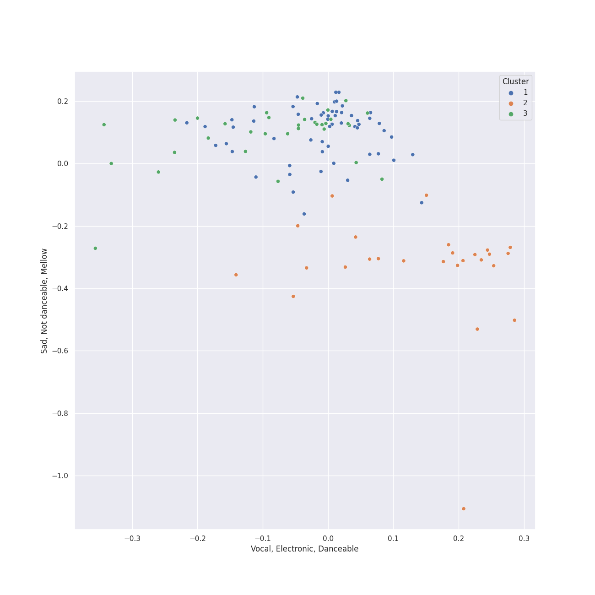

# Clusters in UME - Global Clearing House

## Cluster #1

58 tracks

| Art | Track | Album | Artists | Label | 💚 | 🔗 |
|:---|:---|:---|:---|:---|:---|:---|
|  | Divertimento In F, K.247: Andante grazioso | Karajan - Mozart | [Wolfgang Amadeus Mozart](../../../../artists/wolfgang_amadeus_mozart/overview.md), [Berliner Philharmoniker](../../../../artists/berliner_philharmoniker/overview.md), [Herbert von Karajan](../../../../artists/herbert_von_karajan/overview.md) | [UME - Global Clearing House](../..) | | [🔗](https://open.spotify.com/track/3iaBg32tC3kAL7lsYkr8Ff) |
|  | Divertimento No. 11 in D, K.251 "Nannerl-Septett": Andantino | Karajan - Mozart | [Wolfgang Amadeus Mozart](../../../../artists/wolfgang_amadeus_mozart/overview.md), [Berliner Philharmoniker](../../../../artists/berliner_philharmoniker/overview.md), [Herbert von Karajan](../../../../artists/herbert_von_karajan/overview.md) | [UME - Global Clearing House](../..) | | [🔗](https://open.spotify.com/track/1vqoKICFQx8Qyt7dPY3oW7) |
|  | Divertimento No. 15 in B Flat Major, K. 287: VI. Andante - Allegro molto | Karajan - Mozart | [Wolfgang Amadeus Mozart](../../../../artists/wolfgang_amadeus_mozart/overview.md), [Berliner Philharmoniker](../../../../artists/berliner_philharmoniker/overview.md), [Herbert von Karajan](../../../../artists/herbert_von_karajan/overview.md) | [UME - Global Clearing House](../..) | | [🔗](https://open.spotify.com/track/7tjIU7PoARM3stmC4GB60u) |
|  | Divertimento No. 15 in B Flat Major, K.287: 2. Tema con variazioni: Andante grazioso | Karajan - Mozart | [Wolfgang Amadeus Mozart](../../../../artists/wolfgang_amadeus_mozart/overview.md), [Berliner Philharmoniker](../../../../artists/berliner_philharmoniker/overview.md), [Herbert von Karajan](../../../../artists/herbert_von_karajan/overview.md) | [UME - Global Clearing House](../..) | | [🔗](https://open.spotify.com/track/21lIEJBVGTErWpl4Qpggpz) |
|  | Divertimento in D, K.334 - Orchestral Version: 2. Thema mit Variationen (Andante) | Karajan - Mozart | [Wolfgang Amadeus Mozart](../../../../artists/wolfgang_amadeus_mozart/overview.md), [Berliner Philharmoniker](../../../../artists/berliner_philharmoniker/overview.md), [Herbert von Karajan](../../../../artists/herbert_von_karajan/overview.md) | [UME - Global Clearing House](../..) | | [🔗](https://open.spotify.com/track/3CATsNBUYtjfGFiDNlNTlr) |
|  | Horn Concerto No. 3 in E-Flat Major, K. 447: II. Romanze. Larghetto | Karajan - Mozart | [Wolfgang Amadeus Mozart](../../../../artists/wolfgang_amadeus_mozart/overview.md), Manfred Klier, Gerd Seifert, [Berliner Philharmoniker](../../../../artists/berliner_philharmoniker/overview.md), [Herbert von Karajan](../../../../artists/herbert_von_karajan/overview.md) | [UME - Global Clearing House](../..) | | [🔗](https://open.spotify.com/track/2QgJYJgBuKQ67CEVhSsCZS) |
|  | Requiem In D Minor, K.626: 3. Sequentia: Rex tremendae | Karajan - Mozart | [Wolfgang Amadeus Mozart](../../../../artists/wolfgang_amadeus_mozart/overview.md), Wiener Singverein, Wiener Philharmoniker, [Herbert von Karajan](../../../../artists/herbert_von_karajan/overview.md) | [UME - Global Clearing House](../..) | | [🔗](https://open.spotify.com/track/1GgJCt9psWwrZcdGm9Z69d) |
|  | Requiem In D Minor, K.626: 8.Communio: Lux aeterna | Karajan - Mozart | [Wolfgang Amadeus Mozart](../../../../artists/wolfgang_amadeus_mozart/overview.md), Wiener Singverein, Wiener Philharmoniker, [Herbert von Karajan](../../../../artists/herbert_von_karajan/overview.md) | [UME - Global Clearing House](../..) | | [🔗](https://open.spotify.com/track/6EkyeAw8TnpzH516EBWgW2) |
|  | Symphony No. 36 in C Major, K. 425 "Linz": 1. Adagio - Allegro spiritoso | Karajan - Mozart | [Wolfgang Amadeus Mozart](../../../../artists/wolfgang_amadeus_mozart/overview.md), [Berliner Philharmoniker](../../../../artists/berliner_philharmoniker/overview.md), [Herbert von Karajan](../../../../artists/herbert_von_karajan/overview.md) | [UME - Global Clearing House](../..) | | [🔗](https://open.spotify.com/track/2j4BI5TZsucyNmOe3WA2Yq) |
|  | Symphony No. 38 In D, K.504 "Prague": 2. Andante | Karajan - Mozart | [Wolfgang Amadeus Mozart](../../../../artists/wolfgang_amadeus_mozart/overview.md), [Berliner Philharmoniker](../../../../artists/berliner_philharmoniker/overview.md), [Herbert von Karajan](../../../../artists/herbert_von_karajan/overview.md) | [UME - Global Clearing House](../..) | | [🔗](https://open.spotify.com/track/1nhBekRWgdBjtMPiGeKr0i) |
## Cluster #2

26 tracks

| Art | Track | Album | Artists | Label | 💚 | 🔗 |
|:---|:---|:---|:---|:---|:---|:---|
|  | Die Zauberflöte, K.620 / Act 1: "Bei Männern, welche Liebe fühlen" | Karajan - Mozart | [Wolfgang Amadeus Mozart](../../../../artists/wolfgang_amadeus_mozart/overview.md), Edith Mathis, Gottfried Hornik, [Berliner Philharmoniker](../../../../artists/berliner_philharmoniker/overview.md), [Herbert von Karajan](../../../../artists/herbert_von_karajan/overview.md) | [UME - Global Clearing House](../..) | | [🔗](https://open.spotify.com/track/7earPy3QwSWpSKX2eYX9US) |
|  | Die Zauberflöte, K.620 / Act 1: "O zittre nicht, mein lieber Sohn" | Karajan - Mozart | [Wolfgang Amadeus Mozart](../../../../artists/wolfgang_amadeus_mozart/overview.md), Karin Ott, [Berliner Philharmoniker](../../../../artists/berliner_philharmoniker/overview.md), [Herbert von Karajan](../../../../artists/herbert_von_karajan/overview.md) | [UME - Global Clearing House](../..) | | [🔗](https://open.spotify.com/track/6DT54QnrQN2kHlWCf6KroH) |
|  | Die Zauberflöte, K.620 / Act 1: Zu Hilfe! Zu Hilfe! (Tamino, Die drei Damen) | Karajan - Mozart | [Wolfgang Amadeus Mozart](../../../../artists/wolfgang_amadeus_mozart/overview.md), Francisco Araiza, Anna Tomowa-Sintow, Agnes Baltsa, Hanna Schwarz, [Berliner Philharmoniker](../../../../artists/berliner_philharmoniker/overview.md), [Herbert von Karajan](../../../../artists/herbert_von_karajan/overview.md) | [UME - Global Clearing House](../..) | | [🔗](https://open.spotify.com/track/3dFThyBhorrpp8sOOUIS0o) |
|  | Die Zauberflöte, K.620 / Act 2: "Seid uns zum zweiten Mal willkommen" | Karajan - Mozart | [Wolfgang Amadeus Mozart](../../../../artists/wolfgang_amadeus_mozart/overview.md), Wolfgang Bünten, Christian Schulz, Tobias Pfulb, [Berliner Philharmoniker](../../../../artists/berliner_philharmoniker/overview.md), [Herbert von Karajan](../../../../artists/herbert_von_karajan/overview.md) | [UME - Global Clearing House](../..) | | [🔗](https://open.spotify.com/track/3JIno6JgE7mhYuYke4Fs6p) |
|  | Die Zauberflöte, K.620 / Act 2: Der Hölle Rache kocht in meinem Herzen (Königin der Nacht) | Karajan - Mozart | [Wolfgang Amadeus Mozart](../../../../artists/wolfgang_amadeus_mozart/overview.md), Karin Ott, [Berliner Philharmoniker](../../../../artists/berliner_philharmoniker/overview.md), [Herbert von Karajan](../../../../artists/herbert_von_karajan/overview.md) | [UME - Global Clearing House](../..) | | [🔗](https://open.spotify.com/track/0B6iCn4MMDxJcITauM59XQ) |
|  | Mass In C, K.317 "Coronation": 2. Gloria | Karajan - Mozart | [Wolfgang Amadeus Mozart](../../../../artists/wolfgang_amadeus_mozart/overview.md), Anna Tomowa-Sintow, Agnes Baltsa, Werner Krenn, José van Dam, [Berliner Philharmoniker](../../../../artists/berliner_philharmoniker/overview.md), [Herbert von Karajan](../../../../artists/herbert_von_karajan/overview.md), Wiener Singverein | [UME - Global Clearing House](../..) | | [🔗](https://open.spotify.com/track/0nN6oNjnxZ9yUfNP3Vq5VY) |
|  | Mass In C, K.317 "Coronation": 7. Agnus Dei. Dona nobis pacem - Allegro con spirito | Karajan - Mozart | [Wolfgang Amadeus Mozart](../../../../artists/wolfgang_amadeus_mozart/overview.md), Anna Tomowa-Sintow, Agnes Baltsa, Werner Krenn, José van Dam, [Berliner Philharmoniker](../../../../artists/berliner_philharmoniker/overview.md), [Herbert von Karajan](../../../../artists/herbert_von_karajan/overview.md), Wiener Singverein | [UME - Global Clearing House](../..) | | [🔗](https://open.spotify.com/track/5xoJs5tSHWZ0u8Y3GkRvem) |
|  | Requiem In D Minor, K.626: 3. Sequentia: Tuba mirum | Karajan - Mozart | [Wolfgang Amadeus Mozart](../../../../artists/wolfgang_amadeus_mozart/overview.md), Anna Tomowa-Sintow, Helga Muller-Molinari, Vinson Cole, Paata Burchuladze, Wiener Philharmoniker, [Herbert von Karajan](../../../../artists/herbert_von_karajan/overview.md) | [UME - Global Clearing House](../..) | | [🔗](https://open.spotify.com/track/5xItkHeimSWCAWwh6WvV86) |
|  | Requiem In D Minor, K.626: 4. Offertorium: Domine Jesu | Karajan - Mozart | [Wolfgang Amadeus Mozart](../../../../artists/wolfgang_amadeus_mozart/overview.md), Anna Tomowa-Sintow, Helga Muller-Molinari, Vinson Cole, Paata Burchuladze, Wiener Singverein, Wiener Philharmoniker, [Herbert von Karajan](../../../../artists/herbert_von_karajan/overview.md) | [UME - Global Clearing House](../..) | | [🔗](https://open.spotify.com/track/7rFbjvOVAjimxhIMVVatF6) |
|  | Requiem In D Minor, K.626: 6. Benedictus | Karajan - Mozart | [Wolfgang Amadeus Mozart](../../../../artists/wolfgang_amadeus_mozart/overview.md), Anna Tomowa-Sintow, Helga Muller-Molinari, Vinson Cole, Paata Burchuladze, Wiener Singverein, Wiener Philharmoniker, [Herbert von Karajan](../../../../artists/herbert_von_karajan/overview.md) | [UME - Global Clearing House](../..) | | [🔗](https://open.spotify.com/track/0HFIawlgXNMh01tMP3rur4) |
## Cluster #3

33 tracks

| Art | Track | Album | Artists | Label | 💚 | 🔗 |
|:---|:---|:---|:---|:---|:---|:---|
|  | Divertimento In F, K.247: Andante - Allegro assai | Karajan - Mozart | [Wolfgang Amadeus Mozart](../../../../artists/wolfgang_amadeus_mozart/overview.md), [Berliner Philharmoniker](../../../../artists/berliner_philharmoniker/overview.md), [Herbert von Karajan](../../../../artists/herbert_von_karajan/overview.md) | [UME - Global Clearing House](../..) | | [🔗](https://open.spotify.com/track/2nzdItFNINgLqxAc1tQJZw) |
|  | Divertimento No. 11 in D, K.251 "Nannerl-Septett": Allegro molto | Karajan - Mozart | [Wolfgang Amadeus Mozart](../../../../artists/wolfgang_amadeus_mozart/overview.md), [Berliner Philharmoniker](../../../../artists/berliner_philharmoniker/overview.md), [Herbert von Karajan](../../../../artists/herbert_von_karajan/overview.md) | [UME - Global Clearing House](../..) | | [🔗](https://open.spotify.com/track/7hxpr5ejSeH3RSdrtxk5P3) |
|  | Divertimento No. 11 in D, K.251 "Nannerl-Septett": Rondeau (Allegro assai) | Karajan - Mozart | [Wolfgang Amadeus Mozart](../../../../artists/wolfgang_amadeus_mozart/overview.md), [Berliner Philharmoniker](../../../../artists/berliner_philharmoniker/overview.md), [Herbert von Karajan](../../../../artists/herbert_von_karajan/overview.md) | [UME - Global Clearing House](../..) | | [🔗](https://open.spotify.com/track/3R87ynLy67Mp04evQmfEM2) |
|  | Horn Concerto No. 1 in D Major, K. 386b (K. 412 & 514): I. (Allegro) K. 412 | Karajan - Mozart | [Wolfgang Amadeus Mozart](../../../../artists/wolfgang_amadeus_mozart/overview.md), Gerd Seifert, [Berliner Philharmoniker](../../../../artists/berliner_philharmoniker/overview.md), [Herbert von Karajan](../../../../artists/herbert_von_karajan/overview.md) | [UME - Global Clearing House](../..) | | [🔗](https://open.spotify.com/track/5xZOR5ykKAvXmGT4Hp8Nl0) |
|  | Horn Concerto No. 1 in D Major, K. 386b (K. 412 & 514): II. Rondò. Allegro K. 514 | Karajan - Mozart | [Wolfgang Amadeus Mozart](../../../../artists/wolfgang_amadeus_mozart/overview.md), Gerd Seifert, [Berliner Philharmoniker](../../../../artists/berliner_philharmoniker/overview.md), [Herbert von Karajan](../../../../artists/herbert_von_karajan/overview.md) | [UME - Global Clearing House](../..) | | [🔗](https://open.spotify.com/track/4sHYPGjXXhFpJB1DMVc14A) |
|  | Horn Concerto No. 3 in E-Flat Major, K. 447: III. Allegro | Karajan - Mozart | [Wolfgang Amadeus Mozart](../../../../artists/wolfgang_amadeus_mozart/overview.md), Manfred Klier, Gerd Seifert, [Berliner Philharmoniker](../../../../artists/berliner_philharmoniker/overview.md), [Herbert von Karajan](../../../../artists/herbert_von_karajan/overview.md) | [UME - Global Clearing House](../..) | | [🔗](https://open.spotify.com/track/1UPNWzHNtv70waHBGDTQxq) |
|  | Symphony No. 33 in B flat, K.319: 4. Finale (Allegro assai) | Karajan - Mozart | [Wolfgang Amadeus Mozart](../../../../artists/wolfgang_amadeus_mozart/overview.md), [Berliner Philharmoniker](../../../../artists/berliner_philharmoniker/overview.md), [Herbert von Karajan](../../../../artists/herbert_von_karajan/overview.md) | [UME - Global Clearing House](../..) | | [🔗](https://open.spotify.com/track/6tx5pjn919UXtGD80ElBa9) |
|  | Symphony No. 35 in D Major, K. 385 "Haffner": 4. Finale (Presto) | Karajan - Mozart | [Wolfgang Amadeus Mozart](../../../../artists/wolfgang_amadeus_mozart/overview.md), [Berliner Philharmoniker](../../../../artists/berliner_philharmoniker/overview.md), [Herbert von Karajan](../../../../artists/herbert_von_karajan/overview.md) | [UME - Global Clearing House](../..) | | [🔗](https://open.spotify.com/track/6AG3DgiQijfQStdoPQxyKO) |
|  | Symphony No. 38 In D, K.504 "Prague": 3. Finale (Presto) | Karajan - Mozart | [Wolfgang Amadeus Mozart](../../../../artists/wolfgang_amadeus_mozart/overview.md), [Berliner Philharmoniker](../../../../artists/berliner_philharmoniker/overview.md), [Herbert von Karajan](../../../../artists/herbert_von_karajan/overview.md) | [UME - Global Clearing House](../..) | | [🔗](https://open.spotify.com/track/5OlBFvqwbhQcoihA42rIdk) |
|  | Symphony No. 39 in E flat, K.543: 3. Menuetto (Allegretto) | Karajan - Mozart | [Wolfgang Amadeus Mozart](../../../../artists/wolfgang_amadeus_mozart/overview.md), [Berliner Philharmoniker](../../../../artists/berliner_philharmoniker/overview.md), [Herbert von Karajan](../../../../artists/herbert_von_karajan/overview.md) | [UME - Global Clearing House](../..) | | [🔗](https://open.spotify.com/track/0b0QZwVikqOflCrOo3Eie5) |