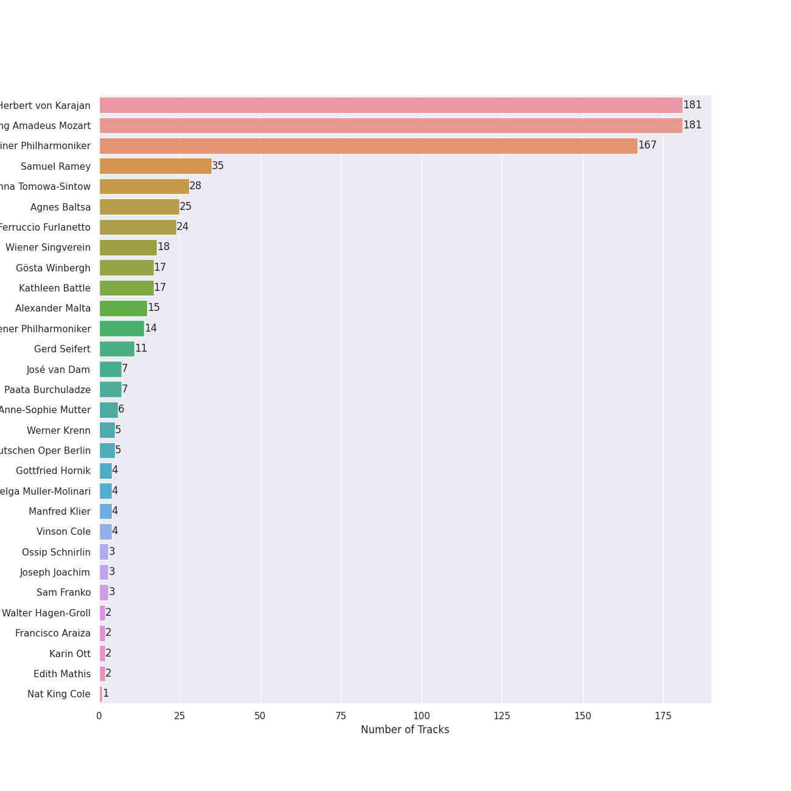
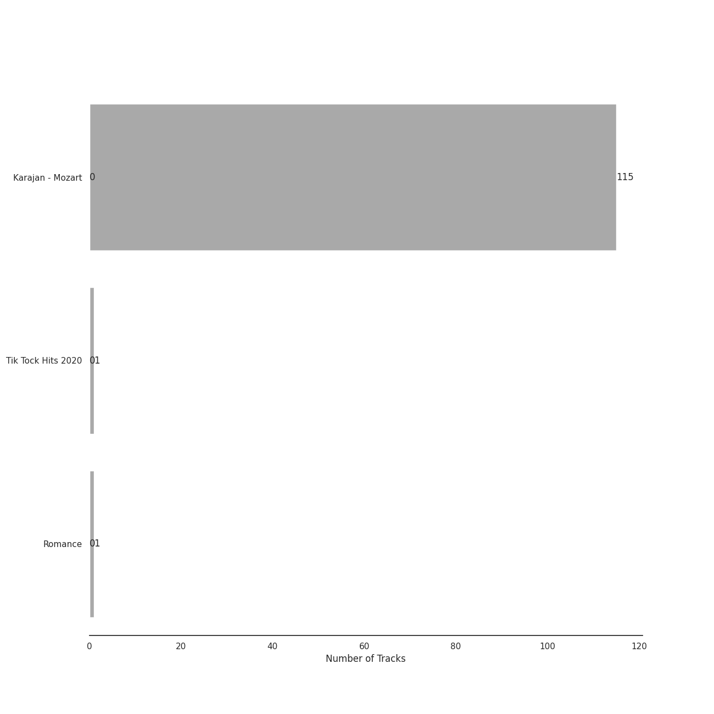
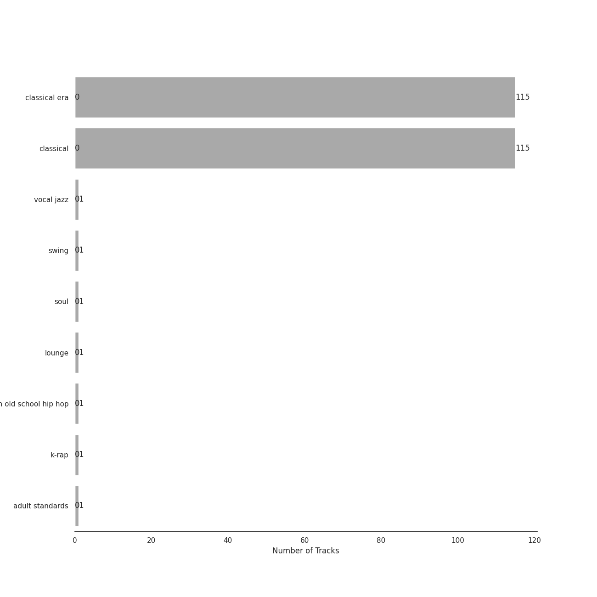

# UME - Global Clearing House

117 songs

[See Track Features](audio_features.md)

[See Clusters](clusters/overview.md)

Appears as:
- UME - Global Clearing House (117 tracks)

## Top Artists

| Art | Tracks | 💚 | Artist | 🔗 |
|:---|---:|---:|:---|:---|
|  | 115 | 0 | Herbert von Karajan | [🔗](https://open.spotify.com/artist/5zCaQxjl110XTrm4LQ1CxY) |
|  | 115 | 0 | Wolfgang Amadeus Mozart | [🔗](https://open.spotify.com/artist/4NJhFmfw43RLBLjQvxDuRS) |
|  | 101 | 0 | Berliner Philharmoniker | [🔗](https://open.spotify.com/artist/6uRJnvQ3f8whVnmeoecv5Z) |
|  | 18 | 0 | Wiener Singverein | [🔗](https://open.spotify.com/artist/35QSympF887CO8h5eZHme2) |
|  | 14 | 0 | Wiener Philharmoniker | [🔗](https://open.spotify.com/artist/003f4bk13c6Q3gAUXv7dGJ) |
|  | 13 | 0 | Anna Tomowa-Sintow | [🔗](https://open.spotify.com/artist/6NSIW1uEq8JZmxEkHMF17c) |
|  | 11 | 0 | Gerd Seifert | [🔗](https://open.spotify.com/artist/4aIYtx2Z5X9vRlysnruy66) |
|  | 7 | 0 | José van Dam | [🔗](https://open.spotify.com/artist/5qNUHMEhszyeXNYMn4sswd) |
|  | 6 | 0 | Anne-Sophie Mutter | [🔗](https://open.spotify.com/artist/6pzfUmBsQAKxOhy0NSi8zn) |
|  | 6 | 0 | Agnes Baltsa | [🔗](https://open.spotify.com/artist/2amF56vDuTTbZJQsqUgbuC) |

See all 32 artists

| Art | Tracks | 💚 | Artist | 🔗 |
|:---|---:|---:|:---|:---|
|  | 5 | 0 | Werner Krenn | [🔗](https://open.spotify.com/artist/3PuXD6h01YqjNWQ055CWxA) |
|  | 4 | 0 | Gottfried Hornik | [🔗](https://open.spotify.com/artist/6aFQ4LADfHVe08B5gQuE8X) |
|  | 4 | 0 | Helga Muller-Molinari | [🔗](https://open.spotify.com/artist/3s5xNX5n6PAzpusMRhmHbA) |
|  | 4 | 0 | Manfred Klier | [🔗](https://open.spotify.com/artist/3KkpLfmwQob3Y75ePPdtse) |
|  | 4 | 0 | Vinson Cole | [🔗](https://open.spotify.com/artist/2j6cP3f3TxyHzcKdWYSm6h) |
|  | 4 | 0 | Paata Burchuladze | [🔗](https://open.spotify.com/artist/1JzOJmq9kk0u7OWqzXkBcc) |
|  | 3 | 0 | Ossip Schnirlin | [🔗](https://open.spotify.com/artist/7eI7DJSWlJy2W2337B9oTL) |
|  | 3 | 0 | Joseph Joachim | [🔗](https://open.spotify.com/artist/6QuJ4aZSRMebqwDXiJ3SuA) |
|  | 3 | 0 | Sam Franko | [🔗](https://open.spotify.com/artist/3vkG71N5uQBzhzwEDr6icH) |
|  | 3 | 0 | Chor der Deutschen Oper Berlin | [🔗](https://open.spotify.com/artist/2KvV4gawnuMNG74DgSAQ0n) |
|  | 2 | 0 | Walter Hagen-Groll | [🔗](https://open.spotify.com/artist/5iMb1u0pxxzSPONrB4j0Zb) |
|  | 2 | 0 | Francisco Araiza | [🔗](https://open.spotify.com/artist/5M0cOgeTBOetAbsM4FDVDP) |
|  | 2 | 0 | Karin Ott | [🔗](https://open.spotify.com/artist/2sZHeIbU96txBewcnCJLj7) |
|  | 2 | 0 | Edith Mathis | [🔗](https://open.spotify.com/artist/0eOythKkGSageuVFr6nDHf) |
|  | 1 | 0 | Nat King Cole | [🔗](https://open.spotify.com/artist/7v4imS0moSyGdXyLgVTIV7) |
|  | 1 | 0 | Wolfgang Bünten | [🔗](https://open.spotify.com/artist/6qZFjcGH1SfhbkrNfnzH7z) |
|  | 1 | 0 | Heinz Kruse | [🔗](https://open.spotify.com/artist/44kp24Y9MhmQ4RT64CUaV2) |
|  | 1 | 0 | PSY | [🔗](https://open.spotify.com/artist/2dd5mrQZvg6SmahdgVKDzh) |
|  | 1 | 0 | Tobias Pfulb | [🔗](https://open.spotify.com/artist/2GD6gK1wj1cD8TFGe2BpJC) |
|  | 1 | 0 | Janet Perry | [🔗](https://open.spotify.com/artist/1bV3KjOPs1AI3OolJiYogN) |
|  | 1 | 0 | Hanna Schwarz | [🔗](https://open.spotify.com/artist/0uzYuEP2MlAJ5FdVIYIalx) |
|  | 1 | 0 | Christian Schulz | [🔗](https://open.spotify.com/artist/0sqQ1nXbUwTWglq8jWopvZ) |

## Top Albums

| Art | Tracks | 💚 | Album | Release Date | 🔗 |
|:---|---:|---:|:---|:---|:---|
|  | 115 | 0 | Karajan - Mozart | 2020-06-16 | [🔗](https://open.spotify.com/album/1HSJhsMIW2EDD4YSSkbc9e) |
|  | 1 | 0 | Tik Tock Hits 2020 | 2020-06-12 | [🔗](https://open.spotify.com/album/4Da9F5PAFILkjmNmm81NZ3) |
|  | 1 | 0 | Romance | 2021-02-12 | [🔗](https://open.spotify.com/album/5MuNxtOyex8o77Qdjaqeng) |

## Genres

| Tracks | 💚 | Genre |
|---:|---:|:---|
| 115 | 0 | classical era |
| 115 | 0 | classical |
| 1 | 0 | vocal jazz |
| 1 | 0 | swing |
| 1 | 0 | soul |
| 1 | 0 | lounge |
| 1 | 0 | korean old school hip hop |
| 1 | 0 | k-rap |
| 1 | 0 | [adult standards](../../genres/adult_standards/overview.md) |

## Tracks released under UME - Global Clearing House

| Art | Track | Album | Artists | Label | 💚 | 🔗 |
|:---|:---|:---|:---|:---|:---|:---|
|  | L-O-V-E - 2000 Remaster | Romance | Nat King Cole | [UME - Global Clearing House](.) | | [🔗](https://open.spotify.com/track/6OHPdG4tYiHRPUHwf68nRU) |
|  | Gentleman | Tik Tock Hits 2020 | PSY | [UME - Global Clearing House](.) | | [🔗](https://open.spotify.com/track/26spalP6x2gUAab8rwB8dQ) |
|  | Die Zauberflöte, K.620 / Act 1: "Bei Männern, welche Liebe fühlen" | Karajan - Mozart | Edith Mathis, Wolfgang Amadeus Mozart, Herbert von Karajan, Gottfried Hornik, Berliner Philharmoniker | [UME - Global Clearing House](.) | | [🔗](https://open.spotify.com/track/7earPy3QwSWpSKX2eYX9US) |
|  | Die Zauberflöte, K.620 / Act 1: "O zittre nicht, mein lieber Sohn" | Karajan - Mozart | Karin Ott, Wolfgang Amadeus Mozart, Herbert von Karajan, Berliner Philharmoniker | [UME - Global Clearing House](.) | | [🔗](https://open.spotify.com/track/6DT54QnrQN2kHlWCf6KroH) |
|  | Die Zauberflöte, K.620 / Act 1: Der Vogelfänger bin ich ja (Papageno) | Karajan - Mozart | Wolfgang Amadeus Mozart, Herbert von Karajan, Gottfried Hornik, Berliner Philharmoniker | [UME - Global Clearing House](.) | | [🔗](https://open.spotify.com/track/4nJ5gJeaCiib7I3n2xxKi8) |
|  | Die Zauberflöte, K.620 / Act 1: Dies Bildnis ist bezaubernd schön (Tamino) | Karajan - Mozart | Wolfgang Amadeus Mozart, Francisco Araiza, Herbert von Karajan, Berliner Philharmoniker | [UME - Global Clearing House](.) | | [🔗](https://open.spotify.com/track/3A5Hdmjl3cQWctF2KPHPDT) |
|  | Die Zauberflöte, K.620 / Act 1: Zu Hilfe! Zu Hilfe! (Tamino, Die drei Damen) | Karajan - Mozart | Hanna Schwarz, Agnes Baltsa, Wolfgang Amadeus Mozart, Francisco Araiza, Herbert von Karajan, Anna Tomowa-Sintow, Berliner Philharmoniker | [UME - Global Clearing House](.) | | [🔗](https://open.spotify.com/track/3dFThyBhorrpp8sOOUIS0o) |
|  | Die Zauberflöte, K.620 / Act 2: "Die Strahlen der Sonne" - "Heil sei euch" | Karajan - Mozart | Chor der Deutschen Oper Berlin, Wolfgang Amadeus Mozart, José van Dam, Herbert von Karajan, Berliner Philharmoniker | [UME - Global Clearing House](.) | | [🔗](https://open.spotify.com/track/7vHcyTwpivareNXvjYCUKW) |
|  | Die Zauberflöte, K.620 / Act 2: "In diesen heil'gen Hallen" | Karajan - Mozart | Wolfgang Amadeus Mozart, José van Dam, Herbert von Karajan, Berliner Philharmoniker | [UME - Global Clearing House](.) | | [🔗](https://open.spotify.com/track/7d647G4C4SCnKRCeXOWO28) |
|  | Die Zauberflöte, K.620 / Act 2: "O Isis und Osiris, welche Wonne!" | Karajan - Mozart | Chor der Deutschen Oper Berlin, Wolfgang Amadeus Mozart, Walter Hagen-Groll, Herbert von Karajan, Berliner Philharmoniker | [UME - Global Clearing House](.) | | [🔗](https://open.spotify.com/track/0mN2s4aGuyTHvdhaRYdz8O) |

See all tracks

| Art | Track | Album | Artists | Label | 💚 | 🔗 |
|:---|:---|:---|:---|:---|:---|:---|
|  | Die Zauberflöte, K.620 / Act 2: "Pa-Pa-Pa-Pa-Pa-Pa-Papagena!" | Karajan - Mozart | Janet Perry, Wolfgang Amadeus Mozart, Herbert von Karajan, Gottfried Hornik, Berliner Philharmoniker | [UME - Global Clearing House](.) | | [🔗](https://open.spotify.com/track/4jxCucVrcMeqx4EtWCq1Jj) |
|  | Die Zauberflöte, K.620 / Act 2: "Seid uns zum zweiten Mal willkommen" | Karajan - Mozart | Christian Schulz, Tobias Pfulb, Wolfgang Amadeus Mozart, Herbert von Karajan, Wolfgang Bünten, Berliner Philharmoniker | [UME - Global Clearing House](.) | | [🔗](https://open.spotify.com/track/3JIno6JgE7mhYuYke4Fs6p) |
|  | Die Zauberflöte, K.620 / Act 2: Ach, ich fühl's, es ist verschwunden (Pamina) | Karajan - Mozart | Edith Mathis, Wolfgang Amadeus Mozart, Herbert von Karajan, Berliner Philharmoniker | [UME - Global Clearing House](.) | | [🔗](https://open.spotify.com/track/2V8LMKhc4oLscxLy8bS8n0) |
|  | Die Zauberflöte, K.620 / Act 2: Alles fühlt der Liebe Freuden (Monostatos) | Karajan - Mozart | Heinz Kruse, Wolfgang Amadeus Mozart, Herbert von Karajan, Berliner Philharmoniker | [UME - Global Clearing House](.) | | [🔗](https://open.spotify.com/track/2am0pgqNZFAyoaDXHDpuZ0) |
|  | Die Zauberflöte, K.620 / Act 2: Der Hölle Rache kocht in meinem Herzen (Königin der Nacht) | Karajan - Mozart | Karin Ott, Wolfgang Amadeus Mozart, Herbert von Karajan, Berliner Philharmoniker | [UME - Global Clearing House](.) | | [🔗](https://open.spotify.com/track/0B6iCn4MMDxJcITauM59XQ) |
|  | Die Zauberflöte, K.620 / Act 2: Ein Mädchen oder Weibchen (Papageno) | Karajan - Mozart | Wolfgang Amadeus Mozart, Herbert von Karajan, Gottfried Hornik, Berliner Philharmoniker | [UME - Global Clearing House](.) | | [🔗](https://open.spotify.com/track/4CiRjMy096b9LjZYRCGO9x) |
|  | Die Zauberflöte, K.620 / Act 2: O Isis und Osiris (Sarastro, Chor) | Karajan - Mozart | Chor der Deutschen Oper Berlin, Wolfgang Amadeus Mozart, Walter Hagen-Groll, José van Dam, Herbert von Karajan, Berliner Philharmoniker | [UME - Global Clearing House](.) | | [🔗](https://open.spotify.com/track/02wPB0VvxA5DRX9opniy9p) |
|  | Die Zauberflöte, K.620: Overture | Karajan - Mozart | Wolfgang Amadeus Mozart, Herbert von Karajan, Berliner Philharmoniker | [UME - Global Clearing House](.) | | [🔗](https://open.spotify.com/track/6Rxcuz3B4CFLwqsZuSZIeF) |
|  | Divertimento In F, K.247: Adagio | Karajan - Mozart | Wolfgang Amadeus Mozart, Herbert von Karajan, Berliner Philharmoniker | [UME - Global Clearing House](.) | | [🔗](https://open.spotify.com/track/0GxPxabpWTGYQyvxsPLCiM) |
|  | Divertimento In F, K.247: Allegro | Karajan - Mozart | Wolfgang Amadeus Mozart, Herbert von Karajan, Berliner Philharmoniker | [UME - Global Clearing House](.) | | [🔗](https://open.spotify.com/track/33cEtMvcZC5aBi8IMvI6tG) |
|  | Divertimento In F, K.247: Andante - Allegro assai | Karajan - Mozart | Wolfgang Amadeus Mozart, Herbert von Karajan, Berliner Philharmoniker | [UME - Global Clearing House](.) | | [🔗](https://open.spotify.com/track/2nzdItFNINgLqxAc1tQJZw) |
|  | Divertimento In F, K.247: Andante grazioso | Karajan - Mozart | Wolfgang Amadeus Mozart, Herbert von Karajan, Berliner Philharmoniker | [UME - Global Clearing House](.) | | [🔗](https://open.spotify.com/track/3iaBg32tC3kAL7lsYkr8Ff) |
|  | Divertimento In F, K.247: Menuetto | Karajan - Mozart | Wolfgang Amadeus Mozart, Herbert von Karajan, Berliner Philharmoniker | [UME - Global Clearing House](.) | | [🔗](https://open.spotify.com/track/71B8g2NaTtgCgZeABmeNIf) |
|  | Divertimento In F, K.247: Menuetto (I) | Karajan - Mozart | Wolfgang Amadeus Mozart, Herbert von Karajan, Berliner Philharmoniker | [UME - Global Clearing House](.) | | [🔗](https://open.spotify.com/track/4duOrn3Scr5l8GFlbvLgV8) |
|  | Divertimento No. 11 in D Major, K. 251 "Nannerl-Septett": Menuetto (III) | Karajan - Mozart | Wolfgang Amadeus Mozart, Herbert von Karajan, Berliner Philharmoniker | [UME - Global Clearing House](.) | | [🔗](https://open.spotify.com/track/2WaRQSnLPcrY3YOS2m6unO) |
|  | Divertimento No. 11 in D, K.251 "Nannerl-Septett": Allegro molto | Karajan - Mozart | Wolfgang Amadeus Mozart, Herbert von Karajan, Berliner Philharmoniker | [UME - Global Clearing House](.) | | [🔗](https://open.spotify.com/track/7hxpr5ejSeH3RSdrtxk5P3) |
|  | Divertimento No. 11 in D, K.251 "Nannerl-Septett": Andantino | Karajan - Mozart | Wolfgang Amadeus Mozart, Herbert von Karajan, Berliner Philharmoniker | [UME - Global Clearing House](.) | | [🔗](https://open.spotify.com/track/1vqoKICFQx8Qyt7dPY3oW7) |
|  | Divertimento No. 11 in D, K.251 "Nannerl-Septett": Marcia alla francese | Karajan - Mozart | Wolfgang Amadeus Mozart, Herbert von Karajan, Berliner Philharmoniker | [UME - Global Clearing House](.) | | [🔗](https://open.spotify.com/track/0blUcXH8V1HDL9TVHUhGcS) |
|  | Divertimento No. 11 in D, K.251 "Nannerl-Septett": Menuetto (Tema con variazioni) | Karajan - Mozart | Wolfgang Amadeus Mozart, Herbert von Karajan, Berliner Philharmoniker | [UME - Global Clearing House](.) | | [🔗](https://open.spotify.com/track/4Hh1pYB5smQN7ASybrez56) |
|  | Divertimento No. 11 in D, K.251 "Nannerl-Septett": Rondeau (Allegro assai) | Karajan - Mozart | Wolfgang Amadeus Mozart, Herbert von Karajan, Berliner Philharmoniker | [UME - Global Clearing House](.) | | [🔗](https://open.spotify.com/track/3R87ynLy67Mp04evQmfEM2) |
|  | Divertimento No. 15 in B Flat Major, K. 287: I. Allegro | Karajan - Mozart | Wolfgang Amadeus Mozart, Herbert von Karajan, Berliner Philharmoniker | [UME - Global Clearing House](.) | | [🔗](https://open.spotify.com/track/5IKzGNcnHcVQ25LDo5uDRQ) |
|  | Divertimento No. 15 in B Flat Major, K. 287: III. Menuetto (I) | Karajan - Mozart | Wolfgang Amadeus Mozart, Herbert von Karajan, Berliner Philharmoniker | [UME - Global Clearing House](.) | | [🔗](https://open.spotify.com/track/6TQjyU0bNyhYwSBfqJUm6O) |
|  | Divertimento No. 15 in B Flat Major, K. 287: IV. Adagio | Karajan - Mozart | Wolfgang Amadeus Mozart, Herbert von Karajan, Berliner Philharmoniker | [UME - Global Clearing House](.) | | [🔗](https://open.spotify.com/track/32oymgwmqVjYL1DFEGY7tb) |
|  | Divertimento No. 15 in B Flat Major, K. 287: V. Menuetto (II) | Karajan - Mozart | Wolfgang Amadeus Mozart, Herbert von Karajan, Berliner Philharmoniker | [UME - Global Clearing House](.) | | [🔗](https://open.spotify.com/track/24BmoSyYKUjAfjHzDJIIGl) |
|  | Divertimento No. 15 in B Flat Major, K. 287: VI. Andante - Allegro molto | Karajan - Mozart | Wolfgang Amadeus Mozart, Herbert von Karajan, Berliner Philharmoniker | [UME - Global Clearing House](.) | | [🔗](https://open.spotify.com/track/7tjIU7PoARM3stmC4GB60u) |
|  | Divertimento No. 15 in B Flat Major, K.287: 2. Tema con variazioni: Andante grazioso | Karajan - Mozart | Wolfgang Amadeus Mozart, Herbert von Karajan, Berliner Philharmoniker | [UME - Global Clearing House](.) | | [🔗](https://open.spotify.com/track/21lIEJBVGTErWpl4Qpggpz) |
|  | Divertimento No. 15 in B-Flat Major, K. 287: 2. Thema mit Variationen: Andante grazioso | Karajan - Mozart | Wolfgang Amadeus Mozart, Herbert von Karajan, Berliner Philharmoniker | [UME - Global Clearing House](.) | | [🔗](https://open.spotify.com/track/7IgInWMT2b4Wqjvqmx6OhC) |
|  | Divertimento No. 15 in B-Flat Major, K. 287: 3. Menuetto | Karajan - Mozart | Wolfgang Amadeus Mozart, Herbert von Karajan, Berliner Philharmoniker | [UME - Global Clearing House](.) | | [🔗](https://open.spotify.com/track/3doNQlb1qU7MRMzWAvdOSK) |
|  | Divertimento No. 15 in B-Flat Major, K. 287: 4. Adagio | Karajan - Mozart | Wolfgang Amadeus Mozart, Herbert von Karajan, Berliner Philharmoniker | [UME - Global Clearing House](.) | | [🔗](https://open.spotify.com/track/2ACtFsRgeQGC5db37wMhEN) |
|  | Divertimento No. 15 in B-Flat Major, K. 287: 5. Menuetto | Karajan - Mozart | Wolfgang Amadeus Mozart, Herbert von Karajan, Berliner Philharmoniker | [UME - Global Clearing House](.) | | [🔗](https://open.spotify.com/track/6GY9TFLV1Z7WRtq7RaZ7w6) |
|  | Divertimento No. 15 in B-Flat Major, K. 287: 6. Andante - Allegro molto | Karajan - Mozart | Wolfgang Amadeus Mozart, Herbert von Karajan, Berliner Philharmoniker | [UME - Global Clearing House](.) | | [🔗](https://open.spotify.com/track/7nc7BiEK1CxbWKPqZxtU4H) |
|  | Divertimento in D, K.334 - Orchestral Version: 1. Allegro | Karajan - Mozart | Wolfgang Amadeus Mozart, Herbert von Karajan, Berliner Philharmoniker | [UME - Global Clearing House](.) | | [🔗](https://open.spotify.com/track/5mtutTIVzhe6UvGizCThhh) |
|  | Divertimento in D, K.334 - Orchestral Version: 2. Thema mit Variationen (Andante) | Karajan - Mozart | Wolfgang Amadeus Mozart, Herbert von Karajan, Berliner Philharmoniker | [UME - Global Clearing House](.) | | [🔗](https://open.spotify.com/track/3CATsNBUYtjfGFiDNlNTlr) |
|  | Divertimento in D, K.334 - Orchestral Version: 3. Menuetto - Trio - Menuetto | Karajan - Mozart | Wolfgang Amadeus Mozart, Herbert von Karajan, Berliner Philharmoniker | [UME - Global Clearing House](.) | | [🔗](https://open.spotify.com/track/3ctljk3sbkkNUztuLcAekT) |
|  | Divertimento in D, K.334 - Orchestral Version: 4. Adagio | Karajan - Mozart | Wolfgang Amadeus Mozart, Herbert von Karajan, Berliner Philharmoniker | [UME - Global Clearing House](.) | | [🔗](https://open.spotify.com/track/03TgTnAaYjAU2D89YrStjr) |
|  | Divertimento in D, K.334 - Orchestral Version: 5. Menuetto - Trio I - Menuetto - Trio II - Menuetto | Karajan - Mozart | Wolfgang Amadeus Mozart, Herbert von Karajan, Berliner Philharmoniker | [UME - Global Clearing House](.) | | [🔗](https://open.spotify.com/track/5phw6XQOu6RDW4g2zDOArt) |
|  | Divertimento in D, K.334 - Orchestral Version: 6. Rondo (Allegro) | Karajan - Mozart | Wolfgang Amadeus Mozart, Herbert von Karajan, Berliner Philharmoniker | [UME - Global Clearing House](.) | | [🔗](https://open.spotify.com/track/2YllduFEV2ORQAy9NVpdub) |
|  | Horn Concerto No. 1 in D Major, K. 386b (K. 412 & 514): I. (Allegro) K. 412 | Karajan - Mozart | Wolfgang Amadeus Mozart, Gerd Seifert, Herbert von Karajan, Berliner Philharmoniker | [UME - Global Clearing House](.) | | [🔗](https://open.spotify.com/track/5xZOR5ykKAvXmGT4Hp8Nl0) |
|  | Horn Concerto No. 1 in D Major, K. 386b (K. 412 & 514): II. Rondò. Allegro K. 514 | Karajan - Mozart | Wolfgang Amadeus Mozart, Gerd Seifert, Herbert von Karajan, Berliner Philharmoniker | [UME - Global Clearing House](.) | | [🔗](https://open.spotify.com/track/4sHYPGjXXhFpJB1DMVc14A) |
|  | Horn Concerto No. 2 in E-Flat Major, K. 417: I. Allegro maestoso | Karajan - Mozart | Wolfgang Amadeus Mozart, Gerd Seifert, Herbert von Karajan, Berliner Philharmoniker | [UME - Global Clearing House](.) | | [🔗](https://open.spotify.com/track/1fIXcRUbLxfkiBnasXeQ3V) |
|  | Horn Concerto No. 2 in E-Flat Major, K. 417: II. Andante | Karajan - Mozart | Wolfgang Amadeus Mozart, Gerd Seifert, Herbert von Karajan, Berliner Philharmoniker | [UME - Global Clearing House](.) | | [🔗](https://open.spotify.com/track/2juuEqRSZ6zIDPIExjAwFf) |
|  | Horn Concerto No. 2 in E-Flat Major, K. 417: III. Rondo | Karajan - Mozart | Wolfgang Amadeus Mozart, Gerd Seifert, Herbert von Karajan, Berliner Philharmoniker | [UME - Global Clearing House](.) | | [🔗](https://open.spotify.com/track/5mpOrd1Lrkq1qoblksJsyM) |
|  | Horn Concerto No. 3 in E-Flat Major, K. 447: I. Allegro - Cadenza: Manfred Klier | Karajan - Mozart | Manfred Klier, Wolfgang Amadeus Mozart, Gerd Seifert, Herbert von Karajan, Berliner Philharmoniker | [UME - Global Clearing House](.) | | [🔗](https://open.spotify.com/track/3udcO1HldTWgJkzP0ZGqbT) |
|  | Horn Concerto No. 3 in E-Flat Major, K. 447: II. Romanze. Larghetto | Karajan - Mozart | Manfred Klier, Wolfgang Amadeus Mozart, Gerd Seifert, Herbert von Karajan, Berliner Philharmoniker | [UME - Global Clearing House](.) | | [🔗](https://open.spotify.com/track/2QgJYJgBuKQ67CEVhSsCZS) |
|  | Horn Concerto No. 3 in E-Flat Major, K. 447: III. Allegro | Karajan - Mozart | Manfred Klier, Wolfgang Amadeus Mozart, Gerd Seifert, Herbert von Karajan, Berliner Philharmoniker | [UME - Global Clearing House](.) | | [🔗](https://open.spotify.com/track/1UPNWzHNtv70waHBGDTQxq) |
|  | Horn Concerto No. 4 in E-Flat Major, K. 495: I. Allegro moderato - Cadenza: Manfred Klier | Karajan - Mozart | Manfred Klier, Wolfgang Amadeus Mozart, Gerd Seifert, Herbert von Karajan, Berliner Philharmoniker | [UME - Global Clearing House](.) | | [🔗](https://open.spotify.com/track/5RvVOTsQL4tN565EHvZtOn) |
|  | Horn Concerto No. 4 in E-Flat Major, K. 495: II. Romanza. Andante | Karajan - Mozart | Wolfgang Amadeus Mozart, Gerd Seifert, Herbert von Karajan, Berliner Philharmoniker | [UME - Global Clearing House](.) | | [🔗](https://open.spotify.com/track/3Widrk9yGTZaiZHlSso73E) |
|  | Horn Concerto No. 4 in E-Flat Major, K. 495: III. Rondo. Allegro vivace | Karajan - Mozart | Wolfgang Amadeus Mozart, Gerd Seifert, Herbert von Karajan, Berliner Philharmoniker | [UME - Global Clearing House](.) | | [🔗](https://open.spotify.com/track/3sA419KNekhxxQeoz2r5n3) |
|  | Mass In C, K.317 "Coronation": 1. Kyrie | Karajan - Mozart | Agnes Baltsa, Wiener Singverein, Werner Krenn, Wolfgang Amadeus Mozart, Herbert von Karajan, Anna Tomowa-Sintow, Berliner Philharmoniker | [UME - Global Clearing House](.) | | [🔗](https://open.spotify.com/track/5ivFGeKeO5ZSrVoikc5voY) |
|  | Mass In C, K.317 "Coronation": 2. Gloria | Karajan - Mozart | Agnes Baltsa, Wiener Singverein, Werner Krenn, Wolfgang Amadeus Mozart, José van Dam, Herbert von Karajan, Anna Tomowa-Sintow, Berliner Philharmoniker | [UME - Global Clearing House](.) | | [🔗](https://open.spotify.com/track/0nN6oNjnxZ9yUfNP3Vq5VY) |
|  | Mass In C, K.317 "Coronation": 3. Credo | Karajan - Mozart | Agnes Baltsa, Wiener Singverein, Werner Krenn, Wolfgang Amadeus Mozart, José van Dam, Herbert von Karajan, Anna Tomowa-Sintow, Berliner Philharmoniker | [UME - Global Clearing House](.) | | [🔗](https://open.spotify.com/track/5uKnES1SXvjJ4VYhM3Dd7e) |
|  | Mass In C, K.317 "Coronation": 4. Sanctus | Karajan - Mozart | Wiener Singverein, Wolfgang Amadeus Mozart, Herbert von Karajan, Berliner Philharmoniker | [UME - Global Clearing House](.) | | [🔗](https://open.spotify.com/track/1lO8N394gjfTdH3qUC6SxI) |
|  | Mass In C, K.317 "Coronation": 5. Benedictus | Karajan - Mozart | Agnes Baltsa, Wiener Singverein, Werner Krenn, Wolfgang Amadeus Mozart, José van Dam, Herbert von Karajan, Anna Tomowa-Sintow, Berliner Philharmoniker | [UME - Global Clearing House](.) | | [🔗](https://open.spotify.com/track/5d2wRoIv8FGQ0Mg1gOJfym) |
|  | Mass In C, K.317 "Coronation": 6. Agnus Dei | Karajan - Mozart | Wolfgang Amadeus Mozart, Herbert von Karajan, Anna Tomowa-Sintow, Berliner Philharmoniker | [UME - Global Clearing House](.) | | [🔗](https://open.spotify.com/track/7H5bLvHnZaQRrDZVFgT5lm) |
|  | Mass In C, K.317 "Coronation": 7. Agnus Dei. Dona nobis pacem - Allegro con spirito | Karajan - Mozart | Agnes Baltsa, Wiener Singverein, Werner Krenn, Wolfgang Amadeus Mozart, José van Dam, Herbert von Karajan, Anna Tomowa-Sintow, Berliner Philharmoniker | [UME - Global Clearing House](.) | | [🔗](https://open.spotify.com/track/5xoJs5tSHWZ0u8Y3GkRvem) |
|  | Requiem In D Minor, K.626: 1. Introitus: Requiem | Karajan - Mozart | Wiener Philharmoniker, Wiener Singverein, Wolfgang Amadeus Mozart, Herbert von Karajan, Anna Tomowa-Sintow | [UME - Global Clearing House](.) | | [🔗](https://open.spotify.com/track/3zsSvh8Pu3TiuXn5YdhZqz) |
|  | Requiem In D Minor, K.626: 2. Kyrie | Karajan - Mozart | Wiener Philharmoniker, Wiener Singverein, Wolfgang Amadeus Mozart, Herbert von Karajan | [UME - Global Clearing House](.) | | [🔗](https://open.spotify.com/track/5OO1HZSyoPeaZvmvlIOvIp) |
|  | Requiem In D Minor, K.626: 3. Sequentia: Confutatis | Karajan - Mozart | Wiener Philharmoniker, Wiener Singverein, Wolfgang Amadeus Mozart, Herbert von Karajan | [UME - Global Clearing House](.) | | [🔗](https://open.spotify.com/track/2V581m7x1uCd8sVIHmJOHu) |
|  | Requiem In D Minor, K.626: 3. Sequentia: Lacrimosa | Karajan - Mozart | Wiener Philharmoniker, Wiener Singverein, Wolfgang Amadeus Mozart, Herbert von Karajan | [UME - Global Clearing House](.) | | [🔗](https://open.spotify.com/track/4fZ5XttwgrWUnmD8cPqfaP) |
|  | Requiem In D Minor, K.626: 3. Sequentia: Recordare | Karajan - Mozart | Wiener Philharmoniker, Paata Burchuladze, Vinson Cole, Helga Muller-Molinari, Wolfgang Amadeus Mozart, Herbert von Karajan, Anna Tomowa-Sintow | [UME - Global Clearing House](.) | | [🔗](https://open.spotify.com/track/08FShoZ7Nc5LsBv3W9oQK0) |
|  | Requiem In D Minor, K.626: 3. Sequentia: Rex tremendae | Karajan - Mozart | Wiener Philharmoniker, Wiener Singverein, Wolfgang Amadeus Mozart, Herbert von Karajan | [UME - Global Clearing House](.) | | [🔗](https://open.spotify.com/track/1GgJCt9psWwrZcdGm9Z69d) |
|  | Requiem In D Minor, K.626: 3. Sequentia: Tuba mirum | Karajan - Mozart | Wiener Philharmoniker, Paata Burchuladze, Vinson Cole, Helga Muller-Molinari, Wolfgang Amadeus Mozart, Herbert von Karajan, Anna Tomowa-Sintow | [UME - Global Clearing House](.) | | [🔗](https://open.spotify.com/track/5xItkHeimSWCAWwh6WvV86) |
|  | Requiem In D Minor, K.626: 4. Offertorium: Domine Jesu | Karajan - Mozart | Wiener Philharmoniker, Paata Burchuladze, Vinson Cole, Wiener Singverein, Helga Muller-Molinari, Wolfgang Amadeus Mozart, Herbert von Karajan, Anna Tomowa-Sintow | [UME - Global Clearing House](.) | | [🔗](https://open.spotify.com/track/7rFbjvOVAjimxhIMVVatF6) |
|  | Requiem In D Minor, K.626: 4. Offertorium: Hostias | Karajan - Mozart | Wiener Philharmoniker, Wiener Singverein, Wolfgang Amadeus Mozart, Herbert von Karajan | [UME - Global Clearing House](.) | | [🔗](https://open.spotify.com/track/0x7uY2kKO4RVhajULRVNFo) |
|  | Requiem In D Minor, K.626: 5. Sanctus | Karajan - Mozart | Wiener Philharmoniker, Wiener Singverein, Wolfgang Amadeus Mozart, Herbert von Karajan | [UME - Global Clearing House](.) | | [🔗](https://open.spotify.com/track/7rkakVQEVWVASpkamj7m8o) |
|  | Requiem In D Minor, K.626: 6. Benedictus | Karajan - Mozart | Wiener Philharmoniker, Paata Burchuladze, Vinson Cole, Wiener Singverein, Helga Muller-Molinari, Wolfgang Amadeus Mozart, Herbert von Karajan, Anna Tomowa-Sintow | [UME - Global Clearing House](.) | | [🔗](https://open.spotify.com/track/0HFIawlgXNMh01tMP3rur4) |
|  | Requiem In D Minor, K.626: 7. Agnus Dei | Karajan - Mozart | Wiener Philharmoniker, Wiener Singverein, Wolfgang Amadeus Mozart, Herbert von Karajan, Anna Tomowa-Sintow | [UME - Global Clearing House](.) | | [🔗](https://open.spotify.com/track/0vRfuLHzBWqWnylAnifquI) |
|  | Requiem In D Minor, K.626: 8.Communio: Lux aeterna | Karajan - Mozart | Wiener Philharmoniker, Wiener Singverein, Wolfgang Amadeus Mozart, Herbert von Karajan | [UME - Global Clearing House](.) | | [🔗](https://open.spotify.com/track/6EkyeAw8TnpzH516EBWgW2) |
|  | Requiem in D Minor, K.626: 3a. Sequientia: Dies irae | Karajan - Mozart | Wiener Philharmoniker, Wiener Singverein, Wolfgang Amadeus Mozart, Herbert von Karajan | [UME - Global Clearing House](.) | | [🔗](https://open.spotify.com/track/5bzkKeaKTatYKtxHY0HDay) |
|  | Serenade In G, K.525 "Eine kleine Nachtmusik": 2. Romance (Andante) | Karajan - Mozart | Wolfgang Amadeus Mozart, Herbert von Karajan, Berliner Philharmoniker | [UME - Global Clearing House](.) | | [🔗](https://open.spotify.com/track/3NB3I7BknhsluKpKuy5bxx) |
|  | Serenade In G, K.525 "Eine kleine Nachtmusik": 3. Menuetto (Allegretto) | Karajan - Mozart | Wolfgang Amadeus Mozart, Herbert von Karajan, Berliner Philharmoniker | [UME - Global Clearing House](.) | | [🔗](https://open.spotify.com/track/5TOkiqYKjFiwiE7biXo9GF) |
|  | Serenade In G, K.525 "Eine kleine Nachtmusik": 4. Rondo (Allegro) | Karajan - Mozart | Wolfgang Amadeus Mozart, Herbert von Karajan, Berliner Philharmoniker | [UME - Global Clearing House](.) | | [🔗](https://open.spotify.com/track/3jmi0bsIhJUEYB1ox3aZ2i) |
|  | Serenade in G, K.525 "Eine kleine Nachtmusik": 1. Allegro | Karajan - Mozart | Wolfgang Amadeus Mozart, Herbert von Karajan, Berliner Philharmoniker | [UME - Global Clearing House](.) | | [🔗](https://open.spotify.com/track/6jxiu7gRixrqC4vcXqzmWy) |
|  | Symphony No. 32 in G Major, K. 318: 1. Allegro - 2. Andante - 3. Tempo I | Karajan - Mozart | Wolfgang Amadeus Mozart, Herbert von Karajan, Berliner Philharmoniker | [UME - Global Clearing House](.) | | [🔗](https://open.spotify.com/track/21cATdRkPAVU27StFK9Zfo) |
|  | Symphony No. 33 in B flat, K.319: 1. Allegro assai | Karajan - Mozart | Wolfgang Amadeus Mozart, Herbert von Karajan, Berliner Philharmoniker | [UME - Global Clearing House](.) | | [🔗](https://open.spotify.com/track/54Qj0SzLte0T6UaTLtNSSp) |
|  | Symphony No. 33 in B flat, K.319: 2. Andante moderato | Karajan - Mozart | Wolfgang Amadeus Mozart, Herbert von Karajan, Berliner Philharmoniker | [UME - Global Clearing House](.) | | [🔗](https://open.spotify.com/track/53M7YUayLRIjXBWTKEaSo0) |
|  | Symphony No. 33 in B flat, K.319: 3. Menuetto | Karajan - Mozart | Wolfgang Amadeus Mozart, Herbert von Karajan, Berliner Philharmoniker | [UME - Global Clearing House](.) | | [🔗](https://open.spotify.com/track/2oucsMJvGQSmhUtgRHdYdx) |
|  | Symphony No. 33 in B flat, K.319: 4. Finale (Allegro assai) | Karajan - Mozart | Wolfgang Amadeus Mozart, Herbert von Karajan, Berliner Philharmoniker | [UME - Global Clearing House](.) | | [🔗](https://open.spotify.com/track/6tx5pjn919UXtGD80ElBa9) |
|  | Symphony No. 35 in D Major, K. 385 "Haffner": 1. Allegro con spirito | Karajan - Mozart | Wolfgang Amadeus Mozart, Herbert von Karajan, Berliner Philharmoniker | [UME - Global Clearing House](.) | | [🔗](https://open.spotify.com/track/3PA9yseGQxoFniDfsSgko0) |
|  | Symphony No. 35 in D Major, K. 385 "Haffner": 2. Andante | Karajan - Mozart | Wolfgang Amadeus Mozart, Herbert von Karajan, Berliner Philharmoniker | [UME - Global Clearing House](.) | | [🔗](https://open.spotify.com/track/0cKEzztDiiCcOB2wFZdLox) |
|  | Symphony No. 35 in D Major, K. 385 "Haffner": 3. Menuetto | Karajan - Mozart | Wolfgang Amadeus Mozart, Herbert von Karajan, Berliner Philharmoniker | [UME - Global Clearing House](.) | | [🔗](https://open.spotify.com/track/4tvzWCPx6tpRaM2Ca1Tlrb) |
|  | Symphony No. 35 in D Major, K. 385 "Haffner": 4. Finale (Presto) | Karajan - Mozart | Wolfgang Amadeus Mozart, Herbert von Karajan, Berliner Philharmoniker | [UME - Global Clearing House](.) | | [🔗](https://open.spotify.com/track/6AG3DgiQijfQStdoPQxyKO) |
|  | Symphony No. 36 in C Major, K. 425 "Linz": 1. Adagio - Allegro spiritoso | Karajan - Mozart | Wolfgang Amadeus Mozart, Herbert von Karajan, Berliner Philharmoniker | [UME - Global Clearing House](.) | | [🔗](https://open.spotify.com/track/2j4BI5TZsucyNmOe3WA2Yq) |
|  | Symphony No. 36 in C Major, K. 425 "Linz": 2. Andante | Karajan - Mozart | Wolfgang Amadeus Mozart, Herbert von Karajan, Berliner Philharmoniker | [UME - Global Clearing House](.) | | [🔗](https://open.spotify.com/track/4NopM638ga2R1zz8V9P5sv) |
|  | Symphony No. 36 in C Major, K. 425 "Linz": 3. Menuetto | Karajan - Mozart | Wolfgang Amadeus Mozart, Herbert von Karajan, Berliner Philharmoniker | [UME - Global Clearing House](.) | | [🔗](https://open.spotify.com/track/7mjjJ8pUTpbkuiPhcTN7yC) |
|  | Symphony No. 36 in C Major, K. 425 "Linz": 4. Finale (Presto) | Karajan - Mozart | Wolfgang Amadeus Mozart, Herbert von Karajan, Berliner Philharmoniker | [UME - Global Clearing House](.) | | [🔗](https://open.spotify.com/track/5Oa5fHeWafevTSD8kTlabU) |
|  | Symphony No. 38 In D, K.504 "Prague": 1. Adagio - Allegro | Karajan - Mozart | Wolfgang Amadeus Mozart, Herbert von Karajan, Berliner Philharmoniker | [UME - Global Clearing House](.) | | [🔗](https://open.spotify.com/track/0O4z53DGR2JSAKOsaudGpW) |
|  | Symphony No. 38 In D, K.504 "Prague": 2. Andante | Karajan - Mozart | Wolfgang Amadeus Mozart, Herbert von Karajan, Berliner Philharmoniker | [UME - Global Clearing House](.) | | [🔗](https://open.spotify.com/track/1nhBekRWgdBjtMPiGeKr0i) |
|  | Symphony No. 38 In D, K.504 "Prague": 3. Finale (Presto) | Karajan - Mozart | Wolfgang Amadeus Mozart, Herbert von Karajan, Berliner Philharmoniker | [UME - Global Clearing House](.) | | [🔗](https://open.spotify.com/track/5OlBFvqwbhQcoihA42rIdk) |
|  | Symphony No. 39 in E flat, K.543: 1. Adagio - Allegro | Karajan - Mozart | Wolfgang Amadeus Mozart, Herbert von Karajan, Berliner Philharmoniker | [UME - Global Clearing House](.) | | [🔗](https://open.spotify.com/track/2rDigYsTPubJm1fhML82Pj) |
|  | Symphony No. 39 in E flat, K.543: 2. Andante con moto | Karajan - Mozart | Wolfgang Amadeus Mozart, Herbert von Karajan, Berliner Philharmoniker | [UME - Global Clearing House](.) | | [🔗](https://open.spotify.com/track/1NSzl0NwDRMhIZGG03Lyq9) |
|  | Symphony No. 39 in E flat, K.543: 3. Menuetto (Allegretto) | Karajan - Mozart | Wolfgang Amadeus Mozart, Herbert von Karajan, Berliner Philharmoniker | [UME - Global Clearing House](.) | | [🔗](https://open.spotify.com/track/0b0QZwVikqOflCrOo3Eie5) |
|  | Symphony No. 39 in E flat, K.543: 4. Finale (Allegro) | Karajan - Mozart | Wolfgang Amadeus Mozart, Herbert von Karajan, Berliner Philharmoniker | [UME - Global Clearing House](.) | | [🔗](https://open.spotify.com/track/4W2b06rOo6kWkyBmrWEjOR) |
|  | Symphony No. 40 In G Minor, K.550: 1. Molto allegro | Karajan - Mozart | Wolfgang Amadeus Mozart, Herbert von Karajan, Berliner Philharmoniker | [UME - Global Clearing House](.) | | [🔗](https://open.spotify.com/track/5yyMm46TlDeyPalqWwzbah) |
|  | Symphony No. 40 In G Minor, K.550: 2. Andante | Karajan - Mozart | Wolfgang Amadeus Mozart, Herbert von Karajan, Berliner Philharmoniker | [UME - Global Clearing House](.) | | [🔗](https://open.spotify.com/track/29bQUuhTSioMlbYlDv4qXf) |
|  | Symphony No. 40 In G Minor, K.550: 3. Menuetto (Allegretto) - Trio | Karajan - Mozart | Wolfgang Amadeus Mozart, Herbert von Karajan, Berliner Philharmoniker | [UME - Global Clearing House](.) | | [🔗](https://open.spotify.com/track/1yr6XnOoprwNUqfu9Too1W) |
|  | Symphony No. 40 In G Minor, K.550: 4. Finale (Allegro assai) | Karajan - Mozart | Wolfgang Amadeus Mozart, Herbert von Karajan, Berliner Philharmoniker | [UME - Global Clearing House](.) | | [🔗](https://open.spotify.com/track/70Fx0AQvJFpUCmJFsAnPil) |
|  | Symphony No. 41 In C, K.551 - "Jupiter": 1. Allegro vivace | Karajan - Mozart | Wolfgang Amadeus Mozart, Herbert von Karajan, Berliner Philharmoniker | [UME - Global Clearing House](.) | | [🔗](https://open.spotify.com/track/79KKMe5oK9nC7VdQuariwg) |
|  | Symphony No. 41 In C, K.551 - "Jupiter": 2. Andante cantabile | Karajan - Mozart | Wolfgang Amadeus Mozart, Herbert von Karajan, Berliner Philharmoniker | [UME - Global Clearing House](.) | | [🔗](https://open.spotify.com/track/0bRZBEIhoM6rO4ubeuRXri) |
|  | Symphony No. 41 In C, K.551 - "Jupiter": 3. Menuetto (Allegretto) | Karajan - Mozart | Wolfgang Amadeus Mozart, Herbert von Karajan, Berliner Philharmoniker | [UME - Global Clearing House](.) | | [🔗](https://open.spotify.com/track/64G71tpW7kAQOJs7UT57rH) |
|  | Symphony No. 41 In C, K.551 - "Jupiter": 4. Molto allegro | Karajan - Mozart | Wolfgang Amadeus Mozart, Herbert von Karajan, Berliner Philharmoniker | [UME - Global Clearing House](.) | | [🔗](https://open.spotify.com/track/3qoz9ikaAKgbjwogge2ihi) |
|  | Violin Concerto No. 3 in G Major, K. 216: I. Allegro | Karajan - Mozart | Sam Franko, Wolfgang Amadeus Mozart, Herbert von Karajan, Anne-Sophie Mutter, Berliner Philharmoniker | [UME - Global Clearing House](.) | | [🔗](https://open.spotify.com/track/6hEw4CazcaEgn8HVCVGWKZ) |
|  | Violin Concerto No. 3 in G Major, K. 216: II. Adagio | Karajan - Mozart | Sam Franko, Wolfgang Amadeus Mozart, Herbert von Karajan, Anne-Sophie Mutter, Berliner Philharmoniker | [UME - Global Clearing House](.) | | [🔗](https://open.spotify.com/track/6QbNVkQDNrqZEWtc8ED8qQ) |
|  | Violin Concerto No. 3 in G Major, K. 216: III. Rondo (Allegro) | Karajan - Mozart | Sam Franko, Wolfgang Amadeus Mozart, Herbert von Karajan, Anne-Sophie Mutter, Berliner Philharmoniker | [UME - Global Clearing House](.) | | [🔗](https://open.spotify.com/track/4NzKdkEZ47QPCDukEjYBHF) |
|  | Violin Concerto No. 5 in A Major, K. 219: I. Allegro aperto | Karajan - Mozart | Wolfgang Amadeus Mozart, Herbert von Karajan, Joseph Joachim, Anne-Sophie Mutter, Berliner Philharmoniker, Ossip Schnirlin | [UME - Global Clearing House](.) | | [🔗](https://open.spotify.com/track/2QQqUsJ4kZW10aOJjDHB76) |
|  | Violin Concerto No. 5 in A Major, K. 219: II. Adagio | Karajan - Mozart | Wolfgang Amadeus Mozart, Herbert von Karajan, Joseph Joachim, Anne-Sophie Mutter, Berliner Philharmoniker, Ossip Schnirlin | [UME - Global Clearing House](.) | | [🔗](https://open.spotify.com/track/3G4djnsfzYUYDBTvAMnT1x) |
|  | Violin Concerto No. 5 in A Major, K. 219: III. Rondeau (Tempo di minuetto) | Karajan - Mozart | Wolfgang Amadeus Mozart, Herbert von Karajan, Joseph Joachim, Anne-Sophie Mutter, Berliner Philharmoniker, Ossip Schnirlin | [UME - Global Clearing House](.) | | [🔗](https://open.spotify.com/track/6i7kZ8UaJ5WWNxVLCnIzdM) |

