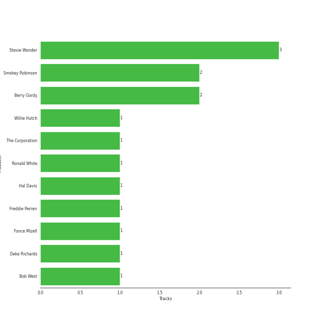

# UNI

11 songs

[See Track Features](audio_features.md)

[See Clusters](clusters/overview.md)

Appears as:
- UNI/MOTOWN (11 tracks)

## Top Artists

| Art | Rank | Tracks | 💚 | Artist | 🔗 |
|:---|---:|---:|---:|:---|:---|
|  | 146 | 3 | 3 | Stevie Wonder | [🔗](https://open.spotify.com/artist/7guDJrEfX3qb6FEbdPA5qi) |
|  | 172 | 4 | 1 | The Jackson 5 | [🔗](https://open.spotify.com/artist/2iE18Oxc8YSumAU232n4rW) |
|  | 400 | 2 | 1 | The Temptations | [🔗](https://open.spotify.com/artist/3RwQ26hR2tJtA8F9p2n7jG) |
|  | 400 | 1 | 1 | Mary Wells | [🔗](https://open.spotify.com/artist/1cjZk1xXn3YCToNg3uJpA7) |
|  | 400 | 1 | 0 | Tammi Terrell | [🔗](https://open.spotify.com/artist/75jNCko3SnEMI5gwGqrbb8) |
|  | 290 | 1 | 0 | Marvin Gaye | [🔗](https://open.spotify.com/artist/3koiLjNrgRTNbOwViDipeA) |

## Top Albums

| Art | Rank | Tracks | 💚 | Album | Release Date | 🔗 |
|:---|---:|---:|---:|:---|:---|:---|
|  | 581 | 1 | 1 | The Temptations Sing Smokey | 1965-03-22 | [🔗](https://open.spotify.com/album/45tweuKI0zdh8zgKo05cTw) |
|  | 581 | 1 | 1 | The Definitive Collection | 2002-10-29 | [🔗](https://open.spotify.com/album/4E1itnJOhTMRSATNaxh0Sq) |
|  | 581 | 1 | 1 | Songs In The Key Of Life | 1976-09-28 | [🔗](https://open.spotify.com/album/6YUCc2RiXcEKS9ibuZxjt0) |
|  | 581 | 1 | 1 | Signed, Sealed And Delivered | 1970-08-07 | [🔗](https://open.spotify.com/album/54ootLtDyMZFr9obtWQvvO) |
|  | 581 | 1 | 1 | Mary Wells Sings My Guy | 1964 | [🔗](https://open.spotify.com/album/6pUoPt9A6P1G8YJ5vw6GBP) |
|  | 581 | 1 | 1 | Diana Ross Presents The Jackson 5 | 1969-12-18 | [🔗](https://open.spotify.com/album/51uoKRa8vT5SULrlF8s2t1) |
|  | 581 | 1 | 0 | United | 1967-08-29 | [🔗](https://open.spotify.com/album/5LqviduT0g0J0ypFrFSwCE) |
|  | 581 | 1 | 0 | Third Album | 1970-09-08 | [🔗](https://open.spotify.com/album/5d6X8oegJmu9XKn9UBAswG) |
|  | 581 | 1 | 0 | Jackson Five Christmas Album | 1970-01-01 | [🔗](https://open.spotify.com/album/6J7kk80VywP59lPn8E5Cal) |
|  | 581 | 1 | 0 | Christmas Album | 1970-10-15 | [🔗](https://open.spotify.com/album/5M8U1qYKvRQHJJVHmPY7QD) |

See all 11 albums

| Art | Rank | Tracks | 💚 | Album | Release Date | 🔗 |
|:---|---:|---:|---:|:---|:---|:---|
|  | 581 | 1 | 0 | 20th Century Masters: The Millennium Collection: Best Of The Temptations, Vol. 2 - The '70s, '80s, '90s | 2000-01-11 | [🔗](https://open.spotify.com/album/2kzUxFepw1uLjbgqV537eP) |

## Genres

| Tracks | 💚 | Genre |
|---:|---:|:---|
| 11 | 6 | [soul](../../genres/soul/overview.md) |
| 11 | 6 | motown |
| 4 | 2 | classic soul |
| 2 | 1 | memphis soul |
| 2 | 1 | disco |
| 1 | 1 | southern soul |
| 1 | 0 | quiet storm |
| 1 | 0 | northern soul |
| 1 | 0 | neo soul |

## Top Producers

| Art | Producer | Tracks | Credit Types |
|:---|:---|---:|:---|
|  | Stevie Wonder | 3 | Lyricist, Songwriter |
| | Berry Gordy | 2 | Songwriter |
| | Smokey Robinson | 2 | Lyricist, Songwriter |
| | The Corporation | 1 | Producer |
| | Bob West | 1 | Songwriter |
| | Deke Richards | 1 | Songwriter |
| | Willie Hutch | 1 | Songwriter |
| | Ronald White | 1 | Songwriter |
| | Hal Davis | 1 | Songwriter |
| | Freddie Perren | 1 | Songwriter |

View all

| Art | Producer | Tracks | Credit Types |
|:---|:---|---:|:---|
| | Fonce Mizell | 1 | Songwriter |

## Tracks released under UNI

| Art | Track | Album | Artists | Label | Rank | 💚 | 🔗 |
|:---|:---|:---|:---|:---|---:|:---|:---|
|  | My Guy | Mary Wells Sings My Guy | Mary Wells | [MOTOWN](../motown), [UNI](.) | 868 | 💚 | [🔗](https://open.spotify.com/track/4591VqUIXysNlmI5NcAIUd) |
|  | My Girl | The Temptations Sing Smokey | The Temptations | [MOTOWN](../motown), [UNI](.) | 868 | 💚 | [🔗](https://open.spotify.com/track/745H5CctFr12Mo7cqa1BMH) |
|  | Ain't No Mountain High Enough | United | Marvin Gaye, Tammi Terrell | [MOTOWN](../motown), [UNI](.) | 868 | | [🔗](https://open.spotify.com/track/7tqhbajSfrz2F7E1Z75ASX) |
|  | I Want You Back | Diana Ross Presents The Jackson 5 | The Jackson 5 | [MOTOWN](../motown), [UNI](.) | 868 | 💚 | [🔗](https://open.spotify.com/track/5LxvwujISqiB8vpRYv887S) |
|  | Santa Claus Is Coming To Town | Jackson Five Christmas Album | The Jackson 5 | [MOTOWN](../motown), [UNI](.) | 868 | | [🔗](https://open.spotify.com/track/4rMWDm28mERZcRPc1f3yir) |
|  | Signed, Sealed, Delivered (I'm Yours) | Signed, Sealed And Delivered | Stevie Wonder | [MOTOWN](../motown), [UNI](.) | 868 | 💚 | [🔗](https://open.spotify.com/track/2eF8pWbiivYsYRpbntYsnc) |
|  | I'll Be There | Third Album | The Jackson 5 | [MOTOWN](../motown), [UNI](.) | 868 | | [🔗](https://open.spotify.com/track/5RdhBLmB4DyFHLglRrfx63) |
|  | I Saw Mommy Kissing Santa Claus | Christmas Album | The Jackson 5 | [MOTOWN](../motown), [UNI](.) | 868 | | [🔗](https://open.spotify.com/track/15sxLiiChE5dCW3Y756oas) |
|  | Isn't She Lovely | Songs In The Key Of Life | Stevie Wonder | [MOTOWN](../motown), [UNI](.) | 868 | 💚 | [🔗](https://open.spotify.com/track/6RANU8AS5ICU5PEHh8BYtH) |
|  | Papa Was A Rollin' Stone - Single Version | 20th Century Masters: The Millennium Collection: Best Of The Temptations, Vol. 2 - The '70s, '80s, '90s | The Temptations | [MOTOWN](../motown), [UNI](.) | 868 | | [🔗](https://open.spotify.com/track/7MiLmLbwNoyf47xQ4TCVYp) |

See all tracks

| Art | Track | Album | Artists | Label | Rank | 💚 | 🔗 |
|:---|:---|:---|:---|:---|---:|:---|:---|
|  | Superstition - Single Version | The Definitive Collection | Stevie Wonder | [MOTOWN](../motown), [UNI](.) | 868 | 💚 | [🔗](https://open.spotify.com/track/1h2xVEoJORqrg71HocgqXd) |

