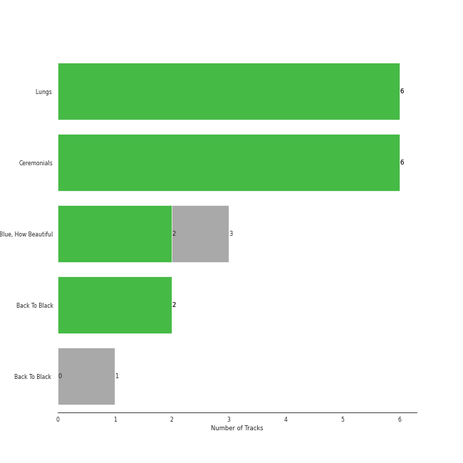
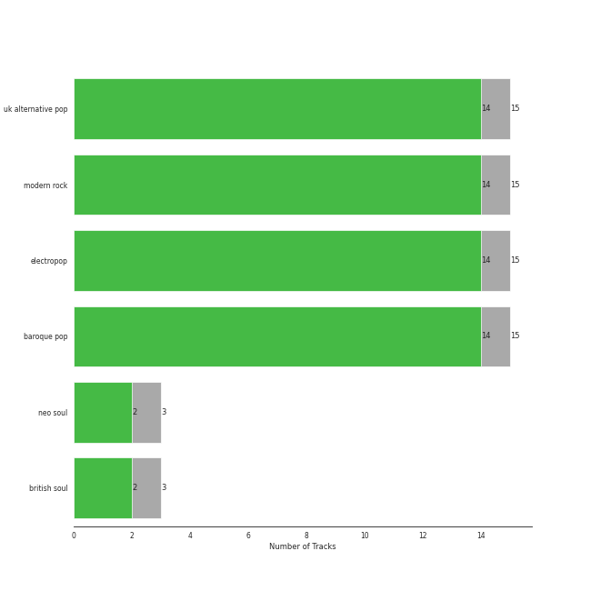
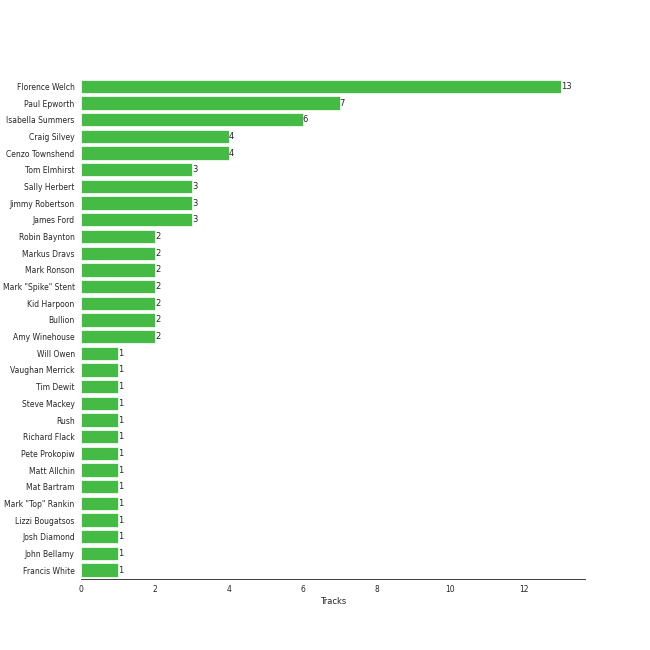

# Universal-Island Records Ltd.

18 songs

[See Track Features](audio_features.md)

[See Clusters](clusters/overview.md)

Appears as:
- Universal-Island Records Ltd. (18 tracks)

## Top Artists

| Art | Tracks | 💚 | Artist | 🔗 |
|:---|---:|---:|:---|:---|
|  | 15 | 14 | [Florence + The Machine](../../artists/florence_+_the_machine/overview.md) | [🔗](https://open.spotify.com/artist/1moxjboGR7GNWYIMWsRjgG) |
|  | 3 | 2 | Amy Winehouse | [🔗](https://open.spotify.com/artist/6Q192DXotxtaysaqNPy5yR) |

## Top Albums

| Art | Tracks | 💚 | Album | Release Date | 🔗 |
|:---|---:|---:|:---|:---|:---|
|  | 6 | 6 | Lungs (Deluxe Edition) | 2009 | [🔗](https://open.spotify.com/album/2FgknX5e7fJlriQtxvpLhZ) |
|  | 6 | 6 | Ceremonials (Deluxe Edition) | 2011-01-01 | [🔗](https://open.spotify.com/album/5SxudoALxEAVh9l83kSebx) |
|  | 3 | 2 | How Big, How Blue, How Beautiful | 2015-06-01 | [🔗](https://open.spotify.com/album/2btszoya78vyT8fwelmVnz) |
|  | 2 | 2 | Back To Black | 2006-10-27 | [🔗](https://open.spotify.com/album/097eYvf9NKjFnv4xA9s2oV) |
|  | 1 | 0 | Back To Black (Deluxe Edition) | 2006 | [🔗](https://open.spotify.com/album/0E4xv5gPjykrwBgBZzI8XG) |

## Genres

| Tracks | 💚 | Genre |
|---:|---:|:---|
| 15 | 14 | [uk alternative pop](../../genres/uk_alternative_pop/overview.md) |
| 15 | 14 | [neo mellow](../../genres/neo_mellow/overview.md) |
| 15 | 14 | [modern rock](../../genres/modern_rock/overview.md) |
| 15 | 14 | baroque pop |
| 3 | 2 | neo soul |
| 3 | 2 | british soul |

## Top Producers

| Art | Producer | Tracks | Credit Types |
|:---|:---|---:|:---|
| | [Florence Welch](../../producers/florence_welch/overview.md) | 12 | Lyricist, Songwriter |
| | [Paul Epworth](../../producers/paul_epworth/overview.md) | 7 | Producer, Lyricist, Songwriter |
| | Isabella Summers | 6 | Songwriter, Producer, Lyricist |
| | Craig Silvey | 4 | Producer |
| | Cenzo Townshend | 4 | Producer |
| | Tom Elmhirst | 3 | Producer |
| | Sally Herbert | 3 | Arranger |
| | James Ford | 3 | Producer |
| | Jimmy Robertson | 3 | Producer |
| | Bullion | 2 | Producer |

View all

| Art | Producer | Tracks | Credit Types |
|:---|:---|---:|:---|
| | Markus Dravs | 2 | Producer |
|  | Mark Ronson | 2 | Arranger, Producer, Songwriter |
| | [Mark "Spike" Stent](../../producers/mark__spike__stent/overview.md) | 2 | Producer |
| | [Kid Harpoon](../../producers/kid_harpoon/overview.md) | 2 | Songwriter |
|  | Amy Winehouse | 2 | Lyricist, Songwriter |
| | Robin Baynton | 2 | Producer |
| | Mat Bartram | 1 | Producer |
| | Ali Helnwein | 1 | Arranger |
| | Vaughan Merrick | 1 | Producer |
| | Francis White | 1 | Lyricist, Songwriter |
| | Brian Degraw | 1 | Songwriter |
| | Will Owen | 1 | Arranger |
| | Charlie Hugall | 1 | Producer |
| | Rush | 1 | Songwriter |
| | Lizzi Bougatsos | 1 | Songwriter |
| | John Bellamy | 1 | Songwriter |
| | Tim Dewit | 1 | Songwriter |
| | Bosco Mann | 1 | Arranger |
| | Mark "Top" Rankin | 1 | Producer |
| | Chris Elliott | 1 | Arranger |
| | Anthony B. Stephens | 1 | Songwriter |
| | Pete Prokopiw | 1 | Producer |
| | Arnecia Michelle Harris | 1 | Songwriter |
| | Josh Diamond | 1 | Songwriter |

## Tracks released under Universal-Island Records Ltd.

| Art | Track | Album | Artists | Label | Rank | 💚 | 🔗 |
|:---|:---|:---|:---|:---|---:|:---|:---|
|  | Never Let Me Go | Ceremonials (Deluxe Edition) | [Florence + The Machine](../../artists/florence_+_the_machine/overview.md) | [Universal-Island Records Ltd.](.) | 209 | 💚 | [🔗](https://open.spotify.com/track/6cC9RY7MoUx5z3aHjDTNI6) |
|  | What The Water Gave Me | Ceremonials (Deluxe Edition) | [Florence + The Machine](../../artists/florence_+_the_machine/overview.md) | [Universal-Island Records Ltd.](.) | 550 | 💚 | [🔗](https://open.spotify.com/track/3RiOPzAvhNKuMIdPYOrKV8) |
|  | Seven Devils | Ceremonials (Deluxe Edition) | [Florence + The Machine](../../artists/florence_+_the_machine/overview.md) | [Universal-Island Records Ltd.](.) | 781 | 💚 | [🔗](https://open.spotify.com/track/5qaLfqAUiqvsoL0l4T05Yx) |
|  | Back To Black | Back To Black | Amy Winehouse | [Universal-Island Records Ltd.](.) | 795 | 💚 | [🔗](https://open.spotify.com/track/30FURVTCpbKyykjSEQzGkH) |
|  | Valerie - Live At BBC Radio 1 Live Lounge, London / 2007 | Back To Black (Deluxe Edition) | Amy Winehouse | [Universal-Island Records Ltd.](.) | 864 | | [🔗](https://open.spotify.com/track/6nLvaCZFR1wEzW3sIKpsnr) |
|  | Rehab | Back To Black | Amy Winehouse | [Universal-Island Records Ltd.](.) | 864 | 💚 | [🔗](https://open.spotify.com/track/1L5tZi0izXsi5Kk5OJf4W0) |
|  | Between Two Lungs | Lungs (Deluxe Edition) | [Florence + The Machine](../../artists/florence_+_the_machine/overview.md) | [Universal-Island Records Ltd.](.) | 864 | 💚 | [🔗](https://open.spotify.com/track/5WnYyCWBbJyLChmd2sbZK9) |
|  | Dog Days Are Over | Lungs (Deluxe Edition) | [Florence + The Machine](../../artists/florence_+_the_machine/overview.md) | [Universal-Island Records Ltd.](.) | 864 | 💚 | [🔗](https://open.spotify.com/track/1YLJVmuzeM2YSUkCCaTNUB) |
|  | I'm Not Calling You A Liar | Lungs (Deluxe Edition) | [Florence + The Machine](../../artists/florence_+_the_machine/overview.md) | [Universal-Island Records Ltd.](.) | 864 | 💚 | [🔗](https://open.spotify.com/track/3euILOYDltKArnqpupsE1W) |
|  | Kiss With A Fist | Lungs (Deluxe Edition) | [Florence + The Machine](../../artists/florence_+_the_machine/overview.md) | [Universal-Island Records Ltd.](.) | 864 | 💚 | [🔗](https://open.spotify.com/track/0jv5OcbvTUHgO8FgHhya8b) |

See all tracks

| Art | Track | Album | Artists | Label | Rank | 💚 | 🔗 |
|:---|:---|:---|:---|:---|---:|:---|:---|
|  | Rabbit Heart (Raise It Up) | Lungs (Deluxe Edition) | [Florence + The Machine](../../artists/florence_+_the_machine/overview.md) | [Universal-Island Records Ltd.](.) | 864 | 💚 | [🔗](https://open.spotify.com/track/5RoLLyMmaEG4WiVMlp7r59) |
|  | You've Got The Love | Lungs (Deluxe Edition) | [Florence + The Machine](../../artists/florence_+_the_machine/overview.md) | [Universal-Island Records Ltd.](.) | 864 | 💚 | [🔗](https://open.spotify.com/track/6u9RqxALwkjJ1ukB1y8vuP) |
|  | Lover To Lover | Ceremonials (Deluxe Edition) | [Florence + The Machine](../../artists/florence_+_the_machine/overview.md) | [Universal-Island Records Ltd.](.) | 864 | 💚 | [🔗](https://open.spotify.com/track/1LsZVVQxkbmL9izqfy1RRK) |
|  | No Light, No Light | Ceremonials (Deluxe Edition) | [Florence + The Machine](../../artists/florence_+_the_machine/overview.md) | [Universal-Island Records Ltd.](.) | 864 | 💚 | [🔗](https://open.spotify.com/track/5nkYDYUSb1bvLJ4nP8CnQ1) |
|  | Shake It Out | Ceremonials (Deluxe Edition) | [Florence + The Machine](../../artists/florence_+_the_machine/overview.md) | [Universal-Island Records Ltd.](.) | 864 | 💚 | [🔗](https://open.spotify.com/track/4lY95OMGb9WxP6IYut64ir) |
|  | Delilah | How Big, How Blue, How Beautiful | [Florence + The Machine](../../artists/florence_+_the_machine/overview.md) | [Universal-Island Records Ltd.](.) | 864 | 💚 | [🔗](https://open.spotify.com/track/3o9qzsqkT0mvfxcusUaXsN) |
|  | How Big, How Blue, How Beautiful | How Big, How Blue, How Beautiful | [Florence + The Machine](../../artists/florence_+_the_machine/overview.md) | [Universal-Island Records Ltd.](.) | 864 | 💚 | [🔗](https://open.spotify.com/track/7GlwvJ8iAbCEfZjGq3iwmZ) |
|  | What Kind Of Man | How Big, How Blue, How Beautiful | [Florence + The Machine](../../artists/florence_+_the_machine/overview.md) | [Universal-Island Records Ltd.](.) | 864 | | [🔗](https://open.spotify.com/track/2ZE1EiHnmtdiv9KAJTGeRq) |

