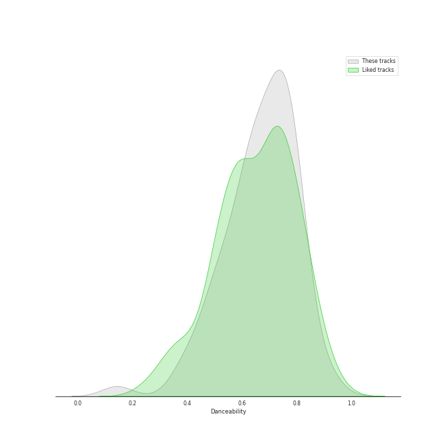
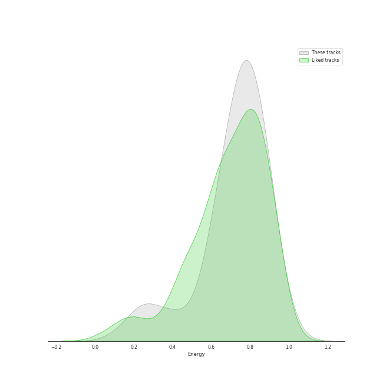
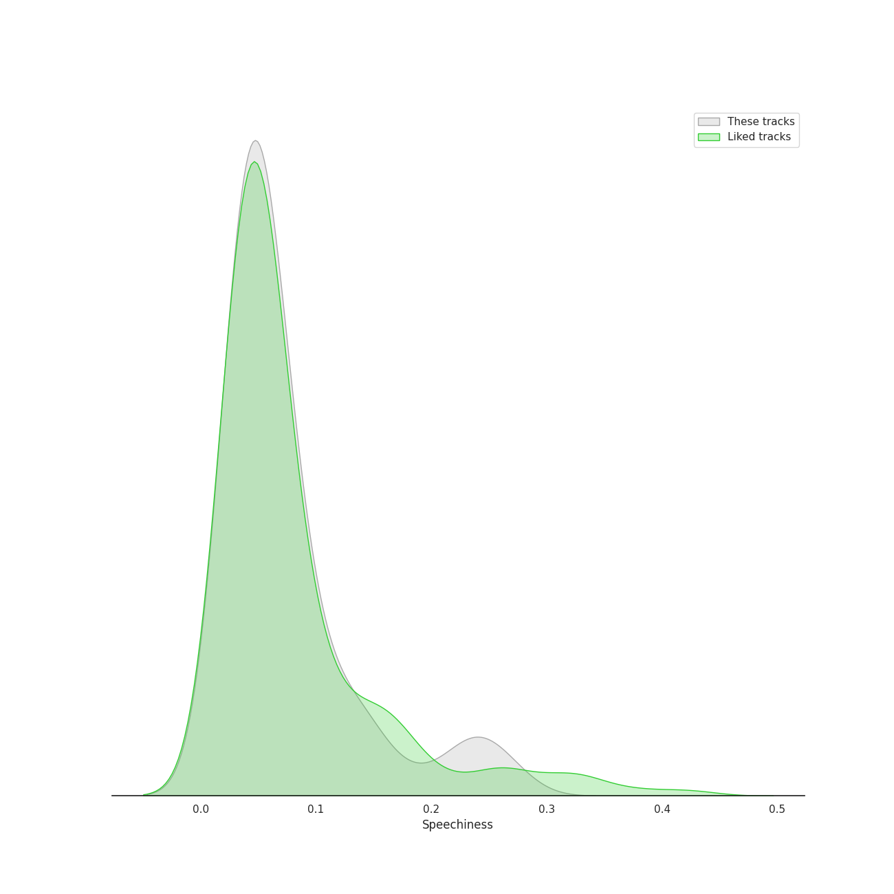
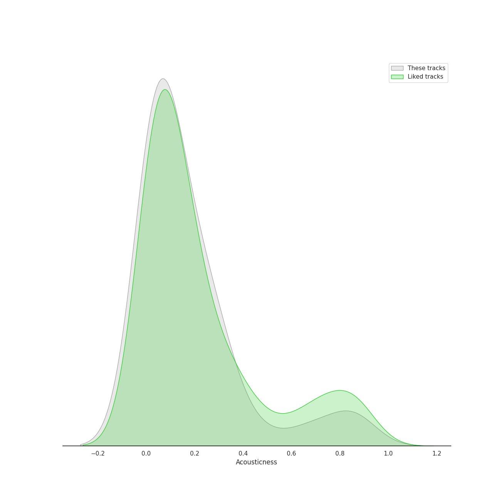
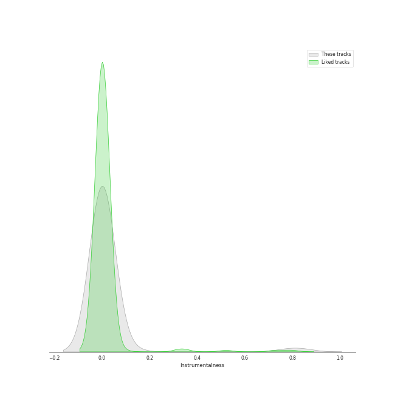
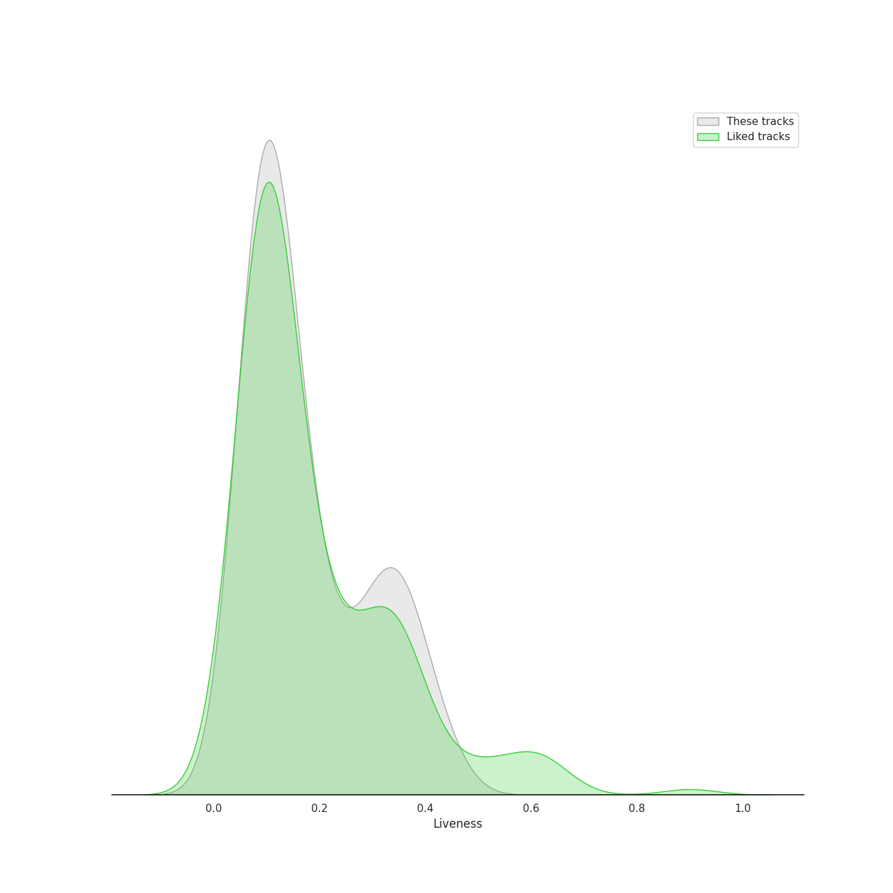
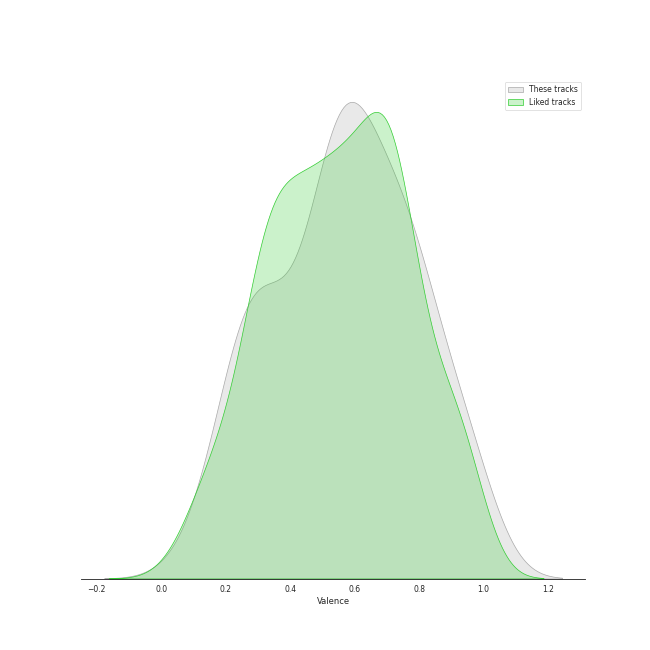
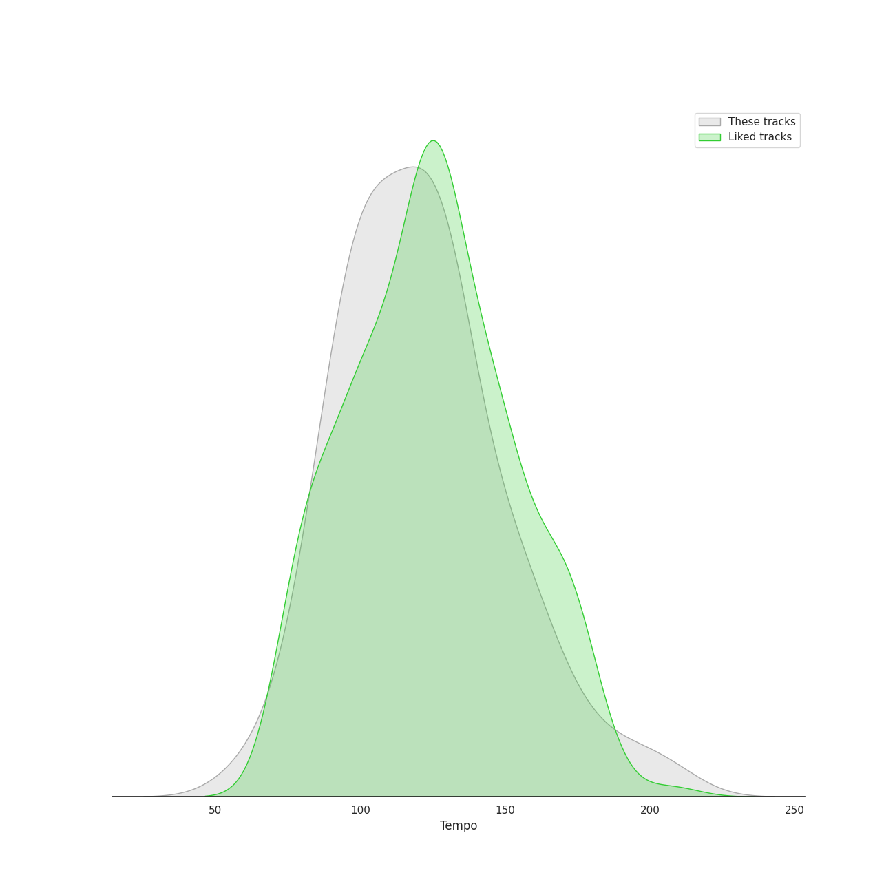

# Audio Features for Universal Music LLC

## Danceability

| ​ | 10 most Danceable tracks | ​​ | 10 least Danceable tracks |
|:---|:---|:---|:---|
|  | Weather (0.915) |  | HWAA (0.384) |
|  | Is this bad b****** number? (0.901) |  | Boy in time - HUI Solo (0.385) |
|  | POPPY - Japanese Ver. (0.819) |  | Love Won't Let You Get Away (0.465) |
|  | Luv U (0.818) |  | Odi Et Amo (0.472) |
|  | Always (0.804) |  | HANN (Alone in winter) (0.474) |
|  | Dreamer (0.802) |  | Love Me Like You Do (0.489) |
|  | LATATA - English Ver. (0.801) |  | Last Christmas (0.504) |
|  | BEAM BEAM (0.799) |  | D (Half Moon) (0.512) |
|  | Oh my god - English Version (0.794) |  | NUMB (0.518) |
|  | Oh my god (0.794) |  | Santa Tell Me (0.525) |

## Energy

| ​ | 10 most Energetic tracks | ​​ | 10 least Energetic tracks |
|:---|:---|:---|:---|
|  | チョコレイト・ディスコ (0.99) |  | Dreamer (0.223) |
|  | だいじょばない (0.982) |  | Odi Et Amo (0.225) |
|  | DUMDi DUMDi (0.914) |  | Boy in time - HUI Solo (0.255) |
|  | HELICOPTER (0.908) |  | My Everything (0.265) |
|  | DO or NOT (0.905) |  | Love Won't Let You Get Away (0.313) |
|  | HELICOPTER - English Version (0.89) |  | Meant (0.396) |
|  | Devil (0.888) |  | HANN (Alone in winter) (0.429) |
|  | 脳裏上のクラッカー (0.886) |  | One Last Time (0.593) |
|  | Focus (0.876) |  | Love Me Like You Do (0.597) |
|  | BEAM BEAM (0.875) |  | Dangerous Woman (0.602) |

## Speechiness

| ​ | 10 most Speechy tracks | ​​ | 10 least Speechy tracks |
|:---|:---|:---|:---|
|  | Outsider (0.269) |  | Meant (0.0267) |
|  | Is this bad b****** number? (0.254) |  | Odi Et Amo (0.0275) |
|  | Focus (0.239) |  | Love Me Like You Do (0.0292) |
|  | LATATA - English Ver. (0.231) |  | My Everything (0.0297) |
|  | Side To Side (0.229) |  | One Last Time (0.0323) |
|  | Psycho (0.19) |  | Baby I (0.0326) |
|  | Problem (0.153) |  | LION (0.034) |
|  | BEAM BEAM (0.144) |  | Boy in time - HUI Solo (0.0345) |
|  | Santa Baby (0.137) |  | HANN (Alone in winter) (0.0349) |
|  | D (Half Moon) (0.136) |  | チョコレイト・ディスコ (0.0351) |

## Acousticness

| ​ | 10 most Acoustic tracks | ​​ | 10 least Acoustic tracks |
|:---|:---|:---|:---|
|  | My Everything (0.88) |  | Break Free (0.0064) |
|  | Boy in time - HUI Solo (0.876) |  | Luv U (0.00716) |
|  | Love Won't Let You Get Away (0.824) |  | Nightflyers (0.00834) |
|  | HANN (Alone in winter) (0.814) |  | DO or NOT (0.0122) |
|  | Odi Et Amo (0.684) |  | KISS (0.0131) |
|  | Dreamer (0.664) |  | LATATA - English Ver. (0.015) |
|  | さよならひとり (0.49) |  | Baby I (0.0154) |
|  | Psycho (0.314) |  | Into You (0.0162) |
|  | POPPY - Japanese Ver. (0.314) |  | Problem (0.0192) |
|  | LOST (0.309) |  | DUMDi DUMDi (0.025) |

## Instrumentalness

| ​ | 10 most Instrumental tracks | ​​ | 10 least Instrumental tracks |
|:---|:---|:---|:---|
|  | だいじょばない (0.844) |  | Love Me Like You Do (0.0) |
|  | Meant (0.124) |  | Santa Tell Me (0.0) |
|  | チョコレイト・ディスコ (0.0079) |  | Daisy (0.0) |
|  | Luv U (0.000423) |  | Greedy (0.0) |
|  | Oh my god - English Version (0.000351) |  | Uh-Oh (0.0) |
|  | Nightflyers (0.00026) |  | Last Dance (0.0) |
|  | Psycho (4.6e-05) |  | Focus (0.0) |
|  | Break Free (4.35e-05) |  | NUMB (0.0) |
|  | 死ぬのがいいわ (4.07e-05) |  | Bonnie & Clyde (0.0) |
|  | KISS (2.01e-05) |  | Odi Et Amo (0.0) |

## Liveness

| ​ | 10 most Live tracks | ​​ | 10 least Live tracks |
|:---|:---|:---|:---|
|  | Focus (0.444) |  | Is this bad b****** number? (0.0486) |
|  | HELICOPTER - English Version (0.425) |  | チョコレイト・ディスコ (0.0519) |
|  | Bang Bang (0.396) |  | D (Half Moon) (0.0573) |
|  | 脳裏上のクラッカー (0.384) |  | i'M THE TREND (0.058) |
|  | HELICOPTER (0.383) |  | Outsider (0.0611) |
|  | Dangerous Woman (0.356) |  | Look At Me (0.0623) |
|  | Baby I (0.354) |  | Luv U (0.0662) |
|  | Honeymoon Avenue (0.348) |  | DUMDi DUMDi (0.076) |
|  | BEAM BEAM (0.348) |  | Quit (0.0781) |
|  | Meant (0.321) |  | Devil (0.0783) |

## Valence

| ​ | 10 most Happy tracks | ​​ | 10 least Happy tracks |
|:---|:---|:---|:---|
|  | チョコレイト・ディスコ (0.963) |  | One Last Time (0.104) |
|  | Weather (0.96) |  | LION (0.187) |
|  | Devil (0.946) |  | NUMB (0.188) |
|  | Habit (0.912) |  | HWAA (0.233) |
|  | だいじょばない (0.868) |  | HWAA - English Version (0.235) |
|  | Greedy (0.844) |  | Odi Et Amo (0.244) |
|  | Bonnie & Clyde (0.806) |  | Dreamer (0.252) |
|  | Focus (0.8) |  | Nightflyers (0.264) |
|  | Look At Me (0.798) |  | Break Free (0.284) |
|  | BEAM BEAM (0.795) |  | Meant (0.287) |

## Tempo

| ​ | 10 most Fast tracks | ​​ | 10 least Fast tracks |
|:---|:---|:---|:---|
|  | Last Christmas (205.945) |  | My Everything (61.975) |
|  | Santa Tell Me (191.9) |  | Quit (75.04) |
|  | HANN (Alone in winter) (179.855) |  | Odi Et Amo (81.196) |
|  | D (Half Moon) (169.709) |  | Psycho (82.954) |
|  | NUMB (165.936) |  | Daisy (85.016) |
|  | Side To Side (159.173) |  | Is this bad b****** number? (90.958) |
|  | 死ぬのがいいわ (158.075) |  | Uh-Oh (92.037) |
|  | HELICOPTER (155.048) |  | さよならひとり (92.038) |
|  | HELICOPTER - English Version (155.035) |  | Outsider (94.956) |
|  | Bang Bang (149.974) |  | Cherry On Top (94.973) |
