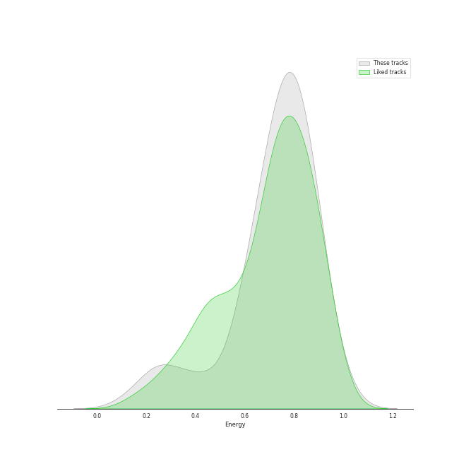
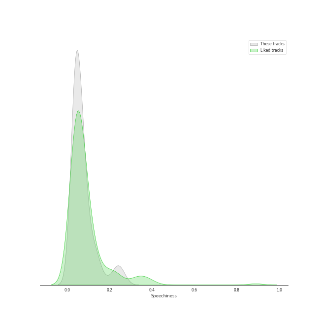
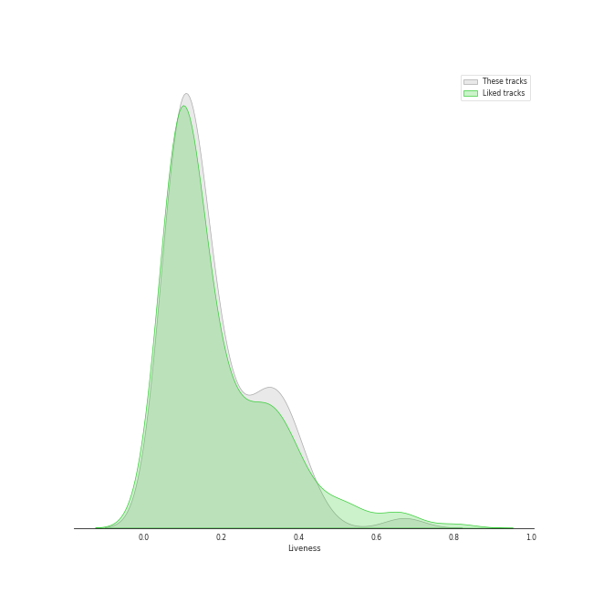
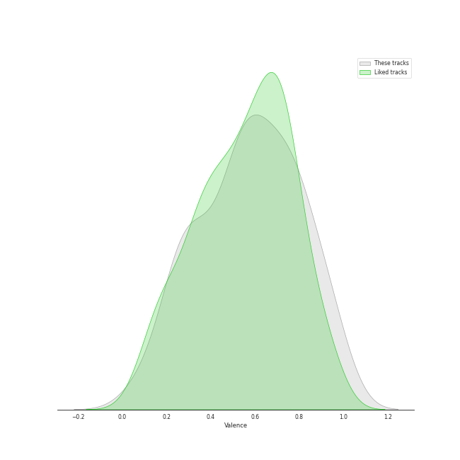
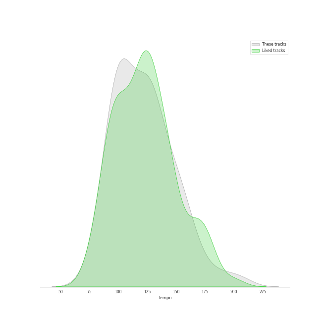

# Audio Features for Universal Music LLC

## Danceability

| 10 most Danceable tracks | 10 least Danceable tracks |
|:---|:---|
| Weather (0.915) | HWAA (0.384) |
| Is this bad b****** number? (0.901) | Boy in time - HUI Solo (0.385) |
| POPPY - Japanese Ver. (0.819) | Love Won't Let You Get Away (0.465) |
| Luv U (0.818) | Odi Et Amo (0.472) |
| Always (0.804) | HANN (Alone in winter) (0.474) |
| Dreamer (0.802) | Love Me Like You Do (0.489) |
| LATATA - English Ver. (0.801) | Last Christmas (0.504) |
| BEAM BEAM (0.799) | D (Half Moon) (0.512) |
| Oh my god - English Version (0.794) | NUMB (0.518) |
| Oh my god (0.794) | Santa Tell Me (0.525) |

## Energy

| 10 most Energetic tracks | 10 least Energetic tracks |
|:---|:---|
| チョコレイト・ディスコ (0.99) | Dreamer (0.223) |
| だいじょばない (0.982) | Odi Et Amo (0.225) |
| DUMDi DUMDi (0.914) | Boy in time - HUI Solo (0.255) |
| HELICOPTER (0.908) | My Everything (0.265) |
| DO or NOT (0.905) | Love Won't Let You Get Away (0.313) |
| HELICOPTER - English Version (0.89) | Meant (0.396) |
| Devil (0.888) | HANN (Alone in winter) (0.429) |
| 脳裏上のクラッカー (0.886) | One Last Time (0.593) |
| Focus (0.876) | Love Me Like You Do (0.597) |
| BEAM BEAM (0.875) | Dangerous Woman (0.602) |

## Speechiness

| 10 most Speechy tracks | 10 least Speechy tracks |
|:---|:---|
| Outsider (0.269) | Meant (0.0267) |
| Is this bad b****** number? (0.254) | Odi Et Amo (0.0275) |
| Focus (0.239) | Love Me Like You Do (0.0292) |
| LATATA - English Ver. (0.231) | My Everything (0.0297) |
| Side To Side (0.229) | One Last Time (0.0323) |
| Psycho (0.19) | Baby I (0.0326) |
| Problem (0.153) | LION (0.034) |
| BEAM BEAM (0.144) | Boy in time - HUI Solo (0.0345) |
| Santa Baby (0.137) | HANN (Alone in winter) (0.0349) |
| D (Half Moon) (0.136) | チョコレイト・ディスコ (0.0351) |

## Acousticness

| 10 most Acoustic tracks | 10 least Acoustic tracks |
|:---|:---|
| My Everything (0.88) | Break Free (0.0064) |
| Boy in time - HUI Solo (0.876) | Luv U (0.00716) |
| Love Won't Let You Get Away (0.824) | Nightflyers (0.00834) |
| HANN (Alone in winter) (0.814) | DO or NOT (0.0122) |
| Odi Et Amo (0.684) | KISS (0.0131) |
| Dreamer (0.664) | LATATA - English Ver. (0.015) |
| さよならひとり (0.49) | Baby I (0.0154) |
| Psycho (0.314) | Into You (0.0162) |
| POPPY - Japanese Ver. (0.314) | Problem (0.0192) |
| LOST (0.309) | DUMDi DUMDi (0.025) |

## Instrumentalness

| 10 most Instrumental tracks | 10 least Instrumental tracks |
|:---|:---|
| だいじょばない (0.844) | Love Me Like You Do (0.0) |
| Meant (0.124) | Santa Tell Me (0.0) |
| チョコレイト・ディスコ (0.0079) | Daisy (0.0) |
| Luv U (0.000423) | Greedy (0.0) |
| Oh my god - English Version (0.000351) | Uh-Oh (0.0) |
| Nightflyers (0.00026) | Last Dance (0.0) |
| Psycho (4.6e-05) | Focus (0.0) |
| Break Free (4.35e-05) | NUMB (0.0) |
| 死ぬのがいいわ (4.07e-05) | Bonnie & Clyde (0.0) |
| KISS (2.01e-05) | Odi Et Amo (0.0) |

## Liveness

| 10 most Live tracks | 10 least Live tracks |
|:---|:---|
| Focus (0.444) | Is this bad b****** number? (0.0486) |
| HELICOPTER - English Version (0.425) | チョコレイト・ディスコ (0.0519) |
| Bang Bang (0.396) | D (Half Moon) (0.0573) |
| 脳裏上のクラッカー (0.384) | i'M THE TREND (0.058) |
| HELICOPTER (0.383) | Outsider (0.0611) |
| Dangerous Woman (0.356) | Look At Me (0.0623) |
| Baby I (0.354) | Luv U (0.0662) |
| Honeymoon Avenue (0.348) | DUMDi DUMDi (0.076) |
| BEAM BEAM (0.348) | Quit (0.0781) |
| Meant (0.321) | Devil (0.0783) |

## Valence

| 10 most Happy tracks | 10 least Happy tracks |
|:---|:---|
| チョコレイト・ディスコ (0.963) | One Last Time (0.104) |
| Weather (0.96) | LION (0.187) |
| Devil (0.946) | NUMB (0.188) |
| Habit (0.912) | HWAA (0.233) |
| だいじょばない (0.868) | HWAA - English Version (0.235) |
| Greedy (0.844) | Odi Et Amo (0.244) |
| Bonnie & Clyde (0.806) | Dreamer (0.252) |
| Focus (0.8) | Nightflyers (0.264) |
| Look At Me (0.798) | Break Free (0.284) |
| BEAM BEAM (0.795) | Meant (0.287) |

## Tempo

| 10 most Fast tracks | 10 least Fast tracks |
|:---|:---|
| Last Christmas (205.945) | My Everything (61.975) |
| Santa Tell Me (191.9) | Quit (75.04) |
| HANN (Alone in winter) (179.855) | Odi Et Amo (81.196) |
| D (Half Moon) (169.709) | Psycho (82.954) |
| NUMB (165.936) | Daisy (85.016) |
| Side To Side (159.173) | Is this bad b****** number? (90.958) |
| 死ぬのがいいわ (158.075) | Uh-Oh (92.037) |
| HELICOPTER (155.048) | さよならひとり (92.038) |
| HELICOPTER - English Version (155.035) | Outsider (94.956) |
| Bang Bang (149.974) | Cherry On Top (94.973) |
