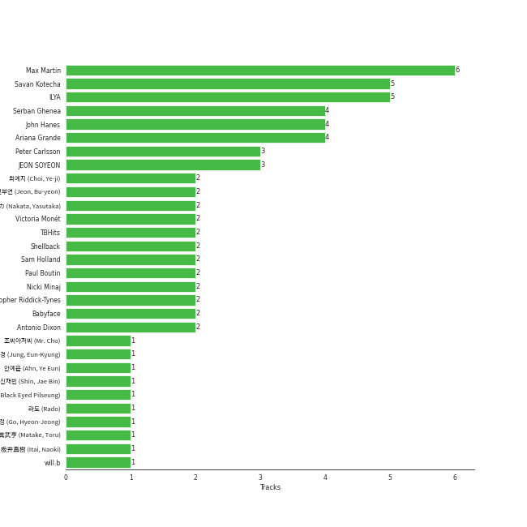

# Universal Music LLC

79 songs

[See Track Features](audio_features.md)

[See Clusters](clusters/overview.md)

Appears as:
- Universal Music LLC (44 tracks)
- Universal Records (21 tracks)
- Universal Music Ltd. (9 tracks)
- Universal/Island Def Jam (2 tracks)
- Fuzzy Door Productions/Universal (1 tracks)
- Republic/Universal/FSF (1 tracks)
- Universal Music (1 tracks)

## Top Artists

| Art | Tracks | 💚 | Artist | 🔗 |
|:---|---:|---:|:---|:---|
|  | 15 | 10 | [Ariana Grande](../../artists/ariana_grande/overview.md) | [🔗](https://open.spotify.com/artist/66CXWjxzNUsdJxJ2JdwvnR) |
|  | 14 | 5 | [(G)I-DLE](../../artists/(g)i-dle/overview.md) | [🔗](https://open.spotify.com/artist/2AfmfGFbe0A0WsTYm0SDTx) |
|  | 5 | 5 | [JEON SOYEON](../../artists/jeon_soyeon/overview.md) | [🔗](https://open.spotify.com/artist/6Xg22wJOAcnvPUfk5WvODH) |
|  | 6 | 4 | [PENTAGON](../../artists/pentagon/overview.md) | [🔗](https://open.spotify.com/artist/1wKpMkucynaTfG8lyPprYV) |
|  | 4 | 3 | Elizaveta | [🔗](https://open.spotify.com/artist/2a9bCkqCkLvXM0s3uPvR7M) |
|  | 3 | 3 | DEAN | [🔗](https://open.spotify.com/artist/3eCd0TZrBPm2n9cDG6yWfF) |
|  | 4 | 2 | YOUHA | [🔗](https://open.spotify.com/artist/2lZFlNiQMLa2fuX3pkXcan) |
|  | 3 | 2 | Fujii Kaze | [🔗](https://open.spotify.com/artist/6bDWAcdtVR3WHz2xtiIPUi) |
|  | 3 | 2 | [CLC](../../artists/clc/overview.md) | [🔗](https://open.spotify.com/artist/6QyO41KctzGc70mVaVnXQO) |
|  | 2 | 2 | [ENHYPEN](../../artists/enhypen/overview.md) | [🔗](https://open.spotify.com/artist/5t5FqBwTcgKTaWmfEbwQY9) |

See all 35 artists

| Art | Tracks | 💚 | Artist | 🔗 |
|:---|---:|---:|:---|:---|
|  | 2 | 2 | Perfume | [🔗](https://open.spotify.com/artist/2XMxWKPKCxoLkSdpCViCnr) |
|  | 2 | 2 | [YUQI](../../artists/yuqi/overview.md) | [🔗](https://open.spotify.com/artist/22aCD8IrQZjcPgZw728QT6) |
|  | 2 | 2 | Nicki Minaj | [🔗](https://open.spotify.com/artist/0hCNtLu0JehylgoiP8L4Gh) |
|  | 2 | 1 | James Brown | [🔗](https://open.spotify.com/artist/7GaxyUddsPok8BuhxN6OUW) |
|  | 2 | 1 | TRI.BE | [🔗](https://open.spotify.com/artist/6BgYuNomEs12UIrnxhWE9a) |
|  | 1 | 1 | Seth MacFarlane | [🔗](https://open.spotify.com/artist/79D4dipwR6scV8AN3dm7gW) |
|  | 1 | 1 | [BIBI](../../artists/bibi/overview.md) | [🔗](https://open.spotify.com/artist/6UbmqUEgjLA6jAcXwbM1Z9) |
|  | 1 | 1 | Iggy Azalea | [🔗](https://open.spotify.com/artist/5yG7ZAZafVaAlMTeBybKAL) |
|  | 1 | 1 | Of Monsters and Men | [🔗](https://open.spotify.com/artist/4dwdTW1Lfiq0cM8nBAqIIz) |
|  | 1 | 1 | ZUTOMAYO | [🔗](https://open.spotify.com/artist/38WbKH6oKAZskBhqDFA8Uj) |
|  | 1 | 1 | Jessie J | [🔗](https://open.spotify.com/artist/2gsggkzM5R49q6jpPvazou) |
|  | 1 | 1 | [Sara Bareilles](../../artists/sara_bareilles/overview.md) | [🔗](https://open.spotify.com/artist/2Sqr0DXoaYABbjBo9HaMkM) |
|  | 1 | 1 | Gaeko | [🔗](https://open.spotify.com/artist/0tkHE1pQ5ZCgQb8WZ0ba79) |
|  | 1 | 1 | Lee Young Ji | [🔗](https://open.spotify.com/artist/0Y2AcMPMpeuPXtPQGVvRBq) |
|  | 1 | 1 | Ellie Goulding | [🔗](https://open.spotify.com/artist/0X2BH1fck6amBIoJhDVmmJ) |
|  | 1 | 1 | [STAYC](../../artists/stayc/overview.md) | [🔗](https://open.spotify.com/artist/01XYiBYaoMJcNhPokrg0l0) |
|  | 1 | 0 | Liz Gillies | [🔗](https://open.spotify.com/artist/7pLntWGInZPQxc4kXxzzjB) |
|  | 1 | 0 | SEKAI NO OWARI | [🔗](https://open.spotify.com/artist/7HwzlRPa9Ad0I8rK0FPzzK) |
|  | 1 | 0 | Kawaguchi Yurina | [🔗](https://open.spotify.com/artist/3snqW31jInsZwoYRZTaixr) |
|  | 1 | 0 | John Williams | [🔗](https://open.spotify.com/artist/3dRfiJ2650SZu6GbydcHNb) |
|  | 1 | 0 | [BTS](../../artists/bts/overview.md) | [🔗](https://open.spotify.com/artist/3Nrfpe0tUJi4K4DXYWgMUX) |
|  | 1 | 0 | James Brown & The Famous Flames | [🔗](https://open.spotify.com/artist/32r72WOqqRO1DtSznId7Lr) |
|  | 1 | 0 | Zedd | [🔗](https://open.spotify.com/artist/2qxJFvFYMEDqd7ui6kSAcq) |
|  | 1 | 0 | BTOB | [🔗](https://open.spotify.com/artist/2hcsKca6hCfFMwwdbFvenJ) |
|  | 1 | 0 | TAEMIN | [🔗](https://open.spotify.com/artist/13rF01aOogvnkuQXOlgTW8) |

## Top Albums

| Art | Tracks | 💚 | Album | Release Date | 🔗 |
|:---|---:|---:|:---|:---|:---|
|  | 5 | 5 | Windy | 2021-07-05 | [🔗](https://open.spotify.com/album/1lv92CIVZbB2BsHmIx7qJf) |
|  | 5 | 4 | My Everything (Deluxe) | 2014-08-22 | [🔗](https://open.spotify.com/album/6EVYTRG1drKdO8OnIQBeEj) |
|  | 5 | 2 | I burn | 2021-01-11 | [🔗](https://open.spotify.com/album/3ma5amx5s3l1NKoWNHaMYe) |
|  | 4 | 3 | Dangerous Woman | 2016-05-20 | [🔗](https://open.spotify.com/album/3pdKKSqqLVIKmRTGw0x2N7) |
|  | 4 | 3 | Beatrix Runs | 2012 | [🔗](https://open.spotify.com/album/7HsPaYQbCYnxosF5WiSlEA) |
|  | 4 | 1 | I trust | 2020-04-06 | [🔗](https://open.spotify.com/album/57sl8AvqVqm4Fadre0z8FQ) |
|  | 3 | 3 | LOVE or TAKE | 2021-03-15 | [🔗](https://open.spotify.com/album/5iu1d69dqEo9UaKpZDYoIV) |
|  | 2 | 2 | Yours Truly | 2013-01-01 | [🔗](https://open.spotify.com/album/5xSvNPstcxHtR4ap2vvN8A) |
|  | 2 | 2 | A Page | 2021-05-13 | [🔗](https://open.spotify.com/album/7jmRVFWYCVgx2OEC1ZQJH8) |
|  | 2 | 2 | 130 Mood : TRBL | 2016-03-25 | [🔗](https://open.spotify.com/album/1MW3txTS49ZGvyLi0fziLU) |

See all 49 albums

| Art | Tracks | 💚 | Album | Release Date | 🔗 |
|:---|---:|---:|:---|:---|:---|
|  | 2 | 1 | Star Time | 1991-01-01 | [🔗](https://open.spotify.com/album/2yuTyv0L51qvYuI5RIktlA) |
|  | 2 | 1 | HELICOPTER | 2020-09-02 | [🔗](https://open.spotify.com/album/1uwfxRAhW1hxclCVkzku8d) |
|  | 2 | 0 | love you more, | 2022-08-25 | [🔗](https://open.spotify.com/album/3g2OiEeQKfggUe6ViYeLSC) |
|  | 2 | 0 | Christmas Kisses | 2013-01-01 | [🔗](https://open.spotify.com/album/5MfeQZrrNfMqcaq03U9qOr) |
|  | 1 | 1 | 潜潜話 | 2019-10-29 | [🔗](https://open.spotify.com/album/4myzXA54fPm89hpW41YkOS) |
|  | 1 | 1 | WE:TH | 2020-10-12 | [🔗](https://open.spotify.com/album/1ASYbBYBwV6Rcfc2ycqmlK) |
|  | 1 | 1 | W.A.Y | 2023-02-14 | [🔗](https://open.spotify.com/album/7iidKsHRHGmJ1tAMz8tvZo) |
|  | 1 | 1 | Uh-Oh | 2019-06-26 | [🔗](https://open.spotify.com/album/3PzrNuMGWGpp8WOfrmpkaU) |
|  | 1 | 1 | POPPY (Japanese Ver.) | 2022-11-16 | [🔗](https://open.spotify.com/album/2nei1QXcpDotdoMz3IQxr4) |
|  | 1 | 1 | One and Only | 2023-07-11 | [🔗](https://open.spotify.com/album/5LGe47qZJTNwtM8gUfT7Mx) |
|  | 1 | 1 | My Head Is An Animal | 2012-01-01 | [🔗](https://open.spotify.com/album/4p9dVvZDaZliSjTCbFRhJy) |
|  | 1 | 1 | Music Is Better Than Words | 2011-01-01 | [🔗](https://open.spotify.com/album/6VojJdbXviFkMuemAQ2Ivo) |
|  | 1 | 1 | LEVEL3 | 2013-10-16 | [🔗](https://open.spotify.com/album/2DdXcewGp8Akqutak3yLDg) |
|  | 1 | 1 | Kirari Remixes (Asia Edition) | 2022-01-14 | [🔗](https://open.spotify.com/album/2OXwORzPU4tm1Skiv6l9KT) |
|  | 1 | 1 | HELP EVER HURT NEVER | 2020-05-20 | [🔗](https://open.spotify.com/album/1OojCidx0eoPKch2M0Kz31) |
|  | 1 | 1 | GAME | 2008 | [🔗](https://open.spotify.com/album/6kzdxF5o6XpDNTLVVdjoMj) |
|  | 1 | 1 | Focus | 2015-10-30 | [🔗](https://open.spotify.com/album/3IGM1sXYke2UGII2DORrof) |
|  | 1 | 1 | Fifty Shades Freed (Original Motion Picture Soundtrack) | 2018-02-09 | [🔗](https://open.spotify.com/album/4w0N1CaZwQ5RPIuawqlYyy) |
|  | 1 | 1 | FLIGHT | 2023-10-17 | [🔗](https://open.spotify.com/album/079CeHOeWqD0AUwmPUIhXv) |
|  | 1 | 1 | Devil | 2019-09-06 | [🔗](https://open.spotify.com/album/1HpLXN8RRy1lHO3jckCTkN) |
|  | 1 | 1 | DUMDi DUMDi | 2020-08-03 | [🔗](https://open.spotify.com/album/0NC6QFvAc9H9r5iov9QwjK) |
|  | 1 | 1 | DIE 4 YOU | 2023-11-18 | [🔗](https://open.spotify.com/album/0FMkdX3YNx7Ez7pv3XRGzr) |
|  | 1 | 1 | Cherry On Top | 2021-08-10 | [🔗](https://open.spotify.com/album/7sEDri9xLbg6a27CPoD1v2) |
|  | 1 | 1 | Always | 2022-02-21 | [🔗](https://open.spotify.com/album/0kwAgLzLnzQxaKcdubyaMh) |
|  | 1 | 0 | さよならひとり | 2016-07-27 | [🔗](https://open.spotify.com/album/0VOMzswFy3fFsOb1tYs1Wd) |
|  | 1 | 0 | i'M THE TREND | 2020-07-07 | [🔗](https://open.spotify.com/album/03TbZLPSRsHWX11umzK4qf) |
|  | 1 | 0 | Universe : The Black Hall | 2020-02-12 | [🔗](https://open.spotify.com/album/7KrRT3DMomHHFtRCdK6sPs) |
|  | 1 | 0 | Santa Tell Me | 2014-11-24 | [🔗](https://open.spotify.com/album/27MNgBEnLCKoafz1g2Zu97) |
|  | 1 | 0 | SUM(ME:R) | 2019-07-17 | [🔗](https://open.spotify.com/album/4hlhRlDPvdfc7hQoD8gxZ1) |
|  | 1 | 0 | MAP OF THE SOUL : 7 ~ THE JOURNEY ~ | 2020-07-14 | [🔗](https://open.spotify.com/album/1nScVw87kRJiT2bg2Kswhp) |
|  | 1 | 0 | Look At Me | 2022-03-21 | [🔗](https://open.spotify.com/album/3mp41Up4LNhAVLGxl7BAUR) |
|  | 1 | 0 | LOVE ALL SERVE ALL | 2022-03-23 | [🔗](https://open.spotify.com/album/7Ip9X7pnkhJ4cwDoBnvneD) |
|  | 1 | 0 | LEVIOSA | 2022-08-09 | [🔗](https://open.spotify.com/album/6ORQnWLnQLERhWhA3ON2Z5) |
|  | 1 | 0 | LATATA (English Ver.) | 2020-05-15 | [🔗](https://open.spotify.com/album/0tM1Pr6hTKBNJEyLSft1Fs) |
|  | 1 | 0 | Jurassic Park (Soundtrack) | 1993-01-01 | [🔗](https://open.spotify.com/album/1PgeYPKQY9H5pxHGJa5izY) |
|  | 1 | 0 | I Got You (I Feel Good) | 1966-02-01 | [🔗](https://open.spotify.com/album/5UqTOjkfRMzkORwpeOWtt3) |
|  | 1 | 0 | Habit | 2022-04-28 | [🔗](https://open.spotify.com/album/690rpRAbQW5LNPrbP27M9U) |
|  | 1 | 0 | HWAA | 2021-01-27 | [🔗](https://open.spotify.com/album/1M1d5bzsGhY2JOVD2AU29G) |
|  | 1 | 0 | 4U : OUTSIDE | 2021-08-30 | [🔗](https://open.spotify.com/album/6aS3GtElkkgThSwtC9usiA) |

## Genres

| Tracks | 💚 | Genre |
|---:|---:|:---|
| 21 | 15 | [k-pop](../../genres/k-pop/overview.md) |
| 17 | 11 | [pop](../../genres/pop/overview.md) |
| 20 | 9 | [k-pop girl group](../../genres/k-pop_girl_group/overview.md) |
| 10 | 6 | [k-pop boy group](../../genres/k-pop_boy_group/overview.md) |
| 4 | 3 | [j-pop](../../genres/j-pop/overview.md) |
| 4 | 3 | deep indie singer-songwriter |
| 3 | 3 | [korean r&b](../../genres/korean_r_b/overview.md) |
| 4 | 2 | k-indie |
| 3 | 2 | korean city pop |
| 3 | 2 | japanese teen pop |

See all 28 genres

| Tracks | 💚 | Genre |
|---:|---:|:---|
| 3 | 2 | [anime](../../genres/anime/overview.md) |
| 2 | 2 | picopop |
| 2 | 2 | metropopolis |
| 2 | 2 | japanese electropop |
| 2 | 2 | j-pop girl group |
| 2 | 2 | j-idol |
| 2 | 2 | bitpop |
| 3 | 1 | [soul](../../genres/soul/overview.md) |
| 2 | 1 | [vocal jazz](../../genres/vocal_jazz/overview.md) |
| 2 | 1 | funk |
| 1 | 1 | [uk pop](../../genres/uk_pop/overview.md) |
| 1 | 1 | stomp and holler |
| 1 | 1 | [modern rock](../../genres/modern_rock/overview.md) |
| 1 | 1 | indietronica |
| 1 | 1 | folk-pop |
| 1 | 1 | [dance pop](../../genres/dance_pop/overview.md) |
| 1 | 0 | [soundtrack](../../genres/soundtrack/overview.md) |
| 1 | 0 | orchestral soundtrack |

## Top Producers

| Art | Producer | Tracks | Credit Types |
|:---|:---|---:|:---|
| | [Max Martin](../../producers/max_martin/overview.md) | 6 | Producer, Songwriter |
| | [Savan Kotecha](../../producers/savan_kotecha/overview.md) | 5 | Songwriter, Producer |
| | [ILYA](../../producers/ilya/overview.md) | 5 | Producer, Songwriter |
| | [Serban Ghenea](../../producers/serban_ghenea/overview.md) | 4 | Producer |
| | [John Hanes](../../producers/john_hanes/overview.md) | 4 | Producer |
|  | [Ariana Grande](../../artists/ariana_grande/overview.md) | 4 | Songwriter |
|  | [JEON SOYEON](../../artists/jeon_soyeon/overview.md) | 3 | Lyricist, Songwriter, Arranger |
| | Peter Carlsson | 3 | Producer |
| | [Sam Holland](../../producers/sam_holland/overview.md) | 2 | Producer |
|  | Nicki Minaj | 2 | Songwriter |

View all

| Art | Producer | Tracks | Credit Types |
|:---|:---|---:|:---|
| | 전부연 (Jeon, Bu-yeon) | 2 | Producer |
| | [Shellback](../../producers/shellback/overview.md) | 2 | Producer |
| | Khristopher Riddick-Tynes | 2 | Producer, Songwriter |
| | Antonio Dixon | 2 | Arranger, Producer, Songwriter |
| | 中田ヤスタカ (Nakata, Yasutaka) | 2 | Arranger, Lyricist, Songwriter |
| | 최예지 (Choi, Ye-ji) | 2 | Producer |
|  | Victoria Monét | 2 | Producer, Songwriter |
| | Babyface | 2 | Producer, Songwriter |
| | TBHits | 2 | Producer, Songwriter |
| | Paul Boutin | 2 | Producer |
|  | Fujii Kaze | 1 | Lyricist, Songwriter |
| | Andrew Watt | 1 | Songwriter |
| | Randy Ellis | 1 | Arranger |
| | will.b | 1 | Songwriter |
| | Dennis Jenkins | 1 | Songwriter |
| | MooF | 1 | Arranger, Songwriter |
| | 板井直樹 (Itai, Naoki) | 1 | Arranger |
| | Rami | 1 | Producer, Songwriter |
| | Giorgio Tuinfort | 1 | Producer, Songwriter |
| | Ragnar þórhallsson (Ragnar þórhallsson) | 1 | Songwriter |
| | Tayla Parx | 1 | Songwriter |
| | [블랙아이드필승 (Black Eyed Pilseung)](../../producers/블랙아이드필승_(black_eyed_pilseung)/overview.md) | 1 | Songwriter |
| | 고현정 (Go, Hyeon-Jeong) | 1 | Producer |
| | 안예은 (Ahn, Ye Eun) | 1 | Arranger, Lyricist, Songwriter |
| | [Pop Time](../../producers/pop_time/overview.md) | 1 | Arranger, Songwriter |
| | Craig Silvey | 1 | Producer |
| | DRK | 1 | Producer |
| | Jaycen Joshua | 1 | Producer |
| | Carl Falk | 1 | Producer, Songwriter |
| | [FLYT](../../producers/flyt/overview.md) | 1 | Arranger, Songwriter |
| | Bobby Byrd | 1 | Songwriter |
| | ACAね (ACANE) | 1 | Lyricist, Songwriter |
| | 신재빈 (Shin, Jae Bin) | 1 | Producer |
| | Johan Carlsson | 1 | Songwriter |
|  | Of Monsters and Men | 1 | Producer |
| | Jimmy Van Heusen | 1 | Songwriter |
| | [정은경 (Jung, Eun-Kyung)](../../producers/정은경_(jung,_eun-kyung)/overview.md) | 1 | Producer |
| | Peter Svensson | 1 | Songwriter |
| | JUNE | 1 | Arranger, Songwriter |
| | Patrick "j.Que" Smith | 1 | Songwriter |
| | Bill Meyers | 1 | Arranger |
| | [라도 (Rado)](../../producers/라도_(rado)/overview.md) | 1 | Arranger |
|  | James Brown | 1 | Producer, Songwriter |
| | Travis Sayles | 1 | Producer, Songwriter |
|  | ZUTOMAYO | 1 | Producer |
| | Ron Lenhoff | 1 | Songwriter |
| | BreadBeat | 1 | Arranger |
| | Aron Arnarsson | 1 | Producer |
| | Roahn Hylton | 1 | Songwriter |
| | Ali Payami | 1 | Producer, Songwriter |
| | David Buckley | 1 | Arranger |
| | Ali Tamposi | 1 | Songwriter |
|  | David Guetta | 1 | Songwriter |
|  | Iggy Azalea | 1 | Songwriter |
| | Alexander Kronlund | 1 | Songwriter |
| | Ross Golan | 1 | Songwriter |
| | Kuk Harrell | 1 | Producer |
| | Gregg Rominiecki | 1 | Producer |
| | Co-sho | 1 | Lyricist |
| | Eric Weaver | 1 | Producer |
| | The Rascals | 1 | Producer |
| | Matt Squire | 1 | Producer |
| | Nanna Bryndís Hilmarsdóttir (Nanna Bryndís Hilmarsdóttir) | 1 | Songwriter |
| | Leon Thomas | 1 | Songwriter |
| | Jon Taylor | 1 | Producer |
| | 眞武亨 (Matake, Toru) | 1 | Producer |
| | [Tony Maserati](../../producers/tony_maserati/overview.md) | 1 | Producer |
| | 조씨아저씨 (Mr. Cho) | 1 | Producer |
| | Sammy Cahn | 1 | Lyricist |
| | Rickard Göransson (Göransson, Rickard) | 1 | Producer, Songwriter |
| | 100回嘔吐 (100kaiouto) | 1 | Arranger |

## Tracks released under Universal Music LLC

| Art | Track | Album | Artists | Label | Rank | 💚 | 🔗 |
|:---|:---|:---|:---|:---|---:|:---|:---|
|  | BEAM BEAM | Windy | [JEON SOYEON](../../artists/jeon_soyeon/overview.md) | [Universal Music LLC](.) | 15 | 💚 | [🔗](https://open.spotify.com/track/1VjIS4qoyD6JS2rNZQgE00) |
|  | Uh-Oh | Uh-Oh | [(G)I-DLE](../../artists/(g)i-dle/overview.md) | [Universal Music LLC](.) | 37 | 💚 | [🔗](https://open.spotify.com/track/1OBb2wZMXKNmtdyyejLIyL) |
|  | Oh my god | I trust | [(G)I-DLE](../../artists/(g)i-dle/overview.md) | [Universal Music LLC](.) | 38 | 💚 | [🔗](https://open.spotify.com/track/2DmRXiyn03tOqKgEJXlaiJ) |
|  | HELICOPTER | HELICOPTER | [CLC](../../artists/clc/overview.md) | [Universal Music LLC](.) | 56 | 💚 | [🔗](https://open.spotify.com/track/2hJS7BdEaH9Jo8MeJujsHT) |
|  | HANN (Alone in winter) | I burn | [(G)I-DLE](../../artists/(g)i-dle/overview.md) | [Universal Music LLC](.) | 126 | 💚 | [🔗](https://open.spotify.com/track/2qYdsdgdeMLFzpLcMQWG2W) |
|  | POPPY - Japanese Ver. | POPPY (Japanese Ver.) | [STAYC](../../artists/stayc/overview.md) | [Universal Music LLC](.) | 132 | 💚 | [🔗](https://open.spotify.com/track/2gpwaAJnSDTevgZa4uyM0H) |
|  | FLIGHT | FLIGHT | YOUHA | [Universal Music Ltd.](.) | 163 | 💚 | [🔗](https://open.spotify.com/track/1pvBm1ydKLXorYDdlIAeuj) |
|  | Daisy | WE:TH | [PENTAGON](../../artists/pentagon/overview.md) | [Universal Music LLC](.) | 196 | 💚 | [🔗](https://open.spotify.com/track/14pjnaIqkpReO5D0tHofAS) |
|  | DUMDi DUMDi | DUMDi DUMDi | [(G)I-DLE](../../artists/(g)i-dle/overview.md) | [Universal Music LLC](.) | 250 | 💚 | [🔗](https://open.spotify.com/track/2fJ70dRX7J4jiVxKUQQp7C) |
|  | Problem | My Everything (Deluxe) | [Ariana Grande](../../artists/ariana_grande/overview.md), Iggy Azalea | [Universal Records](.) | 260 | 💚 | [🔗](https://open.spotify.com/track/7vS3Y0IKjde7Xg85LWIEdP) |

See all tracks

| Art | Track | Album | Artists | Label | Rank | 💚 | 🔗 |
|:---|:---|:---|:---|:---|---:|:---|:---|
|  | One and Only | One and Only | [ENHYPEN](../../artists/enhypen/overview.md) | [Universal Music LLC](.) | 323 | 💚 | [🔗](https://open.spotify.com/track/7dDY45rR3idfeCypFDrk0G) |
|  | Cherry On Top | Cherry On Top | YOUHA | [Universal Music Ltd.](.) | 383 | 💚 | [🔗](https://open.spotify.com/track/6S2vJU8eHt7WpZJE3SWpTa) |
|  | WITCH | W.A.Y | TRI.BE | [Universal Music Ltd.](.) | 393 | 💚 | [🔗](https://open.spotify.com/track/2jDpV2QgvMjQXydP46Ayx4) |
|  | Devil | Devil | [CLC](../../artists/clc/overview.md) | [Universal Music LLC](.) | 449 | 💚 | [🔗](https://open.spotify.com/track/3aG0gbuvZ1VeVm68d4J6Yq) |
|  | Bonnie & Clyde | A Page | [YUQI](../../artists/yuqi/overview.md) | [Universal Music LLC](.) | 477 | 💚 | [🔗](https://open.spotify.com/track/21aIsunB7PfZI0vlIoaJPh) |
|  | Santa Tell Me | Santa Tell Me | [Ariana Grande](../../artists/ariana_grande/overview.md) | [Universal Records](.) | 503 | | [🔗](https://open.spotify.com/track/0lizgQ7Qw35od7CYaoMBZb) |
|  | Psycho | Windy | [JEON SOYEON](../../artists/jeon_soyeon/overview.md) | [Universal Music LLC](.) | 505 | 💚 | [🔗](https://open.spotify.com/track/57LioO1gSll1wvPDAjiET3) |
|  | Shinunoga E-Wa | HELP EVER HURT NEVER | Fujii Kaze | [Universal Music LLC](.) | 535 | 💚 | [🔗](https://open.spotify.com/track/0o9zmvc5f3EFApU52PPIyW) |
|  | Always | Always | [ENHYPEN](../../artists/enhypen/overview.md) | [Universal Music LLC](.) | 553 | 💚 | [🔗](https://open.spotify.com/track/6bLZ6JV1mAGz4xfS1ZwOMV) |
|  | Weather | Windy | [JEON SOYEON](../../artists/jeon_soyeon/overview.md) | [Universal Music LLC](.) | 601 | 💚 | [🔗](https://open.spotify.com/track/15ngHJXClzsYatjQxFVNUO) |
|  | D (Half Moon) | 130 Mood : TRBL | DEAN, Gaeko | [Universal Music Ltd.](.) | 634 | 💚 | [🔗](https://open.spotify.com/track/3uA8SjMyDtwtt0jLPMQbVD) |
|  | I Got You (I Feel Good) | I Got You (I Feel Good) | James Brown & The Famous Flames | [Universal Records](.) | nan | | [🔗](https://open.spotify.com/track/5haXbSJqjjM0TCJ5XkfEaC) |
|  | Get Up (I Feel Like Being A) Sex Machine | Star Time | James Brown | [Universal/Island Def Jam](.) | nan | 💚 | [🔗](https://open.spotify.com/track/2ivdsb1RcEJjIs5tuHkUC9) |
|  | Papa's Got A Brand New Bag | Star Time | James Brown | [Universal/Island Def Jam](.) | nan | | [🔗](https://open.spotify.com/track/00pGV4EInVd77cnOIwPTCv) |
|  | Theme From Jurassic Park - From "Jurassic Park" Soundtrack | Jurassic Park (Soundtrack) | John Williams | [Universal Music](.) | nan | | [🔗](https://open.spotify.com/track/72VjtouKhCbaBol2e7tsaQ) |
|  | チョコレイト・ディスコ | GAME | Perfume | [Universal Music LLC](.) | nan | 💚 | [🔗](https://open.spotify.com/track/3kFEX1OTRaZ5WfX3X42BQP) |
|  | Love Won't Let You Get Away | Music Is Better Than Words | Seth MacFarlane, [Sara Bareilles](../../artists/sara_bareilles/overview.md) | [Fuzzy Door Productions/Universal](.) | nan | 💚 | [🔗](https://open.spotify.com/track/5xNdKpcKqES50j78ac9woY) |
|  | Dreamer | Beatrix Runs | Elizaveta | [Universal Records](.) | nan | 💚 | [🔗](https://open.spotify.com/track/6Rod4YnyLthZqnvInGlPKI) |
|  | Meant | Beatrix Runs | Elizaveta | [Universal Records](.) | nan | 💚 | [🔗](https://open.spotify.com/track/0HEA0fIQiqOCQBcHd8PdXo) |
|  | Nightflyers | Beatrix Runs | Elizaveta | [Universal Records](.) | nan | | [🔗](https://open.spotify.com/track/2IJIZnAmBgkbohDRZDIMl5) |
|  | Odi Et Amo | Beatrix Runs | Elizaveta | [Universal Records](.) | nan | 💚 | [🔗](https://open.spotify.com/track/24wPBY34rV79iESLYdpsRH) |
|  | Little Talks | My Head Is An Animal | Of Monsters and Men | [Universal Records](.) | nan | 💚 | [🔗](https://open.spotify.com/track/2ihCaVdNZmnHZWt0fvAM7B) |
|  | Last Christmas | Christmas Kisses | [Ariana Grande](../../artists/ariana_grande/overview.md) | [Universal Records](.) | nan | | [🔗](https://open.spotify.com/track/5xDrO9DEDJGUQGfyoHvgDJ) |
|  | Santa Baby | Christmas Kisses | [Ariana Grande](../../artists/ariana_grande/overview.md), Liz Gillies | [Universal Records](.) | nan | | [🔗](https://open.spotify.com/track/6YJdPrH3i2POzu7hdHIRrb) |
|  | Baby I | Yours Truly | [Ariana Grande](../../artists/ariana_grande/overview.md) | [Universal Records](.) | nan | 💚 | [🔗](https://open.spotify.com/track/6EIsMa5lbvljYxqCkjZVDi) |
|  | Honeymoon Avenue | Yours Truly | [Ariana Grande](../../artists/ariana_grande/overview.md) | [Universal Records](.) | nan | 💚 | [🔗](https://open.spotify.com/track/2ofOe2OaXFpZF5ETbsc7Qu) |
|  | だいじょばない | LEVEL3 | Perfume | [Universal Music LLC](.) | nan | 💚 | [🔗](https://open.spotify.com/track/24UeVxRQCinBJtTwWT1158) |
|  | Bang Bang | My Everything (Deluxe) | Jessie J, [Ariana Grande](../../artists/ariana_grande/overview.md), Nicki Minaj | [Universal Records](.) | nan | 💚 | [🔗](https://open.spotify.com/track/466s1BacUmiRdR3ISvNjyx) |
|  | Break Free | My Everything (Deluxe) | [Ariana Grande](../../artists/ariana_grande/overview.md), Zedd | [Universal Records](.) | nan | | [🔗](https://open.spotify.com/track/12KUFSHFgT0XCoiSlvdQi4) |
|  | My Everything | My Everything (Deluxe) | [Ariana Grande](../../artists/ariana_grande/overview.md) | [Universal Records](.) | nan | 💚 | [🔗](https://open.spotify.com/track/4eumFsTnduH3zRfaASoAPs) |
|  | One Last Time | My Everything (Deluxe) | [Ariana Grande](../../artists/ariana_grande/overview.md) | [Universal Records](.) | nan | 💚 | [🔗](https://open.spotify.com/track/7xoUc6faLbCqZO6fQEYprd) |
|  | Focus | Focus | [Ariana Grande](../../artists/ariana_grande/overview.md) | [Universal Records](.) | nan | 💚 | [🔗](https://open.spotify.com/track/1cdzfFjEbUbgTm5nv3FgXR) |
|  | Bonnie & Clyde | 130 Mood : TRBL | DEAN | [Universal Music Ltd.](.) | nan | 💚 | [🔗](https://open.spotify.com/track/6IFpwncCkKrXHyP0RuG9r6) |
|  | Dangerous Woman | Dangerous Woman | [Ariana Grande](../../artists/ariana_grande/overview.md) | [Universal Records](.) | nan | 💚 | [🔗](https://open.spotify.com/track/6RUhbFEhrvGISaQ8u2j2JN) |
|  | Greedy | Dangerous Woman | [Ariana Grande](../../artists/ariana_grande/overview.md) | [Universal Records](.) | nan | | [🔗](https://open.spotify.com/track/1FFUXkoWIc9of8yOscGiaC) |
|  | Into You | Dangerous Woman | [Ariana Grande](../../artists/ariana_grande/overview.md) | [Universal Records](.) | nan | 💚 | [🔗](https://open.spotify.com/track/63y6xWR4gXz7bnUGOk8iI6) |
|  | Side To Side | Dangerous Woman | [Ariana Grande](../../artists/ariana_grande/overview.md), Nicki Minaj | [Universal Records](.) | nan | 💚 | [🔗](https://open.spotify.com/track/43bCmCI0nSgcT7QdMXY6LV) |
|  | さよならひとり | さよならひとり | TAEMIN | [Universal Music LLC](.) | nan | | [🔗](https://open.spotify.com/track/4ltAvuYuC8PNKAStXiWouZ) |
|  | Love Me Like You Do | Fifty Shades Freed (Original Motion Picture Soundtrack) | Ellie Goulding | FSF, [Republic Records](../republic_records), [Universal Music LLC](.) | nan | 💚 | [🔗](https://open.spotify.com/track/0Cy7wt6IlRfBPHXXjmZbcP) |
|  | Humph! | SUM(ME:R) | [PENTAGON](../../artists/pentagon/overview.md) | [Universal Music LLC](.) | nan | | [🔗](https://open.spotify.com/track/0m3W71Oliiv3gQWXi2YAmJ) |
|  | 脳裏上のクラッカー | 潜潜話 | ZUTOMAYO | [Universal Music LLC](.) | nan | 💚 | [🔗](https://open.spotify.com/track/3FRU8JI3EK9G7hXSP3P4R8) |
|  | Dr. BeBe | Universe : The Black Hall | [PENTAGON](../../artists/pentagon/overview.md) | [Universal Music LLC](.) | nan | | [🔗](https://open.spotify.com/track/2z0LVG9G2SpFaT5bHyWwjK) |
|  | LION | I trust | [(G)I-DLE](../../artists/(g)i-dle/overview.md) | [Universal Music LLC](.) | nan | | [🔗](https://open.spotify.com/track/40OyiVO9NtBg9R2Gpwxs3u) |
|  | Luv U | I trust | [(G)I-DLE](../../artists/(g)i-dle/overview.md) | [Universal Music LLC](.) | nan | | [🔗](https://open.spotify.com/track/2Mvdcda3pVMDASD7oZWPr4) |
|  | Oh my god - English Version | I trust | [(G)I-DLE](../../artists/(g)i-dle/overview.md) | [Universal Music LLC](.) | nan | | [🔗](https://open.spotify.com/track/2EJbMzocEZ6VHnZKQ8pt8H) |
|  | LATATA - English Ver. | LATATA (English Ver.) | [(G)I-DLE](../../artists/(g)i-dle/overview.md) | [Universal Music LLC](.) | nan | | [🔗](https://open.spotify.com/track/78ObrGLDjBSE2MhpfgwZt1) |
|  | i'M THE TREND | i'M THE TREND | [(G)I-DLE](../../artists/(g)i-dle/overview.md) | [Universal Music LLC](.) | nan | | [🔗](https://open.spotify.com/track/5Fkkhd5Sy1dCBkKdXLQl4U) |
|  | Stay Gold | MAP OF THE SOUL : 7 ~ THE JOURNEY ~ | [BTS](../../artists/bts/overview.md) | [Universal Music LLC](.) | nan | | [🔗](https://open.spotify.com/track/3Ys2PYl1wyPKQIwyqhP9cQ) |
|  | HELICOPTER - English Version | HELICOPTER | [CLC](../../artists/clc/overview.md) | [Universal Music LLC](.) | nan | | [🔗](https://open.spotify.com/track/3yHAVLtQy5ppBbuTUUhrlu) |
|  | DAHLIA | I burn | [(G)I-DLE](../../artists/(g)i-dle/overview.md) | [Universal Music LLC](.) | nan | | [🔗](https://open.spotify.com/track/2CxgY4VvTNA0bG2nVtmgPg) |
|  | HWAA | I burn | [(G)I-DLE](../../artists/(g)i-dle/overview.md) | [Universal Music LLC](.) | nan | 💚 | [🔗](https://open.spotify.com/track/5FiXhM80sP4yg6tEnHkZZn) |
|  | LOST | I burn | [(G)I-DLE](../../artists/(g)i-dle/overview.md) | [Universal Music LLC](.) | nan | | [🔗](https://open.spotify.com/track/2hONcl7rn6TCopbykEoyXH) |
|  | MOON | I burn | [(G)I-DLE](../../artists/(g)i-dle/overview.md) | [Universal Music LLC](.) | nan | | [🔗](https://open.spotify.com/track/3uOeutrLztSX6lU0b0et3B) |
|  | HWAA - English Version | HWAA | [(G)I-DLE](../../artists/(g)i-dle/overview.md) | [Universal Music LLC](.) | nan | | [🔗](https://open.spotify.com/track/5OdnfBqdFDpew4yKwfgZQu) |
|  | Baby I Love You | LOVE or TAKE | [PENTAGON](../../artists/pentagon/overview.md) | [Universal Music LLC](.) | nan | 💚 | [🔗](https://open.spotify.com/track/6QK081MDKmHExMa1zmCC1S) |
|  | Boy in time - HUI Solo | LOVE or TAKE | [PENTAGON](../../artists/pentagon/overview.md) | [Universal Music LLC](.) | nan | 💚 | [🔗](https://open.spotify.com/track/6RQ7IDXf8kKcSYYugGoJZf) |
|  | DO or NOT | LOVE or TAKE | [PENTAGON](../../artists/pentagon/overview.md) | [Universal Music LLC](.) | nan | 💚 | [🔗](https://open.spotify.com/track/6AE0npeqcZIebU2EN7jMtL) |
|  | Giant | A Page | [YUQI](../../artists/yuqi/overview.md) | [Universal Music LLC](.) | nan | 💚 | [🔗](https://open.spotify.com/track/3p8low79RQzkixDlIngBTT) |
|  | Is this bad b****** number? | Windy | [JEON SOYEON](../../artists/jeon_soyeon/overview.md), [BIBI](../../artists/bibi/overview.md), Lee Young Ji | [Universal Music LLC](.) | nan | 💚 | [🔗](https://open.spotify.com/track/5xTy9p0IXI8lRaU6iLGikC) |
|  | Quit | Windy | [JEON SOYEON](../../artists/jeon_soyeon/overview.md) | [Universal Music LLC](.) | nan | 💚 | [🔗](https://open.spotify.com/track/54y2W3EYYsSnyqL1rinbJb) |
|  | Outsider | 4U : OUTSIDE | BTOB | [Universal Music LLC](.) | nan | | [🔗](https://open.spotify.com/track/3NIuhONwDFEwjcekOat7mL) |
|  | きらり | Kirari Remixes (Asia Edition) | Fujii Kaze | [Universal Music LLC](.) | nan | 💚 | [🔗](https://open.spotify.com/track/51oc6MEsXTpnPn6GOw5VuP) |
|  | Look At Me | Look At Me | Kawaguchi Yurina | [Universal Music LLC](.) | nan | | [🔗](https://open.spotify.com/track/7F38cYOAZBuCjf3YoAmIZn) |
|  | Matsuri | LOVE ALL SERVE ALL | Fujii Kaze | [Universal Music LLC](.) | nan | | [🔗](https://open.spotify.com/track/7AMGgAPFczs3wJgMqu6Eqi) |
|  | Habit | Habit | SEKAI NO OWARI | [Universal Music LLC](.) | nan | | [🔗](https://open.spotify.com/track/2uMNMcjjUz8oNIxjIu20qE) |
|  | KISS | LEVIOSA | TRI.BE | [Universal Music Ltd.](.) | nan | | [🔗](https://open.spotify.com/track/7MONmJafc7senaIZE3ulWv) |
|  | Last Dance | love you more, | YOUHA | [Universal Music Ltd.](.) | nan | | [🔗](https://open.spotify.com/track/1bOS0JdXxmTWwlUxXX7gRG) |
|  | NUMB | love you more, | YOUHA | [Universal Music Ltd.](.) | nan | | [🔗](https://open.spotify.com/track/1yyyzZSKxNskVQqTCCE0pz) |
|  | DIE 4 YOU | DIE 4 YOU | DEAN | [Universal Music Ltd.](.) | nan | 💚 | [🔗](https://open.spotify.com/track/7yZD4AVfQtAZD4cG8eRnPk) |

