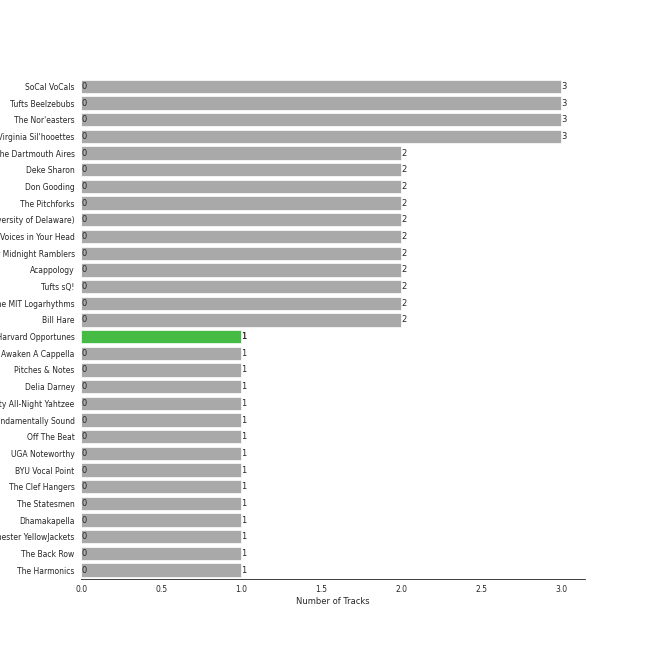
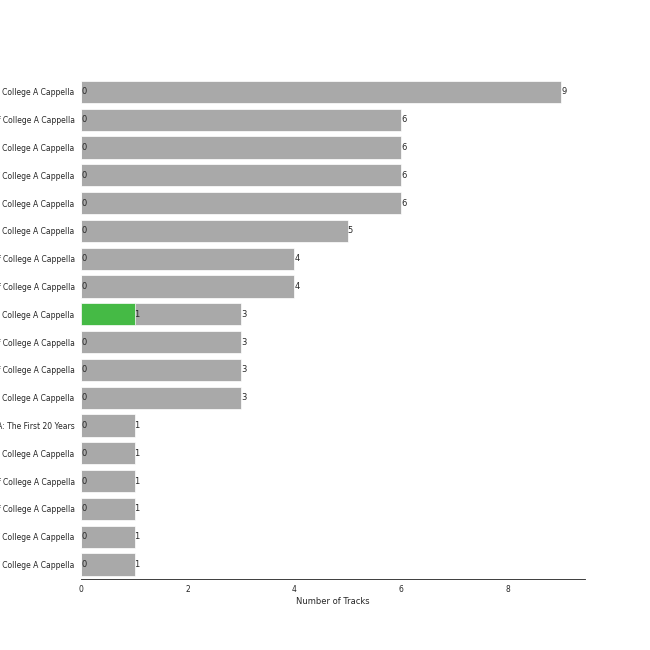
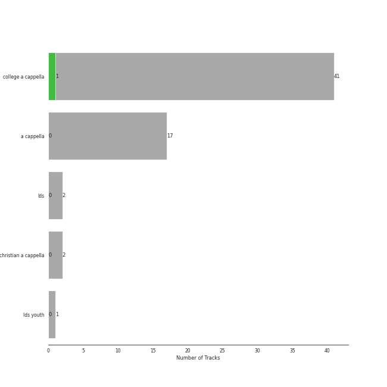

# Varsity Vocals

59 songs

Appears as:
- Varsity Vocals (59 tracks)

## Top Artists

See all 56 artists

| Art | Tracks | 💚 | Artist | 🔗 |
|:---|---:|---:|:---|:---|
|  | 3 | 0 | Tufts Beelzebubs | [🔗](https://open.spotify.com/artist/4VsNVAxuPxZrJMWE2Tprtq) |
|  | 3 | 0 | The Nor'easters | [🔗](https://open.spotify.com/artist/1aLfVgwt8eBrpvHcutWmqe) |
|  | 2 | 0 | The Dartmouth Aires | [🔗](https://open.spotify.com/artist/71Cez1b1NqsxIn5u8XNiQD) |
|  | 2 | 0 | Deke Sharon | [🔗](https://open.spotify.com/artist/6eWNb9yuroBpPcQ4sOkL1e) |
|  | 2 | 0 | Don Gooding | [🔗](https://open.spotify.com/artist/66iv9KzffeiANddjYouG6U) |
|  | 2 | 0 | SoCal VoCals | [🔗](https://open.spotify.com/artist/5L30XpwHG77eWCZtelTns9) |
|  | 2 | 0 | The Pitchforks | [🔗](https://open.spotify.com/artist/5IPABE7EhPLvUVsgM3dlZ8) |
|  | 2 | 0 | University Of Delaware Vocal Point | [🔗](https://open.spotify.com/artist/4nrhXBXu7FnxWeSbB21bfk) |
|  | 2 | 0 | University of Rochester Midnight Ramblers | [🔗](https://open.spotify.com/artist/2Tv49uvEsNJXUpuFL7HuKu) |
|  | 2 | 0 | Acappology | [🔗](https://open.spotify.com/artist/21v1APtcWJHRmeKdBRVbYs) |
|  | 2 | 0 | Tufts sQ! | [🔗](https://open.spotify.com/artist/21QIHECpmN2KwhpVhIWHpT) |
|  | 2 | 0 | The MIT Logarhythms | [🔗](https://open.spotify.com/artist/1jz5HCLwsDkpBYz80n9wbR) |
|  | 2 | 0 | Bill Hare | [🔗](https://open.spotify.com/artist/10WhKnqdsfpYWDgZhjrday) |
|  | 2 | 0 | The Virginia Sil'hooettes | [🔗](https://open.spotify.com/artist/0LKgClZwZKGhM5BkCzjfMX) |
|  | 1 | 0 | Awaken A Cappella | [🔗](https://open.spotify.com/artist/7zjm9GiXJPq0z3bKETWl1N) |
|  | 1 | 0 | Pitches & Notes | [🔗](https://open.spotify.com/artist/7l6eX8dYXjmQnfF04Sr4Vh) |
|  | 1 | 0 | Delia Darney | [🔗](https://open.spotify.com/artist/7ikvHdyyUnB92bHTgFcctU) |
|  | 1 | 0 | Florida State University All-Night Yahtzee | [🔗](https://open.spotify.com/artist/7hpsmZ7DZukPPg1dR2wqAy) |
|  | 1 | 0 | University of Wisconsin-Madison Fundamentally Sound | [🔗](https://open.spotify.com/artist/7f7ezoLEjOp1K0qDSosU80) |
|  | 1 | 0 | Off The Beat | [🔗](https://open.spotify.com/artist/7aCUqnLkFEQd2FPL6RK1tW) |
|  | 1 | 0 | UGA Noteworthy | [🔗](https://open.spotify.com/artist/6MyHz1OaVtj1w2y6JTu2u5) |
|  | 1 | 0 | BYU Vocal Point | [🔗](https://open.spotify.com/artist/5zhxxb24WP6q6rbLHAn2UQ) |
|  | 1 | 0 | The Clef Hangers | [🔗](https://open.spotify.com/artist/5wUTXZIMX0mn6MzFA13qfO) |
|  | 1 | 0 | The Statesmen | [🔗](https://open.spotify.com/artist/5m9J0qjRMcetcTxN535NBZ) |
|  | 1 | 0 | University of Rochester YellowJackets | [🔗](https://open.spotify.com/artist/5PdBpsZXvnEbbTe1589fMO) |
|  | 1 | 0 | The Back Row | [🔗](https://open.spotify.com/artist/5GaN9YyrJyPmJd6dALWhQh) |
|  | 1 | 0 | The Harmonics | [🔗](https://open.spotify.com/artist/528Rcthd9JqtIrlbrGKNsG) |
|  | 1 | 0 | Kat Dunbar Linker | [🔗](https://open.spotify.com/artist/512QZ1TM6L4uXmWCVOKHtV) |
|  | 1 | 0 | Varsity Vocals | [🔗](https://open.spotify.com/artist/4bQp9Lm7LgRMLtqEsH3Bqf) |
|  | 1 | 0 | The Harvard-Radcliffe Veritones | [🔗](https://open.spotify.com/artist/4Zjdnr698SzQDAPMx4oxy0) |
|  | 1 | 0 | Brandeis VoiceMale | [🔗](https://open.spotify.com/artist/4DsnXPBijq5tMq5zAEfF1L) |
|  | 1 | 0 | Voices in Your Head | [🔗](https://open.spotify.com/artist/44v8JgDySt9tkgfV3AWxBJ) |
|  | 1 | 0 | Decadence | [🔗](https://open.spotify.com/artist/3uBUg8TtKXz6m3wY5aXa9I) |
|  | 1 | 0 | Gabe Hendifar | [🔗](https://open.spotify.com/artist/3YIBM4yvZHT4lRQa14eHQh) |
|  | 1 | 0 | Hullabahoos | [🔗](https://open.spotify.com/artist/3S1DEHnGNfWmamdZEyLs8I) |
|  | 1 | 0 | Eight Beat Measure | [🔗](https://open.spotify.com/artist/3My1YRLewqqDXME2OkBpdZ) |
|  | 1 | 0 | The Doo Wop Shop | [🔗](https://open.spotify.com/artist/3BKvJisNneE6cOuLuBHGpC) |
|  | 1 | 0 | The Vassar Devils | [🔗](https://open.spotify.com/artist/31EncJhuSBcAIsZGA3G1GK) |
|  | 1 | 0 | Elizabeth Wright | [🔗](https://open.spotify.com/artist/2tQ7EzEpu1KFpseMdHGSzL) |
|  | 1 | 0 | Low Key | [🔗](https://open.spotify.com/artist/2bFVGrmfB6A9ljMkunWcXC) |
|  | 1 | 0 | [Sara Bareilles](../artists/sara_bareilles.md) | [🔗](https://open.spotify.com/artist/2Sqr0DXoaYABbjBo9HaMkM) |
|  | 1 | 0 | Penn Masala | [🔗](https://open.spotify.com/artist/2MhJb1ljKttJewuYZTpXxr) |
|  | 1 | 0 | Mixed Emotions | [🔗](https://open.spotify.com/artist/2BoHcRUfryDNxa9HQxXSpr) |
|  | 1 | 0 | Upper Structure | [🔗](https://open.spotify.com/artist/1tlKq97YGAGBavozMVeddE) |
|  | 1 | 0 | University of Michigan G-Men | [🔗](https://open.spotify.com/artist/1jANAnjCBrwxiT4c33eeNc) |
|  | 1 | 0 | The Loreleis | [🔗](https://open.spotify.com/artist/1fqMjreaczGwFmdmG6AvJs) |
|  | 1 | 0 | Tufts Jackson Jills | [🔗](https://open.spotify.com/artist/1dUJZ0lbobmanl4W14h0a2) |
|  | 1 | 0 | BYU Noteworthy | [🔗](https://open.spotify.com/artist/1ZknN7FbjjjMTmdU42OEeX) |
|  | 1 | 0 | Academical Village People | [🔗](https://open.spotify.com/artist/1Vjug1h4HXCeplbouQEbV3) |
|  | 1 | 0 | Erika Petty | [🔗](https://open.spotify.com/artist/15YH0MYEIRY7AmrrwfVO4W) |
|  | 1 | 0 | The Virginia Gentlemen | [🔗](https://open.spotify.com/artist/0steWfkS4hwaErh84SlHMW) |
|  | 1 | 0 | The Bostonians | [🔗](https://open.spotify.com/artist/0gW6hG0g7pVNbHgvmYwHDl) |
|  | 1 | 0 | New Dominions | [🔗](https://open.spotify.com/artist/0PzFyYSC4Y7JarVyByrJPc) |
|  | 1 | 0 | The Buffalo Chips | [🔗](https://open.spotify.com/artist/0IAZ8PiZ0KqdMd191HDJ8t) |
|  | 1 | 0 | N'Harmonics | [🔗](https://open.spotify.com/artist/02WQpZmto5LiTgoorLhpLK) |
|  | 1 | 0 | On The Rocks | [🔗](https://open.spotify.com/artist/00IjdWQ46sSBP4gZYObAMx) |

## Top Albums

See all 15 albums

| Art | Tracks | 💚 | Album | Release Date | 🔗 |
|:---|---:|---:|:---|:---|:---|
|  | 9 | 0 | BOCA 2015: Best Of College A Cappella | 2014-12-19 | [🔗](https://open.spotify.com/album/0gyhBvJs1GiI31cMMmKLnK) |
|  | 6 | 0 | BOCA 2013: Best of College A Cappella | 2016 | [🔗](https://open.spotify.com/album/6Pqey2mc4EWSfYNH3bifbO) |
|  | 6 | 0 | BOCA 2010: Best Of College A Cappella | 2011-02-15 | [🔗](https://open.spotify.com/album/3HSd3voAxPxS50UrfInBVJ) |
|  | 6 | 0 | BOCA 2009: Best Of College A Cappella | 2011-02-15 | [🔗](https://open.spotify.com/album/50WaSkL4pVvz9Crsca7oNV) |
|  | 6 | 0 | BOCA 2008: Best Of College A Cappella | 2011-02-15 | [🔗](https://open.spotify.com/album/4Z0ju0i47UZ2Y4icq2f3wZ) |
|  | 5 | 0 | BOCA 2014: Best Of College A Cappella | 2014-01-31 | [🔗](https://open.spotify.com/album/7rZoAMtoZ8s5mLIlUTWgVT) |
|  | 4 | 0 | BOCA 2012: Best Of College A Cappella | 2012-01-01 | [🔗](https://open.spotify.com/album/26eCHp86K2xLQj0B7Cr8he) |
|  | 4 | 0 | BOCA 2011: Best Of College A Cappella | 2011-01-11 | [🔗](https://open.spotify.com/album/27d96rqnXRtmrGBGHJzPBh) |
|  | 3 | 0 | BOCA 2021: Best of College A Cappella | 2021-02-06 | [🔗](https://open.spotify.com/album/1eKkeTIlePsRpKkQre78tT) |
|  | 3 | 0 | BOCA 2018: Best of College A Cappella | 2018 | [🔗](https://open.spotify.com/album/4F7k4viXqEAIlrB5rbAPbF) |
|  | 3 | 0 | BOCA 2016: Best Of College A Cappella | 2015-12-15 | [🔗](https://open.spotify.com/album/2AOr4esohQurJGXklhRH1a) |
|  | 1 | 0 | Best of BOCA: The First 20 Years | 2014-04-15 | [🔗](https://open.spotify.com/album/5bcLIouxn2oBiGvf4vvO6u) |
|  | 1 | 0 | BOCA 2020: Best of College A Cappella | 2020-01-08 | [🔗](https://open.spotify.com/album/3c4vODZeeDk38CVmjbUERt) |
|  | 1 | 0 | BOCA 2006: Best Of College A Cappella | 2006-01-01 | [🔗](https://open.spotify.com/album/3AeoTNhXFgBM7CuODGFelQ) |
|  | 1 | 0 | BOCA 2004: Best Of College A Cappella | 2004-01-01 | [🔗](https://open.spotify.com/album/5qrIP0zXoDQUSZ9l1ZaECQ) |

## Genres

See all 4 genres

| Tracks | 💚 | Genre |
|---:|---:|:---|
| 44 | 0 | [a cappella](../genres/a_cappella.md) |
| 36 | 0 | college a cappella |
| 2 | 0 | christian a cappella |
| 1 | 0 | lds youth |

## Tracks released under Varsity Vocals

| Art | Track | Album | Artists | Label | 💚 | 🔗 |
|:---|:---|:---|:---|:---|:---|:---|
|  | Domino | BOCA 2014: Best Of College A Cappella | Academical Village People | [Varsity Vocals](varsity_vocals.md) | | [🔗](https://open.spotify.com/track/3DKmS1wFIHh2fs2rLWnngc) |
|  | Gunpowder & Lead | BOCA 2012: Best Of College A Cappella | Acappology | [Varsity Vocals](varsity_vocals.md) | | [🔗](https://open.spotify.com/track/4VULVdHqtgipHNPFnVRQ7D) |
|  | Latch | BOCA 2018: Best of College A Cappella | Acappology | [Varsity Vocals](varsity_vocals.md) | | [🔗](https://open.spotify.com/track/4ohS1wfgFuaeePkvp0fbPL) |
|  | Gravity | BOCA 2004: Best Of College A Cappella | Awaken A Cappella, [Sara Bareilles](../artists/sara_bareilles.md), Don Gooding, Bill Hare, Gabe Hendifar, Deke Sharon | [Varsity Vocals](varsity_vocals.md) | | [🔗](https://open.spotify.com/track/0W94b6tM78Miftv7W5tOX2) |
|  | Phoenix | BOCA 2012: Best Of College A Cappella | Brandeis VoiceMale | [Varsity Vocals](varsity_vocals.md) | | [🔗](https://open.spotify.com/track/0SD3F1HRCKtQNXy6B2zltD) |
|  | Listen | BOCA 2010: Best Of College A Cappella | BYU Noteworthy | [Varsity Vocals](varsity_vocals.md) | | [🔗](https://open.spotify.com/track/2IdhvVi0vsa8ELKURGlMzV) |
|  | Eine kleine Nachtmusik | BOCA 2015: Best Of College A Cappella | BYU Vocal Point | [Varsity Vocals](varsity_vocals.md) | | [🔗](https://open.spotify.com/track/4C4waD825wsfbZfQCxMmNn) |
|  | Valerie | BOCA 2013: Best of College A Cappella | Decadence | [Varsity Vocals](varsity_vocals.md) | | [🔗](https://open.spotify.com/track/18OOiO2QFVNYwixjqj1jks) |
|  | Talk Dirty | BOCA 2015: Best Of College A Cappella | Eight Beat Measure | [Varsity Vocals](varsity_vocals.md) | | [🔗](https://open.spotify.com/track/5lFEOhTWJbqbI0MwWhiKKk) |
|  | Aha! | BOCA 2013: Best of College A Cappella | Florida State University All-Night Yahtzee | [Varsity Vocals](varsity_vocals.md) | | [🔗](https://open.spotify.com/track/7Lx4TW1CMmHVP5ZiNGyi9H) |
|  | Sweater Weather | BOCA 2015: Best Of College A Cappella | Hullabahoos | [Varsity Vocals](varsity_vocals.md) | | [🔗](https://open.spotify.com/track/1cV1Q5LrLF4NdLgp1XuRvw) |
|  | Hit 'Em Up Style | BOCA 2011: Best Of College A Cappella | Low Key | [Varsity Vocals](varsity_vocals.md) | | [🔗](https://open.spotify.com/track/1vZFo0NkvmQPv08O4m11nU) |
|  | when the party's over | BOCA 2020: Best of College A Cappella | Mixed Emotions | [Varsity Vocals](varsity_vocals.md) | | [🔗](https://open.spotify.com/track/5eXzpI6Y9OJRfJFu9jr4q4) |
|  | High And Dry | BOCA 2011: Best Of College A Cappella | N'Harmonics | [Varsity Vocals](varsity_vocals.md) | | [🔗](https://open.spotify.com/track/7pjIkpcS5y38CuI4JRfJru) |
|  | Chandelier | BOCA 2015: Best Of College A Cappella | New Dominions | [Varsity Vocals](varsity_vocals.md) | | [🔗](https://open.spotify.com/track/6VIwRB8pI0PgAXBwswVENi) |
|  | Does He Love You? | BOCA 2008: Best Of College A Cappella | Off The Beat | [Varsity Vocals](varsity_vocals.md) | | [🔗](https://open.spotify.com/track/7gMEjMeugwWUZVq0m1pTNK) |
|  | All Time Low | BOCA 2021: Best of College A Cappella | On The Rocks | [Varsity Vocals](varsity_vocals.md) | | [🔗](https://open.spotify.com/track/1z8D1f7Ljew7O99KMDslPS) |
|  | Manwa Laage | BOCA 2015: Best Of College A Cappella | Penn Masala | [Varsity Vocals](varsity_vocals.md) | | [🔗](https://open.spotify.com/track/2aMMIV2pWF9S3eOQ0MFll7) |
|  | God is a Woman | BOCA 2021: Best of College A Cappella | Pitches & Notes | [Varsity Vocals](varsity_vocals.md) | | [🔗](https://open.spotify.com/track/3YL6rePe5HfzyxkJJta9CR) |
|  | Movin' On | BOCA 2010: Best Of College A Cappella | SoCal VoCals | [Varsity Vocals](varsity_vocals.md) | | [🔗](https://open.spotify.com/track/6ij7GL6J5e8l8gprJZ1sz7) |
|  | Tightrope | BOCA 2014: Best Of College A Cappella | SoCal VoCals | [Varsity Vocals](varsity_vocals.md) | | [🔗](https://open.spotify.com/track/3SVFOwTfDYsfYISonpmSJz) |
|  | Sexyback | BOCA 2008: Best Of College A Cappella | The Back Row | [Varsity Vocals](varsity_vocals.md) | | [🔗](https://open.spotify.com/track/6GUakxj472xSOMb7n4PmGu) |
|  | First Train Home | BOCA 2011: Best Of College A Cappella | The Bostonians | [Varsity Vocals](varsity_vocals.md) | | [🔗](https://open.spotify.com/track/1AFKgrcUEWCjMvnfhMgQAH) |
|  | Viva La Vida | BOCA 2009: Best Of College A Cappella | The Buffalo Chips | [Varsity Vocals](varsity_vocals.md) | | [🔗](https://open.spotify.com/track/3h7QyvRCvDzaq5byDWMulH) |
|  | Don't Stop Believin' | BOCA 2008: Best Of College A Cappella | The Clef Hangers | [Varsity Vocals](varsity_vocals.md) | | [🔗](https://open.spotify.com/track/3j0EShkWclou2SnCRirqbj) |
|  | Brand New Jones | BOCA 2012: Best Of College A Cappella | The Dartmouth Aires | [Varsity Vocals](varsity_vocals.md) | | [🔗](https://open.spotify.com/track/0GMJCCfFZpAw9NVnpZjJTV) |
|  | All of Me | BOCA 2015: Best Of College A Cappella | The Dartmouth Aires | [Varsity Vocals](varsity_vocals.md) | | [🔗](https://open.spotify.com/track/2Sur4RO7a4VVXxzfxX9bY7) |
|  | Oops!...I Did It Again | BOCA 2021: Best of College A Cappella | The Doo Wop Shop | [Varsity Vocals](varsity_vocals.md) | | [🔗](https://open.spotify.com/track/2sigy23leJc6YIAltQadIK) |
|  | Sound Of Silence | BOCA 2009: Best Of College A Cappella | The Harmonics | [Varsity Vocals](varsity_vocals.md) | | [🔗](https://open.spotify.com/track/7d9eTipRw0DsB2ggcecqez) |
|  | They | BOCA 2009: Best Of College A Cappella | The Harvard-Radcliffe Veritones | [Varsity Vocals](varsity_vocals.md) | | [🔗](https://open.spotify.com/track/12RoSrRwRi85EESftOp9fh) |
|  | My Happy Ending | BOCA 2006: Best Of College A Cappella | The Loreleis, Varsity Vocals, Kat Dunbar Linker, Deke Sharon, Bill Hare, Delia Darney, Elizabeth Wright, Don Gooding, Erika Petty | [Varsity Vocals](varsity_vocals.md) | | [🔗](https://open.spotify.com/track/7umin6cK2uTjk1BwLMKzJ9) |
|  | Here (In Your Arms) | BOCA 2009: Best Of College A Cappella | The MIT Logarhythms | [Varsity Vocals](varsity_vocals.md) | | [🔗](https://open.spotify.com/track/0eyAuLKMMEJRqiHFPhhFYI) |
|  | There Goes My Baby | BOCA 2012: Best Of College A Cappella | The MIT Logarhythms | [Varsity Vocals](varsity_vocals.md) | | [🔗](https://open.spotify.com/track/45TOM8ILavStTJ1G2aOo9g) |
|  | Don't You Worry Child | BOCA 2014: Best Of College A Cappella | The Nor'easters | [Varsity Vocals](varsity_vocals.md) | | [🔗](https://open.spotify.com/track/62RQw8vUhTQ96zpoeLP1ux) |
|  | Counting Stars | BOCA 2015: Best Of College A Cappella | The Nor'easters | [Varsity Vocals](varsity_vocals.md) | | [🔗](https://open.spotify.com/track/7btsa3AD5GeGV3GJUtWhMj) |
|  | Woods | BOCA 2013: Best of College A Cappella | The Nor'easters | [Varsity Vocals](varsity_vocals.md) | | [🔗](https://open.spotify.com/track/2ul4oLZzBFZK2zFaS0WcJF) |
|  | Home | BOCA 2009: Best Of College A Cappella | The Pitchforks | [Varsity Vocals](varsity_vocals.md) | | [🔗](https://open.spotify.com/track/3NWCOrattfBSPxx6j5cGBr) |
|  | All Of The Lights | BOCA 2013: Best of College A Cappella | The Pitchforks | [Varsity Vocals](varsity_vocals.md) | | [🔗](https://open.spotify.com/track/25Cnsylo80N1bX9CzSvCaE) |
|  | Breathe Again | BOCA 2014: Best Of College A Cappella | The Statesmen | [Varsity Vocals](varsity_vocals.md) | | [🔗](https://open.spotify.com/track/5wxyJOGMdJKVRHsjCx3IOb) |
|  | Alive | BOCA 2018: Best of College A Cappella | The Vassar Devils | [Varsity Vocals](varsity_vocals.md) | | [🔗](https://open.spotify.com/track/6HhUjfh7zgH5lwPYJXCoUl) |
|  | Problem | BOCA 2015: Best Of College A Cappella | The Virginia Gentlemen | [Varsity Vocals](varsity_vocals.md) | | [🔗](https://open.spotify.com/track/16Q8OxraSJD6JX8gnmzjTS) |
|  | Telephone | BOCA 2011: Best Of College A Cappella | The Virginia Sil'hooettes | [Varsity Vocals](varsity_vocals.md) | | [🔗](https://open.spotify.com/track/2LlRv5v26c1wRTnJaH2P2y) |
|  | Say (All I Need) | BOCA 2010: Best Of College A Cappella | The Virginia Sil'hooettes | [Varsity Vocals](varsity_vocals.md) | | [🔗](https://open.spotify.com/track/1t9VIvxuGPM3zx7kR5CbPB) |
|  | Come Sail Away | BOCA 2008: Best Of College A Cappella | Tufts Beelzebubs | [Varsity Vocals](varsity_vocals.md) | | [🔗](https://open.spotify.com/track/4shx271boRWtwHWM2bTpGa) |
|  | Who Are You | BOCA 2010: Best Of College A Cappella | Tufts Beelzebubs | [Varsity Vocals](varsity_vocals.md) | | [🔗](https://open.spotify.com/track/16anMWzEl1TuW5yKtnZBd7) |
|  | Everybody Talks | BOCA 2014: Best Of College A Cappella | Tufts Beelzebubs | [Varsity Vocals](varsity_vocals.md) | | [🔗](https://open.spotify.com/track/4uJ9zT1WIdRQXY0cd71Pki) |
|  | Misery Business | BOCA 2010: Best Of College A Cappella | Tufts Jackson Jills | [Varsity Vocals](varsity_vocals.md) | | [🔗](https://open.spotify.com/track/3S8HYZFYSvgpIwadfV5PX6) |
|  | Put Your Records On | BOCA 2008: Best Of College A Cappella | Tufts sQ! | [Varsity Vocals](varsity_vocals.md) | | [🔗](https://open.spotify.com/track/3xE8DcaJYoDYMHgY9BDKdZ) |
|  | That's What You Get | BOCA 2010: Best Of College A Cappella | Tufts sQ! | [Varsity Vocals](varsity_vocals.md) | | [🔗](https://open.spotify.com/track/3GcG8ouobilGq1eXAOEvNG) |
|  | Apologize | BOCA 2009: Best Of College A Cappella | UGA Noteworthy | [Varsity Vocals](varsity_vocals.md) | | [🔗](https://open.spotify.com/track/0XvEuKedxyyk3Q7nVjrIXJ) |
|  | Wrecking Ball | BOCA 2015: Best Of College A Cappella | University Of Delaware Vocal Point | [Varsity Vocals](varsity_vocals.md) | | [🔗](https://open.spotify.com/track/16FprIRs4tJd34TnnjOagK) |
|  | Break Free | BOCA 2016: Best Of College A Cappella | University Of Delaware Vocal Point | [Varsity Vocals](varsity_vocals.md) | | [🔗](https://open.spotify.com/track/1ytCzhV54aRqPpMMxhiQGD) |
|  | Skinny Love | BOCA 2016: Best Of College A Cappella | University of Michigan G-Men | [Varsity Vocals](varsity_vocals.md) | | [🔗](https://open.spotify.com/track/6PWPv9j5TcbDd9LjJC7s5W) |
|  | I Write Sins Not Tragedies | BOCA 2008: Best Of College A Cappella | University of Rochester Midnight Ramblers | [Varsity Vocals](varsity_vocals.md) | | [🔗](https://open.spotify.com/track/2dQ2TQVlW0SDEHp0Ew4rBr) |
|  | Fireflies | Best of BOCA: The First 20 Years | University of Rochester Midnight Ramblers | [Varsity Vocals](varsity_vocals.md) | | [🔗](https://open.spotify.com/track/39g3TJTdQlakKOb1LHLkUP) |
|  | Bang Bang | BOCA 2016: Best Of College A Cappella | University of Rochester YellowJackets | [Varsity Vocals](varsity_vocals.md) | | [🔗](https://open.spotify.com/track/41O5Dh0QQF7x8djeNhCHzK) |
|  | Smooth Criminal | BOCA 2013: Best of College A Cappella | University of Wisconsin-Madison Fundamentally Sound | [Varsity Vocals](varsity_vocals.md) | | [🔗](https://open.spotify.com/track/7kxwqVLwWMbkZKqm0GykBY) |
|  | She Used to Be Mine | BOCA 2018: Best of College A Cappella | Upper Structure | [Varsity Vocals](varsity_vocals.md) | | [🔗](https://open.spotify.com/track/6jcJMJ6CcYPzPZ9386CJd5) |
|  | We Found Love | BOCA 2013: Best of College A Cappella | Voices in Your Head | [Varsity Vocals](varsity_vocals.md) | | [🔗](https://open.spotify.com/track/00pw67OZKJyzydY9N2Orui) |
