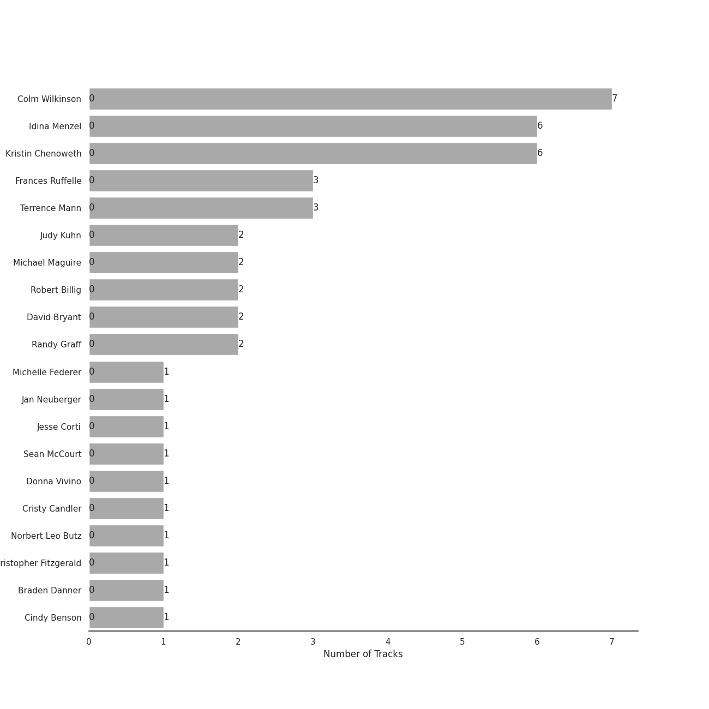
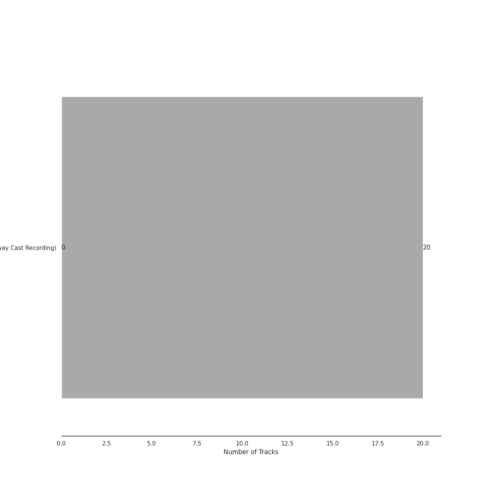
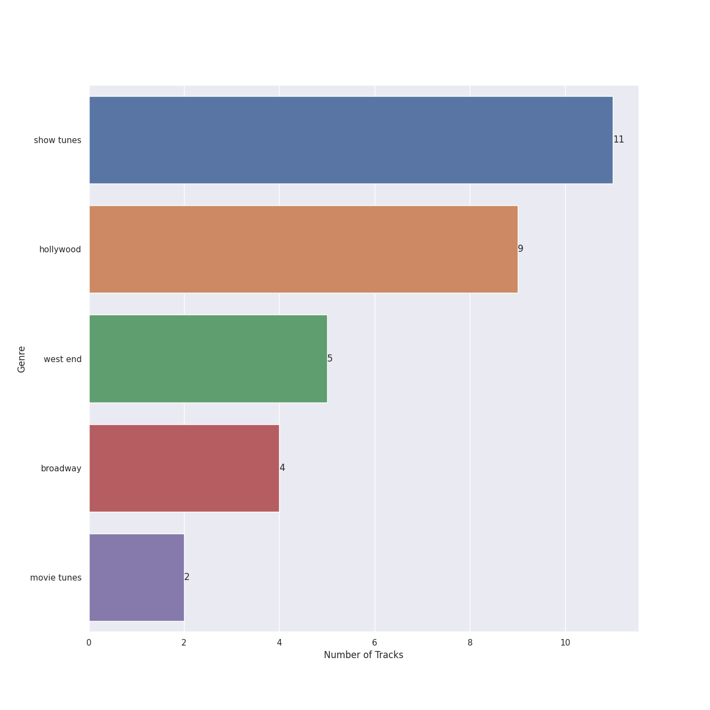

# Verve (Adult Contemporary) MC

20 songs

Appears as:
- Verve (Adult Contemporary) MC (20 tracks)

## Top Artists

See all 12 artists

|   Number of Tracks | Art                                                                                              | Artist           | 🔗                                                           |
|-------------------:|:-------------------------------------------------------------------------------------------------|:-----------------|:------------------------------------------------------------|
|                  7 |  | Colm Wilkinson   | [🔗](https://open.spotify.com/artist/4hKV8PcRBaHZqBJjSn8OJE) |
|                  3 |  | Frances Ruffelle | [🔗](https://open.spotify.com/artist/5uSeMCBhe3DiROdFrwaXkw) |
|                  3 |                                                               | Terrence Mann    | [🔗](https://open.spotify.com/artist/5uBIsYz9WatgoViLG6pVj2) |
|                  2 |  | Judy Kuhn        | [🔗](https://open.spotify.com/artist/7tHd518aPjJYUgyv9bidBz) |
|                  2 |  | Michael Maguire  | [🔗](https://open.spotify.com/artist/6QjRwce37TfXfjx81KqQ7N) |
|                  2 |                                                               | Robert Billig    | [🔗](https://open.spotify.com/artist/3Ybg9gi5V2x6i8OsLc9M7p) |
|                  2 |  | David Bryant     | [🔗](https://open.spotify.com/artist/2yPfp367ZwywK1lbGg00b8) |
|                  2 |                                                               | Randy Graff      | [🔗](https://open.spotify.com/artist/2iRiwwxcJb6fXCxO5jt1cz) |
|                  1 |                                                               | Jesse Corti      | [🔗](https://open.spotify.com/artist/53vhGhGRoi9ARM7kr3jrz5) |
|                  1 |  | Donna Vivino     | [🔗](https://open.spotify.com/artist/4IDNKwIch36V0UvtfUQF9k) |
|                  1 |                                                               | Braden Danner    | [🔗](https://open.spotify.com/artist/0n5FRSY5ldzVwzb6Tq9Ya3) |
|                  1 |  | Cindy Benson     | [🔗](https://open.spotify.com/artist/0OIRFXSbEOgnGZXXccjvgt) |

## Top Albums

See all 1 albums

|   Number of Tracks | Art                                                                                              | Album                                             | Release Date   | 🔗                                                          |
|-------------------:|:-------------------------------------------------------------------------------------------------|:--------------------------------------------------|:---------------|:-----------------------------------------------------------|
|                 20 |  | Les Misérables (Original Broadway Cast Recording) | 1987-05-11     | [🔗](https://open.spotify.com/album/3jbKDx0zB1QoJQTw8i1AvD) |

## Genres

See all 5 genres

|   Number of Tracks | Genre                                   |
|-------------------:|:----------------------------------------|
|                 11 | [show tunes](../genres/show_tunes.md)   |
|                  9 | [hollywood](../genres/hollywood.md)     |
|                  5 | west end                                |
|                  4 | [broadway](../genres/broadway.md)       |
|                  2 | [movie tunes](../genres/movie_tunes.md) |

## Tracks released under Verve (Adult Contemporary) MC

| Art                                                                                              | Track                        | Album                                             | Artists                                                   | Label                                                             | 💚   | 🔗                                                          |
|:-------------------------------------------------------------------------------------------------|:-----------------------------|:--------------------------------------------------|:----------------------------------------------------------|:------------------------------------------------------------------|:----|:-----------------------------------------------------------|
|  | Look Down                    | Les Misérables (Original Broadway Cast Recording) | Braden Danner                                             | [Verve (Adult Contemporary) MC](verve__adult_contemporary__mc.md) |     | [🔗](https://open.spotify.com/track/3AUnp0h9tIgQW9IWRVFciJ) |
|  | One Day More                 | Les Misérables (Original Broadway Cast Recording) | Cindy Benson, Jesse Corti                                 | [Verve (Adult Contemporary) MC](verve__adult_contemporary__mc.md) |     | [🔗](https://open.spotify.com/track/7pbmOho4IKzn3F4o65tsas) |
|  | Bring Him Home               | Les Misérables (Original Broadway Cast Recording) | Colm Wilkinson                                            | [Verve (Adult Contemporary) MC](verve__adult_contemporary__mc.md) |     | [🔗](https://open.spotify.com/track/5JZNwoZsUfmxslDNt43DxK) |
|  | Come To Me (Fantine's Death) | Les Misérables (Original Broadway Cast Recording) | Colm Wilkinson, Randy Graff                               | [Verve (Adult Contemporary) MC](verve__adult_contemporary__mc.md) |     | [🔗](https://open.spotify.com/track/1YQ0vVVE0Fd8IwxT19NrVF) |
|  | Confrontation                | Les Misérables (Original Broadway Cast Recording) | Colm Wilkinson, Terrence Mann                             | [Verve (Adult Contemporary) MC](verve__adult_contemporary__mc.md) |     | [🔗](https://open.spotify.com/track/2eqCnMN561yzr6wag6VeiB) |
|  | What Have I Done?            | Les Misérables (Original Broadway Cast Recording) | Colm Wilkinson                                            | [Verve (Adult Contemporary) MC](verve__adult_contemporary__mc.md) |     | [🔗](https://open.spotify.com/track/0xsW9HCRzCmqwvWbd4RzQn) |
|  | Who Am I?                    | Les Misérables (Original Broadway Cast Recording) | Colm Wilkinson                                            | [Verve (Adult Contemporary) MC](verve__adult_contemporary__mc.md) |     | [🔗](https://open.spotify.com/track/3BY5jmyzzZxqulvAx6a4Or) |
|  | Empty Chairs At Empty Tables | Les Misérables (Original Broadway Cast Recording) | David Bryant                                              | [Verve (Adult Contemporary) MC](verve__adult_contemporary__mc.md) |     | [🔗](https://open.spotify.com/track/6maepGvney4cfp1Ru3lJf3) |
|  | Castle On A Cloud            | Les Misérables (Original Broadway Cast Recording) | Donna Vivino                                              | [Verve (Adult Contemporary) MC](verve__adult_contemporary__mc.md) |     | [🔗](https://open.spotify.com/track/6Emg88gR3KBl21UAcCF5OU) |
|  | A Little Fall Of Rain        | Les Misérables (Original Broadway Cast Recording) | Frances Ruffelle                                          | [Verve (Adult Contemporary) MC](verve__adult_contemporary__mc.md) |     | [🔗](https://open.spotify.com/track/4jS5Ho70Scjk6rucwTgaNe) |
|  | On My Own                    | Les Misérables (Original Broadway Cast Recording) | Frances Ruffelle                                          | [Verve (Adult Contemporary) MC](verve__adult_contemporary__mc.md) |     | [🔗](https://open.spotify.com/track/0XLXG7LJ8jLMhHC5qH9rq6) |
|  | A Heart Full Of Love         | Les Misérables (Original Broadway Cast Recording) | Judy Kuhn                                                 | [Verve (Adult Contemporary) MC](verve__adult_contemporary__mc.md) |     | [🔗](https://open.spotify.com/track/1audfn0M2y51sgmKFHCxoC) |
|  | In My Life                   | Les Misérables (Original Broadway Cast Recording) | Judy Kuhn, Colm Wilkinson, David Bryant, Frances Ruffelle | [Verve (Adult Contemporary) MC](verve__adult_contemporary__mc.md) |     | [🔗](https://open.spotify.com/track/14SBWK1wvWIvh82Fzv1LQG) |
|  | Do You Hear The People Sing? | Les Misérables (Original Broadway Cast Recording) | Michael Maguire                                           | [Verve (Adult Contemporary) MC](verve__adult_contemporary__mc.md) |     | [🔗](https://open.spotify.com/track/491YFwJXZsHzw3SFcETr8b) |
|  | Red And Black                | Les Misérables (Original Broadway Cast Recording) | Michael Maguire                                           | [Verve (Adult Contemporary) MC](verve__adult_contemporary__mc.md) |     | [🔗](https://open.spotify.com/track/7IzBQ5a1LIFNW3U9jqWCaF) |
|  | I Dreamed A Dream            | Les Misérables (Original Broadway Cast Recording) | Randy Graff                                               | [Verve (Adult Contemporary) MC](verve__adult_contemporary__mc.md) |     | [🔗](https://open.spotify.com/track/0c5Y1J8ihMN8vvQ3bsoxlZ) |
|  | At The End Of The Day        | Les Misérables (Original Broadway Cast Recording) | Robert Billig                                             | [Verve (Adult Contemporary) MC](verve__adult_contemporary__mc.md) |     | [🔗](https://open.spotify.com/track/0mF1fLbjCfkE4mO4n5xHWk) |
|  | Lovely Ladies                | Les Misérables (Original Broadway Cast Recording) | Robert Billig                                             | [Verve (Adult Contemporary) MC](verve__adult_contemporary__mc.md) |     | [🔗](https://open.spotify.com/track/35QHqaQSfKROhcBJxgFlct) |
|  | Overture / Work Song         | Les Misérables (Original Broadway Cast Recording) | Terrence Mann, Colm Wilkinson                             | [Verve (Adult Contemporary) MC](verve__adult_contemporary__mc.md) |     | [🔗](https://open.spotify.com/track/1J9f8hnL1JpkzQwwDMhhx8) |
|  | Stars                        | Les Misérables (Original Broadway Cast Recording) | Terrence Mann                                             | [Verve (Adult Contemporary) MC](verve__adult_contemporary__mc.md) |     | [🔗](https://open.spotify.com/track/7a0dC4TKvEGZMbyAQUuiex) |
