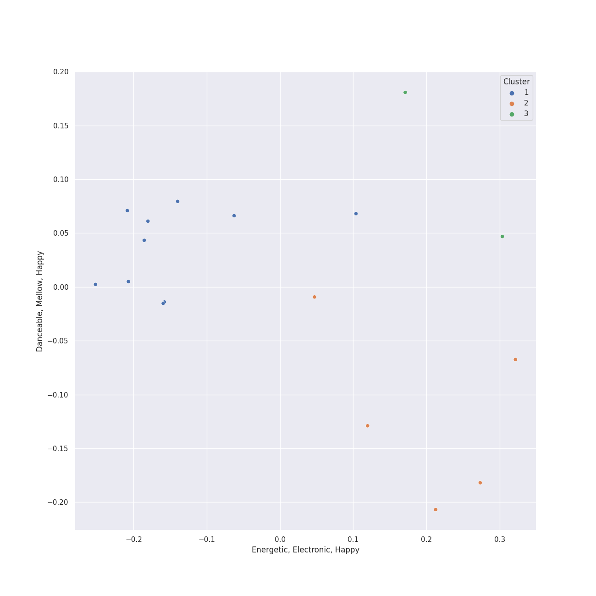

# Clusters in Verve (Adult Contemporary) MC

## Cluster #1

10 tracks

| Art | Track | Album | Artists | Label | 💚 | 🔗 |
|:---|:---|:---|:---|:---|:---|:---|
|  | Bring Him Home | Les Misérables (Original Broadway Cast Recording) | Colm Wilkinson | [Verve (Adult Contemporary) MC](../..) | | [🔗](https://open.spotify.com/track/5JZNwoZsUfmxslDNt43DxK) |
|  | Come To Me (Fantine's Death) | Les Misérables (Original Broadway Cast Recording) | Randy Graff, Colm Wilkinson | [Verve (Adult Contemporary) MC](../..) | | [🔗](https://open.spotify.com/track/1YQ0vVVE0Fd8IwxT19NrVF) |
|  | What Have I Done? | Les Misérables (Original Broadway Cast Recording) | Colm Wilkinson | [Verve (Adult Contemporary) MC](../..) | | [🔗](https://open.spotify.com/track/0xsW9HCRzCmqwvWbd4RzQn) |
|  | Who Am I? | Les Misérables (Original Broadway Cast Recording) | Colm Wilkinson | [Verve (Adult Contemporary) MC](../..) | | [🔗](https://open.spotify.com/track/3BY5jmyzzZxqulvAx6a4Or) |
|  | A Little Fall Of Rain | Les Misérables (Original Broadway Cast Recording) | Frances Ruffelle | [Verve (Adult Contemporary) MC](../..) | | [🔗](https://open.spotify.com/track/4jS5Ho70Scjk6rucwTgaNe) |
|  | On My Own | Les Misérables (Original Broadway Cast Recording) | Frances Ruffelle | [Verve (Adult Contemporary) MC](../..) | | [🔗](https://open.spotify.com/track/0XLXG7LJ8jLMhHC5qH9rq6) |
|  | A Heart Full Of Love | Les Misérables (Original Broadway Cast Recording) | Judy Kuhn | [Verve (Adult Contemporary) MC](../..) | | [🔗](https://open.spotify.com/track/1audfn0M2y51sgmKFHCxoC) |
|  | In My Life | Les Misérables (Original Broadway Cast Recording) | David Bryant, Colm Wilkinson, Frances Ruffelle, Judy Kuhn | [Verve (Adult Contemporary) MC](../..) | | [🔗](https://open.spotify.com/track/14SBWK1wvWIvh82Fzv1LQG) |
|  | For Good - From "Wicked" Original Broadway Cast Recording/2003 | Wicked (Original Broadway Cast Recording / Deluxe Edition) | Stephen Oremus, Kristin Chenoweth, Alex Lacamoire, Idina Menzel, Stephen Schwartz | [Verve (Adult Contemporary) MC](../..) | | [🔗](https://open.spotify.com/track/3WkgLAd7jGX3sZikfkF0lU) |
|  | I'm Not That Girl - From "Wicked" Original Broadway Cast Recording/2003 | Wicked (Original Broadway Cast Recording / Deluxe Edition) | Stephen Oremus, Alex Lacamoire, Idina Menzel, Stephen Schwartz | [Verve (Adult Contemporary) MC](../..) | | [🔗](https://open.spotify.com/track/5HZCMnScUwekum55mcRdjK) |
## Cluster #2

5 tracks

| Art | Track | Album | Artists | Label | 💚 | 🔗 |
|:---|:---|:---|:---|:---|:---|:---|
|  | Confrontation | Les Misérables (Original Broadway Cast Recording) | Colm Wilkinson, Terrence Mann | [Verve (Adult Contemporary) MC](../..) | | [🔗](https://open.spotify.com/track/2eqCnMN561yzr6wag6VeiB) |
|  | Dancing Through Life - From "Wicked" Original Broadway Cast Recording/2003 | Wicked (Original Broadway Cast Recording / Deluxe Edition) | Christopher Fitzgerald, Stephen Oremus, Norbert Leo Butz, Kristin Chenoweth, Alex Lacamoire, Michelle Federer, Idina Menzel, Stephen Schwartz | [Verve (Adult Contemporary) MC](../..) | | [🔗](https://open.spotify.com/track/45Yr7rD2vH3OsTRseT6gfA) |
|  | Defying Gravity - From "Wicked" Original Broadway Cast Recording/2003 | Wicked (Original Broadway Cast Recording / Deluxe Edition) | Stephen Oremus, Kristin Chenoweth, Alex Lacamoire, Idina Menzel, Stephen Schwartz | [Verve (Adult Contemporary) MC](../..) | | [🔗](https://open.spotify.com/track/184HGdGIscUiPbDuqbvHuN) |
|  | No Good Deed - From "Wicked" Original Broadway Cast Recording/2003 | Wicked (Original Broadway Cast Recording / Deluxe Edition) | Stephen Oremus, Alex Lacamoire, Idina Menzel, Stephen Schwartz | [Verve (Adult Contemporary) MC](../..) | | [🔗](https://open.spotify.com/track/55dcu9Iz7r58VEmTqk4LP4) |
|  | No One Mourns The Wicked - From "Wicked" Original Broadway Cast Recording/2003 | Wicked (Original Broadway Cast Recording / Deluxe Edition) | Stephen Oremus, Cristy Candler, Kristin Chenoweth, Sean McCourt, Jan Neuberger, Alex Lacamoire, Stephen Schwartz | [Verve (Adult Contemporary) MC](../..) | | [🔗](https://open.spotify.com/track/0UzApqRTAi3d2iZexmuP3s) |
## Cluster #3

2 tracks

| Art | Track | Album | Artists | Label | 💚 | 🔗 |
|:---|:---|:---|:---|:---|:---|:---|
|  | Popular - From "Wicked" Original Broadway Cast Recording/2003 | Wicked (Original Broadway Cast Recording / Deluxe Edition) | Stephen Oremus, Kristin Chenoweth, Alex Lacamoire, Stephen Schwartz | [Verve (Adult Contemporary) MC](../..) | | [🔗](https://open.spotify.com/track/57Pk2GU0ABFYBbbcgYxqki) |
|  | What Is This Feeling? - From "Wicked" Original Broadway Cast Recording/2003 | Wicked (Original Broadway Cast Recording / Deluxe Edition) | Stephen Oremus, Kristin Chenoweth, Alex Lacamoire, Idina Menzel, Stephen Schwartz | [Verve (Adult Contemporary) MC](../..) | | [🔗](https://open.spotify.com/track/2lNRPajwEfma5EEmsgAe1w) |