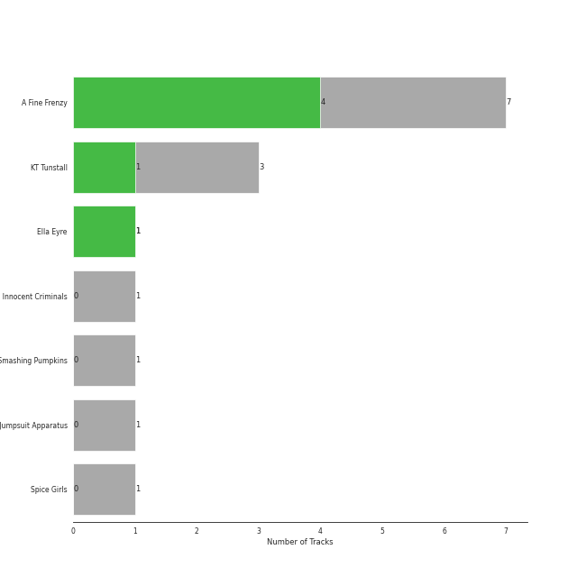

# Virgin Records

12 songs

Appears as:
- Virgin Records (8 tracks)
- Relentless/Virgin (3 tracks)
- Virgin Records Ltd (1 tracks)

## Top Artists

See all 4 artists

|   Number of Tracks | Art                                                                                              | Artist                | 🔗                                                           |
|-------------------:|:-------------------------------------------------------------------------------------------------|:----------------------|:------------------------------------------------------------|
|                  7 |  | A Fine Frenzy         | [🔗](https://open.spotify.com/artist/5dTYaRzOn4rXGBLH052EeQ) |
|                  3 |  | KT Tunstall           | [🔗](https://open.spotify.com/artist/5zzrJD2jXrE9dZ1AklRFcL) |
|                  1 |  | Ella Eyre             | [🔗](https://open.spotify.com/artist/66TrUkUZ3RM29dqeDQRgyA) |
|                  1 |  | The Smashing Pumpkins | [🔗](https://open.spotify.com/artist/40Yq4vzPs9VNUrIBG5Jr2i) |

## Top Albums

See all 6 albums

|   Number of Tracks | Art                                                                                              | Album                                                   | Release Date   | 🔗                                                          |
|-------------------:|:-------------------------------------------------------------------------------------------------|:--------------------------------------------------------|:---------------|:-----------------------------------------------------------|
|                  3 |  | One Cell In The Sea                                     | 2007           | [🔗](https://open.spotify.com/album/0Ot7MEgreG2R93aN42M9iK) |
|                  3 |  | Eye To The Telescope                                    | 2005-01-01     | [🔗](https://open.spotify.com/album/3j70PDKieTWQAwas3bPHRZ) |
|                  3 |  | Bomb In A Birdcage                                      | 2009-01-01     | [🔗](https://open.spotify.com/album/07IV5RxLvAUeZbcPm4zOzn) |
|                  1 |  | PINES                                                   | 2012-01-01     | [🔗](https://open.spotify.com/album/1876e9QcHkJ3Hgo4NqKXBN) |
|                  1 |  | Mellon Collie And The Infinite Sadness (Deluxe Edition) | 1995           | [🔗](https://open.spotify.com/album/55RhFRyQFihIyGf61MgcfV) |
|                  1 |  | Ella Eyre                                               | 2015-01-12     | [🔗](https://open.spotify.com/album/5J69OYtRXeI9dHDK2R95h5) |

## Genres

See all 14 genres

|   Number of Tracks | Genre                                     |
|-------------------:|:------------------------------------------|
|                 10 | [neo mellow](../genres/neo_mellow.md)     |
|                 10 | [lilith](../genres/lilith.md)             |
|                  7 | [acoustic pop](../genres/acoustic_pop.md) |
|                  4 | [pop rock](../genres/pop_rock.md)         |
|                  3 | scottish singer-songwriter                |
|                  1 | uk pop                                    |
|                  1 | tropical house                            |
|                  1 | spacegrunge                               |
|                  1 | [rock](../genres/rock.md)                 |
|                  1 | permanent wave                            |
|                  1 | grunge                                    |
|                  1 | [dance pop](../genres/dance_pop.md)       |
|                  1 | alternative rock                          |
|                  1 | alternative metal                         |

## Tracks released under Virgin Records

| Art                                                                                              | Track                           | Album                                                   | Artists               | Label                                   | 💚   | 🔗                                                          |
|:-------------------------------------------------------------------------------------------------|:--------------------------------|:--------------------------------------------------------|:----------------------|:----------------------------------------|:----|:-----------------------------------------------------------|
|  | Almost Lover                    | One Cell In The Sea                                     | A Fine Frenzy         | [Virgin Records](virgin_records.md)     |     | [🔗](https://open.spotify.com/track/3GSYWQNnSdovwC2H8HpziA) |
|  | Ashes And Wine                  | One Cell In The Sea                                     | A Fine Frenzy         | [Virgin Records](virgin_records.md)     | 💚   | [🔗](https://open.spotify.com/track/1l9Q5NyhsyodDzIrdtJ6Ub) |
|  | Whisper                         | One Cell In The Sea                                     | A Fine Frenzy         | [Virgin Records](virgin_records.md)     | 💚   | [🔗](https://open.spotify.com/track/3yUJDAcGYn66tg752ErDyC) |
|  | Blow Away                       | Bomb In A Birdcage                                      | A Fine Frenzy         | [Virgin Records](virgin_records.md)     | 💚   | [🔗](https://open.spotify.com/track/2phwpCR68nWlTy8ao0PnK2) |
|  | Electric Twist                  | Bomb In A Birdcage                                      | A Fine Frenzy         | [Virgin Records](virgin_records.md)     | 💚   | [🔗](https://open.spotify.com/track/2jQ7ZztDfmt4qeW0tOMIqY) |
|  | What I Wouldn't Do              | Bomb In A Birdcage                                      | A Fine Frenzy         | [Virgin Records](virgin_records.md)     |     | [🔗](https://open.spotify.com/track/54qVDnyXbaYeXSjF8cxFLs) |
|  | Now Is The Start                | PINES                                                   | A Fine Frenzy         | [Virgin Records](virgin_records.md)     |     | [🔗](https://open.spotify.com/track/3gEyA6UtRSk1058sev61D6) |
|  | If I Go                         | Ella Eyre                                               | Ella Eyre             | [Virgin Records Ltd](virgin_records.md) | 💚   | [🔗](https://open.spotify.com/track/5JO7yGfeJKYjbOXRRdNk64) |
|  | Black Horse And The Cherry Tree | Eye To The Telescope                                    | KT Tunstall           | [Relentless/Virgin](virgin_records.md)  | 💚   | [🔗](https://open.spotify.com/track/0qAMjeQFyd1qD0LDiV8gWp) |
|  | Other Side Of The World         | Eye To The Telescope                                    | KT Tunstall           | [Relentless/Virgin](virgin_records.md)  |     | [🔗](https://open.spotify.com/track/4A9E08l34BkPsCDAmOpHxb) |
|  | Suddenly I See                  | Eye To The Telescope                                    | KT Tunstall           | [Relentless/Virgin](virgin_records.md)  |     | [🔗](https://open.spotify.com/track/5p9XWUdvbUzmPCukOmwoU3) |
|  | 1979 - Remastered 2012          | Mellon Collie And The Infinite Sadness (Deluxe Edition) | The Smashing Pumpkins | [Virgin Records](virgin_records.md)     |     | [🔗](https://open.spotify.com/track/5QLHGv0DfpeXLNFo7SFEy1) |
