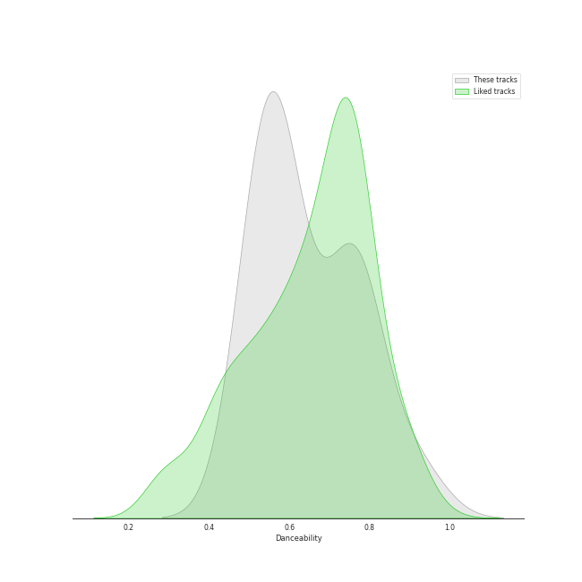
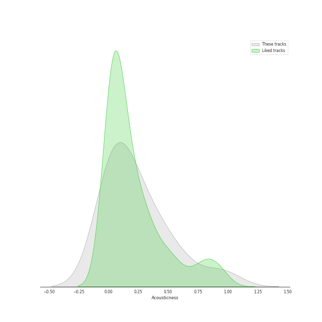
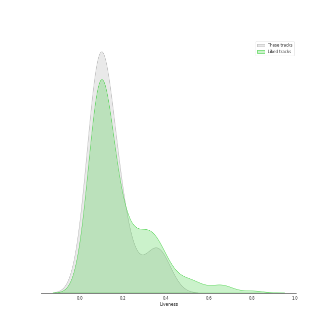
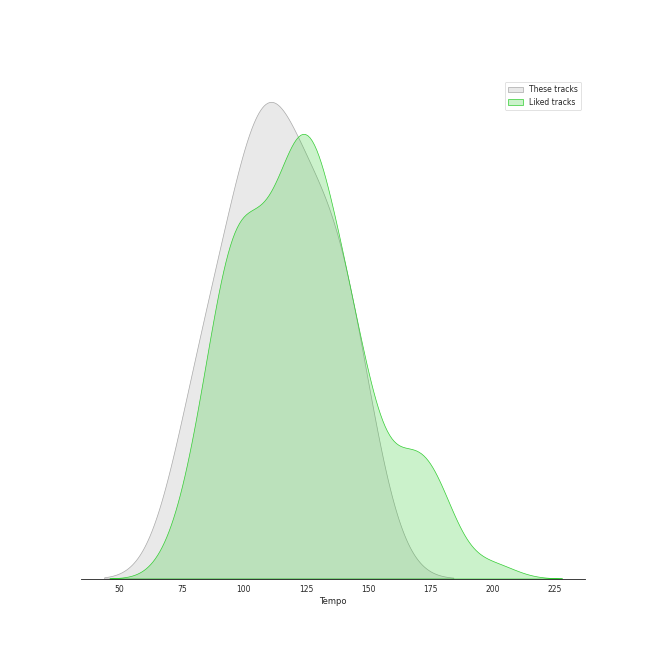

# Audio Features for Virgin Records

## Danceability

| 10 most Danceable tracks | 10 least Danceable tracks |
|:---|:---|
| Electric Twist (0.773) | Other Side Of The World (0.501) |
| 1979 - Remastered 2012 (0.767) | Ashes And Wine (0.528) |
| Black Horse And The Cherry Tree (0.748) | If I Go (0.545) |
| Blow Away (0.747) | Almost Lover (0.549) |
| What I Wouldn't Do (0.614) | Now Is The Start (0.559) |
| Suddenly I See (0.587) | Whisper (0.575) |
| Whisper (0.575) | Suddenly I See (0.587) |
| Now Is The Start (0.559) | What I Wouldn't Do (0.614) |
| Almost Lover (0.549) | Blow Away (0.747) |
| If I Go (0.545) | Black Horse And The Cherry Tree (0.748) |

## Energy

| 10 most Energetic tracks | 10 least Energetic tracks |
|:---|:---|
| Blow Away (0.789) | Almost Lover (0.24) |
| 1979 - Remastered 2012 (0.787) | Whisper (0.41) |
| Black Horse And The Cherry Tree (0.786) | Ashes And Wine (0.494) |
| Now Is The Start (0.781) | Electric Twist (0.646) |
| If I Go (0.778) | Other Side Of The World (0.684) |
| Suddenly I See (0.767) | What I Wouldn't Do (0.745) |
| What I Wouldn't Do (0.745) | Suddenly I See (0.767) |
| Other Side Of The World (0.684) | If I Go (0.778) |
| Electric Twist (0.646) | Now Is The Start (0.781) |
| Ashes And Wine (0.494) | Black Horse And The Cherry Tree (0.786) |

## Speechiness

| 10 most Speechy tracks | 10 least Speechy tracks |
|:---|:---|
| Electric Twist (0.125) | Whisper (0.0252) |
| Black Horse And The Cherry Tree (0.0641) | Other Side Of The World (0.0302) |
| Suddenly I See (0.0449) | Ashes And Wine (0.0329) |
| Blow Away (0.0429) | 1979 - Remastered 2012 (0.0331) |
| If I Go (0.0425) | Now Is The Start (0.0332) |
| What I Wouldn't Do (0.0399) | Almost Lover (0.0338) |
| Almost Lover (0.0338) | What I Wouldn't Do (0.0399) |
| Now Is The Start (0.0332) | If I Go (0.0425) |
| 1979 - Remastered 2012 (0.0331) | Blow Away (0.0429) |
| Ashes And Wine (0.0329) | Suddenly I See (0.0449) |

## Acousticness

| 10 most Acoustic tracks | 10 least Acoustic tracks |
|:---|:---|
| Almost Lover (0.947) | Now Is The Start (0.00124) |
| Whisper (0.616) | If I Go (0.00959) |
| Other Side Of The World (0.485) | 1979 - Remastered 2012 (0.0163) |
| What I Wouldn't Do (0.376) | Blow Away (0.035) |
| Black Horse And The Cherry Tree (0.328) | Electric Twist (0.079) |
| Suddenly I See (0.225) | Ashes And Wine (0.128) |
| Ashes And Wine (0.128) | Suddenly I See (0.225) |
| Electric Twist (0.079) | Black Horse And The Cherry Tree (0.328) |
| Blow Away (0.035) | What I Wouldn't Do (0.376) |
| 1979 - Remastered 2012 (0.0163) | Other Side Of The World (0.485) |

## Instrumentalness

| 10 most Instrumental tracks | 10 least Instrumental tracks |
|:---|:---|
| 1979 - Remastered 2012 (0.583) | Black Horse And The Cherry Tree (0.0) |
| Now Is The Start (0.0353) | Almost Lover (0.0) |
| Whisper (0.00168) | Other Side Of The World (0.0) |
| What I Wouldn't Do (0.00109) | If I Go (0.0) |
| Electric Twist (0.000297) | Suddenly I See (0.0) |
| Blow Away (3.88e-05) | Ashes And Wine (9.81e-06) |
| Ashes And Wine (9.81e-06) | Blow Away (3.88e-05) |
| Suddenly I See (0.0) | Electric Twist (0.000297) |
| If I Go (0.0) | What I Wouldn't Do (0.00109) |
| Other Side Of The World (0.0) | Whisper (0.00168) |

## Liveness

| 10 most Live tracks | 10 least Live tracks |
|:---|:---|
| Ashes And Wine (0.379) | 1979 - Remastered 2012 (0.0513) |
| Black Horse And The Cherry Tree (0.34) | Blow Away (0.0701) |
| If I Go (0.172) | Whisper (0.0708) |
| Suddenly I See (0.112) | Other Side Of The World (0.083) |
| Almost Lover (0.106) | Electric Twist (0.0866) |
| Now Is The Start (0.101) | What I Wouldn't Do (0.0977) |
| What I Wouldn't Do (0.0977) | Now Is The Start (0.101) |
| Electric Twist (0.0866) | Almost Lover (0.106) |
| Other Side Of The World (0.083) | Suddenly I See (0.112) |
| Whisper (0.0708) | If I Go (0.172) |

## Valence

| 10 most Happy tracks | 10 least Happy tracks |
|:---|:---|
| 1979 - Remastered 2012 (0.964) | Almost Lover (0.167) |
| Black Horse And The Cherry Tree (0.917) | Ashes And Wine (0.201) |
| Blow Away (0.891) | Now Is The Start (0.227) |
| Electric Twist (0.858) | Whisper (0.26) |
| Suddenly I See (0.664) | Other Side Of The World (0.369) |
| If I Go (0.589) | What I Wouldn't Do (0.407) |
| What I Wouldn't Do (0.407) | If I Go (0.589) |
| Other Side Of The World (0.369) | Suddenly I See (0.664) |
| Whisper (0.26) | Electric Twist (0.858) |
| Now Is The Start (0.227) | Blow Away (0.891) |

## Tempo

| 10 most Fast tracks | 10 least Fast tracks |
|:---|:---|
| If I Go (147.927) | Other Side Of The World (80.039) |
| Ashes And Wine (140.153) | Whisper (82.016) |
| Blow Away (136.014) | Suddenly I See (100.38) |
| Electric Twist (135.0) | Black Horse And The Cherry Tree (104.833) |
| 1979 - Remastered 2012 (126.879) | Now Is The Start (114.962) |
| Almost Lover (119.58) | What I Wouldn't Do (115.175) |
| What I Wouldn't Do (115.175) | Almost Lover (119.58) |
| Now Is The Start (114.962) | 1979 - Remastered 2012 (126.879) |
| Black Horse And The Cherry Tree (104.833) | Electric Twist (135.0) |
| Suddenly I See (100.38) | Blow Away (136.014) |
