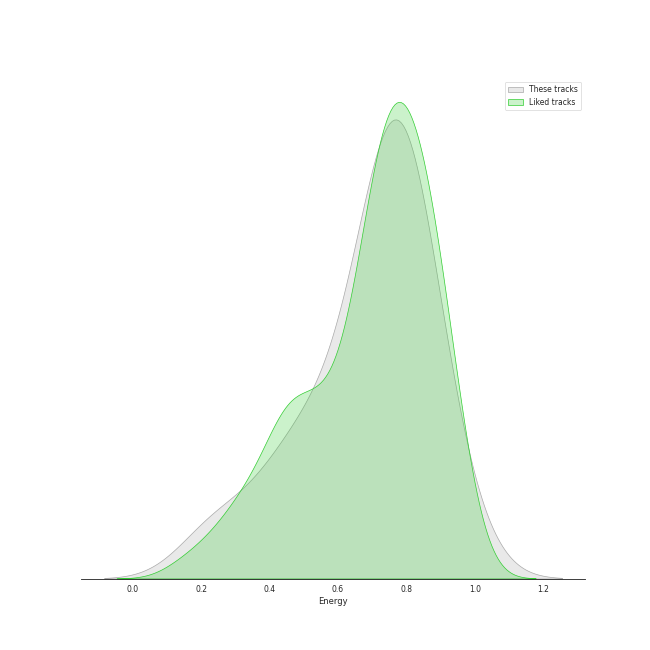
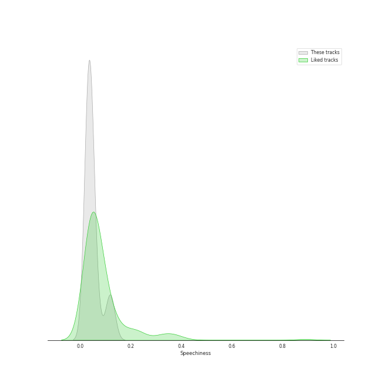
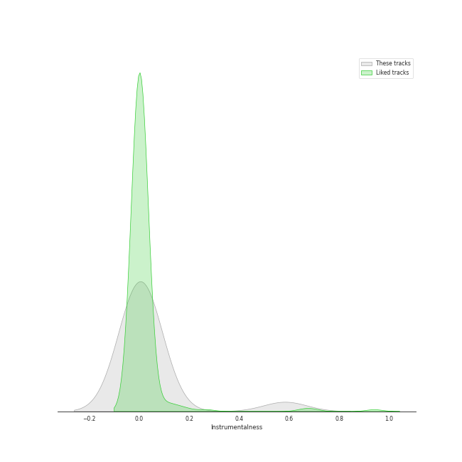
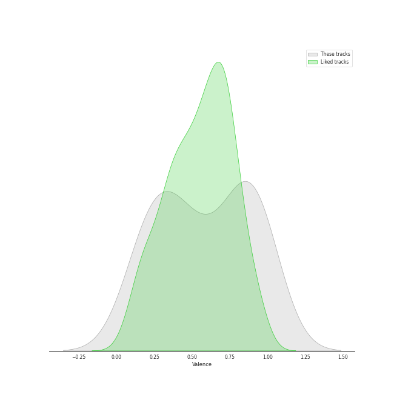

# Audio Features for Virgin Records

## Danceability

| ​ | 10 most Danceable tracks | ​​ | 10 least Danceable tracks |
|:---|:---|:---|:---|
|  | Electric Twist (0.773) |  | Other Side Of The World (0.501) |
|  | 1979 - Remastered 2012 (0.767) |  | Ashes And Wine (0.528) |
|  | Black Horse And The Cherry Tree (0.748) |  | If I Go (0.545) |
|  | Blow Away (0.747) |  | Almost Lover (0.549) |
|  | What I Wouldn't Do (0.614) |  | Now Is The Start (0.559) |
|  | Suddenly I See (0.587) |  | Whisper (0.575) |
|  | Whisper (0.575) |  | Suddenly I See (0.587) |
|  | Now Is The Start (0.559) |  | What I Wouldn't Do (0.614) |
|  | Almost Lover (0.549) |  | Blow Away (0.747) |
|  | If I Go (0.545) |  | Black Horse And The Cherry Tree (0.748) |

## Energy

| ​ | 10 most Energetic tracks | ​​ | 10 least Energetic tracks |
|:---|:---|:---|:---|
|  | Blow Away (0.789) |  | Almost Lover (0.24) |
|  | 1979 - Remastered 2012 (0.787) |  | Whisper (0.41) |
|  | Black Horse And The Cherry Tree (0.786) |  | Ashes And Wine (0.494) |
|  | Now Is The Start (0.781) |  | Electric Twist (0.646) |
|  | If I Go (0.778) |  | Other Side Of The World (0.684) |
|  | Suddenly I See (0.767) |  | What I Wouldn't Do (0.745) |
|  | What I Wouldn't Do (0.745) |  | Suddenly I See (0.767) |
|  | Other Side Of The World (0.684) |  | If I Go (0.778) |
|  | Electric Twist (0.646) |  | Now Is The Start (0.781) |
|  | Ashes And Wine (0.494) |  | Black Horse And The Cherry Tree (0.786) |

## Speechiness

| ​ | 10 most Speechy tracks | ​​ | 10 least Speechy tracks |
|:---|:---|:---|:---|
|  | Electric Twist (0.125) |  | Whisper (0.0252) |
|  | Black Horse And The Cherry Tree (0.0641) |  | Other Side Of The World (0.0302) |
|  | Suddenly I See (0.0449) |  | Ashes And Wine (0.0329) |
|  | Blow Away (0.0429) |  | 1979 - Remastered 2012 (0.0331) |
|  | If I Go (0.0425) |  | Now Is The Start (0.0332) |
|  | What I Wouldn't Do (0.0399) |  | Almost Lover (0.0338) |
|  | Almost Lover (0.0338) |  | What I Wouldn't Do (0.0399) |
|  | Now Is The Start (0.0332) |  | If I Go (0.0425) |
|  | 1979 - Remastered 2012 (0.0331) |  | Blow Away (0.0429) |
|  | Ashes And Wine (0.0329) |  | Suddenly I See (0.0449) |

## Acousticness

| ​ | 10 most Acoustic tracks | ​​ | 10 least Acoustic tracks |
|:---|:---|:---|:---|
|  | Almost Lover (0.947) |  | Now Is The Start (0.00124) |
|  | Whisper (0.616) |  | If I Go (0.00959) |
|  | Other Side Of The World (0.485) |  | 1979 - Remastered 2012 (0.0163) |
|  | What I Wouldn't Do (0.376) |  | Blow Away (0.035) |
|  | Black Horse And The Cherry Tree (0.328) |  | Electric Twist (0.079) |
|  | Suddenly I See (0.225) |  | Ashes And Wine (0.128) |
|  | Ashes And Wine (0.128) |  | Suddenly I See (0.225) |
|  | Electric Twist (0.079) |  | Black Horse And The Cherry Tree (0.328) |
|  | Blow Away (0.035) |  | What I Wouldn't Do (0.376) |
|  | 1979 - Remastered 2012 (0.0163) |  | Other Side Of The World (0.485) |

## Instrumentalness

| ​ | 10 most Instrumental tracks | ​​ | 10 least Instrumental tracks |
|:---|:---|:---|:---|
|  | 1979 - Remastered 2012 (0.583) |  | Black Horse And The Cherry Tree (0.0) |
|  | Now Is The Start (0.0353) |  | Almost Lover (0.0) |
|  | Whisper (0.00168) |  | Other Side Of The World (0.0) |
|  | What I Wouldn't Do (0.00109) |  | If I Go (0.0) |
|  | Electric Twist (0.000297) |  | Suddenly I See (0.0) |
|  | Blow Away (3.88e-05) |  | Ashes And Wine (9.81e-06) |
|  | Ashes And Wine (9.81e-06) |  | Blow Away (3.88e-05) |
|  | Suddenly I See (0.0) |  | Electric Twist (0.000297) |
|  | If I Go (0.0) |  | What I Wouldn't Do (0.00109) |
|  | Other Side Of The World (0.0) |  | Whisper (0.00168) |

## Liveness

| ​ | 10 most Live tracks | ​​ | 10 least Live tracks |
|:---|:---|:---|:---|
|  | Ashes And Wine (0.379) |  | 1979 - Remastered 2012 (0.0513) |
|  | Black Horse And The Cherry Tree (0.34) |  | Blow Away (0.0701) |
|  | If I Go (0.172) |  | Whisper (0.0708) |
|  | Suddenly I See (0.112) |  | Other Side Of The World (0.083) |
|  | Almost Lover (0.106) |  | Electric Twist (0.0866) |
|  | Now Is The Start (0.101) |  | What I Wouldn't Do (0.0977) |
|  | What I Wouldn't Do (0.0977) |  | Now Is The Start (0.101) |
|  | Electric Twist (0.0866) |  | Almost Lover (0.106) |
|  | Other Side Of The World (0.083) |  | Suddenly I See (0.112) |
|  | Whisper (0.0708) |  | If I Go (0.172) |

## Valence

| ​ | 10 most Happy tracks | ​​ | 10 least Happy tracks |
|:---|:---|:---|:---|
|  | 1979 - Remastered 2012 (0.964) |  | Almost Lover (0.167) |
|  | Black Horse And The Cherry Tree (0.917) |  | Ashes And Wine (0.201) |
|  | Blow Away (0.891) |  | Now Is The Start (0.227) |
|  | Electric Twist (0.858) |  | Whisper (0.26) |
|  | Suddenly I See (0.664) |  | Other Side Of The World (0.369) |
|  | If I Go (0.589) |  | What I Wouldn't Do (0.407) |
|  | What I Wouldn't Do (0.407) |  | If I Go (0.589) |
|  | Other Side Of The World (0.369) |  | Suddenly I See (0.664) |
|  | Whisper (0.26) |  | Electric Twist (0.858) |
|  | Now Is The Start (0.227) |  | Blow Away (0.891) |

## Tempo

| ​ | 10 most Fast tracks | ​​ | 10 least Fast tracks |
|:---|:---|:---|:---|
|  | If I Go (147.927) |  | Other Side Of The World (80.039) |
|  | Ashes And Wine (140.153) |  | Whisper (82.016) |
|  | Blow Away (136.014) |  | Suddenly I See (100.38) |
|  | Electric Twist (135.0) |  | Black Horse And The Cherry Tree (104.833) |
|  | 1979 - Remastered 2012 (126.879) |  | Now Is The Start (114.962) |
|  | Almost Lover (119.58) |  | What I Wouldn't Do (115.175) |
|  | What I Wouldn't Do (115.175) |  | Almost Lover (119.58) |
|  | Now Is The Start (114.962) |  | 1979 - Remastered 2012 (126.879) |
|  | Black Horse And The Cherry Tree (104.833) |  | Electric Twist (135.0) |
|  | Suddenly I See (100.38) |  | Blow Away (136.014) |
