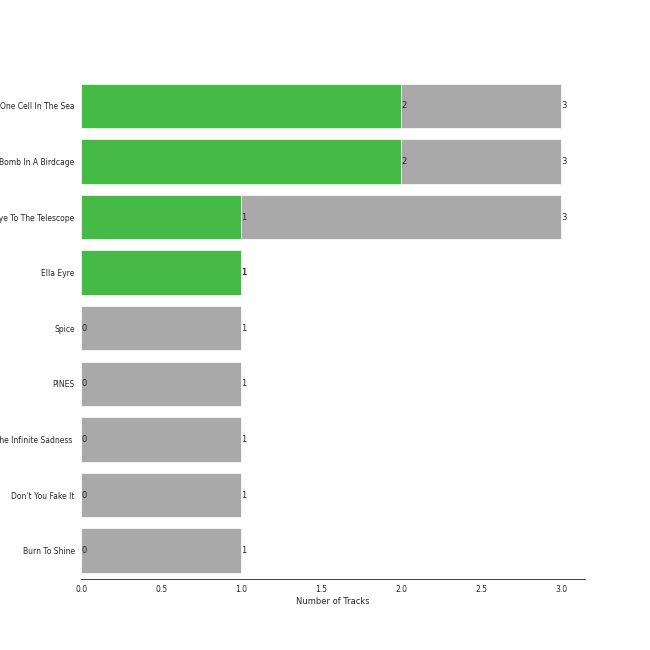
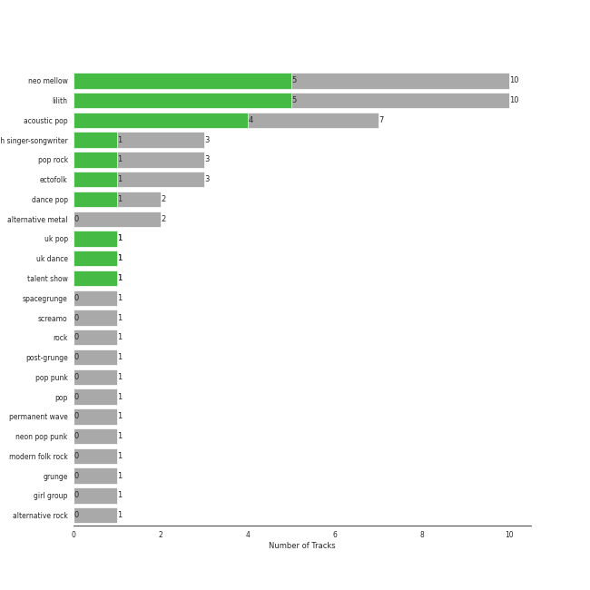
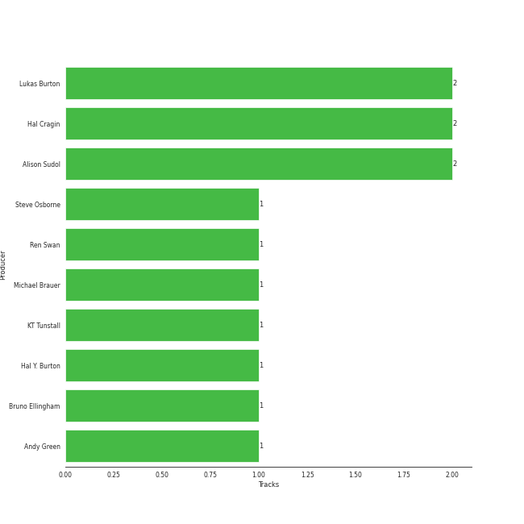

# Virgin Records

15 songs

[See Track Features](audio_features.md)

[See Clusters](clusters/overview.md)

Appears as:
- Virgin Records (11 tracks)
- Relentless/Virgin (3 tracks)
- Virgin Records Ltd (1 tracks)

## Top Artists

| Art | Rank | Tracks | 💚 | Artist | 🔗 |
|:---|---:|---:|---:|:---|:---|
|  | 297 | 7 | 4 | A Fine Frenzy | [🔗](https://open.spotify.com/artist/5dTYaRzOn4rXGBLH052EeQ) |
|  | 413 | 3 | 1 | KT Tunstall | [🔗](https://open.spotify.com/artist/5zzrJD2jXrE9dZ1AklRFcL) |
|  | 413 | 1 | 1 | Ella Eyre | [🔗](https://open.spotify.com/artist/66TrUkUZ3RM29dqeDQRgyA) |
|  | 413 | 1 | 0 | Ben Harper And The Innocent Criminals | [🔗](https://open.spotify.com/artist/7sJ9LR0mCMgFlzJ6Y9xP64) |
|  | 413 | 1 | 0 | The Smashing Pumpkins | [🔗](https://open.spotify.com/artist/40Yq4vzPs9VNUrIBG5Jr2i) |
|  | 413 | 1 | 0 | The Red Jumpsuit Apparatus | [🔗](https://open.spotify.com/artist/1SImpQO0GbjRgvlwCcCtFo) |
|  | 413 | 1 | 0 | Spice Girls | [🔗](https://open.spotify.com/artist/0uq5PttqEjj3IH1bzwcrXF) |

## Top Albums

| Art | Rank | Tracks | 💚 | Album | Release Date | 🔗 |
|:---|---:|---:|---:|:---|:---|:---|
|  | 602 | 3 | 2 | One Cell In The Sea | 2007 | [🔗](https://open.spotify.com/album/0Ot7MEgreG2R93aN42M9iK) |
|  | 381 | 3 | 2 | Bomb In A Birdcage | 2009-01-01 | [🔗](https://open.spotify.com/album/07IV5RxLvAUeZbcPm4zOzn) |
|  | 611 | 3 | 1 | Eye To The Telescope | 2005-01-01 | [🔗](https://open.spotify.com/album/3j70PDKieTWQAwas3bPHRZ) |
|  | 611 | 1 | 1 | Ella Eyre | 2015-01-12 | [🔗](https://open.spotify.com/album/5J69OYtRXeI9dHDK2R95h5) |
|  | 611 | 1 | 0 | Spice | 1996-01-01 | [🔗](https://open.spotify.com/album/3x2jF7blR6bFHtk4MccsyJ) |
|  | 611 | 1 | 0 | PINES | 2012-01-01 | [🔗](https://open.spotify.com/album/1876e9QcHkJ3Hgo4NqKXBN) |
|  | 611 | 1 | 0 | Mellon Collie And The Infinite Sadness (Deluxe Edition) | 1995 | [🔗](https://open.spotify.com/album/55RhFRyQFihIyGf61MgcfV) |
|  | 611 | 1 | 0 | Don't You Fake It | 2006-01-01 | [🔗](https://open.spotify.com/album/6TyPSzd5rA2rQ9yLJJ1Gg2) |
|  | 611 | 1 | 0 | Burn To Shine | 1999-09-21 | [🔗](https://open.spotify.com/album/51B1RzotO05EShjth3xkOZ) |

## Genres

| Tracks | 💚 | Genre |
|---:|---:|:---|
| 10 | 5 | [neo mellow](../../genres/neo_mellow/overview.md) |
| 10 | 5 | [lilith](../../genres/lilith/overview.md) |
| 7 | 4 | [acoustic pop](../../genres/acoustic_pop/overview.md) |
| 3 | 1 | scottish singer-songwriter |
| 3 | 1 | [pop rock](../../genres/pop_rock/overview.md) |
| 3 | 1 | [ectofolk](../../genres/ectofolk/overview.md) |
| 2 | 1 | [dance pop](../../genres/dance_pop/overview.md) |
| 1 | 1 | [uk pop](../../genres/uk_pop/overview.md) |
| 1 | 1 | uk dance |
| 1 | 1 | talent show |

See all 23 genres

| Tracks | 💚 | Genre |
|---:|---:|:---|
| 2 | 0 | alternative metal |
| 1 | 0 | spacegrunge |
| 1 | 0 | screamo |
| 1 | 0 | [rock](../../genres/rock/overview.md) |
| 1 | 0 | post-grunge |
| 1 | 0 | pop punk |
| 1 | 0 | [pop](../../genres/pop/overview.md) |
| 1 | 0 | [permanent wave](../../genres/permanent_wave/overview.md) |
| 1 | 0 | neon pop punk |
| 1 | 0 | modern folk rock |
| 1 | 0 | grunge |
| 1 | 0 | girl group |
| 1 | 0 | [alternative rock](../../genres/alternative_rock/overview.md) |

## Top Producers

| Art | Producer | Tracks | Credit Types |
|:---|:---|---:|:---|
| | Hal Cragin | 2 | Producer, Songwriter |
| | Lukas Burton | 2 | Producer, Songwriter |
| | Alison Sudol | 2 | Lyricist, Songwriter |
| | Hal Y. Burton | 1 | Producer |
| | Michael Brauer | 1 | Producer |
|  | KT Tunstall | 1 | Lyricist, Songwriter |
| | Andy Green | 1 | Producer |
| | Bruno Ellingham | 1 | Producer |
| | Steve Osborne | 1 | Producer |
| | Ren Swan | 1 | Producer |

## Tracks released under Virgin Records

| Art | Track | Album | Artists | Label | Rank | 💚 | 🔗 |
|:---|:---|:---|:---|:---|---:|:---|:---|
|  | Electric Twist | Bomb In A Birdcage | A Fine Frenzy | [Virgin Records](.) | 570 | 💚 | [🔗](https://open.spotify.com/track/2jQ7ZztDfmt4qeW0tOMIqY) |
|  | Blow Away | Bomb In A Birdcage | A Fine Frenzy | [Virgin Records](.) | 836 | 💚 | [🔗](https://open.spotify.com/track/2phwpCR68nWlTy8ao0PnK2) |
|  | Ashes And Wine | One Cell In The Sea | A Fine Frenzy | [Virgin Records](.) | 913 | 💚 | [🔗](https://open.spotify.com/track/1l9Q5NyhsyodDzIrdtJ6Ub) |
|  | 1979 - Remastered 2012 | Mellon Collie And The Infinite Sadness (Deluxe Edition) | The Smashing Pumpkins | [Virgin Records](.) | 920 | | [🔗](https://open.spotify.com/track/5QLHGv0DfpeXLNFo7SFEy1) |
|  | Wannabe | Spice | Spice Girls | [Virgin Records](.) | 920 | | [🔗](https://open.spotify.com/track/1Je1IMUlBXcx1Fz0WE7oPT) |
|  | Steal My Kisses | Burn To Shine | Ben Harper And The Innocent Criminals | [Virgin Records](.) | 920 | | [🔗](https://open.spotify.com/track/4cIwg5VY8Lo1NYwq7llOth) |
|  | Black Horse And The Cherry Tree | Eye To The Telescope | KT Tunstall | [Relentless/Virgin](.) | 920 | 💚 | [🔗](https://open.spotify.com/track/0qAMjeQFyd1qD0LDiV8gWp) |
|  | Other Side Of The World | Eye To The Telescope | KT Tunstall | [Relentless/Virgin](.) | 920 | | [🔗](https://open.spotify.com/track/4A9E08l34BkPsCDAmOpHxb) |
|  | Suddenly I See | Eye To The Telescope | KT Tunstall | [Relentless/Virgin](.) | 920 | | [🔗](https://open.spotify.com/track/5p9XWUdvbUzmPCukOmwoU3) |
|  | Face Down | Don't You Fake It | The Red Jumpsuit Apparatus | [Virgin Records](.) | 920 | | [🔗](https://open.spotify.com/track/4wzjNqjKAKDU82e8uMhzmr) |

See all tracks

| Art | Track | Album | Artists | Label | Rank | 💚 | 🔗 |
|:---|:---|:---|:---|:---|---:|:---|:---|
|  | Almost Lover | One Cell In The Sea | A Fine Frenzy | [Virgin Records](.) | 920 | | [🔗](https://open.spotify.com/track/3GSYWQNnSdovwC2H8HpziA) |
|  | Whisper | One Cell In The Sea | A Fine Frenzy | [Virgin Records](.) | 920 | 💚 | [🔗](https://open.spotify.com/track/3yUJDAcGYn66tg752ErDyC) |
|  | What I Wouldn't Do | Bomb In A Birdcage | A Fine Frenzy | [Virgin Records](.) | 920 | | [🔗](https://open.spotify.com/track/54qVDnyXbaYeXSjF8cxFLs) |
|  | Now Is The Start | PINES | A Fine Frenzy | [Virgin Records](.) | 920 | | [🔗](https://open.spotify.com/track/3gEyA6UtRSk1058sev61D6) |
|  | If I Go | Ella Eyre | Ella Eyre | [Virgin Records Ltd](.) | 920 | 💚 | [🔗](https://open.spotify.com/track/5JO7yGfeJKYjbOXRRdNk64) |

