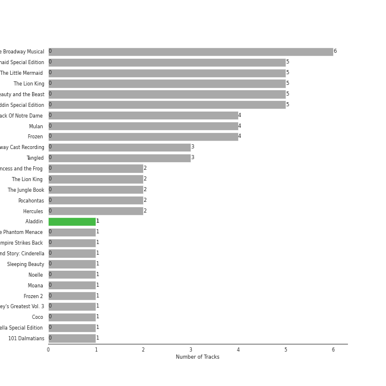
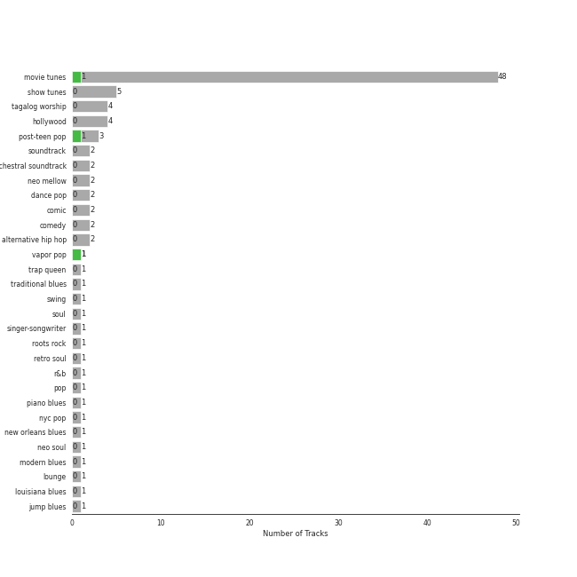

# Walt Disney Records

68 songs

[See Track Features](audio_features.md)

[See Clusters](clusters/overview.md)

Appears as:
- Walt Disney Records (68 tracks)

## Top Artists

| Art | Tracks | 💚 | Artist | 🔗 |
|:---|---:|---:|:---|:---|
|  | 24 | 0 | Disney | [🔗](https://open.spotify.com/artist/3xvaSlT4xsyk6lY1ESOspO) |
| | 4 | 0 | Beth Fowler | [🔗](https://open.spotify.com/artist/7KNW6OwcA260MsaEtnvhxV) |
|  | 4 | 0 | Lea Salonga | [🔗](https://open.spotify.com/artist/1GlMjIezcLwV3OFlX0uXOv) |
|  | 3 | 0 | Idina Menzel | [🔗](https://open.spotify.com/artist/73Np75Wv2tju61Eo9Zw4IR) |
|  | 3 | 0 | Tony Jay | [🔗](https://open.spotify.com/artist/5qQpn0ZokyamZjyKtkKUYD) |
| | 3 | 0 | Chorus - The Hunchback Of Notre Dame | [🔗](https://open.spotify.com/artist/5oHSxqr1uDloCbJJPNBd6T) |
|  | 3 | 0 | Daveed Diggs | [🔗](https://open.spotify.com/artist/3twuAojvYNrlWZpMkxLm3P) |
| | 3 | 0 | Chorus - Beauty And the Beast | [🔗](https://open.spotify.com/artist/3kWWBtNzJFtKA222gZz39d) |
|  | 3 | 0 | Kristen Bell | [🔗](https://open.spotify.com/artist/2kHxkdiKCSnHMkhIgFBZaI) |
| | 3 | 0 | Ensemble - The Lion King | [🔗](https://open.spotify.com/artist/0s0Hfb6ckk9qTjDeUOZXJp) |

See top 100 artists

| Art | Tracks | 💚 | Artist | 🔗 |
|:---|---:|---:|:---|:---|
|  | 3 | 0 | Angela Lansbury | [🔗](https://open.spotify.com/artist/0LtVJXnPR8msCJiE2DjHxy) |
|  | 2 | 0 | Judy Kuhn | [🔗](https://open.spotify.com/artist/7tHd518aPjJYUgyv9bidBz) |
|  | 2 | 0 | Paige O'Hara | [🔗](https://open.spotify.com/artist/7oavKrnYbTZPAPq7zCuipM) |
|  | 2 | 0 | Susan Egan | [🔗](https://open.spotify.com/artist/7CckquWatDQSr3PFKkjM8M) |
| | 2 | 0 | Samuel E. Wright | [🔗](https://open.spotify.com/artist/6Id8rcDNyBXPcgKQVfQ8rX) |
| | 2 | 0 | Burke Moses | [🔗](https://open.spotify.com/artist/64BC8AWWTaiOhej6ZYAXzv) |
|  | 2 | 0 | Joseph Williams | [🔗](https://open.spotify.com/artist/5xk0kRuXn1zToTHpHAqpui) |
| | 2 | 0 | Terrence Mann | [🔗](https://open.spotify.com/artist/5uBIsYz9WatgoViLG6pVj2) |
|  | 2 | 0 | Jerry Orbach | [🔗](https://open.spotify.com/artist/5i2OpmeVKsmViqoETxuOvO) |
|  | 2 | 0 | Jason Weaver | [🔗](https://open.spotify.com/artist/5UdPkKWd8YNR5xGcmqH9QJ) |
| | 2 | 0 | Tom Hulce | [🔗](https://open.spotify.com/artist/4wd5K3s3ekf0czSh2qGjTD) |
| | 2 | 0 | Heath Lamberts | [🔗](https://open.spotify.com/artist/4YYb7AZfDDAmEHSdNCtQfL) |
|  | 2 | 0 | Robin Williams | [🔗](https://open.spotify.com/artist/4OrieSJUghNfNx5UuPCgxF) |
| | 2 | 0 | Chorus - Mulan | [🔗](https://open.spotify.com/artist/4KpdqBDU2C5gB3vhdojuqA) |
|  | 2 | 0 | Bruce Reitherman | [🔗](https://open.spotify.com/artist/43HPW60tz4BMYMRnmXMagJ) |
|  | 2 | 0 | Brad Kane | [🔗](https://open.spotify.com/artist/3dAzSJ9lQnJSq5Z0OgDBep) |
|  | 2 | 0 | Awkwafina | [🔗](https://open.spotify.com/artist/3SmyWs7ou3udD8gtM0Z6Vx) |
|  | 2 | 0 | Halle | [🔗](https://open.spotify.com/artist/3HsVtnnjOUToyJThxaoBfx) |
| | 2 | 0 | Broadway Cast of Beauty and the Beast | [🔗](https://open.spotify.com/artist/31gtcs2n8ILyd09TvlSwJt) |
|  | 2 | 0 | Mandy Moore | [🔗](https://open.spotify.com/artist/2LJxr7Pt3JnP60eLxwbDOu) |
|  | 2 | 0 | Phil Harris | [🔗](https://open.spotify.com/artist/2ISMfPtVzHc9jDDVPUEHDa) |
|  | 2 | 0 | Kenny Raskin | [🔗](https://open.spotify.com/artist/28OYna1pjzLUp2TrXnkK6p) |
| | 2 | 0 | Sarah Solie Shannon | [🔗](https://open.spotify.com/artist/1A2F6sucjT7YDTJtVtB9Oz) |
|  | 2 | 0 | Lebo M. | [🔗](https://open.spotify.com/artist/0zp9qNDSeYi3QEodhcKAAA) |
|  | 2 | 0 | Richard White | [🔗](https://open.spotify.com/artist/0jWqALm6pl5CHj5N0eO68G) |
| | 2 | 0 | Linda Talcott | [🔗](https://open.spotify.com/artist/0XmsLZGAfaW5GvksORVlXJ) |
| | 2 | 0 | Ernie Sabella | [🔗](https://open.spotify.com/artist/0RH6EMxqfzCEB7QCSKQ4xr) |
|  | 2 | 0 | Nathan Lane | [🔗](https://open.spotify.com/artist/0P0do9GwiSgweSF6Ui3mrv) |
| | 2 | 0 | Gary Beach | [🔗](https://open.spotify.com/artist/0OckhIDFyA68SQXxyefMcH) |
|  | 2 | 0 | David Ogden Stiers | [🔗](https://open.spotify.com/artist/0N0dbr5s2y20PAo2cDAeVP) |
| | 2 | 0 | Paige Price | [🔗](https://open.spotify.com/artist/0GzTqQj6pGeI2iW6cA0uSR) |
|  | 1 | 0 | Brian Press | [🔗](https://open.spotify.com/artist/7ytM1slwsB4EJ8JYhMtBmf) |
|  | 1 | 0 | Seth Rogen | [🔗](https://open.spotify.com/artist/7xX39IyguhWsTIg4eU2reH) |
| | 1 | 0 | Jason Raize | [🔗](https://open.spotify.com/artist/7wtyPvLmy8LAf2CO0Xwy4p) |
|  | 1 | 0 | Sally Dworsky | [🔗](https://open.spotify.com/artist/7vK6xoR5zT4DypEu0blUku) |
|  | 1 | 0 | Verna Felton | [🔗](https://open.spotify.com/artist/7aU90hxXexP47nEeMee6xM) |
| | 1 | 0 | Billy Bletcher | [🔗](https://open.spotify.com/artist/7MCVs8C2nykvXVyTyrUoVd) |
| | 1 | 0 | Harvey Fierstein | [🔗](https://open.spotify.com/artist/7G6zawIBBtDX1WvuT97Ei9) |
|  | 1 | 0 | Vaneese Thomas | [🔗](https://open.spotify.com/artist/79cmm0PKrLWIrqp80GpJtK) |
|  | 1 | 0 | Childish Gambino | [🔗](https://open.spotify.com/artist/73sIBHcqh3Z3NyqHKZ7FOL) |
|  | 1 | 0 | Laura Williams | [🔗](https://open.spotify.com/artist/6wIj7GdxBjFtw6ySpzazwo) |
|  | 1 | 0 | [Beyoncé](../../artists/beyonc_/overview.md) | [🔗](https://open.spotify.com/artist/6vWDO969PvNqNYHIOW5v0m) |
| | 1 | 0 | Agatha Lee Monn | [🔗](https://open.spotify.com/artist/6kHu5ICQRBZdsAHjAjQlmp) |
| | 1 | 0 | Max Casella | [🔗](https://open.spotify.com/artist/6ZpL3BxODab84CTGSL7UO8) |
|  | 1 | 0 | Jeremy Irons | [🔗](https://open.spotify.com/artist/6QRb3jE2lCfMU1iUuVQMaV) |
|  | 1 | 0 | Carmen Twillie | [🔗](https://open.spotify.com/artist/6O3ZB5Cz5CNT3wQWouKcNJ) |
|  | 1 | 0 | Paul Kandel | [🔗](https://open.spotify.com/artist/6M3XR163Q68THc9IFMwfAH) |
|  | 1 | 0 | Cheech Marin | [🔗](https://open.spotify.com/artist/68TP2Pr8i7dvyFHU0p748r) |
|  | 1 | 0 | Bruce Adler | [🔗](https://open.spotify.com/artist/66oKiXdIQP7MwN0gPUY0FD) |
| | 1 | 0 | Roz Ryan | [🔗](https://open.spotify.com/artist/66mvEj9XSF89tUj87Y3HDu) |
| | 1 | 0 | Rene Auberjonois | [🔗](https://open.spotify.com/artist/5vLv7RBpAmIPypST2zhKUw) |
|  | 1 | 0 | Lawrence | [🔗](https://open.spotify.com/artist/5rwUYLyUq8gBsVaOUcUxpE) |
|  | 1 | 0 | Auli'i Cravalho | [🔗](https://open.spotify.com/artist/5mnS9jJdKQQcRSqFu5YPVe) |
|  | 1 | 0 | Donny Osmond | [🔗](https://open.spotify.com/artist/5ZEAzHE2TzAwUcOj6jMIgf) |
|  | 1 | 0 | Rowan Atkinson | [🔗](https://open.spotify.com/artist/5U4QDnlOlmZx9MHV45EoDE) |
|  | 1 | 0 | Lillias White | [🔗](https://open.spotify.com/artist/5TKKPpY9zr2qrz3JM3Vawq) |
| | 1 | 0 | Katie Lopez | [🔗](https://open.spotify.com/artist/5Kkhk21siwbW3BfZUwpykJ) |
|  | 1 | 0 | Stolen Jars | [🔗](https://open.spotify.com/artist/5EAJ2dKLdisq7BOJHQ1B7r) |
| | 1 | 0 | Donna Murphy | [🔗](https://open.spotify.com/artist/5BuTOT6mPoNZ5EmaPheBI9) |
| | 1 | 0 | Jesse Corti | [🔗](https://open.spotify.com/artist/53vhGhGRoi9ARM7kr3jrz5) |
|  | 1 | 0 | Louis Prima | [🔗](https://open.spotify.com/artist/52lBOxCxbJg0ttXEW9CQpW) |
| | 1 | 0 | Kristle Edwards | [🔗](https://open.spotify.com/artist/4y5d67UxD0QON2vRZOjXZ6) |
|  | 1 | 0 | Roger Bart | [🔗](https://open.spotify.com/artist/4sZw3BLoQ9SniX4mcoh80b) |
|  | 1 | 0 | Jodi Benson | [🔗](https://open.spotify.com/artist/4mmMtabvFCKA6HfmVmitNH) |
| | 1 | 0 | Pinto Colvig | [🔗](https://open.spotify.com/artist/4X8LTt7CXvrqzfS4G4ONUX) |
|  | 1 | 0 | Ilene Woods | [🔗](https://open.spotify.com/artist/4DovRSplr3yJIeE3r0RtHj) |
|  | 1 | 0 | Santino Fontana | [🔗](https://open.spotify.com/artist/47NluEnhJda2gsnjuvcoob) |
|  | 1 | 0 | Tsidii Le Loka | [🔗](https://open.spotify.com/artist/478Cvh1XjJiURpkqbM23SV) |
|  | 1 | 0 | Faca Kulu | [🔗](https://open.spotify.com/artist/43YEHQb9ZzZBBgTMKtgJmG) |
|  | 1 | 0 | Cast - The Little Mermaid | [🔗](https://open.spotify.com/artist/433fI3xZoJp1D1dizEkJ3R) |
| | 1 | 0 | LaChanze | [🔗](https://open.spotify.com/artist/3zT7dcLl9wbSXsVh3VQx3A) |
| | 1 | 0 | Jerry Tondo | [🔗](https://open.spotify.com/artist/3wUpOiaLjwAZNregbC7CxO) |
|  | 1 | 0 | Shahadi Wright Joseph | [🔗](https://open.spotify.com/artist/3qBrg0c1loxePyWQxp6F75) |
| | 1 | 0 | Mice Chorus | [🔗](https://open.spotify.com/artist/3gcnVAcMBdtYbril7EqBz6) |
|  | 1 | 0 | Matthew Wilder | [🔗](https://open.spotify.com/artist/3bmFPbLMiLxtR9tFrTcKcP) |
| | 1 | 0 | Zachary Levi | [🔗](https://open.spotify.com/artist/3XSyTI9ct70ZheMESAv2st) |
| | 1 | 0 | Ensemble - The Little Mermaid | [🔗](https://open.spotify.com/artist/3WoPXSBmNV9DJnxZgnU224) |
|  | 1 | 0 | Bill Lee | [🔗](https://open.spotify.com/artist/3UcnwnNwP6egaBs7DAgRdJ) |
| | 1 | 0 | Barbara Marineau | [🔗](https://open.spotify.com/artist/3UHGebThLKTMzANl7f83P9) |
|  | 1 | 0 | Robby Benson | [🔗](https://open.spotify.com/artist/3QcGV278a6mmLRTOK29WBP) |
|  | 1 | 0 | Jim Cummings | [🔗](https://open.spotify.com/artist/3OIPwMAZipDCLQwHmxS5EG) |
| | 1 | 0 | Cheryl Freeman | [🔗](https://open.spotify.com/artist/3E0MPcbZSjfJ1HsnJKXkqd) |
|  | 1 | 0 | Dr. John | [🔗](https://open.spotify.com/artist/320TrJub4arztwXRm7kqVO) |
|  | 1 | 0 | Heather Headley | [🔗](https://open.spotify.com/artist/2xDc4cU0Rj6YG8SrmAHIy0) |
|  | 1 | 0 | JD McCrary | [🔗](https://open.spotify.com/artist/2wrxoZjEVKfJZhxCiqK0ju) |
| | 1 | 0 | Chorus - Hercules | [🔗](https://open.spotify.com/artist/2pLvZNFSNqj5ggB8cPK7ki) |
|  | 1 | 0 | Marni Nixon | [🔗](https://open.spotify.com/artist/2Npf96k0QoY8YYwqnELDmQ) |
| | 1 | 0 | Stacey Logan | [🔗](https://open.spotify.com/artist/2HCcvZjqbz0BWWBLG5Yzgu) |
| | 1 | 0 | Heidi Mollenhauer | [🔗](https://open.spotify.com/artist/2FmXrymxv6kNBnA66HpoPt) |
|  | 1 | 0 | Tawatha Agee | [🔗](https://open.spotify.com/artist/26j9y8Rq679tININ1Mt4ZV) |

## Top Albums

| Art | Tracks | 💚 | Album | Release Date | 🔗 |
|:---|---:|---:|:---|:---|:---|
|  | 6 | 0 | Beauty And The Beast: The Broadway Musical | 1994 | [🔗](https://open.spotify.com/album/3Pzoe4ffuNsxdgTHGaFJmo) |
|  | 5 | 0 | The Little Mermaid Special Edition | 2006-01-01 | [🔗](https://open.spotify.com/album/4aAwvCRNJIqiUGVEjieWv6) |
|  | 5 | 0 | The Little Mermaid (Original Motion Picture Soundtrack) | 2023-05-19 | [🔗](https://open.spotify.com/album/40tsP3taBOC9HqNaLCZZKP) |
|  | 5 | 0 | The Lion King | 1994-01-01 | [🔗](https://open.spotify.com/album/3YA5DdB3wSz4pdfEXoMyRd) |
|  | 5 | 0 | Beauty and the Beast | 1991-01-01 | [🔗](https://open.spotify.com/album/3O5p9VNddbwvqWTdYKEqV5) |
|  | 5 | 0 | Aladdin Special Edition | 2004-01-01 | [🔗](https://open.spotify.com/album/7bt2aty3lUo6Q1Ud8pthRz) |
|  | 4 | 0 | The Hunchback Of Notre Dame (Original Motion Picture Soundtrack) | 1996-05-28 | [🔗](https://open.spotify.com/album/7btQeUDTIIfnh2iCQ8Pfhq) |
|  | 4 | 0 | Mulan (Original Soundtrack) | 1998-01-01 | [🔗](https://open.spotify.com/album/3Ohs7Jo6GM6mydUOL0m5aC) |
|  | 4 | 0 | Frozen (Original Motion Picture Soundtrack / Deluxe Edition) | 2013-01-01 | [🔗](https://open.spotify.com/album/7lZs5r4oQV2nutddffLrg0) |
|  | 3 | 0 | The Lion King: Original Broadway Cast Recording | 1997-01-01 | [🔗](https://open.spotify.com/album/1y6p6tINBthUWsQVQJmiYK) |

See all 25 albums

| Art | Tracks | 💚 | Album | Release Date | 🔗 |
|:---|---:|---:|:---|:---|:---|
|  | 3 | 0 | Tangled | 2010-01-01 | [🔗](https://open.spotify.com/album/1l0aFrH24oPrQSqGtfeFyE) |
|  | 2 | 0 | The Princess and the Frog (Original Motion Picture Soundtrack) | 2009-11-23 | [🔗](https://open.spotify.com/album/0CcL28OkH89kjgKpNZC8sW) |
|  | 2 | 0 | The Lion King (Original Motion Picture Soundtrack) | 2019-07-11 | [🔗](https://open.spotify.com/album/7e8y48Z2fkJNGBOKSECCeS) |
|  | 2 | 0 | The Jungle Book | 1997-01-01 | [🔗](https://open.spotify.com/album/7zdZNXoapFcOW663zgLdOE) |
|  | 2 | 0 | Pocahontas | 1995-01-01 | [🔗](https://open.spotify.com/album/7L6kEZVkWh7OEI71b1JHZd) |
|  | 2 | 0 | Hercules (Original Motion Picture Soundtrack) | 1997-01-01 | [🔗](https://open.spotify.com/album/1wbY6VUchNsZLaDi22eD3J) |
|  | 1 | 0 | Songs and Story: Cinderella | 2009-01-01 | [🔗](https://open.spotify.com/album/1d4rBfCtXPqkphzbvjokLa) |
|  | 1 | 0 | Sleeping Beauty | 1996-01-01 | [🔗](https://open.spotify.com/album/3U3I9TY7on88tPvM1guh54) |
|  | 1 | 0 | Noelle (Original Motion Picture Soundtrack) | 2019-11-12 | [🔗](https://open.spotify.com/album/7GZR54Ir7Aq5T34aRhJQfw) |
|  | 1 | 0 | Moana (Original Motion Picture Soundtrack/Deluxe Edition) | 2016-11-18 | [🔗](https://open.spotify.com/album/6pZj4nvx6lV3ulIK3BSjvs) |
|  | 1 | 0 | Frozen 2 (Original Motion Picture Soundtrack/Deluxe Edition) | 2019-11-15 | [🔗](https://open.spotify.com/album/4M07HWIlZr7zoXoxDHR5mz) |
|  | 1 | 0 | Disney's Greatest Vol. 3 | 2002-08-20 | [🔗](https://open.spotify.com/album/6UuNvv5UFJG5bQkYzQIarh) |
|  | 1 | 0 | Coco (Original Motion Picture Soundtrack) | 2017-11-10 | [🔗](https://open.spotify.com/album/7nMexBA71PdwPnfqS5Yji5) |
|  | 1 | 0 | Cinderella Special Edition (Original Motion Picture Soundtrack/Japanese Version) | 2005-10-19 | [🔗](https://open.spotify.com/album/3QAxBLpXRLVMh1dRtuQa0q) |
|  | 1 | 0 | 101 Dalmatians | 1998-01-01 | [🔗](https://open.spotify.com/album/6hcQqEfqHDkQZl1bdgr4Vr) |

## Genres

| Tracks | 💚 | Genre |
|---:|---:|:---|
| 48 | 0 | [movie tunes](../../genres/movie_tunes/overview.md) |
| 5 | 0 | [show tunes](../../genres/show_tunes/overview.md) |
| 4 | 0 | tagalog worship |
| 2 | 0 | [post-teen pop](../../genres/post_teen_pop/overview.md) |
| 2 | 0 | [neo mellow](../../genres/neo_mellow/overview.md) |
| 2 | 0 | hollywood |
| 2 | 0 | [dance pop](../../genres/dance_pop/overview.md) |
| 2 | 0 | comic |
| 2 | 0 | comedy |
| 2 | 0 | [broadway](../../genres/broadway/overview.md) |

See all 36 genres

| Tracks | 💚 | Genre |
|---:|---:|:---|
| 2 | 0 | alternative hip hop |
| 1 | 0 | trap queen |
| 1 | 0 | traditional blues |
| 1 | 0 | swing |
| 1 | 0 | [soul](../../genres/soul/overview.md) |
| 1 | 0 | roots rock |
| 1 | 0 | retro soul |
| 1 | 0 | [r&b](../../genres/r_b/overview.md) |
| 1 | 0 | [pop](../../genres/pop/overview.md) |
| 1 | 0 | piano blues |
| 1 | 0 | nyc pop |
| 1 | 0 | new orleans blues |
| 1 | 0 | neo soul |
| 1 | 0 | modern blues |
| 1 | 0 | [lounge](../../genres/lounge/overview.md) |
| 1 | 0 | louisiana blues |
| 1 | 0 | jump blues |
| 1 | 0 | jazz blues |
| 1 | 0 | hip pop |
| 1 | 0 | escape room |
| 1 | 0 | comedy rap |
| 1 | 0 | bubblegum pop |
| 1 | 0 | blues |
| 1 | 0 | asian american hip hop |
| 1 | 0 | [adult standards](../../genres/adult_standards/overview.md) |
| 1 | 0 | acoustic blues |

## Tracks released under Walt Disney Records

| Art | Track | Album | Artists | Label | 💚 | 🔗 |
|:---|:---|:---|:---|:---|:---|:---|
|  | Be Our Guest | Beauty and the Beast | Angela Lansbury, Jerry Orbach, Chorus - Beauty And the Beast, Disney | [Walt Disney Records](.) | | [🔗](https://open.spotify.com/track/6btdYzQ8eZFBrOlUKVHuz0) |
|  | Beauty and the Beast | Beauty and the Beast | Angela Lansbury, Disney | [Walt Disney Records](.) | | [🔗](https://open.spotify.com/track/2rJFFUEl1LURkV0b0OARXx) |
|  | How Far I'll Go | Moana (Original Motion Picture Soundtrack/Deluxe Edition) | Auli'i Cravalho | [Walt Disney Records](.) | | [🔗](https://open.spotify.com/track/6mb6lVLNrcUgLnEN8QnDJd) |
|  | The Scuttlebutt | The Little Mermaid (Original Motion Picture Soundtrack) | Awkwafina, Daveed Diggs, Disney | [Walt Disney Records](.) | | [🔗](https://open.spotify.com/track/2wLDS3oCMufFrvwN2IK3Bt) |
|  | Beauty and the Beast | Beauty And The Beast: The Broadway Musical | Beth Fowler | [Walt Disney Records](.) | | [🔗](https://open.spotify.com/track/0ABGlKA3v3RYjrcKVYuCfT) |
|  | Can You Feel the Love Tonight | The Lion King (Original Motion Picture Soundtrack) | [Beyoncé](../../artists/beyonc_/overview.md), Childish Gambino, Billy Eichner, Seth Rogen | [Walt Disney Records](.) | | [🔗](https://open.spotify.com/track/1zSKtBze2IReYU44W0lDzd) |
|  | Cruella De Vil - From "101 Dalmatians"/Soundtrack Version | 101 Dalmatians | Bill Lee | [Walt Disney Records](.) | | [🔗](https://open.spotify.com/track/2tkIIkF3CPqsmYhsncNEGN) |
|  | One Jump Ahead | Aladdin Special Edition | Brad Kane, Disney | [Walt Disney Records](.) | | [🔗](https://open.spotify.com/track/69ZNzwrCGP6h5ewkJQWWaT) |
|  | Arabian Nights | Aladdin Special Edition | Bruce Adler, Disney | [Walt Disney Records](.) | | [🔗](https://open.spotify.com/track/31vVcYpecILSQ02PIGdqYi) |
|  | Circle of Life | The Lion King | Carmen Twillie, Lebo M. | [Walt Disney Records](.) | | [🔗](https://open.spotify.com/track/0HU5JnVaKNTWf6GykV9Zn8) |

See all tracks

| Art | Track | Album | Artists | Label | 💚 | 🔗 |
|:---|:---|:---|:---|:---|:---|:---|
|  | Zero To Hero | Hercules (Original Motion Picture Soundtrack) | Chorus - Hercules, Lillias White, Cheryl Freeman, LaChanze, Roz Ryan, Vaneese Thomas, Tawatha Agee, Disney | [Walt Disney Records](.) | | [🔗](https://open.spotify.com/track/4zDfgax6Ihb0UWdour1ZEs) |
|  | Kiss the Girl | The Little Mermaid (Original Motion Picture Soundtrack) | Daveed Diggs, Awkwafina, Jacob Tremblay, Ensemble - The Little Mermaid, Disney | [Walt Disney Records](.) | | [🔗](https://open.spotify.com/track/2f2F4z8BOi15hum9aEVDUP) |
|  | Under the Sea | The Little Mermaid (Original Motion Picture Soundtrack) | Daveed Diggs, Cast - The Little Mermaid, Disney | [Walt Disney Records](.) | | [🔗](https://open.spotify.com/track/7Cux0Rc1hY5Pt5T28apnzv) |
|  | The Bells of Notre Dame | The Hunchback Of Notre Dame (Original Motion Picture Soundtrack) | David Ogden Stiers, Tony Jay, Paul Kandel, Chorus - The Hunchback Of Notre Dame | [Walt Disney Records](.) | | [🔗](https://open.spotify.com/track/47Wo2LeGbzdZTdEFNRZXV0) |
|  | Mother Knows Best - From "Tangled"/Soundtrack Version | Tangled | Donna Murphy | [Walt Disney Records](.) | | [🔗](https://open.spotify.com/track/1lOSxJNCLvWm2bYaTcTSmK) |
|  | I'll Make a Man Out of You | Mulan (Original Soundtrack) | Donny Osmond, Chorus - Mulan, Disney | [Walt Disney Records](.) | | [🔗](https://open.spotify.com/track/28UMEtwyUUy5u0UWOVHwiI) |
|  | Down in New Orleans | The Princess and the Frog (Original Motion Picture Soundtrack) | Dr. John | [Walt Disney Records](.) | | [🔗](https://open.spotify.com/track/4tCdoXt7EiwZZhMevxmY8u) |
|  | Remember Me (Lullaby) | Coco (Original Motion Picture Soundtrack) | Gael Garcia Bernal, Gabriella Flores, Libertad García Fonzi | [Walt Disney Records](.) | | [🔗](https://open.spotify.com/track/2cFGv8v5DcbJXHEdzouFne) |
|  | Be Our Guest | Beauty And The Beast: The Broadway Musical | Gary Beach, Beth Fowler, Heath Lamberts, Barbara Marineau, Brian Press, Stacey Logan, Broadway Cast of Beauty and the Beast | [Walt Disney Records](.) | | [🔗](https://open.spotify.com/track/6zRiCeiJUvnalwwSfPrn3f) |
|  | Part of Your World | The Little Mermaid (Original Motion Picture Soundtrack) | Halle | [Walt Disney Records](.) | | [🔗](https://open.spotify.com/track/2HRhVQ0yo1jIvXoRTCIdEz) |
|  | Part of Your World (Reprise) | The Little Mermaid (Original Motion Picture Soundtrack) | Halle | [Walt Disney Records](.) | | [🔗](https://open.spotify.com/track/1aYdJNJT480JVCPYayogh6) |
|  | Can You Feel The Love Tonight | The Lion King: Original Broadway Cast Recording | Heather Headley, Jason Raize, Max Casella, Tom Alan Robbins, Ensemble - The Lion King | [Walt Disney Records](.) | | [🔗](https://open.spotify.com/track/7zb4dWm9K6Hr4kk1pOwSDS) |
|  | God Help the Outcasts | The Hunchback Of Notre Dame (Original Motion Picture Soundtrack) | Heidi Mollenhauer, Chorus - The Hunchback Of Notre Dame | [Walt Disney Records](.) | | [🔗](https://open.spotify.com/track/67KymXb4OUQtUlO31EFOjS) |
|  | Let It Go - From "Frozen"/Soundtrack Version | Frozen (Original Motion Picture Soundtrack / Deluxe Edition) | Idina Menzel | [Walt Disney Records](.) | | [🔗](https://open.spotify.com/track/0qcr5FMsEO85NAQjrlDRKo) |
|  | Into the Unknown | Frozen 2 (Original Motion Picture Soundtrack/Deluxe Edition) | Idina Menzel, AURORA | [Walt Disney Records](.) | | [🔗](https://open.spotify.com/track/3Z0oQ8r78OUaHvGPiDBR3W) |
|  | A Dream Is a Wish Your Heart Makes | Cinderella Special Edition (Original Motion Picture Soundtrack/Japanese Version) | Ilene Woods, Mice Chorus | [Walt Disney Records](.) | | [🔗](https://open.spotify.com/track/6PiTsEEiNYU9a9xXowi9i5) |
|  | I Just Can't Wait to Be King | The Lion King (Original Motion Picture Soundtrack) | JD McCrary, Shahadi Wright Joseph, John Oliver | [Walt Disney Records](.) | | [🔗](https://open.spotify.com/track/2xUdYfY3LpJb4Iv37RypnO) |
|  | I Just Can't Wait to Be King | The Lion King | Jason Weaver, Rowan Atkinson, Laura Williams | [Walt Disney Records](.) | | [🔗](https://open.spotify.com/track/0qxtQ8rf3W1nId3D2r0xH4) |
|  | Be Prepared | The Lion King | Jeremy Irons, Whoopi Goldberg, Cheech Marin, Jim Cummings | [Walt Disney Records](.) | | [🔗](https://open.spotify.com/track/34nxgXFCPzDphUJGuRsn10) |
|  | Part of Your World | The Little Mermaid Special Edition | Jodi Benson, Disney | [Walt Disney Records](.) | | [🔗](https://open.spotify.com/track/7tUSJY4nsDBJTjd1UXKRsT) |
|  | Can You Feel the Love Tonight | The Lion King | Joseph Williams, Sally Dworsky, Nathan Lane, Ernie Sabella, Kristle Edwards | [Walt Disney Records](.) | | [🔗](https://open.spotify.com/track/5E8yddtSG3sH4hw2SfwcgW) |
|  | Colors of the Wind | Pocahontas | Judy Kuhn | [Walt Disney Records](.) | | [🔗](https://open.spotify.com/track/1OYOLWqKmhkFIx2KC9ek1a) |
|  | Just Around the Riverbend | Pocahontas | Judy Kuhn | [Walt Disney Records](.) | | [🔗](https://open.spotify.com/track/6P316E7tFylzpVrDrXVF9s) |
|  | Friends on the Other Side | The Princess and the Frog (Original Motion Picture Soundtrack) | Keith David | [Walt Disney Records](.) | | [🔗](https://open.spotify.com/track/14mNTV7rsvzkVfBmRepX1X) |
|  | Gaston | Beauty And The Beast: The Broadway Musical | Kenny Raskin, Burke Moses, Sarah Solie Shannon, Paige Price, Linda Talcott | [Walt Disney Records](.) | | [🔗](https://open.spotify.com/track/44NzMOVW1wFA2W2GH6prB6) |
|  | Do You Want to Build a Snowman? - From "Frozen"/Soundtrack Version | Frozen (Original Motion Picture Soundtrack / Deluxe Edition) | Kristen Bell, Agatha Lee Monn, Katie Lopez | [Walt Disney Records](.) | | [🔗](https://open.spotify.com/track/2yi7HZrBOC4bMUSTcs4VK6) |
|  | For the First Time in Forever - From "Frozen"/Soundtrack Version | Frozen (Original Motion Picture Soundtrack / Deluxe Edition) | Kristen Bell, Idina Menzel | [Walt Disney Records](.) | | [🔗](https://open.spotify.com/track/70b5Sq3ePOu3Gqg0hjlOtR) |
|  | Love Is an Open Door - From "Frozen"/Soundtrack Version | Frozen (Original Motion Picture Soundtrack / Deluxe Edition) | Kristen Bell, Santino Fontana | [Walt Disney Records](.) | | [🔗](https://open.spotify.com/track/3IPnBzGRMg6BfViFxxa0Gq) |
|  | Santa Claus Is Comin' to Town | Noelle (Original Motion Picture Soundtrack) | Lawrence, Stolen Jars | [Walt Disney Records](.) | | [🔗](https://open.spotify.com/track/7mE5nyoRdlZq7hKW2Uzxkl) |
|  | A Girl Worth Fighting For | Mulan (Original Soundtrack) | Lea Salonga, Harvey Fierstein, Matthew Wilder, James Hong, Jerry Tondo, Disney | [Walt Disney Records](.) | | [🔗](https://open.spotify.com/track/3wjgPeXocinhLyPL37p70e) |
|  | Honor To Us All | Mulan (Original Soundtrack) | Lea Salonga, Beth Fowler, Marni Nixon, Chorus - Mulan, Disney | [Walt Disney Records](.) | | [🔗](https://open.spotify.com/track/78EMhiyAcalWWtnpk20Eoo) |
|  | Reflection | Mulan (Original Soundtrack) | Lea Salonga, Disney | [Walt Disney Records](.) | | [🔗](https://open.spotify.com/track/2AILbz83cBnrAMAG06rZts) |
|  | A Whole New World | Aladdin Special Edition | Lea Salonga, Brad Kane, Disney | [Walt Disney Records](.) | | [🔗](https://open.spotify.com/track/1hwdPQtFHISvZ9SXMkNrIK) |
|  | I Wan'na Be Like You (The Monkey Song) | The Jungle Book | Louis Prima, Phil Harris, Bruce Reitherman | [Walt Disney Records](.) | | [🔗](https://open.spotify.com/track/2EeVPGHq2I7fjeDfT6LEYX) |
|  | I See the Light - From "Tangled" / Soundtrack Version | Tangled | Mandy Moore, Zachary Levi | [Walt Disney Records](.) | | [🔗](https://open.spotify.com/track/6klpXs2uAjagnZMFkt4qkl) |
|  | When Will My Life Begin? - From "Tangled" / Soundtrack Version | Tangled | Mandy Moore | [Walt Disney Records](.) | | [🔗](https://open.spotify.com/track/03xWMkKEbeO4SnylA53ipj) |
|  | An Unusual Prince / Once Upon A Dream - From "Sleeping Beauty"/Soundtrack Version | Sleeping Beauty | Mary Costa, Bill Shirley, Chorus - Sleeping Beauty | [Walt Disney Records](.) | | [🔗](https://open.spotify.com/track/5WKxcFnCO244tMnVElhFuk) |
|  | Hakuna Matata | The Lion King | Nathan Lane, Ernie Sabella, Jason Weaver, Joseph Williams | [Walt Disney Records](.) | | [🔗](https://open.spotify.com/track/5k3U0OGYBccHdKJJu3HrUN) |
|  | Poor Unfortunate Souls | The Little Mermaid Special Edition | Pat Carroll, Disney | [Walt Disney Records](.) | | [🔗](https://open.spotify.com/track/7zsw78LtXUD7JfEwH64HK2) |
|  | The Bare Necessities | The Jungle Book | Phil Harris, Bruce Reitherman | [Walt Disney Records](.) | | [🔗](https://open.spotify.com/track/7h5crXBSY5SSpXRIlklv74) |
|  | Who's Afraid of the Big, Bad Wolf - From "Three Little Pigs" | Disney's Greatest Vol. 3 | Pinto Colvig, Mary Moder, Dorothy Compton, Billy Bletcher | [Walt Disney Records](.) | | [🔗](https://open.spotify.com/track/4K1kR94TrMRoznMHBFaa3C) |
|  | Les Poissons | The Little Mermaid Special Edition | Rene Auberjonois, Disney | [Walt Disney Records](.) | | [🔗](https://open.spotify.com/track/04LkB4linu702YDzlrQNDi) |
|  | Belle | Beauty and the Beast | Richard White, Paige O'Hara, Chorus - Beauty And the Beast, Disney | [Walt Disney Records](.) | | [🔗](https://open.spotify.com/track/0Q4a3PdGEME9w8Jgqa0Gf3) |
|  | Gaston | Beauty and the Beast | Richard White, Jesse Corti, Chorus - Beauty And the Beast, Disney | [Walt Disney Records](.) | | [🔗](https://open.spotify.com/track/0zstgBrV1t1g6n4jHrUVBY) |
|  | Something There | Beauty and the Beast | Robby Benson, Jerry Orbach, Paige O'Hara, Angela Lansbury, David Ogden Stiers, Disney | [Walt Disney Records](.) | | [🔗](https://open.spotify.com/track/6mDxu0xwhv5tn1oMTNUypu) |
|  | Friend Like Me | Aladdin Special Edition | Robin Williams, Disney | [Walt Disney Records](.) | | [🔗](https://open.spotify.com/track/3HQ9Dzqm9bYGAs4xVjcbYj) |
|  | Prince Ali | Aladdin Special Edition | Robin Williams, Disney | [Walt Disney Records](.) | | [🔗](https://open.spotify.com/track/2n2ikq6Y21aFrootCsdsf3) |
|  | Go the Distance | Hercules (Original Motion Picture Soundtrack) | Roger Bart, Disney | [Walt Disney Records](.) | | [🔗](https://open.spotify.com/track/0D1OY0M5A0qD5HGBvFmFid) |
|  | Kiss the Girl | The Little Mermaid Special Edition | Samuel E. Wright, Disney | [Walt Disney Records](.) | | [🔗](https://open.spotify.com/track/4HGIPyqDxSf863tPOwXiLJ) |
|  | Under the Sea | The Little Mermaid Special Edition | Samuel E. Wright, Disney | [Walt Disney Records](.) | | [🔗](https://open.spotify.com/track/6oYkwjI1TKP9D0Y9II1GT7) |
|  | I Just Can't Wait To Be King | The Lion King: Original Broadway Cast Recording | Scott Irby-Ranniar, Ensemble - The Lion King, Geoff Hoyle, Kajuana Shuford | [Walt Disney Records](.) | | [🔗](https://open.spotify.com/track/2hmX7OquuyHXFphptTW68R) |
|  | Belle | Beauty And The Beast: The Broadway Musical | Susan Egan, Burke Moses, Sarah Solie Shannon, Paige Price, Linda Talcott, Broadway Cast of Beauty and the Beast, Kenny Raskin | [Walt Disney Records](.) | | [🔗](https://open.spotify.com/track/70sqHGRr89z4SbAmpzE71X) |
|  | Something There | Beauty And The Beast: The Broadway Musical | Susan Egan, Terrence Mann, Gary Beach, Beth Fowler, Heath Lamberts | [Walt Disney Records](.) | | [🔗](https://open.spotify.com/track/68aTOtDa7fzVxorXBehJHu) |
|  | If I Can't Love Her | Beauty And The Beast: The Broadway Musical | Terrence Mann | [Walt Disney Records](.) | | [🔗](https://open.spotify.com/track/2NXDiOkPqRtXNsnFqyVmyM) |
|  | Heaven's Light/Hellfire | The Hunchback Of Notre Dame (Original Motion Picture Soundtrack) | Tony Jay, Tom Hulce, Chorus - The Hunchback Of Notre Dame | [Walt Disney Records](.) | | [🔗](https://open.spotify.com/track/4rp9YObc6Q5xc6X1S8c7m9) |
|  | Out There | The Hunchback Of Notre Dame (Original Motion Picture Soundtrack) | Tony Jay, Tom Hulce | [Walt Disney Records](.) | | [🔗](https://open.spotify.com/track/7cX2nwvVfWW3bfScg2f15K) |
|  | Circle of Life with Nants' Ingonyama | The Lion King: Original Broadway Cast Recording | Tsidii Le Loka, Ensemble - The Lion King, Lebo M., Faca Kulu | [Walt Disney Records](.) | | [🔗](https://open.spotify.com/track/5qdmxwRkULsZY1BxNvSGx4) |
|  | Bibbidi-Bobbidi-Boo - From "Cinderella" Soundtrack | Songs and Story: Cinderella | Verna Felton | [Walt Disney Records](.) | | [🔗](https://open.spotify.com/track/23Ypb2SLgeY2OQxfXHPKLN) |

