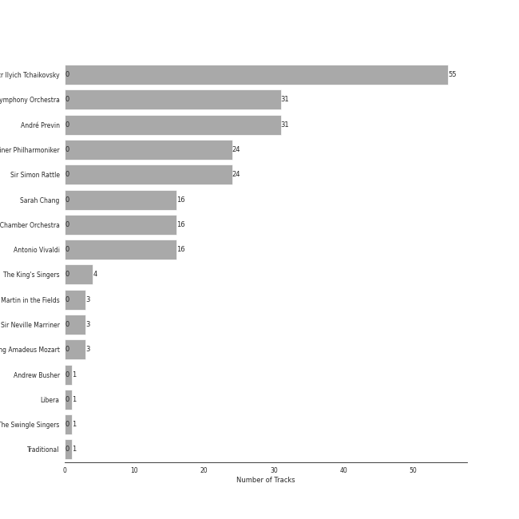
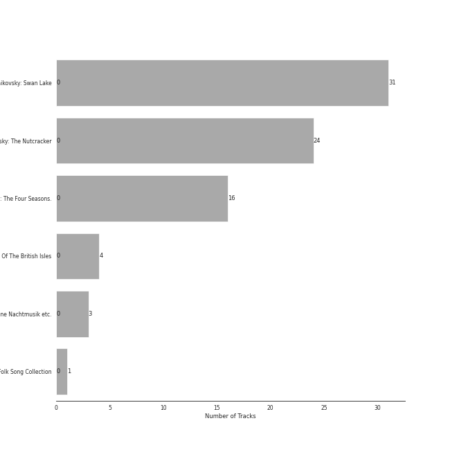

# Warner Classics

90 songs

## Top Artists

See all 25 artists

|   Number of Tracks | Art                                                                                              | Artist                                                                                   | 🔗                                                           |
|-------------------:|:-------------------------------------------------------------------------------------------------|:-----------------------------------------------------------------------------------------|:------------------------------------------------------------|
|                 56 |  | [Pyotr Ilyich Tchaikovsky](../artists/pyotr_ilyich_tchaikovsky.md)                       | [🔗](https://open.spotify.com/artist/3MKCzCnpzw3TjUYs2v7vDA) |
|                 31 |  | [London Symphony Orchestra](../artists/london_symphony_orchestra.md)                     | [🔗](https://open.spotify.com/artist/5yxyJsFanEAuwSM5kOuZKc) |
|                 31 |  | [André Previn](../artists/andr__previn.md)                                               | [🔗](https://open.spotify.com/artist/2tfWguHr2nj4e8KXLKciVq) |
|                 24 |  | [Berliner Philharmoniker](../artists/berliner_philharmoniker.md)                         | [🔗](https://open.spotify.com/artist/6uRJnvQ3f8whVnmeoecv5Z) |
|                 24 |  | [Sir Simon Rattle](../artists/sir_simon_rattle.md)                                       | [🔗](https://open.spotify.com/artist/4GQwgdcDQwqtcHICjUNndp) |
|                 16 |  | [Sarah Chang](../artists/sarah_chang.md)                                                 | [🔗](https://open.spotify.com/artist/5duxfFAQVkDT9g261fKlMP) |
|                 16 |  | [Orpheus Chamber Orchestra](../artists/orpheus_chamber_orchestra.md)                     | [🔗](https://open.spotify.com/artist/35pZsti1RSA5Zv98jAm8kX) |
|                 16 |  | [Antonio Vivaldi](../artists/antonio_vivaldi.md)                                         | [🔗](https://open.spotify.com/artist/2QOIawHpSlOwXDvSqQ9YJR) |
|                 14 |  | [Academy of St. Martin in the Fields](../artists/academy_of_st__martin_in_the_fields.md) | [🔗](https://open.spotify.com/artist/77CaCn32H4mOMQA7UElzfF) |
|                 14 |  | [Sir Neville Marriner](../artists/sir_neville_marriner.md)                               | [🔗](https://open.spotify.com/artist/6NUhQz7eAEsZvjEHTKHux9) |
|                  5 |  | [Wolfgang Amadeus Mozart](../artists/wolfgang_amadeus_mozart.md)                         | [🔗](https://open.spotify.com/artist/4NJhFmfw43RLBLjQvxDuRS) |
|                  4 |  | [The King's Singers](../artists/the_king_s_singers.md)                                   | [🔗](https://open.spotify.com/artist/5lR7yDVN4z9kahOiUSlMhe) |
|                  2 |  | Edvard Grieg                                                                             | [🔗](https://open.spotify.com/artist/5ihY290YPGc3aY2xTyx7Gy) |
|                  1 |  | [Felix Mendelssohn](../artists/felix_mendelssohn.md)                                     | [🔗](https://open.spotify.com/artist/6MF58APd3YV72Ln2eVg710) |
|                  1 |  | Johann Pachelbel                                                                         | [🔗](https://open.spotify.com/artist/62TD7509VQIxUe4WpwO0s3) |
|                  1 |  | [Johann Sebastian Bach](../artists/johann_sebastian_bach.md)                             | [🔗](https://open.spotify.com/artist/5aIqB5nVVvmFsvSdExz408) |
|                  1 |  | Iona Brown                                                                               | [🔗](https://open.spotify.com/artist/4EQ6Hw3KV9S80ZG1swsFN5) |
|                  1 |                                                               | Andrew Busher                                                                            | [🔗](https://open.spotify.com/artist/3Zbnq9cbmHkNBzUrfTe2Vb) |
|                  1 |  | Luigi Boccherini                                                                         | [🔗](https://open.spotify.com/artist/2l4vGfFV7e46yO8lxfxR76) |
|                  1 |  | Gabriel Fauré                                                                            | [🔗](https://open.spotify.com/artist/2gClsBep1tt1rv1CN210SO) |
|                  1 |  | Remo Giazotto                                                                            | [🔗](https://open.spotify.com/artist/2XVw29JYdo8C5MfteMnCqL) |
|                  1 |  | Libera                                                                                   | [🔗](https://open.spotify.com/artist/235C4ktJ2aGIyqaBlXyg7e) |
|                  1 |  | [The Swingle Singers](../artists/the_swingle_singers.md)                                 | [🔗](https://open.spotify.com/artist/1ZlFYysRdc6YaUH5FkxPl8) |
|                  1 |  | Traditional                                                                              | [🔗](https://open.spotify.com/artist/1U5zgr455OGyIkLNXvDdrf) |
|                  1 |  | Tomaso Albinoni                                                                          | [🔗](https://open.spotify.com/artist/17OArJzEhRR3OmhtGcnfBq) |

## Top Albums

See all 6 albums

|   Number of Tracks | Art                                                                                              | Album                                     | 🔗                                                          |
|-------------------:|:-------------------------------------------------------------------------------------------------|:------------------------------------------|:-----------------------------------------------------------|
|                 31 |  | Tchaikovsky: Swan Lake                    | [🔗](https://open.spotify.com/album/7dVA06E7AP7P7VzPyNxQVO) |
|                 24 |  | Tchaikovsky: The Nutcracker               | [🔗](https://open.spotify.com/album/54Awn36ryf55PkZyOR4iwQ) |
|                 16 |  | Vivaldi: The Four Seasons.                | [🔗](https://open.spotify.com/album/4YpaKMCcb65yOoee75UUOh) |
|                 14 |  | Mozart: Eine Kleine Nachtmusik etc.       | [🔗](https://open.spotify.com/album/5YCuibCDJrkVcS3UOAYqr9) |
|                  4 |  | Folk Songs Of The British Isles           | [🔗](https://open.spotify.com/album/7eFKaVzp6K60oBnB2kTjwV) |
|                  1 |  | Around the World - A Folk Song Collection | [🔗](https://open.spotify.com/album/2YLEK2g3iwuhW4vp02XRnn) |

## Tracks released under Warner Classics

| Art                                                                                              | Track                                                                                                                   | Album                                     | Artists                                                                                                                                                                                                                  | Label           | 💚   | 🔗                                                          |
|:-------------------------------------------------------------------------------------------------|:------------------------------------------------------------------------------------------------------------------------|:------------------------------------------|:-------------------------------------------------------------------------------------------------------------------------------------------------------------------------------------------------------------------------|:----------------|:----|:-----------------------------------------------------------|
|  | Vivaldi: L'estro armonico, Violin Concerto in A Minor, Op. 3 No. 6, RV 356: I. Allegro                                  | Vivaldi: The Four Seasons.                | [Antonio Vivaldi](../artists/antonio_vivaldi.md), [Sarah Chang](../artists/sarah_chang.md), [Orpheus Chamber Orchestra](../artists/orpheus_chamber_orchestra.md)                                                         | Warner Classics |     | [🔗](https://open.spotify.com/track/6EDoOwFAXcyDQ1bhYtO9yb) |
|  | Vivaldi: The Four Seasons, Violin Concerto in E Major, Op. 8 No. 1, RV 269 "Spring": I. Allegro                         | Vivaldi: The Four Seasons.                | [Antonio Vivaldi](../artists/antonio_vivaldi.md), [Sarah Chang](../artists/sarah_chang.md), [Orpheus Chamber Orchestra](../artists/orpheus_chamber_orchestra.md)                                                         | Warner Classics |     | [🔗](https://open.spotify.com/track/1NMgzkX89QZ2TuMSiJoILl) |
|  | Vivaldi: The Four Seasons, Violin Concerto in E Major, Op. 8 No. 1, RV 269 "Spring": II. Largo e pianissimo sempre      | Vivaldi: The Four Seasons.                | [Antonio Vivaldi](../artists/antonio_vivaldi.md), [Sarah Chang](../artists/sarah_chang.md), [Orpheus Chamber Orchestra](../artists/orpheus_chamber_orchestra.md)                                                         | Warner Classics |     | [🔗](https://open.spotify.com/track/51K6N03QPEQ4fpTGrzcP3k) |
|  | Vivaldi: The Four Seasons, Violin Concerto in E Major, Op. 8 No. 1, RV 269 "Spring": III. Allegro                       | Vivaldi: The Four Seasons.                | [Antonio Vivaldi](../artists/antonio_vivaldi.md), [Sarah Chang](../artists/sarah_chang.md), [Orpheus Chamber Orchestra](../artists/orpheus_chamber_orchestra.md)                                                         | Warner Classics |     | [🔗](https://open.spotify.com/track/3k6tQABkAsr1Mq7eDRJwk1) |
|  | Vivaldi: The Four Seasons, Violin Concerto in F Major, Op. 8 No. 3, RV 293 "Autumn": I. Allegro                         | Vivaldi: The Four Seasons.                | [Antonio Vivaldi](../artists/antonio_vivaldi.md), [Sarah Chang](../artists/sarah_chang.md), [Orpheus Chamber Orchestra](../artists/orpheus_chamber_orchestra.md)                                                         | Warner Classics |     | [🔗](https://open.spotify.com/track/0KJHN5Y2zDcKh7riFHvpTt) |
|  | Vivaldi: The Four Seasons, Violin Concerto in F Major, Op. 8 No. 3, RV 293 "Autumn": II. Adagio molto                   | Vivaldi: The Four Seasons.                | [Antonio Vivaldi](../artists/antonio_vivaldi.md), [Sarah Chang](../artists/sarah_chang.md), [Orpheus Chamber Orchestra](../artists/orpheus_chamber_orchestra.md)                                                         | Warner Classics |     | [🔗](https://open.spotify.com/track/0CmKuDto0oNAYzBOzjDjqV) |
|  | Vivaldi: The Four Seasons, Violin Concerto in F Major, Op. 8 No. 3, RV 293 "Autumn": III. Allegro "La caccia"           | Vivaldi: The Four Seasons.                | [Antonio Vivaldi](../artists/antonio_vivaldi.md), [Sarah Chang](../artists/sarah_chang.md), [Orpheus Chamber Orchestra](../artists/orpheus_chamber_orchestra.md)                                                         | Warner Classics |     | [🔗](https://open.spotify.com/track/6zOijs9wmanFgqIBqz2IKQ) |
|  | Vivaldi: The Four Seasons, Violin Concerto in F Minor, Op. 8 No. 4, RV 297 "Winter": I. Allegro non molto               | Vivaldi: The Four Seasons.                | [Antonio Vivaldi](../artists/antonio_vivaldi.md), [Sarah Chang](../artists/sarah_chang.md), [Orpheus Chamber Orchestra](../artists/orpheus_chamber_orchestra.md)                                                         | Warner Classics |     | [🔗](https://open.spotify.com/track/5llR5SF5ojZV4oSvIFlGUL) |
|  | Vivaldi: The Four Seasons, Violin Concerto in F Minor, Op. 8 No. 4, RV 297 "Winter": II. Largo                          | Vivaldi: The Four Seasons.                | [Antonio Vivaldi](../artists/antonio_vivaldi.md), [Sarah Chang](../artists/sarah_chang.md), [Orpheus Chamber Orchestra](../artists/orpheus_chamber_orchestra.md)                                                         | Warner Classics |     | [🔗](https://open.spotify.com/track/3zWIb6UTHGfWkjimJ6wIJG) |
|  | Vivaldi: The Four Seasons, Violin Concerto in F Minor, Op. 8 No. 4, RV 297 "Winter": III. Allegro                       | Vivaldi: The Four Seasons.                | [Antonio Vivaldi](../artists/antonio_vivaldi.md), [Sarah Chang](../artists/sarah_chang.md), [Orpheus Chamber Orchestra](../artists/orpheus_chamber_orchestra.md)                                                         | Warner Classics |     | [🔗](https://open.spotify.com/track/3NssaIXNMQJHoCYXvxExET) |
|  | Vivaldi: The Four Seasons, Violin Concerto in G Minor, Op. 8 No. 2, RV 315 "Summer": I. Allegro non molto               | Vivaldi: The Four Seasons.                | [Antonio Vivaldi](../artists/antonio_vivaldi.md), [Sarah Chang](../artists/sarah_chang.md), [Orpheus Chamber Orchestra](../artists/orpheus_chamber_orchestra.md)                                                         | Warner Classics |     | [🔗](https://open.spotify.com/track/0kQuEbV8Zckr9tBgM8U7Xs) |
|  | Vivaldi: The Four Seasons, Violin Concerto in G Minor, Op. 8 No. 2, RV 315 "Summer": II. Adagio                         | Vivaldi: The Four Seasons.                | [Antonio Vivaldi](../artists/antonio_vivaldi.md), [Sarah Chang](../artists/sarah_chang.md), [Orpheus Chamber Orchestra](../artists/orpheus_chamber_orchestra.md)                                                         | Warner Classics |     | [🔗](https://open.spotify.com/track/3bvUD0brjrqPYapZxGBsu3) |
|  | Vivaldi: The Four Seasons, Violin Concerto in G Minor, Op. 8 No. 2, RV 315 "Summer": III. Presto                        | Vivaldi: The Four Seasons.                | [Antonio Vivaldi](../artists/antonio_vivaldi.md), [Sarah Chang](../artists/sarah_chang.md), [Orpheus Chamber Orchestra](../artists/orpheus_chamber_orchestra.md)                                                         | Warner Classics |     | [🔗](https://open.spotify.com/track/1gewYqj350HHu63L8iwMbV) |
|  | Vivaldi: Violin Concerto in G Minor, Op. 12 No. 1, RV 317: I. Allegro aperto                                            | Vivaldi: The Four Seasons.                | [Antonio Vivaldi](../artists/antonio_vivaldi.md), [Sarah Chang](../artists/sarah_chang.md), [Orpheus Chamber Orchestra](../artists/orpheus_chamber_orchestra.md)                                                         | Warner Classics |     | [🔗](https://open.spotify.com/track/27FVkepjzJBhU40KS1xSzp) |
|  | Vivaldi: Violin Concerto in G Minor, Op. 12 No. 1, RV 317: II. Largo                                                    | Vivaldi: The Four Seasons.                | [Antonio Vivaldi](../artists/antonio_vivaldi.md), [Sarah Chang](../artists/sarah_chang.md), [Orpheus Chamber Orchestra](../artists/orpheus_chamber_orchestra.md)                                                         | Warner Classics |     | [🔗](https://open.spotify.com/track/3A5AucW2JWRYhjPAu13jiw) |
|  | Vivaldi: Violin Concerto in G Minor, Op. 12 No. 1, RV 317: III. Allegro                                                 | Vivaldi: The Four Seasons.                | [Antonio Vivaldi](../artists/antonio_vivaldi.md), [Sarah Chang](../artists/sarah_chang.md), [Orpheus Chamber Orchestra](../artists/orpheus_chamber_orchestra.md)                                                         | Warner Classics |     | [🔗](https://open.spotify.com/track/0IqtbGczjbFsMoCgS90Rux) |
|  | Grieg: 2 Elegiac Melodies, Op. 34: No. 1, The Wounded Heart (Orchestral Version)                                        | Mozart: Eine Kleine Nachtmusik etc.       | Edvard Grieg, [Sir Neville Marriner](../artists/sir_neville_marriner.md), [Academy of St. Martin in the Fields](../artists/academy_of_st__martin_in_the_fields.md)                                                       | Warner Classics |     | [🔗](https://open.spotify.com/track/0LpajCrPOJtmMrrC1n84q3) |
|  | Grieg: 2 Elegiac Melodies, Op. 34: No. 2, Last Spring (Orchestral Version)                                              | Mozart: Eine Kleine Nachtmusik etc.       | Edvard Grieg, [Sir Neville Marriner](../artists/sir_neville_marriner.md), [Academy of St. Martin in the Fields](../artists/academy_of_st__martin_in_the_fields.md)                                                       | Warner Classics |     | [🔗](https://open.spotify.com/track/7rp12Tm7r87MOjgUQ0xQ9L) |
|  | Mendelssohn: String Octet in E-Flat Major, Op. 20, MWV R20: III. Scherzo. Allegro leggierissimo                         | Mozart: Eine Kleine Nachtmusik etc.       | [Felix Mendelssohn](../artists/felix_mendelssohn.md), [Sir Neville Marriner](../artists/sir_neville_marriner.md), [Academy of St. Martin in the Fields](../artists/academy_of_st__martin_in_the_fields.md)               | Warner Classics |     | [🔗](https://open.spotify.com/track/5vwgQw9h0zAYf5PxNxvYV1) |
|  | Fauré: Pavane, Op. 50                                                                                                   | Mozart: Eine Kleine Nachtmusik etc.       | Gabriel Fauré, [Sir Neville Marriner](../artists/sir_neville_marriner.md), [Academy of St. Martin in the Fields](../artists/academy_of_st__martin_in_the_fields.md)                                                      | Warner Classics |     | [🔗](https://open.spotify.com/track/7yYONuFhNa72Bf5WFx8hSW) |
|  | Pachelbel: Canon and Gigue for Three Violins and Continuo in D Major: Canon                                             | Mozart: Eine Kleine Nachtmusik etc.       | Johann Pachelbel, [Sir Neville Marriner](../artists/sir_neville_marriner.md), [Academy of St. Martin in the Fields](../artists/academy_of_st__martin_in_the_fields.md)                                                   | Warner Classics |     | [🔗](https://open.spotify.com/track/1Mse9NKBbEASi50CQ4aYhr) |
|  | Bach, JS: Orchestral Suite No. 3 in D Major, BWV 1068: II. Air                                                          | Mozart: Eine Kleine Nachtmusik etc.       | [Johann Sebastian Bach](../artists/johann_sebastian_bach.md), [Sir Neville Marriner](../artists/sir_neville_marriner.md), [Academy of St. Martin in the Fields](../artists/academy_of_st__martin_in_the_fields.md)       | Warner Classics |     | [🔗](https://open.spotify.com/track/4MZrz8znekDgMAQ2qQY7jL) |
|  | Boccherini: String Quintet in E Major, Op. 13 No. 6, G. 282: III. Minuetto - Trio                                       | Mozart: Eine Kleine Nachtmusik etc.       | Luigi Boccherini, [Sir Neville Marriner](../artists/sir_neville_marriner.md), [Academy of St. Martin in the Fields](../artists/academy_of_st__martin_in_the_fields.md)                                                   | Warner Classics |     | [🔗](https://open.spotify.com/track/6e85fziCk6MwZUxWyG6Ijm) |
|  | Tchaikovsky: Swan Lake, Op. 20, Act I: Introduction - No. 1, Scene. Allegro giusto                                      | Tchaikovsky: Swan Lake                    | [Pyotr Ilyich Tchaikovsky](../artists/pyotr_ilyich_tchaikovsky.md), [André Previn](../artists/andr__previn.md), [London Symphony Orchestra](../artists/london_symphony_orchestra.md)                                     | Warner Classics |     | [🔗](https://open.spotify.com/track/5tNUaNoIMdJcdHGj25a7gD) |
|  | Tchaikovsky: Swan Lake, Op. 20, Act I: No. 2, Waltz                                                                     | Tchaikovsky: Swan Lake                    | [Pyotr Ilyich Tchaikovsky](../artists/pyotr_ilyich_tchaikovsky.md), [André Previn](../artists/andr__previn.md), [London Symphony Orchestra](../artists/london_symphony_orchestra.md)                                     | Warner Classics |     | [🔗](https://open.spotify.com/track/7gwqbiFgNU1VddAK2XO5Wr) |
|  | Tchaikovsky: Swan Lake, Op. 20, Act I: No. 3, Scene. Allegro moderato                                                   | Tchaikovsky: Swan Lake                    | [Pyotr Ilyich Tchaikovsky](../artists/pyotr_ilyich_tchaikovsky.md), [André Previn](../artists/andr__previn.md), [London Symphony Orchestra](../artists/london_symphony_orchestra.md)                                     | Warner Classics |     | [🔗](https://open.spotify.com/track/2pck96k8ppFMeyTONVAFLq) |
|  | Tchaikovsky: Swan Lake, Op. 20, Act I: No. 4, Pas de trois                                                              | Tchaikovsky: Swan Lake                    | [Pyotr Ilyich Tchaikovsky](../artists/pyotr_ilyich_tchaikovsky.md), [André Previn](../artists/andr__previn.md), [London Symphony Orchestra](../artists/london_symphony_orchestra.md)                                     | Warner Classics |     | [🔗](https://open.spotify.com/track/3lE4dnrzG0FQxg67ZOl9rx) |
|  | Tchaikovsky: Swan Lake, Op. 20, Act I: No. 5, Pas de deux for Two Merry-Makers                                          | Tchaikovsky: Swan Lake                    | [Pyotr Ilyich Tchaikovsky](../artists/pyotr_ilyich_tchaikovsky.md), [André Previn](../artists/andr__previn.md), [London Symphony Orchestra](../artists/london_symphony_orchestra.md)                                     | Warner Classics |     | [🔗](https://open.spotify.com/track/4c36o7MDZ6iXYedl5DMvO5) |
|  | Tchaikovsky: Swan Lake, Op. 20, Act I: No. 6, Pas d'action. Andantino, quasi moderato - Allegro                         | Tchaikovsky: Swan Lake                    | [Pyotr Ilyich Tchaikovsky](../artists/pyotr_ilyich_tchaikovsky.md), [André Previn](../artists/andr__previn.md), [London Symphony Orchestra](../artists/london_symphony_orchestra.md)                                     | Warner Classics |     | [🔗](https://open.spotify.com/track/6DlYVW2A5tBGwyrVYQnGsO) |
|  | Tchaikovsky: Swan Lake, Op. 20, Act I: No. 7, Sujet                                                                     | Tchaikovsky: Swan Lake                    | [Pyotr Ilyich Tchaikovsky](../artists/pyotr_ilyich_tchaikovsky.md), [André Previn](../artists/andr__previn.md), [London Symphony Orchestra](../artists/london_symphony_orchestra.md)                                     | Warner Classics |     | [🔗](https://open.spotify.com/track/5vQefc73LyaFwEPPcVspar) |
|  | Tchaikovsky: Swan Lake, Op. 20, Act I: No. 8, Dance with Goblets                                                        | Tchaikovsky: Swan Lake                    | [Pyotr Ilyich Tchaikovsky](../artists/pyotr_ilyich_tchaikovsky.md), [André Previn](../artists/andr__previn.md), [London Symphony Orchestra](../artists/london_symphony_orchestra.md)                                     | Warner Classics |     | [🔗](https://open.spotify.com/track/5k4h8TjWUws1995o3eOW0X) |
|  | Tchaikovsky: Swan Lake, Op. 20, Act I: No. 9, Finale. Andante                                                           | Tchaikovsky: Swan Lake                    | [Pyotr Ilyich Tchaikovsky](../artists/pyotr_ilyich_tchaikovsky.md), [André Previn](../artists/andr__previn.md), [London Symphony Orchestra](../artists/london_symphony_orchestra.md)                                     | Warner Classics |     | [🔗](https://open.spotify.com/track/30zjefBZWdYaliUSutB6xZ) |
|  | Tchaikovsky: Swan Lake, Op. 20, Act II: No. 10, Scene. Moderato                                                         | Tchaikovsky: Swan Lake                    | [Pyotr Ilyich Tchaikovsky](../artists/pyotr_ilyich_tchaikovsky.md), [André Previn](../artists/andr__previn.md), [London Symphony Orchestra](../artists/london_symphony_orchestra.md)                                     | Warner Classics |     | [🔗](https://open.spotify.com/track/2xizRhme7pYeITbH1NLLGt) |
|  | Tchaikovsky: Swan Lake, Op. 20, Act II: No. 11, Scene. Allegro moderato - Moderato - Allegro vivo                       | Tchaikovsky: Swan Lake                    | [Pyotr Ilyich Tchaikovsky](../artists/pyotr_ilyich_tchaikovsky.md), [André Previn](../artists/andr__previn.md), [London Symphony Orchestra](../artists/london_symphony_orchestra.md)                                     | Warner Classics |     | [🔗](https://open.spotify.com/track/5ItPxeVnRy31PwbheRAZyw) |
|  | Tchaikovsky: Swan Lake, Op. 20, Act II: No. 12, Scene. Allegro - Moderato assai quasi andante                           | Tchaikovsky: Swan Lake                    | [Pyotr Ilyich Tchaikovsky](../artists/pyotr_ilyich_tchaikovsky.md), [André Previn](../artists/andr__previn.md), [London Symphony Orchestra](../artists/london_symphony_orchestra.md)                                     | Warner Classics |     | [🔗](https://open.spotify.com/track/4MK0IoF2M5oUMvOrguhyYF) |
|  | Tchaikovsky: Swan Lake, Op. 20, Act II: No. 13, Dances of the Swans                                                     | Tchaikovsky: Swan Lake                    | [Pyotr Ilyich Tchaikovsky](../artists/pyotr_ilyich_tchaikovsky.md), [André Previn](../artists/andr__previn.md), [London Symphony Orchestra](../artists/london_symphony_orchestra.md)                                     | Warner Classics |     | [🔗](https://open.spotify.com/track/2LETLpcnlbL2d5IbnNYLf8) |
|  | Tchaikovsky: Swan Lake, Op. 20, Act II: No. 14, Scene. Moderato                                                         | Tchaikovsky: Swan Lake                    | [Pyotr Ilyich Tchaikovsky](../artists/pyotr_ilyich_tchaikovsky.md), [André Previn](../artists/andr__previn.md), [London Symphony Orchestra](../artists/london_symphony_orchestra.md)                                     | Warner Classics |     | [🔗](https://open.spotify.com/track/3NlS13lSrtQAL9Nf7ZNoRW) |
|  | Tchaikovsky: Swan Lake, Op. 20, Act III, Appendix I: Pas de deux                                                        | Tchaikovsky: Swan Lake                    | [Pyotr Ilyich Tchaikovsky](../artists/pyotr_ilyich_tchaikovsky.md), [André Previn](../artists/andr__previn.md), [London Symphony Orchestra](../artists/london_symphony_orchestra.md)                                     | Warner Classics |     | [🔗](https://open.spotify.com/track/7hh18ES59TNeJnBSVJKtmV) |
|  | Tchaikovsky: Swan Lake, Op. 20, Act III, Appendix II: No. 20a, Russian Dance                                            | Tchaikovsky: Swan Lake                    | [Pyotr Ilyich Tchaikovsky](../artists/pyotr_ilyich_tchaikovsky.md), [André Previn](../artists/andr__previn.md), [London Symphony Orchestra](../artists/london_symphony_orchestra.md)                                     | Warner Classics |     | [🔗](https://open.spotify.com/track/0H9IxK78CYvsvIWa3fNpdS) |
|  | Tchaikovsky: Swan Lake, Op. 20, Act III: No. 15, Scene. March - Allegro giusto                                          | Tchaikovsky: Swan Lake                    | [Pyotr Ilyich Tchaikovsky](../artists/pyotr_ilyich_tchaikovsky.md), [André Previn](../artists/andr__previn.md), [London Symphony Orchestra](../artists/london_symphony_orchestra.md)                                     | Warner Classics |     | [🔗](https://open.spotify.com/track/0x8zPL3DG2zfVSUzZQiCKL) |
|  | Tchaikovsky: Swan Lake, Op. 20, Act III: No. 16, Ballabile. Dance of the Guests and the Dwarfs                          | Tchaikovsky: Swan Lake                    | [Pyotr Ilyich Tchaikovsky](../artists/pyotr_ilyich_tchaikovsky.md), [André Previn](../artists/andr__previn.md), [London Symphony Orchestra](../artists/london_symphony_orchestra.md)                                     | Warner Classics |     | [🔗](https://open.spotify.com/track/6fvore08Y6schFpAtmapXW) |
|  | Tchaikovsky: Swan Lake, Op. 20, Act III: No. 17, Entrance of the Guests and Waltz                                       | Tchaikovsky: Swan Lake                    | [Pyotr Ilyich Tchaikovsky](../artists/pyotr_ilyich_tchaikovsky.md), [André Previn](../artists/andr__previn.md), [London Symphony Orchestra](../artists/london_symphony_orchestra.md)                                     | Warner Classics |     | [🔗](https://open.spotify.com/track/1RiQJx6VNLVG2SLbyiN6tK) |
|  | Tchaikovsky: Swan Lake, Op. 20, Act III: No. 18, Scene. Allegro - Allegro giusto                                        | Tchaikovsky: Swan Lake                    | [Pyotr Ilyich Tchaikovsky](../artists/pyotr_ilyich_tchaikovsky.md), [André Previn](../artists/andr__previn.md), [London Symphony Orchestra](../artists/london_symphony_orchestra.md)                                     | Warner Classics |     | [🔗](https://open.spotify.com/track/2YzKk2NMadveUJ5gSMmo5W) |
|  | Tchaikovsky: Swan Lake, Op. 20, Act III: No. 19, Pas de six                                                             | Tchaikovsky: Swan Lake                    | [Pyotr Ilyich Tchaikovsky](../artists/pyotr_ilyich_tchaikovsky.md), [André Previn](../artists/andr__previn.md), [London Symphony Orchestra](../artists/london_symphony_orchestra.md)                                     | Warner Classics |     | [🔗](https://open.spotify.com/track/5BgU68GB0DoFSxkwuIsLU2) |
|  | Tchaikovsky: Swan Lake, Op. 20, Act III: No. 20, Hungarian Dance "Czárdás"                                              | Tchaikovsky: Swan Lake                    | [Pyotr Ilyich Tchaikovsky](../artists/pyotr_ilyich_tchaikovsky.md), [André Previn](../artists/andr__previn.md), [London Symphony Orchestra](../artists/london_symphony_orchestra.md)                                     | Warner Classics |     | [🔗](https://open.spotify.com/track/6YbcqXNj8MEclUKVeicLYU) |
|  | Tchaikovsky: Swan Lake, Op. 20, Act III: No. 21, Spanish Dance                                                          | Tchaikovsky: Swan Lake                    | [Pyotr Ilyich Tchaikovsky](../artists/pyotr_ilyich_tchaikovsky.md), [André Previn](../artists/andr__previn.md), [London Symphony Orchestra](../artists/london_symphony_orchestra.md)                                     | Warner Classics |     | [🔗](https://open.spotify.com/track/3Vulgn0kOld0a561mg7yt4) |
|  | Tchaikovsky: Swan Lake, Op. 20, Act III: No. 22, Neapolitan Dance                                                       | Tchaikovsky: Swan Lake                    | [Pyotr Ilyich Tchaikovsky](../artists/pyotr_ilyich_tchaikovsky.md), [André Previn](../artists/andr__previn.md), [London Symphony Orchestra](../artists/london_symphony_orchestra.md)                                     | Warner Classics |     | [🔗](https://open.spotify.com/track/4nj7bhtLH0R1xW0mybToZx) |
|  | Tchaikovsky: Swan Lake, Op. 20, Act III: No. 23, Mazurka                                                                | Tchaikovsky: Swan Lake                    | [Pyotr Ilyich Tchaikovsky](../artists/pyotr_ilyich_tchaikovsky.md), [André Previn](../artists/andr__previn.md), [London Symphony Orchestra](../artists/london_symphony_orchestra.md)                                     | Warner Classics |     | [🔗](https://open.spotify.com/track/2yf6Hbs6YR3o1iEtOxr91R) |
|  | Tchaikovsky: Swan Lake, Op. 20, Act III: No. 24, Scene. Allegro - Valse - Allegro vivo                                  | Tchaikovsky: Swan Lake                    | [Pyotr Ilyich Tchaikovsky](../artists/pyotr_ilyich_tchaikovsky.md), [André Previn](../artists/andr__previn.md), [London Symphony Orchestra](../artists/london_symphony_orchestra.md)                                     | Warner Classics |     | [🔗](https://open.spotify.com/track/6kmeyBsHTsgvNfng8D3r1d) |
|  | Tchaikovsky: Swan Lake, Op. 20, Act IV: No. 25, Entr'acte                                                               | Tchaikovsky: Swan Lake                    | [Pyotr Ilyich Tchaikovsky](../artists/pyotr_ilyich_tchaikovsky.md), [André Previn](../artists/andr__previn.md), [London Symphony Orchestra](../artists/london_symphony_orchestra.md)                                     | Warner Classics |     | [🔗](https://open.spotify.com/track/4e1dRJR5QrPOlfjx3jShah) |
|  | Tchaikovsky: Swan Lake, Op. 20, Act IV: No. 26, Scene. Allegro ma non troppo                                            | Tchaikovsky: Swan Lake                    | [Pyotr Ilyich Tchaikovsky](../artists/pyotr_ilyich_tchaikovsky.md), [André Previn](../artists/andr__previn.md), [London Symphony Orchestra](../artists/london_symphony_orchestra.md)                                     | Warner Classics |     | [🔗](https://open.spotify.com/track/4DhZXyID8nEQmTqWzZ0nC7) |
|  | Tchaikovsky: Swan Lake, Op. 20, Act IV: No. 27, Dance of the Little Swans                                               | Tchaikovsky: Swan Lake                    | [Pyotr Ilyich Tchaikovsky](../artists/pyotr_ilyich_tchaikovsky.md), [André Previn](../artists/andr__previn.md), [London Symphony Orchestra](../artists/london_symphony_orchestra.md)                                     | Warner Classics |     | [🔗](https://open.spotify.com/track/4Qu4tyMIENrOgUSGGbJhb4) |
|  | Tchaikovsky: Swan Lake, Op. 20, Act IV: No. 28, Scene. Allegro agitato                                                  | Tchaikovsky: Swan Lake                    | [Pyotr Ilyich Tchaikovsky](../artists/pyotr_ilyich_tchaikovsky.md), [André Previn](../artists/andr__previn.md), [London Symphony Orchestra](../artists/london_symphony_orchestra.md)                                     | Warner Classics |     | [🔗](https://open.spotify.com/track/5jg3xtvH1ZkLO2XtaefaSF) |
|  | Tchaikovsky: Swan Lake, Op. 20, Act IV: No. 29, Finale                                                                  | Tchaikovsky: Swan Lake                    | [Pyotr Ilyich Tchaikovsky](../artists/pyotr_ilyich_tchaikovsky.md), [André Previn](../artists/andr__previn.md), [London Symphony Orchestra](../artists/london_symphony_orchestra.md)                                     | Warner Classics |     | [🔗](https://open.spotify.com/track/5nYUMQDawD0zfqMtqXq8Ds) |
|  | Tchaikovsky: String Quartet No. 1 in D Major, Op. 11: II. Andante cantabile (Version for String Orchestra)              | Mozart: Eine Kleine Nachtmusik etc.       | [Pyotr Ilyich Tchaikovsky](../artists/pyotr_ilyich_tchaikovsky.md), [Sir Neville Marriner](../artists/sir_neville_marriner.md), [Academy of St. Martin in the Fields](../artists/academy_of_st__martin_in_the_fields.md) | Warner Classics |     | [🔗](https://open.spotify.com/track/5yOAS9wr1ZBBvXARMpnbUt) |
|  | Tchaikovsky: The Nutcracker, Op. 71, Act I, Scene 1: No. 1, Decoration of the Christmas Tree                            | Tchaikovsky: The Nutcracker               | [Pyotr Ilyich Tchaikovsky](../artists/pyotr_ilyich_tchaikovsky.md), [Berliner Philharmoniker](../artists/berliner_philharmoniker.md), [Sir Simon Rattle](../artists/sir_simon_rattle.md)                                 | Warner Classics |     | [🔗](https://open.spotify.com/track/7hVsNjrvtfXZlzxW5vxsAi) |
|  | Tchaikovsky: The Nutcracker, Op. 71, Act I, Scene 1: No. 2, March                                                       | Tchaikovsky: The Nutcracker               | [Pyotr Ilyich Tchaikovsky](../artists/pyotr_ilyich_tchaikovsky.md), [Berliner Philharmoniker](../artists/berliner_philharmoniker.md), [Sir Simon Rattle](../artists/sir_simon_rattle.md)                                 | Warner Classics |     | [🔗](https://open.spotify.com/track/06am46cX3Z6YlSsg0TyVHA) |
|  | Tchaikovsky: The Nutcracker, Op. 71, Act I, Scene 1: No. 3, Children's Galop and Entry of the Parents                   | Tchaikovsky: The Nutcracker               | [Pyotr Ilyich Tchaikovsky](../artists/pyotr_ilyich_tchaikovsky.md), [Berliner Philharmoniker](../artists/berliner_philharmoniker.md), [Sir Simon Rattle](../artists/sir_simon_rattle.md)                                 | Warner Classics |     | [🔗](https://open.spotify.com/track/6yTPBtEggdlBgGEUL94sn1) |
|  | Tchaikovsky: The Nutcracker, Op. 71, Act I, Scene 1: No. 4, Dancing Scene. Arrival of Drosselmeyer                      | Tchaikovsky: The Nutcracker               | [Pyotr Ilyich Tchaikovsky](../artists/pyotr_ilyich_tchaikovsky.md), [Berliner Philharmoniker](../artists/berliner_philharmoniker.md), [Sir Simon Rattle](../artists/sir_simon_rattle.md)                                 | Warner Classics |     | [🔗](https://open.spotify.com/track/2NodH0sMaxRFSWePxkuutP) |
|  | Tchaikovsky: The Nutcracker, Op. 71, Act I, Scene 1: No. 5, Scene and Grandfather Dance                                 | Tchaikovsky: The Nutcracker               | [Pyotr Ilyich Tchaikovsky](../artists/pyotr_ilyich_tchaikovsky.md), [Berliner Philharmoniker](../artists/berliner_philharmoniker.md), [Sir Simon Rattle](../artists/sir_simon_rattle.md)                                 | Warner Classics |     | [🔗](https://open.spotify.com/track/7JUbQkbvdPnNqS8RdcfCtO) |
|  | Tchaikovsky: The Nutcracker, Op. 71, Act I, Scene 1: No. 6, Clara and the Nutcracker                                    | Tchaikovsky: The Nutcracker               | [Pyotr Ilyich Tchaikovsky](../artists/pyotr_ilyich_tchaikovsky.md), [Berliner Philharmoniker](../artists/berliner_philharmoniker.md), [Sir Simon Rattle](../artists/sir_simon_rattle.md)                                 | Warner Classics |     | [🔗](https://open.spotify.com/track/460K7NeHx8ttnZa0Qqh4Vx) |
|  | Tchaikovsky: The Nutcracker, Op. 71, Act I, Scene 1: No. 7, The Battle                                                  | Tchaikovsky: The Nutcracker               | [Pyotr Ilyich Tchaikovsky](../artists/pyotr_ilyich_tchaikovsky.md), [Berliner Philharmoniker](../artists/berliner_philharmoniker.md), [Sir Simon Rattle](../artists/sir_simon_rattle.md)                                 | Warner Classics |     | [🔗](https://open.spotify.com/track/1npEvrkd5GA8djI76r68Ay) |
|  | Tchaikovsky: The Nutcracker, Op. 71, Act I, Scene 2: No. 8, The Forest of Fir Trees in Winter. Journey Through the Snow | Tchaikovsky: The Nutcracker               | [Pyotr Ilyich Tchaikovsky](../artists/pyotr_ilyich_tchaikovsky.md), [Berliner Philharmoniker](../artists/berliner_philharmoniker.md), [Sir Simon Rattle](../artists/sir_simon_rattle.md)                                 | Warner Classics |     | [🔗](https://open.spotify.com/track/2bM4iYnqICtB3vAGplnz0d) |
|  | Tchaikovsky: The Nutcracker, Op. 71, Act I, Scene 2: No. 9, Waltz of the Snowflakes                                     | Tchaikovsky: The Nutcracker               | [Pyotr Ilyich Tchaikovsky](../artists/pyotr_ilyich_tchaikovsky.md), [Berliner Philharmoniker](../artists/berliner_philharmoniker.md), [Sir Simon Rattle](../artists/sir_simon_rattle.md), Libera                         | Warner Classics |     | [🔗](https://open.spotify.com/track/5jXB4p8pQu9Ahv10ibU8fG) |
|  | Tchaikovsky: The Nutcracker, Op. 71, Act II: No. 10, The Enchanted Palace of Confiturembourg, the Kingdom of Sweets     | Tchaikovsky: The Nutcracker               | [Pyotr Ilyich Tchaikovsky](../artists/pyotr_ilyich_tchaikovsky.md), [Berliner Philharmoniker](../artists/berliner_philharmoniker.md), [Sir Simon Rattle](../artists/sir_simon_rattle.md)                                 | Warner Classics |     | [🔗](https://open.spotify.com/track/7KwH7xYAQ5rFja2GnJLIqD) |
|  | Tchaikovsky: The Nutcracker, Op. 71, Act II: No. 11, Arrival of Clara and the Nutcracker                                | Tchaikovsky: The Nutcracker               | [Pyotr Ilyich Tchaikovsky](../artists/pyotr_ilyich_tchaikovsky.md), [Berliner Philharmoniker](../artists/berliner_philharmoniker.md), [Sir Simon Rattle](../artists/sir_simon_rattle.md)                                 | Warner Classics |     | [🔗](https://open.spotify.com/track/3eHV5kXt0OZmrUTrO8wzMX) |
|  | Tchaikovsky: The Nutcracker, Op. 71, Act II: No. 12a, Divertissement. Chocolate, Spanish Dance                          | Tchaikovsky: The Nutcracker               | [Pyotr Ilyich Tchaikovsky](../artists/pyotr_ilyich_tchaikovsky.md), [Berliner Philharmoniker](../artists/berliner_philharmoniker.md), [Sir Simon Rattle](../artists/sir_simon_rattle.md)                                 | Warner Classics |     | [🔗](https://open.spotify.com/track/0W5hxw5mvLIVZu1QIw7IpP) |
|  | Tchaikovsky: The Nutcracker, Op. 71, Act II: No. 12b, Divertissement. Coffee, Arabian Dance                             | Tchaikovsky: The Nutcracker               | [Pyotr Ilyich Tchaikovsky](../artists/pyotr_ilyich_tchaikovsky.md), [Berliner Philharmoniker](../artists/berliner_philharmoniker.md), [Sir Simon Rattle](../artists/sir_simon_rattle.md)                                 | Warner Classics |     | [🔗](https://open.spotify.com/track/13rYowrPC2dk2Jhavquy1F) |
|  | Tchaikovsky: The Nutcracker, Op. 71, Act II: No. 12c, Divertissement. Tea, Chinese Dance                                | Tchaikovsky: The Nutcracker               | [Pyotr Ilyich Tchaikovsky](../artists/pyotr_ilyich_tchaikovsky.md), [Berliner Philharmoniker](../artists/berliner_philharmoniker.md), [Sir Simon Rattle](../artists/sir_simon_rattle.md)                                 | Warner Classics |     | [🔗](https://open.spotify.com/track/7o5DCsdl4eIqusst2pVoKX) |
|  | Tchaikovsky: The Nutcracker, Op. 71, Act II: No. 12d, Divertissement. Trepak, Russian Dance                             | Tchaikovsky: The Nutcracker               | [Pyotr Ilyich Tchaikovsky](../artists/pyotr_ilyich_tchaikovsky.md), [Berliner Philharmoniker](../artists/berliner_philharmoniker.md), [Sir Simon Rattle](../artists/sir_simon_rattle.md)                                 | Warner Classics |     | [🔗](https://open.spotify.com/track/6kHWawEbq5Vcyp8nSHhGjs) |
|  | Tchaikovsky: The Nutcracker, Op. 71, Act II: No. 12e, Divertissement. Dance of the Reed-Flutes                          | Tchaikovsky: The Nutcracker               | [Pyotr Ilyich Tchaikovsky](../artists/pyotr_ilyich_tchaikovsky.md), [Berliner Philharmoniker](../artists/berliner_philharmoniker.md), [Sir Simon Rattle](../artists/sir_simon_rattle.md)                                 | Warner Classics |     | [🔗](https://open.spotify.com/track/2FSMEjWvRqmrdZbsqiW8ds) |
|  | Tchaikovsky: The Nutcracker, Op. 71, Act II: No. 12f, Divertissement. Mother Gigogne and the Clowns                     | Tchaikovsky: The Nutcracker               | [Pyotr Ilyich Tchaikovsky](../artists/pyotr_ilyich_tchaikovsky.md), [Berliner Philharmoniker](../artists/berliner_philharmoniker.md), [Sir Simon Rattle](../artists/sir_simon_rattle.md)                                 | Warner Classics |     | [🔗](https://open.spotify.com/track/4L9KpsmAbyhXOZZkSybfaU) |
|  | Tchaikovsky: The Nutcracker, Op. 71, Act II: No. 13, Waltz of the Flowers                                               | Tchaikovsky: The Nutcracker               | [Pyotr Ilyich Tchaikovsky](../artists/pyotr_ilyich_tchaikovsky.md), [Berliner Philharmoniker](../artists/berliner_philharmoniker.md), [Sir Simon Rattle](../artists/sir_simon_rattle.md)                                 | Warner Classics |     | [🔗](https://open.spotify.com/track/0CJuLeZpCdqrqoCMXWZw8k) |
|  | Tchaikovsky: The Nutcracker, Op. 71, Act II: No. 14a, Pas de deux. Andante maestoso                                     | Tchaikovsky: The Nutcracker               | [Pyotr Ilyich Tchaikovsky](../artists/pyotr_ilyich_tchaikovsky.md), [Berliner Philharmoniker](../artists/berliner_philharmoniker.md), [Sir Simon Rattle](../artists/sir_simon_rattle.md)                                 | Warner Classics |     | [🔗](https://open.spotify.com/track/2oUX4i8ByoaDrHHz9z5Bga) |
|  | Tchaikovsky: The Nutcracker, Op. 71, Act II: No. 14b, Pas de deux. Variation I "Tarantella"                             | Tchaikovsky: The Nutcracker               | [Pyotr Ilyich Tchaikovsky](../artists/pyotr_ilyich_tchaikovsky.md), [Berliner Philharmoniker](../artists/berliner_philharmoniker.md), [Sir Simon Rattle](../artists/sir_simon_rattle.md)                                 | Warner Classics |     | [🔗](https://open.spotify.com/track/0HbpdVxJlwPDRqsY3TmkTQ) |
|  | Tchaikovsky: The Nutcracker, Op. 71, Act II: No. 14c, Pas de deux. Variation II "Dance of the Sugar Plum Fairy"         | Tchaikovsky: The Nutcracker               | [Pyotr Ilyich Tchaikovsky](../artists/pyotr_ilyich_tchaikovsky.md), [Berliner Philharmoniker](../artists/berliner_philharmoniker.md), [Sir Simon Rattle](../artists/sir_simon_rattle.md)                                 | Warner Classics |     | [🔗](https://open.spotify.com/track/1oDAFTOXZGSQedBa6hXGhT) |
|  | Tchaikovsky: The Nutcracker, Op. 71, Act II: No. 14d, Pas de deux. Coda                                                 | Tchaikovsky: The Nutcracker               | [Pyotr Ilyich Tchaikovsky](../artists/pyotr_ilyich_tchaikovsky.md), [Berliner Philharmoniker](../artists/berliner_philharmoniker.md), [Sir Simon Rattle](../artists/sir_simon_rattle.md)                                 | Warner Classics |     | [🔗](https://open.spotify.com/track/3aBr1vgaFH9QlMIXQBx9f5) |
|  | Tchaikovsky: The Nutcracker, Op. 71, Act II: No. 15, Final Waltz and Apotheosis                                         | Tchaikovsky: The Nutcracker               | [Pyotr Ilyich Tchaikovsky](../artists/pyotr_ilyich_tchaikovsky.md), [Berliner Philharmoniker](../artists/berliner_philharmoniker.md), [Sir Simon Rattle](../artists/sir_simon_rattle.md)                                 | Warner Classics |     | [🔗](https://open.spotify.com/track/52JiOOIQ4xwLHEWdEV1aUF) |
|  | Tchaikovsky: The Nutcracker, Op. 71: Miniature Overture                                                                 | Tchaikovsky: The Nutcracker               | [Pyotr Ilyich Tchaikovsky](../artists/pyotr_ilyich_tchaikovsky.md), [Berliner Philharmoniker](../artists/berliner_philharmoniker.md), [Sir Simon Rattle](../artists/sir_simon_rattle.md)                                 | Warner Classics |     | [🔗](https://open.spotify.com/track/11WQasJcGWgh3mvR1UiBcm) |
|  | Albinoni: Adagio in G Minor                                                                                             | Mozart: Eine Kleine Nachtmusik etc.       | Remo Giazotto, Tomaso Albinoni, [Sir Neville Marriner](../artists/sir_neville_marriner.md), Iona Brown, [Academy of St. Martin in the Fields](../artists/academy_of_st__martin_in_the_fields.md)                         | Warner Classics |     | [🔗](https://open.spotify.com/track/3QBjivHlen5OOYCnujzvIg) |
|  | Danny Boy                                                                                                               | Folk Songs Of The British Isles           | [The King's Singers](../artists/the_king_s_singers.md)                                                                                                                                                                   | Warner Classics |     | [🔗](https://open.spotify.com/track/0pSU2FXTmbfKh2wEVSOeg6) |
|  | Greensleeves                                                                                                            | Folk Songs Of The British Isles           | [The King's Singers](../artists/the_king_s_singers.md)                                                                                                                                                                   | Warner Classics |     | [🔗](https://open.spotify.com/track/2rQPqQITnqplm3JmNkYe45) |
|  | Loch Lomond                                                                                                             | Folk Songs Of The British Isles           | [The King's Singers](../artists/the_king_s_singers.md)                                                                                                                                                                   | Warner Classics |     | [🔗](https://open.spotify.com/track/0OHTE11AbX3oeT623REE0L) |
|  | Scarborough Fair                                                                                                        | Folk Songs Of The British Isles           | [The King's Singers](../artists/the_king_s_singers.md)                                                                                                                                                                   | Warner Classics |     | [🔗](https://open.spotify.com/track/0kXXBfNHkfCrReBXi3AqMB) |
|  | Traditional: Ciao, Bella, Ciao                                                                                          | Around the World - A Folk Song Collection | Traditional, [The Swingle Singers](../artists/the_swingle_singers.md), Andrew Busher                                                                                                                                     | Warner Classics |     | [🔗](https://open.spotify.com/track/6bVBff0oOgog8kjTPLUgBI) |
|  | 3 German Dances K605 - 1986 Remastered Version                                                                          | Mozart: Eine Kleine Nachtmusik etc.       | [Wolfgang Amadeus Mozart](../artists/wolfgang_amadeus_mozart.md), [Sir Neville Marriner](../artists/sir_neville_marriner.md), [Academy of St. Martin in the Fields](../artists/academy_of_st__martin_in_the_fields.md)   | Warner Classics |     | [🔗](https://open.spotify.com/track/4O1tFA8Qx8txP2qnIqJ7iy) |
|  | Mozart: Eine kleine Nachtmusik, K. 525: II. Romance. Andante                                                            | Mozart: Eine Kleine Nachtmusik etc.       | [Wolfgang Amadeus Mozart](../artists/wolfgang_amadeus_mozart.md), [Sir Neville Marriner](../artists/sir_neville_marriner.md), [Academy of St. Martin in the Fields](../artists/academy_of_st__martin_in_the_fields.md)   | Warner Classics |     | [🔗](https://open.spotify.com/track/5c8aHvonwKaBAoOIXmHQdt) |
|  | Mozart: Eine kleine Nachtmusik, K. 525: III. Menuetto. Allegretto                                                       | Mozart: Eine Kleine Nachtmusik etc.       | [Wolfgang Amadeus Mozart](../artists/wolfgang_amadeus_mozart.md), [Sir Neville Marriner](../artists/sir_neville_marriner.md), [Academy of St. Martin in the Fields](../artists/academy_of_st__martin_in_the_fields.md)   | Warner Classics |     | [🔗](https://open.spotify.com/track/0u1geqo8UUXA6nqLGWdEt4) |
|  | Mozart: Eine kleine Nachtmusik, K. 525: IV. Rondo. Allegro                                                              | Mozart: Eine Kleine Nachtmusik etc.       | [Wolfgang Amadeus Mozart](../artists/wolfgang_amadeus_mozart.md), [Sir Neville Marriner](../artists/sir_neville_marriner.md), [Academy of St. Martin in the Fields](../artists/academy_of_st__martin_in_the_fields.md)   | Warner Classics |     | [🔗](https://open.spotify.com/track/5gFRhodjlXDFR5voxOymN9) |
|  | Mozart: Serenade No. 13 in G Major, K. 525 "Eine kleine Nachtmusik": I. Allegro                                         | Mozart: Eine Kleine Nachtmusik etc.       | [Wolfgang Amadeus Mozart](../artists/wolfgang_amadeus_mozart.md), [Sir Neville Marriner](../artists/sir_neville_marriner.md), [Academy of St. Martin in the Fields](../artists/academy_of_st__martin_in_the_fields.md)   | Warner Classics |     | [🔗](https://open.spotify.com/track/692c4gU0pklonK8YujxVhm) |
