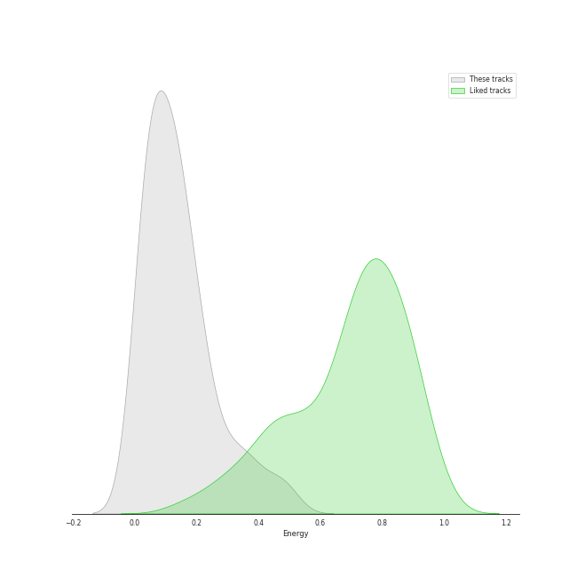
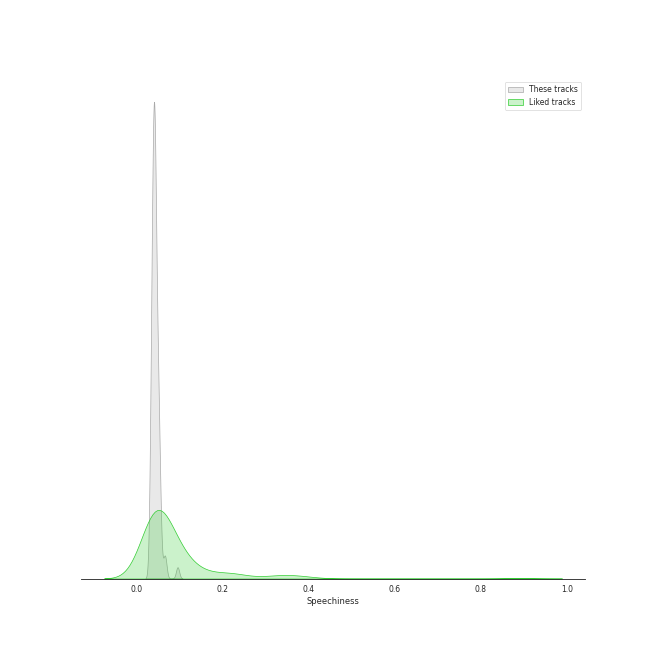
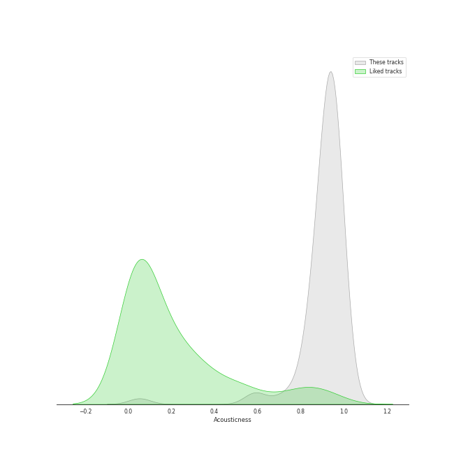
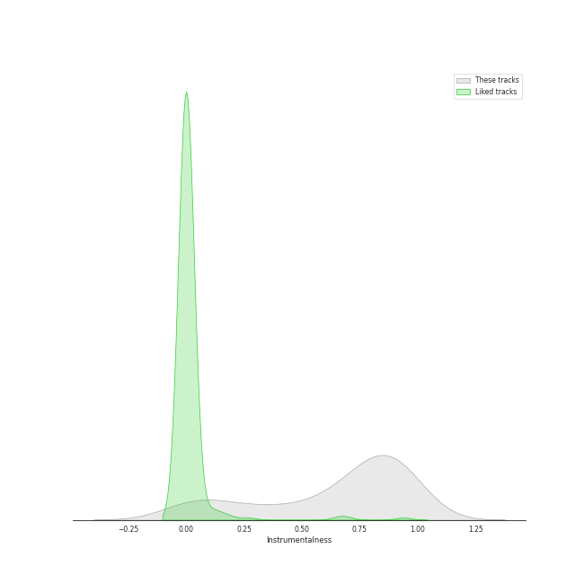
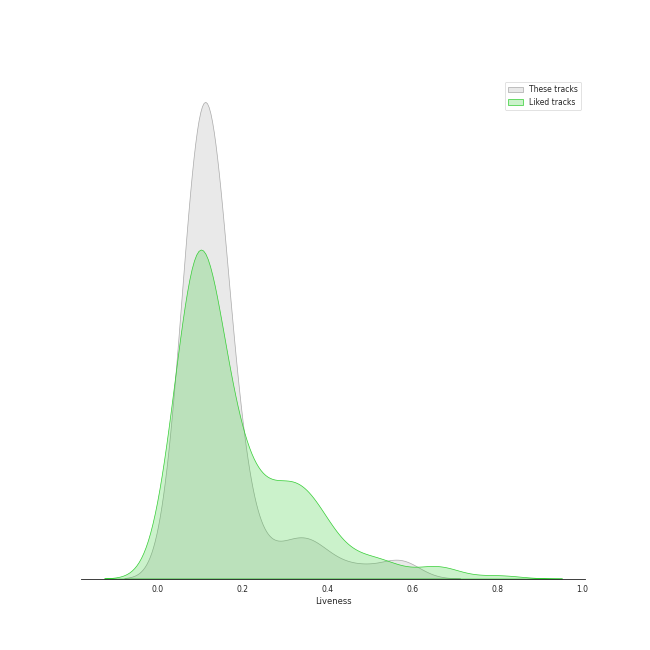
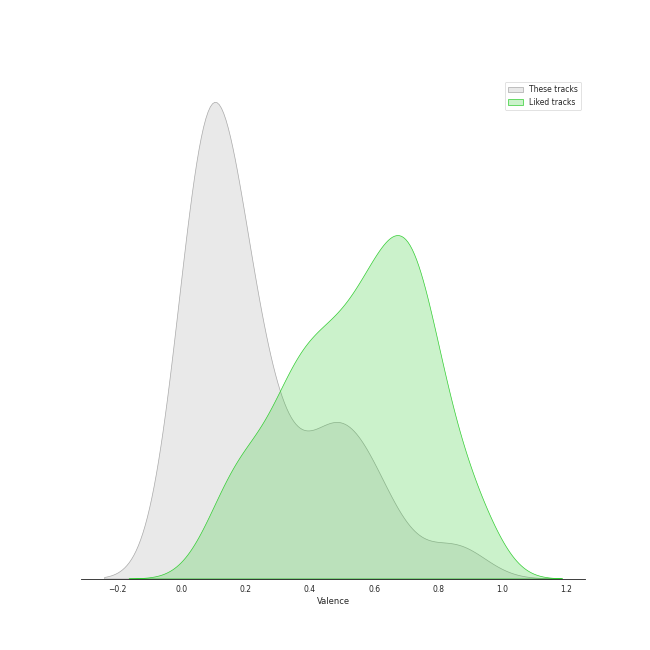
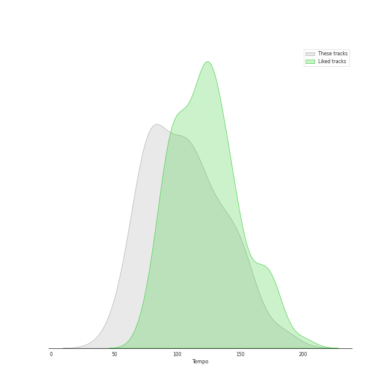

# Track Features for Warner Classics

## Danceability

| ​ | 10 most Danceable tracks | ​​ | 10 least Danceable tracks |
|:---|:---|:---|:---|
|  | Traditional: Ciao, Bella, Ciao (0.74) |  | Tchaikovsky: Swan Lake, Op. 20, Act 2: No. 14, Scene. Moderato (0.0958) |
|  | Vivaldi: L'estro armonico, Violin Concerto in A Minor, Op. 3 No. 6, RV 356: I. Allegro (0.601) |  | Tchaikovsky: The Nutcracker, Op. 71, Act II: No. 10, The Enchanted Palace of Confiturembourg, the Kingdom of Sweets (0.124) |
|  | Tchaikovsky: Swan Lake, Op. 20, Act 1: No. 8, Dance with Goblets (0.534) |  | Tchaikovsky: The Nutcracker, Op. 71, Act II: No. 12b, Divertissement. Coffee, Arabian Dance (0.13) |
|  | Vivaldi: Violin Concerto in G Minor, Op. 12 No. 1, RV 317: I. Allegro aperto (0.534) |  | Tchaikovsky: Swan Lake, Op. 20, Act 2: No. 10, Scene. Moderato (0.136) |
|  | Vivaldi: Violin Concerto in G Minor, Op. 12 No. 1, RV 317: III. Allegro (0.528) |  | Tchaikovsky: The Nutcracker, Op. 71, Act II: No. 14a, Pas de deux. Andante maestoso (0.139) |
|  | Vivaldi: The Four Seasons, Violin Concerto in F Minor, Op. 8 No. 4, RV 297 "Winter": I. Allegro non molto (0.486) |  | Tchaikovsky: The Nutcracker, Op. 71, Act II: No. 11, Arrival of Clara and the Nutcracker (0.141) |
|  | Vivaldi: The Four Seasons, Violin Concerto in F Major, Op. 8 No. 3, RV 293 "Autumn": III. Allegro "La caccia" (0.473) |  | Tchaikovsky: Swan Lake, Op. 20, Act 2: No. 11, Scene. Allegro moderato - Moderato - Allegro vivo (0.144) |
|  | Tchaikovsky: Swan Lake, Op. 20, Act 4: No. 26, Scene. Allegro ma non troppo (0.472) |  | Greensleeves (0.146) |
|  | Mozart: Serenade No. 13 in G Major, K. 525 "Eine kleine Nachtmusik": IV. Rondo. Allegro (0.467) |  | Vivaldi: The Four Seasons, Violin Concerto in G Minor, Op. 8 No. 2, RV 315 "Summer": II. Adagio (0.147) |
|  | Tchaikovsky: The Nutcracker, Op. 71, Act II: No. 12e, Divertissement. Dance of the Reed-Flutes (0.462) |  | Tchaikovsky: The Nutcracker, Op. 71, Act II: No. 13, Waltz of the Flowers (0.149) |

## Energy

| ​ | 10 most Energetic tracks | ​​ | 10 least Energetic tracks |
|:---|:---|:---|:---|
|  | Tchaikovsky: The Nutcracker, Op. 71, Act II: No. 12d, Divertissement. Trepak, Russian Dance (0.5) |  | Tchaikovsky: The Nutcracker, Op. 71, Act II: No. 12b, Divertissement. Coffee, Arabian Dance (0.00478) |
|  | Tchaikovsky: Swan Lake, Op. 20, Act 3: No. 15, Scene. March - Allegro giusto (0.474) |  | Tchaikovsky: Swan Lake, Op. 20, Act 4: No. 25, Entr'acte (0.00606) |
|  | Vivaldi: The Four Seasons, Violin Concerto in G Minor, Op. 8 No. 2, RV 315 "Summer": III. Presto (0.445) |  | Vivaldi: The Four Seasons, Violin Concerto in F Major, Op. 8 No. 3, RV 293 "Autumn": II. Adagio molto (0.00782) |
|  | Tchaikovsky: Swan Lake, Op. 20, Act 1: No. 8, Dance with Goblets (0.391) |  | Tchaikovsky: Swan Lake, Op. 20, Act 1: No. 7, Sujet (0.00979) |
|  | Tchaikovsky: The Nutcracker, Op. 71, Act I, Scene 1: No. 7, The Battle (0.386) |  | Tchaikovsky: Swan Lake, Op. 20, Act 4: No. 27, Dance of the Little Swans (0.0174) |
|  | Tchaikovsky: Swan Lake, Op. 20, Act 4: No. 29, Finale (0.35) |  | Tchaikovsky: The Nutcracker, Op. 71, Act 2: No. 14c, Pas de deux. Variation II "Dance of the Sugar Plum Fairy" (0.0205) |
|  | Tchaikovsky: The Nutcracker, Op. 71, Act II: No. 12f, Divertissement. Mother Gigogne and the Clowns (0.348) |  | Vivaldi: The Four Seasons, Violin Concerto in G Minor, Op. 8 No. 2, RV 315 "Summer": II. Adagio (0.0243) |
|  | Tchaikovsky: Swan Lake, Op. 20, Act 3: No. 23, Mazurka (0.315) |  | Loch Lomond (0.0248) |
|  | Tchaikovsky: Swan Lake, Op. 20, Act 1: Introduction - No. 1, Scene. Allegro giusto (0.298) |  | Danny Boy (0.0284) |
|  | Tchaikovsky: The Nutcracker, Op. 71, Act II: No. 12a, Divertissement. Chocolate, Spanish Dance (0.294) |  | Vivaldi: Violin Concerto in G Minor, Op. 12 No. 1, RV 317: II. Largo (0.0288) |

## Speechiness

| ​ | 10 most Speechy tracks | ​​ | 10 least Speechy tracks |
|:---|:---|:---|:---|
|  | Vivaldi: The Four Seasons, Violin Concerto in F Minor, Op. 8 No. 4, RV 297 "Winter": III. Allegro (0.0963) |  | Tchaikovsky: The Nutcracker, Op. 71, Act II: No. 14b, Pas de deux. Variation I "Tarantella" (0.0332) |
|  | Tchaikovsky: Swan Lake, Op. 20, Act 3: No. 22, Neapolitan Dance (0.0675) |  | Tchaikovsky: The Nutcracker, Op. 71, Act II: No. 12c, Divertissement. Tea, Chinese Dance (0.0338) |
|  | Tchaikovsky: The Nutcracker, Op. 71, Act I, Scene 1: No. 7, The Battle (0.0664) |  | Tchaikovsky: Swan Lake, Op. 20, Act 3: No. 18, Scene. Allegro - Allegro giusto (0.034) |
|  | Tchaikovsky: Swan Lake, Op. 20, Act 1: No. 3, Scene. Allegro moderato (0.0573) |  | Tchaikovsky: Swan Lake, Op. 20, Act 1: No. 7, Sujet (0.0343) |
|  | Tchaikovsky: Swan Lake, Op. 20, Act 1: No. 5, Pas de deux for Two Merry-Makers (0.0555) |  | Tchaikovsky: Swan Lake, Op. 20, Act 3: No. 21, Spanish Dance (0.0345) |
|  | Greensleeves (0.0545) |  | Tchaikovsky: The Nutcracker, Op. 71, Act 2: No. 14c, Pas de deux. Variation II "Dance of the Sugar Plum Fairy" (0.0351) |
|  | Vivaldi: The Four Seasons, Violin Concerto in F Minor, Op. 8 No. 4, RV 297 "Winter": I. Allegro non molto (0.0536) |  | Tchaikovsky: Swan Lake, Op. 20, Act 3: No. 17, Entrance of the Guests and Waltz (0.0352) |
|  | Vivaldi: The Four Seasons, Violin Concerto in F Major, Op. 8 No. 3, RV 293 "Autumn": III. Allegro "La caccia" (0.0533) |  | Tchaikovsky: Swan Lake, Op. 20, Act 1: No. 9, Finale. Andante (0.0353) |
|  | Vivaldi: The Four Seasons, Violin Concerto in G Minor, Op. 8 No. 2, RV 315 "Summer": I. Allegro non molto (0.053) |  | Tchaikovsky: Swan Lake, Op. 20, Act 2: No. 10, Scene. Moderato (0.0364) |
|  | Tchaikovsky: Swan Lake, Op. 20, Act 4: No. 28, Scene. Allegro agitato (0.0523) |  | Mozart: Serenade No. 13 in G Major, K. 525 "Eine kleine Nachtmusik": IV. Rondo. Allegro (0.0366) |

## Acousticness

| ​ | 10 most Acoustic tracks | ​​ | 10 least Acoustic tracks |
|:---|:---|:---|:---|
|  | Tchaikovsky: Swan Lake, Op. 20, Act 4: No. 27, Dance of the Little Swans (0.987) |  | Vivaldi: The Four Seasons, Violin Concerto in F Major, Op. 8 No. 3, RV 293 "Autumn": II. Adagio molto (0.0524) |
|  | Vivaldi: The Four Seasons, Violin Concerto in E Major, Op. 8 No. 1, RV 269 "Spring": II. Largo e pianissimo sempre (0.977) |  | Tchaikovsky: The Nutcracker, Op. 71, Act II: No. 12a, Divertissement. Chocolate, Spanish Dance (0.583) |
|  | Tchaikovsky: The Nutcracker, Op. 71: Miniature Overture (0.977) |  | Vivaldi: The Four Seasons, Violin Concerto in F Minor, Op. 8 No. 4, RV 297 "Winter": II. Largo (0.596) |
|  | Tchaikovsky: The Nutcracker, Op. 71, Act I: No. 2, March (0.977) |  | Vivaldi: The Four Seasons, Violin Concerto in G Minor, Op. 8 No. 2, RV 315 "Summer": I. Allegro non molto (0.71) |
|  | Tchaikovsky: Swan Lake, Op. 20, Act 1: No. 6, Pas d'action. Andantino, quasi moderato - Allegro (0.974) |  | Vivaldi: The Four Seasons, Violin Concerto in E Major, Op. 8 No. 1, RV 269 "Spring": III. Allegro (0.761) |
|  | Greensleeves (0.974) |  | Tchaikovsky: Swan Lake, Op. 20, Act 1: No. 8, Dance with Goblets (0.813) |
|  | Mozart: Serenade No. 13 in G Major, K. 525 "Eine kleine Nachtmusik": IV. Rondo. Allegro (0.973) |  | Tchaikovsky: Swan Lake, Op. 20, Act 3: No. 23, Mazurka (0.834) |
|  | Tchaikovsky: Swan Lake, Op. 20, Act 4: No. 26, Scene. Allegro ma non troppo (0.973) |  | Vivaldi: The Four Seasons, Violin Concerto in F Major, Op. 8 No. 3, RV 293 "Autumn": III. Allegro "La caccia" (0.839) |
|  | Tchaikovsky: The Nutcracker, Op. 71, Act I, Scene 1: No. 4, Dancing Scene. Arrival of Drosselmeyer (0.971) |  | Vivaldi: The Four Seasons, Violin Concerto in E Major, Op. 8 No. 1, RV 269 "Spring": I. Allegro (0.842) |
|  | Tchaikovsky: Swan Lake, Op. 20, Act 3: No. 20, Hungarian Dance "Czárdás" (0.97) |  | Vivaldi: The Four Seasons, Violin Concerto in F Minor, Op. 8 No. 4, RV 297 "Winter": I. Allegro non molto (0.852) |

## Instrumentalness

| ​ | 10 most Instrumental tracks | ​​ | 10 least Instrumental tracks |
|:---|:---|:---|:---|
|  | Tchaikovsky: Swan Lake, Op. 20, Act 4: No. 26, Scene. Allegro ma non troppo (0.978) |  | Traditional: Ciao, Bella, Ciao (0.0) |
|  | Tchaikovsky: The Nutcracker, Op. 71, Act II: No. 14a, Pas de deux. Andante maestoso (0.954) |  | Danny Boy (3.77e-05) |
|  | Tchaikovsky: The Nutcracker, Op. 71, Act II: No. 15, Final Waltz and Apotheosis (0.944) |  | Loch Lomond (6.04e-05) |
|  | Tchaikovsky: The Nutcracker, Op. 71, Act II: No. 12e, Divertissement. Dance of the Reed-Flutes (0.94) |  | Scarborough Fair (8.48e-05) |
|  | Mozart: Serenade No. 13 in G Major, K. 525 "Eine kleine Nachtmusik": IV. Rondo. Allegro (0.936) |  | Vivaldi: The Four Seasons, Violin Concerto in F Minor, Op. 8 No. 4, RV 297 "Winter": II. Largo (0.000226) |
|  | Tchaikovsky: The Nutcracker, Op. 71, Act I, Scene 1: No. 1, Decoration of the Christmas Tree (0.934) |  | Greensleeves (0.0153) |
|  | Tchaikovsky: The Nutcracker, Op. 71, Act I, Scene 2: No. 8, The Forest of Fir Trees in Winter. Journey Through the Snow (0.932) |  | Vivaldi: The Four Seasons, Violin Concerto in F Minor, Op. 8 No. 4, RV 297 "Winter": III. Allegro (0.0258) |
|  | Tchaikovsky: The Nutcracker, Op. 71, Act II: No. 13, Waltz of the Flowers (0.928) |  | Vivaldi: The Four Seasons, Violin Concerto in F Major, Op. 8 No. 3, RV 293 "Autumn": II. Adagio molto (0.0645) |
|  | Tchaikovsky: Swan Lake, Op. 20, Act 3: No. 15, Scene. March - Allegro giusto (0.927) |  | Mozart: Serenade No. 13 in G Major, K. 525 "Eine kleine Nachtmusik": II. Romance. Andante (0.0789) |
|  | Tchaikovsky: The Nutcracker, Op. 71, Act II: No. 14b, Pas de deux. Variation I "Tarantella" (0.926) |  | Vivaldi: The Four Seasons, Violin Concerto in G Minor, Op. 8 No. 2, RV 315 "Summer": I. Allegro non molto (0.0917) |

## Liveness

| ​ | 10 most Live tracks | ​​ | 10 least Live tracks |
|:---|:---|:---|:---|
|  | Tchaikovsky: The Nutcracker, Op. 71, Act I, Scene 1: No. 3, Children's Galop and Entry of the Parents (0.578) |  | Tchaikovsky: The Nutcracker, Op. 71: Miniature Overture (0.0557) |
|  | Tchaikovsky: Swan Lake, Op. 20, Act 3: No. 18, Scene. Allegro - Allegro giusto (0.565) |  | Tchaikovsky: Swan Lake, Op. 20, Act 1: No. 4, Pas de trois (0.0595) |
|  | Tchaikovsky: Swan Lake, Op. 20, Act 2: No. 11, Scene. Allegro moderato - Moderato - Allegro vivo (0.486) |  | Tchaikovsky: The Nutcracker, Op. 71, Act II: No. 13, Waltz of the Flowers (0.0703) |
|  | Tchaikovsky: Swan Lake, Op. 20, Act 3, Appendix II: No. 20a, Russian Dance (0.421) |  | Vivaldi: The Four Seasons, Violin Concerto in F Minor, Op. 8 No. 4, RV 297 "Winter": I. Allegro non molto (0.0703) |
|  | Tchaikovsky: Swan Lake, Op. 20, Act 4: No. 28, Scene. Allegro agitato (0.373) |  | Vivaldi: The Four Seasons, Violin Concerto in E Major, Op. 8 No. 1, RV 269 "Spring": II. Largo e pianissimo sempre (0.0705) |
|  | Tchaikovsky: The Nutcracker, Op. 71, Act I, Scene 1: No. 4, Dancing Scene. Arrival of Drosselmeyer (0.353) |  | Tchaikovsky: The Nutcracker, Op. 71, Act I, Scene 1: No. 6, Clara and the Nutcracker (0.0719) |
|  | Tchaikovsky: Swan Lake, Op. 20, Act 4: No. 29, Finale (0.35) |  | Tchaikovsky: Swan Lake, Op. 20, Act 2: No. 13, Dances of the Swans (0.0769) |
|  | Tchaikovsky: Swan Lake, Op. 20, Act 3: No. 17, Entrance of the Guests and Waltz (0.325) |  | Tchaikovsky: Swan Lake, Op. 20, Act 3, Appendix I: Pas de deux (0.077) |
|  | Vivaldi: The Four Seasons, Violin Concerto in G Minor, Op. 8 No. 2, RV 315 "Summer": II. Adagio (0.293) |  | Mozart: Serenade No. 13 in G Major, K. 525 "Eine kleine Nachtmusik": II. Romance. Andante (0.0798) |
|  | Tchaikovsky: Swan Lake, Op. 20, Act 3: No. 24, Scene. Allegro - Valse - Allegro vivo (0.271) |  | Tchaikovsky: Swan Lake, Op. 20, Act 3: No. 23, Mazurka (0.0802) |

## Valence

| ​ | 10 most Happy tracks | ​​ | 10 least Happy tracks |
|:---|:---|:---|:---|
|  | Tchaikovsky: The Nutcracker, Op. 71, Act II: No. 12a, Divertissement. Chocolate, Spanish Dance (0.879) |  | Vivaldi: The Four Seasons, Violin Concerto in F Major, Op. 8 No. 3, RV 293 "Autumn": II. Adagio molto (0.0323) |
|  | Tchaikovsky: The Nutcracker, Op. 71, Act II: No. 12d, Divertissement. Trepak, Russian Dance (0.851) |  | Tchaikovsky: The Nutcracker, Op. 71, Act II: No. 12b, Divertissement. Coffee, Arabian Dance (0.037) |
|  | Tchaikovsky: The Nutcracker, Op. 71, Act II: No. 12c, Divertissement. Tea, Chinese Dance (0.832) |  | Vivaldi: The Four Seasons, Violin Concerto in G Minor, Op. 8 No. 2, RV 315 "Summer": II. Adagio (0.0375) |
|  | Mozart: Serenade No. 13 in G Major, K. 525 "Eine kleine Nachtmusik": IV. Rondo. Allegro (0.646) |  | Vivaldi: Violin Concerto in G Minor, Op. 12 No. 1, RV 317: II. Largo (0.0389) |
|  | Tchaikovsky: Swan Lake, Op. 20, Act 3: No. 22, Neapolitan Dance (0.641) |  | Tchaikovsky: The Nutcracker, Op. 71, Act I, Scene 2: No. 8, The Forest of Fir Trees in Winter. Journey Through the Snow (0.0393) |
|  | Tchaikovsky: The Nutcracker, Op. 71, Act I, Scene 1: No. 3, Children's Galop and Entry of the Parents (0.639) |  | Tchaikovsky: Swan Lake, Op. 20, Act 4: No. 25, Entr'acte (0.0399) |
|  | Tchaikovsky: The Nutcracker, Op. 71, Act II: No. 12f, Divertissement. Mother Gigogne and the Clowns (0.597) |  | Tchaikovsky: Swan Lake, Op. 20, Act 4: No. 26, Scene. Allegro ma non troppo (0.0414) |
|  | Tchaikovsky: Swan Lake, Op. 20, Act 3: No. 15, Scene. March - Allegro giusto (0.579) |  | Tchaikovsky: Swan Lake, Op. 20, Act 2: No. 14, Scene. Moderato (0.0416) |
|  | Mozart: Serenade No. 13 in G Major, K. 525 "Eine kleine Nachtmusik": III. Menuetto. Allegretto (0.554) |  | Tchaikovsky: The Nutcracker, Op. 71, Act 2: No. 14c, Pas de deux. Variation II "Dance of the Sugar Plum Fairy" (0.0463) |
|  | Vivaldi: Violin Concerto in G Minor, Op. 12 No. 1, RV 317: I. Allegro aperto (0.544) |  | Tchaikovsky: The Nutcracker, Op. 71, Act I, Scene 1: No. 6, Clara and the Nutcracker (0.0505) |

## Tempo

| ​ | 10 most Fast tracks | ​​ | 10 least Fast tracks |
|:---|:---|:---|:---|
|  | Tchaikovsky: Swan Lake, Op. 20, Act 3: No. 23, Mazurka (184.562) |  | Tchaikovsky: The Nutcracker, Op. 71, Act II: No. 13, Waltz of the Flowers (47.362) |
|  | Tchaikovsky: Swan Lake, Op. 20, Act 1: No. 7, Sujet (181.794) |  | Tchaikovsky: Swan Lake, Op. 20, Act 2: No. 10, Scene. Moderato (58.303) |
|  | Tchaikovsky: Swan Lake, Op. 20, Act 3: No. 22, Neapolitan Dance (159.829) |  | Tchaikovsky: The Nutcracker, Op. 71, Act I, Scene 1: No. 3, Children's Galop and Entry of the Parents (62.102) |
|  | Tchaikovsky: The Nutcracker, Op. 71, Act II: No. 12d, Divertissement. Trepak, Russian Dance (157.195) |  | Tchaikovsky: Swan Lake, Op. 20, Act 1: No. 6, Pas d'action. Andantino, quasi moderato - Allegro (62.261) |
|  | Vivaldi: The Four Seasons, Violin Concerto in F Minor, Op. 8 No. 4, RV 297 "Winter": I. Allegro non molto (156.176) |  | Tchaikovsky: Swan Lake, Op. 20, Act 1: No. 3, Scene. Allegro moderato (65.136) |
|  | Vivaldi: The Four Seasons, Violin Concerto in G Minor, Op. 8 No. 2, RV 315 "Summer": III. Presto (152.801) |  | Tchaikovsky: Swan Lake, Op. 20, Act 2: No. 11, Scene. Allegro moderato - Moderato - Allegro vivo (68.297) |
|  | Tchaikovsky: Swan Lake, Op. 20, Act 3, Appendix I: Pas de deux (152.712) |  | Tchaikovsky: Swan Lake, Op. 20, Act 3: No. 24, Scene. Allegro - Valse - Allegro vivo (69.454) |
|  | Tchaikovsky: The Nutcracker, Op. 71, Act I: No. 2, March (150.319) |  | Mozart: Serenade No. 13 in G Major, K. 525 "Eine kleine Nachtmusik": II. Romance. Andante (69.457) |
|  | Tchaikovsky: Swan Lake, Op. 20, Act 3: No. 15, Scene. March - Allegro giusto (148.003) |  | Tchaikovsky: The Nutcracker, Op. 71, Act I, Scene 1: No. 7, The Battle (72.131) |
|  | Vivaldi: The Four Seasons, Violin Concerto in F Major, Op. 8 No. 3, RV 293 "Autumn": III. Allegro "La caccia" (147.262) |  | Tchaikovsky: The Nutcracker, Op. 71, Act II: No. 11, Arrival of Clara and the Nutcracker (72.973) |
