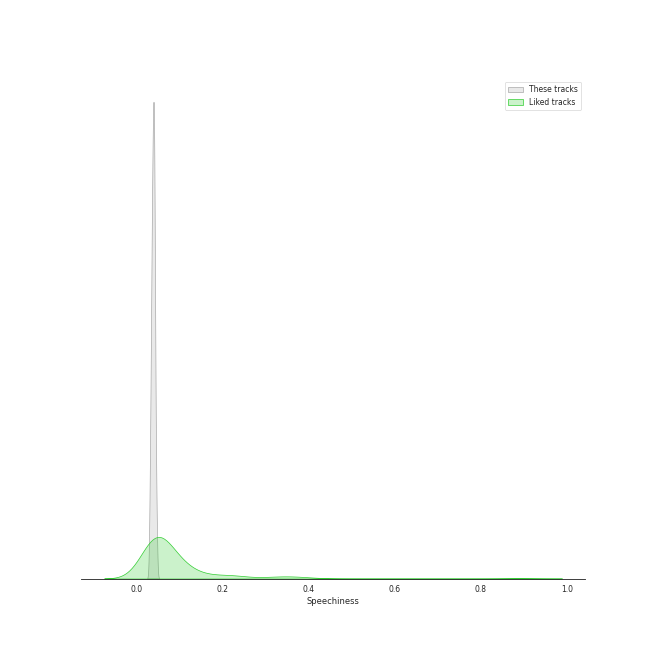
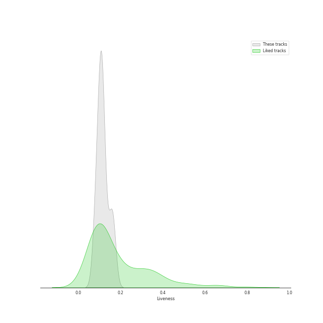
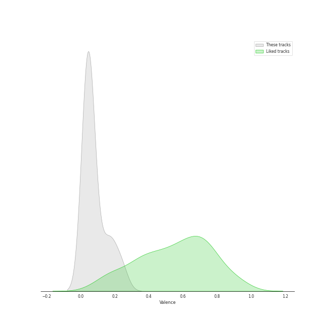

# Audio Features for Warner Classics UK

## Danceability

| ​ | 10 most Danceable tracks | ​​ | 10 least Danceable tracks |
|:---|:---|:---|:---|
|  | Brahms: Symphony No. 4 in E Minor, Op. 98: III. Allegro giocoso (0.321) |  | Brahms: Symphony No. 2 in D Major, Op. 73: II. Adagio non troppo (0.0817) |
|  | Brahms: Symphony No. 2 in D Major, Op. 73: III. Allegretto grazioso. Quasi andantino (0.28) |  | Brahms: Symphony No. 1 in C Minor, Op. 68: II. Andante sostenuto (0.0853) |
|  | Brahms: Symphony No. 2 in D Major, Op. 73: IV. Allegro con spirito (0.257) |  | Brahms: Symphony No. 3 in F Major, Op. 90: III. Poco allegretto (0.105) |
|  | Brahms: Symphony No. 1 in C Minor, Op. 68: IV. Finale. Adagio (0.23) |  | Brahms: Symphony No. 1 in C Minor, Op. 68: III. Un poco allegretto e grazioso (0.11) |
|  | Brahms: Symphony No. 1 in C Minor, Op. 68: I. Un poco sostenuto - Allegro (0.206) |  | Brahms: Symphony No. 4 in E Minor, Op. 98: II. Andante moderato (0.124) |
|  | Brahms: Symphony No. 2 in D Major, Op. 73: I. Allegro non troppo (0.195) |  | Brahms: Symphony No. 3 in F Major, Op. 90: II. Andante (0.125) |
|  | Brahms: Symphony No. 4 in E Minor, Op. 98: IV. Allegro energico e passionato (0.165) |  | Brahms: Symphony No. 3 in F Major, Op. 90: I. Allegro con brio (0.132) |
|  | Brahms: Symphony No. 4 in E Minor, Op. 98: I. Allegro non troppo (0.152) |  | Brahms: Symphony No. 3 in F Major, Op. 90: IV. Allegro (0.134) |
|  | Brahms: Symphony No. 3 in F Major, Op. 90: IV. Allegro (0.134) |  | Brahms: Symphony No. 4 in E Minor, Op. 98: I. Allegro non troppo (0.152) |
|  | Brahms: Symphony No. 3 in F Major, Op. 90: I. Allegro con brio (0.132) |  | Brahms: Symphony No. 4 in E Minor, Op. 98: IV. Allegro energico e passionato (0.165) |

## Energy

| ​ | 10 most Energetic tracks | ​​ | 10 least Energetic tracks |
|:---|:---|:---|:---|
|  | Brahms: Symphony No. 2 in D Major, Op. 73: IV. Allegro con spirito (0.248) |  | Brahms: Symphony No. 3 in F Major, Op. 90: II. Andante (0.0344) |
|  | Brahms: Symphony No. 4 in E Minor, Op. 98: III. Allegro giocoso (0.206) |  | Brahms: Symphony No. 3 in F Major, Op. 90: III. Poco allegretto (0.0406) |
|  | Brahms: Symphony No. 1 in C Minor, Op. 68: IV. Finale. Adagio (0.188) |  | Brahms: Symphony No. 4 in E Minor, Op. 98: II. Andante moderato (0.0602) |
|  | Brahms: Symphony No. 4 in E Minor, Op. 98: IV. Allegro energico e passionato (0.173) |  | Brahms: Symphony No. 2 in D Major, Op. 73: III. Allegretto grazioso. Quasi andantino (0.063) |
|  | Brahms: Symphony No. 4 in E Minor, Op. 98: I. Allegro non troppo (0.146) |  | Brahms: Symphony No. 1 in C Minor, Op. 68: II. Andante sostenuto (0.0817) |
|  | Brahms: Symphony No. 3 in F Major, Op. 90: IV. Allegro (0.146) |  | Brahms: Symphony No. 3 in F Major, Op. 90: I. Allegro con brio (0.0921) |
|  | Brahms: Symphony No. 1 in C Minor, Op. 68: I. Un poco sostenuto - Allegro (0.142) |  | Brahms: Symphony No. 2 in D Major, Op. 73: I. Allegro non troppo (0.0931) |
|  | Brahms: Symphony No. 2 in D Major, Op. 73: II. Adagio non troppo (0.126) |  | Brahms: Symphony No. 1 in C Minor, Op. 68: III. Un poco allegretto e grazioso (0.121) |
|  | Brahms: Symphony No. 1 in C Minor, Op. 68: III. Un poco allegretto e grazioso (0.121) |  | Brahms: Symphony No. 2 in D Major, Op. 73: II. Adagio non troppo (0.126) |
|  | Brahms: Symphony No. 2 in D Major, Op. 73: I. Allegro non troppo (0.0931) |  | Brahms: Symphony No. 1 in C Minor, Op. 68: I. Un poco sostenuto - Allegro (0.142) |

## Speechiness

| ​ | 10 most Speechy tracks | ​​ | 10 least Speechy tracks |
|:---|:---|:---|:---|
|  | Brahms: Symphony No. 1 in C Minor, Op. 68: II. Andante sostenuto (0.0466) |  | Brahms: Symphony No. 2 in D Major, Op. 73: IV. Allegro con spirito (0.0325) |
|  | Brahms: Symphony No. 2 in D Major, Op. 73: II. Adagio non troppo (0.0437) |  | Brahms: Symphony No. 1 in C Minor, Op. 68: I. Un poco sostenuto - Allegro (0.0343) |
|  | Brahms: Symphony No. 1 in C Minor, Op. 68: III. Un poco allegretto e grazioso (0.0427) |  | Brahms: Symphony No. 1 in C Minor, Op. 68: IV. Finale. Adagio (0.0361) |
|  | Brahms: Symphony No. 3 in F Major, Op. 90: II. Andante (0.0425) |  | Brahms: Symphony No. 3 in F Major, Op. 90: I. Allegro con brio (0.0363) |
|  | Brahms: Symphony No. 2 in D Major, Op. 73: III. Allegretto grazioso. Quasi andantino (0.0419) |  | Brahms: Symphony No. 4 in E Minor, Op. 98: I. Allegro non troppo (0.0373) |
|  | Brahms: Symphony No. 4 in E Minor, Op. 98: III. Allegro giocoso (0.0418) |  | Brahms: Symphony No. 3 in F Major, Op. 90: IV. Allegro (0.0377) |
|  | Brahms: Symphony No. 4 in E Minor, Op. 98: II. Andante moderato (0.0403) |  | Brahms: Symphony No. 4 in E Minor, Op. 98: IV. Allegro energico e passionato (0.0394) |
|  | Brahms: Symphony No. 2 in D Major, Op. 73: I. Allegro non troppo (0.0399) |  | Brahms: Symphony No. 3 in F Major, Op. 90: III. Poco allegretto (0.0396) |
|  | Brahms: Symphony No. 3 in F Major, Op. 90: III. Poco allegretto (0.0396) |  | Brahms: Symphony No. 2 in D Major, Op. 73: I. Allegro non troppo (0.0399) |
|  | Brahms: Symphony No. 4 in E Minor, Op. 98: IV. Allegro energico e passionato (0.0394) |  | Brahms: Symphony No. 4 in E Minor, Op. 98: II. Andante moderato (0.0403) |

## Acousticness

| ​ | 10 most Acoustic tracks | ​​ | 10 least Acoustic tracks |
|:---|:---|:---|:---|
|  | Brahms: Symphony No. 3 in F Major, Op. 90: III. Poco allegretto (0.987) |  | Brahms: Symphony No. 4 in E Minor, Op. 98: III. Allegro giocoso (0.953) |
|  | Brahms: Symphony No. 3 in F Major, Op. 90: II. Andante (0.983) |  | Brahms: Symphony No. 2 in D Major, Op. 73: IV. Allegro con spirito (0.955) |
|  | Brahms: Symphony No. 2 in D Major, Op. 73: III. Allegretto grazioso. Quasi andantino (0.983) |  | Brahms: Symphony No. 1 in C Minor, Op. 68: IV. Finale. Adagio (0.956) |
|  | Brahms: Symphony No. 4 in E Minor, Op. 98: II. Andante moderato (0.982) |  | Brahms: Symphony No. 1 in C Minor, Op. 68: I. Un poco sostenuto - Allegro (0.958) |
|  | Brahms: Symphony No. 3 in F Major, Op. 90: I. Allegro con brio (0.978) |  | Brahms: Symphony No. 1 in C Minor, Op. 68: II. Andante sostenuto (0.964) |
|  | Brahms: Symphony No. 4 in E Minor, Op. 98: IV. Allegro energico e passionato (0.978) |  | Brahms: Symphony No. 2 in D Major, Op. 73: II. Adagio non troppo (0.967) |
|  | Brahms: Symphony No. 3 in F Major, Op. 90: IV. Allegro (0.977) |  | Brahms: Symphony No. 2 in D Major, Op. 73: I. Allegro non troppo (0.972) |
|  | Brahms: Symphony No. 4 in E Minor, Op. 98: I. Allegro non troppo (0.974) |  | Brahms: Symphony No. 1 in C Minor, Op. 68: III. Un poco allegretto e grazioso (0.974) |
|  | Brahms: Symphony No. 1 in C Minor, Op. 68: III. Un poco allegretto e grazioso (0.974) |  | Brahms: Symphony No. 4 in E Minor, Op. 98: I. Allegro non troppo (0.974) |
|  | Brahms: Symphony No. 2 in D Major, Op. 73: I. Allegro non troppo (0.972) |  | Brahms: Symphony No. 3 in F Major, Op. 90: IV. Allegro (0.977) |

## Instrumentalness

| ​ | 10 most Instrumental tracks | ​​ | 10 least Instrumental tracks |
|:---|:---|:---|:---|
|  | Brahms: Symphony No. 1 in C Minor, Op. 68: III. Un poco allegretto e grazioso (0.928) |  | Brahms: Symphony No. 1 in C Minor, Op. 68: II. Andante sostenuto (0.829) |
|  | Brahms: Symphony No. 3 in F Major, Op. 90: II. Andante (0.922) |  | Brahms: Symphony No. 2 in D Major, Op. 73: II. Adagio non troppo (0.863) |
|  | Brahms: Symphony No. 1 in C Minor, Op. 68: IV. Finale. Adagio (0.922) |  | Brahms: Symphony No. 2 in D Major, Op. 73: I. Allegro non troppo (0.883) |
|  | Brahms: Symphony No. 2 in D Major, Op. 73: IV. Allegro con spirito (0.905) |  | Brahms: Symphony No. 3 in F Major, Op. 90: III. Poco allegretto (0.886) |
|  | Brahms: Symphony No. 4 in E Minor, Op. 98: I. Allegro non troppo (0.904) |  | Brahms: Symphony No. 4 in E Minor, Op. 98: III. Allegro giocoso (0.886) |
|  | Brahms: Symphony No. 3 in F Major, Op. 90: IV. Allegro (0.904) |  | Brahms: Symphony No. 2 in D Major, Op. 73: III. Allegretto grazioso. Quasi andantino (0.887) |
|  | Brahms: Symphony No. 4 in E Minor, Op. 98: II. Andante moderato (0.902) |  | Brahms: Symphony No. 1 in C Minor, Op. 68: I. Un poco sostenuto - Allegro (0.892) |
|  | Brahms: Symphony No. 3 in F Major, Op. 90: I. Allegro con brio (0.896) |  | Brahms: Symphony No. 4 in E Minor, Op. 98: IV. Allegro energico e passionato (0.893) |
|  | Brahms: Symphony No. 4 in E Minor, Op. 98: IV. Allegro energico e passionato (0.893) |  | Brahms: Symphony No. 3 in F Major, Op. 90: I. Allegro con brio (0.896) |
|  | Brahms: Symphony No. 1 in C Minor, Op. 68: I. Un poco sostenuto - Allegro (0.892) |  | Brahms: Symphony No. 4 in E Minor, Op. 98: II. Andante moderato (0.902) |

## Liveness

| ​ | 10 most Live tracks | ​​ | 10 least Live tracks |
|:---|:---|:---|:---|
|  | Brahms: Symphony No. 4 in E Minor, Op. 98: I. Allegro non troppo (0.167) |  | Brahms: Symphony No. 4 in E Minor, Op. 98: II. Andante moderato (0.0791) |
|  | Brahms: Symphony No. 1 in C Minor, Op. 68: III. Un poco allegretto e grazioso (0.16) |  | Brahms: Symphony No. 3 in F Major, Op. 90: I. Allegro con brio (0.0825) |
|  | Brahms: Symphony No. 3 in F Major, Op. 90: II. Andante (0.156) |  | Brahms: Symphony No. 4 in E Minor, Op. 98: IV. Allegro energico e passionato (0.0907) |
|  | Brahms: Symphony No. 4 in E Minor, Op. 98: III. Allegro giocoso (0.134) |  | Brahms: Symphony No. 3 in F Major, Op. 90: IV. Allegro (0.0973) |
|  | Brahms: Symphony No. 3 in F Major, Op. 90: III. Poco allegretto (0.12) |  | Brahms: Symphony No. 1 in C Minor, Op. 68: IV. Finale. Adagio (0.106) |
|  | Brahms: Symphony No. 1 in C Minor, Op. 68: I. Un poco sostenuto - Allegro (0.112) |  | Brahms: Symphony No. 2 in D Major, Op. 73: II. Adagio non troppo (0.107) |
|  | Brahms: Symphony No. 2 in D Major, Op. 73: IV. Allegro con spirito (0.111) |  | Brahms: Symphony No. 2 in D Major, Op. 73: III. Allegretto grazioso. Quasi andantino (0.109) |
|  | Brahms: Symphony No. 1 in C Minor, Op. 68: II. Andante sostenuto (0.11) |  | Brahms: Symphony No. 2 in D Major, Op. 73: I. Allegro non troppo (0.109) |
|  | Brahms: Symphony No. 2 in D Major, Op. 73: I. Allegro non troppo (0.109) |  | Brahms: Symphony No. 1 in C Minor, Op. 68: II. Andante sostenuto (0.11) |
|  | Brahms: Symphony No. 2 in D Major, Op. 73: III. Allegretto grazioso. Quasi andantino (0.109) |  | Brahms: Symphony No. 2 in D Major, Op. 73: IV. Allegro con spirito (0.111) |

## Valence

| ​ | 10 most Happy tracks | ​​ | 10 least Happy tracks |
|:---|:---|:---|:---|
|  | Brahms: Symphony No. 4 in E Minor, Op. 98: III. Allegro giocoso (0.242) |  | Brahms: Symphony No. 3 in F Major, Op. 90: II. Andante (0.0345) |
|  | Brahms: Symphony No. 2 in D Major, Op. 73: IV. Allegro con spirito (0.192) |  | Brahms: Symphony No. 2 in D Major, Op. 73: II. Adagio non troppo (0.0353) |
|  | Brahms: Symphony No. 2 in D Major, Op. 73: III. Allegretto grazioso. Quasi andantino (0.166) |  | Brahms: Symphony No. 1 in C Minor, Op. 68: II. Andante sostenuto (0.0358) |
|  | Brahms: Symphony No. 1 in C Minor, Op. 68: III. Un poco allegretto e grazioso (0.13) |  | Brahms: Symphony No. 4 in E Minor, Op. 98: II. Andante moderato (0.0377) |
|  | Brahms: Symphony No. 1 in C Minor, Op. 68: IV. Finale. Adagio (0.0727) |  | Brahms: Symphony No. 2 in D Major, Op. 73: I. Allegro non troppo (0.0389) |
|  | Brahms: Symphony No. 4 in E Minor, Op. 98: I. Allegro non troppo (0.0648) |  | Brahms: Symphony No. 3 in F Major, Op. 90: III. Poco allegretto (0.0395) |
|  | Brahms: Symphony No. 1 in C Minor, Op. 68: I. Un poco sostenuto - Allegro (0.0535) |  | Brahms: Symphony No. 3 in F Major, Op. 90: I. Allegro con brio (0.0395) |
|  | Brahms: Symphony No. 3 in F Major, Op. 90: IV. Allegro (0.0487) |  | Brahms: Symphony No. 4 in E Minor, Op. 98: IV. Allegro energico e passionato (0.0415) |
|  | Brahms: Symphony No. 4 in E Minor, Op. 98: IV. Allegro energico e passionato (0.0415) |  | Brahms: Symphony No. 3 in F Major, Op. 90: IV. Allegro (0.0487) |
|  | Brahms: Symphony No. 3 in F Major, Op. 90: I. Allegro con brio (0.0395) |  | Brahms: Symphony No. 1 in C Minor, Op. 68: I. Un poco sostenuto - Allegro (0.0535) |

## Tempo

| ​ | 10 most Fast tracks | ​​ | 10 least Fast tracks |
|:---|:---|:---|:---|
|  | Brahms: Symphony No. 1 in C Minor, Op. 68: IV. Finale. Adagio (134.592) |  | Brahms: Symphony No. 3 in F Major, Op. 90: II. Andante (60.218) |
|  | Brahms: Symphony No. 2 in D Major, Op. 73: I. Allegro non troppo (120.806) |  | Brahms: Symphony No. 4 in E Minor, Op. 98: II. Andante moderato (69.042) |
|  | Brahms: Symphony No. 4 in E Minor, Op. 98: III. Allegro giocoso (118.069) |  | Brahms: Symphony No. 4 in E Minor, Op. 98: I. Allegro non troppo (73.925) |
|  | Brahms: Symphony No. 2 in D Major, Op. 73: IV. Allegro con spirito (101.371) |  | Brahms: Symphony No. 1 in C Minor, Op. 68: III. Un poco allegretto e grazioso (75.646) |
|  | Brahms: Symphony No. 1 in C Minor, Op. 68: I. Un poco sostenuto - Allegro (96.728) |  | Brahms: Symphony No. 3 in F Major, Op. 90: IV. Allegro (76.428) |
|  | Brahms: Symphony No. 2 in D Major, Op. 73: III. Allegretto grazioso. Quasi andantino (88.225) |  | Brahms: Symphony No. 1 in C Minor, Op. 68: II. Andante sostenuto (76.601) |
|  | Brahms: Symphony No. 4 in E Minor, Op. 98: IV. Allegro energico e passionato (87.767) |  | Brahms: Symphony No. 3 in F Major, Op. 90: I. Allegro con brio (77.537) |
|  | Brahms: Symphony No. 3 in F Major, Op. 90: III. Poco allegretto (83.372) |  | Brahms: Symphony No. 2 in D Major, Op. 73: II. Adagio non troppo (82.317) |
|  | Brahms: Symphony No. 2 in D Major, Op. 73: II. Adagio non troppo (82.317) |  | Brahms: Symphony No. 3 in F Major, Op. 90: III. Poco allegretto (83.372) |
|  | Brahms: Symphony No. 3 in F Major, Op. 90: I. Allegro con brio (77.537) |  | Brahms: Symphony No. 4 in E Minor, Op. 98: IV. Allegro energico e passionato (87.767) |
