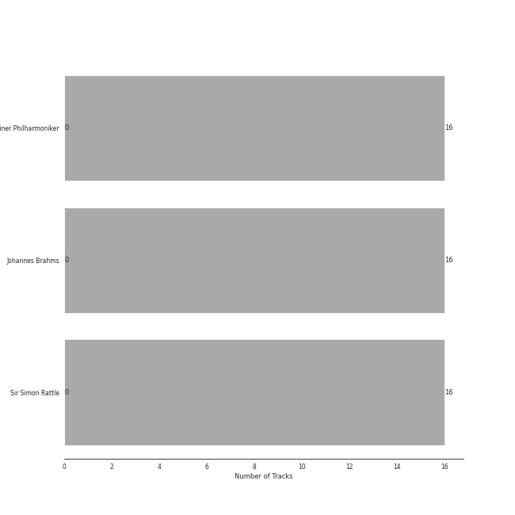
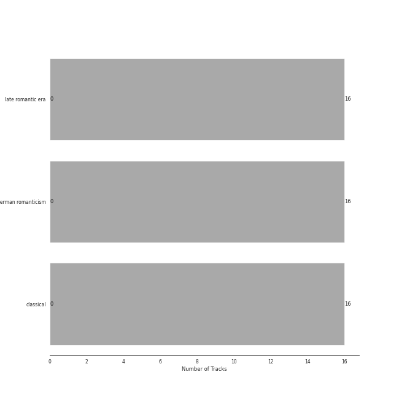

# Warner Classics UK

16 songs

[See Track Features](audio_features.md)

[See Clusters](clusters/overview.md)

Appears as:
- Warner Classics UK (16 tracks)

## Top Artists

| Art | Rank | Tracks | 💚 | Artist | 🔗 |
|:---|---:|---:|---:|:---|:---|
|  | 409 | 16 | 0 | [Berliner Philharmoniker](../../artists/berliner_philharmoniker/overview.md) | [🔗](https://open.spotify.com/artist/6uRJnvQ3f8whVnmeoecv5Z) |
|  | 409 | 16 | 0 | Johannes Brahms | [🔗](https://open.spotify.com/artist/5wTAi7QkpP6kp8a54lmTOq) |
|  | 409 | 16 | 0 | Sir Simon Rattle | [🔗](https://open.spotify.com/artist/4GQwgdcDQwqtcHICjUNndp) |

## Top Albums

| Art | Rank | Tracks | 💚 | Album | Release Date | 🔗 |
|:---|---:|---:|---:|:---|:---|:---|
|  | 599 | 16 | 0 | Brahms: The Symphonies | 2009-09-07 | [🔗](https://open.spotify.com/album/2dL2qDsg6teV1cueLxCRa1) |

## Genres

| Tracks | 💚 | Genre |
|---:|---:|:---|
| 16 | 0 | [late romantic era](../../genres/late_romantic_era/overview.md) |
| 16 | 0 | [german romanticism](../../genres/german_romanticism/overview.md) |
| 16 | 0 | [classical](../../genres/classical/overview.md) |

## Tracks released under Warner Classics UK

| Art | Track | Album | Artists | Label | Rank | 💚 | 🔗 |
|:---|:---|:---|:---|:---|---:|:---|:---|
|  | Brahms: Symphony No. 1 in C Minor, Op. 68: I. Un poco sostenuto - Allegro | Brahms: The Symphonies | Johannes Brahms, Sir Simon Rattle, [Berliner Philharmoniker](../../artists/berliner_philharmoniker/overview.md) | [Warner Classics UK](.) | 894 | | [🔗](https://open.spotify.com/track/5Z54n5ngPbZbwDBQdKdKp8) |
|  | Brahms: Symphony No. 1 in C Minor, Op. 68: II. Andante sostenuto | Brahms: The Symphonies | Johannes Brahms, Sir Simon Rattle, [Berliner Philharmoniker](../../artists/berliner_philharmoniker/overview.md) | [Warner Classics UK](.) | 894 | | [🔗](https://open.spotify.com/track/5Cs2FNo5IcZzNQ7D3zCOvY) |
|  | Brahms: Symphony No. 1 in C Minor, Op. 68: III. Un poco allegretto e grazioso | Brahms: The Symphonies | Johannes Brahms, Sir Simon Rattle, [Berliner Philharmoniker](../../artists/berliner_philharmoniker/overview.md) | [Warner Classics UK](.) | 894 | | [🔗](https://open.spotify.com/track/3UhJIGHLf6MzJRO8GVXhuu) |
|  | Brahms: Symphony No. 1 in C Minor, Op. 68: IV. Finale. Adagio | Brahms: The Symphonies | Johannes Brahms, Sir Simon Rattle, [Berliner Philharmoniker](../../artists/berliner_philharmoniker/overview.md) | [Warner Classics UK](.) | 894 | | [🔗](https://open.spotify.com/track/4BP6nac4rHdcyceIrKDn7U) |
|  | Brahms: Symphony No. 2 in D Major, Op. 73: I. Allegro non troppo | Brahms: The Symphonies | Johannes Brahms, Sir Simon Rattle, [Berliner Philharmoniker](../../artists/berliner_philharmoniker/overview.md) | [Warner Classics UK](.) | 894 | | [🔗](https://open.spotify.com/track/43cLCzOqxYJOZMgpxdTcRt) |
|  | Brahms: Symphony No. 2 in D Major, Op. 73: II. Adagio non troppo | Brahms: The Symphonies | Johannes Brahms, Sir Simon Rattle, [Berliner Philharmoniker](../../artists/berliner_philharmoniker/overview.md) | [Warner Classics UK](.) | 894 | | [🔗](https://open.spotify.com/track/6xzBhr93Ke9xsnq2S4T794) |
|  | Brahms: Symphony No. 2 in D Major, Op. 73: III. Allegretto grazioso. Quasi andantino | Brahms: The Symphonies | Johannes Brahms, Sir Simon Rattle, [Berliner Philharmoniker](../../artists/berliner_philharmoniker/overview.md) | [Warner Classics UK](.) | 894 | | [🔗](https://open.spotify.com/track/3hrBvTIOU6Jmz9G6tLPNjT) |
|  | Brahms: Symphony No. 2 in D Major, Op. 73: IV. Allegro con spirito | Brahms: The Symphonies | Johannes Brahms, Sir Simon Rattle, [Berliner Philharmoniker](../../artists/berliner_philharmoniker/overview.md) | [Warner Classics UK](.) | 894 | | [🔗](https://open.spotify.com/track/4oFZSkq6jbjnaSVuC7bTmT) |
|  | Brahms: Symphony No. 3 in F Major, Op. 90: I. Allegro con brio | Brahms: The Symphonies | Johannes Brahms, Sir Simon Rattle, [Berliner Philharmoniker](../../artists/berliner_philharmoniker/overview.md) | [Warner Classics UK](.) | 894 | | [🔗](https://open.spotify.com/track/5vD87EDQ5393SXd6lAwAgt) |
|  | Brahms: Symphony No. 3 in F Major, Op. 90: II. Andante | Brahms: The Symphonies | Johannes Brahms, Sir Simon Rattle, [Berliner Philharmoniker](../../artists/berliner_philharmoniker/overview.md) | [Warner Classics UK](.) | 894 | | [🔗](https://open.spotify.com/track/5ZM1lKfyXHhB3NP5At5yr0) |

See all tracks

| Art | Track | Album | Artists | Label | Rank | 💚 | 🔗 |
|:---|:---|:---|:---|:---|---:|:---|:---|
|  | Brahms: Symphony No. 3 in F Major, Op. 90: III. Poco allegretto | Brahms: The Symphonies | Johannes Brahms, Sir Simon Rattle, [Berliner Philharmoniker](../../artists/berliner_philharmoniker/overview.md) | [Warner Classics UK](.) | 894 | | [🔗](https://open.spotify.com/track/03JOtXKbbCnjgbska9eddP) |
|  | Brahms: Symphony No. 3 in F Major, Op. 90: IV. Allegro | Brahms: The Symphonies | Johannes Brahms, Sir Simon Rattle, [Berliner Philharmoniker](../../artists/berliner_philharmoniker/overview.md) | [Warner Classics UK](.) | 894 | | [🔗](https://open.spotify.com/track/3pH6LDBnnRI5qqdx4dOtWJ) |
|  | Brahms: Symphony No. 4 in E Minor, Op. 98: I. Allegro non troppo | Brahms: The Symphonies | Johannes Brahms, Sir Simon Rattle, [Berliner Philharmoniker](../../artists/berliner_philharmoniker/overview.md) | [Warner Classics UK](.) | 894 | | [🔗](https://open.spotify.com/track/5jDYTL4vk1xVmpUBAnJSs3) |
|  | Brahms: Symphony No. 4 in E Minor, Op. 98: II. Andante moderato | Brahms: The Symphonies | Johannes Brahms, Sir Simon Rattle, [Berliner Philharmoniker](../../artists/berliner_philharmoniker/overview.md) | [Warner Classics UK](.) | 894 | | [🔗](https://open.spotify.com/track/2mTyhF3hFKcMgCXqjqjfUA) |
|  | Brahms: Symphony No. 4 in E Minor, Op. 98: III. Allegro giocoso | Brahms: The Symphonies | Johannes Brahms, Sir Simon Rattle, [Berliner Philharmoniker](../../artists/berliner_philharmoniker/overview.md) | [Warner Classics UK](.) | 894 | | [🔗](https://open.spotify.com/track/7ttydPgjXuINlz1ZAt7Njo) |
|  | Brahms: Symphony No. 4 in E Minor, Op. 98: IV. Allegro energico e passionato | Brahms: The Symphonies | Johannes Brahms, Sir Simon Rattle, [Berliner Philharmoniker](../../artists/berliner_philharmoniker/overview.md) | [Warner Classics UK](.) | 894 | | [🔗](https://open.spotify.com/track/5t3emgX0Pr1RZ5upzvdBzg) |

