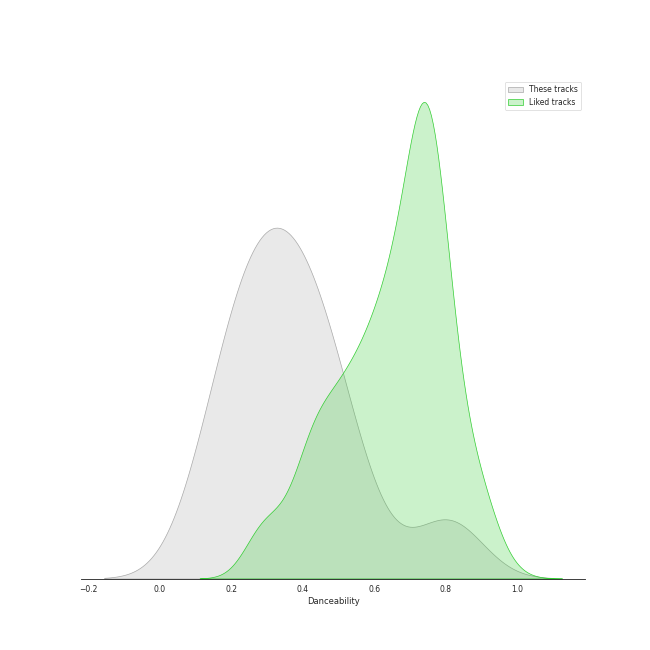
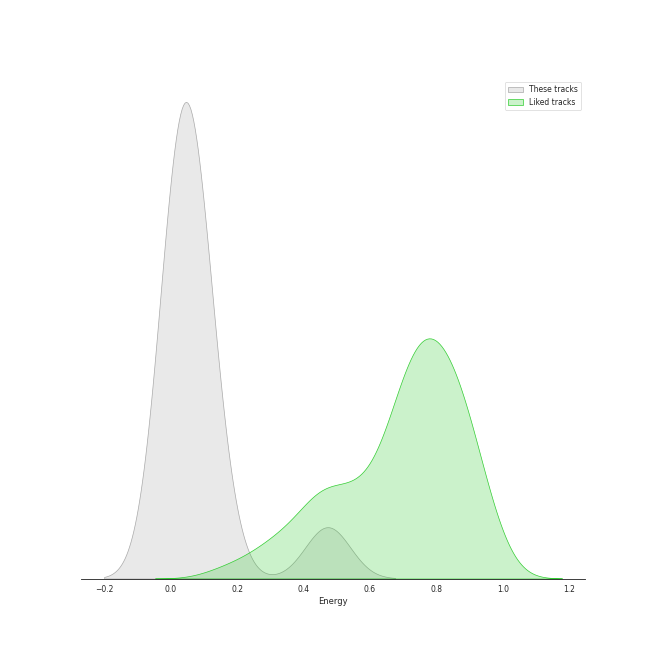
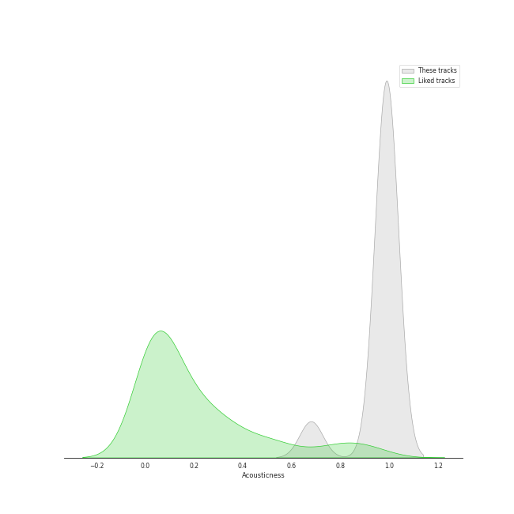
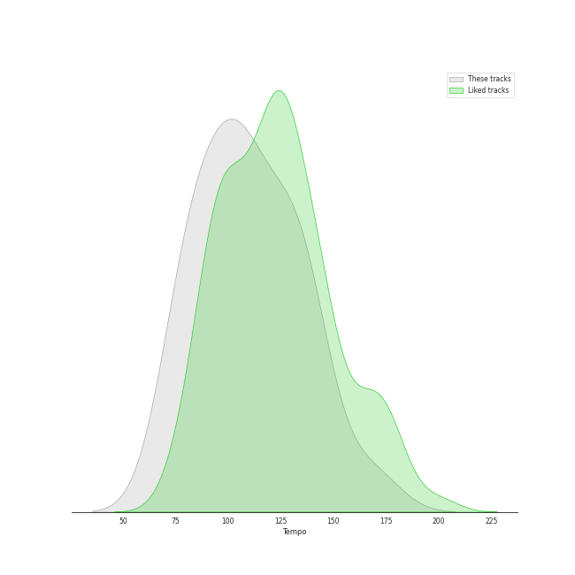

# Track Features for Warner Music Group - X5 Music Group

## Danceability

| ​ | 10 most Danceable tracks | ​​ | 10 least Danceable tracks |
|:---|:---|:---|:---|
|  | Dominick the Donkey (The Italian Christmas Donkey) (0.807) |  | Piano Concerto No. 21 in C Major, K. 467 "Elvira Madigan": II. Andante (0.132) |
|  | Dominick the Donkey (The Italian Christmas Donkey) [with Joe Reisman's Orchestra and Chorus] (0.807) |  | Fauré Pavane (0.137) |
|  | Piano Sonata No. 11 in A Major, K. 331 "Turkish March": III. Alla turca (0.571) |  | Piano Concerto No. 27 in B-Flat Major, K. 595: II. Larghetto (0.196) |
|  | Piano Sonata No. 16 in C Major, K. 545 "Sonata facile": III. Rondo (0.49) |  | Piano Concerto No. 20 in D Minor, K. 466: II. Romance (0.202) |
|  | Piano Sonata No. 12 in F Major, K. 332: II. Adagio (0.486) |  | Piano Concerto No. 24 in C Minor, K. 491: I. Allegro (0.232) |
|  | Piano Sonata No. 9 in D Major, K. 311: II. Andante con expressione (0.485) |  | Piano Concerto No. 23 in A Major, K. 488: II. Adagio (0.236) |
|  | Piano Sonata No. 10 in C Major, K. 330: II. Andante cantabile (0.463) |  | Piano Concerto No. 24 in C Minor, K. 491: II. Larghetto (0.259) |
|  | Piano Concerto No. 26 in D Major, K. 537 "Coronation": II. Larghetto (0.403) |  | Piano Concerto No. 5 in D Major, K. 175: II. Andante ma un poco adagio (0.289) |
|  | Piano Sonata No. 16 in C Major, K. 545 "Sonata facile": II. Andante (0.402) |  | Piano Concerto No. 20 in D Minor, K. 466: I. Allegro (0.297) |
|  | Piano Sonata No. 18 in D Major, K. 576: I. Allegro (0.39) |  | Piano Concerto No. 23 in A Major, K. 488: I. Allegro (0.299) |

## Energy

| ​ | 10 most Energetic tracks | ​​ | 10 least Energetic tracks |
|:---|:---|:---|:---|
|  | Dominick the Donkey (The Italian Christmas Donkey) (0.473) |  | Piano Sonata No. 10 in C Major, K. 330: II. Andante cantabile (0.00316) |
|  | Dominick the Donkey (The Italian Christmas Donkey) [with Joe Reisman's Orchestra and Chorus] (0.473) |  | Piano Concerto No. 23 in A Major, K. 488: II. Adagio (0.0131) |
|  | Piano Concerto No. 24 in C Minor, K. 491: I. Allegro (0.124) |  | Piano Sonata No. 9 in D Major, K. 311: II. Andante con expressione (0.0132) |
|  | Fauré Pavane (0.112) |  | Piano Sonata No. 16 in C Major, K. 545 "Sonata facile": II. Andante (0.0138) |
|  | Piano Concerto No. 23 in A Major, K. 488: I. Allegro (0.107) |  | Piano Concerto No. 27 in B-Flat Major, K. 595: II. Larghetto (0.0142) |
|  | Piano Sonata No. 11 in A Major, K. 331 "Turkish March": III. Alla turca (0.0909) |  | Piano Sonata No. 14 in C Minor, K. 457: I. Molto allegro (0.0273) |
|  | Piano Concerto No. 20 in D Minor, K. 466: I. Allegro (0.0842) |  | Piano Sonata No. 12 in F Major, K. 332: II. Adagio (0.0282) |
|  | Piano Sonata No. 16 in C Major, K. 545 "Sonata facile": III. Rondo (0.0718) |  | Piano Sonata No. 10 in C Major, K. 330: I. Allegro moderato (0.0298) |
|  | Piano Sonata No. 18 in D Major, K. 576: I. Allegro (0.0629) |  | Piano Concerto No. 24 in C Minor, K. 491: II. Larghetto (0.0314) |
|  | Piano Sonata No. 16 in C Major, K. 545 "Sonata facile": I. Allegro (0.057) |  | Piano Concerto No. 5 in D Major, K. 175: II. Andante ma un poco adagio (0.034) |

## Speechiness

| ​ | 10 most Speechy tracks | ​​ | 10 least Speechy tracks |
|:---|:---|:---|:---|
|  | Piano Sonata No. 10 in C Major, K. 330: II. Andante cantabile (0.0534) |  | Piano Concerto No. 20 in D Minor, K. 466: II. Romance (0.0344) |
|  | Piano Sonata No. 9 in D Major, K. 311: II. Andante con expressione (0.0509) |  | Piano Concerto No. 26 in D Major, K. 537 "Coronation": II. Larghetto (0.0351) |
|  | Piano Sonata No. 14 in C Minor, K. 457: I. Molto allegro (0.0486) |  | Piano Concerto No. 23 in A Major, K. 488: II. Adagio (0.0358) |
|  | Dominick the Donkey (The Italian Christmas Donkey) (0.047) |  | Fauré Pavane (0.0371) |
|  | Dominick the Donkey (The Italian Christmas Donkey) [with Joe Reisman's Orchestra and Chorus] (0.047) |  | Piano Sonata No. 16 in C Major, K. 545 "Sonata facile": I. Allegro (0.0373) |
|  | Piano Sonata No. 11 in A Major, K. 331 "Turkish March": III. Alla turca (0.0457) |  | Piano Concerto No. 20 in D Minor, K. 466: I. Allegro (0.0378) |
|  | Piano Sonata No. 12 in F Major, K. 332: II. Adagio (0.0457) |  | Piano Concerto No. 24 in C Minor, K. 491: I. Allegro (0.0379) |
|  | Piano Sonata No. 16 in C Major, K. 545 "Sonata facile": II. Andante (0.0453) |  | Piano Concerto No. 5 in D Major, K. 175: II. Andante ma un poco adagio (0.0379) |
|  | Piano Sonata No. 16 in C Major, K. 545 "Sonata facile": III. Rondo (0.0432) |  | Piano Concerto No. 27 in B-Flat Major, K. 595: II. Larghetto (0.0387) |
|  | Piano Sonata No. 10 in C Major, K. 330: I. Allegro moderato (0.0397) |  | Piano Concerto No. 21 in C Major, K. 467 "Elvira Madigan": II. Andante (0.0387) |

## Acousticness

| ​ | 10 most Acoustic tracks | ​​ | 10 least Acoustic tracks |
|:---|:---|:---|:---|
|  | Piano Sonata No. 10 in C Major, K. 330: II. Andante cantabile (0.996) |  | Dominick the Donkey (The Italian Christmas Donkey) [with Joe Reisman's Orchestra and Chorus] (0.68) |
|  | Piano Sonata No. 16 in C Major, K. 545 "Sonata facile": II. Andante (0.995) |  | Dominick the Donkey (The Italian Christmas Donkey) (0.68) |
|  | Piano Sonata No. 9 in D Major, K. 311: II. Andante con expressione (0.995) |  | Piano Concerto No. 21 in C Major, K. 467 "Elvira Madigan": II. Andante (0.975) |
|  | Piano Sonata No. 12 in F Major, K. 332: II. Adagio (0.995) |  | Piano Concerto No. 5 in D Major, K. 175: II. Andante ma un poco adagio (0.979) |
|  | Piano Sonata No. 18 in D Major, K. 576: I. Allegro (0.994) |  | Fauré Pavane (0.981) |
|  | Piano Sonata No. 10 in C Major, K. 330: I. Allegro moderato (0.994) |  | Piano Concerto No. 20 in D Minor, K. 466: I. Allegro (0.981) |
|  | Piano Sonata No. 11 in A Major, K. 331 "Turkish March": III. Alla turca (0.994) |  | Piano Concerto No. 27 in B-Flat Major, K. 595: II. Larghetto (0.987) |
|  | Piano Concerto No. 24 in C Minor, K. 491: II. Larghetto (0.993) |  | Piano Concerto No. 23 in A Major, K. 488: II. Adagio (0.988) |
|  | Piano Sonata No. 16 in C Major, K. 545 "Sonata facile": III. Rondo (0.993) |  | Piano Concerto No. 24 in C Minor, K. 491: I. Allegro (0.989) |
|  | Piano Sonata No. 16 in C Major, K. 545 "Sonata facile": I. Allegro (0.992) |  | Piano Concerto No. 20 in D Minor, K. 466: II. Romance (0.989) |

## Instrumentalness

| ​ | 10 most Instrumental tracks | ​​ | 10 least Instrumental tracks |
|:---|:---|:---|:---|
|  | Piano Sonata No. 16 in C Major, K. 545 "Sonata facile": III. Rondo (0.954) |  | Dominick the Donkey (The Italian Christmas Donkey) [with Joe Reisman's Orchestra and Chorus] (0.0) |
|  | Piano Concerto No. 20 in D Minor, K. 466: I. Allegro (0.948) |  | Dominick the Donkey (The Italian Christmas Donkey) (0.0) |
|  | Piano Sonata No. 11 in A Major, K. 331 "Turkish March": III. Alla turca (0.94) |  | Piano Sonata No. 16 in C Major, K. 545 "Sonata facile": I. Allegro (0.868) |
|  | Piano Sonata No. 18 in D Major, K. 576: I. Allegro (0.932) |  | Piano Concerto No. 24 in C Minor, K. 491: II. Larghetto (0.869) |
|  | Piano Sonata No. 10 in C Major, K. 330: I. Allegro moderato (0.931) |  | Piano Concerto No. 5 in D Major, K. 175: II. Andante ma un poco adagio (0.869) |
|  | Piano Sonata No. 16 in C Major, K. 545 "Sonata facile": II. Andante (0.927) |  | Fauré Pavane (0.876) |
|  | Piano Sonata No. 12 in F Major, K. 332: II. Adagio (0.922) |  | Piano Concerto No. 27 in B-Flat Major, K. 595: II. Larghetto (0.877) |
|  | Piano Concerto No. 24 in C Minor, K. 491: I. Allegro (0.917) |  | Piano Concerto No. 23 in A Major, K. 488: I. Allegro (0.883) |
|  | Piano Concerto No. 21 in C Major, K. 467 "Elvira Madigan": II. Andante (0.913) |  | Piano Sonata No. 9 in D Major, K. 311: II. Andante con expressione (0.889) |
|  | Piano Sonata No. 10 in C Major, K. 330: II. Andante cantabile (0.911) |  | Piano Concerto No. 23 in A Major, K. 488: II. Adagio (0.891) |

## Liveness

| ​ | 10 most Live tracks | ​​ | 10 least Live tracks |
|:---|:---|:---|:---|
|  | Piano Concerto No. 23 in A Major, K. 488: I. Allegro (0.291) |  | Piano Sonata No. 10 in C Major, K. 330: II. Andante cantabile (0.0583) |
|  | Dominick the Donkey (The Italian Christmas Donkey) (0.179) |  | Piano Sonata No. 16 in C Major, K. 545 "Sonata facile": II. Andante (0.0625) |
|  | Dominick the Donkey (The Italian Christmas Donkey) [with Joe Reisman's Orchestra and Chorus] (0.179) |  | Piano Sonata No. 10 in C Major, K. 330: I. Allegro moderato (0.0702) |
|  | Piano Sonata No. 9 in D Major, K. 311: II. Andante con expressione (0.16) |  | Piano Sonata No. 11 in A Major, K. 331 "Turkish March": III. Alla turca (0.0769) |
|  | Piano Sonata No. 16 in C Major, K. 545 "Sonata facile": I. Allegro (0.143) |  | Piano Sonata No. 16 in C Major, K. 545 "Sonata facile": III. Rondo (0.0877) |
|  | Piano Sonata No. 14 in C Minor, K. 457: I. Molto allegro (0.138) |  | Piano Concerto No. 27 in B-Flat Major, K. 595: II. Larghetto (0.0948) |
|  | Piano Sonata No. 18 in D Major, K. 576: I. Allegro (0.128) |  | Piano Concerto No. 5 in D Major, K. 175: II. Andante ma un poco adagio (0.0964) |
|  | Piano Concerto No. 20 in D Minor, K. 466: II. Romance (0.128) |  | Piano Sonata No. 12 in F Major, K. 332: II. Adagio (0.0978) |
|  | Fauré Pavane (0.123) |  | Piano Concerto No. 26 in D Major, K. 537 "Coronation": II. Larghetto (0.102) |
|  | Piano Concerto No. 23 in A Major, K. 488: II. Adagio (0.12) |  | Piano Concerto No. 21 in C Major, K. 467 "Elvira Madigan": II. Andante (0.103) |

## Valence

| ​ | 10 most Happy tracks | ​​ | 10 least Happy tracks |
|:---|:---|:---|:---|
|  | Dominick the Donkey (The Italian Christmas Donkey) (0.963) |  | Piano Concerto No. 23 in A Major, K. 488: II. Adagio (0.0519) |
|  | Dominick the Donkey (The Italian Christmas Donkey) [with Joe Reisman's Orchestra and Chorus] (0.963) |  | Piano Concerto No. 27 in B-Flat Major, K. 595: II. Larghetto (0.0666) |
|  | Piano Sonata No. 10 in C Major, K. 330: I. Allegro moderato (0.616) |  | Fauré Pavane (0.0673) |
|  | Piano Sonata No. 11 in A Major, K. 331 "Turkish March": III. Alla turca (0.612) |  | Piano Concerto No. 21 in C Major, K. 467 "Elvira Madigan": II. Andante (0.0789) |
|  | Piano Sonata No. 16 in C Major, K. 545 "Sonata facile": I. Allegro (0.537) |  | Piano Concerto No. 24 in C Minor, K. 491: II. Larghetto (0.1) |
|  | Piano Sonata No. 18 in D Major, K. 576: I. Allegro (0.531) |  | Piano Concerto No. 24 in C Minor, K. 491: I. Allegro (0.107) |
|  | Piano Sonata No. 16 in C Major, K. 545 "Sonata facile": III. Rondo (0.48) |  | Piano Concerto No. 20 in D Minor, K. 466: II. Romance (0.114) |
|  | Piano Sonata No. 16 in C Major, K. 545 "Sonata facile": II. Andante (0.467) |  | Piano Concerto No. 20 in D Minor, K. 466: I. Allegro (0.114) |
|  | Piano Sonata No. 14 in C Minor, K. 457: I. Molto allegro (0.4) |  | Piano Sonata No. 10 in C Major, K. 330: II. Andante cantabile (0.142) |
|  | Piano Sonata No. 9 in D Major, K. 311: II. Andante con expressione (0.342) |  | Piano Concerto No. 26 in D Major, K. 537 "Coronation": II. Larghetto (0.175) |

## Tempo

| ​ | 10 most Fast tracks | ​​ | 10 least Fast tracks |
|:---|:---|:---|:---|
|  | Piano Sonata No. 14 in C Minor, K. 457: I. Molto allegro (168.671) |  | Piano Concerto No. 27 in B-Flat Major, K. 595: II. Larghetto (74.798) |
|  | Piano Sonata No. 10 in C Major, K. 330: I. Allegro moderato (141.45) |  | Piano Concerto No. 21 in C Major, K. 467 "Elvira Madigan": II. Andante (75.319) |
|  | Piano Sonata No. 16 in C Major, K. 545 "Sonata facile": I. Allegro (141.073) |  | Piano Concerto No. 23 in A Major, K. 488: II. Adagio (81.056) |
|  | Piano Concerto No. 24 in C Minor, K. 491: I. Allegro (136.385) |  | Piano Concerto No. 20 in D Minor, K. 466: II. Romance (82.885) |
|  | Piano Sonata No. 18 in D Major, K. 576: I. Allegro (131.445) |  | Fauré Pavane (83.35) |
|  | Piano Concerto No. 23 in A Major, K. 488: I. Allegro (128.536) |  | Piano Sonata No. 16 in C Major, K. 545 "Sonata facile": II. Andante (90.283) |
|  | Piano Concerto No. 20 in D Minor, K. 466: I. Allegro (128.477) |  | Piano Concerto No. 26 in D Major, K. 537 "Coronation": II. Larghetto (94.02) |
|  | Piano Sonata No. 9 in D Major, K. 311: II. Andante con expressione (127.812) |  | Piano Sonata No. 16 in C Major, K. 545 "Sonata facile": III. Rondo (95.687) |
|  | Dominick the Donkey (The Italian Christmas Donkey) (113.237) |  | Piano Sonata No. 10 in C Major, K. 330: II. Andante cantabile (100.332) |
|  | Dominick the Donkey (The Italian Christmas Donkey) [with Joe Reisman's Orchestra and Chorus] (113.237) |  | Piano Sonata No. 11 in A Major, K. 331 "Turkish March": III. Alla turca (103.346) |
