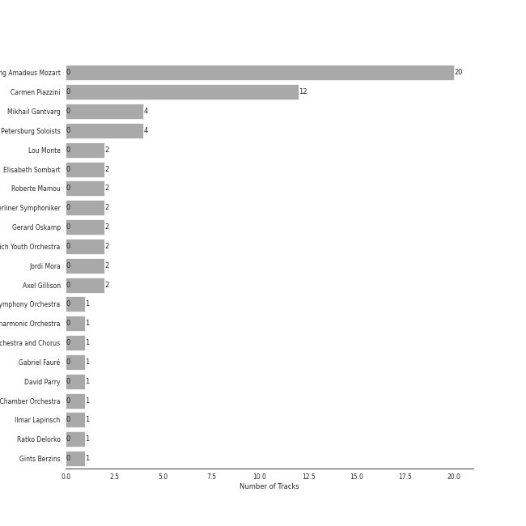
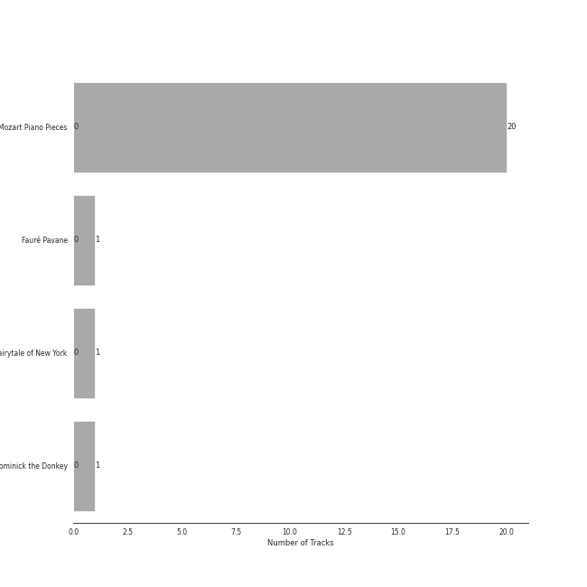
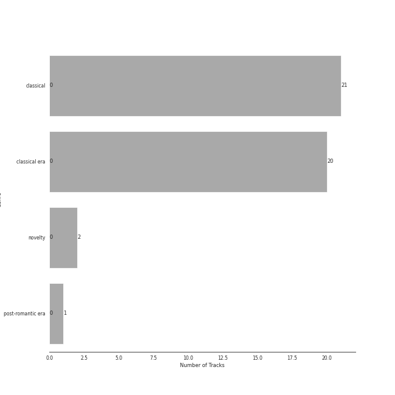

# Warner Music Group - X5 Music Group

23 songs

[See Track Features](audio_features.md)

[See Clusters](clusters/overview.md)

Appears as:
- Warner Music Group - X5 Music Group (23 tracks)

## Top Artists

| Art | Tracks | 💚 | Artist | 🔗 |
|:---|---:|---:|:---|:---|
|  | 20 | 0 | [Wolfgang Amadeus Mozart](../../artists/wolfgang_amadeus_mozart/overview.md) | [🔗](https://open.spotify.com/artist/4NJhFmfw43RLBLjQvxDuRS) |
|  | 12 | 0 | Carmen Piazzini | [🔗](https://open.spotify.com/artist/6aQUOvrKLOquCAvIGdIwTx) |
|  | 4 | 0 | Mikhail Gantvarg | [🔗](https://open.spotify.com/artist/1SCRjxxRnRFsoctLKXIoZx) |
|  | 4 | 0 | The St. Petersburg Soloists | [🔗](https://open.spotify.com/artist/11K9yxwc8iVyEh0ya9v9XY) |
|  | 2 | 0 | Lou Monte | [🔗](https://open.spotify.com/artist/7dbKeVkihtOifdiu7f3rUg) |
|  | 2 | 0 | Elisabeth Sombart | [🔗](https://open.spotify.com/artist/6pp4xqAWH1oHFQX0kJtVvO) |
|  | 2 | 0 | Roberte Mamou | [🔗](https://open.spotify.com/artist/6DsbdauTI2Fn2NN4B1EIUN) |
|  | 2 | 0 | Berliner Symphoniker | [🔗](https://open.spotify.com/artist/5pF76lplGIvEFGb8lI48hA) |
|  | 2 | 0 | Gerard Oskamp | [🔗](https://open.spotify.com/artist/4TWzdKT6XMuddLAoj6PgXi) |
|  | 2 | 0 | Munich Youth Orchestra | [🔗](https://open.spotify.com/artist/3jgBofW8eFrbtrsSbLy8Br) |

See all 21 artists

| Art | Tracks | 💚 | Artist | 🔗 |
|:---|---:|---:|:---|:---|
| | 2 | 0 | Jordi Mora | [🔗](https://open.spotify.com/artist/0bE9Z0z4cxaixqTRU2O5BA) |
|  | 2 | 0 | Axel Gillison | [🔗](https://open.spotify.com/artist/05ukT24TP30K50Blikom8z) |
|  | 1 | 0 | Mostar Symphony Orchestra | [🔗](https://open.spotify.com/artist/70i7O3jytAajMDs0nV0Zbk) |
|  | 1 | 0 | London Philharmonic Orchestra | [🔗](https://open.spotify.com/artist/3PfJE6ebCbCHeuqO4BfNeA) |
|  | 1 | 0 | Joe Reisman's Orchestra and Chorus | [🔗](https://open.spotify.com/artist/2qkfMoOIz3BqLD91C1B09a) |
|  | 1 | 0 | Gabriel Fauré | [🔗](https://open.spotify.com/artist/2gClsBep1tt1rv1CN210SO) |
|  | 1 | 0 | David Parry | [🔗](https://open.spotify.com/artist/2dfDjeZroUd3LWmSFrAZCD) |
| | 1 | 0 | Vestischen Chamber Orchestra | [🔗](https://open.spotify.com/artist/1m3ycS5catGCiLB0J5eKDG) |
|  | 1 | 0 | Ilmar Lapinsch | [🔗](https://open.spotify.com/artist/0dI3iXIxXjAtMkzZCsOVEg) |
|  | 1 | 0 | Ratko Delorko | [🔗](https://open.spotify.com/artist/0E1sM06TDvSpGqNQBx8FV0) |
|  | 1 | 0 | Gints Berzins | [🔗](https://open.spotify.com/artist/0CqCB3JQz4h9k3qk74ihWT) |

## Top Albums

| Art | Tracks | 💚 | Album | Release Date | 🔗 |
|:---|---:|---:|:---|:---|:---|
|  | 20 | 0 | Mozart Piano Pieces | 2020-10-13 | [🔗](https://open.spotify.com/album/3AYEvo7R1gY4O5xJuMwy3U) |
|  | 1 | 0 | Fauré Pavane | 2020-05-30 | [🔗](https://open.spotify.com/album/0FaQ2LW8NNG3YXYJXFikJF) |
|  | 1 | 0 | Fairytale of New York | 2017-11-24 | [🔗](https://open.spotify.com/album/1gknqNegsva4cyjTlrXDps) |
|  | 1 | 0 | Dominick the Donkey | 1960-01-01 | [🔗](https://open.spotify.com/album/45pkOGp28EtHgpp9ZTo1Ss) |

## Genres

| Tracks | 💚 | Genre |
|---:|---:|:---|
| 21 | 0 | [classical](../../genres/classical/overview.md) |
| 20 | 0 | [classical era](../../genres/classical_era/overview.md) |
| 2 | 0 | novelty |
| 1 | 0 | [post-romantic era](../../genres/post-romantic_era/overview.md) |

## Tracks released under Warner Music Group - X5 Music Group

| Art | Track | Album | Artists | Label | Rank | 💚 | 🔗 |
|:---|:---|:---|:---|:---|---:|:---|:---|
|  | Dominick the Donkey (The Italian Christmas Donkey) | Dominick the Donkey | Lou Monte | [Warner Music Group - X5 Music Group](.) | 2599 | | [🔗](https://open.spotify.com/track/7kWD5fzU9Pkux4TQ5V5F3S) |
|  | Dominick the Donkey (The Italian Christmas Donkey) [with Joe Reisman's Orchestra and Chorus] | Fairytale of New York | Lou Monte, Joe Reisman's Orchestra and Chorus | [Warner Music Group - X5 Music Group](.) | 2599 | | [🔗](https://open.spotify.com/track/4EjOn21ToBHzjVnd6rqSyr) |
|  | Fauré Pavane | Fauré Pavane | Gabriel Fauré, David Parry, London Philharmonic Orchestra | [Warner Music Group - X5 Music Group](.) | 2599 | | [🔗](https://open.spotify.com/track/2BzQ1604JsM3oNzaRYhnoG) |
|  | Piano Concerto No. 20 in D Minor, K. 466: I. Allegro | Mozart Piano Pieces | [Wolfgang Amadeus Mozart](../../artists/wolfgang_amadeus_mozart/overview.md), Roberte Mamou, Gerard Oskamp, Berliner Symphoniker | [Warner Music Group - X5 Music Group](.) | 2599 | | [🔗](https://open.spotify.com/track/78Ujl5rH38vlmaWJ2gkXCM) |
|  | Piano Concerto No. 20 in D Minor, K. 466: II. Romance | Mozart Piano Pieces | [Wolfgang Amadeus Mozart](../../artists/wolfgang_amadeus_mozart/overview.md), Roberte Mamou, Gerard Oskamp, Berliner Symphoniker | [Warner Music Group - X5 Music Group](.) | 2599 | | [🔗](https://open.spotify.com/track/2XY6ID1TAueZidFAfkjUCK) |
|  | Piano Concerto No. 21 in C Major, K. 467 "Elvira Madigan": II. Andante | Mozart Piano Pieces | [Wolfgang Amadeus Mozart](../../artists/wolfgang_amadeus_mozart/overview.md), Gints Berzins, Ilmar Lapinsch, Mostar Symphony Orchestra | [Warner Music Group - X5 Music Group](.) | 2599 | | [🔗](https://open.spotify.com/track/2ES32uE3jNNq9egqkqJ0Cy) |
|  | Piano Concerto No. 23 in A Major, K. 488: I. Allegro | Mozart Piano Pieces | [Wolfgang Amadeus Mozart](../../artists/wolfgang_amadeus_mozart/overview.md), Elisabeth Sombart, Jordi Mora, Munich Youth Orchestra | [Warner Music Group - X5 Music Group](.) | 2599 | | [🔗](https://open.spotify.com/track/3UhX1R5oBwxgBMycxFsNku) |
|  | Piano Concerto No. 23 in A Major, K. 488: II. Adagio | Mozart Piano Pieces | [Wolfgang Amadeus Mozart](../../artists/wolfgang_amadeus_mozart/overview.md), Elisabeth Sombart, Jordi Mora, Munich Youth Orchestra | [Warner Music Group - X5 Music Group](.) | 2599 | | [🔗](https://open.spotify.com/track/7dF349cWZHlNnSUBdn1NkS) |
|  | Piano Concerto No. 24 in C Minor, K. 491: I. Allegro | Mozart Piano Pieces | [Wolfgang Amadeus Mozart](../../artists/wolfgang_amadeus_mozart/overview.md), Carmen Piazzini, Mikhail Gantvarg, The St. Petersburg Soloists | [Warner Music Group - X5 Music Group](.) | 2599 | | [🔗](https://open.spotify.com/track/2OA3ADPrHocxY3hOhgO3r6) |
|  | Piano Concerto No. 24 in C Minor, K. 491: II. Larghetto | Mozart Piano Pieces | [Wolfgang Amadeus Mozart](../../artists/wolfgang_amadeus_mozart/overview.md), Carmen Piazzini, Mikhail Gantvarg, The St. Petersburg Soloists | [Warner Music Group - X5 Music Group](.) | 2599 | | [🔗](https://open.spotify.com/track/1So9jHVpEqcbNX6rU9wUDC) |

See all tracks

| Art | Track | Album | Artists | Label | Rank | 💚 | 🔗 |
|:---|:---|:---|:---|:---|---:|:---|:---|
|  | Piano Concerto No. 26 in D Major, K. 537 "Coronation": II. Larghetto | Mozart Piano Pieces | [Wolfgang Amadeus Mozart](../../artists/wolfgang_amadeus_mozart/overview.md), Carmen Piazzini, Mikhail Gantvarg, The St. Petersburg Soloists | [Warner Music Group - X5 Music Group](.) | 2599 | | [🔗](https://open.spotify.com/track/5u6hBSm9NCenBdZK5RvNnc) |
|  | Piano Concerto No. 27 in B-Flat Major, K. 595: II. Larghetto | Mozart Piano Pieces | [Wolfgang Amadeus Mozart](../../artists/wolfgang_amadeus_mozart/overview.md), Carmen Piazzini, Mikhail Gantvarg, The St. Petersburg Soloists | [Warner Music Group - X5 Music Group](.) | 2599 | | [🔗](https://open.spotify.com/track/04Vw5tlqRgimrmWnbuDI2O) |
|  | Piano Concerto No. 5 in D Major, K. 175: II. Andante ma un poco adagio | Mozart Piano Pieces | [Wolfgang Amadeus Mozart](../../artists/wolfgang_amadeus_mozart/overview.md), Ratko Delorko, Vestischen Chamber Orchestra | [Warner Music Group - X5 Music Group](.) | 2599 | | [🔗](https://open.spotify.com/track/4pdYTfl39K3FeRYEUFVVhI) |
|  | Piano Sonata No. 10 in C Major, K. 330: I. Allegro moderato | Mozart Piano Pieces | [Wolfgang Amadeus Mozart](../../artists/wolfgang_amadeus_mozart/overview.md), Carmen Piazzini | [Warner Music Group - X5 Music Group](.) | 2599 | | [🔗](https://open.spotify.com/track/4bYKF903uYHuICjBBJ8ajX) |
|  | Piano Sonata No. 10 in C Major, K. 330: II. Andante cantabile | Mozart Piano Pieces | [Wolfgang Amadeus Mozart](../../artists/wolfgang_amadeus_mozart/overview.md), Carmen Piazzini | [Warner Music Group - X5 Music Group](.) | 2599 | | [🔗](https://open.spotify.com/track/5U6VsJNR6jH9sBdKHPN3Yg) |
|  | Piano Sonata No. 11 in A Major, K. 331 "Turkish March": III. Alla turca | Mozart Piano Pieces | [Wolfgang Amadeus Mozart](../../artists/wolfgang_amadeus_mozart/overview.md), Carmen Piazzini | [Warner Music Group - X5 Music Group](.) | 2599 | | [🔗](https://open.spotify.com/track/2OEYKSfs1UGUcyXahqdw7P) |
|  | Piano Sonata No. 12 in F Major, K. 332: II. Adagio | Mozart Piano Pieces | [Wolfgang Amadeus Mozart](../../artists/wolfgang_amadeus_mozart/overview.md), Axel Gillison | [Warner Music Group - X5 Music Group](.) | 2599 | | [🔗](https://open.spotify.com/track/004a5pvn9FmiF9jTujKiJp) |
|  | Piano Sonata No. 14 in C Minor, K. 457: I. Molto allegro | Mozart Piano Pieces | [Wolfgang Amadeus Mozart](../../artists/wolfgang_amadeus_mozart/overview.md), Carmen Piazzini | [Warner Music Group - X5 Music Group](.) | 2599 | | [🔗](https://open.spotify.com/track/1aDx9apuE3Jai42FyPvl4P) |
|  | Piano Sonata No. 16 in C Major, K. 545 "Sonata facile": I. Allegro | Mozart Piano Pieces | [Wolfgang Amadeus Mozart](../../artists/wolfgang_amadeus_mozart/overview.md), Carmen Piazzini | [Warner Music Group - X5 Music Group](.) | 2599 | | [🔗](https://open.spotify.com/track/6VAXPtvpk3jekxuRCTntMx) |
|  | Piano Sonata No. 16 in C Major, K. 545 "Sonata facile": II. Andante | Mozart Piano Pieces | [Wolfgang Amadeus Mozart](../../artists/wolfgang_amadeus_mozart/overview.md), Carmen Piazzini | [Warner Music Group - X5 Music Group](.) | 2599 | | [🔗](https://open.spotify.com/track/6q7iZv8b4xt4tppt53d18d) |
|  | Piano Sonata No. 16 in C Major, K. 545 "Sonata facile": III. Rondo | Mozart Piano Pieces | [Wolfgang Amadeus Mozart](../../artists/wolfgang_amadeus_mozart/overview.md), Carmen Piazzini | [Warner Music Group - X5 Music Group](.) | 2599 | | [🔗](https://open.spotify.com/track/1JLOh8aetP2T5OUPZnu4Jb) |
|  | Piano Sonata No. 18 in D Major, K. 576: I. Allegro | Mozart Piano Pieces | [Wolfgang Amadeus Mozart](../../artists/wolfgang_amadeus_mozart/overview.md), Carmen Piazzini | [Warner Music Group - X5 Music Group](.) | 2599 | | [🔗](https://open.spotify.com/track/7bv1oLv8wGSVp96UkZsPgJ) |
|  | Piano Sonata No. 9 in D Major, K. 311: II. Andante con expressione | Mozart Piano Pieces | [Wolfgang Amadeus Mozart](../../artists/wolfgang_amadeus_mozart/overview.md), Axel Gillison | [Warner Music Group - X5 Music Group](.) | 2599 | | [🔗](https://open.spotify.com/track/5OxM1YJI1qAzxpBPjTRiCn) |

