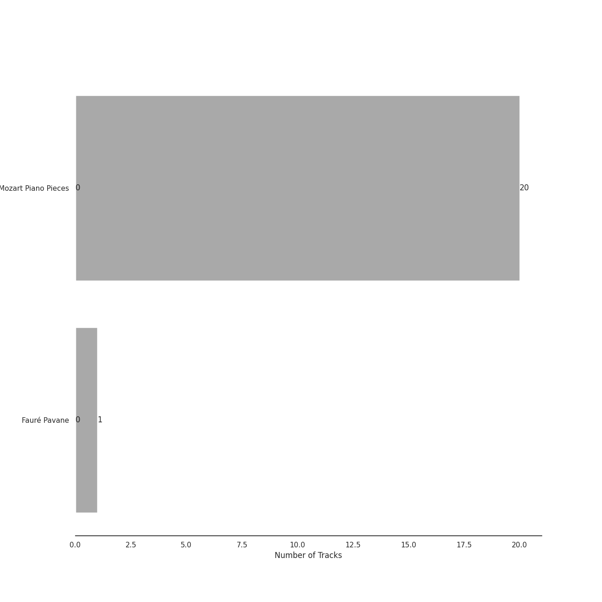

# Warner Music Group - X5 Music Group

63 songs

Appears as:
- Warner Music Group - X5 Music Group (63 tracks)

## Top Artists

See all 32 artists

|   Number of Tracks | Art                                                                                              | Artist                                                                           | 🔗                                                           |
|-------------------:|:-------------------------------------------------------------------------------------------------|:---------------------------------------------------------------------------------|:------------------------------------------------------------|
|                 42 |  | [James Levine](../artists/james_levine.md)                                       | [🔗](https://open.spotify.com/artist/4qFQgEF1rg6a9WvJM0MQIa) |
|                 42 |  | [National Philharmonic Orchestra](../artists/national_philharmonic_orchestra.md) | [🔗](https://open.spotify.com/artist/2Ek1WGW7WeyDoxsZiu0AAd) |
|                 42 |  | [Giacomo Puccini](../artists/giacomo_puccini.md)                                 | [🔗](https://open.spotify.com/artist/0OzxPXyowUEQ532c9AmHUR) |
|                 37 |  | [Alfredo Kraus](../artists/alfredo_kraus.md)                                     | [🔗](https://open.spotify.com/artist/72G0MODfMxM5TGaoQtGbdP) |
|                 32 |  | [Sherrill Milnes](../artists/sherrill_milnes.md)                                 | [🔗](https://open.spotify.com/artist/4zTQCQMH3wRdBorYb0xGCa) |
|                 23 |  | [Renata Scotto](../artists/renata_scotto.md)                                     | [🔗](https://open.spotify.com/artist/5W7pOtn53qBRrQo00IvHTj) |
|                 21 |  | [Matteo Manuguerra](../artists/matteo_manuguerra.md)                             | [🔗](https://open.spotify.com/artist/0lh6dQTetUL7cGQTn6Xa0Q) |
|                 20 |  | [Paul Plishka](../artists/paul_plishka.md)                                       | [🔗](https://open.spotify.com/artist/6jYWpBt9bOCoredrRjnD14) |
|                 20 |  | [Wolfgang Amadeus Mozart](../artists/wolfgang_amadeus_mozart.md)                 | [🔗](https://open.spotify.com/artist/4NJhFmfw43RLBLjQvxDuRS) |
|                 12 |  | [Carmen Piazzini](../artists/carmen_piazzini.md)                                 | [🔗](https://open.spotify.com/artist/6aQUOvrKLOquCAvIGdIwTx) |
|                 11 |  | [Carol Neblett](../artists/carol_neblett.md)                                     | [🔗](https://open.spotify.com/artist/05NUdXE48hL64rngUr5bqM) |
|                  7 |  | Ambrosian Opera Chorus                                                           | [🔗](https://open.spotify.com/artist/5qBpXwutwmD9MBTNXkT4JZ) |
|                  4 |  | Trinity Boys Choir                                                               | [🔗](https://open.spotify.com/artist/23EzhBs30RXxidoFWTytAR) |
|                  4 |  | Mikhail Gantvarg                                                                 | [🔗](https://open.spotify.com/artist/1SCRjxxRnRFsoctLKXIoZx) |
|                  4 |  | The St. Petersburg Soloists                                                      | [🔗](https://open.spotify.com/artist/11K9yxwc8iVyEh0ya9v9XY) |
|                  3 |  | Renato Capecchi                                                                  | [🔗](https://open.spotify.com/artist/16LkUonMXYtr6O6b1Cru9d) |
|                  2 |  | Elisabeth Sombart                                                                | [🔗](https://open.spotify.com/artist/6pp4xqAWH1oHFQX0kJtVvO) |
|                  2 |  | Roberte Mamou                                                                    | [🔗](https://open.spotify.com/artist/6DsbdauTI2Fn2NN4B1EIUN) |
|                  2 |  | Berliner Symphoniker                                                             | [🔗](https://open.spotify.com/artist/5pF76lplGIvEFGb8lI48hA) |
|                  2 |  | Gerard Oskamp                                                                    | [🔗](https://open.spotify.com/artist/4TWzdKT6XMuddLAoj6PgXi) |
|                  2 |  | Munich Youth Orchestra                                                           | [🔗](https://open.spotify.com/artist/3jgBofW8eFrbtrsSbLy8Br) |
|                  2 |                                                               | Jordi Mora                                                                       | [🔗](https://open.spotify.com/artist/0bE9Z0z4cxaixqTRU2O5BA) |
|                  2 |  | Axel Gillison                                                                    | [🔗](https://open.spotify.com/artist/05ukT24TP30K50Blikom8z) |
|                  1 |  | Italo Tajo                                                                       | [🔗](https://open.spotify.com/artist/7vqx8IiSqPIFjFBzstDQmn) |
|                  1 |  | Mostar Symphony Orchestra                                                        | [🔗](https://open.spotify.com/artist/70i7O3jytAajMDs0nV0Zbk) |
|                  1 |  | [London Philharmonic Orchestra](../artists/london_philharmonic_orchestra.md)     | [🔗](https://open.spotify.com/artist/3PfJE6ebCbCHeuqO4BfNeA) |
|                  1 |  | Gabriel Fauré                                                                    | [🔗](https://open.spotify.com/artist/2gClsBep1tt1rv1CN210SO) |
|                  1 |  | David Parry                                                                      | [🔗](https://open.spotify.com/artist/2dfDjeZroUd3LWmSFrAZCD) |
|                  1 |                                                               | Vestischen Chamber Orchestra                                                     | [🔗](https://open.spotify.com/artist/1m3ycS5catGCiLB0J5eKDG) |
|                  1 |  | Ilmar Lapinsch                                                                   | [🔗](https://open.spotify.com/artist/0dI3iXIxXjAtMkzZCsOVEg) |
|                  1 |  | Ratko Delorko                                                                    | [🔗](https://open.spotify.com/artist/0E1sM06TDvSpGqNQBx8FV0) |
|                  1 |  | Gints Berzins                                                                    | [🔗](https://open.spotify.com/artist/0CqCB3JQz4h9k3qk74ihWT) |

## Top Albums

See all 3 albums

|   Number of Tracks | Art                                                                                              | Album               | 🔗                                                          |
|-------------------:|:-------------------------------------------------------------------------------------------------|:--------------------|:-----------------------------------------------------------|
|                 42 |  | La Bohème           | [🔗](https://open.spotify.com/album/4FqWqqnsUS8gKpLEYnuICl) |
|                 20 |  | Mozart Piano Pieces | [🔗](https://open.spotify.com/album/3AYEvo7R1gY4O5xJuMwy3U) |
|                  1 |  | Fauré Pavane        | [🔗](https://open.spotify.com/album/0FaQ2LW8NNG3YXYJXFikJF) |

## Tracks released under Warner Music Group - X5 Music Group

| Art                                                                                              | Track                                                                                                                                             | Album               | Artists                                                                                                                                                                                                                                                                                                                                                                                                                                                                                                                  | Label                                                                         | 💚   | 🔗                                                          |
|:-------------------------------------------------------------------------------------------------|:--------------------------------------------------------------------------------------------------------------------------------------------------|:--------------------|:-------------------------------------------------------------------------------------------------------------------------------------------------------------------------------------------------------------------------------------------------------------------------------------------------------------------------------------------------------------------------------------------------------------------------------------------------------------------------------------------------------------------------|:------------------------------------------------------------------------------|:----|:-----------------------------------------------------------|
|  | Fauré Pavane                                                                                                                                      | Fauré Pavane        | Gabriel Fauré, David Parry, [London Philharmonic Orchestra](../artists/london_philharmonic_orchestra.md)                                                                                                                                                                                                                                                                                                                                                                                                                 | [Warner Music Group - X5 Music Group](warner_music_group___x5_music_group.md) |     | [🔗](https://open.spotify.com/track/2BzQ1604JsM3oNzaRYhnoG) |
|  | La Bohème, Act I: Ah! Ah! Ah! Ho pagato il trimestre (Marcello, Schaunard, Colline, Rodolfo)                                                      | La Bohème           | [Giacomo Puccini](../artists/giacomo_puccini.md), [Alfredo Kraus](../artists/alfredo_kraus.md), [James Levine](../artists/james_levine.md), [Matteo Manuguerra](../artists/matteo_manuguerra.md), [National Philharmonic Orchestra](../artists/national_philharmonic_orchestra.md), [Paul Plishka](../artists/paul_plishka.md), [Sherrill Milnes](../artists/sherrill_milnes.md)                                                                                                                                         | [Warner Music Group - X5 Music Group](warner_music_group___x5_music_group.md) |     | [🔗](https://open.spotify.com/track/0cjuxxHrxS5aB1arkGgBaO) |
|  | La Bohème, Act I: Che gelida manina (Rodolfo)                                                                                                     | La Bohème           | [Giacomo Puccini](../artists/giacomo_puccini.md), [Alfredo Kraus](../artists/alfredo_kraus.md), [James Levine](../artists/james_levine.md), [National Philharmonic Orchestra](../artists/national_philharmonic_orchestra.md)                                                                                                                                                                                                                                                                                             | [Warner Music Group - X5 Music Group](warner_music_group___x5_music_group.md) |     | [🔗](https://open.spotify.com/track/2Wi4qTz0ewIE9PKVzBC8Pj) |
|  | La Bohème, Act I: Ehi! Rodolfo! (Schaunard, Colline, Marcello, Rodolfo)                                                                           | La Bohème           | [Giacomo Puccini](../artists/giacomo_puccini.md), [Alfredo Kraus](../artists/alfredo_kraus.md), [James Levine](../artists/james_levine.md), [Matteo Manuguerra](../artists/matteo_manuguerra.md), [National Philharmonic Orchestra](../artists/national_philharmonic_orchestra.md), [Paul Plishka](../artists/paul_plishka.md), [Sherrill Milnes](../artists/sherrill_milnes.md)                                                                                                                                         | [Warner Music Group - X5 Music Group](warner_music_group___x5_music_group.md) |     | [🔗](https://open.spotify.com/track/6CbwvT6paT2Latbc28FDZB) |
|  | La Bohème, Act I: Ho ghiacciate le dita (Marcello, Rodolfo, Colline)                                                                              | La Bohème           | [Giacomo Puccini](../artists/giacomo_puccini.md), [Alfredo Kraus](../artists/alfredo_kraus.md), [James Levine](../artists/james_levine.md), [National Philharmonic Orchestra](../artists/national_philharmonic_orchestra.md), [Paul Plishka](../artists/paul_plishka.md), [Sherrill Milnes](../artists/sherrill_milnes.md)                                                                                                                                                                                               | [Warner Music Group - X5 Music Group](warner_music_group___x5_music_group.md) |     | [🔗](https://open.spotify.com/track/0p2VEWGZ7ytqq9xFRYRHYb) |
|  | La Bohème, Act I: Io resto per terminar l'articolo (Rodolfo, Marcello, Colline, Schaunard)                                                        | La Bohème           | [Giacomo Puccini](../artists/giacomo_puccini.md), [Alfredo Kraus](../artists/alfredo_kraus.md), [James Levine](../artists/james_levine.md), [Matteo Manuguerra](../artists/matteo_manuguerra.md), [National Philharmonic Orchestra](../artists/national_philharmonic_orchestra.md), [Paul Plishka](../artists/paul_plishka.md), [Sherrill Milnes](../artists/sherrill_milnes.md)                                                                                                                                         | [Warner Music Group - X5 Music Group](warner_music_group___x5_music_group.md) |     | [🔗](https://open.spotify.com/track/1OYNrBg2E9WnquOzT2oOcj) |
|  | La Bohème, Act I: Legna! Sigari! Bordo! (Rodolfo, Marcello, Colline, Schaunard)                                                                   | La Bohème           | [Giacomo Puccini](../artists/giacomo_puccini.md), [Alfredo Kraus](../artists/alfredo_kraus.md), [James Levine](../artists/james_levine.md), [Matteo Manuguerra](../artists/matteo_manuguerra.md), [National Philharmonic Orchestra](../artists/national_philharmonic_orchestra.md), [Paul Plishka](../artists/paul_plishka.md), [Sherrill Milnes](../artists/sherrill_milnes.md)                                                                                                                                         | [Warner Music Group - X5 Music Group](warner_music_group___x5_music_group.md) |     | [🔗](https://open.spotify.com/track/79QUi5ZS5FCdBAfT0KDZUh) |
|  | La Bohème, Act I: Non sono in vena. Chi è là! (Rodolfo, Mimi)                                                                                     | La Bohème           | [Giacomo Puccini](../artists/giacomo_puccini.md), [Alfredo Kraus](../artists/alfredo_kraus.md), [James Levine](../artists/james_levine.md), [National Philharmonic Orchestra](../artists/national_philharmonic_orchestra.md), [Renata Scotto](../artists/renata_scotto.md)                                                                                                                                                                                                                                               | [Warner Music Group - X5 Music Group](warner_music_group___x5_music_group.md) |     | [🔗](https://open.spotify.com/track/5AzL0P4MfJpHMfeCNDQky0) |
|  | La Bohème, Act I: O soave fanciulla (Rodolfo, Marcello, Mimì)                                                                                     | La Bohème           | [Giacomo Puccini](../artists/giacomo_puccini.md), [Alfredo Kraus](../artists/alfredo_kraus.md), [James Levine](../artists/james_levine.md), [National Philharmonic Orchestra](../artists/national_philharmonic_orchestra.md), [Renata Scotto](../artists/renata_scotto.md), [Sherrill Milnes](../artists/sherrill_milnes.md)                                                                                                                                                                                             | [Warner Music Group - X5 Music Group](warner_music_group___x5_music_group.md) |     | [🔗](https://open.spotify.com/track/1eSuYeP1o2Gtf0rgWQedKP) |
|  | La Bohème, Act I: Oh, sventata, sventata! (Mimì, Rodolfo)                                                                                         | La Bohème           | [Giacomo Puccini](../artists/giacomo_puccini.md), [Alfredo Kraus](../artists/alfredo_kraus.md), [James Levine](../artists/james_levine.md), [National Philharmonic Orchestra](../artists/national_philharmonic_orchestra.md), [Renata Scotto](../artists/renata_scotto.md)                                                                                                                                                                                                                                               | [Warner Music Group - X5 Music Group](warner_music_group___x5_music_group.md) |     | [🔗](https://open.spotify.com/track/3qdpStl2AaLkuTB5eis9yw) |
|  | La Bohème, Act I: Or vi dirò: quest'oro (Schaunard, Rodolfo, Colline, Marcello)                                                                   | La Bohème           | [Giacomo Puccini](../artists/giacomo_puccini.md), [Alfredo Kraus](../artists/alfredo_kraus.md), [James Levine](../artists/james_levine.md), [Matteo Manuguerra](../artists/matteo_manuguerra.md), [National Philharmonic Orchestra](../artists/national_philharmonic_orchestra.md), [Paul Plishka](../artists/paul_plishka.md), [Sherrill Milnes](../artists/sherrill_milnes.md)                                                                                                                                         | [Warner Music Group - X5 Music Group](warner_music_group___x5_music_group.md) |     | [🔗](https://open.spotify.com/track/4EZRMyE2gBBRcwzpxB6Ndr) |
|  | La Bohème, Act I: Questo Mar Rosso mi ammollisce (Marcello, Rodolfo)                                                                              | La Bohème           | [Giacomo Puccini](../artists/giacomo_puccini.md), [Alfredo Kraus](../artists/alfredo_kraus.md), [James Levine](../artists/james_levine.md), [National Philharmonic Orchestra](../artists/national_philharmonic_orchestra.md), [Sherrill Milnes](../artists/sherrill_milnes.md)                                                                                                                                                                                                                                           | [Warner Music Group - X5 Music Group](warner_music_group___x5_music_group.md) |     | [🔗](https://open.spotify.com/track/3uYGL1Mq92uBHt6pDoL3RH) |
|  | La Bohème, Act I: Si poù? Chi è là? (Benoît, Marcello, Schaunard, Colline, Rodolfo)                                                               | La Bohème           | [Giacomo Puccini](../artists/giacomo_puccini.md), [Alfredo Kraus](../artists/alfredo_kraus.md), Italo Tajo, [James Levine](../artists/james_levine.md), [Matteo Manuguerra](../artists/matteo_manuguerra.md), [National Philharmonic Orchestra](../artists/national_philharmonic_orchestra.md), [Paul Plishka](../artists/paul_plishka.md), [Sherrill Milnes](../artists/sherrill_milnes.md)                                                                                                                             | [Warner Music Group - X5 Music Group](warner_music_group___x5_music_group.md) |     | [🔗](https://open.spotify.com/track/5qqZtXXC021MvAGIVMFOIG) |
|  | La Bohème, Act I: Sì. Mi chiamano Mimì (Mimì, Rodolfo)                                                                                            | La Bohème           | [Giacomo Puccini](../artists/giacomo_puccini.md), [Alfredo Kraus](../artists/alfredo_kraus.md), [James Levine](../artists/james_levine.md), [National Philharmonic Orchestra](../artists/national_philharmonic_orchestra.md), [Renata Scotto](../artists/renata_scotto.md)                                                                                                                                                                                                                                               | [Warner Music Group - X5 Music Group](warner_music_group___x5_music_group.md) |     | [🔗](https://open.spotify.com/track/19GcQJHwN0Oen1Yu0awv5e) |
|  | La Bohème, Act II: Aranci, datteri! (Hawkers, Townspeople, Schaunard, Colline, Rodolfo, Mimì, Marcello)                                           | La Bohème           | [Giacomo Puccini](../artists/giacomo_puccini.md), [Alfredo Kraus](../artists/alfredo_kraus.md), Ambrosian Opera Chorus, [James Levine](../artists/james_levine.md), [Matteo Manuguerra](../artists/matteo_manuguerra.md), [National Philharmonic Orchestra](../artists/national_philharmonic_orchestra.md), [Paul Plishka](../artists/paul_plishka.md), [Renata Scotto](../artists/renata_scotto.md), [Sherrill Milnes](../artists/sherrill_milnes.md)                                                                   | [Warner Music Group - X5 Music Group](warner_music_group___x5_music_group.md) |     | [🔗](https://open.spotify.com/track/17MfUBDYisxb0ne8F6LGyZ) |
|  | La Bohème, Act II: Caro! (Colline, Rodolfo, Schaunard, Children, Townspeople, Musetta)                                                            | La Bohème           | [Giacomo Puccini](../artists/giacomo_puccini.md), [Alfredo Kraus](../artists/alfredo_kraus.md), Ambrosian Opera Chorus, [Carol Neblett](../artists/carol_neblett.md), [James Levine](../artists/james_levine.md), [Matteo Manuguerra](../artists/matteo_manuguerra.md), [National Philharmonic Orchestra](../artists/national_philharmonic_orchestra.md), [Paul Plishka](../artists/paul_plishka.md), Trinity Boys Choir                                                                                                 | [Warner Music Group - X5 Music Group](warner_music_group___x5_music_group.md) |     | [🔗](https://open.spotify.com/track/2Lv0KVUf919O66BnJ4FADA) |
|  | La Bohème, Act II: Chi guardi? (Rodolfo, Colline, Mimì, Schaunard, Marcello, Students, Parpignol)                                                 | La Bohème           | [Giacomo Puccini](../artists/giacomo_puccini.md), [Alfredo Kraus](../artists/alfredo_kraus.md), Ambrosian Opera Chorus, [James Levine](../artists/james_levine.md), [Matteo Manuguerra](../artists/matteo_manuguerra.md), [National Philharmonic Orchestra](../artists/national_philharmonic_orchestra.md), [Paul Plishka](../artists/paul_plishka.md), [Renata Scotto](../artists/renata_scotto.md), [Sherrill Milnes](../artists/sherrill_milnes.md)                                                                   | [Warner Music Group - X5 Music Group](warner_music_group___x5_music_group.md) |     | [🔗](https://open.spotify.com/track/3vsBdFeXh8VTk8LqILDlbp) |
|  | La Bohème, Act II: Oh! Musetta! (Schaunard, Colline, Rodolfo, Marcello, Shopwomen, Alcindoro, Musetta)                                            | La Bohème           | [Giacomo Puccini](../artists/giacomo_puccini.md), [Alfredo Kraus](../artists/alfredo_kraus.md), Ambrosian Opera Chorus, [Carol Neblett](../artists/carol_neblett.md), [James Levine](../artists/james_levine.md), [Matteo Manuguerra](../artists/matteo_manuguerra.md), [National Philharmonic Orchestra](../artists/national_philharmonic_orchestra.md), [Paul Plishka](../artists/paul_plishka.md), Renato Capecchi, [Sherrill Milnes](../artists/sherrill_milnes.md)                                                  | [Warner Music Group - X5 Music Group](warner_music_group___x5_music_group.md) |     | [🔗](https://open.spotify.com/track/0HIv2mLCBv7T2eVaC6sYXB) |
|  | La Bohème, Act II: Presto, sommate quello (Musetta, Mothers, Children, Rodolfo, Marcello, Schaunard, Colline, Mimì, Townspeople)                  | La Bohème           | [Giacomo Puccini](../artists/giacomo_puccini.md), [Alfredo Kraus](../artists/alfredo_kraus.md), Ambrosian Opera Chorus, [Carol Neblett](../artists/carol_neblett.md), [James Levine](../artists/james_levine.md), [Matteo Manuguerra](../artists/matteo_manuguerra.md), [National Philharmonic Orchestra](../artists/national_philharmonic_orchestra.md), [Paul Plishka](../artists/paul_plishka.md), [Renata Scotto](../artists/renata_scotto.md), [Sherrill Milnes](../artists/sherrill_milnes.md), Trinity Boys Choir | [Warner Music Group - X5 Music Group](warner_music_group___x5_music_group.md) |     | [🔗](https://open.spotify.com/track/1vpZy1lEMPelFLI0VudAmJ) |
|  | La Bohème, Act II: Quando men vo                                                                                                                  | La Bohème           | [Giacomo Puccini](../artists/giacomo_puccini.md), [Alfredo Kraus](../artists/alfredo_kraus.md), [Carol Neblett](../artists/carol_neblett.md), [James Levine](../artists/james_levine.md), [Matteo Manuguerra](../artists/matteo_manuguerra.md), [Paul Plishka](../artists/paul_plishka.md), [Renata Scotto](../artists/renata_scotto.md), Renato Capecchi, [Sherrill Milnes](../artists/sherrill_milnes.md), [National Philharmonic Orchestra](../artists/national_philharmonic_orchestra.md)                            | [Warner Music Group - X5 Music Group](warner_music_group___x5_music_group.md) |     | [🔗](https://open.spotify.com/track/0zL47m9gJL0uKAstwiaG7o) |
|  | La Bohème, Act II: Questa è Mimì (Rodolfo, Marcello, Colline, Schaunard, Parpignol, Children, Mothers, Mimì)                                      | La Bohème           | [Giacomo Puccini](../artists/giacomo_puccini.md), [Alfredo Kraus](../artists/alfredo_kraus.md), Ambrosian Opera Chorus, [James Levine](../artists/james_levine.md), [Matteo Manuguerra](../artists/matteo_manuguerra.md), [National Philharmonic Orchestra](../artists/national_philharmonic_orchestra.md), [Paul Plishka](../artists/paul_plishka.md), [Renata Scotto](../artists/renata_scotto.md), [Sherrill Milnes](../artists/sherrill_milnes.md), Trinity Boys Choir                                               | [Warner Music Group - X5 Music Group](warner_music_group___x5_music_group.md) |     | [🔗](https://open.spotify.com/track/0yVs1UbsSy4or1lpNcTc2H) |
|  | La Bohème, Act II: Tu non mi guardi (Musetta, Alcindoro, Schaunard, Colline, Rodolfo, Mimì)                                                       | La Bohème           | [Giacomo Puccini](../artists/giacomo_puccini.md), [Alfredo Kraus](../artists/alfredo_kraus.md), [Carol Neblett](../artists/carol_neblett.md), [James Levine](../artists/james_levine.md), [Matteo Manuguerra](../artists/matteo_manuguerra.md), [National Philharmonic Orchestra](../artists/national_philharmonic_orchestra.md), [Paul Plishka](../artists/paul_plishka.md), [Renata Scotto](../artists/renata_scotto.md), Renato Capecchi                                                                              | [Warner Music Group - X5 Music Group](warner_music_group___x5_music_group.md) |     | [🔗](https://open.spotify.com/track/0eFkn2oBhdNa4xLbs5BFOc) |
|  | La Bohème, Act II: Viva Parpignol! (Children, Marcello, Mimì, Schaunard, Colline, Rodolfo)                                                        | La Bohème           | [Giacomo Puccini](../artists/giacomo_puccini.md), [Alfredo Kraus](../artists/alfredo_kraus.md), [James Levine](../artists/james_levine.md), [Matteo Manuguerra](../artists/matteo_manuguerra.md), [National Philharmonic Orchestra](../artists/national_philharmonic_orchestra.md), [Paul Plishka](../artists/paul_plishka.md), [Renata Scotto](../artists/renata_scotto.md), [Sherrill Milnes](../artists/sherrill_milnes.md), Trinity Boys Choir                                                                       | [Warner Music Group - X5 Music Group](warner_music_group___x5_music_group.md) |     | [🔗](https://open.spotify.com/track/6PwFDhSwqubs4X0leCfOFF) |
|  | La Bohème, Act III: Act III: Mimì?!...Speravo di trovarvi qui (Marcello, Mimì)                                                                    | La Bohème           | [Giacomo Puccini](../artists/giacomo_puccini.md), [James Levine](../artists/james_levine.md), [National Philharmonic Orchestra](../artists/national_philharmonic_orchestra.md), [Renata Scotto](../artists/renata_scotto.md), [Sherrill Milnes](../artists/sherrill_milnes.md)                                                                                                                                                                                                                                           | [Warner Music Group - X5 Music Group](warner_music_group___x5_music_group.md) |     | [🔗](https://open.spotify.com/track/3tJlLgUddyune4ua9z4oS4) |
|  | La Bohème, Act III: Addio, dolce svegliare (Mimì, Rodolfo, Marcello, Musetta)                                                                     | La Bohème           | [Giacomo Puccini](../artists/giacomo_puccini.md), [Alfredo Kraus](../artists/alfredo_kraus.md), [Carol Neblett](../artists/carol_neblett.md), [James Levine](../artists/james_levine.md), [National Philharmonic Orchestra](../artists/national_philharmonic_orchestra.md), [Renata Scotto](../artists/renata_scotto.md), [Sherrill Milnes](../artists/sherrill_milnes.md)                                                                                                                                               | [Warner Music Group - X5 Music Group](warner_music_group___x5_music_group.md) |     | [🔗](https://open.spotify.com/track/1jyARnUHLWrbhuqd5a6eqS) |
|  | La Bohème, Act III: Addio. Che! Vai? (Mimì, Rodolfo)                                                                                              | La Bohème           | [Giacomo Puccini](../artists/giacomo_puccini.md), [Alfredo Kraus](../artists/alfredo_kraus.md), [James Levine](../artists/james_levine.md), [National Philharmonic Orchestra](../artists/national_philharmonic_orchestra.md), [Renata Scotto](../artists/renata_scotto.md)                                                                                                                                                                                                                                               | [Warner Music Group - X5 Music Group](warner_music_group___x5_music_group.md) |     | [🔗](https://open.spotify.com/track/1z0uXfhmAUqxfXM95Huo96) |
|  | La Bohème, Act III: Che! Mimì! Tu qui? (Rodolfo, Marcello, Mimì)                                                                                  | La Bohème           | [Giacomo Puccini](../artists/giacomo_puccini.md), [Alfredo Kraus](../artists/alfredo_kraus.md), [James Levine](../artists/james_levine.md), [National Philharmonic Orchestra](../artists/national_philharmonic_orchestra.md), [Renata Scotto](../artists/renata_scotto.md), [Sherrill Milnes](../artists/sherrill_milnes.md)                                                                                                                                                                                             | [Warner Music Group - X5 Music Group](warner_music_group___x5_music_group.md) |     | [🔗](https://open.spotify.com/track/2VETcfxzfQZUtdpqXHzKme) |
|  | La Bohème, Act III: Marcello. Finalmente (Rodolfo, Marcello, Mimì)                                                                                | La Bohème           | [Giacomo Puccini](../artists/giacomo_puccini.md), [Alfredo Kraus](../artists/alfredo_kraus.md), [James Levine](../artists/james_levine.md), [National Philharmonic Orchestra](../artists/national_philharmonic_orchestra.md), [Renata Scotto](../artists/renata_scotto.md), [Sherrill Milnes](../artists/sherrill_milnes.md)                                                                                                                                                                                             | [Warner Music Group - X5 Music Group](warner_music_group___x5_music_group.md) |     | [🔗](https://open.spotify.com/track/7FBfE7YWGlo90VchoL9xjL) |
|  | La Bohème, Act III: Mimi è una civetta (Rodolfo, Marcello)                                                                                        | La Bohème           | [Giacomo Puccini](../artists/giacomo_puccini.md), [Alfredo Kraus](../artists/alfredo_kraus.md), [James Levine](../artists/james_levine.md), [National Philharmonic Orchestra](../artists/national_philharmonic_orchestra.md), [Sherrill Milnes](../artists/sherrill_milnes.md)                                                                                                                                                                                                                                           | [Warner Music Group - X5 Music Group](warner_music_group___x5_music_group.md) |     | [🔗](https://open.spotify.com/track/4K717xmjl2JUal7BWRQ2ut) |
|  | La Bohème, Act III: Mimì è tanto malata! (Rodolfo, Marcello, Mimì)                                                                                | La Bohème           | [Giacomo Puccini](../artists/giacomo_puccini.md), [Alfredo Kraus](../artists/alfredo_kraus.md), [James Levine](../artists/james_levine.md), [National Philharmonic Orchestra](../artists/national_philharmonic_orchestra.md), [Renata Scotto](../artists/renata_scotto.md), [Sherrill Milnes](../artists/sherrill_milnes.md)                                                                                                                                                                                             | [Warner Music Group - X5 Music Group](warner_music_group___x5_music_group.md) |     | [🔗](https://open.spotify.com/track/5ADVe2kodv0w0ZonEV3ucR) |
|  | La Bohème, Act III: O buon Marcello, aiuto! (Mimì, Marcello)                                                                                      | La Bohème           | [Giacomo Puccini](../artists/giacomo_puccini.md), [James Levine](../artists/james_levine.md), [National Philharmonic Orchestra](../artists/national_philharmonic_orchestra.md), [Renata Scotto](../artists/renata_scotto.md), [Sherrill Milnes](../artists/sherrill_milnes.md)                                                                                                                                                                                                                                           | [Warner Music Group - X5 Music Group](warner_music_group___x5_music_group.md) |     | [🔗](https://open.spotify.com/track/3fLYwN0HqKYJYa16lONnhL) |
|  | La Bohème, Act III: Ohé, là, le guardie! (Sweepers, Customs Officer, Voices from the tavern, Voice of Musetta, Milkmaids, Peasant Women, Carters) | La Bohème           | [Giacomo Puccini](../artists/giacomo_puccini.md), Ambrosian Opera Chorus, [Carol Neblett](../artists/carol_neblett.md), [James Levine](../artists/james_levine.md), [National Philharmonic Orchestra](../artists/national_philharmonic_orchestra.md)                                                                                                                                                                                                                                                                     | [Warner Music Group - X5 Music Group](warner_music_group___x5_music_group.md) |     | [🔗](https://open.spotify.com/track/6y7lChXFyfnPuulriixC5M) |
|  | La Bohème, Act III: Pittore da bottega! Vipera! Rospo! (Musetta, Marcello, Mimì, Rodolfo)                                                         | La Bohème           | [Giacomo Puccini](../artists/giacomo_puccini.md), [Alfredo Kraus](../artists/alfredo_kraus.md), [Carol Neblett](../artists/carol_neblett.md), [James Levine](../artists/james_levine.md), [National Philharmonic Orchestra](../artists/national_philharmonic_orchestra.md), [Renata Scotto](../artists/renata_scotto.md), [Sherrill Milnes](../artists/sherrill_milnes.md)                                                                                                                                               | [Warner Music Group - X5 Music Group](warner_music_group___x5_music_group.md) |     | [🔗](https://open.spotify.com/track/7JnJfQuGmFsMKERauRBN6U) |
|  | La Bohème, Act III: Sa dirmi, scusi (Mimì, Sergeant, Customs Officer)                                                                             | La Bohème           | [Giacomo Puccini](../artists/giacomo_puccini.md), [James Levine](../artists/james_levine.md), [National Philharmonic Orchestra](../artists/national_philharmonic_orchestra.md), [Renata Scotto](../artists/renata_scotto.md)                                                                                                                                                                                                                                                                                             | [Warner Music Group - X5 Music Group](warner_music_group___x5_music_group.md) |     | [🔗](https://open.spotify.com/track/1NxMsy4tBLsXRCh9JWFQtV) |
|  | La Bohème, Act IV: C'è Mimì che mi segue (Musetta, Rodolfo, Schaunard, Mimì, Marcello)                                                            | La Bohème           | [Giacomo Puccini](../artists/giacomo_puccini.md), [Alfredo Kraus](../artists/alfredo_kraus.md), [Carol Neblett](../artists/carol_neblett.md), [James Levine](../artists/james_levine.md), [Matteo Manuguerra](../artists/matteo_manuguerra.md), [National Philharmonic Orchestra](../artists/national_philharmonic_orchestra.md), [Renata Scotto](../artists/renata_scotto.md), [Sherrill Milnes](../artists/sherrill_milnes.md)                                                                                         | [Warner Music Group - X5 Music Group](warner_music_group___x5_music_group.md) |     | [🔗](https://open.spotify.com/track/0VmWO1EvFdkTvWIFxRveyH) |
|  | La Bohème, Act IV: Che avvien? (Schaunard, Mimì, Rodolfo, Musetta, Marcello)                                                                      | La Bohème           | [Giacomo Puccini](../artists/giacomo_puccini.md), [Alfredo Kraus](../artists/alfredo_kraus.md), [Carol Neblett](../artists/carol_neblett.md), [James Levine](../artists/james_levine.md), [Matteo Manuguerra](../artists/matteo_manuguerra.md), [National Philharmonic Orchestra](../artists/national_philharmonic_orchestra.md), [Renata Scotto](../artists/renata_scotto.md), [Sherrill Milnes](../artists/sherrill_milnes.md)                                                                                         | [Warner Music Group - X5 Music Group](warner_music_group___x5_music_group.md) |     | [🔗](https://open.spotify.com/track/7vi7H0oPWtiLRHHnsKUAoF) |
|  | La Bohème, Act IV: Che ora sia? (Rodolfo/Marcello, Schaunard, Colline)                                                                            | La Bohème           | [Giacomo Puccini](../artists/giacomo_puccini.md), [Alfredo Kraus](../artists/alfredo_kraus.md), [James Levine](../artists/james_levine.md), [Matteo Manuguerra](../artists/matteo_manuguerra.md), [National Philharmonic Orchestra](../artists/national_philharmonic_orchestra.md), [Paul Plishka](../artists/paul_plishka.md), [Sherrill Milnes](../artists/sherrill_milnes.md)                                                                                                                                         | [Warner Music Group - X5 Music Group](warner_music_group___x5_music_group.md) |     | [🔗](https://open.spotify.com/track/7HaoK4tjIHtgK4uvljI1yE) |
|  | La Bohème, Act IV: Come va? (Colline, Rodolfo, Marcello)                                                                                          | La Bohème           | [Giacomo Puccini](../artists/giacomo_puccini.md), [Alfredo Kraus](../artists/alfredo_kraus.md), [James Levine](../artists/james_levine.md), [National Philharmonic Orchestra](../artists/national_philharmonic_orchestra.md), [Paul Plishka](../artists/paul_plishka.md), [Sherrill Milnes](../artists/sherrill_milnes.md)                                                                                                                                                                                               | [Warner Music Group - X5 Music Group](warner_music_group___x5_music_group.md) |     | [🔗](https://open.spotify.com/track/3FbDAVSuItwkdYGzUg26zd) |
|  | La Bohème, Act IV: Gavotta. Minuetto (Colline, Marcello, Rodolfo, Schaunard)                                                                      | La Bohème           | [Giacomo Puccini](../artists/giacomo_puccini.md), [Alfredo Kraus](../artists/alfredo_kraus.md), [James Levine](../artists/james_levine.md), [Matteo Manuguerra](../artists/matteo_manuguerra.md), [National Philharmonic Orchestra](../artists/national_philharmonic_orchestra.md), [Paul Plishka](../artists/paul_plishka.md), [Sherrill Milnes](../artists/sherrill_milnes.md)                                                                                                                                         | [Warner Music Group - X5 Music Group](warner_music_group___x5_music_group.md) |     | [🔗](https://open.spotify.com/track/7qE5CSFo8Fbyn6bbyy7wQw) |
|  | La Bohème, Act IV: In un coupé? (Marcello, Rodolfo)                                                                                               | La Bohème           | [Giacomo Puccini](../artists/giacomo_puccini.md), [Alfredo Kraus](../artists/alfredo_kraus.md), [James Levine](../artists/james_levine.md), [National Philharmonic Orchestra](../artists/national_philharmonic_orchestra.md), [Sherrill Milnes](../artists/sherrill_milnes.md)                                                                                                                                                                                                                                           | [Warner Music Group - X5 Music Group](warner_music_group___x5_music_group.md) |     | [🔗](https://open.spotify.com/track/5qceu5qMhzpljkdftS9wFK) |
|  | La Bohème, Act IV: O Mimì, tu più non torni (Rodolfo, Marcello)                                                                                   | La Bohème           | [Giacomo Puccini](../artists/giacomo_puccini.md), [Alfredo Kraus](../artists/alfredo_kraus.md), [James Levine](../artists/james_levine.md), [National Philharmonic Orchestra](../artists/national_philharmonic_orchestra.md), [Sherrill Milnes](../artists/sherrill_milnes.md)                                                                                                                                                                                                                                           | [Warner Music Group - X5 Music Group](warner_music_group___x5_music_group.md) |     | [🔗](https://open.spotify.com/track/3L8kkGKJzRyFRlf2VG0XFZ) |
|  | La Bohème, Act IV: Sono andati?                                                                                                                   | La Bohème           | [Giacomo Puccini](../artists/giacomo_puccini.md), [Alfredo Kraus](../artists/alfredo_kraus.md), [Carol Neblett](../artists/carol_neblett.md), [James Levine](../artists/james_levine.md), [Matteo Manuguerra](../artists/matteo_manuguerra.md), [Renata Scotto](../artists/renata_scotto.md), [Sherrill Milnes](../artists/sherrill_milnes.md), [National Philharmonic Orchestra](../artists/national_philharmonic_orchestra.md)                                                                                         | [Warner Music Group - X5 Music Group](warner_music_group___x5_music_group.md) |     | [🔗](https://open.spotify.com/track/01IXjtdOpKjPIxpXXBZOgG) |
|  | La Bohème, Act IV: Vecchia zimarra (Colline, Schaunard)                                                                                           | La Bohème           | [Giacomo Puccini](../artists/giacomo_puccini.md), [James Levine](../artists/james_levine.md), [Matteo Manuguerra](../artists/matteo_manuguerra.md), [National Philharmonic Orchestra](../artists/national_philharmonic_orchestra.md), [Paul Plishka](../artists/paul_plishka.md)                                                                                                                                                                                                                                         | [Warner Music Group - X5 Music Group](warner_music_group___x5_music_group.md) |     | [🔗](https://open.spotify.com/track/3b0X9PD3WA9SpLrG0wikcL) |
|  | Piano Concerto No. 20 in D Minor, K. 466: I. Allegro                                                                                              | Mozart Piano Pieces | [Wolfgang Amadeus Mozart](../artists/wolfgang_amadeus_mozart.md), Roberte Mamou, Gerard Oskamp, Berliner Symphoniker                                                                                                                                                                                                                                                                                                                                                                                                     | [Warner Music Group - X5 Music Group](warner_music_group___x5_music_group.md) |     | [🔗](https://open.spotify.com/track/78Ujl5rH38vlmaWJ2gkXCM) |
|  | Piano Concerto No. 20 in D Minor, K. 466: II. Romance                                                                                             | Mozart Piano Pieces | [Wolfgang Amadeus Mozart](../artists/wolfgang_amadeus_mozart.md), Roberte Mamou, Gerard Oskamp, Berliner Symphoniker                                                                                                                                                                                                                                                                                                                                                                                                     | [Warner Music Group - X5 Music Group](warner_music_group___x5_music_group.md) |     | [🔗](https://open.spotify.com/track/2XY6ID1TAueZidFAfkjUCK) |
|  | Piano Concerto No. 21 in C Major, K. 467 "Elvira Madigan": II. Andante                                                                            | Mozart Piano Pieces | [Wolfgang Amadeus Mozart](../artists/wolfgang_amadeus_mozart.md), Gints Berzins, Ilmar Lapinsch, Mostar Symphony Orchestra                                                                                                                                                                                                                                                                                                                                                                                               | [Warner Music Group - X5 Music Group](warner_music_group___x5_music_group.md) |     | [🔗](https://open.spotify.com/track/2ES32uE3jNNq9egqkqJ0Cy) |
|  | Piano Concerto No. 23 in A Major, K. 488: I. Allegro                                                                                              | Mozart Piano Pieces | [Wolfgang Amadeus Mozart](../artists/wolfgang_amadeus_mozart.md), Elisabeth Sombart, Jordi Mora, Munich Youth Orchestra                                                                                                                                                                                                                                                                                                                                                                                                  | [Warner Music Group - X5 Music Group](warner_music_group___x5_music_group.md) |     | [🔗](https://open.spotify.com/track/3UhX1R5oBwxgBMycxFsNku) |
|  | Piano Concerto No. 23 in A Major, K. 488: II. Adagio                                                                                              | Mozart Piano Pieces | [Wolfgang Amadeus Mozart](../artists/wolfgang_amadeus_mozart.md), Elisabeth Sombart, Jordi Mora, Munich Youth Orchestra                                                                                                                                                                                                                                                                                                                                                                                                  | [Warner Music Group - X5 Music Group](warner_music_group___x5_music_group.md) |     | [🔗](https://open.spotify.com/track/7dF349cWZHlNnSUBdn1NkS) |
|  | Piano Concerto No. 24 in C Minor, K. 491: I. Allegro                                                                                              | Mozart Piano Pieces | [Wolfgang Amadeus Mozart](../artists/wolfgang_amadeus_mozart.md), [Carmen Piazzini](../artists/carmen_piazzini.md), Mikhail Gantvarg, The St. Petersburg Soloists                                                                                                                                                                                                                                                                                                                                                        | [Warner Music Group - X5 Music Group](warner_music_group___x5_music_group.md) |     | [🔗](https://open.spotify.com/track/2OA3ADPrHocxY3hOhgO3r6) |
|  | Piano Concerto No. 24 in C Minor, K. 491: II. Larghetto                                                                                           | Mozart Piano Pieces | [Wolfgang Amadeus Mozart](../artists/wolfgang_amadeus_mozart.md), [Carmen Piazzini](../artists/carmen_piazzini.md), Mikhail Gantvarg, The St. Petersburg Soloists                                                                                                                                                                                                                                                                                                                                                        | [Warner Music Group - X5 Music Group](warner_music_group___x5_music_group.md) |     | [🔗](https://open.spotify.com/track/1So9jHVpEqcbNX6rU9wUDC) |
|  | Piano Concerto No. 26 in D Major, K. 537 "Coronation": II. Larghetto                                                                              | Mozart Piano Pieces | [Wolfgang Amadeus Mozart](../artists/wolfgang_amadeus_mozart.md), [Carmen Piazzini](../artists/carmen_piazzini.md), Mikhail Gantvarg, The St. Petersburg Soloists                                                                                                                                                                                                                                                                                                                                                        | [Warner Music Group - X5 Music Group](warner_music_group___x5_music_group.md) |     | [🔗](https://open.spotify.com/track/5u6hBSm9NCenBdZK5RvNnc) |
|  | Piano Concerto No. 27 in B-Flat Major, K. 595: II. Larghetto                                                                                      | Mozart Piano Pieces | [Wolfgang Amadeus Mozart](../artists/wolfgang_amadeus_mozart.md), [Carmen Piazzini](../artists/carmen_piazzini.md), Mikhail Gantvarg, The St. Petersburg Soloists                                                                                                                                                                                                                                                                                                                                                        | [Warner Music Group - X5 Music Group](warner_music_group___x5_music_group.md) |     | [🔗](https://open.spotify.com/track/04Vw5tlqRgimrmWnbuDI2O) |
|  | Piano Concerto No. 5 in D Major, K. 175: II. Andante ma un poco adagio                                                                            | Mozart Piano Pieces | [Wolfgang Amadeus Mozart](../artists/wolfgang_amadeus_mozart.md), Ratko Delorko, Vestischen Chamber Orchestra                                                                                                                                                                                                                                                                                                                                                                                                            | [Warner Music Group - X5 Music Group](warner_music_group___x5_music_group.md) |     | [🔗](https://open.spotify.com/track/4pdYTfl39K3FeRYEUFVVhI) |
|  | Piano Sonata No. 10 in C Major, K. 330: I. Allegro moderato                                                                                       | Mozart Piano Pieces | [Wolfgang Amadeus Mozart](../artists/wolfgang_amadeus_mozart.md), [Carmen Piazzini](../artists/carmen_piazzini.md)                                                                                                                                                                                                                                                                                                                                                                                                       | [Warner Music Group - X5 Music Group](warner_music_group___x5_music_group.md) |     | [🔗](https://open.spotify.com/track/4bYKF903uYHuICjBBJ8ajX) |
|  | Piano Sonata No. 10 in C Major, K. 330: II. Andante cantabile                                                                                     | Mozart Piano Pieces | [Wolfgang Amadeus Mozart](../artists/wolfgang_amadeus_mozart.md), [Carmen Piazzini](../artists/carmen_piazzini.md)                                                                                                                                                                                                                                                                                                                                                                                                       | [Warner Music Group - X5 Music Group](warner_music_group___x5_music_group.md) |     | [🔗](https://open.spotify.com/track/5U6VsJNR6jH9sBdKHPN3Yg) |
|  | Piano Sonata No. 11 in A Major, K. 331 "Turkish March": III. Alla turca                                                                           | Mozart Piano Pieces | [Wolfgang Amadeus Mozart](../artists/wolfgang_amadeus_mozart.md), [Carmen Piazzini](../artists/carmen_piazzini.md)                                                                                                                                                                                                                                                                                                                                                                                                       | [Warner Music Group - X5 Music Group](warner_music_group___x5_music_group.md) |     | [🔗](https://open.spotify.com/track/2OEYKSfs1UGUcyXahqdw7P) |
|  | Piano Sonata No. 12 in F Major, K. 332: II. Adagio                                                                                                | Mozart Piano Pieces | [Wolfgang Amadeus Mozart](../artists/wolfgang_amadeus_mozart.md), Axel Gillison                                                                                                                                                                                                                                                                                                                                                                                                                                          | [Warner Music Group - X5 Music Group](warner_music_group___x5_music_group.md) |     | [🔗](https://open.spotify.com/track/004a5pvn9FmiF9jTujKiJp) |
|  | Piano Sonata No. 14 in C Minor, K. 457: I. Molto allegro                                                                                          | Mozart Piano Pieces | [Wolfgang Amadeus Mozart](../artists/wolfgang_amadeus_mozart.md), [Carmen Piazzini](../artists/carmen_piazzini.md)                                                                                                                                                                                                                                                                                                                                                                                                       | [Warner Music Group - X5 Music Group](warner_music_group___x5_music_group.md) |     | [🔗](https://open.spotify.com/track/1aDx9apuE3Jai42FyPvl4P) |
|  | Piano Sonata No. 16 in C Major, K. 545 "Sonata facile": I. Allegro                                                                                | Mozart Piano Pieces | [Wolfgang Amadeus Mozart](../artists/wolfgang_amadeus_mozart.md), [Carmen Piazzini](../artists/carmen_piazzini.md)                                                                                                                                                                                                                                                                                                                                                                                                       | [Warner Music Group - X5 Music Group](warner_music_group___x5_music_group.md) |     | [🔗](https://open.spotify.com/track/6VAXPtvpk3jekxuRCTntMx) |
|  | Piano Sonata No. 16 in C Major, K. 545 "Sonata facile": II. Andante                                                                               | Mozart Piano Pieces | [Wolfgang Amadeus Mozart](../artists/wolfgang_amadeus_mozart.md), [Carmen Piazzini](../artists/carmen_piazzini.md)                                                                                                                                                                                                                                                                                                                                                                                                       | [Warner Music Group - X5 Music Group](warner_music_group___x5_music_group.md) |     | [🔗](https://open.spotify.com/track/6q7iZv8b4xt4tppt53d18d) |
|  | Piano Sonata No. 16 in C Major, K. 545 "Sonata facile": III. Rondo                                                                                | Mozart Piano Pieces | [Wolfgang Amadeus Mozart](../artists/wolfgang_amadeus_mozart.md), [Carmen Piazzini](../artists/carmen_piazzini.md)                                                                                                                                                                                                                                                                                                                                                                                                       | [Warner Music Group - X5 Music Group](warner_music_group___x5_music_group.md) |     | [🔗](https://open.spotify.com/track/1JLOh8aetP2T5OUPZnu4Jb) |
|  | Piano Sonata No. 18 in D Major, K. 576: I. Allegro                                                                                                | Mozart Piano Pieces | [Wolfgang Amadeus Mozart](../artists/wolfgang_amadeus_mozart.md), [Carmen Piazzini](../artists/carmen_piazzini.md)                                                                                                                                                                                                                                                                                                                                                                                                       | [Warner Music Group - X5 Music Group](warner_music_group___x5_music_group.md) |     | [🔗](https://open.spotify.com/track/7bv1oLv8wGSVp96UkZsPgJ) |
|  | Piano Sonata No. 9 in D Major, K. 311: II. Andante con expressione                                                                                | Mozart Piano Pieces | [Wolfgang Amadeus Mozart](../artists/wolfgang_amadeus_mozart.md), Axel Gillison                                                                                                                                                                                                                                                                                                                                                                                                                                          | [Warner Music Group - X5 Music Group](warner_music_group___x5_music_group.md) |     | [🔗](https://open.spotify.com/track/5OxM1YJI1qAzxpBPjTRiCn) |
