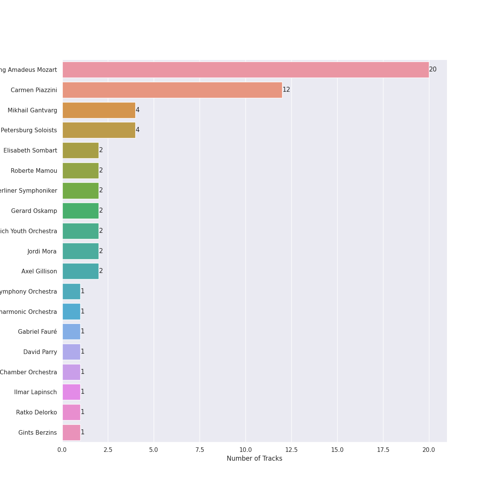
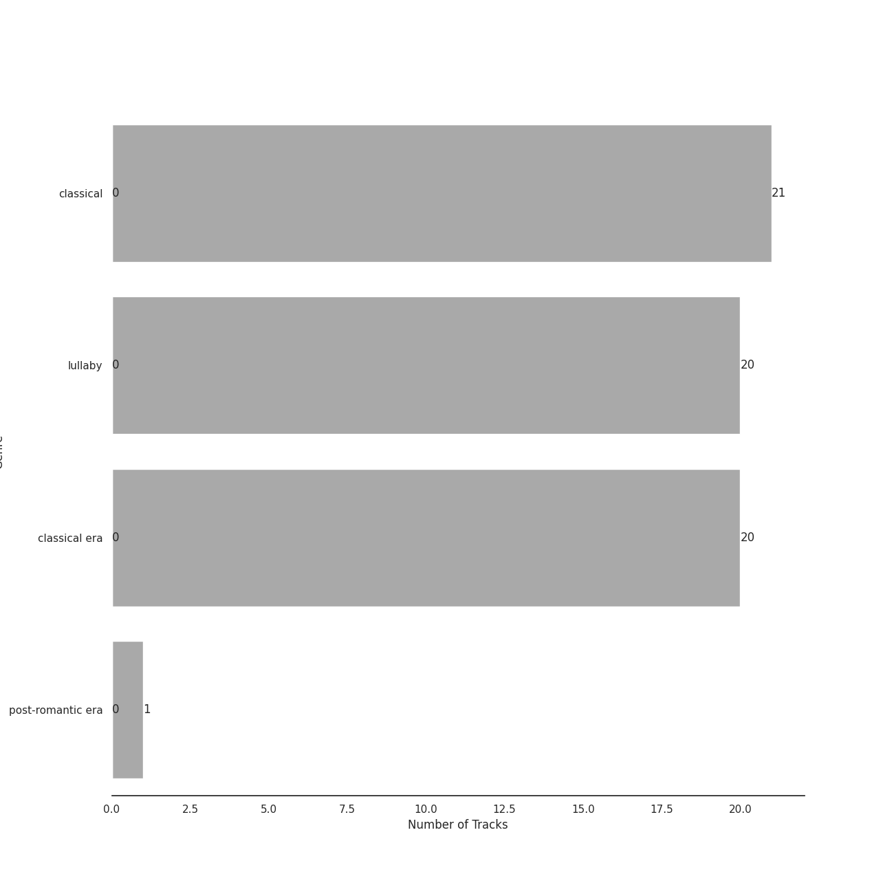

# Warner Music Group - X5 Music Group

21 songs

Appears as:
- Warner Music Group - X5 Music Group (21 tracks)

## Top Artists

See all 19 artists

| Number of Tracks | Art | Artist | 🔗 |
|---:|:---|:---|:---|
| 20 |  | [Wolfgang Amadeus Mozart](../artists/wolfgang_amadeus_mozart.md) | [🔗](https://open.spotify.com/artist/4NJhFmfw43RLBLjQvxDuRS) |
| 12 |  | [Carmen Piazzini](../artists/carmen_piazzini.md) | [🔗](https://open.spotify.com/artist/6aQUOvrKLOquCAvIGdIwTx) |
| 4 |  | Mikhail Gantvarg | [🔗](https://open.spotify.com/artist/1SCRjxxRnRFsoctLKXIoZx) |
| 4 |  | The St. Petersburg Soloists | [🔗](https://open.spotify.com/artist/11K9yxwc8iVyEh0ya9v9XY) |
| 2 |  | Elisabeth Sombart | [🔗](https://open.spotify.com/artist/6pp4xqAWH1oHFQX0kJtVvO) |
| 2 |  | Roberte Mamou | [🔗](https://open.spotify.com/artist/6DsbdauTI2Fn2NN4B1EIUN) |
| 2 |  | Berliner Symphoniker | [🔗](https://open.spotify.com/artist/5pF76lplGIvEFGb8lI48hA) |
| 2 |  | Gerard Oskamp | [🔗](https://open.spotify.com/artist/4TWzdKT6XMuddLAoj6PgXi) |
| 2 |  | Munich Youth Orchestra | [🔗](https://open.spotify.com/artist/3jgBofW8eFrbtrsSbLy8Br) |
| 2 |  | Jordi Mora | [🔗](https://open.spotify.com/artist/0bE9Z0z4cxaixqTRU2O5BA) |
| 2 |  | Axel Gillison | [🔗](https://open.spotify.com/artist/05ukT24TP30K50Blikom8z) |
| 1 |  | Mostar Symphony Orchestra | [🔗](https://open.spotify.com/artist/70i7O3jytAajMDs0nV0Zbk) |
| 1 |  | London Philharmonic Orchestra | [🔗](https://open.spotify.com/artist/3PfJE6ebCbCHeuqO4BfNeA) |
| 1 |  | Gabriel Fauré | [🔗](https://open.spotify.com/artist/2gClsBep1tt1rv1CN210SO) |
| 1 |  | David Parry | [🔗](https://open.spotify.com/artist/2dfDjeZroUd3LWmSFrAZCD) |
| 1 |  | Vestischen Chamber Orchestra | [🔗](https://open.spotify.com/artist/1m3ycS5catGCiLB0J5eKDG) |
| 1 |  | Ilmar Lapinsch | [🔗](https://open.spotify.com/artist/0dI3iXIxXjAtMkzZCsOVEg) |
| 1 |  | Ratko Delorko | [🔗](https://open.spotify.com/artist/0E1sM06TDvSpGqNQBx8FV0) |
| 1 |  | Gints Berzins | [🔗](https://open.spotify.com/artist/0CqCB3JQz4h9k3qk74ihWT) |

## Top Albums

See all 2 albums

| Number of Tracks | Art | Album | Release Date | 🔗 |
|---:|:---|:---|:---|:---|
| 20 |  | Mozart Piano Pieces | 2020-10-13 | [🔗](https://open.spotify.com/album/3AYEvo7R1gY4O5xJuMwy3U) |
| 1 |  | Fauré Pavane | 2020-05-30 | [🔗](https://open.spotify.com/album/0FaQ2LW8NNG3YXYJXFikJF) |

## Genres

See all 3 genres

| Number of Tracks | Genre |
|---:|:---|
| 21 | [classical](../genres/classical.md) |
| 20 | [classical era](../genres/classical_era.md) |
| 1 | [post-romantic era](../genres/post_romantic_era.md) |

## Tracks released under Warner Music Group - X5 Music Group

| Art | Track | Album | Artists | Label | 💚 | 🔗 |
|:---|:---|:---|:---|:---|:---|:---|
|  | Fauré Pavane | Fauré Pavane | Gabriel Fauré, David Parry, London Philharmonic Orchestra | [Warner Music Group - X5 Music Group](warner_music_group___x5_music_group.md) | | [🔗](https://open.spotify.com/track/2BzQ1604JsM3oNzaRYhnoG) |
|  | Piano Concerto No. 20 in D Minor, K. 466: I. Allegro | Mozart Piano Pieces | [Wolfgang Amadeus Mozart](../artists/wolfgang_amadeus_mozart.md), Roberte Mamou, Gerard Oskamp, Berliner Symphoniker | [Warner Music Group - X5 Music Group](warner_music_group___x5_music_group.md) | | [🔗](https://open.spotify.com/track/78Ujl5rH38vlmaWJ2gkXCM) |
|  | Piano Concerto No. 20 in D Minor, K. 466: II. Romance | Mozart Piano Pieces | [Wolfgang Amadeus Mozart](../artists/wolfgang_amadeus_mozart.md), Roberte Mamou, Gerard Oskamp, Berliner Symphoniker | [Warner Music Group - X5 Music Group](warner_music_group___x5_music_group.md) | | [🔗](https://open.spotify.com/track/2XY6ID1TAueZidFAfkjUCK) |
|  | Piano Concerto No. 21 in C Major, K. 467 "Elvira Madigan": II. Andante | Mozart Piano Pieces | [Wolfgang Amadeus Mozart](../artists/wolfgang_amadeus_mozart.md), Gints Berzins, Ilmar Lapinsch, Mostar Symphony Orchestra | [Warner Music Group - X5 Music Group](warner_music_group___x5_music_group.md) | | [🔗](https://open.spotify.com/track/2ES32uE3jNNq9egqkqJ0Cy) |
|  | Piano Concerto No. 23 in A Major, K. 488: I. Allegro | Mozart Piano Pieces | [Wolfgang Amadeus Mozart](../artists/wolfgang_amadeus_mozart.md), Elisabeth Sombart, Jordi Mora, Munich Youth Orchestra | [Warner Music Group - X5 Music Group](warner_music_group___x5_music_group.md) | | [🔗](https://open.spotify.com/track/3UhX1R5oBwxgBMycxFsNku) |
|  | Piano Concerto No. 23 in A Major, K. 488: II. Adagio | Mozart Piano Pieces | [Wolfgang Amadeus Mozart](../artists/wolfgang_amadeus_mozart.md), Elisabeth Sombart, Jordi Mora, Munich Youth Orchestra | [Warner Music Group - X5 Music Group](warner_music_group___x5_music_group.md) | | [🔗](https://open.spotify.com/track/7dF349cWZHlNnSUBdn1NkS) |
|  | Piano Concerto No. 24 in C Minor, K. 491: I. Allegro | Mozart Piano Pieces | [Wolfgang Amadeus Mozart](../artists/wolfgang_amadeus_mozart.md), [Carmen Piazzini](../artists/carmen_piazzini.md), Mikhail Gantvarg, The St. Petersburg Soloists | [Warner Music Group - X5 Music Group](warner_music_group___x5_music_group.md) | | [🔗](https://open.spotify.com/track/2OA3ADPrHocxY3hOhgO3r6) |
|  | Piano Concerto No. 24 in C Minor, K. 491: II. Larghetto | Mozart Piano Pieces | [Wolfgang Amadeus Mozart](../artists/wolfgang_amadeus_mozart.md), [Carmen Piazzini](../artists/carmen_piazzini.md), Mikhail Gantvarg, The St. Petersburg Soloists | [Warner Music Group - X5 Music Group](warner_music_group___x5_music_group.md) | | [🔗](https://open.spotify.com/track/1So9jHVpEqcbNX6rU9wUDC) |
|  | Piano Concerto No. 26 in D Major, K. 537 "Coronation": II. Larghetto | Mozart Piano Pieces | [Wolfgang Amadeus Mozart](../artists/wolfgang_amadeus_mozart.md), [Carmen Piazzini](../artists/carmen_piazzini.md), Mikhail Gantvarg, The St. Petersburg Soloists | [Warner Music Group - X5 Music Group](warner_music_group___x5_music_group.md) | | [🔗](https://open.spotify.com/track/5u6hBSm9NCenBdZK5RvNnc) |
|  | Piano Concerto No. 27 in B-Flat Major, K. 595: II. Larghetto | Mozart Piano Pieces | [Wolfgang Amadeus Mozart](../artists/wolfgang_amadeus_mozart.md), [Carmen Piazzini](../artists/carmen_piazzini.md), Mikhail Gantvarg, The St. Petersburg Soloists | [Warner Music Group - X5 Music Group](warner_music_group___x5_music_group.md) | | [🔗](https://open.spotify.com/track/04Vw5tlqRgimrmWnbuDI2O) |
|  | Piano Concerto No. 5 in D Major, K. 175: II. Andante ma un poco adagio | Mozart Piano Pieces | [Wolfgang Amadeus Mozart](../artists/wolfgang_amadeus_mozart.md), Ratko Delorko, Vestischen Chamber Orchestra | [Warner Music Group - X5 Music Group](warner_music_group___x5_music_group.md) | | [🔗](https://open.spotify.com/track/4pdYTfl39K3FeRYEUFVVhI) |
|  | Piano Sonata No. 10 in C Major, K. 330: I. Allegro moderato | Mozart Piano Pieces | [Wolfgang Amadeus Mozart](../artists/wolfgang_amadeus_mozart.md), [Carmen Piazzini](../artists/carmen_piazzini.md) | [Warner Music Group - X5 Music Group](warner_music_group___x5_music_group.md) | | [🔗](https://open.spotify.com/track/4bYKF903uYHuICjBBJ8ajX) |
|  | Piano Sonata No. 10 in C Major, K. 330: II. Andante cantabile | Mozart Piano Pieces | [Wolfgang Amadeus Mozart](../artists/wolfgang_amadeus_mozart.md), [Carmen Piazzini](../artists/carmen_piazzini.md) | [Warner Music Group - X5 Music Group](warner_music_group___x5_music_group.md) | | [🔗](https://open.spotify.com/track/5U6VsJNR6jH9sBdKHPN3Yg) |
|  | Piano Sonata No. 11 in A Major, K. 331 "Turkish March": III. Alla turca | Mozart Piano Pieces | [Wolfgang Amadeus Mozart](../artists/wolfgang_amadeus_mozart.md), [Carmen Piazzini](../artists/carmen_piazzini.md) | [Warner Music Group - X5 Music Group](warner_music_group___x5_music_group.md) | | [🔗](https://open.spotify.com/track/2OEYKSfs1UGUcyXahqdw7P) |
|  | Piano Sonata No. 12 in F Major, K. 332: II. Adagio | Mozart Piano Pieces | [Wolfgang Amadeus Mozart](../artists/wolfgang_amadeus_mozart.md), Axel Gillison | [Warner Music Group - X5 Music Group](warner_music_group___x5_music_group.md) | | [🔗](https://open.spotify.com/track/004a5pvn9FmiF9jTujKiJp) |
|  | Piano Sonata No. 14 in C Minor, K. 457: I. Molto allegro | Mozart Piano Pieces | [Wolfgang Amadeus Mozart](../artists/wolfgang_amadeus_mozart.md), [Carmen Piazzini](../artists/carmen_piazzini.md) | [Warner Music Group - X5 Music Group](warner_music_group___x5_music_group.md) | | [🔗](https://open.spotify.com/track/1aDx9apuE3Jai42FyPvl4P) |
|  | Piano Sonata No. 16 in C Major, K. 545 "Sonata facile": I. Allegro | Mozart Piano Pieces | [Wolfgang Amadeus Mozart](../artists/wolfgang_amadeus_mozart.md), [Carmen Piazzini](../artists/carmen_piazzini.md) | [Warner Music Group - X5 Music Group](warner_music_group___x5_music_group.md) | | [🔗](https://open.spotify.com/track/6VAXPtvpk3jekxuRCTntMx) |
|  | Piano Sonata No. 16 in C Major, K. 545 "Sonata facile": II. Andante | Mozart Piano Pieces | [Wolfgang Amadeus Mozart](../artists/wolfgang_amadeus_mozart.md), [Carmen Piazzini](../artists/carmen_piazzini.md) | [Warner Music Group - X5 Music Group](warner_music_group___x5_music_group.md) | | [🔗](https://open.spotify.com/track/6q7iZv8b4xt4tppt53d18d) |
|  | Piano Sonata No. 16 in C Major, K. 545 "Sonata facile": III. Rondo | Mozart Piano Pieces | [Wolfgang Amadeus Mozart](../artists/wolfgang_amadeus_mozart.md), [Carmen Piazzini](../artists/carmen_piazzini.md) | [Warner Music Group - X5 Music Group](warner_music_group___x5_music_group.md) | | [🔗](https://open.spotify.com/track/1JLOh8aetP2T5OUPZnu4Jb) |
|  | Piano Sonata No. 18 in D Major, K. 576: I. Allegro | Mozart Piano Pieces | [Wolfgang Amadeus Mozart](../artists/wolfgang_amadeus_mozart.md), [Carmen Piazzini](../artists/carmen_piazzini.md) | [Warner Music Group - X5 Music Group](warner_music_group___x5_music_group.md) | | [🔗](https://open.spotify.com/track/7bv1oLv8wGSVp96UkZsPgJ) |
|  | Piano Sonata No. 9 in D Major, K. 311: II. Andante con expressione | Mozart Piano Pieces | [Wolfgang Amadeus Mozart](../artists/wolfgang_amadeus_mozart.md), Axel Gillison | [Warner Music Group - X5 Music Group](warner_music_group___x5_music_group.md) | | [🔗](https://open.spotify.com/track/5OxM1YJI1qAzxpBPjTRiCn) |
