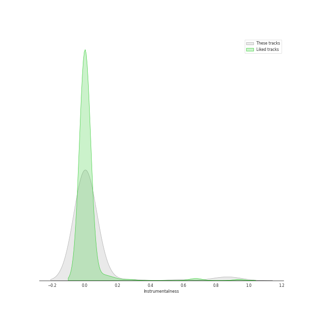
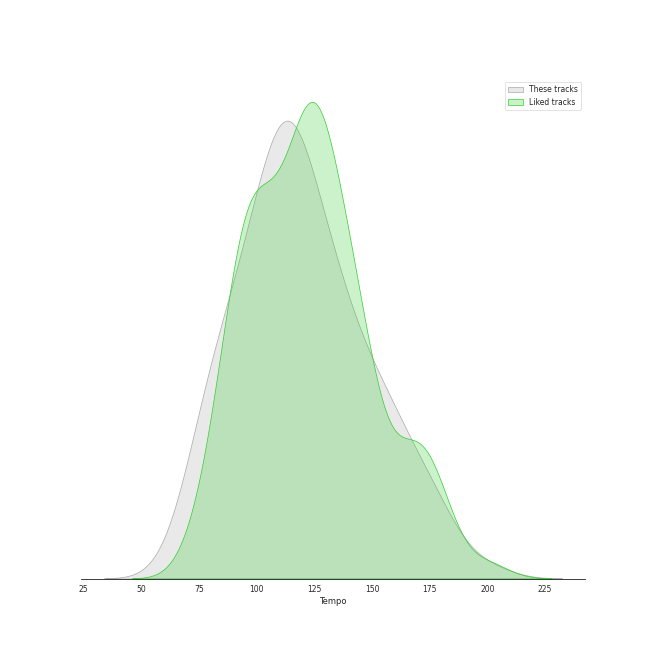

# Audio Features for Warner Records

## Danceability

| 10 most Danceable tracks | 10 least Danceable tracks |
|:---|:---|
| Pretty Please (0.906) | Does He Love You? (0.317) |
| Cheetah (0.885) | Iron Man (0.332) |
| Slow (with Ciara) (0.863) | Feeling Good (0.345) |
| Bubblegum (feat. Tyga) (0.856) | Knights of Cydonia (0.366) |
| Good Intent (0.851) | Purple Rain (0.367) |
| Dreams - 2004 Remaster (0.828) | Strip My Mind (0.387) |
| Don't Start Now (0.793) | Slow Cheetah (0.39) |
| Break My Heart Myself (feat. YEJI & RYUJIN of ITZY) (0.771) | Waltz Me to the Grave (0.394) |
| Like a Virgin (0.771) | Paranoid - 2012 - Remaster (0.412) |
| Recovery (0.767) | Landslide (0.414) |

## Energy

| 10 most Energetic tracks | 10 least Energetic tracks |
|:---|:---|
| When Doves Cry (0.989) | Landslide (0.161) |
| Girls (0.974) | Crazy Love - 2013 Remaster (0.188) |
| Knights of Cydonia (0.963) | Moondance - 2013 Remaster (0.282) |
| Go Your Own Way - 2004 Remaster (0.941) | I Love You 3000 II (0.338) |
| Can't Stop (0.938) | Slow Cheetah (0.344) |
| Cameo Lover (0.922) | Waltz Me to the Grave (0.352) |
| Supermassive Black Hole (0.921) | Plain Gold Ring (0.39) |
| Believe (0.917) | Madness (0.417) |
| Dani California (0.913) | Feeling Good (0.418) |
| Like They Do on the TV (0.911) | Purple Rain (0.452) |

## Speechiness

| 10 most Speechy tracks | 10 least Speechy tracks |
|:---|:---|
| Bubblegum (feat. Tyga) (0.34) | Californication (0.027) |
| Girls (0.325) | Dreams - 2004 Remaster (0.0276) |
| Life's Too Short (English Version) (0.265) | Smoke on the Water (0.0284) |
| Trumpets (0.258) | Silver Lining (0.0288) |
| Talk Dirty (feat. 2 Chainz) (0.232) | Rhiannon (0.0296) |
| Cheetah (0.225) | Sara - 2015 Remaster (0.0303) |
| Pretty Please (0.194) | Animals (0.0307) |
| Numb / Encore (0.166) | Purple Rain (0.0307) |
| Knights of Cydonia (0.142) | Cruel (0.0309) |
| Hallucinate (0.139) | Feeling Good (0.0316) |

## Acousticness

| 10 most Acoustic tracks | 10 least Acoustic tracks |
|:---|:---|
| Plain Gold Ring (0.9) | Paranoid - 2012 - Remaster (4.52e-05) |
| Landslide (0.883) | Knights of Cydonia (0.000273) |
| I Love You 3000 II (0.853) | Portions for Foxes (0.000938) |
| Crazy Love - 2013 Remaster (0.841) | Cruel (0.00137) |
| Baby It's Cold Outside (with Michael Bublé) (0.647) | Californication (0.0021) |
| Accidntel Deth (0.59) | New Rules (0.00261) |
| Trumpets (0.555) | Come Alive (0.00288) |
| ICU (0.536) | Iron Man (0.00367) |
| Moondance - 2013 Remaster (0.501) | Blow (0.00437) |
| Life's Too Short (0.376) | No Hands (feat. Roscoe Dash & Wale) (0.00544) |

## Instrumentalness

| 10 most Instrumental tracks | 10 least Instrumental tracks |
|:---|:---|
| Animals (0.796) | No Hands (feat. Roscoe Dash & Wale) (0.0) |
| Smoke on the Water (0.581) | Baby It's Cold Outside (with Michael Bublé) (0.0) |
| Like They Do on the TV (0.114) | ICU (0.0) |
| Rhiannon (0.0946) | Don't Start Now (0.0) |
| Top of the World (0.0626) | Bubblegum (feat. Tyga) (0.0) |
| Sara - 2015 Remaster (0.0208) | Levitating (0.0) |
| Lightyears (0.0149) | Life's Too Short (0.0) |
| Knights of Cydonia (0.0122) | Hallucinate (0.0) |
| Portions for Foxes (0.0121) | Baby, I'm Jealous (feat. Doja Cat) (0.0) |
| Supermassive Black Hole (0.00517) | Believe (0.0) |

## Liveness

| 10 most Live tracks | 10 least Live tracks |
|:---|:---|
| Animals (0.696) | Iron Man (0.0372) |
| Purple Rain (0.689) | The Chain - 2004 Remaster (0.0451) |
| Numb / Encore (0.582) | Believe (0.0509) |
| When Doves Cry (0.443) | Smoke on the Water (0.0535) |
| I Love You 3000 II (0.412) | Come Alive (0.0627) |
| ICU (0.365) | Levitating (feat. DaBaby) (0.0674) |
| Cheetah (0.35) | Go Your Own Way - 2004 Remaster (0.068) |
| Break My Heart (0.349) | Like a Virgin (0.0685) |
| Dani California (0.346) | Slow Cheetah (0.0715) |
| Illusion (0.322) | Lightyears (0.0731) |

## Valence

| 10 most Happy tracks | 10 least Happy tracks |
|:---|:---|
| Material Girl (0.978) | Waltz Me to the Grave (0.0748) |
| Like a Virgin (0.97) | The Good War (0.0928) |
| Levitating (feat. DaBaby) (0.915) | Old Flame (0.0932) |
| Levitating (0.914) | Purple Rain (0.189) |
| Smoke on the Water (0.89) | Knights of Cydonia (0.211) |
| Can't Stop (0.875) | Madness (0.218) |
| When Doves Cry (0.84) | Slow Cheetah (0.244) |
| Good Intent (0.834) | Like a Prayer (0.257) |
| Go Your Own Way - 2004 Remaster (0.831) | Strip My Mind (0.262) |
| Blow (0.823) | Feeling Good (0.267) |

## Tempo

| 10 most Fast tracks | 10 least Fast tracks |
|:---|:---|
| Like They Do on the TV (199.23) | Moondance - 2013 Remaster (67.409) |
| Madness (180.301) | Life's Too Short (English Version) (72.203) |
| I Love You 3000 II (179.727) | Crazy Love - 2013 Remaster (77.464) |
| Slow Cheetah (178.102) | Old Flame (77.61) |
| Girls (171.958) | Does He Love You? (78.983) |
| Animals (169.987) | Cruel (78.99) |
| Limbo (165.02) | Trumpets (82.142) |
| Paranoid - 2012 - Remaster (163.071) | Life's Too Short (83.311) |
| Landslide (159.375) | Plain Gold Ring (85.304) |
| Iron Man (157.378) | Illusion (90.027) |
