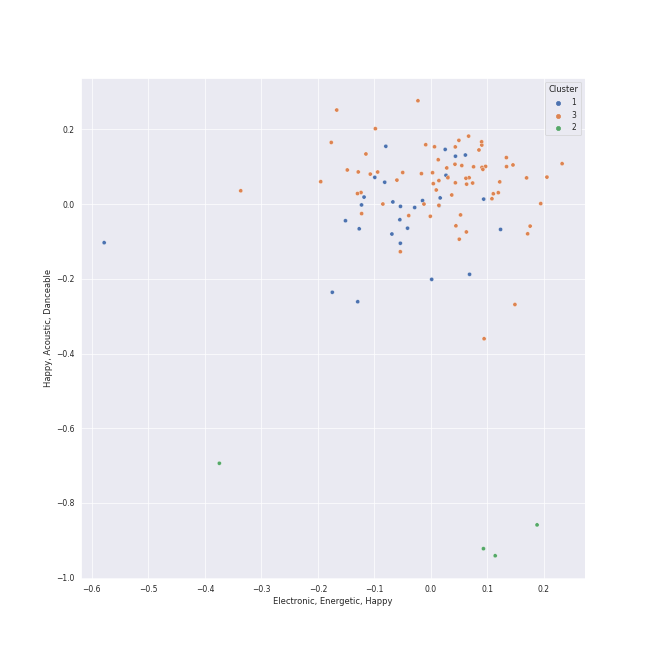

# Clusters in Warner Records

## Cluster #1

37 tracks

| Art | Track | Album | Artists | Label | Score | 💚 | 🔗 |
|:---|:---|:---|:---|:---|---:|:---|:---|
|  | Strip My Mind | Stadium Arcadium | Red Hot Chili Peppers | [Warner Records](../..) | 0 | | [🔗](https://open.spotify.com/track/0J3ytriezGZ3KCREfHKDOI) |
|  | Californication | Californication (Deluxe Edition) | Red Hot Chili Peppers | [Warner Records](../..) | 0 | | [🔗](https://open.spotify.com/track/48UPSzbZjgc449aqz8bxox) |
|  | Top of the World | Primal Heart | [Kimbra](../../../../artists/kimbra/overview.md) | [Warner Records](../..) | 0 | | [🔗](https://open.spotify.com/track/1Gbdx88ElOui7lczwxGX6m) |
|  | Plain Gold Ring | Vows (Deluxe Version) | [Kimbra](../../../../artists/kimbra/overview.md) | [Warner Records](../..) | 0 | 💚 | [🔗](https://open.spotify.com/track/55RJLcVGohfyfuSP4EyE1I) |
|  | Feeling Good | Origin of Symmetry | Muse | [Warner Records](../..) | 0 | 💚 | [🔗](https://open.spotify.com/track/5Yj4AP0JGQWierBFKdKVyS) |
|  | Portions for Foxes | More Adventurous (U.S. Release) | [Rilo Kiley](../../../../artists/rilo_kiley/overview.md) | [Brute/Beaute/Warner Records](../..) | 0 | 💚 | [🔗](https://open.spotify.com/track/4yY8JqTOQyi7K4O1QcQtBG) |
|  | ICU | Girls - The 2nd Mini Album | [aespa](../../../../artists/aespa/overview.md) | [SM Entertainment](../../../sm_entertainment), [Warner Records](../..) | 0 | | [🔗](https://open.spotify.com/track/11JpW4h96X4TlGt6LFpNCC) |
|  | Welcome To MY World (feat. nævis) | MY WORLD - The 3rd Mini Album | [aespa](../../../../artists/aespa/overview.md), nævis | [SM Entertainment](../../../sm_entertainment), [Warner Records](../..) | 24319 | 💚 | [🔗](https://open.spotify.com/track/3q5qpprtugUIEPExuI7tRD) |
|  | Drama | Drama - The 4th Mini Album | [aespa](../../../../artists/aespa/overview.md) | [SM Entertainment](../../../sm_entertainment), [Warner Records](../..) | 14916 | 💚 | [🔗](https://open.spotify.com/track/5XWlyfo0kZ8LF7VSyfS4Ew) |
|  | Welcome To MY World (feat. nævis) | Welcome To MY World (feat. nævis) | [aespa](../../../../artists/aespa/overview.md), nævis | [SM Entertainment](../../../sm_entertainment), [Warner Records](../..) | 0 | | [🔗](https://open.spotify.com/track/6qVqWJxIpsabUKBILG7d6N) |
## Cluster #2

4 tracks

| Art | Track | Album | Artists | Label | Score | 💚 | 🔗 |
|:---|:---|:---|:---|:---|---:|:---|:---|
|  | Animals | The 2nd Law | Muse | [Warner Records](../..) | 0 | 💚 | [🔗](https://open.spotify.com/track/2raJLzvNRvipP8cJuchk6U) |
|  | Love Theme from Superman | Superman: The Movie (Original Motion Picture Soundtrack) | John Williams | [Rhino](../../../rhino), [Warner Records](../..) | 0 | | [🔗](https://open.spotify.com/track/0qH5i6q2FsRIlDu9nwpe4H) |
|  | The Flying Sequence | Superman: The Movie (Original Motion Picture Soundtrack) | John Williams | [Rhino](../../../rhino), [Warner Records](../..) | 0 | | [🔗](https://open.spotify.com/track/5dPcPWdK2V25QKIV7deqfL) |
|  | Tell Me a Bedtime Story | Fat Albert Rotunda | Herbie Hancock | [Rhino](../../../rhino), [Warner Records](../..) | 0 | 💚 | [🔗](https://open.spotify.com/track/6eimz6jvlZaPwtflDWCTa0) |
## Cluster #3

64 tracks

| Art | Track | Album | Artists | Label | Score | 💚 | 🔗 |
|:---|:---|:---|:---|:---|---:|:---|:---|
|  | Recovery | Primal Heart | [Kimbra](../../../../artists/kimbra/overview.md) | [Warner Records](../..) | 0 | | [🔗](https://open.spotify.com/track/0HqtTIH9Eo7IdTiiFvpdjM) |
|  | Silver Lining | Under The Blacklight (Standard Version) | [Rilo Kiley](../../../../artists/rilo_kiley/overview.md) | [Warner Records](../..) | 0 | 💚 | [🔗](https://open.spotify.com/track/0ieqq1wbtso2UjJWPqJ5Xc) |
|  | Jingle Bell Rock | Jingle Bell Rock | [aespa](../../../../artists/aespa/overview.md) | [SM Entertainment](../../../sm_entertainment), [Warner Records](../..) | 7314 | | [🔗](https://open.spotify.com/track/0ijCESscFXtRc0dtDgu1Uv) |
|  | Lingo | Girls - The 2nd Mini Album | [aespa](../../../../artists/aespa/overview.md) | [SM Entertainment](../../../sm_entertainment), [Warner Records](../..) | 0 | 💚 | [🔗](https://open.spotify.com/track/3tB10LUdisNWISpLw5gPCk) |
|  | Don't Start Now | Future Nostalgia | [Dua Lipa](../../../../artists/dua_lipa/overview.md) | [Warner Records](../..) | 0 | 💚 | [🔗](https://open.spotify.com/track/1AVtceapuF36oZqI9gzp0o) |
|  | Hallucinate | Future Nostalgia | [Dua Lipa](../../../../artists/dua_lipa/overview.md) | [Warner Records](../..) | 0 | | [🔗](https://open.spotify.com/track/2MUKw7zEirXqdZZ3xC4hOf) |
|  | New Rules | Dua Lipa (Complete Edition) | [Dua Lipa](../../../../artists/dua_lipa/overview.md) | [Warner Records](../..) | 0 | 💚 | [🔗](https://open.spotify.com/track/43oK4OAWUsRZUDVeHtKI4U) |
|  | Swalla (feat. Nicki Minaj & Ty Dolla $ign) | Swalla (feat. Nicki Minaj & Ty Dolla $ign) | [Jason Derulo](../../../../artists/jason_derulo/overview.md), Nicki Minaj, Ty Dolla $ign | [Beluga Heights/Warner Records](../..) | 0 | | [🔗](https://open.spotify.com/track/6kex4EBAj0WHXDKZMEJaaF) |
|  | Come Alive | MAGIC MAN | [Jackson Wang](../../../../artists/jackson_wang/overview.md) | TEAM WANG records, [88rising Music](../../../88rising_music), [Warner Records](../..) | 0 | 💚 | [🔗](https://open.spotify.com/track/2mrG7QoaHDD1kYhr5jeK9q) |
|  | LMLY | LMLY | [Jackson Wang](../../../../artists/jackson_wang/overview.md) | [88rising Music](../../../88rising_music), [Warner Records](../..) | 0 | | [🔗](https://open.spotify.com/track/3Jbpo2slhW2bbVneiJnC9G) |