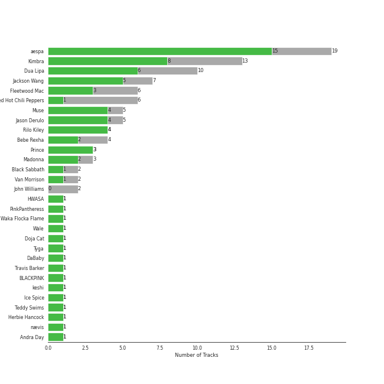
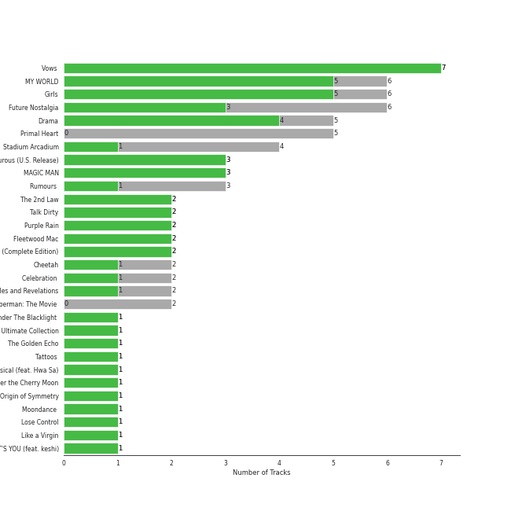
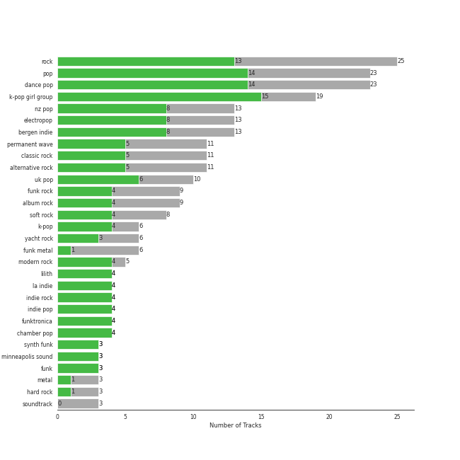
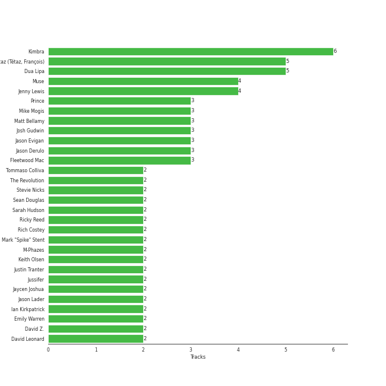

# Warner Records

96 songs

[See Track Features](audio_features.md)

[See Clusters](clusters/overview.md)

Appears as:
- Warner Records (70 tracks)
- Rhino/Warner Records (9 tracks)
- Beluga Heights/Warner Records (5 tracks)
- TEAM WANG records/88rising Music/Warner Records (5 tracks)
- Brute/Beaute/Warner Records (3 tracks)
- 88rising Music/Warner Records (2 tracks)
- Asylum/Warner Records (1 tracks)
- Warner Records/Roc-A-Fella (1 tracks)

## Top Artists

| Art | Tracks | 💚 | Artist | 🔗 |
|:---|---:|---:|:---|:---|
|  | 19 | 16 | [aespa](../../artists/aespa/overview.md) | [🔗](https://open.spotify.com/artist/6YVMFz59CuY7ngCxTxjpxE) |
|  | 13 | 8 | [Kimbra](../../artists/kimbra/overview.md) | [🔗](https://open.spotify.com/artist/6hk7Yq1DU9QcCCrz9uc0Ti) |
|  | 11 | 6 | [Dua Lipa](../../artists/dua_lipa/overview.md) | [🔗](https://open.spotify.com/artist/6M2wZ9GZgrQXHCFfjv46we) |
|  | 7 | 5 | [Jackson Wang](../../artists/jackson_wang/overview.md) | [🔗](https://open.spotify.com/artist/1kfWoWgCugPkyxQP8lkRlY) |
|  | 5 | 4 | Muse | [🔗](https://open.spotify.com/artist/12Chz98pHFMPJEknJQMWvI) |
|  | 5 | 4 | [Jason Derulo](../../artists/jason_derulo/overview.md) | [🔗](https://open.spotify.com/artist/07YZf4WDAMNwqr4jfgOZ8y) |
|  | 4 | 4 | [Rilo Kiley](../../artists/rilo_kiley/overview.md) | [🔗](https://open.spotify.com/artist/2cevwbv7ISD92VMNLYLHZA) |
|  | 6 | 2 | Fleetwood Mac | [🔗](https://open.spotify.com/artist/08GQAI4eElDnROBrJRGE0X) |
|  | 4 | 2 | Bebe Rexha | [🔗](https://open.spotify.com/artist/64M6ah0SkkRsnPGtGiRAbb) |
|  | 3 | 2 | Madonna | [🔗](https://open.spotify.com/artist/6tbjWDEIzxoDsBA1FuhfPW) |

See all 42 artists

| Art | Tracks | 💚 | Artist | 🔗 |
|:---|---:|---:|:---|:---|
|  | 6 | 1 | Red Hot Chili Peppers | [🔗](https://open.spotify.com/artist/0L8ExT028jH3ddEcZwqJJ5) |
|  | 2 | 1 | Prince | [🔗](https://open.spotify.com/artist/5a2EaR3hamoenG9rDuVn8j) |
|  | 2 | 1 | Black Sabbath | [🔗](https://open.spotify.com/artist/5M52tdBnJaKSvOpJGz8mfZ) |
|  | 2 | 1 | Van Morrison | [🔗](https://open.spotify.com/artist/44NX2ffIYHr6D4n7RaZF7A) |
|  | 1 | 1 | [HWASA](../../artists/hwasa/overview.md) | [🔗](https://open.spotify.com/artist/7bmYpVgQub656uNTu6qGNQ) |
|  | 1 | 1 | Waka Flocka Flame | [🔗](https://open.spotify.com/artist/6f4XkbvYlXMH0QgVRzW0sM) |
|  | 1 | 1 | Wale | [🔗](https://open.spotify.com/artist/67nwj3Y5sZQLl72VNUHEYE) |
|  | 1 | 1 | [Doja Cat](../../artists/doja_cat/overview.md) | [🔗](https://open.spotify.com/artist/5cj0lLjcoR7YOSnhnX0Po5) |
|  | 1 | 1 | Tyga | [🔗](https://open.spotify.com/artist/5LHRHt1k9lMyONurDHEdrp) |
|  | 1 | 1 | DaBaby | [🔗](https://open.spotify.com/artist/4r63FhuTkUYltbVAg5TQnk) |
|  | 1 | 1 | Travis Barker | [🔗](https://open.spotify.com/artist/4exLIFE8sISLr28sqG1qNX) |
|  | 1 | 1 | [BLACKPINK](../../artists/blackpink/overview.md) | [🔗](https://open.spotify.com/artist/41MozSoPIsD1dJM0CLPjZF) |
|  | 1 | 1 | keshi | [🔗](https://open.spotify.com/artist/3pc0bOVB5whxmD50W79wwO) |
|  | 1 | 1 | nævis | [🔗](https://open.spotify.com/artist/2067CjQ2nC56cRZX8goeHg) |
|  | 1 | 1 | MAX | [🔗](https://open.spotify.com/artist/1bqxdqvUtPWZri43cKHac8) |
|  | 1 | 1 | 88rising | [🔗](https://open.spotify.com/artist/1AhjOkOLkbHUfcHDSErXQs) |
|  | 1 | 1 | 2 Chainz | [🔗](https://open.spotify.com/artist/17lzZA2AlOHwCwFALHttmp) |
|  | 1 | 1 | Roscoe Dash | [🔗](https://open.spotify.com/artist/0bfX8pF8kuHNCs57Ms4jZb) |
|  | 1 | 1 | Stephanie Poetri | [🔗](https://open.spotify.com/artist/0HS00NN7MAfF59aJnfcxSO) |
|  | 1 | 0 | Ty Dolla $ign | [🔗](https://open.spotify.com/artist/7c0XG5cIJTrrAgEC3ULPiq) |
|  | 1 | 0 | Idina Menzel | [🔗](https://open.spotify.com/artist/73Np75Wv2tju61Eo9Zw4IR) |
|  | 1 | 0 | Cher | [🔗](https://open.spotify.com/artist/72OaDtakiy6yFqkt4TsiFt) |
|  | 1 | 0 | Linkin Park | [🔗](https://open.spotify.com/artist/6XyY86QOPPrYVGvF9ch6wz) |
|  | 1 | 0 | Deep Purple | [🔗](https://open.spotify.com/artist/568ZhdwyaiCyOGJRtNYhWf) |
| | 1 | 0 | YEJI & RYUJIN of ITZY | [🔗](https://open.spotify.com/artist/4TYswX6bKUjM9rbEL7CMBH) |
|  | 1 | 0 | JAY-Z | [🔗](https://open.spotify.com/artist/3nFkdlSjzX9mRTtwJOzDYB) |
|  | 1 | 0 | Florida Georgia Line | [🔗](https://open.spotify.com/artist/3b8QkneNDz4JHKKKlLgYZg) |
|  | 1 | 0 | Ciara | [🔗](https://open.spotify.com/artist/2NdeV5rLm47xAvogXrYhJX) |
|  | 1 | 0 | [ITZY](../../artists/itzy/overview.md) | [🔗](https://open.spotify.com/artist/2KC9Qb60EaY0kW4eH68vr3) |
|  | 1 | 0 | Bella Poarch | [🔗](https://open.spotify.com/artist/26cMerAxjx9GedFt0lMDjm) |
|  | 1 | 0 | [Michael Bublé](../../artists/michael_bubl_/overview.md) | [🔗](https://open.spotify.com/artist/1GxkXlMwML1oSg5eLPiAz3) |
|  | 1 | 0 | Nicki Minaj | [🔗](https://open.spotify.com/artist/0hCNtLu0JehylgoiP8L4Gh) |

## Top Albums

| Art | Tracks | 💚 | Album | Release Date | 🔗 |
|:---|---:|---:|:---|:---|:---|
|  | 7 | 7 | Vows (Deluxe Version) | 2011 | [🔗](https://open.spotify.com/album/6V9rvW05Um5bIHePPfeI8p) |
|  | 7 | 3 | Future Nostalgia | 2020-03-27 | [🔗](https://open.spotify.com/album/5lKlFlReHOLShQKyRv6AL9) |
|  | 6 | 5 | MY WORLD - The 3rd Mini Album | 2023-05-08 | [🔗](https://open.spotify.com/album/69xF8jTd0c4Zoo7DT3Rwrn) |
|  | 6 | 5 | Girls - The 2nd Mini Album | 2022-07-08 | [🔗](https://open.spotify.com/album/4w1dbvUy1crv0knXQvcSeY) |
|  | 5 | 5 | Drama - The 4th Mini Album | 2023-11-10 | [🔗](https://open.spotify.com/album/5NMtxQJy4wq3mpo3ERVnLs) |
|  | 5 | 0 | Primal Heart | 2018-04-20 | [🔗](https://open.spotify.com/album/4pj0BkJ7u39i009oqe8V79) |
|  | 4 | 1 | Stadium Arcadium | 2006-05-09 | [🔗](https://open.spotify.com/album/7xl50xr9NDkd3i2kBbzsNZ) |
|  | 3 | 3 | More Adventurous (U.S. Release) | 2004-07-27 | [🔗](https://open.spotify.com/album/4n36X2GMJ84BKh9D9zMRVI) |
|  | 3 | 3 | MAGIC MAN | 2022-09-09 | [🔗](https://open.spotify.com/album/2VZ4og2ZbwyTQ3X1rbgCe1) |
|  | 3 | 0 | Rumours (Super Deluxe) | 1977-02-04 | [🔗](https://open.spotify.com/album/0BwWUstDMUbgq2NYONRqlu) |

See all 49 albums

| Art | Tracks | 💚 | Album | Release Date | 🔗 |
|:---|---:|---:|:---|:---|:---|
|  | 2 | 2 | The 2nd Law | 2012-09-24 | [🔗](https://open.spotify.com/album/3KuXEGcqLcnEYWnn3OEGy0) |
|  | 2 | 2 | Talk Dirty | 2013-09-10 | [🔗](https://open.spotify.com/album/4PeZu0It7qVrTG40t3HM9A) |
|  | 2 | 2 | Fleetwood Mac | 1975-07-11 | [🔗](https://open.spotify.com/album/5VIQ3VaAoRKOEpJ0fewdvo) |
|  | 2 | 2 | Dua Lipa (Complete Edition) | 2018-10-19 | [🔗](https://open.spotify.com/album/0obMz8EHnr3dg6NCUK4xWp) |
|  | 2 | 1 | Purple Rain | 1984-06-25 | [🔗](https://open.spotify.com/album/7nXJ5k4XgRj5OLg9m8V3zc) |
|  | 2 | 1 | Cheetah | 2023-04-24 | [🔗](https://open.spotify.com/album/4nK0XlFVAQNesqpijBX1Ri) |
|  | 2 | 1 | Celebration (Bonus Track Version) | 2009-09-18 | [🔗](https://open.spotify.com/album/4GU7z3q6fg90MWrkTacYYG) |
|  | 2 | 1 | Black Holes and Revelations | 2006-06-19 | [🔗](https://open.spotify.com/album/0lw68yx3MhKflWFqCsGkIs) |
|  | 1 | 1 | Under The Blacklight (Standard Version) | 2007-08-20 | [🔗](https://open.spotify.com/album/2f9RsTZpsYMLRVZBtW7En8) |
|  | 1 | 1 | The Ultimate Collection | 2017-02-03 | [🔗](https://open.spotify.com/album/6TcPqftScGmR0aEgIb43Vv) |
|  | 1 | 1 | The Golden Echo | 2014-08-15 | [🔗](https://open.spotify.com/album/66hoUkjxM7tVQwu7bZocwP) |
|  | 1 | 1 | Tattoos (Deluxe Edition) | 2013-09-10 | [🔗](https://open.spotify.com/album/3wDeTllVvayYsWTHsFNWZQ) |
|  | 1 | 1 | Physical (feat. Hwa Sa) | 2020-01-28 | [🔗](https://open.spotify.com/album/6apIJi4hf7U6cBOFwIqq1b) |
|  | 1 | 1 | Origin of Symmetry | 2001 | [🔗](https://open.spotify.com/album/1AP6uGYHdakRgwuWQsP5pK) |
|  | 1 | 1 | Moondance (Deluxe Edition) | 1970-02 | [🔗](https://open.spotify.com/album/7diHYi0CglGJekoM3KaWBK) |
|  | 1 | 1 | Like a Virgin | 1984-11-12 | [🔗](https://open.spotify.com/album/2IU9ftOgyRL2caQGWK1jjX) |
|  | 1 | 1 | IT'S YOU (feat. keshi) | 2022-09-09 | [🔗](https://open.spotify.com/album/1LtaBRxkVaAnoTSQQsWjJF) |
|  | 1 | 1 | Head In The Clouds II | 2019-10-11 | [🔗](https://open.spotify.com/album/7bOpX6Ilc9UCFmH9uGyUDy) |
|  | 1 | 1 | Flockaveli | 2010-10-01 | [🔗](https://open.spotify.com/album/6MQtWELG7aRX7CkAzQ6nLM) |
|  | 1 | 1 | Everything Is 4 | 2015-05-29 | [🔗](https://open.spotify.com/album/59eUYETmE1zi31ESb3SUkI) |
|  | 1 | 1 | Better Things | 2023-08-18 | [🔗](https://open.spotify.com/album/1SHLOv0DDdRecK60z86Lth) |
|  | 1 | 1 | Better Mistakes | 2021-05-07 | [🔗](https://open.spotify.com/album/0ypVp54cO3kexiJNu33wYp) |
|  | 1 | 1 | Baby, I'm Jealous (feat. Doja Cat) | 2020-10-09 | [🔗](https://open.spotify.com/album/2N367tN1eIXrHNVe86aVy4) |
|  | 1 | 0 | Tusk (2015 Remaster) | 1979-10-12 | [🔗](https://open.spotify.com/album/5FIN8pyPVx8ggNs5jQ86Re) |
|  | 1 | 0 | Swalla (feat. Nicki Minaj & Ty Dolla $ign) | 2017-02-23 | [🔗](https://open.spotify.com/album/2e5CxfyEwBW115beiwh7Mc) |
|  | 1 | 0 | Paranoid (Remaster) | 1970-09-18 | [🔗](https://open.spotify.com/album/6r7LZXAVueS5DqdrvXJJK7) |
|  | 1 | 0 | Numb / Encore: MTV Ultimate Mash-Ups Presents Collision Course | 2004-11-30 | [🔗](https://open.spotify.com/album/4lhyg7YGQagE8FT8cZBqyw) |
|  | 1 | 0 | Moondance (Expanded Edition) | 1970-02 | [🔗](https://open.spotify.com/album/6yNYC35npMBHbxG0Vle83O) |
|  | 1 | 0 | Machine Head | 1972-03-25 | [🔗](https://open.spotify.com/album/1EK3a0Yctg4d3nGQzE4Uty) |
|  | 1 | 0 | LMLY | 2021-03-26 | [🔗](https://open.spotify.com/album/09UJf8ZqCuv5NHRZIqTZgh) |
|  | 1 | 0 | Jingle Bell Rock | 2023-11-24 | [🔗](https://open.spotify.com/album/7dSaBwUid0hjWdJ5QzIKyu) |
|  | 1 | 0 | Holiday Wishes | 2014-10-10 | [🔗](https://open.spotify.com/album/0EGX5qfw6VEPOMoCUFJFHl) |
|  | 1 | 0 | Expectations | 2018-06-22 | [🔗](https://open.spotify.com/album/4TOkZvtqNpg5UHyGxCn0mS) |
|  | 1 | 0 | Dua Lipa | 2017-06-02 | [🔗](https://open.spotify.com/album/2vlhlrgMaXqcnhRqIEV9AP) |
|  | 1 | 0 | Californication (Deluxe Edition) | 1999-06-08 | [🔗](https://open.spotify.com/album/2Y9IRtehByVkegoD7TcLfi) |
|  | 1 | 0 | By the Way (Deluxe Edition) | 2002-07-09 | [🔗](https://open.spotify.com/album/6deiaArbeoqp1xPEGdEKp1) |
|  | 1 | 0 | Build a Bitch | 2021-05-14 | [🔗](https://open.spotify.com/album/5YKqfiQdPYWJ0kZ5pttY5o) |
|  | 1 | 0 | Break My Heart Myself (feat. YEJI & RYUJIN of ITZY) | 2022-07-29 | [🔗](https://open.spotify.com/album/6nHECY2OnWXVmd4QjGhJEm) |
|  | 1 | 0 | Believe | 1998 | [🔗](https://open.spotify.com/album/0jZfbz0dNfDjPSg0hYJNth) |

## Genres

| Tracks | 💚 | Genre |
|---:|---:|:---|
| 25 | 20 | [k-pop](../../genres/k_pop/overview.md) |
| 19 | 16 | [k-pop girl group](../../genres/k_pop_girl_group/overview.md) |
| 24 | 14 | [pop](../../genres/pop/overview.md) |
| 24 | 14 | [dance pop](../../genres/dance_pop/overview.md) |
| 24 | 10 | [rock](../../genres/rock/overview.md) |
| 13 | 8 | nz pop |
| 13 | 8 | [electropop](../../genres/electropop/overview.md) |
| 13 | 8 | bergen indie |
| 11 | 6 | [uk pop](../../genres/uk_pop/overview.md) |
| 11 | 5 | [permanent wave](../../genres/permanent_wave/overview.md) |

See all 56 genres

| Tracks | 💚 | Genre |
|---:|---:|:---|
| 11 | 5 | [alternative rock](../../genres/alternative_rock/overview.md) |
| 11 | 4 | [classic rock](../../genres/classic_rock/overview.md) |
| 5 | 4 | [modern rock](../../genres/modern_rock/overview.md) |
| 4 | 4 | [lilith](../../genres/lilith/overview.md) |
| 4 | 4 | la indie |
| 4 | 4 | indie rock |
| 4 | 4 | indie pop |
| 4 | 4 | funktronica |
| 4 | 4 | chamber pop |
| 9 | 3 | [album rock](../../genres/album_rock/overview.md) |
| 8 | 3 | [soft rock](../../genres/soft_rock/overview.md) |
| 8 | 2 | funk rock |
| 6 | 2 | yacht rock |
| 6 | 1 | funk metal |
| 3 | 1 | metal |
| 3 | 1 | [hard rock](../../genres/hard_rock/overview.md) |
| 2 | 1 | uk doom metal |
| 2 | 1 | synth funk |
| 2 | 1 | stoner rock |
| 2 | 1 | [singer-songwriter](../../genres/singer_songwriter/overview.md) |
| 2 | 1 | [rap](../../genres/rap/overview.md) |
| 2 | 1 | pop rap |
| 2 | 1 | minneapolis sound |
| 2 | 1 | [mellow gold](../../genres/mellow_gold/overview.md) |
| 2 | 1 | [heartland rock](../../genres/heartland_rock/overview.md) |
| 2 | 1 | funk |
| 2 | 1 | folk rock |
| 2 | 1 | folk |
| 2 | 1 | birmingham metal |
| 2 | 1 | alternative metal |
| 1 | 1 | [viral pop](../../genres/viral_pop/overview.md) |
| 1 | 1 | trap |
| 1 | 1 | teen pop |
| 1 | 1 | southern hip hop |
| 1 | 1 | singer-songwriter pop |
| 1 | 1 | dirty south rap |
| 1 | 1 | atl hip hop |
| 1 | 1 | asian american hip hop |
| 1 | 0 | [show tunes](../../genres/show_tunes/overview.md) |
| 1 | 0 | [movie tunes](../../genres/movie_tunes/overview.md) |
| 1 | 0 | modern alternative pop |
| 1 | 0 | hollywood |
| 1 | 0 | hip hop |
| 1 | 0 | gangster rap |
| 1 | 0 | east coast hip hop |
| 1 | 0 | [broadway](../../genres/broadway/overview.md) |

## Top Producers

| Art | Producer | Tracks | Credit Types |
|:---|:---|---:|:---|
|  | [Kimbra](../../artists/kimbra/overview.md) | 6 | Lyricist, Producer, Songwriter |
|  | [Dua Lipa](../../artists/dua_lipa/overview.md) | 5 | Songwriter |
| | François Tétaz (Tétaz, François) | 5 | Lyricist, Producer, Songwriter |
|  | Muse | 4 | Producer |
| | Jenny Lewis | 4 | Lyricist, Songwriter |
| | Jason Evigan | 3 | Songwriter |
| | Matt Bellamy | 3 | Lyricist, Songwriter |
| | Mike Mogis | 3 | Producer |
| | Josh Gudwin | 3 | Producer |
|  | [Jason Derulo](../../artists/jason_derulo/overview.md) | 3 | Songwriter |

View all

| Art | Producer | Tracks | Credit Types |
|:---|:---|---:|:---|
| | Rich Costey | 2 | Producer |
| | Ricky Reed | 2 | Producer, Songwriter |
| | Blake Sennett | 2 | Songwriter |
| | Tommaso Colliva | 2 | Producer |
| | Justin Tranter | 2 | Songwriter |
| | Jason Lader | 2 | Producer |
| | Jussifer | 2 | Producer, Songwriter |
| | Keith Olsen | 2 | Producer |
|  | Fleetwood Mac | 2 | Producer |
| | M-Phazes | 2 | Producer |
| | Stevie Nicks | 2 | Lyricist, Songwriter |
| | Caroline Ailin | 2 | Producer, Songwriter |
| | Sean Douglas | 2 | Songwriter |
|  | Bebe Rexha | 2 | Songwriter |
| | Ian Kirkpatrick | 2 | Producer, Songwriter |
| | Emily Warren | 2 | Songwriter |
| | Adrian Bushby | 2 | Producer |
| | Mark "Spike" Stent | 2 | Producer |
| | Jaycen Joshua | 2 | Producer |
| | Sarah Hudson | 2 | Songwriter |
| | Clarence Coffee Jr. | 2 | Songwriter |
| | David DeVore | 2 | Producer |
|  | [Jackson Wang](../../artists/jackson_wang/overview.md) | 1 | Songwriter |
| | Billy Steinberg | 1 | Songwriter |
| | Bill Ward | 1 | Songwriter |
| | Dana Nielsen | 1 | Producer |
| | Liam Kevany | 1 | Producer, Songwriter |
| | Michael Vail Blum | 1 | Producer |
| | Michael Hutchence | 1 | Songwriter |
|  | Van Morrison | 1 | Lyricist, Producer, Songwriter |
| | Juan Pablo Negrete Ortiz | 1 | Producer |
| | Lorna Blackwood | 1 | Producer |
| | Anthony Newley | 1 | Songwriter |
| | Andrew Farriss | 1 | Songwriter |
| | Stephen Kozmeniuk | 1 | Producer, Songwriter |
|  | Chris Brown | 1 | Producer |
| | Ruffsound | 1 | Songwriter |
| | John Cornfield | 1 | Producer |
| | TEDDY | 1 | Songwriter |
| | Jordan Johnson | 1 | Songwriter |
| | Nate Walcott | 1 | Arranger |
| | John Frusciante | 1 | Songwriter |
| | Andrew Scheps | 1 | Producer |
| | Matt Snell | 1 | Producer |
|  | [Rilo Kiley](../../artists/rilo_kiley/overview.md) | 1 | Producer |
| | Alex Clare | 1 | Songwriter |
| | Fagan Wilcox | 1 | Producer |
| | Tony Iommi | 1 | Songwriter |
| | Lewis Merenstein | 1 | Producer |
| | Jack Samson | 1 | Songwriter |
|  | 2 Chainz | 1 | Songwriter |
| | Chris Holmes | 1 | Producer |
|  | Timbaland | 1 | Producer |
| | Chad Smith | 1 | Songwriter |
| | KNY Factory | 1 | Songwriter |
| | Ryan Ritchie | 1 | Producer |
| | Jimmy Tamborello | 1 | Producer |
|  | Nile Rodgers | 1 | Producer |
| | Nicolas Fournier | 1 | Producer |
| | Anthony Kiedis | 1 | Songwriter |
| | Rodger Bain | 1 | Producer |
| | Ryan Hewitt | 1 | Producer |
| | Josh Collins | 1 | Producer |
| | Vince Watson | 1 | Producer |
| | Andrew Watt | 1 | Producer, Songwriter |
| | Daniel Johns | 1 | Songwriter |
| | Leslie Bricusse | 1 | Songwriter |
| | Billboard | 1 | Songwriter |
| | Earl Burroughs | 1 | Songwriter |
| | Drew Jurecka | 1 | Arranger, Producer |
| | Paul LaMalfa | 1 | Producer |
| | Drumma Boy | 1 | Producer |
| | Flea | 1 | Songwriter |
| | Jon Bellion | 1 | Producer, Songwriter |
| | Patrick "j.Que" Smith | 1 | Songwriter |
| | Martin Cooke | 1 | Producer |
| | Ori Kaplan | 1 | Songwriter |
| | Rob Eaton | 1 | Producer |
| | Blue Sky Black Death | 1 | Songwriter |
| | Jason Corsaro | 1 | Producer |
| | Erik Madrid | 1 | Producer |
| | Tom Allom | 1 | Producer |
| | Geezer Butler | 1 | Lyricist, Songwriter |
| | Jim Tomlinson | 1 | Arranger |
| | Brian Humphries | 1 | Producer |
| | Rick Rubin | 1 | Producer |
|  | Prince | 1 | Arranger, Lyricist, Producer, Songwriter |
| | Michael Tayler | 1 | Producer |
| | The Monsters & Strangerz | 1 | Producer |
| | Ali Tamposi | 1 | Songwriter |

## Tracks released under Warner Records

| Art | Track | Album | Artists | Label | 💚 | 🔗 |
|:---|:---|:---|:---|:---|:---|:---|
|  | I Love You 3000 II | Head In The Clouds II | 88rising, Stephanie Poetri, [Jackson Wang](../../artists/jackson_wang/overview.md) | [88rising Music](../88rising_music), [Warner Records](.) | 💚 | [🔗](https://open.spotify.com/track/3witRpHWHqArlnt6GTlH2Y) |
|  | Meant to Be (feat. Florida Georgia Line) | Expectations | Bebe Rexha, Florida Georgia Line | [Warner Records](.) | | [🔗](https://open.spotify.com/track/4e4fqjx0Izh4svvTef1z7e) |
|  | Baby, I'm Jealous (feat. Doja Cat) | Baby, I'm Jealous (feat. Doja Cat) | Bebe Rexha, [Doja Cat](../../artists/doja_cat/overview.md) | [Warner Records](.) | 💚 | [🔗](https://open.spotify.com/track/2fTdRdN73RgIgcUZN33dvt) |
|  | Break My Heart Myself (feat. Travis Barker) | Better Mistakes | Bebe Rexha, Travis Barker | [Warner Records](.) | 💚 | [🔗](https://open.spotify.com/track/3UjGudrhckjEQjKHLR3p5G) |
|  | Break My Heart Myself (feat. YEJI & RYUJIN of ITZY) | Break My Heart Myself (feat. YEJI & RYUJIN of ITZY) | Bebe Rexha, [ITZY](../../artists/itzy/overview.md), YEJI & RYUJIN of ITZY | [Warner Records](.) | | [🔗](https://open.spotify.com/track/5Av4jZOAbtY8STz7KPsNDB) |
|  | Build a Bitch | Build a Bitch | Bella Poarch | [Warner Records](.) | | [🔗](https://open.spotify.com/track/7BoobGhD4x5K96Me0hqC8Q) |
|  | Paranoid - 2012 - Remaster | Paranoid (Remaster) | Black Sabbath | [Rhino](../rhino), [Warner Records](.) | | [🔗](https://open.spotify.com/track/1Y373MqadDRtclJNdnUXVc) |
|  | Iron Man | The Ultimate Collection | Black Sabbath | [Rhino](../rhino), [Warner Records](.) | 💚 | [🔗](https://open.spotify.com/track/4svkPL62HbvyFgf0nHFXAF) |
|  | Believe | Believe | Cher | [Warner Records](.) | | [🔗](https://open.spotify.com/track/2goLsvvODILDzeeiT4dAoR) |
|  | Smoke on the Water | Machine Head | Deep Purple | [Rhino](../rhino), [Warner Records](.) | | [🔗](https://open.spotify.com/track/5SAUIWdZ04OxYfJFDchC7S) |

See all tracks

| Art | Track | Album | Artists | Label | 💚 | 🔗 |
|:---|:---|:---|:---|:---|:---|:---|
|  | Hotter Than Hell | Dua Lipa | [Dua Lipa](../../artists/dua_lipa/overview.md) | [Warner Records](.) | | [🔗](https://open.spotify.com/track/7G8bmgKbwPQdwsGXC9QWcL) |
|  | Kiss and Make Up | Dua Lipa (Complete Edition) | [Dua Lipa](../../artists/dua_lipa/overview.md), [BLACKPINK](../../artists/blackpink/overview.md) | [Warner Records](.) | 💚 | [🔗](https://open.spotify.com/track/7jr3iPu4O4bTCVwLMbdU2i) |
|  | New Rules | Dua Lipa (Complete Edition) | [Dua Lipa](../../artists/dua_lipa/overview.md) | [Warner Records](.) | 💚 | [🔗](https://open.spotify.com/track/43oK4OAWUsRZUDVeHtKI4U) |
|  | Physical (feat. Hwa Sa) | Physical (feat. Hwa Sa) | [Dua Lipa](../../artists/dua_lipa/overview.md), [HWASA](../../artists/hwasa/overview.md) | [Warner Records](.) | 💚 | [🔗](https://open.spotify.com/track/23jEeXRyrjFbfs2Q8tBwdI) |
|  | Break My Heart | Future Nostalgia | [Dua Lipa](../../artists/dua_lipa/overview.md) | [Warner Records](.) | 💚 | [🔗](https://open.spotify.com/track/59CrwNtNqzOmODXRxwaknc) |
|  | Don't Start Now | Future Nostalgia | [Dua Lipa](../../artists/dua_lipa/overview.md) | [Warner Records](.) | 💚 | [🔗](https://open.spotify.com/track/1AVtceapuF36oZqI9gzp0o) |
|  | Hallucinate | Future Nostalgia | [Dua Lipa](../../artists/dua_lipa/overview.md) | [Warner Records](.) | | [🔗](https://open.spotify.com/track/2MUKw7zEirXqdZZ3xC4hOf) |
|  | Levitating | Future Nostalgia | [Dua Lipa](../../artists/dua_lipa/overview.md) | [Warner Records](.) | | [🔗](https://open.spotify.com/track/1dI77VhaLcQSgQLSnIs03D) |
|  | Levitating (feat. DaBaby) | Future Nostalgia | [Dua Lipa](../../artists/dua_lipa/overview.md), DaBaby | [Warner Records](.) | 💚 | [🔗](https://open.spotify.com/track/5nujrmhLynf4yMoMtj8AQF) |
|  | Physical | Future Nostalgia | [Dua Lipa](../../artists/dua_lipa/overview.md) | [Warner Records](.) | | [🔗](https://open.spotify.com/track/7toYVidBIpAmM8Ife3LGrP) |
|  | Pretty Please | Future Nostalgia | [Dua Lipa](../../artists/dua_lipa/overview.md) | [Warner Records](.) | | [🔗](https://open.spotify.com/track/5Pc594FhDA2Fa2prE75GT0) |
|  | Landslide | Fleetwood Mac | Fleetwood Mac | [Warner Records](.) | 💚 | [🔗](https://open.spotify.com/track/5ihS6UUlyQAfmp48eSkxuQ) |
|  | Rhiannon | Fleetwood Mac | Fleetwood Mac | [Warner Records](.) | 💚 | [🔗](https://open.spotify.com/track/05oETzWbd4SI33qK2gbJfR) |
|  | Dreams - 2004 Remaster | Rumours (Super Deluxe) | Fleetwood Mac | [Rhino](../rhino), [Warner Records](.) | | [🔗](https://open.spotify.com/track/0ofHAoxe9vBkTCp2UQIavz) |
|  | Go Your Own Way - 2004 Remaster | Rumours (Super Deluxe) | Fleetwood Mac | [Rhino](../rhino), [Warner Records](.) | | [🔗](https://open.spotify.com/track/4xh7W7tlNMIczFhupCPniY) |
|  | The Chain - 2004 Remaster | Rumours (Super Deluxe) | Fleetwood Mac | [Rhino](../rhino), [Warner Records](.) | | [🔗](https://open.spotify.com/track/5e9TFTbltYBg2xThimr0rU) |
|  | Sara - 2015 Remaster | Tusk (2015 Remaster) | Fleetwood Mac | [Rhino](../rhino), [Warner Records](.) | | [🔗](https://open.spotify.com/track/59rSjZAHfFktNxjtx7oM4H) |
|  | Baby It's Cold Outside (with Michael Bublé) | Holiday Wishes | Idina Menzel, [Michael Bublé](../../artists/michael_bubl_/overview.md) | [Warner Records](.) | | [🔗](https://open.spotify.com/track/0Ie5uiv54KgCr7P4sYDTHl) |
|  | Numb / Encore | Numb / Encore: MTV Ultimate Mash-Ups Presents Collision Course | JAY-Z, Linkin Park | [Warner Records/Roc-A-Fella](.) | | [🔗](https://open.spotify.com/track/5sNESr6pQfIhL3krM8CtZn) |
|  | LMLY | LMLY | [Jackson Wang](../../artists/jackson_wang/overview.md) | [88rising Music](../88rising_music), [Warner Records](.) | | [🔗](https://open.spotify.com/track/3Jbpo2slhW2bbVneiJnC9G) |
|  | Blow | MAGIC MAN | [Jackson Wang](../../artists/jackson_wang/overview.md) | TEAM WANG records, [88rising Music](../88rising_music), [Warner Records](.) | 💚 | [🔗](https://open.spotify.com/track/53WD6QvMGh7wXQVP0U8Rnr) |
|  | Come Alive | MAGIC MAN | [Jackson Wang](../../artists/jackson_wang/overview.md) | TEAM WANG records, [88rising Music](../88rising_music), [Warner Records](.) | 💚 | [🔗](https://open.spotify.com/track/2mrG7QoaHDD1kYhr5jeK9q) |
|  | Cruel | MAGIC MAN | [Jackson Wang](../../artists/jackson_wang/overview.md) | TEAM WANG records, [88rising Music](../88rising_music), [Warner Records](.) | 💚 | [🔗](https://open.spotify.com/track/32nxxRcrH6gqlVG2RYYMEN) |
|  | Cheetah | Cheetah | [Jackson Wang](../../artists/jackson_wang/overview.md) | TEAM WANG records, [88rising Music](../88rising_music), [Warner Records](.) | 💚 | [🔗](https://open.spotify.com/track/76WMXf8zWfpNLgOZbU2ej8) |
|  | Slow (with Ciara) | Cheetah | [Jackson Wang](../../artists/jackson_wang/overview.md), Ciara | TEAM WANG records, [88rising Music](../88rising_music), [Warner Records](.) | | [🔗](https://open.spotify.com/track/4GJanLClwCh0D0EROpsHyd) |
|  | Talk Dirty (feat. 2 Chainz) | Talk Dirty | [Jason Derulo](../../artists/jason_derulo/overview.md), 2 Chainz | [Beluga Heights/Warner Records](.) | 💚 | [🔗](https://open.spotify.com/track/6g6A7qNhTfUgOSH7ROOxTD) |
|  | Trumpets | Talk Dirty | [Jason Derulo](../../artists/jason_derulo/overview.md) | [Beluga Heights/Warner Records](.) | 💚 | [🔗](https://open.spotify.com/track/5KONnBIQ9LqCxyeSPin26k) |
|  | Bubblegum (feat. Tyga) | Tattoos (Deluxe Edition) | [Jason Derulo](../../artists/jason_derulo/overview.md), Tyga | [Beluga Heights/Warner Records](.) | 💚 | [🔗](https://open.spotify.com/track/1EujTZPE2yBYbbwu2vWXvr) |
|  | Get Ugly | Everything Is 4 | [Jason Derulo](../../artists/jason_derulo/overview.md) | [Beluga Heights/Warner Records](.) | 💚 | [🔗](https://open.spotify.com/track/1dl3vuXJS9anUXE7XnNP75) |
|  | Swalla (feat. Nicki Minaj & Ty Dolla $ign) | Swalla (feat. Nicki Minaj & Ty Dolla $ign) | [Jason Derulo](../../artists/jason_derulo/overview.md), Nicki Minaj, Ty Dolla $ign | [Beluga Heights/Warner Records](.) | | [🔗](https://open.spotify.com/track/6kex4EBAj0WHXDKZMEJaaF) |
|  | Cameo Lover | Vows (Deluxe Version) | [Kimbra](../../artists/kimbra/overview.md) | [Warner Records](.) | 💚 | [🔗](https://open.spotify.com/track/6mEDMe0zG5pYrsRxizjauk) |
|  | Good Intent | Vows (Deluxe Version) | [Kimbra](../../artists/kimbra/overview.md) | [Warner Records](.) | 💚 | [🔗](https://open.spotify.com/track/5vLJID1JbJEpYdYLWIGVXf) |
|  | Limbo | Vows (Deluxe Version) | [Kimbra](../../artists/kimbra/overview.md) | [Warner Records](.) | 💚 | [🔗](https://open.spotify.com/track/6go4VH47IaXtYlTGHizjhm) |
|  | Old Flame | Vows (Deluxe Version) | [Kimbra](../../artists/kimbra/overview.md) | [Warner Records](.) | 💚 | [🔗](https://open.spotify.com/track/6bGCWZagdKs2yZKt4H3IlV) |
|  | Plain Gold Ring | Vows (Deluxe Version) | [Kimbra](../../artists/kimbra/overview.md) | [Warner Records](.) | 💚 | [🔗](https://open.spotify.com/track/55RJLcVGohfyfuSP4EyE1I) |
|  | Settle Down | Vows (Deluxe Version) | [Kimbra](../../artists/kimbra/overview.md) | [Warner Records](.) | 💚 | [🔗](https://open.spotify.com/track/6cdslY3YKjh7pImxFhSBVG) |
|  | Two Way Street | Vows (Deluxe Version) | [Kimbra](../../artists/kimbra/overview.md) | [Warner Records](.) | 💚 | [🔗](https://open.spotify.com/track/7ptSTFAis4UckLAfUrMfM0) |
|  | Waltz Me to the Grave | The Golden Echo | [Kimbra](../../artists/kimbra/overview.md) | [Warner Records](.) | 💚 | [🔗](https://open.spotify.com/track/2p7QlaQFpB2YFwdvt2ArtD) |
|  | Lightyears | Primal Heart | [Kimbra](../../artists/kimbra/overview.md) | [Warner Records](.) | | [🔗](https://open.spotify.com/track/0lArgFRoTvsmrt7A6DzMXL) |
|  | Like They Do on the TV | Primal Heart | [Kimbra](../../artists/kimbra/overview.md) | [Warner Records](.) | | [🔗](https://open.spotify.com/track/28FSs3VqsHiEGa8dIfnG2T) |
|  | Recovery | Primal Heart | [Kimbra](../../artists/kimbra/overview.md) | [Warner Records](.) | | [🔗](https://open.spotify.com/track/0HqtTIH9Eo7IdTiiFvpdjM) |
|  | The Good War | Primal Heart | [Kimbra](../../artists/kimbra/overview.md) | [Warner Records](.) | | [🔗](https://open.spotify.com/track/3Py6qWHKkcdBEVcYThxhp9) |
|  | Top of the World | Primal Heart | [Kimbra](../../artists/kimbra/overview.md) | [Warner Records](.) | | [🔗](https://open.spotify.com/track/1Gbdx88ElOui7lczwxGX6m) |
|  | IT'S YOU (feat. keshi) | IT'S YOU (feat. keshi) | MAX, keshi | [Warner Records](.) | 💚 | [🔗](https://open.spotify.com/track/5SMCxRA6hB2jEhroaYfw6N) |
|  | Like a Virgin | Like a Virgin | Madonna | [Warner Records](.) | 💚 | [🔗](https://open.spotify.com/track/1ZPlNanZsJSPK5h9YZZFbZ) |
|  | Like a Prayer | Celebration (Bonus Track Version) | Madonna | [Warner Records](.) | 💚 | [🔗](https://open.spotify.com/track/7Bj27KfbcrXFqQd3JsJBUK) |
|  | Material Girl | Celebration (Bonus Track Version) | Madonna | [Warner Records](.) | | [🔗](https://open.spotify.com/track/5pJCPFqScbHTESXDFesPb1) |
|  | Feeling Good | Origin of Symmetry | Muse | [Warner Records](.) | 💚 | [🔗](https://open.spotify.com/track/5Yj4AP0JGQWierBFKdKVyS) |
|  | Knights of Cydonia | Black Holes and Revelations | Muse | [Warner Records](.) | | [🔗](https://open.spotify.com/track/7ouMYWpwJ422jRcDASZB7P) |
|  | Supermassive Black Hole | Black Holes and Revelations | Muse | [Warner Records](.) | 💚 | [🔗](https://open.spotify.com/track/3lPr8ghNDBLc2uZovNyLs9) |
|  | Animals | The 2nd Law | Muse | [Warner Records](.) | 💚 | [🔗](https://open.spotify.com/track/2raJLzvNRvipP8cJuchk6U) |
|  | Madness | The 2nd Law | Muse | [Warner Records](.) | 💚 | [🔗](https://open.spotify.com/track/0c4IEciLCDdXEhhKxj4ThA) |
|  | Purple Rain | Purple Rain | Prince | [Rhino](../rhino), [Warner Records](.) | | [🔗](https://open.spotify.com/track/54X78diSLoUDI3joC2bjMz) |
|  | When Doves Cry | Purple Rain | Prince | [Rhino](../rhino), [Warner Records](.) | 💚 | [🔗](https://open.spotify.com/track/51H2y6YrNNXcy3dfc3qSbA) |
|  | Californication | Californication (Deluxe Edition) | Red Hot Chili Peppers | [Warner Records](.) | | [🔗](https://open.spotify.com/track/48UPSzbZjgc449aqz8bxox) |
|  | Can't Stop | By the Way (Deluxe Edition) | Red Hot Chili Peppers | [Warner Records](.) | | [🔗](https://open.spotify.com/track/3ZOEytgrvLwQaqXreDs2Jx) |
|  | Dani California | Stadium Arcadium | Red Hot Chili Peppers | [Warner Records](.) | | [🔗](https://open.spotify.com/track/10Nmj3JCNoMeBQ87uw5j8k) |
|  | Slow Cheetah | Stadium Arcadium | Red Hot Chili Peppers | [Warner Records](.) | | [🔗](https://open.spotify.com/track/06wTEKL2rSrSaOjFtgG8fj) |
|  | Snow (Hey Oh) | Stadium Arcadium | Red Hot Chili Peppers | [Warner Records](.) | 💚 | [🔗](https://open.spotify.com/track/2aibwv5hGXSgw7Yru8IYTO) |
|  | Strip My Mind | Stadium Arcadium | Red Hot Chili Peppers | [Warner Records](.) | | [🔗](https://open.spotify.com/track/0J3ytriezGZ3KCREfHKDOI) |
|  | Accidntel Deth | More Adventurous (U.S. Release) | [Rilo Kiley](../../artists/rilo_kiley/overview.md) | [Brute/Beaute/Warner Records](.) | 💚 | [🔗](https://open.spotify.com/track/7KJymi3dZGLPvxmOYyWwxz) |
|  | Does He Love You? | More Adventurous (U.S. Release) | [Rilo Kiley](../../artists/rilo_kiley/overview.md) | [Brute/Beaute/Warner Records](.) | 💚 | [🔗](https://open.spotify.com/track/56J7o1BuXpJH2UXqElmsEF) |
|  | Portions for Foxes | More Adventurous (U.S. Release) | [Rilo Kiley](../../artists/rilo_kiley/overview.md) | [Brute/Beaute/Warner Records](.) | 💚 | [🔗](https://open.spotify.com/track/4yY8JqTOQyi7K4O1QcQtBG) |
|  | Silver Lining | Under The Blacklight (Standard Version) | [Rilo Kiley](../../artists/rilo_kiley/overview.md) | [Warner Records](.) | 💚 | [🔗](https://open.spotify.com/track/0ieqq1wbtso2UjJWPqJ5Xc) |
|  | Moondance - 2013 Remaster | Moondance (Deluxe Edition) | Van Morrison | [Warner Records](.) | 💚 | [🔗](https://open.spotify.com/track/683b4ikwa62JevCjwrmfg6) |
|  | Crazy Love - 2013 Remaster | Moondance (Expanded Edition) | Van Morrison | [Warner Records](.) | | [🔗](https://open.spotify.com/track/2hjAc6x8EoSLhGxRNg8KEw) |
|  | No Hands (feat. Roscoe Dash & Wale) | Flockaveli | Waka Flocka Flame, Roscoe Dash, Wale | [Asylum/Warner Records](.) | 💚 | [🔗](https://open.spotify.com/track/03tqyYWC9Um2ZqU0ZN849H) |
|  | Girls | Girls - The 2nd Mini Album | [aespa](../../artists/aespa/overview.md) | [Warner Records](.) | 💚 | [🔗](https://open.spotify.com/track/2WTHLEVjfefbGoW7F3dXIg) |
|  | ICU | Girls - The 2nd Mini Album | [aespa](../../artists/aespa/overview.md) | [Warner Records](.) | | [🔗](https://open.spotify.com/track/11JpW4h96X4TlGt6LFpNCC) |
|  | Illusion | Girls - The 2nd Mini Album | [aespa](../../artists/aespa/overview.md) | [Warner Records](.) | 💚 | [🔗](https://open.spotify.com/track/396FqjKmViUZ92Wmm4rx3i) |
|  | Life's Too Short | Girls - The 2nd Mini Album | [aespa](../../artists/aespa/overview.md) | [Warner Records](.) | 💚 | [🔗](https://open.spotify.com/track/1uIN3VCVKzMXqF2A2Qlw5q) |
|  | Life's Too Short (English Version) | Girls - The 2nd Mini Album | [aespa](../../artists/aespa/overview.md) | [Warner Records](.) | 💚 | [🔗](https://open.spotify.com/track/2ouguQxJZn4jXisuNREqe5) |
|  | Lingo | Girls - The 2nd Mini Album | [aespa](../../artists/aespa/overview.md) | [Warner Records](.) | 💚 | [🔗](https://open.spotify.com/track/3tB10LUdisNWISpLw5gPCk) |
|  | 'Til We Meet Again | MY WORLD - The 3rd Mini Album | [aespa](../../artists/aespa/overview.md) | [Warner Records](.) | | [🔗](https://open.spotify.com/track/60Uio68M57PwKEgZxSutL6) |
|  | I'm Unhappy | MY WORLD - The 3rd Mini Album | [aespa](../../artists/aespa/overview.md) | [Warner Records](.) | 💚 | [🔗](https://open.spotify.com/track/6fzio74FGqFFsenYkbGPzR) |
|  | Salty & Sweet | MY WORLD - The 3rd Mini Album | [aespa](../../artists/aespa/overview.md) | [Warner Records](.) | 💚 | [🔗](https://open.spotify.com/track/4wQDjZtXjsFtU3BLSiIH4t) |
|  | Spicy | MY WORLD - The 3rd Mini Album | [aespa](../../artists/aespa/overview.md) | [Warner Records](.) | 💚 | [🔗](https://open.spotify.com/track/1ULdASrNy5rurl1TZfFaMP) |
|  | Thirsty | MY WORLD - The 3rd Mini Album | [aespa](../../artists/aespa/overview.md) | [Warner Records](.) | 💚 | [🔗](https://open.spotify.com/track/6nICBdDevG4NZysIqDFPEa) |
|  | Welcome To MY World (feat. nævis) | MY WORLD - The 3rd Mini Album | [aespa](../../artists/aespa/overview.md), nævis | [Warner Records](.) | 💚 | [🔗](https://open.spotify.com/track/3q5qpprtugUIEPExuI7tRD) |
|  | Better Things | Better Things | [aespa](../../artists/aespa/overview.md) | [Warner Records](.) | 💚 | [🔗](https://open.spotify.com/track/6zZWoHlF2zNSLUNLvx4GUl) |
|  | Don't Blink | Drama - The 4th Mini Album | [aespa](../../artists/aespa/overview.md) | [Warner Records](.) | 💚 | [🔗](https://open.spotify.com/track/2uJEnyojuGg31VVlLTQFpp) |
|  | Drama | Drama - The 4th Mini Album | [aespa](../../artists/aespa/overview.md) | [Warner Records](.) | 💚 | [🔗](https://open.spotify.com/track/5XWlyfo0kZ8LF7VSyfS4Ew) |
|  | Hot Air Balloon | Drama - The 4th Mini Album | [aespa](../../artists/aespa/overview.md) | [Warner Records](.) | 💚 | [🔗](https://open.spotify.com/track/1mdtLny0zugh89vokWGG80) |
|  | Trick or Trick | Drama - The 4th Mini Album | [aespa](../../artists/aespa/overview.md) | [Warner Records](.) | 💚 | [🔗](https://open.spotify.com/track/3EI3OLBeM89B0o0UsIGCOx) |
|  | YOLO | Drama - The 4th Mini Album | [aespa](../../artists/aespa/overview.md) | [Warner Records](.) | 💚 | [🔗](https://open.spotify.com/track/3OQWohbPUsvbXaH1AiRazX) |
|  | Jingle Bell Rock | Jingle Bell Rock | [aespa](../../artists/aespa/overview.md) | [Warner Records](.) | | [🔗](https://open.spotify.com/track/0ijCESscFXtRc0dtDgu1Uv) |

