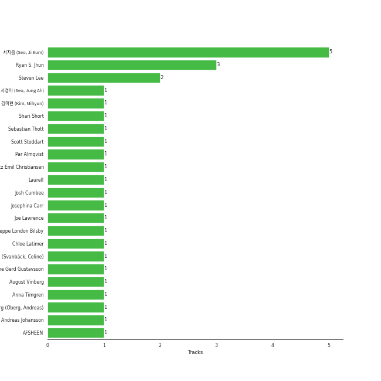

# WM Entertainment

12 songs

[See Track Features](audio_features.md)

[See Clusters](clusters/overview.md)

Appears as:
- WM Entertainment (11 tracks)
- WM ENTERTAINMENT INC. (1 tracks)

## Top Artists

| Art | Tracks | 💚 | Artist | 🔗 |
|:---|---:|---:|:---|:---|
|  | 7 | 6 | [OH MY GIRL](../../artists/oh_my_girl/overview.md) | [🔗](https://open.spotify.com/artist/2019zR22qK2RBvCqtudBaI) |
|  | 3 | 1 | YooA | [🔗](https://open.spotify.com/artist/4ur1jCwyNlhgd0viJkOtcQ) |
|  | 1 | 0 | Sandeul | [🔗](https://open.spotify.com/artist/2QeJBmgBdpH4i3uJns5Rdx) |
|  | 1 | 0 | OH MY GIRL BANHANA | [🔗](https://open.spotify.com/artist/0X1f2U9bxiC3DhKA8OcvgG) |
|  | 1 | 0 | Whee In | [🔗](https://open.spotify.com/artist/0BqRGrwqndrtNkojXiqIzL) |

## Top Albums

| Art | Tracks | 💚 | Album | Release Date | 🔗 |
|:---|---:|---:|:---|:---|:---|
|  | 2 | 2 | NONSTOP | 2020-04-27 | [🔗](https://open.spotify.com/album/7J8Kp48L7RdLkpjSVrO5PY) |
|  | 2 | 2 | Dear OHMYGIRL | 2021-05-10 | [🔗](https://open.spotify.com/album/2xfmLni05CCgygcNdtPvuN) |
|  | 1 | 1 | THE FIFTH SEASON | 2019-05-08 | [🔗](https://open.spotify.com/album/7nRRZFQgQKQsXG7mQIuQPA) |
|  | 1 | 1 | CLOSER | 2015-10-08 | [🔗](https://open.spotify.com/album/08iyrLkLFP2ByBkqVhBls7) |
|  | 1 | 1 | Bon Voyage | 2020-09-07 | [🔗](https://open.spotify.com/album/2dFsfVOAwvmRV8hOBdssiI) |
|  | 1 | 0 | WINDY DAY | 2016 | [🔗](https://open.spotify.com/album/7coV2krimvobeWltmNvYeC) |
|  | 1 | 0 | Stay As You Are | 2016-10-04 | [🔗](https://open.spotify.com/album/6DKfXf0BVP9R5BcOuD1mfo) |
|  | 1 | 0 | SELFISH | 2022-11-14 | [🔗](https://open.spotify.com/album/3vjPlBK3ASSMLfQwuiHspd) |
|  | 1 | 0 | Borderline | 2024-03-14 | [🔗](https://open.spotify.com/album/3oKhPahFFjuFVbZfWprIkB) |
|  | 1 | 0 | BANANA ALLERGY MONKEY | 2018-04-02 | [🔗](https://open.spotify.com/album/5KuGBZ8VDDWM47WK2hs0PV) |

## Genres

| Tracks | 💚 | Genre |
|---:|---:|:---|
| 8 | 6 | [k-pop girl group](../../genres/k-pop_girl_group/overview.md) |
| 7 | 6 | [k-pop](../../genres/k-pop/overview.md) |
| 3 | 1 | [5th gen k-pop](../../genres/5th_gen_k-pop/overview.md) |
| 1 | 0 | [korean pop](../../genres/korean_pop/overview.md) |

## Top Producers

| Art | Producer | Tracks | Credit Types |
|:---|:---|---:|:---|
| | [서지음 (Seo, Ji Eum)](../../producers/서지음_(seo,_ji_eum)/overview.md) | 5 | Lyricist |
| | [Ryan S. Jhun](../../producers/ryan_s__jhun/overview.md) | 3 | Arranger, Songwriter, Lyricist |
| | Steven Lee | 2 | Arranger, Songwriter |
| | Jeppe London Bilsby | 1 | Arranger, Songwriter |
| | Lauritz Emil Christiansen | 1 | Arranger, Songwriter |
| | Andreas Johansson | 1 | Songwriter |
| | Celine Svanbäck (Svanbäck, Celine) | 1 | Arranger, Songwriter |
| | Caroline Gerd Gustavsson | 1 | Songwriter |
| | AFSHEEN | 1 | Arranger, Songwriter |
| | Shari Short | 1 | Songwriter |

View all

| Art | Producer | Tracks | Credit Types |
|:---|:---|---:|:---|
| | Josh Cumbee | 1 | Arranger, Songwriter |
| | 김미현 (Kim, Mihyun) | 1 | Lyricist |
| | Scott Stoddart | 1 | Arranger, Lyricist, Songwriter |
| | Joe Lawrence | 1 | Arranger, Songwriter |
| | Laurell | 1 | Songwriter |
| | August Vinberg | 1 | Songwriter |
| | Anna Timgren | 1 | Lyricist, Songwriter |
| | Andreas Öberg (Öberg, Andreas) | 1 | Songwriter |
| | Par Almqvist | 1 | Arranger, Songwriter |
| | Chloe Latimer | 1 | Arranger, Songwriter |
| | 서정아 (Seo, Jung Ah) | 1 | Lyricist |
| | Josephina Carr | 1 | Songwriter |
| | Sebastian Thott | 1 | Arranger, Songwriter |

## Tracks released under WM Entertainment

| Art | Track | Album | Artists | Label | Rank | 💚 | 🔗 |
|:---|:---|:---|:---|:---|---:|:---|:---|
|  | Dolphin | NONSTOP | [OH MY GIRL](../../artists/oh_my_girl/overview.md) | [WM Entertainment](.) | 163 | 💚 | [🔗](https://open.spotify.com/track/3NfgdU9mbIVhcJF3XvC0c9) |
|  | Rooftop | Borderline | YooA | [WM ENTERTAINMENT INC.](.) | 611 | | [🔗](https://open.spotify.com/track/2t3F6nsQqEw60KT8ma8dm4) |
|  | SAY NO MORE | CLOSER | [OH MY GIRL](../../artists/oh_my_girl/overview.md) | [WM Entertainment](.) | 838 | 💚 | [🔗](https://open.spotify.com/track/3vFAa5RYxyZmxTuV0YE9Em) |
|  | WINDY DAY | WINDY DAY | [OH MY GIRL](../../artists/oh_my_girl/overview.md) | [WM Entertainment](.) | 838 | | [🔗](https://open.spotify.com/track/7prrcyZc48tO9hGzdnU9aD) |
|  | Ya! (feat. Whee In) | Stay As You Are | Sandeul, Whee In | [WM Entertainment](.) | 838 | | [🔗](https://open.spotify.com/track/24HGlde2QMGAigs6bDdEhS) |
|  | Banana Allergy Monkey | BANANA ALLERGY MONKEY | OH MY GIRL BANHANA | [WM Entertainment](.) | 838 | | [🔗](https://open.spotify.com/track/65AWCpJajDOVyllaFigbi9) |
|  | 5th Season (SSFWL) | THE FIFTH SEASON | [OH MY GIRL](../../artists/oh_my_girl/overview.md) | [WM Entertainment](.) | 838 | 💚 | [🔗](https://open.spotify.com/track/2o0H0o6gWgnegtqkuOhtZk) |
|  | Nonstop | NONSTOP | [OH MY GIRL](../../artists/oh_my_girl/overview.md) | [WM Entertainment](.) | 838 | 💚 | [🔗](https://open.spotify.com/track/5joNJn9LUvYcamWwa2iYCL) |
|  | Bon voyage | Bon Voyage | YooA | [WM Entertainment](.) | 838 | 💚 | [🔗](https://open.spotify.com/track/4X95Ecd1elHxTccGOko02c) |
|  | Dun Dun Dance | Dear OHMYGIRL | [OH MY GIRL](../../artists/oh_my_girl/overview.md) | [WM Entertainment](.) | 838 | 💚 | [🔗](https://open.spotify.com/track/54HsCR7lJJdwxmEnTY1JfF) |

See all tracks

| Art | Track | Album | Artists | Label | Rank | 💚 | 🔗 |
|:---|:---|:---|:---|:---|---:|:---|:---|
|  | My doll | Dear OHMYGIRL | [OH MY GIRL](../../artists/oh_my_girl/overview.md) | [WM Entertainment](.) | 838 | 💚 | [🔗](https://open.spotify.com/track/46aqH0mV4yiwWggx0ynrbw) |
|  | Selfish | SELFISH | YooA | [WM Entertainment](.) | 838 | | [🔗](https://open.spotify.com/track/4NQ2EqWimM05dRSdHrmkdf) |

