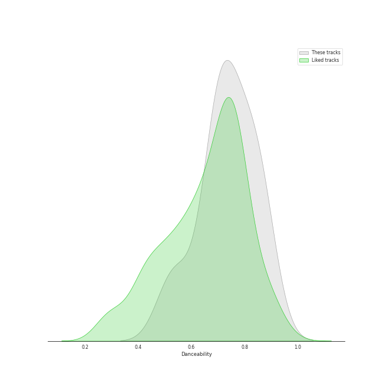
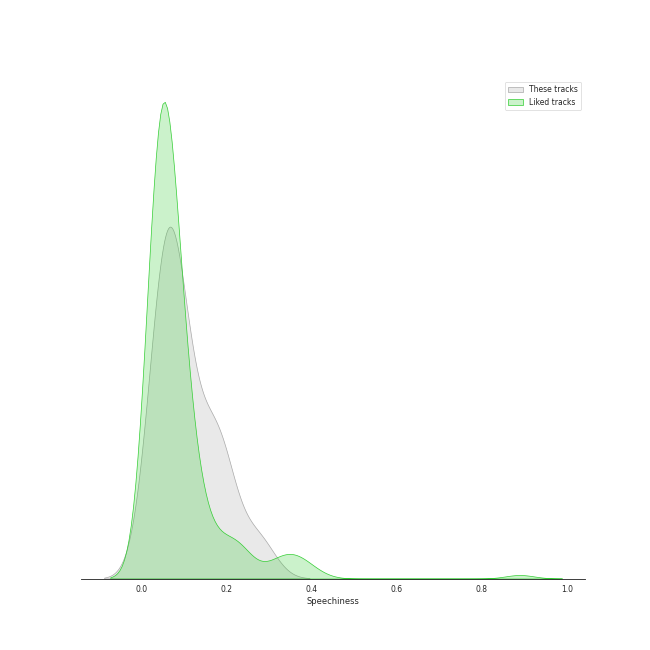

# Track Features for WM Japan

## Danceability

| ​ | 10 most Danceable tracks | ​​ | 10 least Danceable tracks |
|:---|:---|:---|:---|
|  | Breakthrough (0.868) |  | BLAME IT ON ME (0.485) |
|  | In the morning (0.846) |  | Funny Valentine (0.553) |
|  | Blah Blah Blah (0.842) |  | I CAN'T STOP ME (0.657) |
|  | The Feels (0.808) |  | ZOOM ZOOM (0.674) |
|  | CAKE (0.801) |  | Perfect World (0.684) |
|  | WALLFLOWER (0.798) |  | It's not easy for you (0.694) |
|  | Cheshire (0.79) |  | Kill Shot (0.712) |
|  | RINGO (0.78) |  | Behind The Curtain (0.72) |
|  | None of My Business (0.769) |  | Do not touch (0.72) |
|  | LOCO (0.759) |  | Killin′ Me Good (0.742) |

## Energy

| ​ | 10 most Energetic tracks | ​​ | 10 least Energetic tracks |
|:---|:---|:---|:---|
|  | ZOOM ZOOM (0.941) |  | Behind The Curtain (0.63) |
|  | RINGO (0.921) |  | BLAME IT ON ME (0.693) |
|  | Killin′ Me Good (0.921) |  | Funny Valentine (0.707) |
|  | The Feels (0.903) |  | Breakthrough (0.728) |
|  | Blah Blah Blah (0.899) |  | It's not easy for you (0.755) |
|  | Voltage (0.896) |  | CAKE (0.762) |
|  | Voltage (0.893) |  | MOONLIGHT SUNRISE (0.782) |
|  | LOCO (0.886) |  | None of My Business (0.784) |
|  | I CAN'T STOP ME (0.88) |  | Do not touch (0.787) |
|  | Perfect World (0.877) |  | Kill Shot (0.795) |

## Speechiness

| ​ | 10 most Speechy tracks | ​​ | 10 least Speechy tracks |
|:---|:---|:---|:---|
|  | Blah Blah Blah (0.192) |  | It's not easy for you (0.0328) |
|  | Do not touch (0.188) |  | Behind The Curtain (0.0437) |
|  | LOCO (0.187) |  | CAKE (0.0439) |
|  | SET ME FREE (0.157) |  | Funny Valentine (0.0466) |
|  | In the morning (0.149) |  | BLAME IT ON ME (0.0489) |
|  | Kill Shot (0.123) |  | Cheshire (0.0501) |
|  | Breakthrough (0.11) |  | WALLFLOWER (0.0578) |
|  | I CAN'T STOP ME (0.102) |  | Perfect World (0.0611) |
|  | RINGO (0.0796) |  | MOONLIGHT SUNRISE (0.0622) |
|  | ZOOM ZOOM (0.0791) |  | Voltage (0.0694) |

## Acousticness

| ​ | 10 most Acoustic tracks | ​​ | 10 least Acoustic tracks |
|:---|:---|:---|:---|
|  | None of My Business (0.539) |  | LOCO (0.0103) |
|  | MOONLIGHT SUNRISE (0.384) |  | Blah Blah Blah (0.0238) |
|  | Cheshire (0.332) |  | ZOOM ZOOM (0.0322) |
|  | Funny Valentine (0.297) |  | Voltage (0.0428) |
|  | WALLFLOWER (0.279) |  | Voltage (0.043) |
|  | Killin′ Me Good (0.207) |  | Breakthrough (0.0439) |
|  | It's not easy for you (0.195) |  | Perfect World (0.0477) |
|  | Behind The Curtain (0.184) |  | CAKE (0.0647) |
|  | BLAME IT ON ME (0.177) |  | In the morning (0.0823) |
|  | Kill Shot (0.143) |  | SET ME FREE (0.0897) |

## Instrumentalness

| ​ | 10 most Instrumental tracks | ​​ | 10 least Instrumental tracks |
|:---|:---|:---|:---|
|  | In the morning (0.00094) |  | Killin′ Me Good (0.0) |
|  | ZOOM ZOOM (2.09e-05) |  | Perfect World (0.0) |
|  | LOCO (2.04e-05) |  | Behind The Curtain (0.0) |
|  | Cheshire (7.07e-06) |  | SET ME FREE (0.0) |
|  | CAKE (6.53e-06) |  | The Feels (0.0) |
|  | MOONLIGHT SUNRISE (2.12e-06) |  | It's not easy for you (0.0) |
|  | WALLFLOWER (2.02e-06) |  | RINGO (0.0) |
|  | Kill Shot (1.33e-06) |  | I CAN'T STOP ME (0.0) |
|  | Voltage (0.0) |  | None of My Business (0.0) |
|  | Voltage (0.0) |  | Funny Valentine (0.0) |

## Liveness

| ​ | 10 most Live tracks | ​​ | 10 least Live tracks |
|:---|:---|:---|:---|
|  | I CAN'T STOP ME (0.463) |  | Do not touch (0.0418) |
|  | None of My Business (0.411) |  | CAKE (0.0438) |
|  | Cheshire (0.357) |  | Killin′ Me Good (0.0446) |
|  | RINGO (0.347) |  | SET ME FREE (0.0505) |
|  | Blah Blah Blah (0.345) |  | The Feels (0.0816) |
|  | Perfect World (0.344) |  | MOONLIGHT SUNRISE (0.0862) |
|  | LOCO (0.342) |  | Breakthrough (0.0975) |
|  | ZOOM ZOOM (0.338) |  | Voltage (0.104) |
|  | Behind The Curtain (0.28) |  | It's not easy for you (0.105) |
|  | BLAME IT ON ME (0.255) |  | Funny Valentine (0.107) |

## Valence

| ​ | 10 most Happy tracks | ​​ | 10 least Happy tracks |
|:---|:---|:---|:---|
|  | The Feels (0.922) |  | Voltage (0.384) |
|  | Blah Blah Blah (0.881) |  | Voltage (0.386) |
|  | Do not touch (0.842) |  | LOCO (0.489) |
|  | RINGO (0.828) |  | None of My Business (0.583) |
|  | Kill Shot (0.821) |  | CAKE (0.589) |
|  | I CAN'T STOP ME (0.769) |  | Perfect World (0.599) |
|  | Behind The Curtain (0.745) |  | MOONLIGHT SUNRISE (0.6) |
|  | Cheshire (0.738) |  | It's not easy for you (0.603) |
|  | ZOOM ZOOM (0.723) |  | WALLFLOWER (0.616) |
|  | In the morning (0.722) |  | Breakthrough (0.616) |

## Tempo

| ​ | 10 most Fast tracks | ​​ | 10 least Fast tracks |
|:---|:---|:---|:---|
|  | Funny Valentine (185.968) |  | It's not easy for you (80.017) |
|  | BLAME IT ON ME (177.813) |  | Behind The Curtain (82.449) |
|  | I CAN'T STOP ME (150.084) |  | None of My Business (97.998) |
|  | Do not touch (149.972) |  | Cheshire (98.966) |
|  | In the morning (140.055) |  | Kill Shot (100.122) |
|  | Perfect World (134.98) |  | LOCO (102.065) |
|  | MOONLIGHT SUNRISE (125.062) |  | CAKE (103.07) |
|  | ZOOM ZOOM (124.962) |  | Voltage (107.002) |
|  | The Feels (120.044) |  | Voltage (107.003) |
|  | RINGO (119.998) |  | Killin′ Me Good (111.967) |
