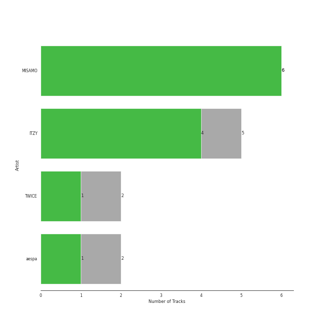

# WM Japan

10 songs

Appears as:
- WM Japan (10 tracks)

## Top Artists

| Art | Tracks | 💚 | Artist | 🔗 |
|:---|---:|---:|:---|:---|
|  | 4 | 4 | MISAMO | [🔗](https://open.spotify.com/artist/0IwZVmMMGE7nNXS7vN9SIo) |
|  | 3 | 2 | [ITZY](../../artists/itzy/overview.md) | [🔗](https://open.spotify.com/artist/2KC9Qb60EaY0kW4eH68vr3) |
|  | 2 | 1 | [TWICE](../../artists/twice/overview.md) | [🔗](https://open.spotify.com/artist/7n2Ycct7Beij7Dj7meI4X0) |
|  | 1 | 0 | [aespa](../../artists/aespa/overview.md) | [🔗](https://open.spotify.com/artist/6YVMFz59CuY7ngCxTxjpxE) |

## Top Albums

| Art | Tracks | 💚 | Album | Release Date | 🔗 |
|:---|---:|---:|:---|:---|:---|
|  | 4 | 4 | Masterpiece | 2023-07-26 | [🔗](https://open.spotify.com/album/3qmO83vO1SsdmP1Y0ljhSQ) |
|  | 1 | 1 | Voltage | 2022-03-23 | [🔗](https://open.spotify.com/album/3MXVqfk9VG3B757nLlow0D) |
|  | 1 | 1 | RINGO | 2023-10-18 | [🔗](https://open.spotify.com/album/1kRAzoCTDLqwU6nX2I2Nmc) |
|  | 1 | 1 | Breakthrough | 2019-06-12 | [🔗](https://open.spotify.com/album/7LWfEiSeue9BXPbUOH34q6) |
|  | 1 | 0 | ZOOM ZOOM | 2023-10-06 | [🔗](https://open.spotify.com/album/1A6g2ZDdb7ggiiTXUbEuMP) |
|  | 1 | 0 | Perfect World | 2021-07-28 | [🔗](https://open.spotify.com/album/17rk8h2IU4wwSFXw9j2uR6) |
|  | 1 | 0 | Blah Blah Blah | 2022-09-21 | [🔗](https://open.spotify.com/album/0KaoPehrtwhjQfae6XMd7B) |

## Genres

| Tracks | 💚 | Genre |
|---:|---:|:---|
| 10 | 7 | [k-pop girl group](../../genres/k-pop_girl_group/overview.md) |
| 5 | 3 | [k-pop](../../genres/k-pop/overview.md) |
| 2 | 1 | [pop](../../genres/pop/overview.md) |

## Top Producers

| Art | Producer | Tracks | Credit Types |
|:---|:---|---:|:---|
| | [구혜진 (Gu, Hye-jin)](../../producers/구혜진_(gu,_hye-jin)/overview.md) | 1 | Producer |
| | [Manny Marroquin](../../producers/manny_marroquin/overview.md) | 1 | Producer |
| | Chris Galland | 1 | Producer |
| | [심은지 (Sim, Eunjee)](../../producers/심은지_(sim,_eunjee)/overview.md) | 1 | Arranger, Producer, Songwriter |
| | 常楽寺澪 (Jorakuji, Mio) | 1 | Lyricist |
| | 이민영 (Lee, Min-young) | 1 | Arranger, Producer, Songwriter |
| | Yeul | 1 | Arranger, Producer, Songwriter |

## Tracks released under WM Japan

| Art | Track | Album | Artists | Label | Rank | 💚 | 🔗 |
|:---|:---|:---|:---|:---|---:|:---|:---|
|  | It's not easy for you | Masterpiece | MISAMO | [WM Japan](.) | 86 | 💚 | [🔗](https://open.spotify.com/track/1qNk7XPTbyuO4bsDl0T6nN) |
|  | Behind The Curtain | Masterpiece | MISAMO | [WM Japan](.) | 109 | 💚 | [🔗](https://open.spotify.com/track/14nturKxV48wR3lbknehiu) |
|  | Do not touch | Masterpiece | MISAMO | [WM Japan](.) | 213 | 💚 | [🔗](https://open.spotify.com/track/5gq7xM6eI16osBO2U581NL) |
|  | RINGO | RINGO | [ITZY](../../artists/itzy/overview.md) | [WM Japan](.) | 220 | 💚 | [🔗](https://open.spotify.com/track/2zRz0XfYEtsHuVfrM8KaOP) |
|  | Funny Valentine | Masterpiece | MISAMO | [WM Japan](.) | 346 | 💚 | [🔗](https://open.spotify.com/track/4xtgQGbQnII1buKgl5fguT) |
|  | Voltage | Voltage | [ITZY](../../artists/itzy/overview.md) | [WM Japan](.) | 437 | 💚 | [🔗](https://open.spotify.com/track/7e65OAe9L0xWPSHDiahjQe) |
|  | Perfect World | Perfect World | [TWICE](../../artists/twice/overview.md) | [WM Japan](.) | 636 | | [🔗](https://open.spotify.com/track/0iuZMy88H6vxDA2oaJNhJg) |
|  | Breakthrough | Breakthrough | [TWICE](../../artists/twice/overview.md) | [WM Japan](.) | nan | 💚 | [🔗](https://open.spotify.com/track/5COO2JgOmHIJ2jsXFwflz8) |
|  | Blah Blah Blah | Blah Blah Blah | [ITZY](../../artists/itzy/overview.md) | [WM Japan](.) | nan | | [🔗](https://open.spotify.com/track/5wOWpaKW92jhcm8pBOlrdR) |
|  | ZOOM ZOOM | ZOOM ZOOM | [aespa](../../artists/aespa/overview.md) | [WM Japan](.) | nan | | [🔗](https://open.spotify.com/track/3DZwsHxTYjCcMUTcSkATPl) |
